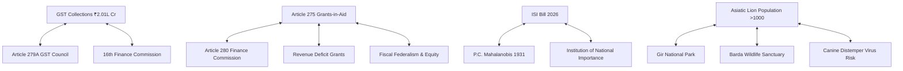

# Current Affairs — 06 August 2026

> **Source:** *The Hindu* (Editorial, Op-Ed, Text & Context, Environment)  
> **Date Added:** 2026-08-06  
> **Target Exam:** UPSC CSE 2027 (Prelims & Mains)

---

## Topic 1: Goods and Services Tax (GST) Collections & Fiscal Dynamics

> **Headlines:** *"Highs and lows: GST revenue trends and fiscal implications"*  
> **GS Paper:** GS-III (Indian Economy & Issues Relating to Planning, Mobilisation of Resources)  
> **Micro-Topic ID:** `CA-2026-08-06-01`

### 1. Key Macroeconomic Trends
* **Gross GST Collection (July 2026):** ₹2.01 lakh crore (15.4% YoY growth). Represents the second-highest monthly collection in GST history.
* **Net GST Revenue:** ₹1.71 lakh crore (10.4% YoY growth post tax refunds).
* **IGST & Trade Recovery:** Integrated GST (IGST) experienced faster recovery, signalling robust inter-state trade, domestic consumption expansion, and supply chain normalization.
* **Import GST Dynamics:** High WPI inflation (1.52% YoY) and lower gold import duties (reduced to 6%) contributed to elevated import GST revenue.

### 2. Analytical & Structural Issues for UPSC
* **Spatial Concentration:** GST growth is geographically concentrated—only 16 States/UTs recorded GST growth exceeding the national average of 11.5%.
* **Informal Sector Burden:** High GST reliance on organized enterprises contrasts with persistent distress in the unorganized/informal sector.
* **Input Tax Credit (ITC) Frictions:** Certain sectors (Real Estate, Fuel/Petroleum, Alcohol) remain excluded from the GST umbrella, causing cascading tax friction and un-credited input tax burdens.

### 3. Recommendations & Constitutional Interlinks
* **16th Finance Commission Mandate:** FC-16 (chaired by Arvind Panagariya) must evaluate tax buoyancy, broaden the GST tax base, and address horizontal fiscal disparities across states.
* **Constitutional Articles:**
  * **[Article 279A](file:///c:/Users/nitee/OneDrive/Desktop/UPSE_Syllabus/Articles/Article_279A.md):** GST Council (101st Constitutional Amendment).
  * **[Article 269A](file:///c:/Users/nitee/OneDrive/Desktop/UPSE_Syllabus/Articles/Article_269A.md):** Levy and collection of IGST on inter-state trade.

---

## Topic 2: Fiscal Federalism: Efficiency vs. Equity Concerns in FC-16

> **Headlines:** *"Fiscal federalism, efficiency versus equity concerns"* (by K.J. Joseph & Sujit Kumar)  
> **GS Paper:** GS-II (Polity & Governance — Issues and Challenges Pertaining to the Federal Structure) & GS-III (Fiscal Policy)  
> **Micro-Topic ID:** `CA-2026-08-06-02`

### 1. Constitutional Foundation of Grants-in-Aid
* **[Article 275](file:///c:/Users/nitee/OneDrive/Desktop/UPSE_Syllabus/Articles/Article_275.md) (Grants-in-Aid):** Designed as a routine institutional mechanism for horizontal fiscal equalization. Recognizes that formula-based tax devolution under **[Article 280](file:///c:/Users/nitee/OneDrive/Desktop/UPSE_Syllabus/Articles/Article_280.md)** cannot fully address state-specific structural disadvantages (e.g. Kerala's old-age demographic, hill terrain costs in HP & NE states, severe debt stress).

### 2. Key Controversies in 16th Finance Commission (FC-16)
* **Reduction in Revenue Deficit Grants (RDG):** FC-16 recommends post-devolution RDGs of ₹1.33 lakh crore to 14 states (down sharply from ₹2.94 lakh crore to 17 states under FC-15).
* **The "Grand Bargain" & Cesses/Surcharges:** The Centre has increased non-shareable cesses and surcharges (which do not enter the divisible pool), while offering to gradually merge them in exchange for a lower vertical devolution share to States.
* **Conditional Sector-Specific Grants:** Tying grants to strict performance targets in water, sanitation, and accounting reforms limits the fiscal autonomy of State governments.
* **Efficiency vs. Equity Trade-off:** FC-16 shifts weightage towards performance incentives (market efficiency), which disproportionately penalizes states with high structural costs or historical fiscal deficits.

### 3. Mains Answer Key Takeaway
> *"True fiscal federalism requires balancing market efficiency with redistributive equity. Over-reliance on conditional grants or restricting Article 275 RDGs weakens the equalizing core of India's fiscal architecture."*

---

## Topic 3: Indian Statistical Institute (ISI) Bill, 2026 & Governance Controversy

> **Headlines:** *"Why is the Indian Statistical Institute Bill controversial?"* (Text & Context)  
> **GS Paper:** GS-II (Statutory, Regulatory & Quasi-Judicial Bodies; Governance)  
> **Micro-Topic ID:** `CA-2026-08-06-03`

### 1. Historical Context of ISI
* **Founder:** Prof. P.C. Mahalanobis (father of Indian statistics) founded the Statistical Laboratory at Presidency College, Kolkata on **17 December 1931** (registered 28 April 1932 under Societies Registration Act 1860).
* **Statutory Status:** Declared an **Institution of National Importance (INI)** under the *Indian Statistical Institute Act, 1959*.

### 2. Key Changes Proposed in ISI Bill, 2026
* Replaces the 67-year-old ISI Act of 1959.
* **Governance Model Shift:** Shifts ISI from a **"learned non-profit society model"** (where the General Body of members holds ultimate legislative/administrative control) to a **corporate-style Board of Governors / Academic Council** structure (on par with IITs and IIMs).

### 3. Core Points of Contention
* **Usurpation of Autonomy:** Faculty, academics, and MPs argue that creating a central Board of Governors weakens the democratic, peer-reviewed learned society model of Mahalanobis.
* **Executive Overreach:** Gives the Central Government direct power over executive appointments (Director, Board Chairman) and policy regulations without requiring General Body ratification.

---

## Topic 4: Conservation Architecture of the Asiatic Lion

> **Headlines:** *"The road ahead for the Asiatic lion"* (by Meena Venkataraman)  
> **GS Paper:** GS-III (Environment & Biodiversity Conservation)  
> **Micro-Topic ID:** `CA-2026-08-06-04`

### 1. Species Profile & Population Dynamics
* **Species:** Asiatic Lion (*Panthera leo persica*).
* **Habitat Range:** Sole free-ranging population in the world resides in the Gir landscape (Gujarat).
* **Population Recovery:** Grown from 400–450 to **over 1,000 lions** today.
* **Key Vulnerability:** **Nearly 50% of Asiatic lions now live OUTSIDE protected areas** (Gir National Park & Sanctuary) across 9 Saurashtra districts (Bhavnagar coast, Mitiyala, Savarkundla-Liliya, Babarkot).

### 2. Major Threats & Conservation Challenges
* **Single-Landscape Vulnerability:** Concentration in a single geography creates extreme risk of catastrophic disease outbreaks (e.g. **Canine Distemper Virus - CDV** in 2018; **Babesiosis** outbreak in May 2026).
* **Habitat Fragmentation & Linear Barriers:** Proposal to divert ~75 hectares of reserved forest for limestone mining in the Babarkot corridor threatens dispersal routes.
* **Human-Wildlife Coexistence:** Increasing reliance on shared agricultural and human-dominated landscapes outside Gir.

### 3. Conservation Roadmap & Satellite Refuges
* **Barda Wildlife Sanctuary:** Designated as a crucial secondary home / satellite sanctuary in Gujarat to accommodate spillover lion populations and mitigate epidemic risks.
* **IUCN Status:** **Endangered** (Listed under Schedule I of Wildlife Protection Act, 1972; CITES Appendix I).

---

## Topic 5: India's Cancer Burden & Early Detection Focus

> **Headlines:** *"India's cancer focus must shift to early detection"* (by Dr. S.V.S. Deo)  
> **GS Paper:** GS-II (Issues Relating to Development & Management of Social Sector/Health) & GS-III (Science & Tech)  
> **Micro-Topic ID:** `CA-2026-08-06-05`

### 1. Key Health Metrics (GLOBOCAN Data)
* **Incidence:** Estimated **1.56 million new cancer cases** and over **8.74 lakh cancer deaths** in India (2024).
* **Late Diagnosis Trap:** Over **70% of cancer cases** in India are diagnosed at advanced stages (Stage III / Stage IV).
* **Regional Disparity:** Lifetime risk of developing cancer is ~11% nationally, but **exceeds 20% in North-Eastern states**.
* **Survival Disparity:** 5-year survival rate for lung cancer in India is **~4%** (compared to 33% in Japan).

### 2. Policy & Structural Requirements
* Transition health infrastructure from palliative/advanced tertiary treatment to **universal primary-level screening**.
* Address delayed diagnostic pathways and strengthen district-level oncology capacity under Ayushman Bharat / National Health Mission.

---

## 🔗 Cross-Subject Knowledge Graph Connections

---

<!-- 2026-08-06: Added 5 Current Affairs topics from The Hindu (GST, Fiscal Federalism, ISI Bill, Asiatic Lion, Cancer Focus) -->
