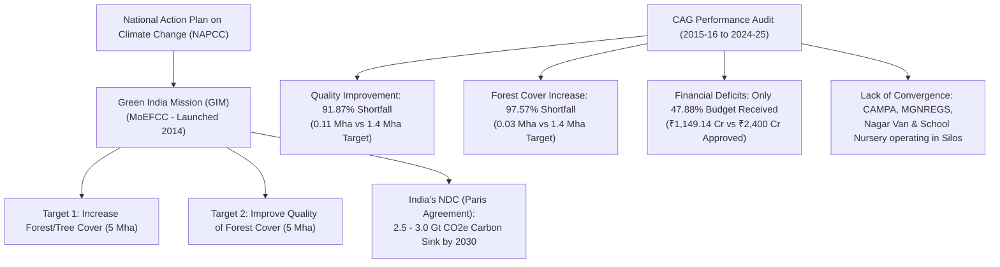

# Current Affairs - 16 August 2026

## 1. CAG Performance Audit of Green India Mission (GIM)

> **Tags:** `[GS-3: Environment & Ecology - Climate Change, NAPCC, Afforestation]` · `[GS-2: Governance & Constitutional Bodies - CAG (Articles 148-151), Scheme Convergence & Accountability]`

---

### Context & Audit Scope
* The **Comptroller and Auditor General of India (CAG)** tabled a performance audit report on the implementation of the **National Mission for a Green India (Green India Mission / GIM)**.
* **Audit Scope:** Examined the planning, implementation, funding, and monitoring of GIM interventions across **16 States and Union Territories** over a 10-year span (**2015–16 to 2024–25**).
* **Nodal Ministry:** Ministry of Environment, Forest and Climate Change (MoEFCC) (launched in 2014 under NAPCC).

---

### Key Audit Findings & Quantified Shortfalls

| Metric / Objective | Target (for 16 audited States/UTs) | Actual Achievement | Shortfall (%) |
|:---|:---:|:---:|:---:|
| **Quality of Forest Cover Improvement** | 1.40 million hectares | 0.11384 million hectares | **91.87% Shortfall** |
| **Increase in Forest / Tree Cover** | 1.40 million hectares | 0.03409 million hectares | **97.57% Shortfall** |
| **Budgetary Allocation & Support** | ₹2,400 Crore (CCEA ₹2,000 Cr + 13th FC ₹400 Cr) | ₹1,149.14 Crore received | **52.12% Deficit** (Only 47.88% received) |

---

### Structural Bottlenecks & Failure Modes Flagged by CAG

1. **Failure of Scheme Convergence (Operating in Silos):**
   * GIM was designed to achieve financial and operational synergy by converging with other forestry and rural development programmes.
   * **Key Schemas Operating in Silos:**
     * **CAMPA** (Compensatory Afforestation Fund Management and Planning Authority)
     * **MGNREGS** (Mahatma Gandhi National Rural Employment Guarantee Scheme)
     * **Nagar Van Yojana** (Urban Forestry)
     * **School Nursery Yojana**
   * Lack of institutional convergence severely crippled field-level afforestation and plantation survival rates.

2. **Severe Financial & Budgetary Starvation:**
   * GIM failed to secure **₹10,600 crore** in proposed funding support.
   * Against ₹2,000 crore approved by the Cabinet Committee on Economic Affairs (CCEA) for the initial 4 years alongside ₹400 crore from 13th Finance Commission state grants, only **₹1,149.14 crore (47.88%)** was released through budgetary support over the 10 years examined.

3. **Weak Financial Controls & Accounting Lapses:**
   * **8 States and Union Territories** failed to maintain mandatory annual accounts for GIM funds.
   * In several states, fund accounts were either completely unaudited or contained major financial discrepancies and unspent balances.

4. **Weak Planning and Deficient Monitoring Mechanisms:**
   * Absence of geo-spatial tracking, inadequate third-party physical verifications, and poor baseline surveys led to paper targets without ecological restoration on the ground.

---

### Strategic Importance: GIM, NAPCC & India's Climate Pledges

* **One of 8 NAPCC Missions:** Conceived under the *National Action Plan on Climate Change (NAPCC)* to safeguard biodiversity, enhance hydrological services, and increase forest-based livelihoods.
* **Overall 10-Year Envisaged Target:** 
  * Increase forest/tree cover over **5 million hectares (Mha)**.
  * Improve quality of degraded forest/tree cover over another **5 million hectares (Mha)** (Total 10 Mha).
* **Nationally Determined Contribution (NDC) Under Paris Agreement:**
  * India committed to creating an **additional carbon sink of 2.5 to 3.0 billion tonnes of $CO_2$ equivalent** by 2030 through additional forest and tree cover.
  * The **Long-Term Low-Carbon Development Strategy (LT-LEDS)** explicitly designates GIM as a cornerstone programme for carbon sink creation.
* **Ecosystem Services:** Forest conservation directly impacts groundwater recharge, soil stabilization, biodiversity conservation, and tribal/forest-dwellers' livelihood security under FRA 2006.

---

### Constitutional & Governance Linkages

* **Article 48A (DPSP):** Protection and improvement of environment and safeguarding of forests and wild life.
* **Article 51A(g) (Fundamental Duties):** Duty of every citizen to protect and improve the natural environment including forests, lakes, rivers, and wildlife.
* **Article 148–151 (Comptroller & Auditor General of India):** Constitutional authority conducting performance, compliance, and financial audits of Union & State schemes to uphold parliamentary financial accountability.

---

<!-- 2026-08-16: Created daily current affairs note covering CAG Performance Audit on Green India Mission (GIM), scheme convergence failures with CAMPA/MGNREGS, and NDC climate targets (GS-2/GS-3). -->
