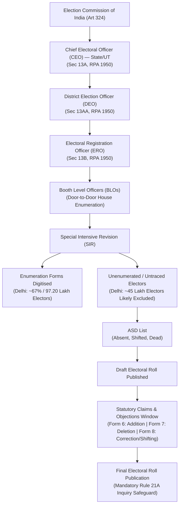
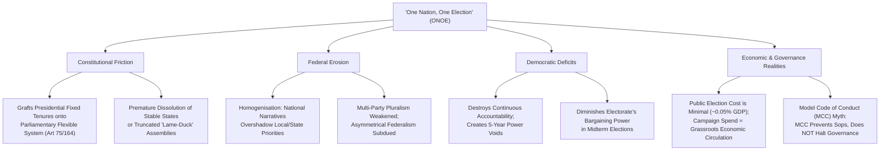

# Current Affairs — 17 August 2026

## 1. Special Intensive Revision (SIR) of Electoral Rolls & Deletion Dynamics

> **Tags:** `[GS-2: Elections & RPA — Electoral Roll Management, Representation of the People Act 1950 & 1951, Articles 324–329, Chief Electoral Officer (CEO), Booth Level Officers (BLO), Right to Vote (Article 326 / Statutory Right)]`



---

### Context & Key News Data
* **Status Report by Delhi CEO Office:** A day prior to the conclusion of the door-to-door enumeration phase under the ongoing **Special Intensive Revision (SIR)** of electoral rolls in Delhi, nearly **67% (97,20,289 out of 1,45,10,299 electors)** of enumeration forms have been digitised.
* **Exclusion from Draft Roll:** Over **45 lakh electors (~33%)** who remained unenumerated during the physical door-to-door drive are likely to be excluded from the initial **Draft Electoral Roll**.
* **District-Wise Digitisation Trend:**
  * **Highest Digitisation Rate:** *Outer North* (75.66% — 6.30 lakh forms), followed by *West* (73.17%) and *South West* (73.03%).
  * **Lowest Digitisation Rate:** *South East* (55.94% — 8.71 lakh forms), *New Delhi* (60.68%), and *South* (61.05%).
* **Remedial Window:** Electors categorized as **Absent or Shifted** will need to submit applications during the statutory **Claims and Objections period** to secure inclusion in the final electoral roll scheduled for publication on **October 27**.

---

### Conceptual & Statutory Framework of Electoral Roll Revision

#### 1. Summary Revision (SSR) vs Intensive Revision (SIR)
* **Special Summary Revision (SSR):** Conducted annually. Relies predominantly on voluntary voter self-declarations, institutional updates, and rolling qualifying dates (**January 1, April 1, July 1, October 1** under the amended *Section 14(b) of RPA 1950*).
* **Special Intensive Revision (SIR):** Comprehensive, ground-level, door-to-door physical enumeration conducted by **Booth Level Officers (BLOs)** visiting every household. Typically undertaken in fast-growing urban/migrant areas or before major general elections to eliminate ghost entries, duplicate voters, and update massive demographic shifts.

#### 2. Statutory Architecture (RPA 1950 & 1951)
* **Section 21, RPA 1950:** Mandates the preparation and revision of electoral rolls for each constituency before every general election or bye-election, under the superintendence of the ECI.
* **Section 22, RPA 1950:** Empowers Electoral Registration Officers (EROs) to correct entries, transpose names, or delete entries after giving a reasonable opportunity of being heard.
* **Section 23, RPA 1950:** Governs the inclusion of new names in the electoral roll.
* **Registration of Electors Rules, 1960 (Rule 21A):** Lays down the **mandatory procedure before deletion** of any elector's name — inquiry by the ERO, issuance of individual show-cause notice, and opportunity of being heard, preventing arbitrary summary deletions.

#### 3. Administrative Machinery
$$\text{ECI (Art 324)} \longrightarrow \text{CEO (State/UT - Sec 13A)} \longrightarrow \text{DEO (District - Sec 13AA)} \longrightarrow \text{ERO (Assembly - Sec 13B)} \longrightarrow \text{AERO} \longrightarrow \text{BLO (Polling Station)}$$

---

### The Deletion Dynamics & Safeguards

```
                      ┌────────────────────────────────────────┐
                      │    Door-to-Door Field Enumeration      │
                      └──────────────────┬─────────────────────┘
                                         │
                                         ▼
                      ┌────────────────────────────────────────┐
                      │         ASD Categorisation             │
                      │   [Absent | Shifted | Dead / Dup]      │
                      └──────────────────┬─────────────────────┘
                                         │
                                         ▼
                      ┌────────────────────────────────────────┐
                      │      Draft Electoral Roll Published    │
                      └──────────────────┬─────────────────────┘
                                         │
                                         ▼
                      ┌────────────────────────────────────────┐
                      │      Claims & Objections Window        │
                      ├────────────────────────────────────────┤
                      │ Form 6 : New Registration / Addition   │
                      │ Form 7 : Objection to / Deletion of    │
                      │ Form 8 : Correction / Shifting / PwD   │
                      └──────────────────┬─────────────────────┘
                                         │
                                         ▼
                      ┌────────────────────────────────────────┐
                      │ Rule 21A Inquiry & Notice Safeguard    │
                      └──────────────────┬─────────────────────┘
                                         │
                                         ▼
                      ┌────────────────────────────────────────┐
                      │      Final Roll Published (Oct 27)     │
                      └────────────────────────────────────────┘
```

---

### Critical UPSC Governance Analysis

1. **Urban Voter Mobility vs Disenfranchisement Risk:**
   * High exclusion figures (~33% in Delhi) illustrate urban structural issues: circular labor migration, frequent rental relocations, unauthorized colony redevelopment, and locked doors during BLO daytime visits.
   * While updating the **ASD (Absent, Shifted, Dead)** list prevents duplicate voting, sudden mass deletions without verified notice create high risks of inadvertent disenfranchisement.

2. **Nature of the Right to Vote in India:**
   * **Statutory Right with Constitutional Roots:** While traditionally classified as a statutory right created by the *Representation of the People Act, 1951* (*N.P. Ponnuswami v. Returning Officer, 1952*; *Kuldip Nayar v. Union of India, 2006*), the Supreme Court in *Anoop Baranwal v. Union of India (2023)* and *PUCL v. Union of India (2013 - NOTA case)* reaffirmed that the right to vote is an intrinsic facet of the democratic structure flowing directly from **Article 326 (Universal Adult Suffrage)**.

3. **Technological vs Ground Verification:**
   * Digitisation via the **ECI Net / BLO App / Voter Helpline App** speeds up data processing, but algorithmic purging must never bypass physical verification and personal notice safeguards under *Rule 21A*.

---

## 2. "One Nation, One Election" (ONOE) — Federal, Constitutional & Democratic Critique

> **Tags:** `[GS-2: Indian Constitution — Federalism & Basic Structure, Parliamentary vs Presidential System, Articles 83, 85, 172, 174, 356, Democratic Accountability, High-Level Committee on ONOE (Ram Nath Kovind Committee)]`



---

### Core Theoretical Conflict: Parliamentary Flexibility vs Presidential Rigidity

* **Parliamentary Accountability:** In a Westminster parliamentary system (Articles 75(3) & 164(2)), the executive derives legitimacy continuously from the confidence of the legislature. Government terms are **inherently flexible** — if a ruling coalition collapses or loses a vote of no confidence, a fresh democratic mandate must be sought.
* **Presidential Mechanics:** Fixed 4-year or 5-year calendar tenures exist in presidential systems (e.g., USA) where the executive is directly elected and functionally independent of legislative confidence.
* **Structural Clash:** Grafting fixed calendar synchronisation onto a parliamentary democracy creates insurmountable constitutional contradictions whenever a government loses majority support mid-way.

---

### Key Structural & Democratic Critique (Shashi Tharoor's Op-Ed Analysis)

#### 1. The Dilemma of Midterm Collapse & Mandate Distortion
When a state government collapses prematurely during a synchronised 5-year cycle, ONOE creates three undemocratic outcomes:
1. **Truncated Midterm Assemblies (The Unexpired Residual Term Trap):**
   * Assemblies elected only to serve the *remainder* of the 5-year cycle (e.g., 18–24 months).
   * Generates weak, insecure, **"lame-duck" administrations** where bureaucrats, legislators, and political opponents simply run down the clock rather than implementing long-term structural reforms.
2. **Subversion of Voter Leverage:**
   * Citizens voting in a truncated midterm election are handed significantly less democratic leverage and political bargaining power than voters casting ballots at the dawn of a full 5-year cycle.
3. **Assault on State Sovereignty / Misuse of Article 356:**
   * Dissolving stable, functional State Assemblies prematurely just because the Union Government fell in New Delhi is a direct assault on the state electorate's sovereign mandate.
   * Conversely, holding fallen state assemblies under extended **President's Rule (Article 356)** until the next synchronized national date subverts constitutional democracy and violates the *S.R. Bommai (1994)* principles.

#### 2. Subordination of Federalism & Erasure of Local Issues
* **Article 1 — Union of States:** India's federalism accommodates diverse linguistic, cultural, and socio-economic regional realities.
* **National Narrative Hegemony:** Combining national and state elections into a single mega-event blurs distinct boundaries. National political parties with centralized war chests and dominant media machinery inevitably overshadow regional issues (local infrastructure, regional welfare, irrigation, linguistic preservation) with high-decibel national security and geopolitical rhetoric.
* **Coercive Uniformity:** Creates majoritarian and psychological pressure on voters to install identical parties at both Centre and State, penalising states choosing independent political paths.

#### 3. Deconstructing Financial & "Policy Paralysis" Justifications

| Argument for ONOE | Detailed Counter-Analysis & Ground Reality |
|:---|:---|
| **"Elections Drain Public Exchequer"** | * Conflates minimal official administrative election expenditure incurred by the State with private party campaign spending.<br/>* ECI administrative costs are minuscule relative to India's scale (~0.05% of Union budget).<br/>* Party campaign expenditure functions as a form of **grassroots informal economic redistribution** — circulating capital directly to local transport operators, printers, event workers, artisans, and petty vendors. |
| **"Model Code of Conduct (MCC) Paralyzes Governance"** | * **Myth of Policy Paralysis:** MCC strictly prevents the ruling party from announcing opportunistic, unbudgeted sops, inaugurating new populist projects, or ordering politically biased transfers during the poll window.<br/>* MCC does **not** freeze ongoing public works, routine administration, welfare delivery, or disaster response. |
| **"Frequent Elections Waste Time"** | * Continuous electoral cycles act as an indispensable **check on executive hubris**, forcing elected representatives to return regularly to their constituents.<br/>* A single synchronised vote creates a **5-year accountability void** where politicians remain insulated from public sentiment. |

---

### Constitutional Amendments Matrix Required for ONOE

Implementing simultaneous elections would necessitate widespread constitutional surgery, including:

| Article | Existing Constitutional Provision | Required ONOE Amendment |
|:---|:---|:---|
| **Article 83** | 5-year duration of Lok Sabha from date of first meeting | Provision for synchronised duration & truncated mid-term dissolution |
| **Article 85** | Prorogation and dissolution of Lok Sabha by President | Curtailment / alignment of dissolution mechanisms |
| **Article 172** | 5-year duration of State Legislative Assemblies | Provision for synchronized duration & truncated mid-term dissolution |
| **Article 174** | Dissolution of State Legislative Assemblies by Governor | Alignment of Governor's dissolution power with national election schedule |
| **Article 356** | President's Rule in case of failure of constitutional machinery | Limitations on caretaker mechanisms / assembly suspension |
| **Article 325 & RPA 1950/1951** | Separate state and parliamentary electoral rolls | Single common electoral roll & single voter registration process |
| **Article 368(2) Proviso** | Requirement of State Ratification ($\ge 50\%$ States) | **Mandatory:** Amendments directly alter federal distribution of power & state legislature tenures |

---

### Comparative Takeaway: Historic Context
* India held simultaneous elections for Lok Sabha and State Legislative Assemblies in **1952, 1957, 1962, and 1967**.
* The cycle broke down naturally in **1968–1969** due to premature dissolutions of State Assemblies (via defections and Article 356) and the early dissolution of the 4th Lok Sabha in **1970** — demonstrating that *electoral rhythms in a multi-party parliamentary federal democracy cannot be mechanically frozen by legislative fiat*.

---

<!-- 2026-08-17: Created daily current affairs note covering (1) Special Intensive Revision (SIR) of Electoral Rolls, ASD Lists, BLO verification & deletion safeguards under RPA 1950 / Rule 21A, and (2) One Nation One Election (ONOE) constitutional, federal, democratic & economic critique (GS-2). -->
