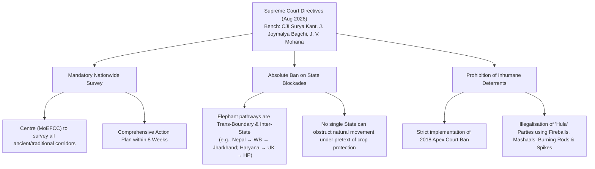
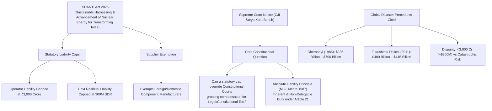

# Current Affairs — 18 August 2026

## 1. Supreme Court Nationwide Survey on Elephant Corridors & Prohibition of State Blockades

> **Tags:** `[GS-3: Environment & Ecology — Wildlife Conservation, Project Elephant 1992, Elephant Corridors (Right of Passage), Human-Elephant Conflict (HEC), Wild Life (Protection) Act 1972 (Schedule I), Asian Elephant (Elephas maximus), Article 48A & 51A(g)]`



---

### Context & Key News Data
* **Supreme Court Order:** A three-judge Bench comprising **Chief Justice of India Surya Kant, Justice Joymalya Bagchi, and Justice V. Mohana** directed the Union Government to conduct a **comprehensive nationwide survey** of traditional elephant corridors and submit an action plan within **eight weeks** (Centre represented by Additional Solicitor General Aishwarya Bhati).
* **Core Judicial Pronouncement:** The Court categorically held that:
  > *"No State can block their [elephants'] paths. Blockading elephant corridors is not the solution to human-animal conflicts. Elephants travel across many States. One State cannot come in their way and block their traditional pathways... Construction of any kind of obstacle or creating blockades in elephant corridors is not acceptable."*
* **Ban on Inhumane Deterrents Reaffirmed:**
  * The Court ordered strict enforcement of its **2018 prohibition** declaring the use of fireballs, *mashaals* (fire-torches), burning iron rods, and spikes to chase away wild elephants as **"barbaric and illegal"**.
  * Specific scrutiny was placed on **'Hula' parties** (informal driving squads in West Bengal) using fire and spikes against herds migrating from Nepal through North Bengal towards Jharkhand and Odisha.
* **Geographical Scope of Trans-Boundary Elephant Corridors:**
  * **Eastern Landscape:** Nepal $\leftrightarrow$ West Bengal $\leftrightarrow$ Jharkhand $\leftrightarrow$ Odisha.
  * **Northern Landscape:** Yamunanagar (Haryana) $\leftrightarrow$ Uttarakhand (Rajaji-Corbett) $\leftrightarrow$ Himachal Pradesh.
  * **North-Eastern Landscape:** Assam corridors (e.g., National Highway 17 crossing at Boko, outskirts of Guwahati).

---

### Statutory & Ecological Protection Matrix

| Parameter | Statutory / Ecological Classification | UPSC Prelims & Mains Relevance |
|:---|:---|:---|
| **Scientific Name** | *Elephas maximus indicus* (Asian Elephant) | Subspecies of Asian Elephant; Mega-herbivore & Keystone species. |
| **Wild Life (Protection) Act, 1972** | **Schedule I** | Highest degree of legal protection; absolute prohibition on hunting, capturing, or harming under Section 9 & 51. |
| **IUCN Red List Status** | **Endangered** (Asian Elephant) | Categorized globally as Endangered due to habitat fragmentation and poaching. |
| **CITES** | **Appendix I** | Strict ban on international commercial trade in specimens and ivory. |
| **CMS (Bonn Convention)** | **Appendix I** | Added to Appendix I at CMS COP13 (Gandhinagar, 2020) recognizing trans-boundary migratory nature. |
| **National Status** | **National Heritage Animal of India** | Declared in 2010 based on the Elephant Task Force (*Gajah* Report) recommendation. |
| **Flagship Scheme** | **Project Elephant (1992)** | Centrally Sponsored Scheme to protect elephant habitats, corridors, and mitigate HEC (merged under Project Tiger & Elephant umbrella). |

---

### Conceptual Framework: Elephant Corridors & Human-Elephant Conflict (HEC)

```
                              ┌──────────────────────────────────┐
                              │  Linear Infrastructure Intrusion │
                              │   (Highways, Railways, Canals)   │
                              └─────────────────┬────────────────┘
                                                │
                                                ▼
┌──────────────────────────────┐      ┌──────────────────┐      ┌──────────────────────────────┐
│  Agricultural Encroachment   │ ───► │  Habitat & Range │ ◄─── │   State Border Blockades     │
│  & Crop-Raiding Hotspots     │      │  Fragmentation   │      │   & Inhumane 'Hula' Parties  │
└──────────────────────────────┘      └─────────┬────────┘      └──────────────────────────────┘
                                                │
                                                ▼
                              ┌──────────────────────────────────┐
                              │    Escalating Human-Elephant     │
                              │          Conflict (HEC)          │
                              └─────────────────┬────────────────┘
                                                │
                                                ▼
                              ┌──────────────────────────────────┐
                              │     Judicial Remedy (SC 2026)    │
                              │  - Nationwide Corridor Survey    │
                              │  - Free Ecological Passage       │
                              │  - Enforcement of Fire/Spike Ban │
                              └──────────────────────────────────┘
```

#### 1. What are Elephant Corridors?
* Narrow strips of ecologically viable land that connect two larger, viable elephant habitats/forest patches (*Right of Passage* report by Wildlife Trust of India / Project Elephant).
* Over **150 identified elephant corridors** exist across India, functioning as genetic bridges preventing inbreeding and allowing seasonal foraging and migration.

#### 2. Ecological Federalism & Inter-State Migration
* Wild elephants do not conform to administrative state borders. When one State builds physical fences or barricades at its border, it bottles up migrating herds, intensifying human-elephant conflict in bordering districts.
* The Supreme Court's ruling establishes **Ecological Federalism** — natural migratory paths are national ecological assets protected under **Article 48A** (State duty to safeguard forests and wildlife) and **Article 51A(g)** (Fundamental Duty to show compassion for living creatures).

#### 3. Sustainable Mitigation Strategies vs Barbaric Practices
* **Banned / Prohibited Methods:** Fireballs, spiked gates, electrified fences above lethal voltage, trenches blocking natural pathways, and aggressive driving parties.
* **Scientifically Approved Interventions:**
  * **Linear Infrastructure Mitigation:** Elevated highways, eco-bridges, and dedicated animal underpasses/overpasses (e.g., NH-7 Kanha-Pench model; NH-17 Boko mitigation).
  * **Bio-Fencing & Biological Deterrents:** Chili-tobacco fences, citrus plantation buffers, and **Project RE-HAB** (Reducing Elephant-Human Attacks using Bees by KVIC).
  * **Real-Time Warning Systems:** AI-enabled thermal optical sensor cameras (e.g., Gajraj System on railway tracks), automated acoustic detectors, and SMS geofence alerts.
  * **Community Co-existence:** Local *Gaja Mitras* (Elephant Friends), rapid ex-gratia compensation for crop loss to prevent retaliatory killings.

---

## 2. SHANTI Act 2025 vs Constitutional Tort & Nuclear Liability Caps (Supreme Court Notice)

> **Tags:** `[GS-3: Science & Technology / Energy — Civil Nuclear Energy, Nuclear Liability Regime, Small Modular Reactors (SMRs), AERB, Disaster Management]`, `[GS-2: Constitutional Law — Articles 21, 32, 226, Doctrine of Absolute Liability (M.C. Mehta 1987), Law of Torts, Convention on Supplementary Compensation (CSC)]`



---

### Context & Key News Data
* **Supreme Court Scrutiny:** The Supreme Court issued formal notice to the **Union Government** and the **Atomic Energy Regulatory Board (AERB)** on a petition filed by advocates Prashant Bhushan and Neha Rathi challenging provisions of the **Sustainable Harnessing and Advancement of Nuclear Energy for Transforming India (SHANTI) Act of 2025**.
* **Key Oral Observation by CJI Surya Kant:**
  > *"What is the prohibition on a constitutional court to grant suitable compensation against a lawful/legal tort? In case of a legal tort, the court can always grant [suitable compensation]."*
* **Provisions Challenged under the SHANTI Act, 2025:**
  1. **Operator Liability Cap:** Capped at **₹3,000 crore** (~$360 million) for the largest nuclear plant operators.
  2. **Government Residual Liability Cap:** Capped at **300 million Special Drawing Rights (SDR)**.
  3. **Supplier Immunity:** Exempts suppliers, designers, and equipment manufacturers from liability, shifting total operational risk to the operator and exchequer.
* **Grounds of Challenge:** Petitioners argued that capping liability at a fraction of realistic clean-up/loss costs creates **moral hazard**, allowing suppliers and operators to cut safety corners, thereby violating the fundamental Right to Life under **Article 21**.

---

### Statutory & Comparative Evolution of Nuclear Liability in India

```
┌──────────────────────────────────────────────────┐
│   Civil Liability for Nuclear Damage Act (CLNDA) │
│                       2010                       │
├──────────────────────────────────────────────────┤
│ • Section 17(b): Operator had Right of Recourse  │
│   against supplier if defect/substandard supply  │
│ • Strong deterrent against foreign suppliers     │
│ • Caused friction in Indo-US / Indo-French deals │
└────────────────────────┬─────────────────────────┘
                         │
                         ▼
┌──────────────────────────────────────────────────┐
│                SHANTI Act, 2025                  │
├──────────────────────────────────────────────────┤
│ • Aim: Accelerate private/foreign capital in SMRs│
│   and civil nuclear energy expansion.            │
│ • Operator Cap: ₹3,000 Crore.                    │
│ • Govt Residual Cap: 300 Million SDR.            │
│ • Exempts suppliers to unlock technology transfer│
└────────────────────────┬─────────────────────────┘
                         │
                         ▼
┌──────────────────────────────────────────────────┐
│     Constitutional Challenge before SC (2026)    │
├──────────────────────────────────────────────────┤
│ • Infringement of M.C. Mehta Absolute Liability  │
│ • Statutory Act cannot abridge Art 32/226 powers │
│ • Disproportionate cap vs Chernobyl/Fukushima    │
└──────────────────────────────────────────────────┘
```

---

### Constitutional & Jurisprudential Doctrines Involved

#### 1. Doctrine of Absolute Liability (*M.C. Mehta v. Union of India, 1987*)
* Formulated by the Constitution Bench headed by CJI P.N. Bhagwati post-*Oleum Gas Leak case* and *Bhopal Gas Leak (1984)*.
* **Departure from Strict Liability (*Rylands v. Fletcher, 1868*):**
  * *Strict Liability* permitted exceptions (Act of God, third-party act, plaintiff's fault).
  * *Absolute Liability* admits **NO EXCEPTIONS**. Any enterprise engaged in an inherently dangerous or hazardous industrial activity (such as nuclear fission) owes an **absolute, non-delegable duty** to ensure no harm is caused, and liability is uncapped and proportional to enterprise capacity.

#### 2. Constitutional Tort & Article 21
* A **Constitutional Tort** is a civil wrong resulting from the violation of a Fundamental Right (especially Article 21 — Right to Life and Clean Environment) by State action or dangerous State-licensed enterprises.
* The Supreme Court (*Rudul Sah 1983*, *Nilabati Behera 1993*) established that constitutional courts exercising writ jurisdiction under **Article 32** and **Article 226** have an inherent power to award public law damages, which **cannot be circumscribed or ousted by ordinary parliamentary statutes**.

#### 3. International Framework: Convention on Supplementary Compensation (CSC)
* Adopted by the IAEA in 1997; ratified by India in 2016.
* Establishes a global two-tier regime: Tier 1 (Operator/National compensation fund) and Tier 2 (International public fund based on installed nuclear capacity).
* Requires strict operator channelling (holding only the operator liable to streamline claims), which the SHANTI Act 2025 seeks to align with, but which conflicts with Indian public interest jurisprudence on supplier accountability.

---

### UPSC Mains Analytical Dimensions

| Dimension | Policy / Industrial Perspective | Constitutional / Public Safety Perspective |
|:---|:---|:---|
| **Energy Transition & SMR Deployment** | Clean baseload energy is vital for India's 2070 Net Zero targets. High supplier liability stalled investment for 15 years post-CLNDA 2010. Capping liability attracts global technology and private capital for Small Modular Reactors (SMRs). | Protecting life and the environment cannot be subordinated to commercial convenience. Uncapped or realistic liability enforces uncompromising engineering standards and safety redundancy. |
| **Fiscal Burden on Public Exchequer** | National Nuclear Insurance Pools and government backstops absorb tail-risk disasters that private insurance markets cannot underwrite. | When private operators/suppliers profit from nuclear generation while taxpayer funds bear residual multi-billion-dollar disaster clean-up, it creates privatized profit and socialized catastrophe. |
| **Judicial Review vs Legislative Competence** | Parliament possesses sovereign legislative power to define statutory limits for economic activities and civil claims under Entry 6 of List I (Atomic Energy). | Parliament cannot pass legislation that dilutes the core essence of Article 21 or restricts the constitutional remedy under Article 32 (a basic structure feature). |

---

<!-- 2026-08-18: Created daily current affairs note covering (1) SC nationwide survey order on elephant corridors, prohibition of state blockades, ban on barbaric deterrents (fireballs/spikes), and WPA 1972 Schedule I status, and (2) SC notice on SHANTI Act 2025 nuclear liability caps vs Absolute Liability (M.C. Mehta), Article 21/32 constitutional tort, and international benchmarks (GS-2 & GS-3). -->
