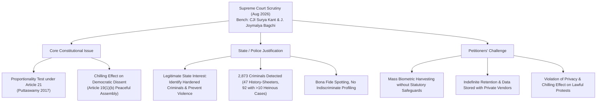
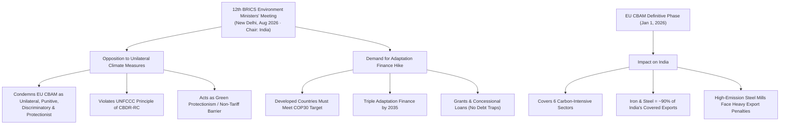

# Current Affairs — 19 August 2026

## 1. Supreme Court Scrutiny on Facial Recognition System (FRS) at Protests & The Proportionality Test

> **Tags:** `[GS-2: Indian Constitution & Polity — Fundamental Rights, Right to Privacy (Article 21), Freedom of Peaceful Assembly (Article 19(1)(b)), Puttaswamy 4-Prong Proportionality Test, Police Surveillance & Biometrics, DPDP Act 2023, Criminal Procedure (Identification) Act 2022]`

---

### Context & Key News Data
* **Supreme Court Hearing:** A Supreme Court Bench comprising **Chief Justice of India Surya Kant and Justice Joymalya Bagchi** took up petitions challenging the Delhi Police's deployment of **Facial Recognition Systems (FRS)** mounted on surveillance vehicles during the NEET-UG paper leak student protests in New Delhi.
* **Core Judicial Pronouncement:**
  * The Supreme Court emphasized that it will specifically examine the **"proportionality"** of using facial recognition technology against citizens gathered at a protest site, rather than examining generic police powers in the abstract.
  * The Court observed that while the primary objective of the hearing is whether excessive force or intimidation was used by the police, the **constitutional validity of FRS deployment during public demonstrations** must be tested against the benchmarks of **Article 21 (Privacy)** and **Article 19(1)(b) (Peaceful Assembly)**.
* **Delhi Police Affidavit (Represented by Solicitor General Tushar Mehta):**
  * **Legitimate State Interest:** Deployed to identify "hardened criminals and anti-social elements" attempting to infiltrate peaceful student gatherings to incite unrest.
  * **Empirical Antecedents:** The police submitted that FRS matched **2,873 individuals** with serious criminal records present at or near the protest site, including **92 individuals involved in over 10 criminal cases** and **47 history-sheeters** facing charges of murder, rape, kidnapping, child sexual abuse, and narcotics offences.
  * **Non-Indiscriminate Profiling:** The police asserted that FRS does not automatically create or maintain permanent biometric profiles of peaceful protesters unless they possess a prior criminal record.
  * **Policing Arrangement:** Deployed plainclothes officers as "spotters" (a globally recognized policing method) and maintained that force used was graded, proportionate, and non-lethal (lathis as defensive gear; tear smoke as a last resort; no "nail lathis" deployed).
* **Petitioners' Submissions (Senior Advocates N. Hariharan & Menaka Guruswamy):**
  * **Absence of Specific Statutory Law:** FRS operates in a legislative vacuum without dedicated statutory safeguards governing real-time automated facial scanning at public protests.
  * **Mass Surveillance & Chilling Effect:** Capturing facial biometrics of ordinary citizens exercising their democratic right to protest creates a chilling effect on political dissent.
  * **Vendor Risk & Data Retention:** Biometric data captured during such drives are often retained indefinitely and processed via third-party private software vendors, violating data minimization principles.

---

### Constitutional & Jurisprudential Framework: The Puttaswamy Proportionality Test

In *Justice K.S. Puttaswamy (Retd.) v. Union of India (2017)*, a 9-judge Constitution Bench held that any state encroachment upon the Fundamental Right to Privacy under Article 21 must satisfy the **4-Prong Proportionality Test**:

| The 4-Prong Proportionality Test (Puttaswamy 2017) | Requirement the State Must Satisfy |
|:---|:---|
| **1. Legality (Lawful Basis)** | State action must be backed by a clear, accessible, parliamentary statute (not mere executive circulars or internal police SOPs). |
| **2. Legitimate State Aim** | Must pursue a pressing societal objective (e.g., public order, prevention of violent crimes, national security). |
| **3. Suitability / Rational Nexus** | There must be a direct, rational connection between using FRS and achieving the stated security/public order goal. |
| **4. Necessity / Least Restrictive Measure** | The State must prove that no less intrusive alternative exists to achieve the objective with lesser impairment of privacy. |
| **5. Proportionality Stricto Sensu (Balancing)** | The societal gain from catching criminals must outweigh the harm inflicted on constitutional privacy and the chilling effect on democratic assembly under Article 19(1)(b). |

---

### Technical, Statutory & Human Rights Matrix

| Dimension | Technological / Legal Mechanism | Constitutional & UPSC Relevance |
|:---|:---|:---|
| **Facial Recognition System (FRS)** | 1:N automated facial matching against a pre-existing criminal database (e.g., CCTNS / AFRS). | High risk of false positives, misidentification of innocent citizens, and algorithmic bias across demographic groups. |
| **Criminal Procedure (Identification) Act, 2022** | Replaced the 1920 Act; empowers police/prisons to collect biometric measurements (fingerprints, iris, retina, behavioral attributes). | Authorizes collection primarily from convicts and arrested individuals, NOT indiscriminate real-time scanning of general crowds in public assemblies. |
| **DPDP Act, 2023 (Section 17 Exemptions)** | Grants wide exemptions to State instrumentalities for maintaining public order, prevention of cognizable offences, and state security. | Criticized for providing blanket exemptions to law enforcement agencies from data protection principles like consent and purpose limitation. |
| **Article 19(1)(b) & Article 19(3)** | Right to assemble peaceably and without arms, subject only to reasonable restrictions on sovereignty, integrity, and public order. | Overt biometric surveillance at peaceful protests causes self-censorship and deters citizens from exercising democratic assembly rights. |

---

### UPSC Mains Analytical Dimensions

<svg xmlns="http://www.w3.org/2000/svg" viewBox="0 0 400 380" role="img" aria-label="Balancing state security against civil liberties in facial recognition surveillance" style="display:block;margin:0 auto;width:100%;min-width:340px;max-width:560px;font-family:system-ui,Segoe UI,Arial,sans-serif;">
<rect x="1" y="1" width="398" height="378" rx="12" fill="#f8fafc" stroke="#e2e8f0" />
<rect x="40" y="12" width="320" height="46" rx="8" fill="#e2e8f0" stroke="#94a3b8" />
<text x="200" y="31" text-anchor="middle" font-size="13" font-weight="700" fill="#0f172a">State Responsibility:</text>
<text x="200" y="48" text-anchor="middle" font-size="13" font-weight="700" fill="#0f172a">Public Order &amp; Crime Prevention</text>
<path d="M 200 58 L 200 180" fill="none" stroke="#94a3b8" stroke-width="1.5" />
<path d="M 102 158 L 102 170 L 298 170 L 298 158" fill="none" stroke="#94a3b8" stroke-width="1.5" />
<rect x="15" y="72" width="175" height="86" rx="8" fill="#fffbeb" stroke="#fbbf24" />
<text x="102" y="103" text-anchor="middle" font-size="12" fill="#334155">Identifying Repeat</text>
<text x="102" y="120" text-anchor="middle" font-size="12" fill="#334155">Offender &amp; Hardened</text>
<text x="102" y="137" text-anchor="middle" font-size="12" fill="#334155">History-Sheeters</text>
<rect x="210" y="72" width="175" height="86" rx="8" fill="#eff6ff" stroke="#60a5fa" />
<text x="297" y="93" text-anchor="middle" font-size="12" fill="#334155">Right to Privacy</text>
<text x="297" y="110" text-anchor="middle" font-size="12" fill="#334155">(Article 21) &amp;</text>
<text x="297" y="127" text-anchor="middle" font-size="12" fill="#334155">Peaceful Assembly</text>
<text x="297" y="144" text-anchor="middle" font-size="12" fill="#334155">(Article 19(1)(b))</text>
<polygon points="0,-5 12,0 0,5" fill="#94a3b8" transform="translate(200,180) rotate(90)" />
<rect x="60" y="192" width="280" height="46" rx="8" fill="#e0e7ff" stroke="#818cf8" />
<text x="200" y="211" text-anchor="middle" font-size="13" font-weight="700" fill="#3730a3">Balancing State Security</text>
<text x="200" y="228" text-anchor="middle" font-size="13" font-weight="700" fill="#3730a3">vs Civil Liberties</text>
<path d="M 200 238 L 200 248" fill="none" stroke="#94a3b8" stroke-width="1.5" />
<polygon points="0,-5 12,0 0,5" fill="#94a3b8" transform="translate(200,248) rotate(90)" />
<rect x="15" y="260" width="370" height="108" rx="8" fill="#f0fdf4" stroke="#4ade80" />
<text x="27" y="282" font-size="13" font-weight="700" fill="#166534">Required Institutional Remedy</text>
<text x="27" y="304" font-size="12" fill="#334155">• Statutory Regulatory Charter</text>
<text x="27" y="322" font-size="12" fill="#334155">• Independent Privacy Audits</text>
<text x="27" y="340" font-size="12" fill="#334155">• Strict Data Deletion Rules</text>
<text x="27" y="358" font-size="12" fill="#334155">• Prohibition of Mass Crawling</text>
</svg>

#### 1. Security Imperative vs. Mass Surveillance Trap
* **The State's Case:** Modern public demonstrations are frequently targeted by anti-social elements, provocateurs, and organized criminal syndicates to incite riots and property destruction. Targeted FRS deployment acts as a non-contact, preventive intelligence tool.
* **The Civil Liberty Risk:** When surveillance cameras capture every face in a crowd without individual reasonable suspicion, it crosses the boundary from targeted crime detection to **mass warrantless dragnet surveillance**.

#### 2. The Chilling Effect on Democratic Participation
* Under constitutional jurisprudence (*PUCL v. Union of India 1997*, *Anuradha Bhasin 2020*), state measures that indirectly suppress legitimate speech or assembly constitute an impermissible **chilling effect**.
* If citizens know their attendance at a peaceful protest will be permanently logged, biometrically mapped, and cross-referenced with state databases, they may forgo expressing legitimate democratic grievances.

#### 3. Way Forward & International Best Practices
* **EU AI Act Precedent:** Categorizes real-time remote biometric identification in publicly accessible spaces as **"High Risk / Prohibited"**, with narrow, court-authorized exceptions strictly limited to imminent terrorist threats or locating victims of severe kidnapping.
* **Judicial Oversight Mandate:** FRS deployment at public assemblies must require prior judicial authorization or independent warrant approval, rather than discretionary police executive orders.
* **Automated Data Purging:** Strict time-bound destruction (e.g., within 24–48 hours) of all non-matched biometric logs to prevent secondary surveillance and vendor leakage.

---

## 2. BRICS Opposes EU Carbon Border Adjustment Mechanism (CBAM) as 'Unilateral & Punitive'

> **Tags:** `[GS-3: Environment & Climate Change — Climate Justice, CBAM, Carbon Leakage, Adaptation Finance, COP30 Commitments, CBDR-RC]`, `[GS-2: International Relations & Trade — BRICS 12th Environment Ministers Meeting, India-EU FTA, WTO GATT Article XX, Green Protectionism, Non-Tariff Barriers]`

---

### Context & Key News Data
* **Event:** The **12th BRICS Environment Ministers' Meeting** was held in New Delhi under **India's Chairmanship**, chaired by Union Minister for Environment, Forest and Climate Change **Bhupender Yadav**.
* **Joint Declaration on Trade & Climate:**
  * BRICS member nations unanimously adopted a joint statement declaring unilateral climate trade measures—specifically the **European Union's Carbon Border Adjustment Mechanism (CBAM)**—as **"unilateral, punitive, discriminatory, and protectionist"**.
  * The Ministers warned that unilateral cross-border carbon taxes shift the burden of climate transition onto developing countries, undermine multilateral climate treaties, and erode developing economies' capacity to build climate resilience.
* **EU CBAM — Full Implementation Status:**
  * **Definitive Phase:** Entered into full, legally binding enforcement on **January 1, 2026** (following the initial transition/reporting phase from October 2023 to December 2025).
  * **Mechanism:** Requires non-EU importers to surrender CBAM certificates reflecting the direct (and certain indirect) greenhouse gas emissions embedded in goods entering the EU, equal to the price of EU ETS (Emissions Trading System) carbon allowances.
  * **Six Target Sectors:** **Iron and steel, aluminium, cement, fertilisers, hydrogen, and electricity**.
  * **EU Rationale:** Intended to prevent **"carbon leakage"** (industries relocating outside the EU to countries with less strict carbon pricing) and equalize competition.
* **Direct Economic Exposure for India:**
  * **Iron and steel account for ~90% of India's exports to the EU that fall under the CBAM basket**.
  * **Empirical Evidence (*Nature Climate Change*, June 2026):** Facility-level shipment analysis revealed that high-emission Indian steel exporters experienced sharp declines in export volumes and revenues to the EU during the CBAM trial phase, whereas lower-emission green steel producers sustained market share.
  * **Trade Friction:** The dispute intensifies as India and the EU work to implement their bilateral **Free Trade Agreement (FTA)** negotiated earlier in 2026.
* **BRICS Demand on Global Adaptation Finance:**
  * Demanded that developed nations fulfill the commitment agreed at the **2025 UN Climate Conference (COP30 / Belém)** to **triple adaptation finance for developing nations by 2035**.
  * Reaffirmed that climate finance must be **"new, additional, predictable, adequate, and accessible"**, delivered via **public grants and concessional lending** rather than commercial debt-creating instruments.

---

### The CBAM vs. Climate Justice Matrix

| Policy Dimension | European Union (CBAM) Position | BRICS & Developing South Position |
|:---|:---|:---|
| **Core Objective** | Prevent "carbon leakage" and uphold the integrity of the EU Emissions Trading System (EU ETS). | Disguised "Green Protectionism" designed to shield uncompetitive European legacy industries. |
| **UNFCCC Alignment** | Argues that global decarbonization requires uniform global carbon pricing. | Violates **CBDR-RC** (Common But Differentiated Responsibilities & Respective Capabilities) by imposing developed-world carbon standards on emerging economies. |
| **WTO Legality** | Justified under **GATT Article XX** (General Exceptions for environmental and natural resource conservation). | Violates **GATT Article I (MFN)** and **Article III (National Treatment)** by creating discriminatory non-tariff import barriers. |
| **Revenue Usage** | CBAM revenues are retained in the EU budget rather than transferred to decarbonization funds in exporting nations. | Demands that all carbon revenues collected at borders be returned to source developing countries for clean tech transfer. |

---

### Core Conceptual Conflicts: CBDR-RC vs. Carbon Border Taxes

<svg xmlns="http://www.w3.org/2000/svg" viewBox="0 0 400 392" role="img" aria-label="The climate trade paradox: historical responsibility, development necessity and the CBAM distortion" style="display:block;margin:0 auto;width:100%;min-width:340px;max-width:560px;font-family:system-ui,Segoe UI,Arial,sans-serif;">
<rect x="1" y="1" width="398" height="390" rx="12" fill="#f8fafc" stroke="#e2e8f0" />
<text x="200" y="27" text-anchor="middle" font-size="14" font-weight="700" fill="#0f172a">The Climate Trade Paradox</text>
<rect x="15" y="40" width="370" height="92" rx="8" fill="#fffbeb" stroke="#fbbf24" />
<text x="27" y="62" font-size="13" font-weight="700" fill="#92400e">Historical Responsibility — Global North</text>
<text x="27" y="84" font-size="12" fill="#334155">Developed nations account for &gt;70% of historical</text>
<text x="27" y="102" font-size="12" fill="#334155">cumulative emissions since 1850 while enjoying</text>
<text x="27" y="120" font-size="12" fill="#334155">high per-capita GDP.</text>
<text x="200" y="150" text-anchor="middle" font-size="15" font-weight="700" fill="#94a3b8">+</text>
<rect x="15" y="158" width="370" height="92" rx="8" fill="#f0fdfa" stroke="#2dd4bf" />
<text x="27" y="180" font-size="13" font-weight="700" fill="#115e59">Development Necessity — Global South</text>
<text x="27" y="202" font-size="12" fill="#334155">Developing nations require steel, cement, and</text>
<text x="27" y="220" font-size="12" fill="#334155">energy for basic infrastructure, urbanization,</text>
<text x="27" y="238" font-size="12" fill="#334155">and poverty eradication.</text>
<path d="M 200 250 L 200 262" fill="none" stroke="#94a3b8" stroke-width="1.5" />
<polygon points="0,-5 12,0 0,5" fill="#94a3b8" transform="translate(200,262) rotate(90)" />
<rect x="15" y="276" width="370" height="104" rx="8" fill="#fef2f2" stroke="#f87171" />
<text x="27" y="298" font-size="13" font-weight="700" fill="#991b1b">The CBAM Distortion</text>
<text x="27" y="320" font-size="12" fill="#334155">A uniform carbon price penalizes developing country</text>
<text x="27" y="338" font-size="12" fill="#334155">goods where clean technology capital is expensive,</text>
<text x="27" y="356" font-size="12" fill="#334155">without providing promised climate finance</text>
<text x="27" y="374" font-size="12" fill="#334155">(USD 100B+ / NCQG) or technology transfer.</text>
</svg>

---

### Strategic Implications for India

#### 1. Decarbonization Pressures on Heavy Industry
* Indian blast-furnace/basic oxygen furnace (BF-BOF) steel production averages **2.5 to 2.8 tonnes of CO2 per tonne of crude steel**, compared to the EU average of **1.4 to 1.8 tonnes** (largely electric arc furnaces with higher scrap use).
* Without rapid transition to Green Hydrogen-based Direct Reduced Iron (DRI) and renewable power integration, Indian exports face prohibitive tariffs (estimated at 20–35% ad valorem equivalent).

#### 2. India's Policy Response Options
* **Domestic Carbon Market (CCTS):** Expediting the **Carbon Credit Trading Scheme (CCTS)** under the Energy Conservation (Amendment) Act to establish a domestic carbon price, enabling Indian exporters to claim domestic tax rebates against EU CBAM duties.
* **Mutual Recognition Agreements (MRAs):** Negotiating bilateral verification mechanisms within the India-EU FTA to recognize Indian carbon accounting standards.
* **WTO Dispute Settlement:** Collaborating with BRICS (China, South Africa, Brazil) to challenge CBAM's arbitrary implementation under WTO dispute settlement mechanisms.

#### 3. Climate Adaptation Finance Imperative
* While mitigation (reducing emissions) dominates the Global North's agenda, **adaptation** (coping with heatwaves, droughts, sea-level rise, water security) is an immediate survival question for developing countries.
* The BRICS call to triple adaptation finance by 2035 addresses the structural shortfall where over **80% of global climate finance currently flows towards mitigation**, leaving adaptation severely underfunded.

---

<!-- 2026-08-19: Created daily current affairs note covering (1) SC scrutiny on Delhi Police FRS at NEET protest vs Article 21 Right to Privacy, Puttaswamy 4-prong proportionality standard, and Article 19(1)(b) peaceful assembly, and (2) 12th BRICS Environment Ministers Meeting opposing EU CBAM as unilateral green protectionism, India's steel export exposure, and COP30 adaptation finance tripling. -->
