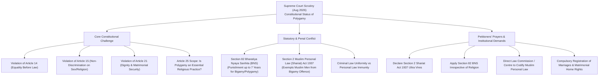

# Current Affairs — 20 August 2026

## 1. Supreme Court Scrutiny on Polygamy, Section 2 of Shariat Act 1937 & Section 82 of Bharatiya Nyaya Sanhita (BNS)

> **Tags:** `[GS-2: Indian Constitution & Polity — Fundamental Rights (Articles 14, 15, 21, 25), Personal Laws vs Constitutional Morality, Section 2 of Shariat Act 1937, Section 82 Bharatiya Nyaya Sanhita (BNS), Codification of Personal Laws, Gender Justice, Uniform Civil Code (Article 44), Essential Religious Practices (ERP) Test]`

---

### Context & Key News Data
* **Supreme Court Notice to Union Government:** The Supreme Court of India sought the response of the Union Government on a batch of writ petitions challenging the constitutional validity of **polygamy** and the legal exemptions granted under Muslim personal law.
* **Judicial Observation:** The apex court asked the Centre to consider taking suitable legislative steps to abolish the practice of polygamy for all citizens, irrespective of religion, emphasizing that gender equality and dignity are non-negotiable constitutional values.
* **Petitioners' Profile:** The petitions have been filed by five prominent women activists, two of whom were key petitioners in the historic *Shayara Bano v. Union of India (2017)* case which led to the invalidation of instant triple talaq (*Talaq-e-biddat*).
* **Statutory Impugned Provision:**
  * **Section 2 of the Muslim Personal Law (Shariat) Application Act, 1937:** Mandates that in matters regarding intestate succession, special property of females, marriage, dissolution of marriage, maintenance, dower, guardianship, gifts, trusts, and waqfs, the rule of decision shall be the Muslim Personal Law (Shariat).
  * Under this framework, Muslim men are legally permitted to have up to four wives simultaneously, creating an explicit exemption from general bigamy penal laws.
* **Penal Law Intersection — Section 82 of Bharatiya Nyaya Sanhita (BNS):**
  * Section 82 of the BNS (replacing Section 494 of the Indian Penal Code, 1860) criminalizes marrying again during the lifetime of a husband or wife (bigamy/polygamy) and prescribes **imprisonment of up to 7 years and a fine**.
  * Currently, Section 82 BNS applies only to non-Muslims (Hindus, Christians, Parsis, Sikhs, Buddhists, Jains) because their personal laws/statutes (e.g., Hindu Marriage Act 1955, Special Marriage Act 1954, Parsi Marriage & Divorce Act 1936, Indian Christian Marriage Act 1872) prohibit bigamy.
  * The petitioners have demanded that Section 82 BNS be applied uniformly across all religious denominations without personal law exemptions.

---

### Specific Reliefs Sought by Petitioners

| Five Key Reliefs Sought in Petitions | Substance of the Prayer |
|:---|:---|
| **1. Constitutional Invalidation of Section 2 of Shariat Act, 1937** | Declare Section 2 ultra vires to the extent it permits polygamy, violating Articles 14, 15, and 21 of the Constitution. |
| **2. Universal Application of Section 82 BNS** | Treat polygamy as a uniform criminal offence under Section 82 BNS for all citizens irrespective of religious faith. |
| **3. Codification of Muslim Personal Law** | Direct the Law Commission of India or the Union Government to draft a statutory code aligning marriage, divorce, maintenance, and succession with constitutional gender equality. |
| **4. Compulsory Registration of Marriages & Divorces** | Enforce mandatory state registration of all marriages and divorces to prevent covert and fraudulent subsequent marriages. |
| **5. Protection of Matrimonial Rights & Housing Security** | Ensure that if bigamy occurs, the first wife and her children have the first and lasting statutory right to the matrimonial home. |

---

### Judicial Precedents & Evolution of Matrimonial Jurisprudence

| Landmark Case | Year / Bench | Key Judicial Pronouncement & Doctrine | UPSC Relevance |
|:---|:---|:---|:---|
| **State of Bombay v. Narasu Appa Mali** | 1951 (Bombay HC — Chagla CJ & Gajendragadkar J) | Held that uncodified personal laws are **NOT "laws in force"** under Article 13(1) and cannot be tested against Fundamental Rights. | The foundational shield protecting personal laws; increasingly doubted and bypassed by modern Supreme Court benches. |
| **Sarla Mudgal v. Union of India** | 1995 (SC — Kuldip Singh & R.M. Sahai JJ) | Held that a Hindu husband cannot convert to Islam solely to contract a second marriage without dissolving the first; second marriage is **void and bigamous under Sec 494 IPC**. SC urged the implementation of Article 44 (UCC). | Established that religious conversion cannot be used as an escape hatch to evade monogamy laws. |
| **Lily Thomas v. Union of India** | 2000 (SC — S. Saghir Ahmad & R.P. Sethi JJ) | Reaffirmed *Sarla Mudgal*; held that bigamy by a convert husband violates the rights of the first wife under Article 21 and is punishable as a criminal offence. | Clarified that freedom of religion (Article 25) does not protect fraudulent conversions or matrimonial bigotry. |
| **Shayara Bano v. Union of India** | 2017 (SC — 5-Judge Bench) | Struck down **instant triple talaq (*Talaq-e-biddat*)** as "manifestly arbitrary" and violative of Article 14. Left polygamy and *nikah halala* to be decided by a separate bench. | Watershed verdict establishing that personal law practices are subject to Part III Fundamental Rights. |
| **Muslim Women (Protection of Rights on Marriage) Act** | 2019 (Parliament of India) | Statutory outcome of *Shayara Bano*; declared instant triple talaq void and illegal, making it a cognizable offence punishable with up to **3 years imprisonment**. | Demonstrates legislative follow-through to enforce judicial rulings on gender justice in personal laws. |

---

### Constitutional & Jurisprudential Dilemmas

<svg xmlns="http://www.w3.org/2000/svg" viewBox="0 0 400 384" role="img" aria-label="Article 25 religious freedom tested against Articles 14, 15 and 21, resolved through constitutional morality and Article 44" style="display:block;margin:0 auto;width:100%;min-width:340px;max-width:560px;font-family:system-ui,Segoe UI,Arial,sans-serif;">
<rect x="1" y="1" width="398" height="382" rx="12" fill="#f8fafc" stroke="#e2e8f0" />
<rect x="40" y="12" width="320" height="46" rx="8" fill="#e2e8f0" stroke="#94a3b8" />
<text x="200" y="31" text-anchor="middle" font-size="13" font-weight="700" fill="#0f172a">Article 25: Freedom of</text>
<text x="200" y="48" text-anchor="middle" font-size="13" font-weight="700" fill="#0f172a">Conscience &amp; Religion</text>
<path d="M 200 58 L 200 198" fill="none" stroke="#94a3b8" stroke-width="1.5" />
<path d="M 102 176 L 102 188 L 298 188 L 298 176" fill="none" stroke="#94a3b8" stroke-width="1.5" />
<rect x="15" y="72" width="175" height="104" rx="8" fill="#fffbeb" stroke="#fbbf24" />
<text x="102" y="98" text-anchor="middle" font-size="12" fill="#334155">Essential Religious</text>
<text x="102" y="115" text-anchor="middle" font-size="12" fill="#334155">Practice (ERP) Test:</text>
<text x="102" y="132" text-anchor="middle" font-size="12" fill="#334155">Is Polygamy Mandatory</text>
<text x="102" y="149" text-anchor="middle" font-size="12" fill="#334155">or Permissible?</text>
<rect x="210" y="72" width="175" height="104" rx="8" fill="#eff6ff" stroke="#60a5fa" />
<text x="297" y="90" text-anchor="middle" font-size="12" fill="#334155">Article 14 (Equality),</text>
<text x="297" y="107" text-anchor="middle" font-size="12" fill="#334155">Article 15 (Sex</text>
<text x="297" y="124" text-anchor="middle" font-size="12" fill="#334155">Non-Discrimination),</text>
<text x="297" y="141" text-anchor="middle" font-size="12" fill="#334155">Article 21 (Dignity</text>
<text x="297" y="158" text-anchor="middle" font-size="12" fill="#334155">&amp; Life)</text>
<polygon points="0,-5 12,0 0,5" fill="#94a3b8" transform="translate(200,198) rotate(90)" />
<rect x="60" y="210" width="280" height="46" rx="8" fill="#e0e7ff" stroke="#818cf8" />
<text x="200" y="229" text-anchor="middle" font-size="13" font-weight="700" fill="#3730a3">Constitutional Morality &amp;</text>
<text x="200" y="246" text-anchor="middle" font-size="13" font-weight="700" fill="#3730a3">Harmonious Construction</text>
<path d="M 200 256 L 200 266" fill="none" stroke="#94a3b8" stroke-width="1.5" />
<polygon points="0,-5 12,0 0,5" fill="#94a3b8" transform="translate(200,266) rotate(90)" />
<rect x="15" y="278" width="370" height="92" rx="8" fill="#f0fdf4" stroke="#4ade80" />
<text x="27" y="300" font-size="13" font-weight="700" fill="#166534">Article 44: Uniform Civil Code</text>
<text x="27" y="322" font-size="12" fill="#334155">• Progressive Reform of Laws</text>
<text x="27" y="340" font-size="12" fill="#334155">• Elimination of Gender Bias</text>
<text x="27" y="358" font-size="12" fill="#334155">• Non-Negotiable Human Dignity</text>
</svg>

#### 1. Article 25 Freedom of Religion vs. Part III Rights
* **Conditional Freedom:** Article 25(1) begins with the explicit clause: *"Subject to public order, morality and health and to the other provisions of this Part..."*. 
* This makes religious freedom **subservient to Articles 14 (Equality), 15 (Non-discrimination on grounds of sex), and 21 (Right to life with human dignity)**.
* **Essential Religious Practice (ERP) Test:** Islamic jurisprudence permits polygamy under strict conditionalities (equal justice and treatment across wives) as an exception, but it is **not an obligatory duty or essential religious practice** without which the religion ceases to exist. Practices that are merely permissible or customary can be regulated or prohibited by the State for social reform under Article 25(2)(b).

#### 2. Substantive Equality (Article 14 & 15) vs. Personal Law Exemptions
* When a non-Muslim man enters a second marriage during the subsistence of a first marriage, he faces up to 7 years imprisonment under Section 82 BNS. 
* However, a Muslim man doing the same is legally shielded by Section 2 of the 1937 Act.
* This creates a dual constitutional vulnerability:
  1. **Discrimination on grounds of religion (Article 15(1)):** Unequal criminal liability attached solely based on religious identity.
  2. **Gender discrimination (Article 15(1) & Article 14):** A Muslim man can marry up to four wives, but a Muslim woman cannot marry multiple husbands (polyandry), creating a stark gender hierarchy.

#### 3. Article 21 and the Right to Dignity & Matrimonial Security
* In *K.S. Puttaswamy (2017)* and *Joseph Shine (2018)*, the Supreme Court held that constitutional morality demands that women not be treated as chattel or subordinate partners in marriage.
* Polygamy inflicts psychological trauma, economic insecurity, and social deprivation upon the first wife and her children, directly infringing their Article 21 right to live with dignity.

---

### UPSC Mains Analytical Dimensions

#### 1. Codification of Personal Laws vs. Pluralism
* **The Case for Codification:** Unlike Hindu personal laws (which were codified in 1955–56 via the Hindu Marriage Act, Hindu Succession Act, Hindu Minority and Guardianship Act, and Hindu Adoptions and Maintenance Act), Muslim personal law remains largely uncodified. Codification provides clarity, removes patriarchal interpretations, and aligns family laws with modern constitutional guarantees.
* **21st Law Commission Perspective (2018 Consultation Paper):** The Law Commission noted that a Uniform Civil Code (UCC) is *"neither necessary nor desirable at this stage"*, but strongly recommended **reforming and codifying discriminatory aspects within each personal law** to guarantee gender justice without destroying cultural diversity.

#### 2. Criminalization vs. Civil Remedies
* While Section 82 BNS prescribes criminal punishment (up to 7 years), critics argue that criminalizing family practices may lead to desertion without securing maintenance for vulnerable women.
* A balanced legal framework must couple penal deterrents with **robust civil protections**:
  * Guaranteed right to the matrimonial home.
  * Accelerated maintenance procedures under Section 144 of Bharatiya Nagarik Suraksha Sanhita (BNSS, replacing Sec 125 CrPC).
  * Equitable division of marital assets upon dissolution.

#### 3. Way Forward & Institutional Roadmaps
* **Enforce Compulsory Marriage Registration:** Implement the Supreme Court's mandate in *Seema v. Ashwani Kumar (2006)* requiring compulsory registration of all marriages regardless of religion to prevent fraudulent polygamous marriages.
* **Legislative Action over Judicial Fiat:** While the judiciary can declare unconstitutional provisions void under Article 13, comprehensive personal law reform requires parliamentary legislation supported by wide consultations with community stakeholders and women's rights groups.
* **Gender-Just Uniform Family Code:** Progressively harmonize family laws across communities on minimum age of marriage, grounds for divorce, guardianship, and equal inheritance rights under the guiding spirit of Article 44.

---

<!-- 2026-08-20: Created daily current affairs note covering Supreme Court scrutiny on Polygamy, Section 2 of Shariat Act 1937 vs Articles 14/15/21, Section 82 of Bharatiya Nyaya Sanhita (BNS), Shayara Bano & Sarla Mudgal precedents, and codification of Muslim Personal Law for gender equality. -->
