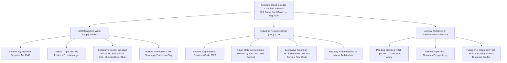
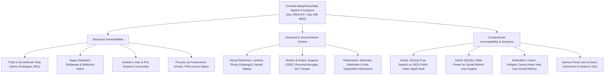

# Current Affairs — 21 August 2026

## 1. Supreme Court 9-Judge Bench Verdict: 1978 'Industry' Definition Void Under Industrial Relations Code, 2020

> **Tags:** `[GS-2: Indian Constitution & Polity — Judicial Pronouncements, 9-Judge Constitution Bench, Separation of Powers; GS-3: Indian Economy — Labour Law Reforms, Industrial Relations Code 2020, Section 2(p) IRC vs Section 2(j) IDA 1947, Bangalore Water Supply Case 1978, Triple Test, Workers' Rights, Collective Bargaining, Ease of Doing Business]`

---

### Context & Key Judicial Findings
* **9-Judge Constitution Bench Ruling:** A nine-judge Constitution Bench of the Supreme Court of India, headed by **Chief Justice of India Surya Kant**, ruled that the nearly half-century-old expansive judicial definition of 'industry' formulated in 1978 will **not apply** to the new **Industrial Relations Code (IRC), 2020**.
* **Clean Slate Principle:** The top court declared that the interpretation of the term 'industry' under **Section 2(p)** of the IRC, 2020 must be done on a **"clean slate"**, assessed strictly on the basis of its **"own text and context"**, without being burdened or constrained by the 1978 precedent.
* **Transitional Jurisprudence (What Next for Disputes?):**
  1. **Pending Industrial Disputes:** The 'triple test' of the 1978 *Bangalore Water Supply* judgment will **continue to govern all pending disputes** under the *Industrial Disputes Act, 1947*.
  2. **Refined Triple Test:** The 'refined' triple test evolved in the opinion of CJI Surya Kant will **operate prospectively**.
  3. **New Code Disputes:** Once the IRC 2020 is enforced, disputes arising under it will be adjudicated exclusively within the modern statutory framework.

---

### Historical Evolution: The 1978 *Bangalore Water Supply* Landmark Case

<svg xmlns="http://www.w3.org/2000/svg" viewBox="0 0 400 526" role="img" aria-label="Anatomy of the 1978 Bangalore Water Supply judgment: the triple test, sweeping inclusivity and the strict sovereign exemption" style="display:block;margin:0 auto;width:100%;min-width:340px;max-width:560px;font-family:system-ui,Segoe UI,Arial,sans-serif;">
<rect x="1" y="1" width="398" height="524" rx="12" fill="#f8fafc" stroke="#e2e8f0" />
<rect x="12" y="10" width="376" height="62" rx="10" fill="#e0e7ff" stroke="#818cf8" />
<text x="200" y="31" text-anchor="middle" font-size="13" font-weight="700" fill="#3730a3">Bangalore Water Supply &amp; Sewerage Board</text>
<text x="200" y="48" text-anchor="middle" font-size="13" font-weight="700" fill="#3730a3">v. A. Rajappa (1978)</text>
<text x="200" y="64" text-anchor="middle" font-size="11.5" fill="#4338ca">7-Judge Constitution Bench · Justice V.R. Krishna Iyer</text>
<rect x="12" y="84" width="376" height="146" rx="10" fill="#eff6ff" stroke="#60a5fa" />
<text x="24" y="104" font-size="12.5" font-weight="700" fill="#1e40af">1. The Classic ‘Triple Test’ — Sec 2(j), IDA 1947</text>
<text x="24" y="124" font-size="12" fill="#334155">An establishment is an ‘Industry’ under Section 2(j)</text>
<text x="24" y="140" font-size="12" fill="#334155">of the IDA 1947 only if all three are satisfied:</text>
<text x="24" y="156" font-size="12" fill="#334155">(i) Systematic and organized activity</text>
<text x="24" y="172" font-size="12" fill="#334155">(ii) Carried on through employer–employee cooperation</text>
<text x="24" y="188" font-size="12" fill="#334155">(iii) For the production and/or distribution of goods</text>
<text x="33" y="204" font-size="12" fill="#334155">and services to satisfy human wants and desires</text>
<text x="33" y="220" font-size="12" fill="#334155">(material, not purely spiritual/religious)</text>
<rect x="12" y="242" width="376" height="130" rx="10" fill="#f0fdf4" stroke="#4ade80" />
<text x="24" y="262" font-size="12.5" font-weight="700" fill="#166534">2. Sweeping Inclusivity</text>
<text x="24" y="282" font-size="12" fill="#334155">• Brought universities, schools, colleges, research</text>
<text x="33" y="298" font-size="12" fill="#334155">institutes, hospitals, charitable institutions,</text>
<text x="33" y="314" font-size="12" fill="#334155">clubs, cooperatives and municipal corporations under</text>
<text x="33" y="330" font-size="12" fill="#334155">the statutory umbrella of ‘industry’</text>
<text x="24" y="346" font-size="12" fill="#334155">• Absence of profit motive or investment of capital</text>
<text x="33" y="362" font-size="12" fill="#334155">was held IRRELEVANT</text>
<rect x="12" y="384" width="376" height="130" rx="10" fill="#fffbeb" stroke="#fbbf24" />
<text x="24" y="404" font-size="12.5" font-weight="700" fill="#92400e">3. Strict Sovereign Exemption</text>
<text x="24" y="424" font-size="12" fill="#334155">• Exempted ONLY strict, primary, inalienable</text>
<text x="33" y="440" font-size="12" fill="#334155">sovereign functions of the State — law &amp; order,</text>
<text x="33" y="456" font-size="12" fill="#334155">armed forces, administration of justice, legislation</text>
<text x="24" y="472" font-size="12" fill="#334155">• Welfare and economic/commercial departments of the</text>
<text x="33" y="488" font-size="12" fill="#334155">State were treated as ‘industry’ to protect</text>
<text x="33" y="504" font-size="12" fill="#334155">functional autonomy of workers</text>
</svg>

---

### The Statutory Shift: Section 2(j) IDA 1947 vs. Section 2(p) IRC 2020

| Dimension | Industrial Disputes Act, 1947 [Sec 2(j)] | Industrial Relations Code, 2020 [Sec 2(p)] | UPSC Analytical Significance |
|:---|:---|:---|:---|
| **Statutory Text** | Broadly worded: Any business, trade, undertaking, manufacture or calling of employers. | Explicitly defines industry while providing categorical statutory exclusions. | Shifts from judge-made expansive coverage to structured legislative definitions. |
| **Hospitals & Educational Inst.** | Covered under *Bangalore Water Supply* triple test. | Excluded from the definition under IRC 2020 (subject to specific threshold rules). | Reduces litigation and compliance overheads for non-profit and social institutions. |
| **Charitable & Welfare Activities** | Included if systematic economic activity and employer-employee cooperation existed. | Excluded if philanthropic/charitable without commercial profit elements. | Facilitates ease of operation for philanthropic and non-governmental bodies. |
| **State Functions** | Only strict sovereign functions (justice, defence, policing) excluded. | All sovereign functions of Central/State government departments categorically excluded. | Strengthens administrative and functional autonomy of governmental departments. |
| **Workers' Recourse** | Right to collective bargaining, dispute settlement, strike notices, retrenchment safeguards under IDA. | Workers in non-industry bodies access general labour codes (Code on Wages, OSH Code, Social Security Code) rather than IRC dispute machinery. | Re-balances employer-employee dispute mechanisms and promotes investment flexibility. |

---

### Constitutional & Economic Implications

<svg xmlns="http://www.w3.org/2000/svg" viewBox="0 0 400 372" role="img" aria-label="Constitutional anchors branching into the labour protection wing and economic competitiveness" style="display:block;margin:0 auto;width:100%;min-width:340px;max-width:560px;font-family:system-ui,Segoe UI,Arial,sans-serif;">
<rect x="1" y="1" width="398" height="370" rx="12" fill="#f8fafc" stroke="#e2e8f0" />
<rect x="30" y="10" width="356" height="88" rx="10" fill="#e0e7ff" stroke="#818cf8" />
<text x="208" y="30" text-anchor="middle" font-size="13" font-weight="700" fill="#3730a3">Constitutional Anchors</text>
<text x="42" y="52" font-size="11.5" fill="#334155">Article 19(1)(c): Right to Form Associations/Unions</text>
<text x="42" y="70" font-size="11.5" fill="#334155">Article 43A: Workers’ Participation in Management</text>
<text x="42" y="88" font-size="11.5" fill="#334155">Article 43: Living Wage &amp; Humane Working Conditions</text>
<path d="M 208 98 L 208 108 M 14 108 L 208 108 M 14 108 L 14 303 M 14 177 L 30 177 M 14 303 L 30 303" fill="none" stroke="#94a3b8" stroke-width="1.5" />
<rect x="30" y="120" width="356" height="114" rx="10" fill="#f0fdf4" stroke="#4ade80" />
<text x="42" y="140" font-size="12.5" font-weight="700" fill="#166534">Labour Protection Wing</text>
<text x="42" y="160" font-size="12" fill="#334155">• Protection against unfair practices</text>
<text x="42" y="176" font-size="12" fill="#334155">• Safeguards against illegal retrenchment</text>
<text x="42" y="192" font-size="12" fill="#334155">• Collective bargaining &amp; strike rights</text>
<text x="42" y="208" font-size="12" fill="#334155">• Social security &amp; statutory dispute</text>
<text x="52" y="224" font-size="12" fill="#334155">resolution tribunals</text>
<rect x="30" y="246" width="356" height="114" rx="10" fill="#eff6ff" stroke="#60a5fa" />
<text x="42" y="266" font-size="12.5" font-weight="700" fill="#1e40af">Economic Competitiveness</text>
<text x="42" y="286" font-size="12" fill="#334155">• Ease of Doing Business &amp; investments</text>
<text x="42" y="302" font-size="12" fill="#334155">• Reduction in vexatious litigation</text>
<text x="42" y="318" font-size="12" fill="#334155">• Clarity for non-profit &amp; institutions</text>
<text x="42" y="334" font-size="12" fill="#334155">• Elimination of 48-year legal ambiguity</text>
<text x="42" y="350" font-size="12" fill="#334155">• Rationalisation of 29 labour laws</text>
</svg>

#### 1. Separation of Powers & Legislative Supremacy
* The 1978 *Bangalore Water Supply* judgment was delivered in an era where Parliament had not comprehensively codified industrial jurisprudence, prompting the Supreme Court to adopt an expansive judicial interpretation to protect vulnerable labour.
* In 2020, Parliament codified 29 central labour laws into **4 Labour Codes** (Code on Wages 2019, Industrial Relations Code 2020, Code on Social Security 2020, Occupational Safety, Health and Working Conditions Code 2020).
* The 9-judge bench recognized that judicial doctrines cannot override or constrain newly enacted statutory language when Parliament has clearly expressed its legislative intent.

#### 2. Balancing Worker Safeguards with Investment Ecosystem
* While the 1978 verdict provided robust safeguards to millions of workers across institutions, it created operational gridlocks and prolonged disputes for universities, hospitals, and welfare trusts.
* The unburdening of IRC 2020 enables India to align its labour ecosystem with global manufacturing and service supply chains while providing social security coverage through parallel welfare codes.

---

## 2. Beyond Blasphemy: How Criminal Speech Laws Curtail Social Reform & Free Speech

> **Tags:** `[GS-2: Indian Constitution & Polity — Fundamental Rights (Article 19(1)(a), Article 19(2), Article 25(1), Article 25(2)(b)), Section 295A IPC / Section 299 Bharatiya Nyaya Sanhita (BNS), Reasonable Restrictions, Public Order, Heckler's Veto, Pre-emptive Censorship, Social Reform vs Orthodoxy, Ambedkar's Vision on Personal Law, Secularism in Indian Context]`

---

### Context & Core Thesis
* **The Structural Paradox:** While India possesses progressive legislations empowering the State to reform regressive religious practices (e.g., Sati Prevention Act 1987, Maharashtra Anti-Black Magic Act 2013, Karnataka Anti-Superstition Act 2017), its criminal code retains expansive blasphemy-adjacent laws like **Section 295A IPC (now Section 299 Bharatiya Nyaya Sanhita, BNS)**.
* **The Reform Vulnerability:** Section 295A was enacted in 1927 to prevent communal riots following the *Rangila Rasul* controversy. However, it is increasingly weaponized against writers, artists, satirists, and social reformers whose progressive critiques of orthodoxy are branded as "outraging religious feelings".

---

### The Dangerous Jurisprudential Doctrine: "Truth is No Defence"

***The State of Mysore v. Henry Rodrigues (1961)*** — Mysore High Court (following the Allahabad High Court rule)

| Stage | Substance |
|:---|:---|
| **Case Background** | Catholic editor **Henry Rodrigues** wrote an article titled *'Honour to Mary or Dishonour?'* in the Konkani magazine *'Crusader'*, criticising priests for exploiting credulous followers by attributing fake miracles to the Virgin Mary. |
| **The Defence of Truth** | The accused pleaded that his critique was **factually true, biblically accurate**, and aimed at weeding out superstition from within his own faith. |
| **The Shocking Judicial Verdict** | The High Court rejected the defence outright: *"Even a wholly true statement can outrage religious feelings. Section 295A punishes the intent to outrage rather than the accuracy of what is said."* |
| **The Fatal Flaw for Social Reform** | Because truth and factual accuracy provide **NO legal immunity**, any rationalist or reformer exposing exploitative religious practices can be convicted under penal law. |

---

### How Blasphemy Laws Would Criminalize India's Greatest Social Reformers

**Reformers at risk under a literal 295A / 299 BNS lens:**

| Reformer (Period) | Reformist Act / Writing | Penal Exposure / Stance |
|:---|:---|:---|
| **Mahatma Jyotirao Phule** (1870s) | Authored *'Gulamgiri'* (Slavery), attacking Brahminical supremacy and priestly exploitation, and recasting mythology to awaken oppressed castes. | Under a literal reading of **Section 295A / 299 BNS**, his writings would be prosecuted for insulting orthodox sentiments and traditions. |
| **Hamid Dalwai & Muslim Satyashodhak Mandal** (1960s–70s) | Founded the Muslim Satyashodhak Mandal; led a historic march of Muslim women to the Maharashtra Assembly demanding an immediate ban on Triple Talaq and Polygamy. | Faced severe ostracism and would easily have been jailed under **sacrilege / 295A complaints** for challenging personal laws. |
| **Dr. B.R. Ambedkar** (1927–1956) | Publicly burnt the *'Manusmriti'* at Mahad Satyagraha (1927); authored *'Annihilation of Caste'* and *'Riddles in Hinduism'*, dismantling orthodoxy. | Stated that religion must not be allowed to act as an **unassailable veto over modern constitutional morality**. |

---

### The Pattern of "Pre-Emptive Censorship" & Heckler's Veto

* **1932:** Urdu short stories anthology *Angarey* banned under British colonial censorship.
* **1988:** Salman Rushdie's *The Satanic Verses* banned in India before any court trial.
* **2006:** *The Da Vinci Code* film banned by multiple State Governments despite clearing the Censor Board (CBFC).
* **2014:** Wendy Doniger's scholarly work *The Hindus: An Alternative History* withdrawn and pulped by Penguin under threat of Section 295A civil and criminal suits.
* **2015–16:** Tamil novelist Perumal Murugan harassed by fundamentalist groups over his book *Madhorubagan*, prompting his famous lament: *"Perumal Murugan the writer is dead."*
  * **Madras High Court (2016) Landmark Restoration:** Chief Justice Sanjay Kishan Kaul ruled: *"Let the author be resurrected to what he is best at, write... If you do not like a book, throw it away. Do not turn to criminal law to stifle creativity."*
* **Contemporary Harassment:** Rehana Fathima jailed under Section 295A for Sabarimala-related social media posts; journalists facing multi-state FIRs for slips of the tongue.

---

### Constitutional Synthesis & The Way Forward

<svg xmlns="http://www.w3.org/2000/svg" viewBox="0 0 400 480" role="img" aria-label="Ambedkar's Constituent Assembly stance flowing into Article 19 free speech and Article 25(2)(b) reform mandate" style="display:block;margin:0 auto;width:100%;min-width:340px;max-width:560px;font-family:system-ui,Segoe UI,Arial,sans-serif;">
<rect x="1" y="1" width="398" height="478" rx="12" fill="#f8fafc" stroke="#e2e8f0" />
<rect x="30" y="10" width="356" height="48" rx="10" fill="#e0e7ff" stroke="#818cf8" />
<text x="208" y="30" text-anchor="middle" font-size="13" font-weight="700" fill="#3730a3">Constituent Assembly Debates</text>
<text x="208" y="47" text-anchor="middle" font-size="11.5" fill="#4338ca">Dr. B.R. Ambedkar — Dec 2, 1948</text>
<line x1="208" y1="58" x2="208" y2="68" stroke="#94a3b8" stroke-width="1.5" />
<polygon points="0,-5 12,0 0,5" fill="#94a3b8" transform="translate(208,68) rotate(90)" />
<rect x="30" y="84" width="356" height="94" rx="10" fill="#fffbeb" stroke="#fbbf24" />
<text x="42" y="104" font-size="11.5" font-style="italic" fill="#92400e">“I personally do not understand why religion</text>
<text x="42" y="120" font-size="11.5" font-style="italic" fill="#92400e">should be given this vast, expansive jurisdiction</text>
<text x="42" y="136" font-size="11.5" font-style="italic" fill="#92400e">so as to cover the whole of life and to prevent</text>
<text x="42" y="152" font-size="11.5" font-style="italic" fill="#92400e">the legislature from encroaching upon that field...</text>
<text x="42" y="168" font-size="11.5" font-style="italic" fill="#92400e">Personal law shall not be excluded from the State.”</text>
<path d="M 208 178 L 208 188 M 14 188 L 208 188 M 14 188 L 14 403 M 14 261 L 30 261 M 14 403 L 30 403" fill="none" stroke="#94a3b8" stroke-width="1.5" />
<rect x="30" y="196" width="356" height="130" rx="10" fill="#eff6ff" stroke="#60a5fa" />
<text x="42" y="216" font-size="12.5" font-weight="700" fill="#1e40af">Article 19(1)(a) &amp; 19(2) Freedom</text>
<text x="42" y="236" font-size="12" fill="#334155">• Free speech is the lifeblood of democracy</text>
<text x="52" y="252" font-size="12" fill="#334155">and scientific temper</text>
<text x="42" y="268" font-size="12" fill="#334155">• Article 51A(h): Duty to develop inquiry</text>
<text x="52" y="284" font-size="12" fill="#334155">and reform</text>
<text x="42" y="300" font-size="12" fill="#334155">• ‘Spark in Powder Keg’ test required</text>
<text x="52" y="316" font-size="12" fill="#334155">(S. Rangarajan / Shreya Singhal)</text>
<rect x="30" y="338" width="356" height="130" rx="10" fill="#f0fdfa" stroke="#2dd4bf" />
<text x="42" y="358" font-size="12.5" font-weight="700" fill="#115e59">Article 25(2)(b) Reform Mandate</text>
<text x="42" y="378" font-size="12" fill="#334155">• State retains inherent sovereignty to reform</text>
<text x="52" y="394" font-size="12" fill="#334155">regressive religious practices</text>
<text x="42" y="410" font-size="12" fill="#334155">• Religious sentiment cannot veto social justice</text>
<text x="52" y="426" font-size="12" fill="#334155">or human dignity</text>
<text x="42" y="442" font-size="12" fill="#334155">• Anti-superstition &amp; anti-black magic laws</text>
<text x="52" y="458" font-size="12" fill="#334155">must override penal blasphemy</text>
</svg>

#### 1. Narrowing Penal Scope to "Incitement to Imminent Violence"
* In modern constitutional democracies, the threshold for criminalizing speech must strictly be **direct and proximate incitement to imminent lawless action** (the *Brandenburg v. Ohio* standard, recognized in *Shreya Singhal v. Union of India (2015)*).
* Mere hurt sentiments, discomfort, satire, intellectual critique, or theological disputes must be relegated to **public discourse and peaceful counter-speech**, not criminal trials.

#### 2. Dismantling the "Heckler's Veto"
* A constitutional secular state must never allow mob intimidation or aggressive protests (the "heckler's veto") to dictate what books may be read, what films may be exhibited, or what ideas may be expressed.
* The state's primary constitutional duty under **Article 19(1)(a)** is to **protect the speaker against the mob**, rather than arresting the speaker to appease the mob.

#### 3. Preserving the Constitutional Priority of Social Reform
* Under **Article 25(2)(b)**, the Constitution explicitly empowers the legislature to enact laws for **social welfare and reform**.
* Section 299 BNS / 295A IPC must be interpreted with an express statutory exception for *bona fide* academic inquiry, artistic expression, anti-superstition advocacy, and progressive social reform.

---

<!-- 2026-08-21: Created daily current affairs note covering (1) Supreme Court 9-judge Constitution Bench verdict holding 1978 Bangalore Water Supply 'industry' definition void under Industrial Relations Code 2020, and (2) Analysis of Section 295A IPC / Section 299 BNS, Henry Rodrigues 'Truth is No Defence' doctrine, Heckler's Veto vs Free Speech under Art 19(1)(a), and Dr. Ambedkar's Constituent Assembly stance on social reform under Art 25(2)(b). -->
