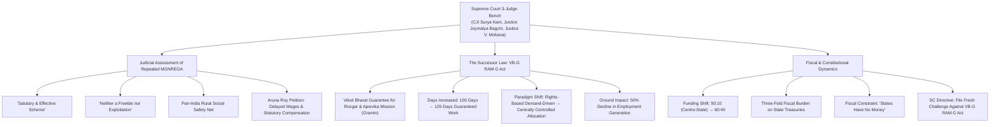
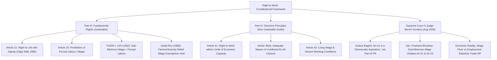

# Current Affairs — 22 August 2026

## 1. Supreme Court on Scrapped MGNREGA vs. VB-G RAM G Act & Fiscal Federalism Shift

> **Tags:** `[GS-2: Indian Constitution & Polity — Judicial Review, Directive Principles of State Policy (Article 41), Fundamental Rights (Article 21, Article 23), Fiscal Federalism (Centre-State Funding Ratios, Centrally Sponsored Schemes); GS-3: Indian Economy & Social Development — Rural Employment Architecture, MGNREGA Repeal vs VB-G RAM G Act, Demand-Driven vs Centrally Controlled Schemes, Minimum Wages & Rural Distress]`



---

### Context & Judicial Proceedings
* **Supreme Court 3-Judge Bench Observation:** A three-judge bench of the Supreme Court, headed by **Chief Justice of India Surya Kant** alongside **Justice Joymalya Bagchi** and **Justice V. Mohana**, praised the repealed *Mahatma Gandhi National Rural Employment Guarantee Act (MGNREGA)* as a **"salutary scheme"** and a **"good, effective scheme"** that was **"neither a freebie nor an exploitation of rural workers."**
* **The Underlying Petition:** The bench was hearing a petition filed by social activist **Aruna Roy** (represented by Advocates Prashant Bhushan, Cheryl D'Souza, and Neha Rathi) seeking judicial directives for the Central Government to release long-delayed wage payments under MGNREGA along with statutory delay compensation.
* **Transition to New Law:** While disposing of the petition regarding the defunct scheme, the Supreme Court granted liberty to the petitioners to file a fresh writ petition examining the operational and constitutional validity of the newly enacted successor legislation — the **Viksit Bharat Guarantee for Rozgar and Ajeevika Mission (Gramin) Act (VB-G RAM G Act)**.

---

### Structural Comparison: MGNREGA vs. VB-G RAM G Act

```
┌─────────────────────────────────────────────────────────────────────────────────────────┐
│                    RURAL EMPLOYMENT PARADIGM SHIFT (COMPARATIVE MATRIX)                  │
├────────────────────────────┬─────────────────────────────┬──────────────────────────────┤
│ DIMENSION                  │ MGNREGA (2005) [REPEALED]   │ VB-G RAM G ACT [SUCCESSOR]   │
├────────────────────────────┼─────────────────────────────┼──────────────────────────────┤
│ 1. Legal Architecture      │ Demand-driven, rights-based │ Supply-driven, centrally     │
│                            │ statutory entitlement       │ controlled allocation        │
├────────────────────────────┼─────────────────────────────┼──────────────────────────────┤
│ 2. Work Guarantee          │ 100 days per rural          │ 125 days per rural           │
│                            │ household per financial yr  │ household per financial yr   │
├────────────────────────────┼─────────────────────────────┼──────────────────────────────┤
│ 3. Funding Ratio           │ 90:10 (Centre : State)      │ 60:40 (Centre : State)       │
│    (Centre : State)        │ (Centre bore 100% unskilled │ (States bear 40% total costs │
│                            │ wage cost + 75% material)   │ including wage component)    │
├────────────────────────────┼─────────────────────────────┼──────────────────────────────┤
│ 4. State Fiscal Impact     │ Predictable, lower burden   │ Three-fold increase in state │
│                            │ on state treasuries         │ budgetary contribution       │
├────────────────────────────┼─────────────────────────────┼──────────────────────────────┤
│ 5. Ground Implementation   │ Pan-India social safety net │ Civil society reports 50%    │
│    Outcomes                │ acting as shock absorber    │ drop in person-days generated│
├────────────────────────────┼─────────────────────────────┼──────────────────────────────┤
│ 6. Wage Fixation           │ Indexed to CPI-AL via       │ Prescribed graded/compensa-  │
│    Mechanism               │ statutory Central base rate │ tory rates linked to states  │
└────────────────────────────┴─────────────────────────────┴──────────────────────────────┘
```

---

### Key Legal & Policy Issues Raised

#### 1. Centralisation vs. Rights-Based Demand Architecture
* Under the 2005 Act, employment was a **justiciable legal right**: any adult rural resident demanding work had to be provided employment within 15 days, failing which the State was statutorily mandated to pay an **Unemployment Allowance**.
* Under the **VB-G RAM G Act**, the transition toward a **centrally budgeted allocation model** restricts automated work sanctioning, capping local project creation based on prior central budgetary releases rather than ground-level worker demand.

#### 2. Fiscal Federalism Distortion & State Fiscal Stress
* Under the new 60:40 funding pattern, State Governments must contribute nearly half of the total program funds.
* Because State finances are constrained by FRBM borrowing ceilings and committed expenditures, poorer States with high rural labor surplus cannot muster the requisite 40% matching share, leading to widespread work rationing and a **50% drop in rural employment generation**.

---

## 2. Right to Work: Fundamental Right (Article 21) vs. Directive Principle (Article 41) & Minimum Wages

> **Tags:** `[GS-2: Indian Constitution & Polity — Part III Fundamental Rights (Article 21, Article 23), Part IV Directive Principles of State Policy (Article 41, Article 39(a), Article 43), Judicial Interpretation of Right to Livelihood, Forced Labour & Begar Jurisprudence, PUDR Asiad Workers Case (1982), Sanjit Roy Case (1983)]`



---

### Constitutional Jurisprudence: The Right to Work Debate

#### 1. Justice Joymalya Bagchi's Observation on Part IV Aspirations
* **Democratic Aspiration vs. Enforceable Guarantee:** Justice Bagchi observed that the Indian Constitution deliberately did not enshrine the Right to Work as an absolute Fundamental Right under Part III.
* **Article 41 Limits:** Under **Article 41**, the Right to Work, Education, and Public Assistance is expressly conditioned upon **"the limits of the State's economic capacity and development."**
* **Policy Flexibility:** Consequently, the State is empowered to design employment policy at a graded, compensatory level based on prevailing macroeconomic realities without treating it as an automatic, strictly justiciable fundamental right on par with Article 21.

#### 2. The Petitioner's Submissions: Article 21 & Article 23 Synergy
* **Right to Life Means Dignified Livelihood:** Senior Counsel Prashant Bhushan argued that under the settled constitutional doctrine of *Olga Tellis v. Bombay Municipal Corporation (1985)*, the Right to Life under **Article 21** includes the right to livelihood.
* **Sub-Minimum Wage as Forced Labour ([Article 23](file:///c:/Users/nitee/OneDrive/Desktop/UPSE_Syllabus/Articles/Article_23.md)):** Mr. Bhushan emphasized that human dignity demands employment at statutory minimum wages. When impoverished rural laborers are forced by hunger and distress to accept wages below statutory minimums, it squarely amounts to **"forced labour" (Begar)** prohibited under **Article 23**.

---

### Landmark Supreme Court Precedents on Minimum Wages & Forced Labour

```
┌─────────────────────────────────────────────────────────────────────────────────────────┐
│              LANDMARK JURISPRUDENCE ON ARTICLE 23 & STATUTORY MINIMUM WAGES             │
├─────────────────────────────────────────────────────────────────────────────────────────┤
│ 1. PEOPLE'S UNION FOR DEMOCRATIC RIGHTS (PUDR) v. UNION OF INDIA (1982)                 │
│    (The Celebrated 'Asiad Workers Case' — Authored by Justice P.N. Bhagwati)            │
│    • Held that 'force' under Article 23 is not confined to physical or legal force.     │
│    • Economic force — arising from poverty, hunger, unemployment, and destitution —     │
│      which compels a person to work for remuneration LESS than the minimum wage,        │
│      constitutes FORCED LABOUR violating Article 23.                                     │
├─────────────────────────────────────────────────────────────────────────────────────────┤
│ 2. SANJIT ROY v. STATE OF RAJASTHAN (1983)                                              │
│    • The State engaged workers in famine relief / drought works and paid wages below    │
│      the Minimum Wages Act under the Rajasthan Famine Relief Works Act.                 │
│    • Supreme Court struck down the statutory exception, holding that the State cannot   │
│      exploit citizens' distress to deny minimum wages. Every worker providing labor is  │
│      constitutionally entitled to full statutory minimum wages under Article 23.        │
├─────────────────────────────────────────────────────────────────────────────────────────┤
│ 3. OLGA TELLIS v. BOMBAY MUNICIPAL CORPORATION (1985)                                   │
│    • 5-Judge Constitution Bench ruled that Right to Life under Article 21 encompasses   │
│      the Right to Livelihood: "Deprive a person of his right to livelihood and you      │
│      shall have deprived him of his life."                                              │
└─────────────────────────────────────────────────────────────────────────────────────────┘
```

---

### Analytical Insights for UPSC Mains (GS-2 & GS-3)

```
                               ┌───────────────────────────────────┐
                               │   RURAL WELFARE TRILEMMA          │
                               └─────────────────┬─────────────────┘
                                                 │
                                                 ▼
      ┌──────────────────────────────────────────┴──────────────────────────────────────────┐
      │                                          │                                          │
      ▼                                          ▼                                          ▼
┌───────────────────────────┐      ┌───────────────────────────┐      ┌───────────────────────────┐
│     FISCAL FEASIBILITY    │      │    STATUTORY COMPLIANCE   │      │    HUMAN DIGNITY & WORK   │
│ • State 60:40 fiscal load │      │ • Strict minimum wage law │      │ • Social safety net       │
│ • Union budget caps       │      │ • Timely wage disbursal   │      │ • Prevention of distress  │
│ • Off-budget liabilities  │      │ • Delay compensation (15d)│        migration & rural hunger  │
└───────────────────────────┘      └───────────────────────────┘      └───────────────────────────┘
```

1. **The Employment Elasticity Dilemma:**
   - As noted by the Bench, setting unrealistically high statutory wage thresholds without corresponding fiscal outlays may shrink the overall volume of person-days generated, unintentionally shutting out the poorest casual laborers.
2. **Rights-Based vs. Discretionary Welfare:**
   - MGNREGA converted welfare from a discretionary governmental benevolence into a citizen-centric legal right. Diluting this into a centrally controlled fiscal allocation threatens the constitutional vision of social security envisaged under **Articles 39(a), 41, and 43**.
3. **Federal Equilibrium:**
   - Shifting the financing burden to 40% on States without expanding their fiscal devolution or tax buoyancy violates cooperative federalism, penalising backward states with higher poverty headcounts.

---

<!-- 2026-08-22: Created daily current affairs note covering (1) Supreme Court 3-judge bench observations on scrapped MGNREGA vs successor VB-G RAM G Act, centralisation vs rights-based demand framework, and 60:40 fiscal federalism strain; and (2) Right to Work jurisprudence under Article 21 vs Article 41 DPSP, Article 23 forced labour doctrine, and PUDR / Sanjit Roy minimum wage precedents. -->
