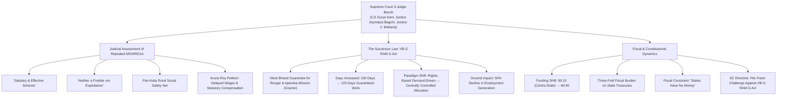
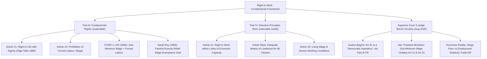

# Current Affairs — 22 August 2026

## 1. Supreme Court on Scrapped MGNREGA vs. VB-G RAM G Act & Fiscal Federalism Shift

> **Tags:** `[GS-2: Indian Constitution & Polity — Judicial Review, Directive Principles of State Policy (Article 41), Fundamental Rights (Article 21, Article 23), Fiscal Federalism (Centre-State Funding Ratios, Centrally Sponsored Schemes); GS-3: Indian Economy & Social Development — Rural Employment Architecture, MGNREGA Repeal vs VB-G RAM G Act, Demand-Driven vs Centrally Controlled Schemes, Minimum Wages & Rural Distress]`

---

### Context & Judicial Proceedings
* **Supreme Court 3-Judge Bench Observation:** A three-judge bench of the Supreme Court, headed by **Chief Justice of India Surya Kant** alongside **Justice Joymalya Bagchi** and **Justice V. Mohana**, praised the repealed *Mahatma Gandhi National Rural Employment Guarantee Act (MGNREGA)* as a **"salutary scheme"** and a **"good, effective scheme"** that was **"neither a freebie nor an exploitation of rural workers."**
* **The Underlying Petition:** The bench was hearing a petition filed by social activist **Aruna Roy** (represented by Advocates Prashant Bhushan, Cheryl D'Souza, and Neha Rathi) seeking judicial directives for the Central Government to release long-delayed wage payments under MGNREGA along with statutory delay compensation.
* **Transition to New Law:** While disposing of the petition regarding the defunct scheme, the Supreme Court granted liberty to the petitioners to file a fresh writ petition examining the operational and constitutional validity of the newly enacted successor legislation — the **Viksit Bharat Guarantee for Rozgar and Ajeevika Mission (Gramin) Act (VB-G RAM G Act)**.

---

### Structural Comparison: MGNREGA vs. VB-G RAM G Act

| Dimension | MGNREGA (2005) — *Repealed* | VB-G RAM G Act — *Successor* |
|:---|:---|:---|
| **1. Legal Architecture** | **Demand-driven, rights-based** statutory entitlement | **Supply-driven**, centrally controlled allocation |
| **2. Work Guarantee** | **100 days** per rural household per financial year | **125 days** per rural household per financial year |
| **3. Funding Ratio** (Centre : State) | **90:10** — Centre bore 100% of unskilled wage cost + 75% of material cost | **60:40** — States bear 40% of total costs, including the wage component |
| **4. State Fiscal Impact** | Predictable, lower burden on state treasuries | **Three-fold increase** in state budgetary contribution |
| **5. Ground Implementation Outcomes** | Pan-India social safety net acting as a shock absorber | Civil society reports **50% drop** in person-days generated |
| **6. Wage Fixation Mechanism** | Indexed to **CPI-AL** via a statutory Central base rate | Prescribed **graded / compensatory rates** linked to states |

---

### Key Legal & Policy Issues Raised

#### 1. Centralisation vs. Rights-Based Demand Architecture
* Under the 2005 Act, employment was a **justiciable legal right**: any adult rural resident demanding work had to be provided employment within 15 days, failing which the State was statutorily mandated to pay an **Unemployment Allowance**.
* Under the **VB-G RAM G Act**, the transition toward a **centrally budgeted allocation model** restricts automated work sanctioning, capping local project creation based on prior central budgetary releases rather than ground-level worker demand.

#### 2. Fiscal Federalism Distortion & State Fiscal Stress
* Under the new 60:40 funding pattern, State Governments must contribute nearly half of the total program funds.
* Because State finances are constrained by FRBM borrowing ceilings and committed expenditures, poorer States with high rural labor surplus cannot muster the requisite 40% matching share, leading to widespread work rationing and a **50% drop in rural employment generation**.

---

## 2. Right to Work: Fundamental Right (Article 21) vs. Directive Principle (Article 41) & Minimum Wages

> **Tags:** `[GS-2: Indian Constitution & Polity — Part III Fundamental Rights (Article 21, Article 23), Part IV Directive Principles of State Policy (Article 41, Article 39(a), Article 43), Judicial Interpretation of Right to Livelihood, Forced Labour & Begar Jurisprudence, PUDR Asiad Workers Case (1982), Sanjit Roy Case (1983)]`

---

### Constitutional Jurisprudence: The Right to Work Debate

#### 1. Justice Joymalya Bagchi's Observation on Part IV Aspirations
* **Democratic Aspiration vs. Enforceable Guarantee:** Justice Bagchi observed that the Indian Constitution deliberately did not enshrine the Right to Work as an absolute Fundamental Right under Part III.
* **Article 41 Limits:** Under **Article 41**, the Right to Work, Education, and Public Assistance is expressly conditioned upon **"the limits of the State's economic capacity and development."**
* **Policy Flexibility:** Consequently, the State is empowered to design employment policy at a graded, compensatory level based on prevailing macroeconomic realities without treating it as an automatic, strictly justiciable fundamental right on par with Article 21.

#### 2. The Petitioner's Submissions: Article 21 & Article 23 Synergy
* **Right to Life Means Dignified Livelihood:** Senior Counsel Prashant Bhushan argued that under the settled constitutional doctrine of *Olga Tellis v. Bombay Municipal Corporation (1985)*, the Right to Life under **Article 21** includes the right to livelihood.
* **Sub-Minimum Wage as Forced Labour ([Article 23](file:///c:/Users/nitee/OneDrive/Desktop/UPSE_Syllabus/Articles/Article_23.md)):** Mr. Bhushan emphasized that human dignity demands employment at statutory minimum wages. When impoverished rural laborers are forced by hunger and distress to accept wages below statutory minimums, it squarely amounts to **"forced labour" (Begar)** prohibited under **Article 23**.

---

### Landmark Supreme Court Precedents on Minimum Wages & Forced Labour

<svg xmlns="http://www.w3.org/2000/svg" viewBox="0 0 400 447" role="img" aria-label="Landmark Supreme Court precedents on Article 23 and statutory minimum wages" style="display:block;margin:0 auto;width:100%;min-width:340px;max-width:560px;font-family:system-ui,Segoe UI,Arial,sans-serif;">
<rect x="1" y="1" width="398" height="445" rx="12" fill="#f8fafc" stroke="#e2e8f0" />
<text x="200" y="24" text-anchor="middle" font-size="14" font-weight="700" fill="#0f172a">Article 23 &amp; Statutory Minimum Wages</text>
<text x="200" y="42" text-anchor="middle" font-size="11.5" fill="#64748b">Landmark Supreme Court jurisprudence</text>
<rect x="12" y="54" width="376" height="139" rx="10" fill="#fef2f2" stroke="#fecaca" />
<text x="24" y="75" font-size="12.5" font-weight="700" fill="#991b1b">1. PUDR v. Union of India (1982)</text>
<text x="24" y="92" font-size="11.5" font-style="italic" fill="#b91c1c">The ‘Asiad Workers Case’ — Justice P.N. Bhagwati</text>
<text x="24" y="112" font-size="11.5" fill="#334155">• ‘Force’ in Article 23 is not confined to physical</text>
<text x="24" y="129" font-size="11.5" fill="#334155">  or legal force</text>
<text x="24" y="147" font-size="11.5" fill="#334155">• Economic force — poverty, hunger, unemployment,</text>
<text x="24" y="164" font-size="11.5" fill="#334155">  destitution — compelling work below minimum wage</text>
<text x="24" y="182" font-size="11.5" font-weight="700" fill="#991b1b">• Such work = FORCED LABOUR, violating Article 23</text>
<rect x="12" y="203" width="376" height="120" rx="10" fill="#fffbeb" stroke="#fde68a" />
<text x="24" y="224" font-size="12.5" font-weight="700" fill="#92400e">2. Sanjit Roy v. State of Rajasthan (1983)</text>
<text x="24" y="244" font-size="11.5" fill="#334155">• State paid below-minimum wages on famine / drought</text>
<text x="24" y="260" font-size="11.5" fill="#334155">  works under the Rajasthan Famine Relief Works Act</text>
<text x="24" y="278" font-size="11.5" fill="#334155">• SC struck down that statutory exception</text>
<text x="24" y="296" font-size="11.5" fill="#334155">• State cannot exploit distress: every worker gets</text>
<text x="24" y="312" font-size="11.5" fill="#334155">  full statutory minimum wages under Article 23</text>
<rect x="12" y="333" width="376" height="102" rx="10" fill="#eff6ff" stroke="#bfdbfe" />
<text x="24" y="354" font-size="12.5" font-weight="700" fill="#1e40af">3. Olga Tellis v. Bombay Municipal Corp. (1985)</text>
<text x="24" y="374" font-size="11.5" fill="#334155">• 5-Judge Constitution Bench: Right to Life under</text>
<text x="24" y="390" font-size="11.5" fill="#334155">  Article 21 encompasses the Right to Livelihood</text>
<text x="24" y="408" font-size="11.5" font-style="italic" fill="#1e3a8a">“Deprive a person of his right to livelihood and</text>
<text x="24" y="424" font-size="11.5" font-style="italic" fill="#1e3a8a">you shall have deprived him of his life.”</text>
</svg>

<em><strong>Figure:</strong> Work extracted below the statutory minimum wage is forced labour (<em>begar</em>) under Article 23, and livelihood is part of the Article 21 right to life.</em>

---

### Analytical Insights for UPSC Mains (GS-2 & GS-3)

<svg xmlns="http://www.w3.org/2000/svg" viewBox="0 0 400 351" role="img" aria-label="Rural welfare trilemma: fiscal feasibility, statutory compliance and human dignity" style="display:block;margin:0 auto;width:100%;min-width:340px;max-width:560px;font-family:system-ui,Segoe UI,Arial,sans-serif;">
<rect x="1" y="1" width="398" height="349" rx="12" fill="#f8fafc" stroke="#e2e8f0" />
<rect x="90" y="12" width="220" height="32" rx="8" fill="#e0e7ff" stroke="#818cf8" />
<text x="200" y="33" text-anchor="middle" font-size="14" font-weight="700" fill="#3730a3">Rural Welfare Trilemma</text>
<path d="M 200 44 L 200 54 M 14 54 L 200 54 M 14 54 L 14 302 M 14 110 L 30 110 M 14 210 L 30 210 M 14 302 L 30 302" fill="none" stroke="#94a3b8" stroke-width="1.5" />
<rect x="30" y="64" width="356" height="91" rx="8" fill="#fffbeb" stroke="#fbbf24" />
<text x="42" y="86" font-size="13" font-weight="700" fill="#92400e">Fiscal Feasibility</text>
<text x="42" y="108" font-size="11.5" fill="#334155">• State 60:40 fiscal load</text>
<text x="42" y="126" font-size="11.5" fill="#334155">• Union budget caps</text>
<text x="42" y="144" font-size="11.5" fill="#334155">• Off-budget liabilities</text>
<rect x="30" y="165" width="356" height="91" rx="8" fill="#eff6ff" stroke="#60a5fa" />
<text x="42" y="187" font-size="13" font-weight="700" fill="#1e40af">Statutory Compliance</text>
<text x="42" y="209" font-size="11.5" fill="#334155">• Strict minimum wage law</text>
<text x="42" y="227" font-size="11.5" fill="#334155">• Timely wage disbursal</text>
<text x="42" y="245" font-size="11.5" fill="#334155">• Delay compensation (15 days)</text>
<rect x="30" y="266" width="356" height="73" rx="8" fill="#f0fdfa" stroke="#2dd4bf" />
<text x="42" y="288" font-size="13" font-weight="700" fill="#115e59">Human Dignity &amp; Work</text>
<text x="42" y="310" font-size="11.5" fill="#334155">• Social safety net</text>
<text x="42" y="328" font-size="11.5" fill="#334155">• Prevention of distress migration &amp; rural hunger</text>
</svg>

1. **The Employment Elasticity Dilemma:**
   - As noted by the Bench, setting unrealistically high statutory wage thresholds without corresponding fiscal outlays may shrink the overall volume of person-days generated, unintentionally shutting out the poorest casual laborers.
2. **Rights-Based vs. Discretionary Welfare:**
   - MGNREGA converted welfare from a discretionary governmental benevolence into a citizen-centric legal right. Diluting this into a centrally controlled fiscal allocation threatens the constitutional vision of social security envisaged under **Articles 39(a), 41, and 43**.
3. **Federal Equilibrium:**
   - Shifting the financing burden to 40% on States without expanding their fiscal devolution or tax buoyancy violates cooperative federalism, penalising backward states with higher poverty headcounts.

---

### Update — 1 September 2026 (*The Hindu* Economic Notes)

> **Source:** Rajendran Narayanan & Vijay Ram S, *“The broken promise of right to work”* (Centre for the Study of the Indian Economy, Azim Premji University). **Not a new topic** — same MGNREGA / VB-G RAM G / Art 21 vs Art 41 file as 22 August.

* **Timeline:** Mahatma Gandhi National Rural Employment Guarantee Act (MGNREGA) was replaced by the **Viksit Bharat — Guarantee for Rozgar and Ajeevika Mission (Gramin) (VB-G RAM G)** in **December 2025**; the new Act was implemented from **1 July 2026**.
* **Employment drop (July–August):** **68%** fewer person-days in July and August 2026 than the preceding **five-year average**.
* **Table — “A shrinking safety net” (July & August; data as of 31 August 2026):**

| Year | Scheme | Households provided work | Person-days | Average daily wage |
|:---|:---|---:|---:|---:|
| **2021-22** | MGNREGA | **4.79 crore** | **65.74 crore** | **₹210** |
| **2026-27** | VB-G RAM G | **1.39 crore** | **14.94 crore** | **₹282.9** |

* **Household earnings (July–August):** about **₹13.78 thousand crore** (2021-22) down to about **₹4.23 thousand crore** (2026-27, projected under VB-G RAM G).
* **Doctrine of non-retrogression:** *Navtej Singh Johar v. Union of India* — once the State has raised the floor of a right through progressive legislation, it cannot deliberately unwind that floor. Authors apply this to replacing a demand-driven statutory guarantee with a capped successor.
* **Denotification:** VB-G RAM G allows **denotifying** certain areas, shrinking the earlier near-universal rural coverage.
* **Wage delink:** MGNREGA wages were **delinked from the Minimum Wages Act, 1948** (from **2009**), so notified scheme wages need not track statutory minimum wages or inflation in the same way.
* **FRBM (Fiscal Responsibility and Budget Management):** already in the 22 August note — States’ 40% share sits against FRBM borrowing ceilings.

**Prelims trap:** VB-G RAM G **implemented 1 July 2026**, not the December 2025 enactment date. **68%** is July–August vs the **five-year average**, not vs 2021-22 alone. *Navtej Singh Johar* is the non-retrogression cite, not *Olga Tellis*.

---

<!-- 2026-08-22: Created daily current affairs note covering (1) Supreme Court 3-judge bench observations on scrapped MGNREGA vs successor VB-G RAM G Act, centralisation vs rights-based demand framework, and 60:40 fiscal federalism strain; and (2) Right to Work jurisprudence under Article 21 vs Article 41 DPSP, Article 23 forced labour doctrine, and PUDR / Sanjit Roy minimum wage precedents. -->
<!-- 2026-09-01: Patched in place from *The Hindu* Economic Notes — VB-G RAM G Dec 2025 / implement 1 July 2026; 68% Jul–Aug drop; 4.79 cr vs 1.39 cr HH; wages ₹210 vs ₹282.9; earnings ₹13.78 th cr → ₹4.23 th cr; Navtej non-retrogression; denotification; MWA 1948 delink 2009. -->
