# Current Affairs — 23 August 2026

## 1. MHA Committee on Gorkha Issue & Permanent Political Solution (Interlocutor Pankaj Kumar Singh)

> **Tags:** `[GS-2: Indian Constitution & Polity — Federalism, Sub-State Regional Autonomy, State Reorganisation (Article 3), Autonomous District Councils (Sixth Schedule vs Fifth Schedule), Asymmetric Federalism (Article 371 Series), Regional Aspirations & Ethnic Politics; GS-3: Internal Security — Siliguri Corridor ('Chicken's Neck') Security, Border Management, Cross-Border Ethnic Linkages]`

```mermaid
graph TD
    A["Union Ministry of Home Affairs (MHA) Siliguri Meeting<br/>(Chaired by Home Minister Amit Shah)"] --> B["Constitution of High-Level Modalities Committee"]
    A --> C["Historical Institutional Evolution (1980s–2026)"]
    A --> D["Constitutional & Strategic Dimensions"]

    B --> B1["Chairperson: Shri Pankaj Kumar Singh<br/>(Former Deputy NSA & Current Interlocutor)"]
    B --> B2["Mandate: Draft Agreement & Finalise Modalities for 'Permanent Political Solution'"]
    B --> B3["Scope: Gorkha Community Demands in Darjeeling Hills & Adjoining North Bengal"]
    B --> B4["Commitment: Constitutional Solution & Adequate Central Funding"]

    C --> C1["1980s: GNLF Agitation under Subhash Ghisingh"]
    C --> C2["1988: Darjeeling Gorkha Hill Council (DGHC) Accord"]
    C --> C3["2011: Gorkhaland Territorial Administration (GTA) Accord (GJM)"]
    C --> C4["Institutional Failure: Limited Fiscal/Legislative Powers & Bureaucratic Friction"]

    D --> D1["Constitutional Pathways: Art 3 State/UT vs 6th Schedule vs Art 371"]
    D --> D2["Strategic Imperative: Siliguri Corridor ('Chicken's Neck') Vulnerability"]
    D --> D3["Socio-Cultural: ST Status Demand for 11 Gorkha Sub-Tribes"]
    D --> D4["Regional Dynamics: Hill Aspirations vs South Bengal Territorial Integrity"]
```



---

### Context & High-Level Siliguri Declaration
* **Union Government Initiative:** On 22 August 2026, at a high-level tripartite review meeting held in Siliguri, Union Home Minister Amit Shah announced the formation of a formal committee to draft an agreement and finalise modalities for a **"permanent political solution"** to the longstanding demands of the Gorkha community residing in the Darjeeling hills, Terai, and Dooars regions of northern West Bengal.
* **Leadership of the Committee:** The committee is chaired by **Shri Pankaj Kumar Singh**, former Deputy National Security Adviser (NSA) and former Director General of the Border Security Force (BSF), who was appointed in October 2025 as the Centre's interlocutor for talks with Gorkha leadership.
* **Key Stakeholders Present:** The meeting was attended by West Bengal state representatives, Darjeeling MP Raju Bista, former Foreign Secretary and Rajya Sabha MP Harsh Vardhan Shringla, Gorkha Janmukti Morcha (GJM) leaders Bimal Gurung and Roshan Giri, and Gorkha National Liberation Front (GNLF) chief Mann Ghisingh.
* **Core Assurances:** The Union Home Ministry affirmed that the political solution will be executed **"under the umbrella of the Indian Constitution"**, addressing identity recognition, self-governance aspirations, and comprehensive Central developmental funding.

---

### Historical Evolution of the Gorkhaland Demand

```
┌─────────────────────────────────────────────────────────────────────────────────────────┐
│                    HISTORICAL TRAJECTORY OF GORKHA SUB-STATE AUTONOMY                   │
├──────────────┬──────────────────────────────────────────┬───────────────────────────────┤
│ ERA / YEAR   │ POLITICAL MOVEMENT & LEADERSHIP          │ INSTITUTIONAL OUTCOME         │
├──────────────┼──────────────────────────────────────────┼───────────────────────────────┤
│ 1907–1980s   │ Early Hillmen's Association petitions;   │ Demand for separate admin unit│
│              │ demand for administrative separation     │ outside Bengal Presidency     │
├──────────────┼──────────────────────────────────────────┼───────────────────────────────┤
│ 1986–1988    │ Gorkha National Liberation Front (GNLF)  │ 1988 Tripartite Accord:       │
│              │ under Subhash Ghisingh; violent agitation│ Darjeeling Gorkha Hill Council│
│              │ for separate statehood of Gorkhaland     │ (DGHC) created under State law│
├──────────────┼──────────────────────────────────────────┼───────────────────────────────┤
│ 2007–2011    │ Gorkha Janmukti Morcha (GJM) led by      │ 2011 Tripartite Accord:       │
│              │ Bimal Gurung; mass non-cooperation &     │ Gorkhaland Territorial        │
│              │ hunger strikes renewing statehood call   │ Administration (GTA) created  │
├──────────────┼──────────────────────────────────────────┼───────────────────────────────┤
│ 2017         │ 104-day general strike over Bengali      │ GTA functioning paralysed;    │
│              │ language imposition; renewed agitation   │ political fragmentation       │
├──────────────┼──────────────────────────────────────────┼───────────────────────────────┤
│ 2025–2026    │ Centre appoints Interlocutor Pankaj Kumar│ High-Level Modalities         │
│              │ Singh (Oct 2025); Siliguri Talks (2026) │ Committee constituted         │
└──────────────┴──────────────────────────────────────────┴───────────────────────────────┘
```

---

### Why Did Past Autonomous Bodies (DGHC & GTA) Fail?

1. **Absence of Legislative Powers:**
   - Both DGHC (1988) and GTA (2011) were created through **State legislative enactments** rather than constitutional amendments.
   - Unlike Sixth Schedule Autonomous District Councils (ADCs) in the North-East, the GTA lacked statutory law-making authority over land, forests, and customary laws.
2. **Fiscal Dependency & Administrative Chokepoints:**
   - Autonomous bodies remained subservient to bureaucratic sanctioning by the State Secretariat in Kolkata.
   - Delays in the devolution of funds, tied project grants, and parallel administration run by District Magistrates crippled effective local self-governance.
3. **Identity vs. Territorial Compromise:**
   - The Gorkha community views statehood not merely as an administrative issue, but as an existential quest for **constitutional identity** to distinguish Indian Gorkhas from citizens of Nepal under the 1950 Indo-Nepal Treaty of Peace and Friendship.

---

## 2. Constitutional Pathways for Permanent Solution & Strategic Dilemma

```
                                ┌─────────────────────────────────────────┐
                                │     CONSTITUTIONAL AUTONOMY OPTIONS     │
                                └────────────────────┬────────────────────┘
                                                     │
         ┌───────────────────────────┬───────────────┴───────────────┬───────────────────────────┐
         │                           │                               │                           │
         ▼                           ▼                               ▼                           ▼
┌──────────────────┐       ┌──────────────────┐            ┌──────────────────┐        ┌──────────────────┐
│  1. ARTICLE 3    │       │ 2. UNION TERRITORY│            │ 3. SIXTH SCHEDULE│        │ 4. ARTICLE 371   │
│   FULL STATEHOOD │       │  (ART 239 / 239A)│            │   CONSTITUTIONAL │        │   ASYMMETRIC     │
│ • Carving from WB│       │ • Direct Central │            │    AMENDMENT     │        │   SPECIAL STATUS │
│ • Simple Majority│       │   Administration │            │ • ADCs with Law- │        │ • Regional Board │
│ • State views    │       │ • With/Without   │            │   Making Powers  │        │ • Legislative &  │
│   non-binding    │       │   Legislature    │            │ • Requires Art   │        │   Fiscal Rings   │
│ • High friction  │       │ • Strategic Hub  │            │   368 Amendment  │        │   (Art 371A/J)   │
└──────────────────┘       └──────────────────┘            └──────────────────┘        └──────────────────┘
```

---

### Detailed Constitutional Analysis

#### Option A: Creation of a New State under Article 3
* **Mechanism:** Under **[Article 3](../../Articles/Article_3.md)**, Parliament may by law form a new State by separation of territory from any State.
* **Procedural Safeguards:**
  1. A Bill can be introduced only on the **prior recommendation of the President**.
  2. The President must refer the Bill to the **State Legislature of West Bengal** for expressing its views within a specified timeframe.
  3. The opinion/resolution of the State Legislature is **NOT binding** on the President or Parliament.
  4. Under **[Article 4](../../Articles/Article_4.md)**, the Bill is passed by a **Simple Majority** (50% + 1 of members present and voting) and is deemed not to be an amendment under Article 368.
* **Political Barrier:** Fierce opposition across Southern/Mainland Bengal against the territorial bifurcation of the State.

#### Option B: Sixth Schedule Inclusion via Constitutional Amendment
* **Mechanism:** The **Sixth Schedule** ([Articles 244(2) and 275(1)](../../Articles/Article_275.md)) provides for Autonomous District Councils (ADCs) and Autonomous Regional Councils with legislative, judicial, and executive powers.
* **Limitation:** Currently, the Sixth Schedule is restricted to the **"AMTM" states** (Assam, Meghalaya, Tripura, Mizoram).
* **Requirement:** Extending Sixth Schedule status to Darjeeling/North Bengal requires a **Constitutional Amendment under Article 368** passed by a Special Majority in both Houses of Parliament.

#### Option C: Asymmetric Federal Model under Article 371 Series
* **Precedents:** Similar to **Article 371A** (Nagaland — protection of customary law and land ownership) or **Article 371J** (Kalyana-Karnataka — special development board, statutory job reservations, and targeted fiscal allocations).
* **Advantage:** Provides constitutional insulation and dedicated direct Central funding without demanding full territorial separation.

---

### Strategic Imperative: The Siliguri Corridor ("Chicken's Neck")

```
                 ┌───────────────────────────────────────────────────────────┐
                 │     SILIGURI CORRIDOR: GEOPOLITICAL VULNERABILITY MATRIX   │
                 └─────────────────────────────┬─────────────────────────────┘
                                               │
             ┌─────────────────────────────────┼─────────────────────────────────┐
             │                                 │                                 │
             ▼                                 ▼                                 ▼
   ┌──────────────────┐              ┌──────────────────┐              ┌──────────────────┐
   │ GEOGRAPHY & SPAN │              │ NEIGHBOURHOOD    │              │ LOGISTICAL LIFELINE│
   │ • Width: 20–22 km│              │ • West: Nepal    │              │ • NH-27 (EW Corridor)
   │ • Connects NE to │              │ • East: Bhutan   │              │ • Rail links to NE
   │   rest of India  │              │ • South: B'desh  │              │ • Oil/Gas pipelines
   │ • 8 States link  │              │ • North: Chumbi V│              │ • Military logistics
   └──────────────────┘              └──────────────────┘              └──────────────────┘
```

* **Vulnerability:** The corridor is an extremely narrow land bridge (~20–22 km at its narrowest) linking 45 million citizens of Northeast India to mainland India.
* **Proximity to Chumbi Valley (China):** The corridor lies in close geographic proximity (~130 km) to the **Chumbi Valley** and the **Doklam plateau** (trijunction of India, Bhutan, and China).
* **Internal Security Implication:** Persistent political unrest, prolonged road/rail blockades (*chakka jams*), or ethnic insurgencies in North Bengal directly jeopardise military mobilisation toward the Eastern Line of Actual Control (LAC) and supply lines to the Eastern Command.
* **National Security Consensus:** A stable, contented, and constitutionally integrated local populace in the Darjeeling hills and North Bengal acts as an indispensable first line of defense for border security.

---

### Socio-Cultural Demands: ST Status for 11 Gorkha Communities
* **The 11 Communities:** Bhujel, Gurung, Mangar, Newar, Jogi, Khas, Rai, Sunwar, Thami, Yakkha, and Dewan.
* **Rationale:** Currently, only Tamangs and Lepchas enjoy Scheduled Tribe (ST) status in the Darjeeling hills. Extending ST status to the remaining 11 sub-tribes under **Article 342** will grant constitutional protections under Article 15(4), 16(4), and political representation.

---

## 3. High-Yield UPSC Practice Questions

### Prelims MCQs

#### Q1. Consider the following statements regarding the creation of a new State in India under Article 3 of the Constitution:
1. A Bill providing for the creation of a new State can be introduced in either House of Parliament without the prior recommendation of the President.
2. The President must refer the Bill to the concerned State Legislature for its views, but the opinion expressed by the State Legislature is not binding on Parliament.
3. A law made under Article 3 requires a special majority under Article 368 of the Constitution.

**Which of the statements given above is/are correct?**
- (a) 1 and 2 only
- (b) 2 only
- (c) 2 and 3 only
- (d) 1, 2 and 3

> **Answer:** **(b)**
> **Explanation:**
> - *Statement 1 is incorrect:* Under Article 3 proviso, an Article 3 Bill can be introduced in Parliament **only on the prior recommendation of the President**.
> - *Statement 2 is correct:* The President must refer the Bill to the concerned State Legislature within a specified period. However, Parliament is **not bound** to accept the views or resolution of the State Legislature.
> - *Statement 3 is incorrect:* Under **Article 4(2)**, laws made under Articles 2 and 3 are **not deemed to be amendments** under Article 368; they are enacted by a **Simple Majority** of Parliament.

---

#### Q2. With reference to regional autonomous governance in India, consider the following statements:
1. Autonomous District Councils (ADCs) constituted under the Sixth Schedule possess both legislative and judicial powers.
2. The Darjeeling Gorkha Hill Council (DGHC) and the Gorkhaland Territorial Administration (GTA) were created through amendments to the Sixth Schedule of the Indian Constitution.
3. The Sixth Schedule currently applies to tribal areas in Assam, Meghalaya, Tripura, and Mizoram only.

**Which of the statements given above is/are correct?**
- (a) 1 and 2 only
- (b) 1 and 3 only
- (c) 3 only
- (d) 1, 2 and 3

> **Answer:** **(b)**
> **Explanation:**
> - *Statement 1 is correct:* ADCs under the Sixth Schedule (Article 244(2)) have legislative power to make laws on land, forests, village councils, and customary laws (with Governor's assent), and judicial power to constitute village courts.
> - *Statement 2 is incorrect:* Both DGHC (1988) and GTA (2011) were created through **State legislative enactments of the West Bengal Assembly**, NOT through constitutional amendments to the Sixth Schedule.
> - *Statement 3 is correct:* The Sixth Schedule is exclusively applicable to the 4 North-Eastern states: **Assam, Meghalaya, Tripura, and Mizoram (AMTM)**.

---

### Mains Analytical Question (GS Paper 2 & GS Paper 3)

> **Q. "Sub-state regional autonomy arrangements in India have often oscillated between statutory devolution and demands for full statehood." In the light of the recent government initiatives regarding the Gorkhaland issue, evaluate the administrative, constitutional, and national security challenges in resolving regional aspirations in geostrategically sensitive border regions. (15 Marks / 250 Words)**

#### Structured Mains Answer Outline:
1. **Introduction:**
   - Define sub-state autonomy as an instrument of asymmetric federalism.
   - Mention the August 2026 MHA Committee under Pankaj Kumar Singh to formulate a permanent political solution for Gorkhas.
2. **Evaluation of Past Statutory Experiments (DGHC 1988 & GTA 2011):**
   - *Structural Flaws:* Absence of legislative ring-fencing, subservience to state bureaucracy, fiscal delay chokepoints.
   - *Political Paradox:* Created local elites without fulfilling grassroots identity, tribal status, and economic aspirations.
3. **Constitutional & Administrative Challenges:**
   - *Article 3 vs State Integrity:* Legal power of Parliament to carve states with simple majority vs political opposition in South Bengal.
   - *Sixth Schedule Constraints:* Requires Article 368 amendment to expand beyond AMTM states.
   - *Precedent Effect:* Granting statehood/UT may trigger cascading demands (Bodoland, Tipraland, Greater Tipraland, Vidarbha).
4. **National Security & Strategic Imperatives (Siliguri Corridor):**
   - *Siliguri Corridor ("Chicken's Neck"):* 20–22 km choke point connecting Northeast India; close to Chumbi Valley (Doklam).
   - *Border Stability:* Integrating the border population ensures internal security, prevents external exploitation, and secures logistical lines to Eastern Command/LAC.
5. **Way Forward:**
   - Explore Article 371-style constitutional asymmetric autonomy with direct central financial devolution.
   - Fast-track ST categorization for 11 Gorkha communities under Article 342.
   - Institutionalise cooperative federalism balancing Hill aspirations with West Bengal's developmental cohesion.

---

<!-- 2026-08-23: Created daily current affairs note covering (1) MHA High-Level Committee on Gorkha Permanent Political Solution chaired by former Deputy NSA Pankaj Kumar Singh, evolution from DGHC (1988) to GTA (2011); (2) Constitutional pathways under Article 3, Sixth Schedule, Article 371 Asymmetric Federalism, and Siliguri Corridor ('Chicken's Neck') strategic security dimensions. -->
