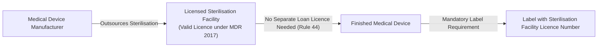
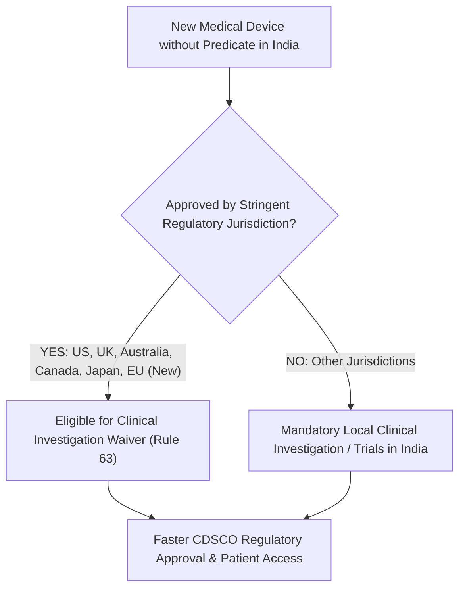

# Current Affairs — 25 August 2026

> **Source:** *The Hindu* (National / Health & Governance)  
> **Date Added:** 2026-08-25  
> **Target Exam:** UPSC CSE 2027 (Prelims & Mains)

---

## Topic 1: Medical Devices Rules, 2017 Amendments — Outsourced Sterilisation & Loan Licencing Reform (Rule 44)

> **Headline:** *"Centre moves to simplify medical device regulations"*  
> **Author / Source:** Bindu Shajan Perappadan (*The Hindu*, New Delhi)  
> **GS Paper:** GS-II (Government Policies & Interventions, Regulatory Governance, Ease of Doing Business) & GS-III (Biomedical Manufacturing, MSME Competitiveness)  
> **Micro-Topic ID:** `CA-260825-01`

### 1. What changed?
* The Union Ministry of Health and Family Welfare (MoHFW) has proposed draft amendments to the **Medical Devices Rules, 2017** (framed under the **Drugs and Cosmetics Act, 1940**) to promote ease of doing business, standardise testing fees, and accelerate market access.
* **Amendment to Rule 44 (Outsourced Sterilisation):**
  - **Previous System:** Medical device manufacturers were required to obtain a separate **loan licence** to outsource sterilisation, even when the third-party sterilisation facility itself held a valid manufacturing/processing licence under the Medical Devices Rules, 2017.
  - **New System:** Manufacturers that outsource the sterilisation of their medical devices to an already licensed facility will **no longer have to secure a separate loan licence** for that sterilisation activity.
  - **Objective:** Eliminates regulatory duplication, curtails paperwork and administrative bottlenecks, and slashes compliance costs—particularly for domestic MSME manufacturers lacking captive sterilisation plants.

### 2. Traceability Safeguard & Transition Timeline
* **Traceability Mandate:** To ensure regulatory oversight and uncompromised post-market traceability, manufacturers **must print the licence number of the outsourced sterilisation facility on the medical device label**.
* **Transition Window:** A **6-month transition period** has been granted to manufacturers to modify product labels, packaging artwork, and quality management documentation.

**Prelims trap:** The reform does NOT exempt the sterilisation facility from holding a licence. The facility must be independently licensed. The amendment only removes the redundant loan licence requirement for the manufacturer, while maintaining traceability via mandatory label disclosure.

---

## Topic 2: Global Regulatory Convergence — Inclusion of European Union (EU) in Stringent Regulatory Jurisdictions (Rule 63)

> **Headline:** *"EU added to recognised jurisdictions for clinical investigation waiver"*  
> **GS Paper:** GS-II (Health Governance, Bilateral & Multilateral Regulatory Harmonization) & GS-III (Science & Technology — Applications in Health, Biomedical Innovation)  
> **Micro-Topic ID:** `CA-260825-02`

### 1. What changed? (Amendment to Rule 63)
* Under **Rule 63 of the Medical Devices Rules, 2017**, clinical investigation (local clinical trial) requirements can be waived for medical devices that **do not have predicate devices in India**, if they are approved by recognized **Stringent Regulatory Jurisdictions (SRJs)**.
* **Recognized Jurisdictions Matrix:**
  1. **United States** (US FDA)
  2. **United Kingdom** (MHRA)
  3. **Australia** (TGA)
  4. **Canada** (Health Canada)
  5. **Japan** (PMDA)
  6. **European Union (EU)** — **Newly Added via 2026 Amendment** (approved under EU Medical Device Regulation / CE Mark).

### 2. Strategic & Public Health Significance
* **Eliminating Redundant Trials:** Avoids repeated, expensive human clinical trials in India for devices that have already passed stringent clinical evaluation under the rigorous EU MDR framework.
* **Accelerated Patient Access:** Reduces regulatory lead time from 12–24 months down to a few months, enabling Indian patients to access advanced diagnostic, cardiovascular, oncological, and orthopedic devices without delay.
* **Cost Reduction:** Lowers trial expenditures for importers and domestic firms partnering with global technology developers, helping make advanced healthcare devices more affordable.

### 3. Core Static Architecture: Medical Device Regulation in India

| Dimension | Legal / Regulatory Provision |
|:---|:---|
| **Governing Act** | **Drugs and Cosmetics Act, 1940** (Medical devices are regulated as statutory "drugs"). |
| **Governing Rules** | **Medical Devices Rules, 2017** (framed by Central Government). |
| **National Regulator** | **CDSCO** (Central Drugs Standard Control Organisation) headed by **DCGI** under MoHFW. |
| **Risk Classification** | • **Class A (Low Risk):** Surgical dressings, thermometers (State Licensing Authority). • **Class B (Low-to-Moderate Risk):** Hypodermic needles, suction pumps (State Licensing Authority). • **Class C (Moderate-to-High Risk):** Dialysis catheters, lung ventilators (Central Licensing Authority). • **Class D (High Risk):** Heart valves, coronary stents, pacemakers (Central Licensing Authority). |
| **Predicate Device** | A device already approved and marketed in India, against which substantial equivalence in safety and performance is benchmarked. |

**Prelims trap:** High-risk Class C and Class D medical devices are licensed exclusively by the Central Licensing Authority (DCGI/CDSCO), NOT by State Licensing Authorities. Furthermore, medical devices are currently regulated under the Drugs and Cosmetics Act, 1940, not under a separate standalone act.

---

## High-Yield UPSC Practice Questions

### Prelims MCQ 1
With reference to the regulation of medical devices in India under the Medical Devices Rules, 2017, consider the following statements:
1. Medical devices are classified into four risk categories (Class A to Class D), where Class D represents the highest risk.
2. Manufacturing licences for all four classes of medical devices are issued exclusively by State Licensing Authorities.
3. Clinical investigation requirements in India can be waived for eligible devices approved by regulatory bodies in the US, UK, Australia, Canada, Japan, and the European Union.

Which of the statements given above are correct?
- (a) 1 and 2 only
- (b) 1 and 3 only
- (c) 2 and 3 only
- (d) 1, 2 and 3

> **Answer:** **(b)**  
> **Explanation:** Statement 1 is correct (Class A to D risk classification). Statement 2 is incorrect because Class C and Class D (moderate-high and high risk) devices are licensed by the Central Licensing Authority (DCGI/CDSCO), while Class A and Class B are licensed by State Licensing Authorities. Statement 3 is correct under Rule 63 following the inclusion of the European Union (EU).

### Prelims MCQ 2
With reference to the proposed amendments to the Medical Devices Rules, 2017, consider the following statements:
1. Manufacturers outsourcing sterilisation are no longer required to obtain a separate loan licence, provided the sterilisation facility holds a valid licence under the rules.
2. The requirement to print the sterilisation facility's licence number on the medical device packaging has been completely done away with.
3. The European Union has been recognized among stringent regulatory jurisdictions for waiving clinical investigation requirements for devices lacking predicate devices in India.

Which of the statements given above are correct?
- (a) 1 and 2 only
- (b) 2 and 3 only
- (c) 1 and 3 only
- (d) 1, 2 and 3

> **Answer:** **(c)**  
> **Explanation:** Statement 2 is incorrect because traceability is explicitly retained by mandating that the licence number of the outsourced sterilisation facility be printed on the device label. Statements 1 and 3 are correct.

### Mains Practice Question (GS-II / GS-III)
> **Q. "Balancing regulatory oversight with Ease of Doing Business is critical to ensure patient safety while accelerating access to life-saving medical innovations." Critically analyze the recent amendments to the Medical Devices Rules, 2017 in this context. (15 Marks, 250 Words)**

**Answer Outline:**
* **Introduction:** Mention India's rapidly growing MedTech market (~$11B heading towards $50B by 2030, currently 75–80% import dependent for high-end devices) and the Union Health Ministry's proposed amendments to Rules 44 & 63 of Medical Devices Rules, 2017.
* **Key Ease of Doing Business (EoDB) Measures:**
  - *Rule 44 (Sterilisation):* Eliminates redundant loan licensing for outsourced sterilisation, lowering compliance costs and administrative load for MSMEs while maintaining traceability via packaging labels.
  - *Rule 63 (SRJ Expansion to EU):* Recognizes EU MDR approvals for clinical trial waivers on non-predicate devices, slashing approval timelines from 1–2 years to a few months.
* **Balancing Safety and Regulatory Governance:**
  - *Traceability & Quality Assurance:* Mandatory label disclosure maintains supply-chain accountability.
  - *Need for Robust Post-Market Surveillance:* Strengthening the Materio-Vigilance Programme of India (MvPI) to detect adverse events in real-world Indian settings.
  - *Encouraging Domestic Innovation:* Ensuring that fast-tracking foreign approvals does not disincentivize indigenous R&D and manufacturing under the MedTech PLI scheme.
* **Way Forward & Conclusion:** Move towards a dedicated Medical Devices Act, build accredited national testing labs with standardised fees, upgrade CDSCO technical capacity, and foster domestic clinical trial registries for ethnic safety validation.

---

<!-- 2026-08-25: Created daily current affairs note covering (1) Medical Devices Rules 2017 amendments to Rule 44 (outsourced sterilisation loan licence removal + labelling traceability) and (2) Rule 63 (inclusion of European Union in Stringent Regulatory Jurisdictions for clinical investigation waiver). -->
