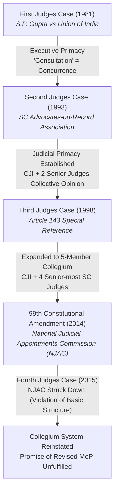
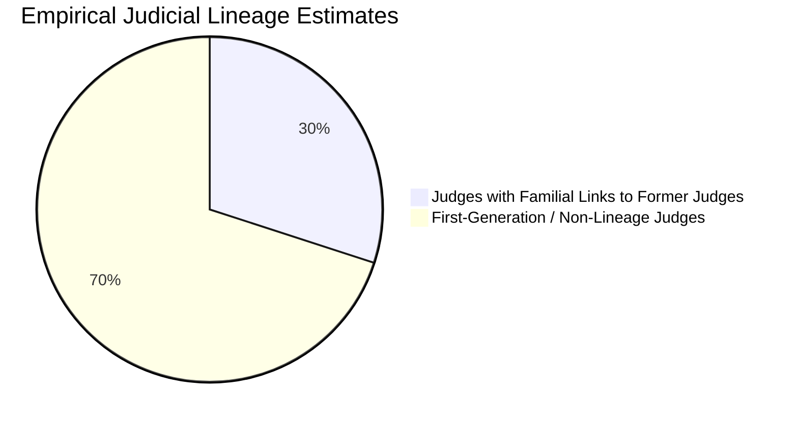
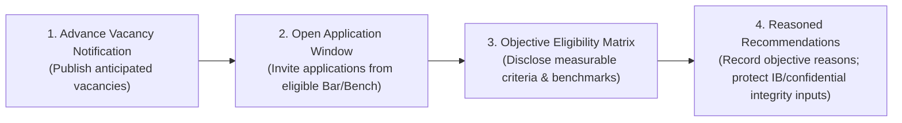

# Current Affairs — 26 August 2026

> **Source:** *The Hindu* (Editorial / Constitutional Law & Judicial Governance)  
> **Date Added:** 2026-08-26  
> **Target Exam:** UPSC CSE 2027 (GS Paper II — Judiciary, Separation of Powers, Constitutional Governance & Accountability)

---

## Lead Editorial: "End the Culture of Secrecy in Judicial Appointments"

> **Author:** Puhazh Gandhi P. (*Lawyer and political analyst*)  
> **GS Paper:** **GS-II** (Structure, Organisation and Functioning of the Judiciary; Judicial Appointments, Independence vs Accountability; Articles 124, 217, 14, 16; Right to Information Act, 2005)  
> **Key Judicial Observation:** Justice Ujjal Bhuyan (Supreme Court of India) on greater openness in the Collegium process.

---

## Topic 1: Judicial Appointments & Collegium Evolution — The Opacity Trajectory

> **Micro-Topic ID:** `CA-260826-01`

### 1. Context & Justice Ujjal Bhuyan's Observation
* **Recent Trigger:** Supreme Court judge **Justice Ujjal Bhuyan** observed that **greater openness in the collegium process would strengthen public confidence and help ensure that merit remains the governing principle**.
* **Core Constitutional Dilemma:** Insulation from executive interference was never intended to become **insulation from constitutional accountability itself**—a core structural friction that has persisted for over three decades.

### 2. Evolution of the Collegium System (Judges Cases Matrix)
The collegium is an **extra-constitutional judicial creation**, not an explicit text of the Constitution:

* **Fali S. Nariman's Critique:** Senior jurist Fali Nariman, celebrated as an architect of the collegium in the Second Judges Case (1993), later turned into a vocal critic, lamenting that the system became **"not receptive at all" to the Bar and answered to no one**.

### 3. Resolutions Without Reasons: The Institutional Retreat into Opacity
* **October 2017 Breakthrough:** The Supreme Court Collegium voluntarily began publishing brief resolutions with reasons for elevation on its official website, hailed as a foundation for institutional transparency.
* **November 28, 2024 Reversal:** The Collegium quietly stopped disclosing which collegium members took part in decision-making and ceased publishing reasoning behind recommendations.
* **November 2025 Confirmation:** Former CJI **B.R. Gavai** confirmed that the Collegium resolved to halt detailed disclosures, arguing that publishing rejection reasons could *“harm the career prospects of unselected candidates”*—a rationale critics note would equally justify withholding reasons from rejected litigants.
* **The *MediaOne (2023)* Double Standard:** In the *Madhyamam Broadcasting Ltd (MediaOne) Judgment (2023)*, the Supreme Court held that **sealed-cover secrecy is "antithetical to a transparent and accountable system"**. Applying opacity to judicial appointments while demanding open justice from other institutions creates an untenable constitutional asymmetry.

---

## Topic 2: Nepotism, Constitutional Jurisprudence & The "Uncle Judges" Syndrome

> **Micro-Topic ID:** `CA-260826-02`

### 1. The "Uncle Judges" Syndrome & Empirical Reality
* **Former CJI R.M. Lodha's Admission:** Justice R.M. Lodha publicly remarked that **nearly one in three High Court judges could be an "uncle"** (having familial lineage in the judiciary).
* **Empirical Evidence:**
  - **2018 High Court Data:** The Union Law Ministry flagged **11 out of 33 names** recommended by the Allahabad High Court collegium as relatives of sitting or retired judges.
  - **2025 Supreme Court Assessment:** Nearly **30% of Supreme Court judges (roughly 10 of 33)** had familial ties to former judges.
  - **January 2025 Collegium Meeting:** The collegium deliberated a proposal to bar judges' kith and kin; while heightened scrutiny was agreed to in principle, **no formal bar or objective eligibility matrix was created**. Without an objective selection rubric, distinguishing a meritorious relative from a beneficiary of judicial lineage remains impossible.

### 2. Constitutional Inward Friction: Articles 14 & 16 vs Opacity
* **Articles 14 & 16:** Guarantee equality of status, equal protection of laws, and equality of opportunity in matters of public employment.
* ***Secretary, State of Karnataka vs Umadevi (2006):*** The Supreme Court constitutionally ruled that appointments to public office **cannot be made through backdoor methods** and must follow a transparent, open procedure accessible to all eligible citizens.
* **Constitutional Irony:** If equality jurisprudence mandates transparent, advertised processes for recruiting a public engineer or civil servant, the highest constitutional adjudicators cannot claim blanket exemption.
* ***CPIO vs Subhash Chandra Agarwal (2019):*** A 5-Judge Constitution Bench ruled that the **Office of the Chief Justice of India is a "Public Authority" under Section 2(h) of the RTI Act, 2005**, holding that judicial independence is not a shield against transparency. However, appointment deliberations continue to be shielded from RTI scrutiny.

---

## Topic 3: Global Comparative Models & The 4-Point Reform Blueprint

> **Micro-Topic ID:** `CA-260826-03`

### 1. Comparative Global Judicial Appointment Models

| Country | Appointing Mechanism | Transparency & Public Participation | Core Feature |
|:---|:---|:---|:---|
| **United Kingdom (UK)** | **Judicial Appointments Commission (JAC)** | • Publicly advertises all vacancies. • Open applications based on statutory merit. • Structured, competency-based interviews. | Independent statutory body; excludes political packing while maintaining open merit. |
| **South Africa** | **Judicial Service Commission (JSC)** | • Public nomination process. • **Publicly televised live interviews** of shortlisted candidates. • Detailed public scrutiny of integrity and jurisprudence. | Highest constitutional transparency; strengthens democratic legitimacy. |
| **India** | **Supreme Court / HC Collegium** | • **Zero vacancy advertisement**. • No application process (closed internal nomination). • No publicly disclosed evaluation matrix. • Deliberations in camera without recorded reasons. | Complete judicial monopoly; highly insulated from public scrutiny. |

### 2. Habermasian Public Sphere & Democratic Legitimacy
* Political philosopher **Jürgen Habermas** posited that **democratic legitimacy rests upon public justification within the *public sphere***—an arena where public institutions must justify their decisions before rational, informed citizens.
* **Modern Social Media Scrutiny:** Judicial actions and oral observations are now dissected instantaneously in the digital public sphere. Traditional **contempt of court powers cannot suppress wide-scale public scrutiny**. Voluntary structural reform is essential to prevent the slow erosion of judicial legitimacy.

> **Core Constitutional Doctrine:** *"The judiciary that demands transparency from every institution of governance cannot ask citizens to trust it on faith alone."* Judicial independence and constitutional accountability are complementary values, not adversarial forces.

### 3. The 4-Point Practical Reform Blueprint (Reform, Not Retreat)
Modernising the collegium does *not* require dismantling it or compromising judicial independence:

1. **Advance Vacancy Notification:** Announce upcoming judicial vacancies publicly well ahead of retirement dates.
2. **Open Application Window:** Invite applications and nominations from all eligible advocates and judicial officers across diverse socio-economic backgrounds.
3. **Objective Selection Matrix:** Disclose measurable criteria (reported judgments, disposal rates, domain expertise, integrity benchmarks).
4. **Reasoned Decision-Making:** Record transparent reasons explaining candidate selection over others, while keeping sensitive intelligence/character reports confidential.

---

## 🏛️ Comprehensive Comparative Summary Table

| Parameter | 1980s–1990s Appointment Debate | 2020s Modern Appointment Debate |
|:---|:---|:---|
| **Primary Conflict** | Executive Primacy vs Judicial Primacy | **Opacity vs Transparency & Accountability** |
| **Core Apprehension** | Executive political interference / "Committed Judiciary" | Nepotism ("Uncle Judges"), Lack of Diversity, Inward Secrecy |
| **Governing Landmark** | *First Judges (1981)*, *Second Judges (1993)*, *Third Judges (1998)* | *NJAC (2015)*, *Subhash Agarwal (2019)*, *MediaOne (2023)* |
| **Proposed Solution** | Judicial Collegium Monopoly | **Open Eligibility Matrix, Reasoned Resolutions & JAC-style openness** |

---

## High-Yield UPSC Practice Questions

### Prelims MCQ 1
With reference to judicial appointments in India, consider the following statements:
1. The Collegium system for appointment of Supreme Court judges was explicitly incorporated into the Constitution through the 44th Constitutional Amendment Act.
2. In the *CPIO vs Subhash Chandra Agarwal (2019)* judgment, the Supreme Court held that the Office of the Chief Justice of India is a public authority under the Right to Information Act, 2005.
3. In *Secretary, State of Karnataka vs Umadevi (2006)*, the Supreme Court ruled that public employment appointments must adhere to open and transparent procedures under Articles 14 and 16.

Which of the statements given above are correct?
- (a) 1 and 2 only
- (b) 2 and 3 only
- (c) 1 and 3 only
- (d) 1, 2 and 3

> **Answer:** **(b)**  
> **Explanation:** Statement 1 is incorrect because the Collegium system is a judge-made creation through the Second (1993) and Third (1998) Judges Cases, not an amendment to the Constitution. Statements 2 and 3 are correct.

---

### Prelims MCQ 2
Consider the following statements regarding international judicial appointment systems:
1. In the United Kingdom, judicial appointments are conducted by an independent Judicial Appointments Commission that publicly advertises vacancies.
2. In South Africa, the Judicial Service Commission conducts publicly televised interviews of shortlisted candidates.
3. In India, the Memorandum of Procedure (MoP) mandates the publication of detailed marks and criteria for all collegium recommendations.

Which of the statements given above are correct?
- (a) 1 and 2 only
- (b) 2 and 3 only
- (c) 1 and 3 only
- (d) 1, 2 and 3

> **Answer:** **(a)**  
> **Explanation:** Statements 1 and 2 correctly describe the UK JAC and South African JSC systems. Statement 3 is incorrect; the collegium does not use an eligibility marks matrix or publish detailed evaluation metrics.

---

### Mains Answer Writing Question
> **Question (GS Paper II — 250 Words | 15 Marks):**  
> *"Insulation from executive interference was never meant to become insulation from constitutional accountability." In light of recent observations by sitting Supreme Court judges and international best practices, critically evaluate the need for structural transparency and an objective eligibility framework in the Indian Collegium system.*

#### Model Outline & Answer Structure:
* **Introduction (30–40 words):**  
  - Cite Justice Ujjal Bhuyan's observation and contrast the 1990s debate (*Executive vs Judiciary*) with today's debate (*Opacity vs Transparency*).
* **Body Paragraph 1: Issues Plagueing the Current Collegium System (70 words):**  
  - Closed-door deliberations, sudden halt to publishing reasons (Nov 2024/2025 CJI B.R. Gavai resolution).  
  - Empirical data on "Uncle Judges" syndrome (2018 Allahabad HC data, 2025 assessment showing ~30% SC judges with judicial lineage).  
  - Inward constitutional friction with Articles 14 & 16 and *Umadevi (2006)* backdoor recruitment bar.
* **Body Paragraph 2: Judicial Self-Contradictions (40 words):**  
  - Contrast *MediaOne (2023)* ban on sealed-cover secrecy with appointment opacity.  
  - *Subhash Chandra Agarwal (2019)* brought CJI office under RTI, yet collegium processes remain shielded.
* **Body Paragraph 3: Global Best Practices & 4-Point Reform Roadmap (70 words):**  
  - Lessons from UK Judicial Appointments Commission (advertised vacancies) and South African JSC (public interviews).  
  - Practical 4-point reform: Advance vacancy disclosure, open Bar applications, objective merit matrix, and reasoned resolutions while protecting sensitive IB integrity inputs.
* **Conclusion (30 words):**  
  - Invoke Habermasian democratic legitimacy: Judicial independence is strengthened, not diluted, when appointments are anchored in procedural fairness and public trust.

---

<!-- 2026-08-26: Created from The Hindu editorial (26 Aug 2026) by Puhazh Gandhi P. Covers Justice Ujjal Bhuyan observation, Collegium opacity, Judges Cases evolution, MediaOne sealed-cover doctrine, Umadevi public employment equality, Uncle Judges data, UK JAC/South Africa JSC models, and 4-point reform blueprint. -->
