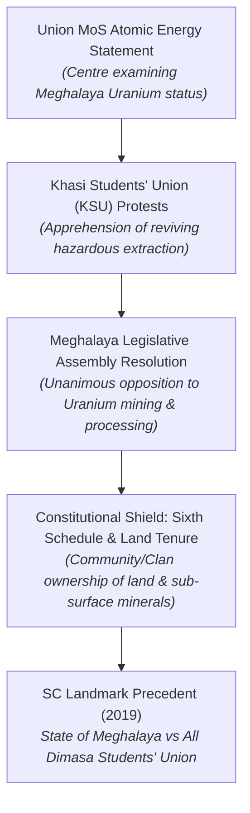
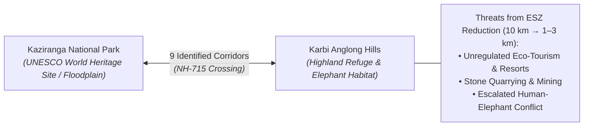
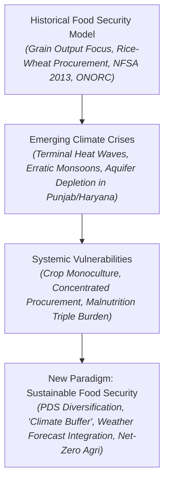

# Current Affairs — 27 August 2026

> **Source:** *The Hindu* (National, Environment & Lead Editorial by UN WFP Country Director Elisabeth Faure & Purvi Mehta)  
> **Date Added:** 2026-08-27  
> **Target Exam:** UPSC CSE 2027 (GS Paper II — Sixth Schedule, Federalism, Tribal Rights, Welfare Governance; GS Paper III — Nuclear Minerals, Environment & Ecology, ESZ Framework, Agriculture, PDS, Climate-Resilient Food Security & Net-Zero)

---

## Lead Editorial: "Making India's Food System Climate-Proof Cannot Wait"
> **Authors:** Elisabeth Faure (*Country Director, UN World Food Programme in India*) & Purvi Mehta (*International Expert on Nutrition-Sensitive Agriculture & Food Systems*)  
> **GS Paper:** **GS-III** (Major Crops & Cropping Patterns; Public Distribution System — Objectives, Functioning & Revamping; Food Security; Economics of Animal-Rearing; Climate Change Adaptation & Net-Zero Agriculture) & **GS-II** (Welfare Schemes, Poverty & Malnutrition — SDG 2 & SDG 13)

---

## Topic 1: Meghalaya Uranium Mining Resolution & Sixth Schedule Mineral Jurisprudence

> **Micro-Topic ID:** `CA-260827-01`

### 1. Context & Legislative Resolution
* **Meghalaya Assembly Action:** On Wednesday, the **60-member Meghalaya Legislative Assembly unanimously adopted a resolution opposing uranium mining** and the establishment of any uranium ore-processing facility in the State.
* **Mover:** Chief Minister **Conrad K. Sangma** moved the resolution, declaring that the state government stands in unison with indigenous tribal communities living in the uranium-bearing belts of **West Khasi Hills and South West Khasi Hills** districts.
* **Catalyst:** The move followed widespread mobilisations by the **Khasi Students' Union (KSU)** and local civil society groups after Union Minister of State for Atomic Energy **Jitendra Singh** stated that the Centre was examining the status of uranium mining in Meghalaya—viewed locally as a precursor to reviving exploration in ecologically fragile tribal lands.



### 2. Constitutional & Legal Framework: Sixth Schedule vs Central Primacy

```
┌─────────────────────────────────────────────────────────────────────────────┐
│                    MINERAL OWNERSHIP JURISPRUDENCE                          │
├──────────────────────────────────────┬──────────────────────────────────────┤
│ Standard Constitutional Principle   │ Sixth Schedule (Meghalaya) Exception │
├──────────────────────────────────────┼──────────────────────────────────────┤
│ • Sub-surface mineral wealth vests   │ • Supreme Court in State of          │
│   in the State/Union Government      │   Meghalaya vs All Dimasa Students'  │
│   under Eminent Domain doctrine.     │   Union (2019) ruled that private    │
│ • Surface land ownership does NOT    │   and community tribal landowners    │
│   confer ownership over sub-surface  │   own BOTH surface AND sub-surface   │
│   minerals.                          │   minerals beneath their land.       │
│ • Centre exercises exclusive domain  │ • Customary and clan rights under    │
│   over atomic substances under the   │   the Sixth Schedule protect         │
│   Atomic Energy Act, 1962 & MMDR.   │   indigenous resource sovereignty.   │
└──────────────────────────────────────┴──────────────────────────────────────┘
```

* **Sixth Schedule (Articles 244(2) & 275(1)):** Grants autonomous administrative powers to Autonomous District Councils (ADCs) in Assam, Meghalaya, Tripura, and Mizoram, protecting customary laws, clan tenure, and tribal heritage.
* **Landmark SC Verdict — *State of Meghalaya vs All Dimasa Students' Union (2019)*:**
  - The Supreme Court recognized that in Meghalaya's tribal areas, <span style="color: #e53e3e;">**the private landowner/community owns not just the surface land, but also the minerals beneath the land**</span>.
  - While regulation of mining operations falls under Central environmental and safety statutes, extraction cannot be forcibly imposed against the proprietary and customary consent of tribal landowners.

### 3. Historical Resistance & Resource Geography
* **Geographical Distribution:** Meghalaya possesses one of India's largest deposits of high-grade sandstone-type uranium, concentrated in **South West Khasi Hills** (Domiasiat, Wahkaji, Mawthabah, Lostoin, and Wah Blei river basin).
* **Anti-Uranium Day (October 28):** Commemorates the death anniversary of iconic Khasi anti-mining activist **Spility Lyngdoh Langrin** (died 2020).
  - In 1993, the Atomic Minerals Directorate (AMD) undertook exploratory drilling; Langrin famously **rejected lucrative financial offers to sell her ancestral land**, prioritizing community health, pristine waters, and tribal heritage.
  - Sustained public agitations forced AMD to suspend operations.
  - In 2009, the Meghalaya government granted exploratory permission to the **Uranium Corporation of India Limited (UCIL)** for 422 hectares, but relentless local protests compelled the state government to revoke the permission in August 2016.

---

## Topic 2: Kaziranga ESZ Reduction Plan & Karbi Anglong Wildlife Corridors

> **Micro-Topic ID:** `CA-260827-02`

### 1. Context & The Statewide Padayatra
* **Protest Action:** The Opposition Congress in Assam announced a Statewide **'padayatra' on August 29** to protest against the state government's proposal to reduce the **Eco-Sensitive Zone (ESZ)** buffer around **Kaziranga National Park**.
* **The Proposal:** The Assam government plans to send a proposal to the Union Ministry of Environment, Forest and Climate Change (MoEFCC) seeking a **reduction of Kaziranga's peripheral buffer zone from the default 10 km to between 1 km and 3 km**.
* **Government Justification:** Assam Chief Minister **Himanta Biswa Sarma** defended the proposal, asserting that a reduced buffer zone is intended to protect indigenous villagers living in the periphery from stringent building and land-use restrictions, thereby safeguarding rural livelihoods.
* **Environmentalists' Warning:** Narrowing the buffer zone threatens to trigger acute **human-wildlife conflict**, open pristine eco-zones to commercial stone quarrying and unregulated tourism, and disrupt critical elephant corridors connecting Kaziranga to the Karbi Anglong hills.



### 2. Legal & Regulatory Architecture of Eco-Sensitive Zones (ESZ)

* **Statutory Genesis:** ESZs are notified under **Section 3 of the Environment (Protection) Act, 1986 (EPA 1986)** read with the National Wildlife Action Plan (2002–2016).
* **Core Objective:** Act as **"shock absorbers"** and transition zones around Protected Areas (National Parks and Wildlife Sanctuaries), regulating human activities to prevent ecological degradation.

| Activity Category | Permissibility Status | Illustrative Activities |
|:---|:---|:---|
| **Prohibited Activities** | Strictly Barred ❌ | Commercial mining, stone quarrying, saw mills, polluting industries (orange/red category), major commercial hydro projects. |
| **Regulated Activities** | Conditional / Permitted with Prior Clearance ⚠️ | Commercial felling of trees, establishment of hotels and resorts, widening of roads, ground water extraction for commercial use. |
| **Permitted Activities** | Freely Allowed ✅ | Ongoing agricultural and horticultural practices, rainwater harvesting, organic farming, use of renewable energy sources. |

* **Supreme Court Jurisprudence (*In Re: T.N. Godavarman / Goa Foundation*):**
  - The Supreme Court initially mandated a uniform **1 km minimum ESZ** around all protected areas.
  - In subsequent clarifications (2023), the Court permitted **site-specific modifications** where strict 1 km rules would disrupt dense pre-existing human habitations, provided proper scientific rationalization is vetted by the MoEFCC and the Central Empowered Committee (CEC).

### 3. Ecological Significance of the Kaziranga–Karbi Anglong Landscape
* **UNESCO World Heritage & Megafauna Haven:** Kaziranga hosts two-thirds of the world's population of the **Great Indian One-Horned Rhinoceros** (*Rhinoceros unicornis*), along with significant densities of Royal Bengal Tigers, Asian Elephants, Wild Water Buffalo, and Swamp Deer (*Big Five*).
* **Flood Migration Dynamics:** During annual Brahmaputra monsoonal floods, 70–80% of Kaziranga's grassland floodplains get submerged. Wildlife survives by migrating across **National Highway 715 (old NH-37)** to the elevated highlands of **Karbi Anglong**.
* **Corridor Vulnerability:** There are **9 critical animal corridors** (including Haldibari, Panbari, Kanchanjuri, Amguri). <span style="color: #e53e3e;">Any reduction of the ESZ buffer directly exposes these fragile migratory corridors to commercial construction and mining, severing genetic connectivity and driving wildlife into direct conflict with humans.</span>

---

## Topic 3: Climate-Proofing India's Food System — From 'Food Security' to 'Sustainable Climate Buffer'

> **Micro-Topic ID:** `CA-260827-03`

### 1. The Historical Achievement vs The Climate Precipice
* **The Transition (1960s to 2020s):** India transformed from a food-insecure nation dependent on ship-to-mouth foreign food aid (US PL-480) in the 1960s to a global agricultural powerhouse, generating substantial buffer stocks.
* **Legislative Anchor:** The **National Food Security Act (NFSA), 2013** created a justiciable legal entitlement to subsidised foodgrains for **~800 million citizens** (~67% of the population).
* **Production Milestone (2024–25):** Foodgrain production crossed a record **350 million tonnes**, driven by bumper rice and wheat harvests.
* **Modernisation & Portability:** PDS reforms, end-to-end digitisation, Aadhaar seeding, and **One Nation One Ration Card (ONORC)** have made food entitlements borderless across all States and UTs.



### 2. Systemic Climate Vulnerabilities in India's Agriculture
* **Climate Stressors:**
  - **Terminal Heat & Heatwaves:** Premature heat spikes during wheat maturation stages reduce grain weight and harvest yields.
  - **Monsoon Volatility:** Erratic precipitation, prolonged dry spells, and cloudbursts disrupt paddy sowing and transplantation cycles.
  - **Groundwater Depletion:** Over-reliance on water-intensive paddy procurement in semi-arid zones (Punjab, Haryana) has caused severe aquifer exhaustion.
* **Risk Concentration in Rice-Wheat Monoculture:** The national procurement apparatus remains heavily concentrated in two water-intensive cereal crops in limited geographies, creating severe ecological and supply-chain vulnerabilities.

### 3. The Faure-Mehta Blueprint: 6 Pillars for Climate-Proofing Food Systems

```
┌─────────────────────────────────────────────────────────────────────────────┐
│                 6-PILLAR CLIMATE-PROOFING BLUEPRINT                         │
├─────────────────────────────────────────────────────────────────────────────┤
│ 1. Procurement Diversification (Millets, Pulses, Oilseeds across states)    │
│ 2. PDS Basket Diversification (Combat Triple Burden of Malnutrition)        │
│ 3. Climate-Informed Decisions (Direct IMD Forecasts & NFSA Climate Metrics) │
│ 4. Comprehensive 'Climate Buffer' (Drought Seeds, Water, Resilient Storage) │
│ 5. Supply Chain Climate Resilience (Flood-Proof Silos, Heat Cold Chains)    │
│ 6. Climate Finance & Net-Zero Alignment (Green Bonds, Soil Carbon Sinks)    │
└─────────────────────────────────────────────────────────────────────────────┘
```

1. **Procurement Diversification Across Crops & Geographies:**
   - Progressively align Price Support (MSP) and state procurement with **agro-climatic suitability**.
   - Expand procurement to **millets (*Shree Anna* — Ragi, Jowar, Bajra)**, pulses, and oilseeds, reducing risk concentration and conserving groundwater.
2. **PDS Basket Diversification:**
   - Transition PDS from cereal-heavy rations to a **nutritionally diverse food basket** containing locally adapted millets and pulses.
   - Addresses the **"triple burden of malnutrition"** (undernutrition, micronutrient deficiencies, and obesity/lifestyle diseases).
3. **Institutionalizing Climate Intelligence in NFSA:**
   - Link **India Meteorological Department (IMD)** seasonal forecasts directly to grain procurement schedules, buffer-stock targets, and contingency off-take.
   - Embed climate indicators (heat-stress days, water-stress indices, storage exposure risks) into the **NFSA monitoring framework**.
4. **The "Climate Buffer" Paradigm:**
   - Expand the traditional physical grain buffer into a dynamic **"Climate Buffer"** combining diversified grain reserves, climate-resilient certified seed varieties, precision irrigation (micro-irrigation and watershed management), and weather-indexed insurance (PMFBY).
5. **Supply Chain Infrastructure Resilience:**
   - Modernize grain storage with **flood-resilient silos**, temperature-controlled warehouses, and expanded cold-chain transport networks to prevent post-harvest spoilage during extreme climate events.
6. **Climate Finance & Net-Zero Integration:**
   - Deploy **green bonds, adaptation finance, and blended private-public capital**.
   - Embed agriculture into India's **Net-Zero 2070 pathway** by rewarding soil carbon sequestration, regenerative agricultural practices, and measurable farm emission reductions.

> <span style="color: #e53e3e;">**Core Policy Shift:** Transition the national policy architecture from reactive **"Food Security"** (managing deficits after climate shocks) to proactive **"Sustainable Food Security"**, embedding climate risk management as a **first-order design parameter in NFSA** rather than an externality managed after the fact.</span>

---

## 🏛️ Comprehensive Comparative Summary Table

| Parameter | Traditional Food Security Model | Modern Climate-Resilient Food System |
|:---|:---|:---|
| **Core Philosophy** | Calorie Sufficiency & Famine Prevention | **Nutritional Diversity & Climate Resilience** |
| **Primary Commodities** | Rice & Wheat Monoculture | **Rice, Wheat, Millets (*Shree Anna*), Pulses & Oilseeds** |
| **Procurement Base** | Concentrated in a few north-western States | **Decentralised across local agro-ecological zones** |
| **Strategic Reserve** | Physical grain buffer stocks in FCI godowns | **Dynamic "Climate Buffer" (Grains + Seeds + Water + Insurance)** |
| **Climate Integration** | Post-disaster relief / Reactive crisis management | **First-order design parameter in NFSA monitoring & IMD linkage** |
| **Environmental Focus** | Maximum yield per hectare | **Sustainable yield per drop of water + Soil Carbon Sequestration** |

---

## High-Yield UPSC Practice Questions

### Prelims MCQ 1
With reference to the mining of minerals in India and constitutional provisions, consider the following statements:
1. In the landmark judgment *State of Meghalaya vs All Dimasa Students' Union (2019)*, the Supreme Court ruled that in Sixth Schedule areas of Meghalaya, private and community tribal landowners hold ownership rights over both surface land and sub-surface minerals.
2. Under the Atomic Energy Act, 1962, the Central Government has exclusive authority over the production, development, and use of atomic energy and prescribed substances like uranium.
3. The Sixth Schedule of the Indian Constitution applies to tribal areas in the States of Assam, Meghalaya, Tripura, and Nagaland.

Which of the statements given above are correct?
- (a) 1 and 2 only
- (b) 2 and 3 only
- (c) 1 and 3 only
- (d) 1, 2 and 3

> **Answer:** **(a)**  
> **Explanation:** Statement 1 is correct; the Supreme Court recognized tribal community/private ownership over sub-surface minerals in Meghalaya under Sixth Schedule customary tenure. Statement 2 is correct; atomic minerals and nuclear energy fall strictly within Union jurisdiction under the Atomic Energy Act, 1962 and Entry 6 of List I (Union List). Statement 3 is incorrect because the Sixth Schedule applies to Assam, Meghalaya, Tripura, and **Mizoram (AMTM)**, NOT Nagaland (which is governed under Article 371A).

---

### Prelims MCQ 2
Regarding Eco-Sensitive Zones (ESZ) around protected areas in India, consider the following statements:
1. Eco-Sensitive Zones are statutorily declared under the provisions of the Wildlife (Protection) Act, 1972.
2. Commercial mining and stone quarrying are strictly prohibited activities within an Eco-Sensitive Zone.
3. Ongoing agricultural and horticultural practices by local communities are categorized as permitted activities in an ESZ.

Which of the statements given above are correct?
- (a) 1 and 2 only
- (b) 2 and 3 only
- (c) 1 and 3 only
- (d) 1, 2 and 3

> **Answer:** **(b)**  
> **Explanation:** Statement 1 is incorrect; ESZs are notified under **Section 3 of the Environment (Protection) Act, 1986 (EPA 1986)**, not the Wildlife (Protection) Act, 1972. Statements 2 and 3 are correct. Commercial mining is strictly prohibited, while traditional agriculture and horticulture are permitted activities.

---

### Prelims MCQ 3
Consider the following statements regarding India's food security framework and climate adaptation:
1. The National Food Security Act (NFSA), 2013 legally entitles priority households to receive 5 kg of foodgrains per person per month at subsidized rates.
2. The One Nation One Ration Card (ONORC) scheme enables migrant beneficiaries to access their NFSA entitlements from any Fair Price Shop across the country using biometric authentication.
3. Cultivation of millets (*nutri-cereals*) generally requires significantly higher water inputs and greenhouse gas footprints compared to conventional wetland paddy cultivation.

Which of the statements given above are correct?
- (a) 1 and 2 only
- (b) 2 and 3 only
- (c) 1 and 3 only
- (d) 1, 2 and 3

> **Answer:** **(a)**  
> **Explanation:** Statements 1 and 2 are correct. Statement 3 is incorrect; millets are drought-tolerant, climate-resilient crops that consume **70% less water** than wetland paddy and have a minimal greenhouse gas emission footprint compared to methane-emitting anaerobic paddy fields.

---

### Mains Answer Writing Question

> **Question (GS Paper III — 250 Words | 15 Marks):**  
> *"India's journey from ship-to-mouth dependence to a cereal-surplus nation is a triumph of public policy; however, climate change threatens to derail this achievement unless the food system is systematically climate-proofed." Critically examine the ecological and structural vulnerabilities of India's current procurement framework and propose measures to transition towards a climate-resilient 'Sustainable Food Security' architecture.*

#### Model Answer Structure:

* **Introduction (30–40 words):**  
  - Highlight India's transition from 1960s food aid to record >350 million tonnes grain output in 2024–25 and NFSA 2013 covering ~800 million people.
  - State the core thesis: Calorie abundance does not equate to climate resilience; rising temperatures, erratic monsoons, and groundwater stress necessitate a structural paradigm shift.
* **Body Paragraph 1: Ecological & Structural Vulnerabilities of the Current Framework (70 words):**  
  - *Risk Concentration in Rice-Wheat:* Monoculture in semi-arid zones (Punjab, Haryana) has depleted groundwater aquifers and caused soil salinisation.
  - *Climate Shocks:* Terminal heat stress hits wheat harvests; uneven monsoon distribution disrupts Kharif paddy.
  - *Malnutrition Triple Burden:* Cereal-dominated PDS leaves micronutrient deficiencies ("hidden hunger") unaddressed despite calorie sufficiency.
  - *Infrastructure Deficits:* High post-harvest losses due to flood/heat vulnerability in traditional warehousing.
* **Body Paragraph 2: Comprehensive Roadmap for a 'Sustainable Food Security' System (80 words):**  
  - *Procurement & PDS Diversification:* Decentralize procurement; expand MSP and PDS inclusion to locally adapted millets (*Shree Anna*) and pulses to conserve water and enrich diets.
  - *The 'Climate Buffer' Concept:* Broaden strategic grain reserves to include drought-tolerant certified seeds, weather-indexed insurance (PMFBY), and precision micro-irrigation.
  - *Embedding Climate Intelligence:* Direct integration of IMD forecast models into NFSA procurement, storage off-take, and contingency budgeting.
  - *Resilient Supply Chains & Net-Zero Agri:* Invest in flood-proof silos, solarized cold chains, and reward soil carbon sequestration through green adaptation finance.
* **Conclusion (30 words):**  
  - Emphasize the shift from reactive crisis relief to proactive climate risk management as a first-order design parameter in national agricultural policy, achieving SDG 2 (Zero Hunger) and SDG 13 (Climate Action) concurrently.

---

<!-- 2026-08-27: Created Current Affairs note covering Meghalaya Assembly anti-uranium resolution, Sixth Schedule mineral rights & SC Dimasa (2019) verdict, Kaziranga ESZ buffer reduction & Karbi Anglong corridors, and UN WFP lead editorial by Elisabeth Faure & Purvi Mehta on climate-proofing India's food systems. -->
