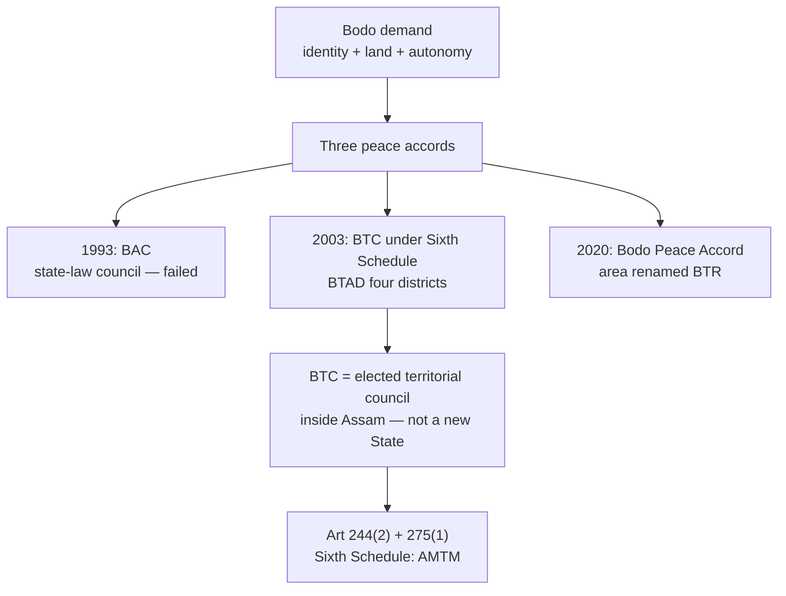
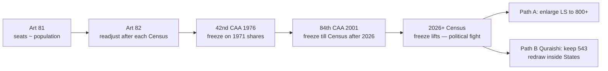

# Current Affairs — 28 August 2026

> **Source:** *The Hindu* (National — Guwahati Bureau; Editorial by S.Y. Quraishi)  
> **Date Added:** 2026-08-28  
> **Target Exam:** UPSC CSE 2027 (GS-II — Sixth Schedule, asymmetric federalism, Parliament, delimitation, federal fairness, women’s reservation)

---

## Topic 1: Bodoland — Sixth Schedule, Three Accords, BTC / BTR

> **Micro-Topic ID:** `CA-260828-01`  
> **GS Paper:** **GS-II** (Indian Constitution — Sixth Schedule; Federalism; Sub-State Autonomy; North-East polity) & **GS-I / Geography** (tea-labour demography of the Brahmaputra valley — 28 Aug Agriculture lecture)

*In the news only as a reminder that the **Bodoland Territorial Council (BTC)** is a living Sixth Schedule body inside Assam. The exam yield is the architecture below, not the personnel.*

### 1. Who / where / why the demand

| Item | Content |
|:---|:---|
| **Who** | **Bodos** — largest plains tribe of Assam (Bodo-Kachari group). **Bodo** is in the **Eighth Schedule** (**92nd Constitutional Amendment Act, 2003** — same year as the BTC accord; also added Dogri, Maithili, Santhali). |
| **Where** | Western Assam, mainly the **north bank of the Brahmaputra** — **Kokrajhar, Chirang, Baksa, Udalguri** (the original **BTAD** four), plus later BTR districts such as **Tamulpur** (carved from Baksa, 2022). |
| **Why** | Identity + land + political voice. British tea planters imported labour from central/eastern India → local Bodos became a **demographic minority** in parts of their homeland (Geography tea lecture). Armed + student politics followed: **All Bodo Students’ Union (ABSU)**, **Bodo Liberation Tigers (BLT)**, **National Democratic Front of Boroland (NDFB)**. |
| **What they did *not* get** | A separate State under **Article 3**. What they got is **asymmetric autonomy inside Assam**. |



### 2. The three Bodo accords (memorise as a ladder)

| Year | Settlement | What it created | Why it mattered / failed |
|:---|:---|:---|:---|
| **1993** | First Bodo Accord (**ABSU**–**Bodo People's Action Committee (BPAC)** with Assam) | **Bodoland Autonomous Council (BAC)** | *State statute*, weak powers, disputed boundary. Collapsed into a second insurgency. |
| **10 Feb 2003** | Second Bodo Accord (Union + Assam + **BLT**) | **BTC** inserted into the **Sixth Schedule**; area called **Bodoland Territorial Autonomous Districts (BTAD)** | First *constitutional* home. BLT disbanded. Four districts: **Kokrajhar, Chirang, Baksa, Udalguri**. Council: **46** (40 elected + 6 nominated); most elected seats reserved for **Scheduled Tribes (ST)**. ~40 subjects transferred. |
| **27 Jan 2020** | Third **Bodo Peace Accord** (Union + Assam + NDFB factions + ABSU + others) | Area recast as **Bodoland Territorial Region (BTR)** | Remaining armed groups in; **BTC seats 40 → 60**; more villages/subjects; **₹1,500 crore** special development package; **Bodo** as **associate official language** of Assam; **Bodo-Kachari Welfare Council** for Bodos *outside* BTR; ST status for Bodos in hill districts (**Karbi Anglong, Dima Hasao**) pursued. |

**BTR ≠ BTC.** **BTR** is the *territory*. **BTC** is the *elected council* that governs it. **Chief Executive Member (CEM)** is the council’s executive head (not a Chief Minister).

### 3. Sixth Schedule home (exam core)

| Item | Content |
|:---|:---|
| **Legal home** | **Sixth Schedule** — **Articles 244(2)** and **275(1)** |
| **Which States** | **AMTM** only: **Assam, Meghalaya, Tripura, Mizoram**. (Nagaland is **Article 371A**, not Sixth Schedule.) |
| **Assam’s ADCs** | **BTC**; **Karbi Anglong Autonomous Council**; **Dima Hasao** (North Cachar Hills) Autonomous Council |
| **What an ADC can do** | **Legislative + executive + judicial** bite over land, forests (other than reserved forests), village administration, inheritance, marriage, social custom — and, in BTC’s case after 2003/2020, a long extra list (education, health, agriculture, etc.). Governor of Assam has a special Sixth Schedule role (assent / modification). |
| **Money** | **Article 275(1)** second proviso: Union grants for Assam’s tribal areas. |

```
┌─────────────────────────────────────────────────────────────────────────────┐
│              FIFTH SCHEDULE                          SIXTH SCHEDULE         │
├──────────────────────────────────────────┬──────────────────────────────────┤
│ Tribal areas of 10 States (not NE-4)     │ Tribal areas of AMTM only        │
│ Art 244(1)                               │ Art 244(2) + 275(1)              │
│ Tribes Advisory Council; Governor        │ Autonomous District / Regional   │
│  reports to President                    │  Councils with law-making power  │
│ PESA 1996 on Fifth Schedule Panchayats   │ Village courts + custom          │
│ Weaker legislative teeth                 │ Stronger sub-State legislature   │
└──────────────────────────────────────────┴──────────────────────────────────┘
```

**Gorkhaland contrast (23 Aug CA):** Darjeeling **GTA (Gorkhaland Territorial Administration)** is a *West Bengal statute*. BTC is in the *Constitution*. That is why BTC has firmer legislative teeth, and why Gorkhas still demand Sixth Schedule / Art 371 / Art 3.

### 4. Politics of the BTR (post-2020 triangle)

| Party | Full form | Anchor |
|:---|:---|:---|
| **BPF** | **Bodoland People’s Front** | **Hagrama Mohilary** (ex-BLT; long-time BTC CEM; 2003 accord lineage) |
| **UPPL** | **United People’s Party Liberal** | **Pramod Boro** (ex-ABSU; BTC CEM after 2020; now **MP**) |
| **BJP** | **Bharatiya Janata Party** | Third pole in BTC elections after the 2020 accord |

This is **coalition sub-State politics inside Assam**, not a separate State party system.

### 5. Prelims traps
* **BTC ≠ State.** No Article 3. Assam Assembly + Governor still sit above it.
* **Sixth ≠ Fifth.** Fifth = TAC + Governor; Sixth = ADC with laws and courts. **PESA** is Fifth Schedule, not Sixth.
* **AMTM**, not Nagaland / Manipur / Arunachal.
* Name the **three** accords (1993 BAC → 2003 BTC/BTAD → 2020 BTR). 1993 had **no** Sixth Schedule status.
* **92nd CAA 2003** put **Bodo** in the Eighth Schedule — same year as BTC, different amendment.
* **BTR** (area) vs **BTC** (council) vs **BTAD** (2003 name of the area).
* Contrast **BTC (constitutional)** with **GTA (statutory)**.

---

## Lead Editorial: "Why 543 should remain 543"

> **Author:** **S.Y. Quraishi** — former **Chief Election Commissioner (CEC)** of India; author of *An Undocumented Wonder — The Making of the Great Indian Election*  
> **Paper / date:** *The Hindu* Editorial, Friday 28 August 2026 (Delhi)  
> **GS Paper:** **GS-II** (Parliament, Representation of the People, Federalism, Constitutional Amendments, Women’s Reservation)

> **Pull quote (paper):** *“Delimitation, federal fairness and women's representation can all be achieved without enlarging the Lok Sabha.”*

---

## Topic 2: Delimitation Freeze — Articles 81 & 82, 42nd and 84th Amendments

> **Micro-Topic ID:** `CA-260828-02`

### 1. Context
Monsoon session adjourned *sine die* on **13 August 2026**. Speculation: a special sitting for **constitutional amendments** on **delimitation** and **women’s reservation**. Quraishi’s first cut: **numbers alone cannot decide** whether the House must grow.

**Lok Sabha (LS)** = lower House of Parliament. Elected strength today = **543**. (The two nominated Anglo-Indian seats were dropped by the **104th Constitutional Amendment Act, 2019**.)

### 2. Constitutional map (memorise this table)

| Provision | What it does |
|:---|:---|
| **Article 81** | Composition of the Lok Sabha. Each State’s seats should **correspond, as nearly as practicable, to its population**. |
| **Article 82** | After every Census, readjust allocation of seats **among States** and the division of each State into constituencies (**delimitation**). |
| **Article 170** | Same logic for **Vidhan Sabhas** (State Legislative Assemblies). |
| **42nd Amendment, 1976** | Froze *inter-State* LS seat shares on the **1971 Census** so that States which did **family planning** (especially the South) were not punished with fewer MPs. Freeze till 2000. |
| **84th Amendment, 2001** | Extended that freeze until the **first Census after 2026**. |
| **87th Amendment, 2003** | Allowed **intra-State** redrawing on the **2001 Census** *without* changing how many seats each State has. |
| **106th Amendment, 2023** (*Nari Shakti Vandan Adhiniyam*) | **One-third** seats in LS and State Assemblies for women — to kick in **after a delimitation based on the first Census after the Act**. |



### 3. Why the freeze exists
Population has grown. That does **not** automatically require **more MPs**.

* The 1971 freeze was a **federal fairness** device: States that implemented family planning (Tamil Nadu, Kerala, Karnataka, Andhra Pradesh / Telangana) should not **lose MPs** to high-growth States.
* If the House is expanded (figures discussed in the editorial: **~50% more**, **800+** members), **absolute gaps** between large and small States **widen** even if *percent* shares look similar.
* Southern and smaller States that **cut fertility** would still **lose relative voice** in a bigger House dominated by high-growth States.

**Prelims trap:** the freeze is on **inter-State allocation**, not a ban on *all* boundary changes. The **87th Amendment** already allowed **intra-State** delimitation on the 2001 Census.

---

## Topic 3: Keep 543 — Intra-State Delimitation, Vidhan Sabhas, Women’s Reservation

> **Micro-Topic ID:** `CA-260828-03`

### 1. "Bigger House, weaker deliberation"
Parliament’s job is not only to *mirror* population. It is to **deliberate**.

* More members → **less floor time per MP (Member of Parliament)** → weaker debate, weaker scrutiny of the executive.
* A mega-House looks more “representative” on paper and functions worse as a **talking legislature**.

### 2. "Preserve 543, undertake reforms" — Quraishi’s package

| Do this | Do not do this |
|:---|:---|
| Keep **543** LS seats | Do not inflate the House to 800+ |
| **Delimitation inside each State** (constituency boundaries follow new population, as the 87th Amendment already allowed) | Do not reopen **inter-State seat shares** in a way that punishes the South |
| Deliver **women’s reservation inside 543** (rotate / reserve the existing map) | Do not use the 106th Amendment as a pretext to *expand* the House |
| **Enlarge Vidhan Sabhas** so local access and MLA (Member of Legislative Assembly) ratios improve at the **State** level | Do not confuse national deliberation with local density of representatives |

**Mains line:** Delimitation is required by **Article 82**. Enlargement of the Lok Sabha is a **political choice**, not a constitutional compulsion. Federal fairness (1971 freeze logic) and women’s reservation can both sit inside **543**.

### 3. Prelims traps
* Women’s reservation **106th / 2023** is **not yet in force**; it waits on the post-Act Census + delimitation.
* **543** is elected LS strength **after** Anglo-Indian nomination ended (**104th CAA**).
* **CEC** Quraishi ≠ current CEC; he is writing as a former CEC.
* Expanding **Vidhan Sabhas** (Art 170) is Quraishi’s substitute for a mega-Lok Sabha — representation density belongs at the **State** level.

---

## Abbreviations used today

| Shortcut | Full form |
|:---|:---|
| **BTC** | Bodoland Territorial Council |
| **BTR** | Bodoland Territorial Region (post-2020 name of the area) |
| **BTAD** | Bodoland Territorial Autonomous Districts (2003–2020 name) |
| **BAC** | Bodoland Autonomous Council (1993) |
| **ADC** | Autonomous District Council |
| **AMTM** | Assam, Meghalaya, Tripura, Mizoram (Sixth Schedule States) |
| **ABSU** | All Bodo Students’ Union |
| **BPAC** | Bodo People's Action Committee (1993 accord) |
| **BLT** | Bodo Liberation Tigers |
| **NDFB** | National Democratic Front of Boroland |
| **BPF** | Bodoland People’s Front |
| **UPPL** | United People’s Party Liberal |
| **BJP** | Bharatiya Janata Party |
| **CEM** | Chief Executive Member (BTC’s executive head) |
| **ST** | Scheduled Tribe |
| **GTA** | Gorkhaland Territorial Administration |
| **MP** | Member of Parliament |
| **MLA** | Member of Legislative Assembly |
| **LS** | Lok Sabha (House of the People) |
| **CEC** | Chief Election Commissioner |
| **CAA** | Constitutional Amendment Act |

---

<!-- 2026-08-28: Current Affairs from The Hindu — Bodoland/Sixth Schedule (three accords, BTC/BTR, Fifth vs Sixth, GTA contrast); S.Y. Quraishi editorial on keeping Lok Sabha at 543. -->
