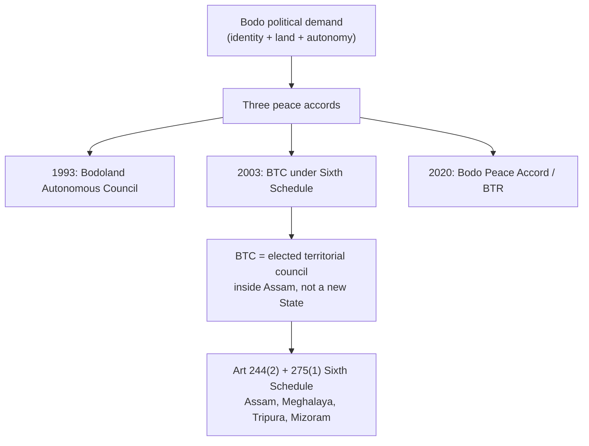
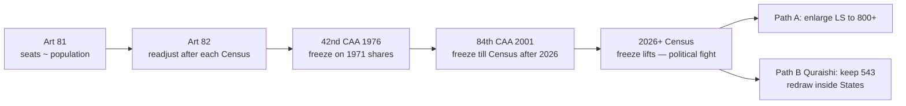

# Current Affairs — 28 August 2026

> **Source:** *The Hindu* (National — Guwahati Bureau; Editorial by S.Y. Quraishi)  
> **Date Added:** 2026-08-28  
> **Target Exam:** UPSC CSE 2027 (GS-II — Sixth Schedule, asymmetric federalism, Parliament, delimitation, federal fairness, women’s reservation)

---

## Topic 1: Bodoland Territorial Council (BTC) Deputy Speaker’s Death & the Sixth Schedule Architecture

> **Micro-Topic ID:** `CA-260828-01`  
> **GS Paper:** **GS-II** (Indian Constitution — Sixth Schedule; Federalism; Sub-State Autonomy; Polity of the North-East) & **GS-I / Geography** (Bodoland–tea labour demography, already in the 28 Aug Geography lecture)

### 1. What the news is
* **Who:** **Bijit Gwra Narzary**, Deputy Speaker of Assam’s **Bodoland Territorial Council (BTC)**.
* **Party / seat:** **Bharatiya Janata Party (BJP)** leader; represented the **Darrangajuli** constituency of the BTC.
* **What happened:** Found dead at his residence in **Kumarikata**, **Tamulpur district**, on Wednesday evening. Police said the cause was being ascertained.
* **Condolences:**
  - **Hagrama Mohilary** — BTC Chief and president of the **Bodoland People’s Front (BPF)**.
  - **Pramod Boro** — former BTC Chief, now **Member of Parliament (MP)**; heads the **United People’s Party Liberal (UPPL)**.
* *The Hindu* carried a distress note: **Tele-MANAS** (Tele Mental Health Assistance and Networking Across States) at **14416**.

The death is a **polity hook**, not a fact to over-read. The UPSC yield is the **institution he sat in**.

### 2. What the BTC is (exam core)

| Item | Content |
|:---|:---|
| **Legal home** | **Sixth Schedule** of the Constitution — **Articles 244(2)** and **275(1)** |
| **Political form** | An **Autonomous District Council / Territorial Council** *inside* Assam. It is **not** a State under **Article 3**. |
| **Origin** | **2003 Bodo Accord** created the BTC; **2020 Bodo Peace Accord** recast the area as the **Bodoland Territorial Region (BTR)**, expanded territory and legislative subjects, and brought remaining armed factions into a settlement |
| **Compared with Gorkhaland** | Darjeeling’s **GTA (Gorkhaland Territorial Administration)** is a *state-law* body. BTC is a *constitutional* Sixth Schedule body — that is why it has firmer legislative teeth (see 23 Aug CA) |
| **Party map in the news** | **BPF** (Hagrama Mohilary), **UPPL** (Pramod Boro), **BJP** — the three-cornered BTC politics after 2020 |
| **Territory hook in the report** | Death at **Kumarikata, Tamulpur**. Tamulpur is a **Bodoland Territorial Region (BTR)** district (carved from Baksa after the 2020 accord’s territorial reorganisation) |

**Sixth Schedule in one line:** tribal areas of four NE States get **autonomous councils** with powers over land, forests, village administration, inheritance, and (in BTC’s case, after 2020) a long list of transferred subjects — **asymmetric federalism** without carving a new State.

### 3. Geography link (28 Aug Agriculture lecture)
British tea planters moved labour into the Brahmaputra valley → local Bodo communities became a demographic minority in parts of their homeland → **Bodoland** demand. The news is Assam polity; the *reason the demand exists* is also **plantation geography**.

### 4. Prelims / Mains cues
* BTC ≠ State. Sixth Schedule ≠ Fifth Schedule (Fifth = Governors’ Tribes Advisory Councils in other States).
* Name the three Bodo accords (1993 / 2003 / 2020).
* **UPPL, BPF, BJP** as the post-2020 BTC party triangle.
* Contrast **BTC (constitutional)** with **GTA (statutory)**.

---

## Lead Editorial: "Why 543 should remain 543"

> **Author:** **S.Y. Quraishi** — former **Chief Election Commissioner (CEC)** of India; author of *An Undocumented Wonder — The Making of the Great Indian Election*  
> **Paper / date:** *The Hindu* Editorial, Friday 28 August 2026 (Delhi)  
> **GS Paper:** **GS-II** (Parliament, Representation of the People, Federalism, Constitutional Amendments, Women’s Reservation)

> **Pull quote (paper):** *“Delimitation, federal fairness and women's representation can all be achieved without enlarging the Lok Sabha.”*

---

## Topic 2: Delimitation Freeze — Articles 81 & 82, 42nd and 84th Amendments

> **Micro-Topic ID:** `CA-260828-02`

### 1. Context
Monsoon session adjourned *sine die* on **13 August 2026**. Speculation: a special sitting for **constitutional amendments** on **delimitation** and **women’s reservation**. Quraishi’s first cut: **numbers alone cannot decide** whether the House must grow.

**Lok Sabha (LS)** = lower House of Parliament. Elected strength today = **543**. (The two nominated Anglo-Indian seats were dropped by the **104th Constitutional Amendment Act, 2019**.)

### 2. Constitutional map (memorise this table)

| Provision | What it does |
|:---|:---|
| **Article 81** | Composition of the Lok Sabha. Each State’s seats should **correspond, as nearly as practicable, to its population**. |
| **Article 82** | After every Census, readjust allocation of seats **among States** and the division of each State into constituencies (**delimitation**). |
| **Article 170** | Same logic for **Vidhan Sabhas** (State Legislative Assemblies). |
| **42nd Amendment, 1976** | Froze *inter-State* LS seat shares on the **1971 Census** so that States which did **family planning** (especially the South) were not punished with fewer MPs. Freeze till 2000. |
| **84th Amendment, 2001** | Extended that freeze until the **first Census after 2026**. |
| **87th Amendment, 2003** | Allowed **intra-State** redrawing on the **2001 Census** *without* changing how many seats each State has. |
| **106th Amendment, 2023** (*Nari Shakti Vandan Adhiniyam*) | **One-third** seats in LS and State Assemblies for women — to kick in **after a delimitation based on the first Census after the Act**. |

### 3. Why the freeze exists
Population has grown. That does **not** automatically require **more MPs**.

* The 1971 freeze was a **federal fairness** device: States that implemented family planning (Tamil Nadu, Kerala, Karnataka, Andhra Pradesh / Telangana) should not **lose MPs** to high-growth States.
* If the House is expanded (figures discussed in the editorial: **~50% more**, **800+** members), **absolute gaps** between large and small States **widen** even if *percent* shares look similar.
* Southern and smaller States that **cut fertility** would still **lose relative voice** in a bigger House dominated by high-growth States.

**Prelims trap:** the freeze is on **inter-State allocation**, not a ban on *all* boundary changes. The **87th Amendment** already allowed **intra-State** delimitation on the 2001 Census.

---

## Topic 3: Keep 543 — Intra-State Delimitation, Vidhan Sabhas, Women’s Reservation

> **Micro-Topic ID:** `CA-260828-03`

### 1. "Bigger House, weaker deliberation"
Parliament’s job is not only to *mirror* population. It is to **deliberate**.

* More members → **less floor time per MP (Member of Parliament)** → weaker debate, weaker scrutiny of the executive.
* A mega-House looks more “representative” on paper and functions worse as a **talking legislature**.

### 2. "Preserve 543, undertake reforms" — Quraishi’s package

| Do this | Do not do this |
|:---|:---|
| Keep **543** LS seats | Do not inflate the House to 800+ |
| **Delimitation inside each State** (constituency boundaries follow new population, as the 87th Amendment already allowed) | Do not reopen **inter-State seat shares** in a way that punishes the South |
| Deliver **women’s reservation inside 543** (rotate / reserve the existing map) | Do not use the 106th Amendment as a pretext to *expand* the House |
| **Enlarge Vidhan Sabhas** so local access and MLA (Member of Legislative Assembly) ratios improve at the **State** level | Do not confuse national deliberation with local density of representatives |

**Mains line:** Delimitation is required by **Article 82**. Enlargement of the Lok Sabha is a **political choice**, not a constitutional compulsion. Federal fairness (1971 freeze logic) and women’s reservation can both sit inside **543**.

### 3. Prelims traps
* Women’s reservation **106th / 2023** is **not yet in force**; it waits on the post-Act Census + delimitation.
* **543** is elected LS strength **after** Anglo-Indian nomination ended (**104th CAA**).
* **CEC** Quraishi ≠ current CEC; he is writing as a former CEC.
* Expanding **Vidhan Sabhas** (Art 170) is Quraishi’s substitute for a mega-Lok Sabha — representation density belongs at the **State** level.

---

## Abbreviations used today

| Shortcut | Full form |
|:---|:---|
| **BTC** | Bodoland Territorial Council |
| **BTR** | Bodoland Territorial Region (post-2020) |
| **BPF** | Bodoland People’s Front |
| **UPPL** | United People’s Party Liberal |
| **BJP** | Bharatiya Janata Party |
| **MP** | Member of Parliament |
| **MLA** | Member of Legislative Assembly |
| **LS** | Lok Sabha (House of the People) |
| **CEC** | Chief Election Commissioner |
| **CAA** | Constitutional Amendment Act |
| **Tele-MANAS** | Tele Mental Health Assistance and Networking Across States |
| **GTA** | Gorkhaland Territorial Administration |

---

<!-- 2026-08-28: Current Affairs from The Hindu — BTC Deputy Speaker death used as Sixth Schedule/Bodoland hook; S.Y. Quraishi editorial on keeping Lok Sabha at 543 through intra-State delimitation, federal fairness and women's reservation without enlargement. -->
