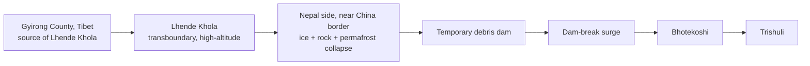

# Current Affairs — 29 August 2026

> **Source:** *The Hindu* (Nepal disaster bureau report; Science / Environment — Jacob Koshy on new glacial lakes)  
> **Date Added:** 2026-08-29  
> **Target Exam:** UPSC CSE 2027 (GS-I / GS-III — Himalayan geomorphology, GLOF, transboundary rivers, disaster management; links yesterday’s Environment lecture on cryosphere, GLOF and early warning)

*The human toll is the news. The exam yield is the **mechanism**, the **rivers**, and the **warning-system limit**.*

---

## Topic 1: Rasuwa Ice–Rock Collapse — Lhende Khola to Bhotekoshi–Trishuli

> **Micro-Topic ID:** `CA-260829-01`  
> **GS Paper:** **GS-I** (geomorphology, Himalayan drainage) & **GS-III** (disaster management, climate-amplified mountain hazards)

### 1. What happened (one-line hook)
A high-mountain **ice-and-rock collapse** in **Rasuwa district**, Nepal, sent debris into the **Lhende Khola**, briefly **dammed** the valley, then released a surge of water and debris down the **Bhotekoshi–Trishuli** system. Friday’s paper: toll **579**; nearly **2,000** missing; **4,500+** rescued. Search is trans-national (Indians the largest foreign missing group). That is context. Below is the syllabus.

### 2. The river chain (draw this)

| Name | Role in this event |
|:---|:---|
| **Lhende Khola** | Transboundary highland river. Origin: **Gyirong County, Tibet**. Enters Nepal, then joins the Bhotekoshi–Trishuli. Collapse on the **Nepali** side, very close to the border; flood crossed the **Nepal–China** line. |
| **Bhotekoshi** | Immediate flood corridor after the dam burst. |
| **Trishuli** | Next trunk in the same system. (Background, not in the clip: Trishuli feeds the **Narayani / Gandak**, which enters India — why New Delhi watches Himalayan dam-breaks even when the scar is in Nepal.) |
| **Rasuwa** | District of the rescue effort (Nepal Army centre at **Nuwakot** in the photo). |

China’s satellite read: **ice avalanche + permafrost movement + rockslide**. Nepal hydrologist **Binod Parajuli**: further flooding still possible, likely smaller.

This is the same family of hazard as yesterday’s Environment lecture: climate change does **not invent** mountain floods; it **loads** a **cryosphere** that is already unstable (ice, rock, permafrost).

### 3. Why it is a GLOF-type cascade (even if the first pulse was not a classic lake burst)

**Glacial Lake Outburst Flood (GLOF):** a sudden release of water from a glacier-dammed or moraine-dammed lake.

Classic GLOF chain:

1. Glacier retreat leaves a **moraine-dammed** lake (moraine = debris piled by the ice).
2. Ice/rock fall, heavy rain, or dam weakening **overtops or breaches** the moraine.
3. A wall of water and sediment races down a steep Himalayan valley — minutes, not hours, for villages immediately below.

This week’s first pulse: **ice–rock collapse → temporary river blockage → outburst**. That is a **landslide-dam outburst** (same physics as a GLOF: sudden release after a blockage). The **new lakes** in Topic 2 are the *next* GLOF watch.

### 4. Prelims / Mains cues
* Name **Lhende Khola** as Tibet-origin, Nepal-course, Bhotekoshi–Trishuli join.
* Permafrost + ice + rock together — not “just rain”.
* Transboundary hazard: origin near a border ≠ the flood stays in one country.
* Link **GLOF / cryosphere** to ENV-02-07 (yesterday).

---

## Topic 2: New Glacial Lakes, NDMA Watch, and the 30–45 Minute Warning Trap

> **Micro-Topic ID:** `CA-260829-02`  
> **GS Paper:** **GS-III** (NDMA, early warning, satellite monitoring) & **GS-I** (glacial landforms)

### 1. What the second report adds
After the Wednesday avalanche (~26 August), **two new glacial lakes** have formed near the source, in the high **Lhende Khola** belt on the **Nepal–Tibet** border, feeding the same **Bhote Koshi–Trishuli** system.

| Source in the paper | Lake size |
|:---|:---|
| Mapping in the report | **~19.80 ha** and **~7.28 ha** |
| **Suhora Technologies** (Noida) | one lake **~20.25 ha** in the Lhende Khola high belt |

Lakes sit behind **moraines**. Volume is **not** yet known.

### 2. NDMA’s line — copy this for Mains
**Krishna Vatsa**, Member and Head, **National Disaster Management Authority (NDMA)**:

- Lakes are watched on **high-resolution optical satellite** imagery (plus NDMA’s ground + satellite network).
- Water collecting **≠** a GLOF is **imminent**.
- Honest limit: early warning may be only **30–45 minutes** before “billions of litres” move. That is too short for many downstream settlements.

This is the same **Early Warning System (EWS)** problem as yesterday’s Environment class (Himalayan cloudbursts; India has very few **Doppler weather radars** in the high hills). Satellite *sees* the lake; it cannot give a valley three hours.

### 3. Adaptation, not just science
Yesterday’s note: mitigation cannot put the cryosphere back this century → **adapt**. Here adaptation = **monitor + evacuate drills + do not treat a 40-minute siren as a plan**. Diplomacy in the first clip (Kathmandu letting foreign search teams in; India ready to help) is the *political* layer of a transboundary mountain disaster.

### 4. Prelims traps
* New lake ≠ automatic GLOF. **Volume + dam strength + trigger** decide.
* **Moraine** = glacial debris ridge, not a river terrace.
* **NDMA** ≠ IMD (India Meteorological Department). NDMA is the statutory disaster-policy body (Disaster Management Act, 2005).
* 30–45 min warning is a **limitation**, not a boast.

---

## Abbreviations used today

| Shortcut | Full form |
|:---|:---|
| **GLOF** | Glacial Lake Outburst Flood |
| **NDMA** | National Disaster Management Authority |
| **EWS** | Early Warning System |
| **ha** | hectare (1 ha = 10,000 m²) |
| **IMD** | India Meteorological Department |

---

<!-- 2026-08-29: Current Affairs from The Hindu — Nepal Rasuwa ice-rock collapse on Lhende Khola / Bhotekoshi-Trishuli; new moraine-dammed lakes; NDMA 30-45 min GLOF warning limit. -->
