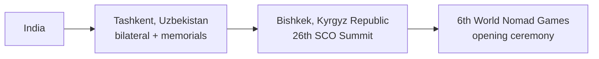
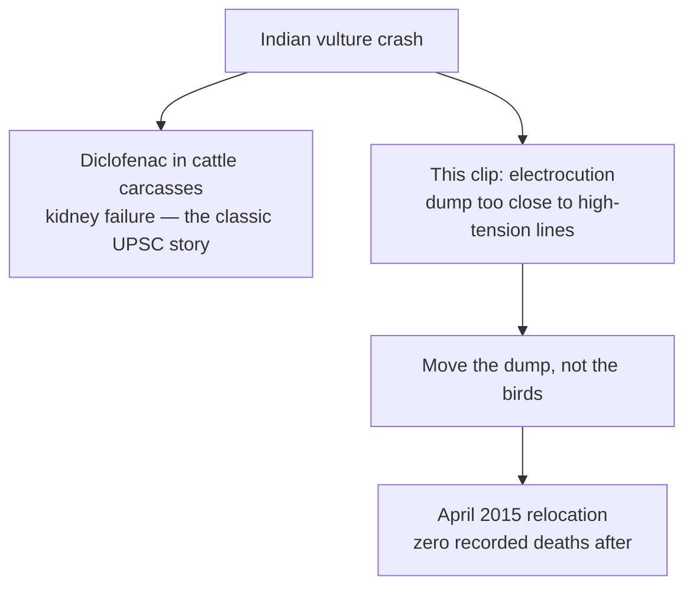
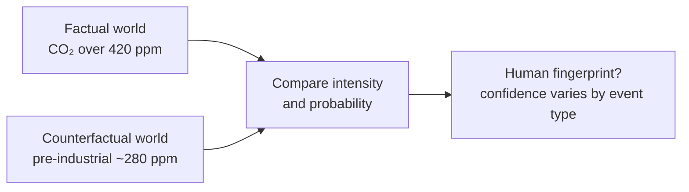

# Current Affairs — 30 August 2026

> **Source:** *The Hindu* (PTI Tashkent — Modi in Uzbekistan / SCO; Rahul Karmakar — Dehradun vultures; Harsh Kabra, Pune — extreme-event attribution)  
> **Date Added:** 2026-08-30  
> **Target Exam:** UPSC CSE 2027 (GS-II — SCO, Central Asia, India’s neighbourhood-plus; GS-III — wildlife, power-line mortality, climate attribution)

*Three clips, three papers. Diplomacy is the map. Vultures are a site-fix, not a new drug story. Attribution is the limit on “climate caused this storm.”*

---

## Topic 1: PM in Uzbekistan, then Bishkek — 26th SCO Summit

> **Micro-Topic ID:** `CA-260830-01`  
> **GS Paper:** **GS-II** (bilateral, regional groupings, Central Asia) & **GS-I** (Tashkent / Shastri memory)

### 1. What is in the news
Prime Minister **Narendra Modi** reached **Tashkent** on **Saturday** for a **two-day** visit to **Uzbekistan** (his **fourth** to the country), then goes to **Bishkek** (**Kyrgyz Republic**) for the **26th Shanghai Cooperation Organisation (SCO)** Summit at the invitation of President **Sadyr Zhaparov**. In Tashkent: delegation-level talks with President **Shavkat Mirziyoyev**.

Caption agenda: **digital connectivity** and **defence**. Paper also lists **trade, energy**, and the two national slogans — **Viksit Bharat** (Developed India) and **Yangi Uzbekistan** (New Uzbekistan).

### 2. Draw the hop

| Stop | Why it is on the paper |
|:---|:---|
| **Tashkent** | Capital of Uzbekistan. Talks on strategic partnership. Visits: **Shastri Memorial**; **Mahatma Gandhi Centre** at **Tashkent State University of Oriental Studies**. |
| **Bishkek** | Capital of the Kyrgyz Republic. SCO chair/host for this summit. Side bilaterals with other SCO leaders. |
| **World Nomad Games** | **6th** edition. PM called it a celebration of Central Asia’s **living heritage**. |

**Shastri Memorial (exam glue):** **Lal Bahadur Shastri** died in **Tashkent (11 January 1966)**, the day after the **Tashkent Agreement** with Pakistan’s **Ayub Khan** (post–1965 war). That is why an Indian PM’s Tashkent itinerary almost always includes the memorial.

### 3. SCO — lock this table (the visit is only the hook)

| Item | Content |
|:---|:---|
| **Lineage** | **Shanghai Five (1996):** China, Russia, Kazakhstan, Kyrgyzstan, Tajikistan. **SCO (2001):** + **Uzbekistan**. Secretariat: **Beijing**. |
| **India** | Full member since **2017** (with **Pakistan**). Paper: India is an “active member” since 2017. |
| **Later full members** (standard list, not in the clip) | **Iran (2023)**, **Belarus (2024)**. |
| **This summit’s stated themes** | Security, connectivity, trade; **terrorism, separatism, extremism** (SCO’s “three evils”). |
| **Why Central Asia for India** | Land bridge toward Eurasia; energy; counter-terror; keep a seat in a China–Russia-heavy table without becoming a camp follower. |

**Prelims trap:** SCO is **not** a military alliance like NATO. It is a **regional grouping** with a security *agenda*. India joined in **2017**, not at founding in 2001. Host this time is **Bishkek**, not Tashkent — Tashkent is the *Uzbekistan bilateral*.

### 4. Prelims / Mains cues
* Pair **Viksit Bharat** with **Yangi Uzbekistan** if they ask “shared development slogans.”
* Name **Sadyr Zhaparov** (Kyrgyz) and **Shavkat Mirziyoyev** (Uzbek).
* SCO three evils: terrorism / separatism / extremism.
* One line on **World Nomad Games** as cultural diplomacy, not a security pact.

---

## Topic 2: Dehradun Carcass Dump — Electrocution, Not Diclofenac

> **Micro-Topic ID:** `CA-260830-02`  
> **GS Paper:** **GS-III** (environment, wildlife, infrastructure–ecology conflict) & **GS-I** (Uttarakhand geography)

*If **UK** is next to **Dehradun**, it is **Uttarakhand**, not the United Kingdom.*

### 1. What the study says
A paper in the **Journal of Threatened Taxa** (authors include **Javed Anver**, **Wildlife Institute of India (WII)**, Dehradun, and others) on a livestock **carcass dump** near **Dehradun, Uttarakhand**.

| Fact | Number / date |
|:---|:---|
| Dump sat **2.4 km** from **high-tension** power lines | that gap was *not* enough — birds still used the pylons |
| Surveys | **34** surveys, **May 2011 – February 2014** |
| Live birds counted | **743** individuals, **five** vulture species |
| Carcasses at the lines | **46** vultures, attributed to **electrocution** |
| Dump **relocated** | **April 2015** — new site farther from the lines |
| After the move | vultures used the new dump; **no mortality recorded** at the new site (paper: no further study after 2015) |

**Highest deaths:** **Himalayan griffon** (*Gyps himalayensis*), then **Eurasian griffon** (*Gyps fulvus*), then **cinereous vulture** (*Aegypius monachus*).

Other raptors at the new dump: **black kite** (*Milvus migrans*), **crested serpent eagle** (*Spilornis cheela*).

Caption: vultures are among the **most threatened** birds globally after a severe population crash.

### 2. Do not mix the two vulture stories

**Prelims trap:** This clip is **not** about banning **diclofenac** (that remains the *national* collapse story for *Gyps* vultures). Here the fix is **siting**: keep carcass dumps away from **high-tension** infrastructure. **WII** is in **Dehradun, Uttarakhand**.

### 3. Why it is a GS-III example
* **Linear infrastructure** (power lines) as a silent killer of large soaring birds.
* Cheap mitigation: **relocate the attractant** (the dump), not an expensive rewire of every pylon.
* Links **wildlife** + **urban/peri-urban waste of livestock**.

---

## Topic 3: Extreme-Event Attribution Has Limits

> **Micro-Topic ID:** `CA-260830-03`  
> **GS Paper:** **GS-III** (climate change, disaster science) — pairs with **Environment Lecture 2 (29 August)** on Intergovernmental Panel on Climate Change (IPCC) / “climate on steroids”

### 1. The claim of the essay
**Harsh Kabra** (Pune): you **cannot** pin every short, local storm on climate change with the same confidence as a **heatwave**. **Attribution science** asks: did humans make *this* event more likely or more intense?

**World Weather Attribution (WWA)** is the group the paper names as the public face of this work.

### 2. How the models work (one diagram)

| Easier to attribute | Harder to attribute |
|:---|:---|
| **Heatwaves** (large, slow, well modelled) | **Thunderstorms**, cloudbursts, **sub-daily** rain bursts |
| Broad regional extremes with long records | **Local** cells with thin station data |

**Why the hard cases fail (paper / sidebar):** short weather records; models that cannot resolve a few-kilometre storm; argument over what counts as “extreme”; not enough computing power for high-resolution counterfactuals.

### 3. Names the examiner can plant
**J. Srinivasan** (Indian Institute of Science, Bengaluru); **Vimal Mishra** (Indian Institute of Technology Gandhinagar); **Noah Diffenbaugh** (Stanford); **Raghu Murtugudde** (University of Maryland); **Subimal Ghosh** (Indian Institute of Technology Bombay); **Mark Keenan** (former UN / UK scientist).

Sidebar: attribution findings can feed **legal liability** (climate litigation) — high stakes, so the science has to stay honest about **uncertainty**.

### 4. Hook to yesterday’s class
Environment L2: climate change does **not invent** cyclones or GLOFs (glacial lake outburst floods); it **loads** them (IPCC “climate on steroids”). This essay is the **other half**: loading is real, but **this one thunderstorm** may still be **unattributable**. Use **IPCC / World Meteorological Organization (WMO)** for global numbers; use **WWA-type studies** only when they state the **confidence** and the **event type**.

**Mains line:** Attribution is strongest for heat; weakest for short, local convective storms. Do not write “climate change caused yesterday’s cloudburst” unless a study with stated confidence exists.

---

## Abbreviations

| Short | Full |
|:---|:---|
| **SCO** | Shanghai Cooperation Organisation |
| **WII** | Wildlife Institute of India (Dehradun, Uttarakhand) |
| **WWA** | World Weather Attribution |
| **IPCC** | Intergovernmental Panel on Climate Change |
| **WMO** | World Meteorological Organization |
| **IIT** | Indian Institute of Technology |
| **CO₂** | Carbon dioxide |
| **ppm** | parts per million |

<!-- 2026-08-30: The Hindu clips — Modi Uzbekistan / 26th SCO Bishkek; Dehradun vulture dump vs power lines; limits of extreme-event attribution. -->
