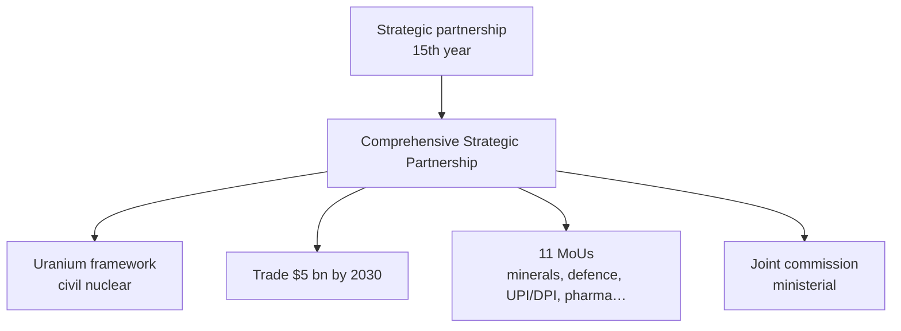
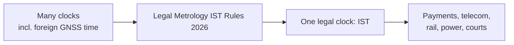

# Current Affairs — 31 August 2026

> **Source:** *The Hindu* (PTI Tashkent — India–Uzbekistan outcomes, Shastri Memorial; PTI New Delhi — Legal Metrology IST Rules)  
> **Date Added:** 2026-08-31  
> **Target Exam:** UPSC CSE 2027 (GS-II — Central Asia, civil nuclear / uranium supply; GS-I — Shastri / Tashkent 1966; GS-III — Legal Metrology, digital public infrastructure, time-stamping)

*Yesterday’s note was the **map** (Tashkent then Bishkek). Today’s clips are the **deal sheet** plus a domestic time-standard rule.*

---

## Topic 1: India–Uzbekistan — Comprehensive Strategic Partnership, Uranium, $5 bn Trade

> **Micro-Topic ID:** `CA-260831-01`  
> **GS Paper:** **GS-II** (bilateral, Central Asia, civil nuclear cooperation) & **GS-I** (Lal Bahadur Shastri, Tashkent 1966)

### 1. What is in the news
Prime Minister **Narendra Modi** and Uzbekistan President **Shavkat Mirziyoyev** met in **Tashkent on Sunday**. They **elevated** the relationship from a **strategic partnership** (this year is the **15th anniversary**) to a **Comprehensive Strategic Partnership**, and set a **$5 billion** annual trade target by **2030** (current volume **over $1 billion**).

**Uranium:** a **framework for long-term supply of uranium** from Uzbekistan to India, under **civil nuclear energy** cooperation — fuel for power reactors, not a weapons story.

**Eleven agreements** covering: mining, tourism, **critical minerals**, defence, security, agriculture, pharmaceuticals, health, information technology, education, and **Digital Public Infrastructure (DPI)** including **Unified Payments Interface (UPI)**.

The **joint commission** is to be raised from **secretary** level to **ministerial** level.

PM: **Uzbekistan is at the heart of India’s engagement in Central Asia**; the upgrade is about **concrete goals** inside the new framework.

### 2. Outcomes at a glance

| Item | Lock this |
|:---|:---|
| New label | **Comprehensive Strategic Partnership** |
| Old label | Strategic partnership, **15 years** |
| Trade | **> $1 bn** now → **$5 bn a year by 2030** |
| Nuclear | Long-term **uranium supply framework** (civil) |
| Instruments | **11** agreements (list sectors, not invented treaty titles) |
| DPI | **UPI** among the digital items |
| Mechanism | Joint commission **secretaries → ministers** |

**Prelims trap:** Host **city for this bilateral** is **Tashkent**. The **26th Shanghai Cooperation Organisation (SCO)** Summit is **Bishkek** (Kyrgyz Republic) — PM left for that after the Sunday programme. Do not write “SCO in Tashkent.” Uranium here is **import for civil power**, not a new NSG (Nuclear Suppliers Group) membership story.

Pair with **27 August CA**: **Meghalaya** Assembly opposed **domestic** uranium mining in the Khasi Hills. India still needs fuel — **Uzbekistan** is one **import** route. Do not mash the two into “India has banned uranium.”

### 3. Sunday’s other Tashkent visuals (same visit)

**Shastri Memorial:** floral tributes to **Lal Bahadur Shastri**, India’s **second** Prime Minister, who died in **Tashkent on 11 January 1966**, shortly after signing the **Tashkent Declaration** that ended the **1965** India–Pakistan war. Slogan in the clip: **“Jai Jawan, Jai Kisan.”**

**Tree:** the two leaders planted a tree, linked in the paper to India’s **Ek Ped Maa Ke Naam** and Uzbekistan’s **Yashil Makon** (greening / “green space”) drive.

**Honour:** President Mirziyoyev conferred Uzbekistan’s highest honour for foreign leaders, the **Oliy Darajali Do’stlik Order** (Order of Friendship), on the PM.

Also in the clip: a yoga session (Yoga Federation of Uzbekistan), Indian diaspora, then **Kyrgyzstan / SCO**.

### 4. Prelims / Mains cues
* **Comprehensive Strategic Partnership** + **$5 bn / 2030** + **uranium framework** — three-mark combo.
* **UPI / DPI** as export of India’s digital stack, not only a payments MCQ.
* **Shastri + Tashkent 1966** if they ask why an Indian PM always visits that memorial.
* Critical minerals + defence + civil nuclear in **one** Central Asian bilateral — connectivity is more than a road.

---

## Topic 2: Legal Metrology (Indian Standard Time) Rules, 2026

> **Micro-Topic ID:** `CA-260831-02`  
> **GS Paper:** **GS-III** (infrastructure, digital economy, cybersecurity of time sources) & **GS-II** (delegated legislation — ministry rules)

### 1. What is in the news
The Union **Ministry of Consumer Affairs** notified the **Legal Metrology (Indian Standard Time) Rules, 2026** on **27 August 2026**. **Indian Standard Time (IST)** is now the **sole mandatory** time reference for **legal, administrative, commercial and official** purposes across India.

**Compliance:** **180 days** from publication in the **Official Gazette** for government departments, businesses and institutions to align systems.

### 2. Why the government says it is needed
Banking, **digital payments**, telecommunications, **railways** and **power grids** have been using **different** time sources, including **foreign satellite-based** time. Mismatched stamps break coordination and records.

The clip’s aims:

* accurate **time-stamping** of digital transactions  
* reliable telecom / internet networks  
* precise **legal and government records**  
* coordination of **emergency services**  
* **cut dependence on foreign satellite** time  

The Centre is building facilities to **disseminate IST** through **Indian institutions** and **legal metrology laboratories**.

**Prelims trap:** Nodal ministry here is **Consumer Affairs** (Legal Metrology), **not** Communications and **not** Earth Sciences. The number to remember is **180 days**, not “with immediate effect.” IST was already the civil standard; this notification makes it the **mandatory legal reference** and pushes **indigenous dissemination**.

**Static glue (not in the clip, standard GS):** **CSIR–National Physical Laboratory (NPL)**, New Delhi, is India’s time laboratory for IST. Use it only as background; the rule-making story in this paper is **Legal Metrology + Consumer Affairs**.

### 3. Prelims / Mains cues
* Name the **Rules, 2026** and the **180-day** window.  
* Link **UPI** (Topic 1, exported to Uzbekistan) with **IST time-stamping** at home — same digital-public-infrastructure family.  
* Mains: **time as critical infrastructure**; foreign GNSS (Global Navigation Satellite System) as a **strategic dependency**.

---

## Abbreviations

| Short | Full |
|:---|:---|
| **IST** | Indian Standard Time |
| **DPI** | Digital Public Infrastructure |
| **UPI** | Unified Payments Interface |
| **SCO** | Shanghai Cooperation Organisation |
| **PTI** | Press Trust of India |
| **CSIR–NPL** | Council of Scientific and Industrial Research – National Physical Laboratory |
| **GNSS** | Global Navigation Satellite System |
| **NSG** | Nuclear Suppliers Group |

<!-- 2026-08-31: The Hindu clips — India–Uzbekistan CSP, uranium framework, $5 bn trade, Shastri Memorial / Do’stlik Order; Legal Metrology IST Rules 2026 (Consumer Affairs, 27 Aug, 180 days). -->
