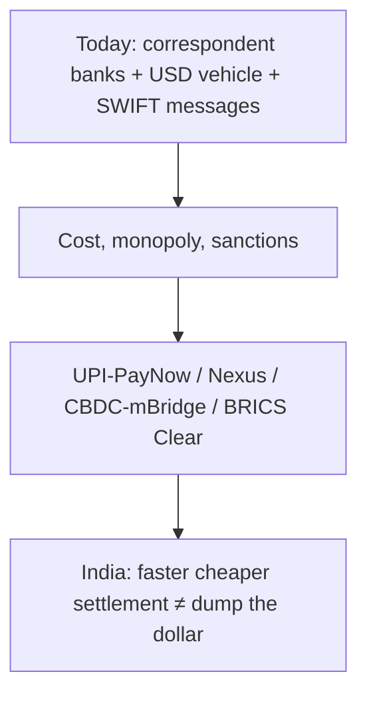

# Current Affairs — 6 September 2026

> **Source:** *The Hindu* (6 September 2026)  
> **Date Added:** 2026-09-06  
> **Target Exam:** UPSC CSE 2027 (Prelims + GS-II / GS-III)

**Already in notes (not restated here):**

- **Nepal–China glacial / ice-rock collapse** (Rasuwa, Lhende Khola → Bhotekoshi–Trishuli) → `August_2026/2026-08-29_Current_Affairs.md` (`CA-260829`). Today’s dam story only uses that collapse as the *hook* (it will **not** halt the project).
- **BRICS as a grouping** (BOP / IMF–WB reform) → `GS_IR_VR_Notes`. This clip is the **payments** track only.
- **SWIFT as a sanctions lever** (Russian banks, 2022; US secondary-sanctions debate) → one line on `July_2026/2026-07-30_Current_Affairs.md`. Full correspondent-bank / vehicle-currency / alternatives sit below.

---

## Topic 1: China mega-dam on the Yarlung Zangbo — glacial collapse will not halt it

> **Micro-Topic ID:** `CA-260906-01`  
> **GS Paper:** **GS-II** (India–China, transboundary rivers) + **GS-I / GS-III** (Brahmaputra, seismicity, hydropower)

### 1. What is in the news
**Ananth Krishnan, Beijing.** A recent **glacial collapse** on the **Nepal–China** border will **not** stop Beijing’s plan for a mega hydropower project on the **lower reaches of the Yarlung Zangbo** (the Tibetan name for the upper **Brahmaputra**). Beijing calls it the **“project of the century.”** It sits in China’s **15th Five-Year Plan** (renewable energy).

### 2. Scale and calendar (clip only)
| Fact | Clip |
|:---|:---|
| Investment | **1.2 trillion yuan** (~ **₹14 lakh crore**) |
| Stations | **Five** power stations |
| Ground-breaking announced | **July 2025**, Premier **Li Qiang**, during a visit to **Nyingchi** |
| Latest political visit | **April** — Vice-Premier **Zhang Guoqing** at Nyingchi: **“quality first, safety as the foundation”** + environmental-protection line |

### 3. Map the river (sheet: *Taming the mighty river*)
**Yarlung Zangbo** flows east across the **Tibet Autonomous Region**, past **Zangmu** and **Mainling**, then turns at the **Great Bend** (a **tunnel** is marked here) before entering **India** (Arunachal Pradesh / Assam as the Brahmaputra) and **Bangladesh**. **Bhutan** sits on the map between Tibet and India.

The site is **seismically active**, near the **India** border.

### 4. Why India is worried (clip)
- Downstream **water** into India and Bangladesh — how much will sit in the **reservoir**, and what a **tunnel** at the Great Bend does to flow.
- **Almost no public data** from China (capacity, tunnel impact) → hard to assess ecology / hydrology.

### 5. One-liner
China’s **Yarlung Zangbo** mega-dam (**1.2 trillion yuan**, **five** stations, **15th FYP**, Great Bend / Nyingchi) goes on despite a Nepal–China glacial collapse; India’s exam point is **downstream Brahmaputra + no data**.

---

## Topic 2: Why BRICS is exploring cross-border payments

> **Micro-Topic ID:** `CA-260906-02`  
> **GS Paper:** **GS-II** (BRICS, sanctions, dollar system) + **GS-III** (payments, CBDC)

### 1. What is in the news
**Srinivasan Ramani.** India chairs BRICS. The **18th BRICS Summit** is in **New Delhi**, **12–13 September 2026**. The payments track: link **digital payment systems** and **Central Bank Digital Currencies (CBDCs)**. Finance ministries / central banks met in **Jaipur, August 2024**.

### 2. How a cross-border payment works today
Money does **not** jump country-to-country. It goes through a chain of **correspondent banks** (often **London / New York**) that hold accounts with each other.

Most trades also use a **vehicle currency** — usually the **US dollar** — even when **no US party** is in the deal: local currency → dollar → destination currency.

**SWIFT (Society for Worldwide Interbank Financial Telecommunication):** Belgium-based cooperative; overseen by **G-10** central banks (including the **US Federal Reserve**). Secure **messaging** for payment *instructions*, not the money itself. **11,000+** institutions in **200+** countries. Clip: **crucial and hard to displace**.

### 3. Costs and delays
Every extra bank takes a fee. FX is paid **twice**. A **2019** survey: margins about **2.5%** (Brazil example) and up to **20%** in some African cases.

**SWIFT GPI (Global Payments Innovation)** cut some times; the **structure** remains. **Bank for International Settlements (BIS):** correspondent-bank *relationships* fell **~20%** between **2011 and 2018**, even as *volumes* grew.

### 4. Why BRICS wants a change
- Monopoly of a few currencies (**dollar, euro, yen**) and of those countries’ **monetary policy**.
- **2024** BRICS report (Russia’s chair): one institution dominates → high cost.
- **Sanctions risk:** several **Russian** banks cut off from SWIFT in **2022**.

### 5. Alternatives on the table
| Idea | Clip example |
|:---|:---|
| Pair national systems | India’s **Unified Payments Interface (UPI)** ↔ Singapore’s **PayNow** |
| Shared hub | **Project Nexus** (BIS) |
| CBDC settlement | Common platform such as **mBridge** — faster, less idle capital |
| Independent settlement | **BRICS Clear** — named in the **2024 Kazan** declaration |

### 6. India’s line (the Prelims trap)
India wants **CBDC links for trade and tourism** to **cut cost and speed settlement**. Officials do **not** frame this as **displacing the dollar** — unlike some **Russian / Brazilian** talk.

**Donald Trump**, **November 2024:** threatened **100% tariffs** on BRICS if they move away from the dollar.

Photo on the page: **PM Modi**, Brazil’s **Luiz Inácio Lula da Silva**, South Africa’s **Cyril Ramaphosa** — BRICS Summit, **Brazil 2025**.

### 7. One-liner
BRICS payments = cheaper / faster rails (UPI–PayNow, Nexus, CBDC / mBridge, BRICS Clear). **India = cost and speed, not de-dollarisation.** SWIFT stays the messaging backbone until something actually replaces it.

### Update — 7 September 2026

**Xu Feihong**, Chinese Ambassador to India — *The Hindu* op-ed ahead of the **18th** summit (**New Delhi, 12–13 September**). Same summit as this note; **POWER** is Beijing’s frame, not a second topic.

| Letter | Clip line |
|:---|:---|
| **P** Principle | **United Nations (UN) Charter**, sovereign equality, non-interference; **Global Security Initiative (GSI)**; **Global Governance Initiative (GGI)** |
| **O** Openness | Resist protectionism; **World Trade Organization (WTO)**; open industrial / supply chains; **Global Development Initiative (GDI)** |
| **W** Win-Win | **UN 2030 Agenda**; Global South consensus; “openness, inclusiveness and win-win” |
| **E** Engine | Nearly **half** of world population; about **30%** of global output; **one-fifth** of global trade; BRICS growth nearly **three times** faster than the **Group of Seven (G-7)** by **2028**; local-currency and cross-border **payments** (same track as above) |
| **R** Responsibility | Digital economy, smart manufacturing, **artificial intelligence (AI)**; **China–BRICS AI Development** and **New Quality Productive Forces** research centres |

**India–China (clip):** under **Xi Jinping** and **Narendra Modi**, ties have kept an improvement momentum; **direct flights** resumed; **border trade** reopened after a **six-year** suspension. Ambassador line: move in a “sustained, healthy, and stable” way.

---

## Abbreviations

| Short | Full |
|:---|:---|
| **FYP** | Five-Year Plan (China) |
| **SWIFT** | Society for Worldwide Interbank Financial Telecommunication |
| **CBDC** | Central Bank Digital Currency |
| **UPI** | Unified Payments Interface |
| **BIS** | Bank for International Settlements |
| **GPI** | Global Payments Innovation (SWIFT) |
| **BRICS** | Brazil, Russia, India, China, South Africa (plus later members as in current CA) |
| **USD** | United States dollar |
| **FX** | Foreign exchange |
| **GSI / GDI / GGI** | Global Security / Development / Governance Initiative (China) |
| **WTO** | World Trade Organization |
| **G-7** | Group of Seven |

---

<!-- 2026-09-06: The Hindu — (1) China Yarlung Zangbo mega-dam 1.2 tn yuan / 5 stations / 15th FYP / Great Bend; glacial collapse will not halt. (2) BRICS cross-border payments explainer: SWIFT, vehicle USD, UPI-PayNow, Nexus, mBridge, BRICS Clear; India cost/speed not de-dollarisation. Cluster CA-260906. Rasuwa collapse stays on 29 Aug. -->
<!-- 2026-09-07: Xu Feihong POWER op-ed + 12–13 Sep dates + India–China flights / 6-yr border trade — in-place on Topic 2, same CA-260906-02. -->
