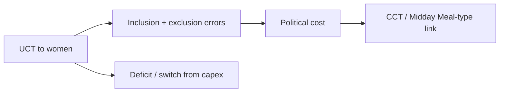
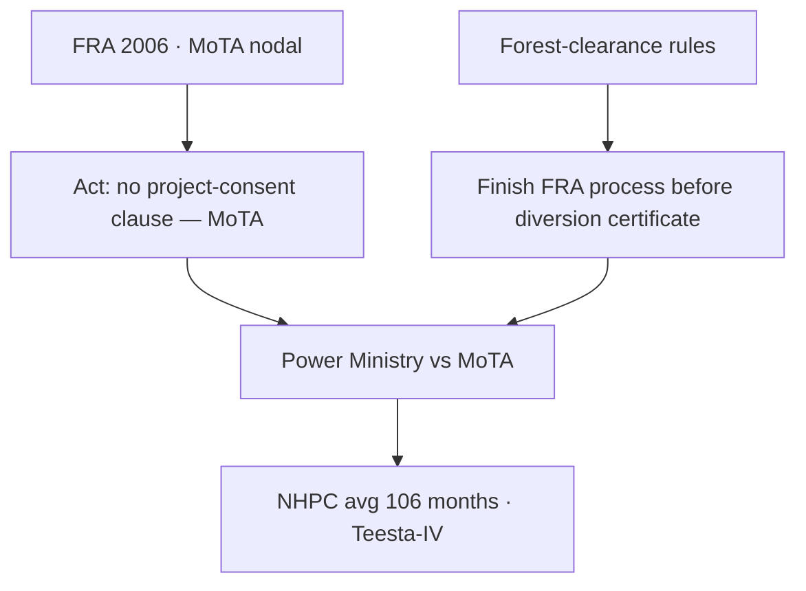
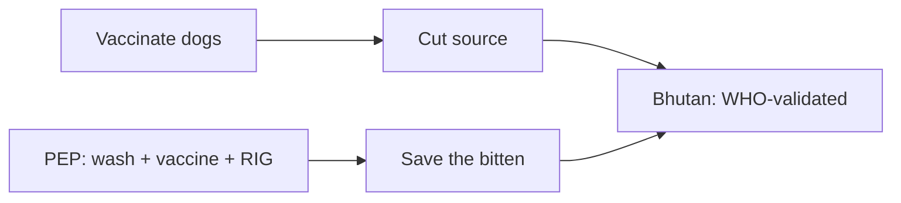

# Current Affairs — 7 September 2026

> **Source:** *The Hindu* (7 September 2026)  
> **Date Added:** 2026-09-07  
> **Target Exam:** UPSC CSE 2027 (Prelims + GS-II / GS-III)

**Already in notes (not restated here):**

- **18th BRICS Summit** (India chair; New Delhi; payments / SWIFT) → patched on `2026-09-06_Current_Affairs.md` (`### Update — 7 September 2026`). Same **CA-260906-02**. Today’s **Xu Feihong** **POWER** op-ed and **12–13 September** dates sit there.

---

## Topic 1: The political cost of Unconditional Cash Transfer (UCT) schemes

> **Micro-Topic ID:** `CA-260907-01`  
> **GS Paper:** **GS-II** (welfare, women) + **GS-III** (State finances, targeting)

### 1. What is in the news
**K. R. Shanmugam** (former Director, Madras School of Economics; economic consultant to the Government of Tamil Nadu) and **Sankarganesh Karuppiah** (Indian Revenue Service). Since **2020**, States have used **Unconditional Cash Transfer (UCT)** schemes — mostly to **women** — as an electoral tool.

Clip examples: **Kalaignar Magalir Urimai Thittam** (Tamil Nadu); **Lakshmir Bhandar** (West Bengal); **Gruha Lakshmi Yojana** (Karnataka).

### 2. Why they exist, and the fiscal bill
They partly advance **Sustainable Development Goal (SDG) 5.4** (recognise women’s unpaid domestic and care work).

**Ministry of Finance** Economic Survey: States expected to spend about **$18 billion** on UCTs in **2025-26**, mostly for women.

Critics: “freebies” → expenditure switching, larger **fiscal deficits**, less money for infrastructure / jobs. Once started, hard to withdraw (dependency).

### 3. Targeting errors (the political cost)
Informal-sector households are hard to identify. Proxies: land, electricity use, household assets. Two errors:

- **Inclusion** — ineligible get the transfer  
- **Exclusion** — eligible are left out  

Economics likes tight targeting. Politics likes **broad inclusion**. Exclusion (real or *seen* as unfair — a household “looks” well-off) creates grievance.

### 4. Tamil Nadu case (clip numbers only)
**Kalaignar Magalir Urimai Thittam:** promised **₹1,000 / month** to women-headed households before the **2021** election; launched **September 2023** with **1.13 crore** women; **16.94 lakh** added in **December 2025** after exclusion complaints. Cost **₹13,807 crore** in **2025-26**. Dissatisfaction continued among those still out.

### 5. Authors’ alternative
**Conditional Cash Transfers (CCTs)** or incentive schemes (clip: Tamil Nadu **Midday Meal**) — link money to a social outcome (school enrolment). Self-selection cuts some grievance.

### 6. One-liner
State **UCTs** to women are popular and costly (**~$18 billion**, **2025-26**); **exclusion errors** are the political bill. Economics → target; politics → include; clip prefers **CCTs**.

---

## Topic 2: Forest Rights Act (FRA), 2006 — Ministry says no Gram Sabha-consent clause for projects

> **Micro-Topic ID:** `CA-260907-02`  
> **GS Paper:** **GS-II** (tribal rights, ministries) + **GS-III** (forest diversion, hydropower)

### 1. What is in the news
**Abhinay Lakshman.** **Ministry of Power** calls **100% Gram Sabha** consent a “critical bottleneck” for power projects. **Ministry of Tribal Affairs (MoTA)** — nodal for the **Scheduled Tribes and Other Traditional Forest Dwellers (Recognition of Forest Rights) Act, 2006 (FRA)** — told **NHPC Limited** there is **no provision in the FRA** to obtain Gram Sabha consent **for forest clearance**, and that this is not MoTA’s job.

Forest-clearance **rules** still require **FRA processes to finish** before an authority issues a **diversion** certificate.

**Shomona Khanna** (former MoTA legal adviser): MoTA distancing itself is “bizarre” — it is the nodal ministry.

### 2. Delay numbers (clip)
**Parliamentary Standing Committee on Public Undertakings** on **NHPC**: average forest clearance **106 months**. **Teesta-IV Hydroelectric Project (HEP)** stalled for want of consent from a **small minority** of Gram Panchayats.

### 3. Proposed softening
**Baijayant Panda** committee: for large hydropower of “national importance,” a **qualified super-majority** of **70–75%** of affected Gram Sabhas — not **100%**.

### 4. One-liner
**FRA 2006** text (MoTA) has **no** project-consent clause; **clearance rules** still need FRA completion first. Power side: **106 months** / **Teesta-IV**. Reform talk: **70–75%** Gram Sabhas, not unanimity.

---

## Topic 3: Yoga and Ayurveda in India’s health diplomacy — standards still thin

> **Micro-Topic ID:** `CA-260907-03`  
> **GS Paper:** **GS-II** (FTAs, mobility) + **GS-III** (health / services trade)

### 1. What is in the news
**Bindu Shajan Perappadan** and **T.C.A. Sharad Raghavan.** **Ayurveda, Yoga, Naturopathy, Unani, Siddha, Sowa-Rigpa and Homoeopathy (AYUSH)** is moving from cultural export to a **trade and services** line. Experts want **credible standards**, evidence, regulation, practitioner quality, and patient safety.

### 2. Trade texts (clip)
| Agreement | Clip |
|:---|:---|
| **India–European Union Free Trade Agreement (FTA)** | Signed **January 2026** — Indian **AYUSH** qualifications usable in EU States that have **no** regulatory framework; wellness centres / clinics |
| **India–Oman Comprehensive Economic Partnership Agreement (CEPA)** | First comprehensive traditional-medicine commitment across **all modes of supply** |
| **India–New Zealand FTA** | Dedicated **health and traditional medicine** annex — education, training, standards, wellness, mobility |

### 3. Visas and traffic (clip only)
**AYUSH visa** introduced **2023**. **1,646** AYUSH visas to nationals of **75** countries (**January 2024–February 2025**).

Foreign **medical** arrivals: **1.83 lakh (2020)** → **6.44 lakh (2024)**. That **6.44 lakh** is **all** medical travel, **not** AYUSH-only — no consolidated AYUSH patient series in the clip.

Top source names: Bangladesh, Nepal, Sri Lanka, United Arab Emirates, United States, Germany, Russia, Malaysia, Mauritius, Saudi Arabia.

**AYUSH Fellowship Scheme:** **260** students from **32** countries in Indian institutions.

### 4. One-liner
**AYUSH** is now in **FTA / CEPA** texts (EU **Jan 2026**, Oman, New Zealand) and an **AYUSH visa** (**1,646** / **75** countries). Exam trap: **6.44 lakh** arrivals ≠ AYUSH share. Standards are the missing piece.

---

## Topic 4: Bhutan — first in WHO South-East Asia to eliminate dog-transmitted rabies

> **Micro-Topic ID:** `CA-260907-04`  
> **GS Paper:** **GS-II** (health, WHO) + **GS-III** (One Health)

### 1. What is in the news
**Ramya Kannan.** **World Health Organization (WHO)** validated **Bhutan** as the first country in WHO’s **South-East Asia** region to eliminate **dog-transmitted rabies** as a public-health problem. Last rabies death in Bhutan: **June 2023**.

**Tedros Adhanom Ghebreyesus** (WHO Director-General): credit a **One Health** approach — health workers, veterinarians, communities together.

### 2. How Bhutan did it (clip)
**Ministry of Health** + **Ministry of Agriculture and Livestock**, local governments, communities, and **De-suung** volunteers (“Guardians of Peace”). Pillars: mass **dog vaccination**, population management, awareness, continued **post-exposure prophylaxis (PEP)**, stronger surveillance.

Global two-pronged line: (1) vaccinate **dogs** at source; (2) **PEP** after a bite — wash with **soap and water**, full vaccine course, **rabies immunoglobulin** if needed.

### 3. India (clip)
Rabies is almost always **fatal** once clinical signs appear. About **59,000** deaths a year worldwide; about **one-third** in **India**. Endemic in India except **Andaman and Nicobar** and **Lakshadweep**. About **96%** of Indian mortality / morbidity is from **dog** bites. **National Rabies Control Programme (NRCP):** zero human rabies deaths by **2030**.

### 4. One-liner
**Bhutan** = first WHO **SEARO** dog-rabies elimination (last death **June 2023**) via **One Health** + **De-suung**. India: **~1/3** of global deaths; islands excepted; **NRCP 2030**.

---

## Abbreviations

| Short | Full |
|:---|:---|
| **UCT / CCT** | Unconditional / Conditional Cash Transfer |
| **SDG** | Sustainable Development Goal |
| **FRA** | Scheduled Tribes and Other Traditional Forest Dwellers (Recognition of Forest Rights) Act, 2006 |
| **MoTA** | Ministry of Tribal Affairs |
| **NHPC** | NHPC Limited (formerly National Hydroelectric Power Corporation) |
| **HEP** | Hydroelectric Project |
| **AYUSH** | Ayurveda, Yoga, Naturopathy, Unani, Siddha, Sowa-Rigpa and Homoeopathy |
| **FTA / CEPA** | Free Trade Agreement / Comprehensive Economic Partnership Agreement |
| **EU** | European Union |
| **WHO** | World Health Organization |
| **SEARO** | WHO South-East Asia Region |
| **PEP** | Post-exposure prophylaxis |
| **NRCP** | National Rabies Control Programme |
| **RIG** | Rabies immunoglobulin |

---

<!-- 2026-09-07: The Hindu — (1) UCT political cost / TN Magalir numbers; (2) MoTA FRA no project-consent clause vs clearance rules / Teesta-IV / 106 months / Panda 70–75%; (3) AYUSH FTAs + visa 1646; (4) Bhutan WHO SEARO rabies. BRICS POWER patched on 6 Sep. Cluster CA-260907. -->
