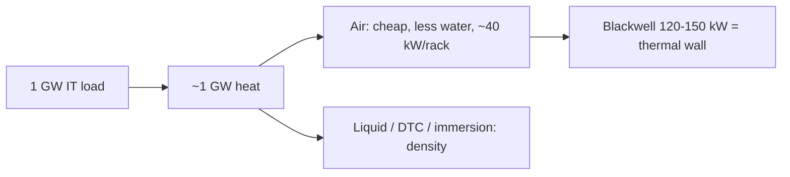
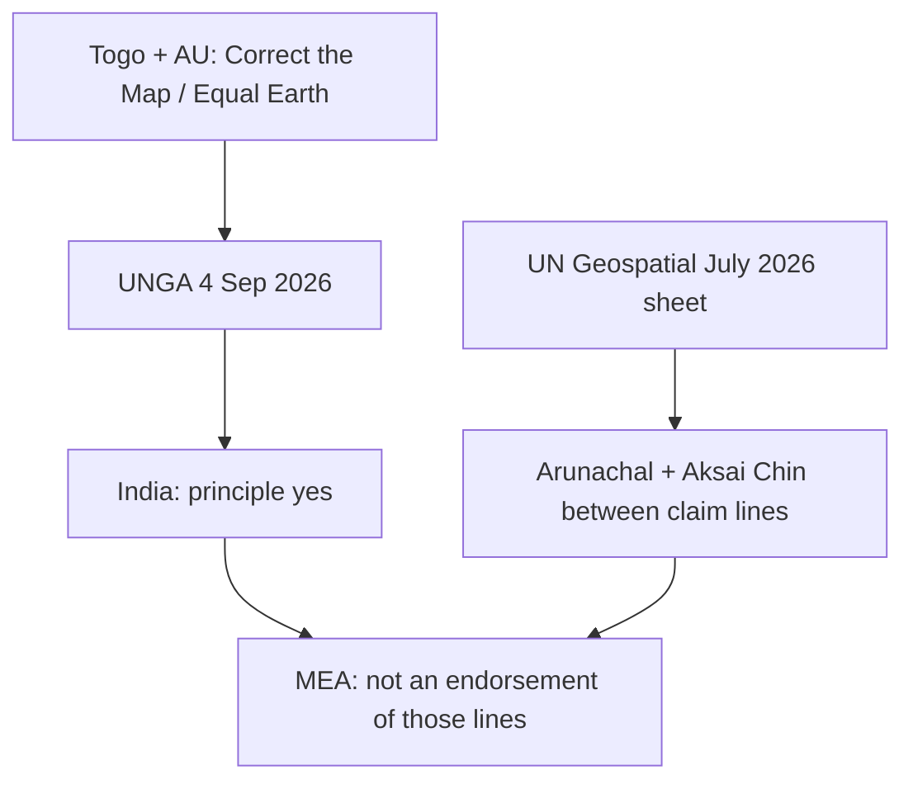

# Current Affairs — 8 September 2026

> **Source:** *The Hindu* (8 September 2026)  
> **Date Added:** 2026-09-08  
> **Target Exam:** UPSC CSE 2027 (Prelims + GS-II / GS-III)

**Already in notes (not restated here):**

- **Hawala / digital hawala** (FATF report; six tech forms; ~70% of surveyed jurisdictions) → patched on `GS_Internal_Security_VR_Notes/01_Fundamentals_of_Internal_Security.md` (`### Update — 8 September 2026`). Same **IS-01**. Class line stays: trust-based transfer **without physical movement of cash**.

---

## Topic 1: 1-GW data centres — can air-cooling hold the heat?

> **Micro-Topic ID:** `CA-260908-01`  
> **GS Paper:** **GS-III** (energy, environment, infrastructure) + **GS-I** (resources / water)

### 1. What is in the news
**Vasudevan Mukunth** (CACHE). After local protests over **water**, **Google** said its planned **1-gigawatt (GW) hyperscaler** in **Visakhapatnam** district, Andhra Pradesh, will use **air-cooling**. **Tata Consultancy Services (TCS) HyperVault** is another **1-GW** facility being built for higher density, including **liquid** and **direct-to-chip (DTC)** cooling, plus renewables (**Deepesh Kiran Nanda**, HyperVault CEO).

Almost all electricity used by servers becomes heat. A **1-GW** hall therefore has about **1 GW of heat** to throw away.

### 2. How heat is moved (clip list)
| Method | Clip line |
|:---|:---|
| **Air-cooling** | Computer Room Air Conditioners (**CRACs**), Computer Room Air Handlers (**CRAHs**), hot-aisle / cold-aisle containment, free-cooling; a variant is the **rear-door heat exchanger** |
| **Direct liquid / cold plate** | Metal plate with channels on the processor; liquid carries heat |
| **Immersion** | Parts sit in a **non-conductive** liquid. **Single-phase** or **two-phase** (liquid boils; vapour condenses) |
| **Evaporative** | Water takes heat and evaporates — efficient, **water-heavy** |
| **Dry-cooling** | Heat exchangers to ambient air — **no water demand**, weaker in **warm** weather |
| **Chilled-water** | Central plants; geothermal rejection; or a nearby lake |

### 3. Air-cooling: cheaper water bill, a thermal wall
**Pros:** lower upfront cost; mature maintenance.

**Cons:** hard to scale. Liquid usually costs a **7–10%** premium but handles **high-density** racks better.

**Thermal wall (clip):** air-cooling is generally good to about **40 kW per rack**. **Nvidia Blackwell**-class AI racks can emit **120–150 kW**. Pushing that with air means huge airflow — clip image: a **wind tunnel**. Fans / chillers can hit about **100 dB** (neighbourhood noise).

**Google water pledge (clip):** replenish **120%** of the water it consumes by **2030**.

### 4. One-liner
Vizag **Google 1-GW** → **air-cooling** to cut water; **TCS HyperVault** is building **liquid / DTC**. Air ≈ **40 kW/rack**; Blackwell-class ≈ **120–150 kW**. **1 GW in ≈ 1 GW of heat out.**

**Prelims trap:** Air-cooling **saves water**; it does **not** mean a 1-GW AI hall has no heat problem. **TCS ≠ Google** on method — HyperVault is **not** “air-only.”

---

## Topic 2: UN map — Arunachal and Aksai Chin between claim lines

> **Micro-Topic ID:** `CA-260908-02`  
> **GS Paper:** **GS-II** (UN, India–China, India–Pakistan) + maps

### 1. What is in the news
**Kallol Bhattacherjee.** A **United Nations (UN) Geospatial** world map (published **July 2026**) shows **Arunachal Pradesh** and **Aksai Chin** as **distinct regions between Indian and Chinese “claim lines.”** India backed a UN General Assembly (**UNGA**) resolution titled **“Correct the Map”** (endorsed **4 September 2026**), originally sponsored by **Togo** and supported by the **African Union (AU)** as **“cognitive justice”** — **equal-area** cartography (clip: **Equal Earth** projection).

**Ministry of External Affairs (MEA)** line: the vote was on the **cartographic principle**, **not** an endorsement of those **boundary drawings**. Spokesperson **Randhir Jaiswal:** Jammu and Kashmir (**J&K**), **Ladakh**, and **Arunachal Pradesh** are sovereign Indian territory and must follow **India’s official map**; inaccurate depictions are **unacceptable**.

1962 class facts (Namka Chu; China kept Aksai Chin, left Arunachal) stay on Internal Security L1. This note is the **map / UNGA** story.

### 2. How the UN sheet draws the lines (clip)
| Place | Clip depiction |
|:---|:---|
| **Arunachal Pradesh** | **Chinese line** along the **southern** edge with **Assam** (clip: border with **Nagaland** disappears on that drawing); **Indian line** on the **northern** edge |
| **Aksai Chin** | **Indian line** on the **east**; **Chinese line** on the **west** |
| **J&K / Line of Control (LoC)** | **Dotted** LoC. Note on the map: LoC **agreed** by India and Pakistan; **final status** of J&K **not** agreed |

### 3. One-liner
**Correct the Map** = equal-area / Africa-size justice (**Togo / AU**). India’s yes ≠ yes to UN **claim-line** drawings of **Arunachal** and **Aksai Chin**. MEA: use **India’s official map**.

**Prelims trap:** Supporting **Correct the Map** is **not** accepting UN **claim lines** over Arunachal / Aksai Chin. **LoC note** on that sheet ≠ India treating J&K’s **final status** as open in **Indian law** — class: Accession + SC 2024 integral. **Shimla** renamed CFL → LoC; it did **not** freeze a UN “agreed final status.”

---

## Topic 3: Kashmir’s first international film festival

> **Micro-Topic ID:** `CA-260908-03`  
> **GS Paper:** **GS-I** (culture) + **GS-III** (internal security — cinema after militancy)

### 1. What is in the news
**Peerzada Ashiq**, Srinagar. Four-day **International Film Festival Jammu and Kashmir** — first of its kind in the region. **Chief Minister Omar Abdullah** at **Sher-i-Kashmir International Convention Centre (SKICC)**: a “new chapter” after **all 15** cinema halls shut for **over three decades** of militancy.

Opened with the Lebanese film ***Dead Dog*** (**Sarah Francis**). **~1,100** entries; **135** films from **41** countries shortlisted (**60+** foreign). Venues: **Inox**, Shiv Pora, Srinagar (first functional hall back in **2022** after **23 years**); SKICC; **Gulmarg**; **Jammu**. Inauguration also: Chief Secretary **Atal Dulloo**; Director, Information and Public Relations **Shreya Singhal**.

### 2. One-liner
First **international** film festival in **J&K**; cinemas had been dark ~**30 years**; **Inox Shiv Pora** reopened **2022** after **23 years**. **135 / 41 countries** from **~1,100** entries.

**Prelims trap:** **2022** = first **hall** back; **2026** = first **international festival**. Not the same event.

---

## Abbreviations

| Short | Full |
|:---|:---|
| **GW** | Gigawatt |
| **CRAC / CRAH** | Computer Room Air Conditioner / Computer Room Air Handler |
| **DTC** | Direct-to-chip (cooling) |
| **TCS** | Tata Consultancy Services |
| **UN / UNGA** | United Nations / United Nations General Assembly |
| **AU** | African Union |
| **MEA** | Ministry of External Affairs |
| **LoC** | Line of Control |
| **J&K** | Jammu and Kashmir |
| **SKICC** | Sher-i-Kashmir International Convention Centre |
| **FATF** | Financial Action Task Force *(patched on IS-01, not restated above)* |

---

<!-- 2026-09-08: The Hindu — (1) Google Vizag 1-GW air-cooling vs TCS HyperVault liquid/DTC; 40 kW vs 120-150 kW; (2) UN Geospatial claim lines / Correct the Map 4 Sep / Togo-AU / Randhir Jaiswal; (3) J&K first IFF. Hawala FATF patched on IS-01. Cluster CA-260908. -->
