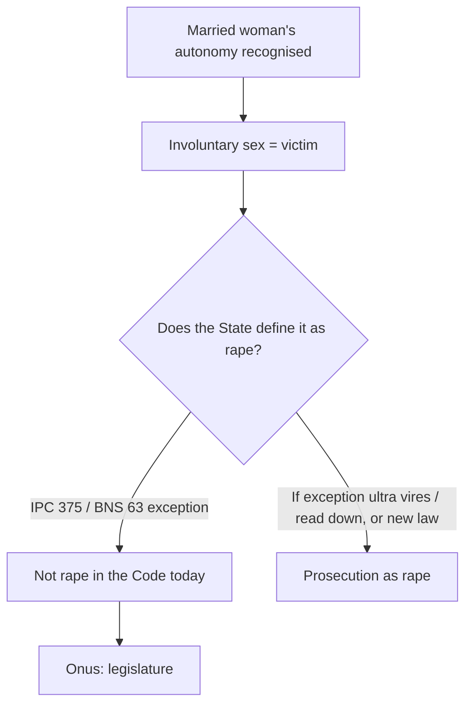

# Current Affairs — 10 September 2026

> **Source:** *The Hindu* (10 September 2026; court copy is **Wednesday 9 September**)  
> **Date Added:** 2026-09-10  
> **Target Exam:** UPSC CSE 2027 (Prelims + GS-II / GS-III)

**Already in notes (not restated here):**

- **English as Union official language / Census / Sahitya Akademi** → stays on `August_2026/2026-08-11_Current_Affairs.md` (`CA-260811-02`) and [Article 343](file:///c:/Users/nitee/OneDrive/Desktop/UPSE_Syllabus/Articles/Article_343.md). Today’s clip is the **Central Board of Secondary Education (CBSE) three-language** hearing, not a rewrite of Munshi–Ayyangar.
- **Polygamy / Section 82 Bharatiya Nyaya Sanhita (BNS)** → stays on `August_2026/2026-08-20_Current_Affairs.md`. Today is the **marital-rape exception** (Indian Penal Code (IPC) **375** / BNS **63**), a different provision.

---

## Topic 1: Centre objects to English as a ‘native’ language — CBSE third paper

> **Micro-Topic ID:** `CA-260910-01`  
> **GS Paper:** **GS-II** (education, Centre–State, language) + **GS-I** (society)

### 1. What is in the news
The Centre told the Supreme Court on Wednesday that it “**has an issue**” with treating **English** as an **indigenous / native** language. **Solicitor-General (SG) Tushar Mehta** appeared before a Bench headed by **Chief Justice of India (CJI) Surya Kant**, standing in for **Additional Solicitor-General (ASG) Aishwarya Bhati**.

It also said it would consult quickly on a **one-time reprieve** for **current Class 6** students from a **mandatory third-language paper** in the **CBSE Class 10** examination. Mehta: a meeting with officials “**today or tomorrow**” for that Class 6 decision.

### 2. What the Centre will not concede (clip)
Senior advocate **Gopal Sankaranarayanan** asked for an order shifting English to the “**non-native**” / **foreign** category. Mehta: “We have an issue about that. We would like to make submissions on that.”

The Court issued **notice** to the government on petitions by **minority schools** on implementation of the **three-language scheme**. (Clip continues on page 10 — do not invent the rest.)

### 3. One-liner
**CBSE third language:** Centre may give **Class 6** a **one-time Class 10 reprieve**; it still **objects** to calling English **native / indigenous**.

**Prelims trap:** This is **not** Article 343 (Hindi official; English continues by the Official Languages Act, 1963). Class homework three-language formula (Kothari: home + English + another Indian language) stays on Modern India — parked, not today’s lock.

---

## Topic 2: Did OpenAI solve the Navier–Stokes problem?

> **Micro-Topic ID:** `CA-260910-02`  
> **GS Paper:** **GS-III** (S&T, AI, ethics) + science

### 1. What is in the news
**Vasudevan Mukunth** (*The Hindu* science). **OpenAI** claimed its agents reached a solution of the **Navier–Stokes regularity** problem in **88 hours**. Clip/lede: a claimed **100-page** proof — **unclear** who outside the company has seen it.

**Navier–Stokes** equations describe **fluid motion**. The existence-and-smoothness question is one of the Clay **Millennium Prize** open problems. Do **not** treat OpenAI’s claim as a settled prize.

### 2. The controversy the paper actually prints
The mathematical community is arguing whether OpenAI used huge compute — and **possibly private user data** of researchers (clip names **Codex** / **Tristan Buckmaster**) — to **scoop** a solution others were writing up. Credit and academic etiquette are the story, not a formula to memorise.

### 3. One-liner
**Navier–Stokes ≠ solved for Prelims.** OpenAI **claims** an **88-hour** agent proof; **independent sight** of the **100-page** write-up is still the hole. **Buckmaster / Codex** is the ethics trap.

---

## Topic 3: Onus on the legislature to make marital rape punishable — SC

> **Micro-Topic ID:** `CA-260910-03`  
> **GS Paper:** **GS-II** (polity, gender justice, criminal law) + **GS-I** (society)

### 1. What is in the news
A three-judge Bench headed by **CJI Surya Kant** (Justice **Joymalya Bagchi** speaking on the clip) recognised the **individual autonomy** of married women and their **safety and security**, but asked whether courts can **direct rape prosecutions against husbands** while the penal law **exempts marital rape**.

### 2. The statute lock (clip)

| Law | Exception |
|:---|:---|
| **IPC Section 375**, second exception | Sexual intercourse / acts by a man with **his own wife**, the wife **not under 15**, “**is not rape**” |
| **BNS Section 63** (replaced IPC in **2023**) | Same marital-rape exemption; wife’s age-threshold raised to **18** |

Justice Bagchi: a person in matrimony subjected to **involuntary sexual intercourse** is **definitely a victim**. The question is whether the **State defines it as ‘rape’**. “This is the law as it stands, rightly or wrongly.” Before a constitutional court holds the exception **unreasonable / manifestly arbitrary**, can a prosecutor proceed despite a **clear exception**?

### 3. The Karnataka appeal
Primary case: appeal against a **2022 Karnataka High Court** decision that a husband **could** be charged with rape if he forced himself on his wife. That High Court used the **Justice J.S. Verma Committee report, 2013** (exception **regressive**) and said “a man is a man; an act is an act; rape is a rape”; no exception should be a **licence** for a crime against society.

Supreme Court: can a court order prosecution **until** the exception’s constitutional validity is examined and, if needed, declared **ultra vires** or **read down**? It mooted that it may be for the **legislature** to decide whether the act should be a crime.

**Indira Jaising** (for the wife): enough elasticity in present law to back the High Court; clip also: age of consent in Section 63 raised **16 → 18**. **SG Tushar Mehta:** the exception **must continue** until the Court takes a **final call** on reasonableness.

### 4. One-liner
**Victim ≠ automatically ‘rape’ in the Code** while **IPC 375 / BNS 63** exception stands. **IPC wife age 15 → BNS 18.** SC: **legislature** to criminalise; courts should not prosecute first.

**Prelims trap:** BNS **did not drop** the exception — it **kept** it and raised the wife’s age to **18**. Do not mix with **Section 82 BNS** (bigamy / polygamy, 20 Aug note).

---

## Abbreviations

| Short | Full |
|:---|:---|
| ASG | Additional Solicitor-General |
| BNS | Bharatiya Nyaya Sanhita, 2023 |
| CBSE | Central Board of Secondary Education |
| CJI | Chief Justice of India |
| IPC | Indian Penal Code, 1860 |
| SG | Solicitor-General |

<!-- 2026-09-10: The Hindu — CBSE English native/third language; OpenAI Navier-Stokes claim; SC marital-rape exception IPC 375 / BNS 63. One cluster CA-260910. Art 343 English and polygamy/82 BNS stay on August notes. -->
