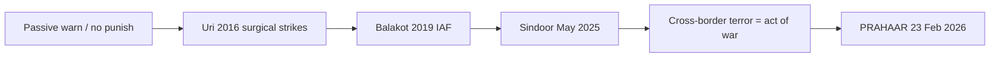

# Current Affairs — 14 September 2026

> **Source:** *The Hindu* (Rajeev Agarwal — counter-terror strategy / **PRAHAAR**; Suhasini Haidar + Kallol Bhattacherjee — Guterres on UN maps)  
> **Date Added:** 2026-09-14  
> **Target Exam:** UPSC CSE 2027 (Prelims + GS-II / GS-III)

**Already in notes (not restated here):**

- **UN Geospatial sheet / Correct the Map / Arunachal–Aksai Chin claim lines** → patched on `2026-09-08_Current_Affairs.md` (**CA-260908-02**). Guterres: **no UN map with borders**; website sheet = **NGO / indicative**. **MEA** taking the anomaly up with the UN. Pointers: Internal Security L1; UN L2 (SG). **No extra Day-1.**
- **Operation Sindoor** as **proxy infrastructure**, **nine** camps, **28–29 minutes**, **not** a MAD war → `GS_IR_VR_Notes/03_World_Order_After_WW2.md` (**IR-03-02**). Clip extras (6–7 May / 96 hours / three intentions) sit **there**.
- **Pahalgam 2025** named in the **New Delhi Declaration** (this paper: **exclusive paragraph**) → `2026-09-06_Current_Affairs.md` (**CA-260906-02**).
- **SCO Bishkek** visit → `August_2026/2026-08-30_Current_Affairs.md`. Modi **1 September** line on **double standards** / terrorism **never a strategic asset** patched **there**.

---

## Topic 1: PRAHAAR — National Counter-Terrorism Policy and Strategy

> **Micro-Topic ID:** `CA-260914-01`  
> **GS Paper:** **GS-III** (internal security, terrorism) + **GS-II** (India and neighbours)

### 1. What is in the news
**Rajeev Agarwal** (retired colonel). After **9/11 (11 September 2001)**, terrorism shifted from large groups under named leaders (**Osama bin Laden**, **Abu Bakr al-Baghdadi**) toward **smaller, more autonomous** units, **lone-wolf** attacks, **drones**, **cyber**, and **artificial intelligence** — used by groups **and** by states.

**India lock:** strategy moved from **passive** (warn Pakistan, **do not punish**) to **bold and active**: any act of terrorism **backed by support from across the border** = **“act of war”**. Margin: **defensive restraint → proactive counter-terrorism**.

### 2. Firsts on the clip (do not invent extras)

| Date | Event (clip) | Why the clip flags it |
|:---|:---|:---|
| **21 May 1991** | **Rajiv Gandhi** assassinated, **Sriperumbudur**, Tamil Nadu — **Liberation Tigers of Tamil Eelam (LTTE)** | First major terror attack named here was **not** from Kashmir |
| **March 1993** | Mumbai serial blasts — **over 250** dead, **13** coordinated blasts | Internal-security stretch |
| **February 1998** | Synchronised blasts, **Coimbatore**, Tamil Nadu | Same |
| **24 December 1999** | **Indian Airlines** flight **IC-814** hijack | Direct **Pakistan** role; **Ahmed Omar Sheikh** and others released; **Masood Azhar** later swapped for **more than 160** civilian hostages |
| **13 December 2001** | **Parliament** attack — **Jaish-e-Mohammed (JeM)** | **Operation Parakram**; nuclear-armed India–Pakistan; **almost two years** of mobilisation, then **military disengagement** with **no** direct punishment |
| **26 November 2008** | **26/11** Mumbai | World solidarity with India’s cross-border-terror fight; still **no** military action against Pakistan |
| **18 September 2016** | **JeM** on an Army camp, **Uri** | First **cross-border surgical strikes (28–29 September)** |
| **14 February 2019** | **Pulwama** — **Central Reserve Police Force (CRPF)** convoy | Hook for Balakot |
| **26 February 2019** | **Indian Air Force (IAF)** strike on a **JeM** camp, **Balakot** | First time the IAF **entered Pakistani airspace** to strike a terror target |
| **22 April 2025** | **Pahalgam** | PM was in **Saudi Arabia** |
| **6–7 May** | **Operation Sindoor** | ~**96 hours**; **Lashkar-e-Taiba (LeT)** and **JeM headquarters** destroyed. Class numbers stay on **IR-03-02**. |

Other named blasts (no extra numbers): **Akshardham 2002**; **Varanasi 2006**; **German Bakery, Pune, 2010**; **Red Fort, 22 December 2000 (LeT)**; Delhi serial bombs **October 2005** (**over 60**); Delhi **September 2008** (including **Sarojini Nagar**, **Paharganj**); **Delhi High Court, 7 September 2011** — **Harkat-ul-Jihad Islami (HUJI)**, al-Qaeda-affiliated, based in Pakistan.

**May 2014:** change of government → clip’s turning point toward **not leaving terror unpunished**.

### 3. After Sindoor — three intentions (clip)

1. Era of **restraint and patience** is over; Pakistan pays a **direct and heavy price**.  
2. Future **cross-border terrorism emanating from Pakistan** = **“act of war”**.  
3. **Pakistani nuclear blackmail** will **no longer** be a restraining factor.

**Trap:** (3) is a **policy** line. Class **Mutually Assured Destruction (MAD)** on **IR-03** is **not** cancelled.

### 4. PRAHAAR (23 February 2026)

India unveiled **PRAHAAR**, its first comprehensive **National Counter-Terrorism Policy and Strategy**, **23 February 2026**. National framework to **prevent and respond** to terrorist activity and radicalisation through **whole-of-government** and **whole-of-society**. (Clip does not expand the letters — do not invent a full form.)

**Four-fold strategy (clip):**

1. Hunt down and eliminate **remnants** of the terror network **in the country**, especially **Kashmir**.  
2. **Pre-emptive military action** against terror **building across the Line of Control (LoC)**, including **launch pads**.  
3. Exhaustive **de-radicalisation** — make joining / supporting terror **unattractive and prohibitively costly**.  
4. Cut **terror financing**, in coordination with **friendly countries**.

Clip: terror-related incidents in Kashmir have **declined drastically**; the live risk is a **few terrorists infiltrating** across the LoC.

### 5. One-liner
**PRAHAAR (23 Feb 2026)** = first national counter-terror **policy + strategy**; **whole-of-government / whole-of-society**. Cross-border terror from Pakistan now framed as **act of war**. **Uri** = first surgical strikes; **Balakot** = first IAF strike in Pakistani airspace.

**Prelims trap:** **PRAHAAR** is **23 February 2026**, not Sindoor week. **Sindoor 6–7 May** ≠ class **28–29 minutes** (both can be on the clip/class; do not swap). **Correct the Map** is **not** this file. **9/11** here is the **global** turn, not India’s first attack (**Rajiv Gandhi / LTTE 1991** on this clip).

### Update — 14 September 2026 (evening paper)

`MST-093`. I+II **held** (PRAHAAR 23 Feb 2026 first National Counter-Terrorism Policy; Uri 2016 first surgical / Balakot 2019 first IAF airspace). Trap III: the clip’s **nuclear-blackmail** line is **policy**. Class **MAD** on **IR-03** is **not** cancelled. He picked **all three**. Flash F13 date **held** — same atom. **Held 15 Sep** Ghost Recall (does not cancel MAD). Leftover: Uri = first **surgical strikes**; Balakot = first **IAF in Pakistani airspace**; intention 2 = **act of war**. 15-day **30 Sep**.

---

## Abbreviations

| Short | Full |
|:---|:---|
| **CRPF** | Central Reserve Police Force |
| **HUJI** | Harkat-ul-Jihad Islami |
| **IAF** | Indian Air Force |
| **JeM** | Jaish-e-Mohammed |
| **LeT** | Lashkar-e-Taiba |
| **LoC** | Line of Control |
| **LTTE** | Liberation Tigers of Tamil Eelam |
| **MAD** | Mutually Assured Destruction |
| **MEA** | Ministry of External Affairs |
| **NGO** | Non-Governmental Organisation |
| **SCO** | Shanghai Cooperation Organisation |
| **UN / UNGA** | United Nations / United Nations General Assembly |

<!-- 2026-09-14: Hindu — (1) UN map / Guterres patched on CA-260908-02 + IS-01 + IR-02, no extra Day-1. (2) Sindoor extras on IR-03-02; Pahalgam paragraph on CA-260906-02; SCO Bishkek line on 30 Aug. (3) New: PRAHAAR 23 Feb 2026 + Uri/Balakot firsts + act of war. Cluster CA-260914 leftover 15 Sep — do not steal HIS-IVC2 Q1. -->
<!-- 2026-09-14 evening: MST-093 PRAHAAR I+II; nuclear-blackmail ≠ cancel MAD. Flash date held. Leftover 15 Sep. -->
