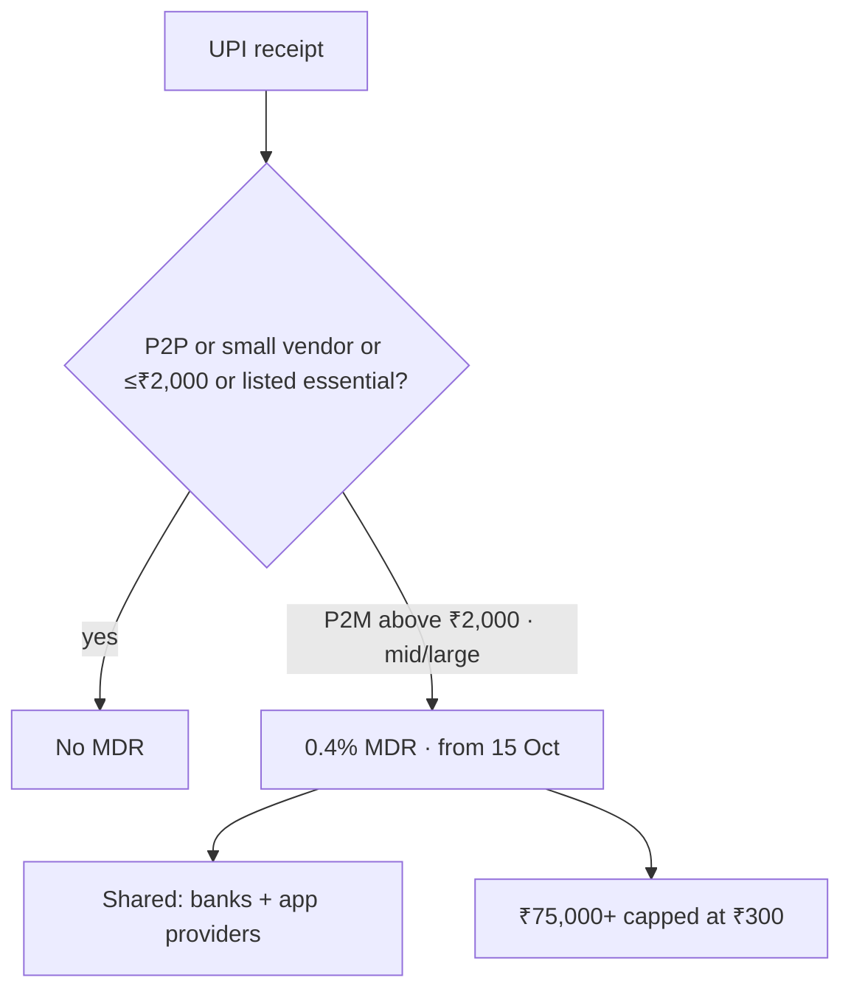

# Current Affairs — 16 September 2026

> **Source:** *The Hindu* (NPCI UPI MDR; Commerce Secretary on August trade; Kishau MoU)  
> **Date Added:** 2026-09-16  
> **Target Exam:** UPSC CSE 2027 (Prelims + GS-II / GS-III)  
> **Cluster:** **CA-260916**. First-pass **17 Sep Q3** — do **not** steal class Q1–Q2 (**GEO-14** / **HIS-IVC3**).

**Already in notes (not restated here):**

- **GDP base year 2022–23** (Goldar; implemented 2026) → patched on `GS_Economy_VR_Notes/01_Introduction_and_National_Income_Basics.md` (**ECO-02-02**). Hindu extras (overlap-year %; **ASUSE** / **PLFS**; informal economy) sit **there**. **No extra Day-1.**
- **Smallholder collectives / SHG / FPO** → patched on `GS_Geography_VR_Notes/06_Agriculture_Rainfed_Irrigation_and_Land.md` (**GEO-08-07**). IFAD clip extras sit **there**. **No extra Day-1.**
- **UPI–PayNow / BRICS rails** → `2026-09-06_Current_Affairs.md` (**CA-260906-02**). Today is **domestic Merchant Discount Rate (MDR)**, not a new pairing.

---

## Topic 1: UPI MDR — 0.4% above ₹2,000 from 15 October

> **Micro-Topic ID:** `CA-260916-01`  
> **GS Paper:** **GS-III** (inclusive growth, digital payments)

### 1. What is in the news
**National Payments Corporation of India (NPCI)** has introduced a **0.4%** charge that most merchants will pay banks and payment processors on **Unified Payments Interface (UPI)** receipts **in excess of ₹2,000** per transaction. Takes effect **15 October**. The charge, or **Merchant Discount Rate (MDR)**, will **not** apply to person-to-person UPI, nor to UPI to **small vendors**.

**Centre:** banks advised so the fee is **not passed on to customers**.

### 2. Who pays / who does not (clip)

| Pays 0.4% MDR | Exempt |
|:---|:---|
| **Mid-to-large** merchants on UPI receipts **above ₹2,000** | All **person-to-person (P2P)** UPI — **any** value |
| | **Person-to-merchant (P2M)** to **small vendors** |
| | P2M up to **₹2,000** on UPI **or RuPay debit cards** |
| | **Railways, telecom, insurance, fuel, agriculture inputs** |

Graphic: **flat ₹5 MDR** in **certain essential sectors**. Charges apply **only** to **P2M** exceeding ₹2,000.

**P2P share (Government):** **37%** of UPI **volume**, **70%** of UPI **value**.

**Small merchants** receiving up to **₹1 lakh / month** via UPI QR under the clip’s **Person-to-Person Merchant (P2PM)** class: **no MDR**.

**₹75,000 and above:** MDR **capped at ₹300** per transaction.

The **0.4%** is **shared** among payment-ecosystem partners (**banks** and **app providers**).

### 3. One-liner
NPCI: **0.4% MDR** on UPI P2M **above ₹2,000** from **15 Oct**; **not** to be passed to customers. **P2P + small-vendor + ≤₹2,000 + listed essentials** exempt.

**Prelims trap:** This is **domestic MDR**, not **UPI–PayNow**. **P2P stays free** at any value. **RuPay debit** P2M **≤₹2,000** is also free. Cap **₹300** is for **₹75,000+**, not for the ₹2,000 threshold.

### Update — 17 September 2026 (Ghost Recall)

`MST-101`. Rate **0.4%**, from **15 Oct**, **P2P free**, Kishau **Tons / 90–10 of 1994 / Delhi** **held**. Trap: dropped **above ₹2,000**. Cluster **+3 20 Sep**. Trade row still untested.

---

## Topic 2: August 2026 — merchandise export growth beats imports

> **Micro-Topic ID:** `CA-260916-02`  
> **GS Paper:** **GS-III** (external sector)

**Commerce Secretary Rajesh Agrawal.** India’s **trade deficit fell** in **August**. **Merchandise** exports grew **more than 26%**, outpacing imports in **percentage and absolute value** — clip: **first time**.

| | Aug 2025 | Aug 2026 | Growth (clip) |
|:---|---:|---:|:---|
| Merchandise **exports** | **$34.74 bn** | **$43.81 bn** (**$43.8 bn**) | **26% / 26.1%** · **+$9.07 bn** |
| Merchandise **imports** | **$61.96 bn** | **$70.67 bn** (**$70.7 bn**) | **14%** · **+$8.71 bn** |
| Overall exports (goods **+ services**) | — | **$82.7 bn** | **25.4%** |
| Overall imports | — | **$92.1 bn** | **18.7%** |
| **Trade deficit** | **$11.6 bn** | **$9.4 bn** | shrunk |

Source on the chart: **Ministry of Commerce and Industry**.

Growth is in **dollar and rupee** terms; a **large** part is **volume**, not only a cheaper rupee. Agrawal: depreciating rupee helped, but the surge is **value + volume**.

**Prelims trap:** **26%** is **merchandise exports**, not overall (**25.4%**). Deficit **$9.4 bn** is **August**, not a FY figure. Class **agri trade surplus** (`04_Agriculture_Importance_Trade_and_Commodities.md`) is a **different** lock.

---

## Topic 3: Kishau — six governments, ₹15,624-crore MoU

> **Micro-Topic ID:** `CA-260916-03`  
> **GS Paper:** **GS-II** (federalism, inter-State river) + **GS-III** (water, hydropower)

**Tuesday** (paper: **15 Sep 2026**): **Himachal Pradesh (HP), Haryana (HR), Uttarakhand (UK), Uttar Pradesh (UP), Delhi, Rajasthan (RJ)** signed for the **422 MW Kishau** multipurpose project. Cost **₹15,624 crore**. On the **Tons** river, **Uttarakhand–Himachal Pradesh** border. Signing in **New Delhi** with Union Home Minister **Amit Shah** and Union Jal Shakti Minister **C.R. Patil**.

Shah: **tenth** water dispute to be resolved since he became PM; **Delhi** the **biggest beneficiary**.

| Lock | Clip |
|:---|:---|
| Finance | Centre **~90%**; participating States **10%** under a **1994** agreement |
| Dam | **232.6 m** concrete **gravity** dam on the **Tons** |
| Storage | **1,562 million cubic metres** |
| Irrigation | **97,000 hectares** |
| Power | **1,476 million units** of hydropower |
| Delhi water | **109.9 million cubic metres / year** (Chief Minister’s Office) |

**HP CM Sukhvinder Singh Sukhu:** previous BJP State government had agreed **₹800 crore** as HP’s share; present government **refused** (limited resources). HP would suffer the **greatest loss** (displacement); extra financial burden would be **unfair**; contribution to national progress deserves **compensation**.

**Delhi Cabinet** (Tuesday) passed a gratitude resolution.

**Prelims trap:** Clip says **six States** including **Delhi**. River named is **Tons**, not Yamuna. **90/10** is the **1994** split, not a new formula. **₹15,624 crore** ≠ HP’s old **₹800 crore** offer.

---

## Abbreviations

| Short | Full |
|:---|:---|
| **NPCI** | National Payments Corporation of India |
| **UPI** | Unified Payments Interface |
| **MDR** | Merchant Discount Rate |
| **P2P / P2M / P2PM** | Person-to-person / Person-to-merchant / Person-to-Person Merchant (clip class for small QR merchants) |
| **HP / HR / UK / UP / RJ** | Himachal Pradesh / Haryana / **Uttarakhand** / Uttar Pradesh / Rajasthan |
| **MW** | Megawatt |
| **ASUSE / PLFS** | Annual Survey of Unincorporated Sector Enterprises / Periodic Labour Force Survey (GDP patch on Economy) |
| **IFAD** | International Fund for Agricultural Development (smallholder patch on Geography) |

<!-- 2026-09-16: Hindu — (1) NPCI UPI 0.4% MDR above ₹2,000 from 15 Oct. (2) August merchandise exports 26% beat imports in % and $; deficit $9.4 bn. (3) Kishau 422 MW / ₹15,624 cr / Tons / 90-10 of 1994. GDP base extras → ECO-02-02. IFAD smallholders → GEO-08-07. One cluster CA-260916. First-pass 17 Sep Q3 — do not steal GEO-14 / HIS-IVC3. -->
<!-- 2026-09-17: Ghost Recall first-pass held. MST-101 dropped above ₹2,000. Kishau held. Cluster +3 20 Sep. -->
