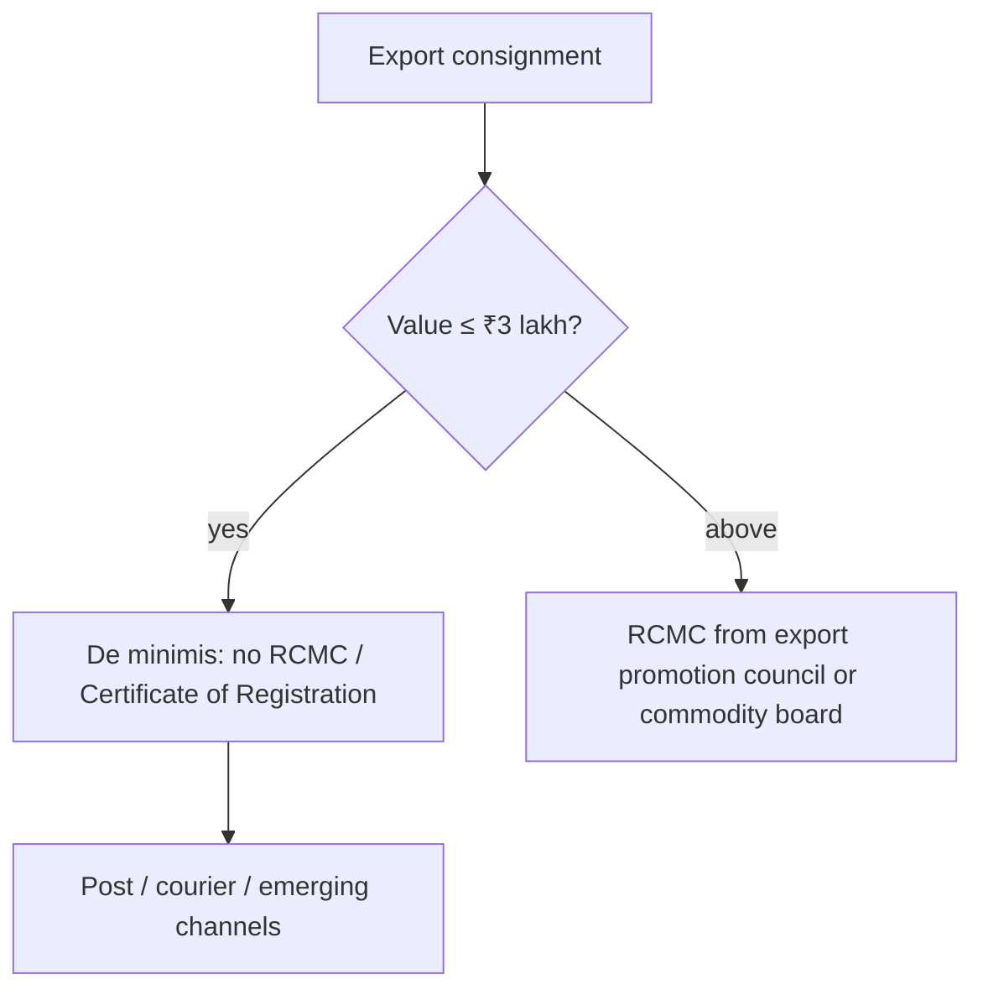

# Current Affairs — 17 September 2026

> **Source:** *The Hindu* (Commerce — RCMC de minimis for small exporters)  
> **Date Added:** 2026-09-17  
> **Target Exam:** UPSC CSE 2027 (Prelims + GS-III)  
> **Cluster:** **CA-260917**. First-pass **18 Sep Q3** — do **not** steal class Q1–Q2 (**GOV-01** / **ECO-09**).

**Already in notes (not restated here):**

- **Pakistan–China Boundary Joint Commission** (first meeting Islamabad; India rejects; never recognised the **1963 China–Pakistan Boundary Agreement**; J&K and Ladakh UTs inalienable) → patched on `GS_IR_VR_Notes/04_Sino_India_Relations.md` (**IR-04-07**). Pointer on Internal Security L1 (**IS-01-04**). **No extra Day-1.**

---

## Topic 1: Small exporters — RCMC de minimis up to ₹3 lakh

> **Micro-Topic ID:** `CA-260917-01`  
> **GS Paper:** **GS-III** (exports, ease of doing business)

### 1. What is in the news
**Ministry of Commerce and Industry** (Wednesday): a **de minimis exemption** from the **Registration-cum-Membership Certificate (RCMC)** — or **Certificate of Registration** — for **small-value export consignments up to ₹3 lakh**. Aim: cut compliance for **new and small** exporters and ease exports via **postal, courier and other emerging channels**.

**Before the change:** exporters had to obtain an RCMC or Certificate of Registration from the relevant **export promotion council** or **commodity board**.

### 2. Why the Centre says the value share is tiny (clip)

Data **2021–22 to 2025–26:** low-value exports are a **large share of shipping bills** but a **very small share of export value**.

| Clip lock | Figure |
|:---|:---|
| Consignments up to **$3,000** | **43%** of shipping bills |
| Same band’s share of India’s **merchandise export value** | **0.86%** |

The exemption is therefore expected to cover a **substantial number** of small-value transactions with only a **marginal** impact on overall export value.

### 3. One-liner
Commerce: **no RCMC** for export consignments **≤ ₹3 lakh** (post / courier / emerging channels). **$3,000** band = **43%** of shipping bills but **0.86%** of merchandise export value.

**Prelims trap:** **₹3 lakh** is the **exemption ceiling**, not **$3,000**. The **$3,000** line is the **share-of-bills vs share-of-value** statistic. This is **RCMC / export-promotion-council registration**, not GST composition (ECO-09) and not the August trade-deficit clip (CA-260916).

---

## Abbreviations

| Short | Full |
|:---|:---|
| **RCMC** | Registration-cum-Membership Certificate |
| **MEA** | Ministry of External Affairs (Pak–China Joint Commission patch on IR-04) |
| **CPEC** | China–Pakistan Economic Corridor |
| **PoK** | Pakistan-occupied Kashmir |

<!-- 2026-09-17: Hindu — (1) Commerce de minimis: no RCMC for consignments ≤₹3 lakh; $3,000 band = 43% shipping bills / 0.86% merchandise export value. Cluster CA-260917. First-pass 18 Sep Q3 — do not steal GOV-01 / ECO-09. Pak–China Boundary Joint Commission → IR-04-07; no extra Day-1. -->
