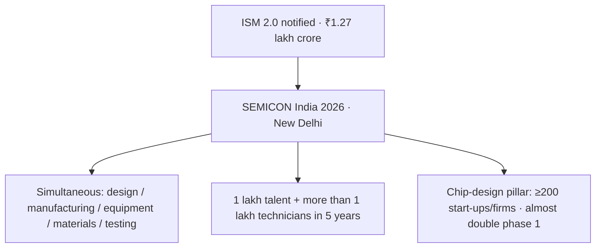

# Current Affairs — 18 September 2026

> **Source:** *The Hindu* (SEMICON India 2026 / India Semiconductor Mission 2.0)  
> **Date Added:** 2026-09-18  
> **Target Exam:** UPSC CSE 2027 (Prelims + GS-III)  
> **Cluster:** **CA-260918**. First-pass **19 Sep leftover** — do **not** steal class Q1–Q2 if 18 Sep lectures land.

**Already in notes (not restated here):**

- **Pax Silica** (US grouping vs China’s critical-minerals / semiconductor choke) → `GS_IR_VR_Notes/01_Basics_of_International_Relations.md` (**IR-01-03**). Today is **India Semiconductor Mission (ISM) 2.0** + **SEMICON India 2026**, not that US initiative.

---

## Topic 1: SEMICON India 2026 — ISM 2.0 and a “trustworthy” chip location

> **Micro-Topic ID:** `CA-260918-01`  
> **GS Paper:** **GS-III** (industry, science and tech, supply chains)

### 1. What is in the news
**Prime Minister Narendra Modi** inaugurated **SEMICON India 2026** in **New Delhi** (**Thursday**). He pitched India as a **“new and trustworthy location”** for electronics manufacturing, and asked global chipmakers to help take electronics off the **“weaponisation” of supply chains**.

The address came **days after** the **India Semiconductor Mission (ISM)** **second phase** was notified. **ISM 2.0** outlay: **₹1.27 lakh crore**.

**PM lock:** this is not “set up a factory and the job is done.” Other countries built semiconductor ecosystems only after **decades**. India, he said, has worked **simultaneously** on:

- chip **design**
- **manufacturing**
- **equipment** manufacturing
- the **materials** ecosystem
- **testing** capability

Success in a critical industry by the **“mother of democracy”** would **strengthen the supply chain of the entire world** — more so when supply chains are being **weaponised**.

**Information Technology (IT) Minister Ashwini Vaishnaw**

| Clip | Figure |
|:---|:---|
| Talent for factories coming up in India | train **one lakh** people — a **“global pool of talent”** who can be employed **straightaway** |
| Technicians over **five years** (electronics manufacturing duties) | **more than one lakh** |
| **ISM 2.0 chip-design pillar** | target **at least 200** start-ups and firms — **almost double** the first phase |

### 2. Industry numbers named at the event (clip)

| Who | Lock |
|:---|:---|
| **SEMI** CEO **Ajit Manocha** (clip: global industry body) | semiconductor industry to cross **$1.3 trillion this year** and **$2 trillion by 2030** |
| **Applied Materials** | **$5 billion** over the **coming five years** to expand its **Research and Development (R&D)** centre and supply chain |
| **Micron** CEO **Sanjay Mehrotra** | commercial production began at **Sanand** earlier this year; current capacity already **exceeds the memory required for India’s entire laptop market**. **ISM**, and now **ISM 2.0**, gave the industry a foundation it did not have |
| **Infineon** CEO **Jochen Hanebeck** | India a **“market of tremendous importance”**; firm **increasing hiring in India by 28%** |

### 3. One-liner
**SEMICON India 2026** (New Delhi): **ISM 2.0 ₹1.27 lakh crore**; simultaneous design–fab–equipment–materials–testing. Train **1 lakh** talent / **>1 lakh** technicians in **5 years**; **≥200** design start-ups. **SEMI** global **$1.3 tn / $2 tn (2030)** ≠ India’s outlay.

**Prelims trap:** **₹1.27 lakh crore** is **ISM 2.0**, not the SEMICON event budget. **$1.3 trillion / $2 trillion** is the **global** industry (**SEMI**), not India’s. **ISM ≠ SEMI**. **$5 billion / 5 years** is **Applied Materials**, not Micron. Micron lock is **Sanand** commercial production + laptop-memory capacity. **Pax Silica** is **IR-01**, not this mission.

---

## Abbreviations

| Short | Full |
|:---|:---|
| **ISM** | India Semiconductor Mission |
| **SEMI** | Global semiconductor industry body (clip name; do not invent a longer form) |
| **IT** | Information Technology (Minister Ashwini Vaishnaw) |
| **R&D** | Research and Development |
| **PM** | Prime Minister |

<!-- 2026-09-18: Hindu — SEMICON India 2026 New Delhi; ISM 2.0 ₹1.27 lakh cr; 1 lakh talent / >1 lakh technicians in 5 years; ≥200 design start-ups; SEMI $1.3 tn / $2 tn 2030; Applied Materials $5 bn / 5 yr; Micron Sanand; Infineon hiring +28%. Cluster CA-260918. First-pass 19 Sep leftover — do not steal class Q1–Q2. Pax Silica stays IR-01. -->
