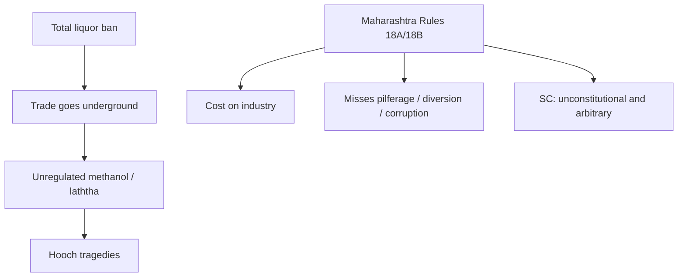

# Current Affairs — 20 September 2026

> **Source:** *The Hindu* (NGT conference — PM on emissions; SC on Gujarat prohibition / Maharashtra methanol rules)  
> **Date Added:** 2026-09-20  
> **Target Exam:** UPSC CSE 2027 (Prelims + GS-II / GS-III)  
> **Cluster:** **CA-260920**. First-pass **21 Sep leftover** — do **not** steal class Q1–Q2 if 20 Sep lectures land.

**Already in notes (not restated here):**

- **SHANTI Act, 2025** (liability caps / private-capital aim / today’s reactors still **NPCIL**) → patched on `Current_Affairs/August_2026/2026-08-18_Current_Affairs.md` (**CA-260818-02**) and `GS_ScienceTech_VR_Notes/06_Moderator_Reactors_and_Three_Stage_Programme.md` (**ST-08-04**). **No extra Day-1.**
- **UNFCCC 1992 / COP calendar** → Environment Lecture 2 (**ENV-02-06**). Paris **2015** was **not** that class. Today’s **G-20 / Paris-fulfilment** line is the PM’s claim at NGT, not a new UNFCCC lecture.
- **Article 47** (DPSP: endeavour towards prohibition of intoxicating drinks) → `Articles/Article_47.md`. Pointer patched there. Today is the **Pardiwala** judgment, not a rewrite of Part IV.

---

## Topic 1: NGT conference — PM on who is blamed for emissions

> **Micro-Topic ID:** `CA-260920-01`  
> **GS Paper:** **GS-III** (environment, climate, energy) + **GS-II** (tribunals)

### 1. What is in the news
**Saturday:** **Prime Minister Narendra Modi** inaugurated a two-day conference — **“The Future of Environmental and Climate Dynamics”** — organised by the **National Green Tribunal (NGT)** at **Vigyan Bhavan**, New Delhi. Photo: PM with **Chief Justice of India Surya Kant**.

NGT: aim is to identify **gaps in policy-making and implementation** and strengthen cooperation among institutions. Participants: jurists, academics, policymakers, scientists and experts from **17 countries**, plus the **United Nations Environment Programme (UNEP)** and the **Asian Development Bank (ADB)**.

### 2. PM locks (clip only)

| Claim | Figure / line |
|:---|:---|
| Blame | Responsibility for carbon emissions has been **“wrongly placed on developing countries”** |
| **Group of Twenty (G-20)** | India the **only G-20 country** to have **fulfilled all** commitments made at the **2015 Paris** climate summit — and **ahead of schedule** |
| India’s **per capita** carbon emissions | **less than half** the global average |
| Developed-country industrial growth in per capita emissions | **six times** India’s |
| **Solar** capacity | about **2 GW → more than 160 GW** in **12 years** |
| **Non-fossil** capacity | **nearly quadrupled** |

Nuclear / private pathway → **SHANTI from December 2025** (patched on the August note). Do not restudy liability caps here.

### 3. One-liner
NGT, Vigyan Bhavan: PM — developing countries **wrongly blamed**; India **only G-20** to have met **2015 Paris** pledges **ahead of schedule**; per capita **< half** global; solar **2 → >160 GW** in **12 years**.

**Prelims trap:** **< half** is **per capita**, not India’s **total** emissions. **Six times** is **developed-country industrial growth in per capita emissions vs India**, not “developed emit 6× India’s total.” **₹ / $ outlays** are not in this clip. **SHANTI** date lock is **December 2025**, already on **CA-260818**. **UNFCCC 1992** ≠ **Paris 2015**.

---

## Topic 2: SC — forced temperance is no solution; methanol Rules 18A/18B fall

> **Micro-Topic ID:** `CA-260920-02`  
> **GS Paper:** **GS-II** (judiciary, federalism, public health) + **GS-I / Essay** (social issues)

### 1. What is in the news
**Justice J.B. Pardiwala**, heading a **Division Bench**, in a Friday judgment: **forced temperance is no solution to alcoholism**. A **total ban** only sends the liquor trade **underground** and raises the prevalence of **unregulated, lethal brews**.

**Gujarat** has kept a **strict prohibition** policy since the State’s creation in **1960**. Despite that, the State has seen **at least 10** major **hooch** tragedies, claiming **over 600** lives (*laththa* laced with **methanol**). Recent reminders: **Bhavnagar (Gujarat) 13** lives and **Sagar (Madhya Pradesh) 15** lives.

### 2. Five evils of prohibition (Court list)

1. Loss of **revenue** on taxes  
2. **Expenditure** of good money spent (on the ban)  
3. **Corruption** in police and excise  
4. **Illegal distilling**  
5. Resultant **drug menace**

### 3. What the Bench actually struck down

The Court was hearing a challenge to **Rules 18A and 18B** of the **Maharashtra Poisonous Rules**, which **restrict purchase of methanol** and **mandate a bitterant and colourant** in methanol before sale to a **non-drug manufacturer**.

Those Rules came in after **93 of 250** people died who had consumed spurious liquor bought at **Chhogra Bar, Mumbai, in 1991** — later found to be **methanol**.

**Held:** the Rules are **unconstitutional and arbitrary**. They impose a **heavy financial burden on industries** and **do not address** the core of hooch tragedies — **pilferage, diversion, and institutional corruption**.

### 4. Directions (clip)

- Break the **chain of supply and demand** of spurious liquor  
- **Heightened vigilance** at **inter-State boundaries** against illegal transport  
- **Municipal school** premises are often used as **storage** for illegal liquor  
- Governments should **monitor industrial units** that make **chemical solvents** sold illegally to liquor makers  
- Transport of methanol must be in **dedicated tankers** (cut pilferage / substitution)

### 5. One-liner
Pardiwala: **prohibition ≠ cure**. Gujarat dry since **1960**; **≥10** hooch tragedies / **>600** dead. Maharashtra **Rules 18A/18B** (methanol bitterant–colourant) **struck** — arbitrary; **1991 Chhogra Bar** was the peg (**93/250**).

**Prelims trap:** The strike-down is **Maharashtra methanol Rules 18A/18B**, not “Gujarat prohibition is unconstitutional.” Gujarat numbers are the **failure-of-ban** illustration. **13** = Bhavnagar; **15** = Sagar, **Madhya Pradesh**. **93/250** = **1991 Mumbai**, not 2026. **Article 47** still exists — the clip does not repeal it.

### Update — 22 September 2026 (*The Hindu* explainer — why 18A/18B fell)

Same judgment as above (Friday **18 September 2026**). New facts only. **No extra Day-1.**

- Bench named in the explainer: Justice **J.B. Pardiwala** and Justice **K. Vinod Chandran**.
- The rules are **Rules 18A and 18B** of the **Maharashtra Poisons Rules, 1972** (the 20 Sep clip said “Maharashtra Poisonous Rules”). They force a **colourant and a bitterant** into methanol before sale to a **non-drug manufacturer**.
- **Held disproportionate.** Not a sufficient connection with the hooch problem they were written for. Rights the challenge put in issue: **Article 14**, **Article 19(1)(g)** (trade / occupation), **Article 21**, and **Article 300A** (property). A policy that is irrational, or has no reasonable and proximate nexus, or breaks another provision of law, can be struck down. The explainer applies the **proportionality** line (suitable, necessary, balanced).
- The Court did **not** say every restriction on methanol is unconstitutional.
- **Rule 18A(8)** was treated as already covering the core: methanol mixed into liquor, with an unregulated bitterant, can be deemed **unfit for human consumption**. The State did not show why that rule was not enough, so the wider colourant-and-bitterant mandate failed.
- Industry side of the facts: a purchaser’s **Form A** licence; adding the colour could make lawful industrial products unsaleable. A committee under an **Additional Director General of Police** examined the 1991 tragedy before the rules were amended. The **93 of 250 / Chhogra Bar / 1991** numbers stay as written above.
- Guidelines the Court indicated for the State (not a new statute in the clip): certificate of the purchaser; licences to the industries that actually need methanol; stock records; **dedicated tankers** and checks at State borders (already in §4 above); stop illegal import; sealed containers; return unused methanol; de-addiction support. The clip says the rest depends on policy and enforcement.

**Prelims trap:** The strike-down is still **18A/18B’s colourant–bitterant mandate**, not “Gujarat prohibition is void” and not “methanol cannot be regulated.” **18A(8)** is the part the explainer treats as **still doing the job**. **Article 47** is not repealed. **Article 300A** here is one of the rights **pleaded**, not a new property doctrine.

---

## Abbreviations

| Short | Full |
|:---|:---|
| **NGT** | National Green Tribunal |
| **UNEP** | United Nations Environment Programme |
| **ADB** | Asian Development Bank |
| **CJI** | Chief Justice of India |
| **G-20** | Group of Twenty |
| **SHANTI** | Sustainable Harnessing and Advancement of Nuclear Energy for Transforming India (Act, 2025) |
| **GW** | Gigawatt |
| **SC** | Supreme Court |
| **MP** | Madhya Pradesh |
| **DPSP** | Directive Principles of State Policy |

<!-- 2026-09-20: Hindu — (1) NGT Vigyan Bhavan: PM only G-20 met 2015 Paris ahead of schedule; per capita < half global; solar 2→>160 GW / 12 yr; non-fossil nearly quadrupled. SHANTI Dec 2025 private pathway → CA-260818 / ST-08 no extra Day-1. (2) Pardiwala: forced temperance no solution; Gujarat dry 1960 ≥10 tragedies >600 dead; MH Rules 18A/18B methanol struck; Chhogra 1991 93/250. Cluster CA-260920. First-pass 21 Sep leftover. -->
