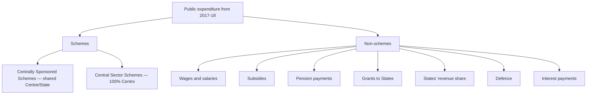

# 03 — Taxation

> **Dates of Lecture:** 24 August 2026 (Lecture 4) + **25 August 2026 (Lecture 5)** + **31 August 2026 (Lecture 6)** + **13 September 2026 (Lecture 7)** + **15 September 2026 (Lecture 8)** + **17 September 2026 (Lecture 9)**  
> **Date Added:** 2026-08-24; Lecture 5 added **2026-08-25**; Lecture 6 added **2026-08-31**; Lecture 7 added **2026-09-13**; Lecture 8 added **2026-09-15**; Lecture 9 added **2026-09-17**  
> **Teacher:** **BS Sir**  
> **Source:** Vajiram & Ravi — **BS Sir** | Economy classes | transcripts + handwritten notes (L4 class notes; L5 six pages; L6 seven pages dated 31/8/26; L7 six pages dated 13/9/26; **L8 six pages dated 15/9/26**; **L9 seven pages dated 17/9/26**)  
> **Topics Covered:** Tax classification, PIT regimes, corporate tax, GMCT intro (L4); GMCT detail, MAT, STT, CGT, indexation, round tripping, DTAA, DDT SC verdict, withholding tax, DTC (L5); New Income Tax Act 2025, DDT, cess vs surcharge, TDS/TCS, GAAR, revenue deficit start (L6); windfall / surtax, land tax vs land-revenue tax, professional tax, Equalisation Levy / Digital Service Tax, BEPS toolkit, faceless assessment (L7); **Vivad Se Vishwas / Sabka Vishwas, Border Adjustment Tax vs anti-dumping / countervailing, SARFAESI / e-Bikray–BAANKIT, VAT timeline + inverted duty, GST dual / zero-rated / e-way / 22 Sep 2025 rates / National Anti-Profiteering Authority (L8)**; **GST composition scheme, GST Council, Reverse Charge Mechanism, GSTAT, zero / nil / exempt / non-GST, GST merits–demerits, angel tax, schemes vs non-schemes, line-item vs zero-based budgeting (L9)**

### Lecture 4 — 24 August 2026

> Continues **BS Sir Lecture 3** (National Income, 20 August 2026). First tax class — classifications, old vs new personal-income-tax regimes, corporate tax, then the first pieces of Global Minimum Corporate Tax (GMCT).

## Section A: Classification of Taxes

Taxes were classified on three bases:

1. **Direct tax and Indirect tax**
2. **Progressive tax and Regressive tax**
3. **Specific tax and Ad valorem tax**

The same tax can belong to more than one classification. For example:

- **Personal Income Tax (PIT)** → Direct + broadly Progressive
- **GST/VAT** → Indirect + broadly Regressive + Ad valorem

---

## A.1 Direct Tax vs Indirect Tax

| Basis | Direct Tax | Indirect Tax |
|---|---|---|
| Levied on | Income/profit of individuals and businesses | Goods and services |
| Transferability | **Non-transferable** | **Transferable** |
| Payment | Compulsory when taxable income arises | Conditional upon purchase/consumption |
| Incidence and burden | Fall on the **same person** | Fall on **different persons** |
| Paid to government | Directly by taxpayer | Consumer pays seller; seller remits it to government |
| Examples | PIT, Corporate Tax, Capital Gains Tax, STT | GST, VAT, Customs Duty, Excise Duty |

### Incidence and Burden

- **Incidence of tax:** The point/person on whom tax is legally imposed.
- **Burden of tax:** The person who finally bears its economic cost.
- In a **direct tax**, incidence and burden coincide.
- In an **indirect tax**, the seller may have the legal obligation to deposit tax, but the final consumer bears it.

### Why paying both is not double taxation

Paying income tax on earnings and GST while spending those earnings is **not double taxation**, because two different taxable events are involved:

- Income Tax → tax on income
- GST → tax on consumption of goods/services

Double taxation, in the strict sense used here, means the same income or transaction being taxed twice in the same manner.

---

## A.2 Progressive vs Regressive Tax

### Progressive Tax

> A tax under which the tax burden/rate generally rises with income or ability to pay.

- Burden is relatively greater on the rich than on the poor.
- Main example: **Personal Income Tax**, with slab-wise rates.
- It follows the **ability-to-pay principle**.
- Progressive taxation can support redistribution: additional revenue collected from high-income groups can finance public education, health, housing and welfare schemes.

### Regressive Tax

> A tax that places a proportionately greater burden on lower-income persons.

- The same indirect tax is charged on a product regardless of the buyer's income.
- Example: A rich person and a poor person pay the same GST on the same packet of goods.
- The amount may be identical, but it consumes a larger share of the poor person's income.
- Therefore, indirect taxes are described as **broadly regressive**.

> **Nuance:** Not every direct tax is perfectly progressive and not every indirect tax has the same regressive intensity. Exemptions, zero-rating and higher rates on luxury goods can reduce regressivity.

---

## A.3 Specific Tax vs Ad Valorem Tax

| Basis | Specific Tax | Ad Valorem Tax |
|---|---|---|
| Meaning | Fixed tax per unit of weight, volume, size or quantity | Tax charged as a percentage of value/price |
| Depends on | Quantity | Price/value |
| Effect of price change | Tax per unit remains unchanged | Tax amount changes with price |
| Other names | Per-unit tax; Specific duty | Tax according to value |
| Examples | Fixed duty per tonne of crude oil; fixed levy per bottle | GST and VAT |

### Illustration

- **Specific tax:** ₹200 per bottle → tax remains ₹200 whether the bottle costs ₹1,000 or ₹10,000.
- **Ad valorem tax:** 10% tax → ₹10 on a ₹100 product and ₹20 on a ₹200 product.

Specific taxes provide a fixed amount per unit but are less common. Ad valorem taxes are more widely used because the revenue automatically changes with prices.

---

## Section B: Merits and Demerits of Direct Tax

### Merits

#### 1. Helps curb demand-pull inflation

**Disposable Income** = Income finally available after payment of direct taxes.

`Higher direct tax → Lower disposable income → Lower demand → Lower price pressure`

Thus, direct taxation can help control inflation caused by excess aggregate demand.

#### 2. Equitable in nature

- Levied according to ability to pay.
- Low-income groups receive exemptions/rebates.
- Higher-income groups face higher marginal rates and, where applicable, surcharge.

#### 3. Reduces inequality

Government can use additional revenue from the affluent to finance:

- Public education
- Public health
- Affordable housing
- Transport and infrastructure
- Agricultural support and welfare programmes

### Demerits

#### 1. Taxpayers feel the burden visibly

Direct tax is paid separately and is clearly visible, unlike indirect tax included in the product price. This can create resistance and reduce voluntary compliance.

#### 2. May encourage tax evasion and aggressive tax avoidance

High tax burden can incentivise concealment of income or misuse of legal arrangements.

#### 3. May discourage some financial investment

Taxes such as Securities Transaction Tax and Capital Gains Tax can reduce post-tax returns and may make risk-free or tax-favoured instruments comparatively attractive.

---

## Section C: Tax Evasion vs Tax Avoidance

| | Tax Evasion | Tax Avoidance |
|---|---|---|
| Meaning | Concealing income/transactions to escape tax | Structuring disclosed transactions to reduce tax by exploiting provisions or loopholes |
| Income shown? | No, wholly or partly hidden | Generally shown |
| Typical method | Cash transaction without bill/invoice; false reporting | Arrangements designed mainly to obtain a tax advantage |
| Legal status | **Illegal** | Legitimate tax planning may be legal; impermissible avoidance can be challenged |

### Tax Evasion Examples

- Receiving income only in cash and not reporting it.
- Selling goods/services without issuing bills.
- Concealing transactions from tax authorities.

### Tax Planning vs Avoidance

Investments expressly encouraged by law—such as eligible life insurance, provident fund, pension products or ELSS deductions under the old regime—are **lawful tax planning**, not evasion.

### GAAR

**GAAR = General Anti-Avoidance Rule**

- Targets arrangements whose main purpose is to obtain an impermissible tax benefit.
- Tax authorities may disregard or recharacterise such arrangements.
- Tax, interest and statutory penalties may follow.

---

## Section D: Merits and Demerits of Indirect Tax

### Merits

1. **Large tax base:** Paid by almost everyone who purchases taxable goods/services.
2. **Higher revenue potential:** A small amount collected over a very large number of transactions can generate substantial revenue.
3. **Convenient to pay:** Included in the purchase price; no separate return is required from the final consumer.
4. **Easy for government to administer:** Collection is concentrated through registered sellers.
5. **Less visible burden:** Consumers often perceive the tax-inclusive amount as the product price.

### Demerits

1. **Regressive:** Same tax on a product affects poor consumers more relative to income.
2. **Low public awareness:** Consumers may not know how much tax is included in the price.
3. **Can raise prices and inflation:** Higher indirect tax directly raises the consumer price.
4. **Revenue changes may be obscured:** Consumers may blame sellers for a tax-led price rise.
5. **Limited reach in informal transactions:** Purchases from unregistered/informal sellers may remain outside the tax chain.

### Why India Needs Both

India has a large informal/unorganised economy. Direct taxes alone cannot provide sufficient revenue, while indirect taxes alone would be too regressive. A combination is needed to:

- Broaden the revenue base
- Preserve progressivity
- Finance roads, railways, metros, ports, airports and public services

---

## Section E: Tax Havens

> **Correct term:** Tax **haven**, not tax heaven.

A tax haven is a jurisdiction offering very low or zero direct taxes, often combined with favourable financial, corporate or secrecy rules.

Frequently cited examples include the UAE, Cayman Islands, British Virgin Islands, Bahamas, Panama, Mauritius and Cyprus. Their fiscal systems may rely more on indirect taxes, fees, licences, rents and other non-tax revenue.

> **Exam caution:** “Tax haven” is not synonymous with “developed country,” and not every listed jurisdiction has zero tax on every category of income.

---

## Section F: Personal Income Tax — Old vs New Regime

### Why two regimes coexist

The old regime rewards specified savings and investments through deductions. The new regime offers lower/simpler slab rates with fewer deductions. This gives relief to taxpayers who do not or cannot invest in tax-saving instruments.

| | Old Tax Regime (OTR) | New Tax Regime (NTR) |
|---|---|---|
| Core design | Higher rates with more exemptions/deductions | Lower slab rates with limited deductions |
| Best suited for | Those claiming substantial eligible deductions | Those with few eligible deductions |
| Tax-saving investments | Benefits available subject to conditions | Most old-regime deductions unavailable |
| Standard deduction for salaried taxpayers | ₹50,000 | ₹75,000 |
| Rebate threshold discussed in class | Total income up to ₹5 lakh | Total income up to ₹12 lakh |
| Maximum rebate discussed | ₹12,500 | ₹60,000 |

### New-Regime Slabs Discussed for FY 2025–26

| Total Income Slab | Rate |
|---|---:|
| Up to ₹4 lakh | Nil |
| ₹4–8 lakh | 5% |
| ₹8–12 lakh | 10% |
| ₹12–16 lakh | 15% |
| ₹16–20 lakh | 20% |
| ₹20–24 lakh | 25% |
| Above ₹24 lakh | 30% |

### Rebate is not the same as exemption

- **Exemption/Nil-rate slab:** That portion is not taxed regardless of total income.
- **Rebate:** Tax is first calculated, then reduced subject to eligibility conditions.

Therefore, “income up to ₹12 lakh is tax-free” is shorthand for the rebate mechanism. Once total income crosses the prescribed threshold, the ordinary slab calculation applies, subject to marginal-relief rules.

### Effective threshold for salaried taxpayers

Under the new regime:

`₹12 lakh rebate threshold + ₹75,000 standard deduction = ₹12.75 lakh salary`

Thus, a salaried person may have no normal income-tax liability on salary up to ₹12.75 lakh, subject to the applicable conditions and treatment of special-rate income.

### Old-regime deductions mentioned

- Life Insurance
- Provident Fund
- Pension contributions
- ELSS (Equity-Linked Savings Scheme)
- Medical insurance
- House Rent Allowance, where eligible
- Eligible five-year tax-saving deposits

### Policy direction

The government is encouraging movement:

`Exemption-and-deduction based system → Lower-rate, simplified, fewer-concessions system`

Expected benefits:

- Simpler compliance
- Wider filing of returns
- Better formal income records
- Easier access to bank loans because ITR acts as income proof

> **Date-sensitive note:** Tax slabs, rebates and deductions can change through the annual Finance Act. Revise these figures before the examination.

---

## Section G: Social-Security Schemes Mentioned

| Scheme | Purpose |
|---|---|
| **PMJJBY — Pradhan Mantri Jeevan Jyoti Bima Yojana** | Low-cost life insurance |
| **PMSBY — Pradhan Mantri Suraksha Bima Yojana** | Low-cost accident insurance |
| **PM-SYM — Pradhan Mantri Shram Yogi Maandhan** | Contributory pension for eligible unorganised workers |
| **Ayushman Bharat PM-JAY** | Publicly financed hospitalisation cover for eligible families |

These schemes illustrate the government's attempt to provide minimum social protection even to people unable to claim large tax deductions through private insurance or investments.

---

## Section H: Corporate Tax

### Definition

> **Corporate Tax / Corporate Income Tax / Corporate Profit Tax** is a direct tax levied on the taxable profits of a company.

`Profit = Total Revenue − Allowable Business Costs`

### Why corporate tax and the director's income tax are not double taxation

- Salary paid to a director/employee is a business cost and is taxed as the individual's income.
- Corporate tax is imposed on the company's remaining taxable profit.
- Since salary income and company profit are different tax bases, this is not taxation of the same income twice.

### Domestic-company rates discussed

- **15% concessional rate:** Certain eligible new domestic manufacturing companies satisfying statutory conditions and forgoing specified incentives.
- **22% concessional rate:** Eligible domestic companies opting for the concessional regime without specified exemptions/incentives.
- Other domestic companies may be taxed at the applicable **25% or 30%** base rate depending on statutory conditions such as turnover and options exercised.
- Foreign-company rates are separately prescribed and have changed over time.

> **Prelims caution:** Corporate-tax rates depend on eligibility, surcharge, cess, turnover, incorporation/activity conditions and whether concessions are claimed. Do not apply the 15% rate to every “new company.”

---

## Section I: Global Minimum Corporate Tax (GMCT)

### Core idea

The OECD/G20-led framework seeks an effective minimum corporate tax rate of **15%** for large multinational enterprise groups covered by the rules.

### Objectives

1. Reduce harmful tax competition and the “race to the bottom.”
2. Discourage profit shifting to low-tax jurisdictions.
3. Ensure governments receive a minimum share of tax revenue.
4. Create a more level playing field between countries.
5. Make investment location depend more on market size, infrastructure and governance than on extremely low tax rates.

### India's advantages in a level playing field

- Large domestic market
- Rising purchasing power
- Growing economy
- Scope to compete through infrastructure and governance

> **Important qualifier:** The global minimum tax is not a universal 15% corporate-tax rate for every company. It applies to covered multinational groups under detailed OECD Pillar Two rules.

**L5 Enrichment:** GMCT has **139 members** (initially ~125, expanded). The US under Trump withdrew. GMCT reduces **BEPS** (Base Erosion & Profit Shifting — shifting operations from higher-tax to lower-tax nations). Level playing field benefits India as **3rd largest PPP economy** (China #1, USA #2). Detail continues in **Lecture 5** below (MAT, STT, Capital Gain Tax, DTAA, Round Tripping, DDT SC verdict, DTC).

---

## Quick Revision Sheet

- **Direct tax:** Incidence = burden; non-transferable.
- **Indirect tax:** Incidence ≠ burden; transferable to consumer.
- **Progressive:** Relative burden rises with ability to pay.
- **Regressive:** Relative burden is heavier on lower incomes.
- **Specific tax:** Fixed per unit.
- **Ad valorem:** Percentage of value.
- **Disposable income:** Income left after direct taxes.
- **Tax evasion:** Concealment; illegal.
- **Tax avoidance:** Tax-reducing arrangement; abusive arrangements checked by GAAR.
- **Old regime:** More deductions.
- **New regime:** Lower/simpler rates, fewer deductions.
- **Corporate tax:** Tax on company profit, not gross revenue.
- **GMCT:** OECD/G20 15% minimum for covered large MNE groups.

---

<!-- 2026-08-24: Added notes from Economy extra class covering tax classifications, merits/demerits of direct and indirect taxes, evasion vs avoidance and GAAR, old/new personal income-tax regimes, corporate tax and global minimum corporate tax. -->

---

### Lecture 5 — 25 August 2026

> Continues Lecture 4’s GMCT, then MAT, STT, capital gains, DTAA and the Direct Tax Code cliffhanger.

## Section A: Global Minimum Corporate Tax (GMCT)

### Core Concept

The **OECD/G20 Inclusive Framework** proposed a minimum corporate tax rate of **15%** to prevent harmful tax competition (the "race to the bottom") among nations.

### Why GMCT Was Needed

- If India charges 50% corporate tax and Sri Lanka charges 10%, companies shift to Sri Lanka purely for tax savings — not governance quality.
- Low-tax nations cannot fund infrastructure (roads, airports, cargo, ports) → investor support fails → GDP declines → regional instability.
- A uniform minimum ensures governments collect sufficient revenue for public expenditure.

### Key Facts

| Parameter | Detail |
|---|---|
| Minimum Rate | **15%** (floor, can be higher) |
| Proposed By | **OECD** (38 nations) + **G20** |
| Total Members | **139** (initially ~125, expanded) |
| Creates | **Level playing field** |
| Reduces | **BEPS** (Base Erosion & Profit Shifting) |
| US Status | Initially a member; **Trump withdrew** the US |

### BEPS (Base Erosion & Profit Shifting)

> Shifting of base operations from higher-tax nations to lower-tax nations to reduce tax liability.

- If India and Sri Lanka both charge 15%, no incentive to shift operations.
- GMCT reduces BEPS because everywhere the minimum rate is the same.
- **Working toolkit (CbCR / thin capitalisation / patent box / GAAR):** **Lecture 7 (13 Sep)**, cluster **ECO-07**. Do not restudy the one-line definition as a new topic.
- Investors then choose countries based on **governance quality**, not tax arbitrage.

### Why Level Playing Field Benefits India

- India is the **3rd largest economy** in PPP terms (China #1, USA #2)
- **Global Times** (Chinese mouthpiece) acknowledged India becoming a manufacturing hub (Make in India, PLI schemes)
- **World Bank** projected India could overtake China if it sustains 9% growth rate

### Purchasing Power Parity (PPP) — Quick Concept

> Keep equal money (₹100 equivalent) in China, USA, and India → compare how many items each can purchase.

- China buys 20 items → #1
- USA buys 18 items → #2
- India buys 15 items → #3

PPP ranking shows India just behind USA in purchasing power.

---

## Section B: MAT (Minimum Alternate Tax)

### Definition

> **MAT is an example of direct tax.** All companies, including foreign companies, must pay MAT at the rate of **14%** (applicable since **1st April 2026**; earlier it was 15%) on **book profit**, if the tax calculated under normal provisions is less than 14% of book profit.

### Purpose

> It is to **limit tax exemption availed by companies**, so that they pay at least a **minimum amount of direct tax**.

### Background & Rationale

1. **One Person Company (OPC)** concept was introduced in the **Companies Act, 2013** — a single person (male or female) could own a company.
2. Government initially allowed small companies and OPCs to pay tax per **income tax slabs** instead of corporate tax → to support the secondary (manufacturing) sector.
3. **Problem:** Companies committed fraud — showed lower revenue (e.g., ₹15L revenue shown as ₹10L, ₹5L taken in cash) → escaped tax entirely as profit fell below ₹12L threshold.
4. **Result:** Huge decline in government revenue.
5. **Solution:** Government withdrew the income-tax-slab option and **reintroduced MAT** — if you make a profit, you pay at least 14% (earlier 15%).

### Book Profit vs Normal Profit

| | Book Profit | Normal Profit |
|---|---|---|
| Revenue counted | **Received + Upcoming** (in same FY) | **Only Received** |
| Cost included | Total cost + depreciation | Total cost (no depreciation) |
| Formula | Revenue (received + upcoming) − Cost − Depreciation | Received Revenue − Cost |

**Example:** Institute collects ₹1L first installment now, ₹50K due in 3 months (same FY):
- **Book Profit** = ₹1.5L − ₹80K = ₹70K
- **Normal Profit** = ₹1L − ₹80K = ₹20K

### MAT Rate Clarification

- **Before 1st April 2026:** 15%
- **From 1st April 2026:** **14%** on book profit
- MAT is still better (lower) than corporate tax rate → gives companies relief
- If income tax calculated < 14% of book profit → company pays MAT at 14%
- If income tax > 14% → company pays the higher regular corporate tax (22%, 25%, 30%)

**NCA-120 (Exam Note):** MAT is a **direct tax**. Rate reduced from 15% to 14% w.e.f. 1st April 2026. Applied on **book profit**, not normal profit. Purpose: ensure minimum direct tax payment even when companies avail exemptions.

---

## Section C: STT (Securities Transaction Tax)

### Definition

> **STT is an example of direct tax**, which is payable in India on the **value of securities** transacted through a **recognized stock exchange**.

In simple words: It is a direct tax levied on **every purchase and sale of securities** that are listed on the recognized stock exchanges in India.

### What Are Securities?

Securities is an umbrella term covering:
- **Equity shares** (purchased from share market)
- **Mutual funds**
- **Government bonds**
- **Corporate bonds**

### How STT Works

1. Mr. X purchases SBI share at ₹100 → pays STT (purchase = transaction)
2. Mr. X sells at ₹150 → pays STT again (sale = transaction)
3. On the ₹50 gain → pays **Capital Gain Tax** (separate)

### Is STT Double Taxation?

**No.** Although income tax is already paid on earnings, and STT is another direct tax:
- STT can be **claimed as business expenses**
- At the end of the financial year, **STT payment certificate** can be demanded from the broker
- Claim can be done in **income tax return filing** → refunded back

### Why Government Takes STT Upfront

- Government needs funds to run share market infrastructure (SEBI, salaries, expenses)
- Takes STT as an advance tax from investors
- Returns it at year-end when income tax collections are sufficient
- This prevents government from borrowing → avoids **Ricardian Equivalence** problem

### Ricardian Equivalence (Quick Concept)

> If a country has a requirement of ₹1L Cr, it should manage through its own resources (tax). If it borrows, the future generation pays ₹1L Cr + interest. Better to manage through current resources.

---

## Section D: Capital Gain Tax (CGT)

### Classification

Capital gains are divided into **two categories** based on asset type:

<svg xmlns="http://www.w3.org/2000/svg" viewBox="0 0 400 428" role="img" aria-label="Capital Gain Tax classification by asset type and holding period" style="display:block;margin:0 auto;width:100%;min-width:340px;max-width:560px;font-family:system-ui,Segoe UI,Arial,sans-serif;">
<rect x="1" y="1" width="398" height="426" rx="12" fill="#f8fafc" stroke="#e2e8f0" />
<rect x="110" y="12" width="180" height="32" rx="8" fill="#e2e8f0" stroke="#94a3b8" />
<text x="200" y="33" text-anchor="middle" font-size="14" font-weight="700" fill="#0f172a">Capital Gain Tax</text>
<path d="M 200 44 L 200 54 M 20 54 L 200 54 M 20 54 L 20 305 M 20 122 L 34 122 M 20 305 L 34 305" fill="none" stroke="#94a3b8" stroke-width="1.5" />
<rect x="34" y="64" width="352" height="116" rx="8" fill="#eff6ff" stroke="#60a5fa" />
<text x="48" y="86" font-size="13" font-weight="700" fill="#1e40af">Equity Capital</text>
<text x="48" y="106" font-size="12" font-weight="700" fill="#334155">Equity Share (from share market)</text>
<rect x="46" y="114" width="328" height="26" rx="6" fill="#fef2f2" stroke="#fecaca" />
<text x="60" y="132" font-size="12" fill="#991b1b">Short Term: &lt; 12 months</text>
<rect x="46" y="146" width="328" height="26" rx="6" fill="#f0fdf4" stroke="#bbf7d0" />
<text x="60" y="164" font-size="12" fill="#166534">Long Term: ≥ 12 months</text>
<rect x="34" y="196" width="352" height="218" rx="8" fill="#fffbeb" stroke="#fbbf24" />
<text x="48" y="218" font-size="13" font-weight="700" fill="#92400e">Non-Equity Capital</text>
<text x="48" y="238" font-size="12" font-weight="700" fill="#334155">Non-Movable Properties</text>
<text x="48" y="254" font-size="11.5" fill="#64748b">(flat, land, building, car)</text>
<rect x="46" y="262" width="328" height="26" rx="6" fill="#fef2f2" stroke="#fecaca" />
<text x="60" y="280" font-size="12" fill="#991b1b">Short Term: &lt; 24 months</text>
<rect x="46" y="294" width="328" height="26" rx="6" fill="#f0fdf4" stroke="#bbf7d0" />
<text x="60" y="312" font-size="12" fill="#166534">Long Term: ≥ 24 months</text>
<text x="48" y="340" font-size="12" font-weight="700" fill="#334155">Jewelleries</text>
<rect x="46" y="348" width="328" height="26" rx="6" fill="#fef2f2" stroke="#fecaca" />
<text x="60" y="366" font-size="12" fill="#991b1b">Short Term: &lt; 36 months</text>
<rect x="46" y="380" width="328" height="26" rx="6" fill="#f0fdf4" stroke="#bbf7d0" />
<text x="60" y="398" font-size="12" fill="#166534">Long Term: ≥ 36 months</text>
</svg>

<em><strong>Figure:</strong> Capital gains are first split by asset type (equity vs non-equity), and then into Short Term / Long Term by holding period.</em>

### Tax Rates — Complete Table

| Asset Type | Holding Period | Term | Earlier Rate (Before 23 July 2024) | Current Rate (After 23 July 2024) |
|---|---|---|---|---|
| **Equity Share** | < 12 months | Short Term | 15% | **20%** |
| **Equity Share** | ≥ 12 months | Long Term | 10% on gain > ₹1L | **12.5%** on gain > ₹1.25L |
| **Non-Movable Property** (flat, land, building) | < 24 months | Short Term | According to IT Slabs | According to IT Slabs |
| **Non-Movable Property** | ≥ 24 months | Long Term | 20% **with** indexation | **12.5% without** indexation |
| **Jewellery** | < 36 months | Short Term | According to IT Slabs | According to IT Slabs |
| **Jewellery** | ≥ 36 months | Long Term | 20% **with** indexation | **12.5% without** indexation |

### Short-Term Capital Gain Tax on Equity — Example

- Mr. X purchases SBI share at ₹100, sells at ₹150 on **10th day** → Short term (< 12 months)
- Gain = ₹50
- Tax = 20% of ₹50 = **₹10** (STCG tax)
- Earlier (before 23 July 2024): Tax = 15% of ₹50 = ₹7.50

**Budget Day Crash Reason:** On 22 July 2024, when government announced 20% rate from tomorrow, people panic-sold shares to lock in the lower 15% rate → massive selling → share market crash (500–1000+ points).

### Long-Term Capital Gain Tax on Equity

#### Earlier (Before 23 July 2024):
- Purchased at ₹1L, sold at ₹3L in 15th month → Gain = ₹2L
- Taxable gain = ₹2L − ₹1L (threshold) = ₹1L
- Tax = 10% of ₹1L = **₹10,000**

#### Now (After 23 July 2024):
- Purchased at ₹1L, sold at ₹3L in 16th month → Gain = ₹2L
- Taxable gain = ₹2L − ₹1.25L (new threshold) = ₹75,000
- Tax = 12.5% of ₹75,000 = **₹9,375**

#### Who Does This Tax Target?

- If gain ≤ ₹1.25L → **no tax** → does not harm small/middle-class investors
- This tax targets **large investors** investing crores and making quick, high-value gains
- Normal investors (₹10K–₹1L investment) rarely exceed the threshold

### 2018 Mains Question

> *"Write short notes on Long-Term Capital Gain Tax on Equity"*

**Key answer points:**
- LTCG on equity was **reintroduced in 2018** (was zero before)
- Levied at 12.5% (earlier 10%) on gains exceeding ₹1.25L (earlier ₹1L)
- For equity shares held **12 months or more**
- Previously zero to promote share market investment
- Reintroduced because government needed revenue for welfare schemes (PM-KISAN, Ayushman Bharat)

### Short-Term CGT on Non-Movable Property — Example

- Purchased land at ₹1 Cr, sold in **23rd month** at ₹4 Cr → Short term (< 24 months)
- Gain = ₹3 Cr → **added to regular income**
- Total income = Salary (₹12L) + Capital Gain (₹3 Cr) = ₹3.12 Cr
- Tax calculated per income tax slabs (old or new regime)
- **Note:** Short-term gains are **added to regular income**; Long-term gains are **taxed separately**

### Long-Term CGT — Key Rule

- Long-term capital gain tax is **paid once and finished**
- It is **NOT added** to regular income
- After paying LTCG tax, no further direct tax on that gain

### Simplification Under New Rules (12.5% Without Indexation)

- **Earlier:** 20% with indexation (complex calculation)
- **Now:** 12.5% without indexation (simple: gain × 12.5%)
- Government's intention: Make tax calculation **simpler for common people**
- All long-term capital gains now uniformly at **12.5%** (equity, property, jewellery) — with the only difference being the ₹1.25L threshold for equity

### Grandfathering Clause

- Investors who invested **before 22 July 2024**: Both old and new rates available (choose whichever is better)
- Investors who invested **after 22 July 2024**: Only new rates apply

---

## Section E: Indexation (Cost Inflation Index)

### What is Indexation?

> Indexation adjusts the purchase price of an asset for inflation, reducing the taxable capital gain.

**Layman Explanation:**
- Last year salary = ₹1L → purchased items worth ₹1L
- This year prices increased by ₹10K → need ₹1.10L for same items
- Government gives **Dearness Allowance** of ₹10K → purchasing power restored
- This is indexation: **restoring original purchasing power** after price rise

### Indexed Cost Formula

$$\text{Indexed Cost} = \text{Cost of Purchase} \times \frac{\text{CII of Sale Year}}{\text{CII of Purchase Year}}$$

Where **CII = Cost Inflation Index** (published annually by the Income Tax Department)

### Example

- Purchased land in 2000 at ₹1L, sold in 2025 at ₹10L
- CII of 2000 = 100 (given), CII of 2025 = 300 (hypothetical)
- Indexed Cost = 1,00,000 × (300 / 100) = **₹3,00,000**
- Gain **without** indexation = ₹10L − ₹1L = ₹9L
- Gain **with** indexation = ₹10L − ₹3L = **₹7L** (reduced taxable gain!)
- Tax (earlier): 20% of ₹7L = ₹1.4L (with indexation)
- Tax (now): 12.5% of ₹9L = ₹1.125L (without indexation, but lower rate)

### When Indexation Is Beneficial

- **High inflation period:** Indexed cost rises significantly → taxable gain reduces significantly → beneficial
- **Low inflation period:** Indexed cost rises minimally → 12.5% flat rate without indexation may be better

**Key Insight:** Since India's inflation has been relatively low in the last decade, most investors prefer the simpler **12.5% without indexation** option. Government deliberately simplified this to encourage investment in real estate and jewellery by making tax calculation accessible to common people.

---

## Section F: Round Tripping

### Definition

> **Round tripping** refers to money that **leaves the country** (or appears to leave the country) through various channels and **makes its way back into the country, often as foreign investment**.

### How It Works (Mauritius Route Example)

1. Indian person earns money in India (e.g., ₹10 Cr)
2. Should pay income tax in India → instead shows it as "Mauritius money"
3. India has **DTAA with Mauritius** → foreign money from Mauritius not taxed in India
4. Claims: "I borrowed from Mauritius bank, invested in India" → no tax on entry, no tax on gains
5. **Tax avoided twice:** On the original income + on the investment gains

### Why Mauritius Was Used

- Mauritius is a **tax haven** (zero/near-zero direct tax)
- Even if Mauritius government tries to verify → they don't have information about thousands of people using their name
- The person never actually had business in Mauritius

### Round Tripping Causes

- It occurs due to **tax concessions allowed in the foreign country** which further encourages individuals **to park money there** and **re-route it** as foreign investment.

### Consequences

- Since this money involves **black money**, it is often used for **stock price manipulation**:
  1. Investors purchase shares of unpopular companies → price rises artificially
  2. Indian retail investors follow the trend → buy shares
  3. Round-trippers sell at peak → price crashes
  4. Indian investors suffer huge losses
- Round-trippers don't fear STT/CGT (no direct tax on them) → engage in frequent buy/sell → market volatility

### Government Action

- **1st April 2019:** Government of India announced that **all investments in India through Mauritius, Cyprus, and UAE would be fully taxable**.
- This means the DTAA benefit was suspended for these routes.
- Later, India **restarted DTAA with Mauritius** (April 2024) with new safeguards (PPT — see below).
- Negotiations continue with **Cyprus and UAE** to restart.

### Adani Allegation Example

The same allegation was made against Adani Group — that money was earned in India but routed through Mauritius to avoid taxes. (Allegation only; right or wrong is not commented upon.)

**UPSC Mains 2020 Context:** Round tripping results in tax avoidance. Government's 2019 suspension of DTAA benefits for Mauritius/Cyprus/UAE was a major policy step to curb this practice.

---

## Section G: DTAA (Double Tax Avoidance Agreement)

### Definition

> **DTAA is a tax treaty signed between two or more countries** to help **taxpayers avoid paying double taxes on the same income**.

> It is applicable in cases where **an individual is a resident of one nation** but **earns income in another**.

### Purpose & Benefits

1. **Eases economic activity** and **promotes foreign investment**
2. Foreign investment → Production → Supply↑ → Inflation↓
3. Production → Employment↑ → Income↑ → Demand↑
4. Creates a virtuous economic circle → GDP growth (3 trillion → 4 trillion → 5 trillion)

### Key Statistics

| Parameter | Detail |
|---|---|
| India has DTAA with | **90 countries** |
| Presently enforced | **88** (2 suspended) |
| Suspended | Cyprus, UAE |

### Two Types of DTAA

#### 1. Comprehensive DTAA

- Covers **ALL** direct taxes: Income Tax, Corporate Tax, Capital Gain Tax, STT, DDT
- If a Mauritius investor invests in India → **no direct tax** in India on any income earned
- Full tax exemption across all direct tax categories

#### 2. Limited DTAA

- India has entered into **8 limited agreements** for double taxation relief
- Tax relief given **only** in limited areas:
  - **Airlines** business income
  - **Merchant shipping** income
  - **Oil machinery** income (added in 2023)
- If a country has limited DTAA with India and its investor earns income from shares → must pay Capital Gain Tax (no exemption)
- Only income from the 3 specified sectors is exempt

### How DTAA Works — Example

- Tata has funding: ₹100 Cr from India + ₹50 Cr from Mauritius
- **Without DTAA:** Indian govt taxes total ₹150 Cr + Mauritius govt also taxes ₹50 Cr → double taxation
- **With DTAA:** Tax only at source country (India taxes ₹100 Cr from Indian operations; Mauritius investment's income not taxed in India)

---

## Section H: Indo-Mauritius Revised DTAA (April 2024)

### Background

- Mauritius DTAA was misused for round tripping and tax fraud
- Companies obtained **TRC (Tax Residency Certificate)** fraudulently (bribing officials, online shortcuts)
- DTAA was suspended in April 2019 for Mauritius, Cyprus, UAE
- **Restarted with Mauritius in April 2024** with new safeguards

### TRC (Tax Residency Certificate)

- Proof that you have a business interest/residency in a foreign country
- Required to claim DTAA tax benefits
- **Problem:** TRC was being obtained fraudulently

### PPT (Principal Purpose Test) — New Requirement

> **Earlier:** Only TRC was the requirement to get DTAA benefits by Mauritius-based investors.

> **Now:** They also require **Principal Purpose Test (PPT)**, as mandated by amendment in Indo-Mauritius DTAA treaty in **April 2024**.

### Update — 10 September 2026 (Ghost Recall)

`MST-068`: date = **April 2024** (not July 2025). Pair = **TRC + PPT**. **GAAR** is domestic, not the treaty pair.

### Update — 10 September 2026 (evening paper)

`MST-068` **held**: **April 2024**; **TRC + PPT**. GAAR is not the treaty pair.

### How PPT Works

The amended pact has included PPT, which essentially lays out the condition that:

> **Tax benefits under the treaty will be applicable if it is established that obtaining the TRC was the principal purpose of any transaction or arrangements.**

In practice:
1. India provides a list of companies claiming DTAA tax benefits to Mauritius government
2. Mauritius government **verifies** whether these companies actually have factories/shops/business in Mauritius
3. If verified → tax relaxation granted
4. If not verified → company is **punished** (denied benefits + penalties)

---

## Section I: SC Verdict on DTAA & DDT (Dividend Distribution Tax)

### Background: MFN Status & OECD Nations

- India gives **Most Favored Nation (MFN)** status to **OECD** (38 developed nations)
- MFN includes **several** relaxations (visa, loans, labour migration) — but **not all** relaxations
- Investors from **France, Netherlands, Switzerland** (OECD nations) invested in Indian companies

### Update — 10 September 2026 (Ghost Recall)

`MST-029` **repeat 2**: **5%** needs a signed **DTAA**, not **OECD** and not merely **MFN**. Three MNCs = **France / Netherlands / Switzerland**, not Germany.

### Update — 10 September 2026 (evening paper)

`MST-029` **repeat 3**: still picked **OECD + Germany**. **5%** needs a signed **DTAA**. Three MNCs = **France / Netherlands / Switzerland**.

### Update — 11 September 2026 (Ghost Recall)

`MST-029` **repeat 4**: three MNCs **held** (France / Netherlands / Switzerland). Still wrote **OECD**. **5%** needs a signed **DTAA**, not OECD membership.

### Update — 11 September 2026 (evening paper)

`MST-029` **held** (option b). **5%** needs a signed **DTAA**, not OECD and not merely MFN. Three MNCs = **France / Netherlands / Switzerland**. 15-day revisit **26 Sep**.

### What is DDT?

> **Dividend Distribution Tax** = Tax on dividend income (portion of company profit distributed to shareholders).

### The Dispute

| Issue | Detail |
|---|---|
| DDT Rate for DTAA countries | **5%** |
| DDT Rate for non-DTAA countries | **10%** |
| France, NL, Switzerland claimed | 5% rate (as MFN/OECD members) |
| Reality | India has **no DTAA** with France/NL/Switzerland |
| They should have paid | **10%** but paid only **5%** |
| Annual loss to India | ~**₹3,000 Cr** |
| Cumulative unpaid tax | ~**₹11,000 Cr** |

### SC Verdict (October 2023)

> **Several MNCs headquartered in the Netherlands, Switzerland, and France** will have to pay a **retrospective tax demand close to ₹11,000 Crore** on **dividend income received from India**, following a **Supreme Court ruling in October 2023**.

Key rulings:
1. The **lower 5% withholding tax** on dividend income of companies was **NOT available to all OECD countries** merely on **MFN basis**
2. The **5% rate would be available ONLY to companies based in countries along with which India has a DTAA**
3. In the absence of DTAA, companies must pay **10% tax on dividend income**

**Retrospective Tax:** Tax levied on old/past transactions. Here, MNCs must pay 10% (instead of 5% they paid) for all previous years — totalling ₹11,000 Cr.

---

## Section J: Withholding Tax

### Definition

> **Withholding Tax** is an amount that is **directly deducted from the employee's earnings** by the employer, or **from the dividend** by the companies, and **paid to the government** as a part of the individual's tax liability.

### Examples

1. **TDS (Tax Deducted at Source):** Employer deducts a portion of salary and pays it to government
2. **Dividend withholding:** Company deducts 5% or 10% from dividend payment before distributing to shareholder
3. In the DDT case, companies withheld 5% instead of 10% and didn't remit the difference to government

---

## Section K: DTC (Direct Tax Code)

### Background: Why DTC Was Needed

**Problem with India's Direct Tax System:**
- Multiple direct taxes: Income Tax, Corporate Tax, MAT, STT, DDT, Capital Gain Tax
- **Old Income Tax Act** had **more than 800 sections**, many outdated
- Economic and business environment changed significantly after **1961**
- Need for a unified, simplified direct tax structure (similar to how **GST unified indirect taxes** in July 2017)

**GST Analogy:**
- Before GST: VAT + Service Tax + Excise Duty + Entry Tax + Entertainment Tax → complex
- After GST: One indirect tax → simple
- Similarly: Why not consolidate all direct taxes into one code?

### Definition (Old DTC)

> According to the old DTC draft, it was a **set of rules which will replace the Income Tax Act**. It will **integrate all the direct taxes**.

### Timeline

| Year | Event | Committee |
|---|---|---|
| 2009 | Draft for old DTC prepared | **Parthasarathi Shome Committee** |
| 2010 | Presented in Parliament | — |
| 2012 | Revised version released | After Standing Committee of Finance report |
| 2014 | **Lapsed** | Due to change in government |
| 2017 | PM said need to re-draft direct tax rules | — |
| 2017 | **Akhilesh Ranjan Committee** formed | New DTC committee |
| Aug 2019 | Committee submitted its report | Gave several recommendations |
| 2025 | **New Income Tax Act, 2025** enacted | Based on recommendations |

### Need of DTC

1. The main reason for the suggestion of **scrapping the old income tax** was: it was **age-old and complex**
2. It had **more than 800 sections**
3. Several sections were **outdated**
4. **Economic and business environment changed** after 1961
5. Need for sections covering modern concepts (gig workers, platform workers, digital economy)

### Objectives of DTC / Income Tax Act 2025

1. **Making Income Tax Act simple** by replacing the old Income Tax Act with new DTC (done through **New Income Tax Act 2025**)
2. **Focus on easing the burden** on individuals and companies
3. For **better growth through easing of economic activities**
4. It shall be **similar to other countries' direct tax structure**
5. It should **incorporate international best practices** while keeping **economic peculiarities of the nation intact**

**Covered next:** New Direct Tax Code (DTC) = New Income Tax Act 2025. Akhilesh Ranjan Committee recommendations vs what was accepted — **Lecture 6 (31 August 2026)** below in this note.

---

## Quick Revision Sheet

| Concept | Key Point |
|---|---|
| **GMCT** | 15% minimum corporate tax, OECD/G20, 139 members, reduces BEPS |
| **MAT** | 14% (from April 2026) on book profit, direct tax, limits exemption abuse |
| **STT** | Direct tax on securities transactions, claimable as business expense |
| **STCG (Equity)** | 20% (was 15%) for < 12 months holding |
| **LTCG (Equity)** | 12.5% on gain > ₹1.25L (was 10% on gain > ₹1L) for ≥ 12 months |
| **LTCG (Property)** | 12.5% without indexation (was 20% with indexation) |
| **LTCG (Jewellery)** | Same as property but long-term = ≥ 36 months |
| **Indexation** | CII formula adjusts purchase cost for inflation |
| **Round Tripping** | Black money leaves India, returns as foreign investment via tax havens |
| **DTAA** | Tax treaty to avoid double taxation, 90 countries (88 enforced) |
| **Comprehensive DTAA** | Exempts ALL direct taxes |
| **Limited DTAA** | Only airlines, merchant shipping, oil machinery (8 countries) |
| **PPT** | Principal Purpose Test — new safeguard in Indo-Mauritius DTAA (April 2024) |
| **DDT** | Dividend Distribution Tax — 5% for DTAA countries, 10% for others |
| **SC DDT Verdict** | Oct 2023 — France/NL/Switzerland must pay ₹11,000 Cr retrospective tax |
| **Withholding Tax** | Tax deducted at source by employer/company and paid to government |
| **DTC** | Direct Tax Code — Old (2009, Parthasarathi Shome) → New (2017, Akhilesh Ranjan) → Income Tax Act 2025 |

---

<!-- 2026-08-25: Added notes from Economy Lecture 5 covering GMCT (15% OECD/G20 minimum, BEPS, 139 members), MAT (14% on book profit, direct tax, fraud prevention), STT (direct tax on securities, claimable as business expense, Ricardian Equivalence), Capital Gain Tax (equity/non-equity, short/long term, rates changed 23 Jul 2024, STCG 20%, LTCG 12.5%), Indexation (CII formula, when beneficial), Round Tripping (black money via Mauritius, stock manipulation, 1 Apr 2019 suspension), DTAA (90 countries, comprehensive vs limited, airlines/shipping/oil machinery), Indo-Mauritius Revised DTAA (April 2024, TRC + PPT requirement), SC Verdict on DDT (Oct 2023, ₹11,000 Cr retrospective tax on France/NL/Switzerland MNCs), Withholding Tax (TDS concept), DTC (Direct Tax Code, Parthasarathi Shome 2009 old DTC, Akhilesh Ranjan 2017 new DTC, Income Tax Act 2025). -->

---

### Lecture 6 — 31 August 2026

> Continues Lecture 5 Section K — Direct Tax Code (DTC) / New Income Tax Act, 2025. Today: Akhilesh Ranjan Committee recommendations vs what was accepted, then Dividend Distribution Tax (DDT), cess vs surcharge, Tax Deducted at Source (TDS) / Tax Collected at Source (TCS), General Anti-Avoidance Rule (GAAR), and the start of **revenue deficit**.

## 1. New Direct Tax Code (DTC) = New Income Tax Act, 2025

Old Income Tax Act, **1961**: **more than 800 sections**, several outdated. The 2017 task force wanted ~500 sections, new rules for gig / platform workers, hybrid work, work-from-home, and a lighter burden on a large middle class.

**What was enacted:** New Income Tax Act, **2025** — **536 sections, 23 chapters, 16 schedules**. Applicable (new regime numbers) from **1 April 2026**.

Class also used **Old Tax Regime (OTR)** vs **New Tax Regime (NTR)** as the working comparison of *rates*. Full personal-income-tax design (rebate vs exemption, standard deduction) is already in Lecture 4.

| OTR (sheet) | NTR (7 slabs; class) |
|:---|:---|
| Up to ₹2.5 lakh → Nil | Up to ₹4 lakh → Nil |
| ₹2.5–5 lakh → 5% | ₹4–8 lakh → 5% |
| ₹5–10 lakh → 20% | ₹8–12 lakh → 10% |
| Above ₹10 lakh → 30% | ₹12–16 lakh → 15% |
| | ₹16–20 lakh → 20% |
| | ₹20–24 lakh → 25% |
| | Above ₹24 lakh → 30% |

More slabs → a given income (class: ₹11 lakh) sits in a **lower** band under NTR than under OTR. Filing still matters: Income Tax Return (ITR) is **income proof** for education / house / vehicle loans when there is no salary slip.

### 1.1 Committee recommendations vs what India did

| Recommendation (Akhilesh Ranjan / task force) | Status in class |
|:---|:---|
| Cut the Act from 800+ sections to ~500 | **Done** — 536 sections, 23 chapters, 16 schedules |
| Keep a minimum exemption (was ₹2.5 lakh) | **Raised** — NTR nil slab **₹4 lakh** from 1 April 2026 |
| Keep a rebate (was up to ₹5 lakh) | **Raised** — NTR **full rebate up to ₹12 lakh** (tax is computed, then rebated; crossing the threshold is not “lifetime ₹12 lakh”) |
| Increase slabs from **3** to **4 or more** | **Done** — NTR has **7** slabs |
| Scrap **Minimum Alternate Tax (MAT)** | **Not done** — MAT continues (14% on book profit from 1 April 2026; Lecture 5) |
| Scrap **Dividend Distribution Tax (DDT)** | **Done** — DDT scrapped **1 April 2020**; dividend taxed in the **shareholder’s** hands |
| Discourage **surcharges**; if needed, keep them **temporary** | **Not done yet** |
| Capital-gains tax to be part of income tax | **Partially done** — short-term on **immovable property** and **jewellery** follows income-tax treatment; long-term still a separate track (Lecture 5) |
| **TDS** and **TCS** rates to fall, but apply to **all** income / transactions | **Not done yet** |
| Same corporate tax for **domestic and foreign** companies | **Not done yet** (domestic concessional 15% / 22% / 30%; foreign still separately prescribed) |
| **Tax year** to replace Financial Year + Assessment Year | **Done** from **1 April 2026** — one **tax year** (pay for tax year 2025–26; no FY/AY pair) |
| **Virtual Digital Asset (VDA)** definition | **Done** — now includes **cryptocurrency**; taxed as income |

> **Exam caution:** Slab rates, rebates and TCS thresholds move with the Finance Act. Revise the numbers before the paper.

### 1.2 Benefits of the New Income Tax Act, 2025

(Sheet heading slipped to “2021”; the Act in this class is **2025**.)

1. **Fewer deductions and exemptions** → less complexity.
2. **Tax calculation and payment simpler** (NTR does not run the old life-insurance / PF / pension shopping list).
3. **Relieved structure:** up to ₹12 lakh, the computed tax is **rebated** → more disposable income → demand → production → jobs.
4. **Less litigation** expected from simpler law.
5. Government has **re-strengthened** **faceless assessment** and **Vivad Se Vishwas** (direct-tax dispute settlement) so the simpler law is actually used without a bribe window.

**Faceless assessment:** taxpayer does not know the officer; officer does not know the taxpayer. No “come to the office four times.” Only the genuine demand survives. **Working scheme (ITA 1961 provisions, economies of scale):** **Lecture 7**.

**Why file even when the rebate zeros the tax?** Banks see the ITR. Also: interest, jewellery sold before 36 months, or land sold before 24 months can **push total income over ₹12 lakh**. Rebate is not a promise that nothing else will be added.

---

## 2. Dividend Distribution Tax (DDT)

> According to the Income Tax Act, **dividend is income**, so a **direct tax** is paid on it.

**Dividend:** a slice of the company’s **offline / operating profit** given to shareholders (they did not produce the trucks/cars; they still share as owners). Remaining profit with the company → **corporate tax**. Shareholder’s slice → tax on dividend.

### 2.1 Who pays, and from when

| Period | Who bore the tax |
|:---|:---|
| Before **1 April 2020** | **Distributor** (the company) |
| From **1 April 2020** | **Shareholder** (the receiver) |

Class logic: tax belongs on the person who **receives** income (salary is taxed on the employee, not on the government that pays it). Companies delayed “their” DDT for months and paid a small penalty; the Union still had daily bills. After the shift, the company only **carries** the shareholder’s tax to the government — like a banker carrying a depositor’s money — and must deposit it in **seven days** or risk licence action.

### 2.2 Current mechanics (TDS on dividend)

- Indian company **deducts 10%** on behalf of the tax authority from dividend declared to **resident** shareholders.
- Threshold: amount **exceeding ₹5,000**. ₹4,999 → no TDS; above ₹5,000 → 10%.
- **Except** life-insurance companies and general-insurance companies (government or private: Life Insurance Corporation (LIC), private life insurers; general = health / motor / crop / fire, not life). They invest premia in shares; dividend to them is **not** TDS’d. Aim: keep premia cheaper so more people buy cover (class: under 4% of Indians buy life/medical insurance).

A group that does both life and general gets the relaxation on **each** relevant book.

### 2.3 No double taxation — credit, refund, interest

Take **gross** dividend (including the 10%), add it to other income, compute tax, then **claim the 10% already deducted**.

| Situation | What happens |
|:---|:---|
| Total income still ≤ ₹12 lakh (rebate zeros the tax) | 10% already taken is **refunded with interest** |
| Computed tax more than TDS already paid | Pay only the **balance** |
| Computed tax less than TDS already paid | **Refund** of the excess + interest |

Government takes the money **in advance** to run daily expenditure instead of borrowing; at year-end (class: **31 August** was the filing due date this year) it can refund. Same idea as an education loan: you use the money now, repay principal + interest when you can.

---

## 3. Cess vs Surcharge

**Both are tax-on-tax**, not tax-on-income. They sit on **direct and indirect** taxes.

### 3.1 Order of calculation (Prelims trap)

If **both** are in the question: **surcharge first**, then cess.

Example used in class (illustrative rates): income ₹1 lakh; income tax 10%; surcharge 10%; cess 5%.

1. Income tax = 10% of ₹1,00,000 = **₹10,000**
2. Surcharge = 10% of **₹10,000** = **₹1,000** (not 10% of income)
3. Cess = 5% of **(₹10,000 + ₹1,000)** = **₹550**
4. Total levy = ₹11,550

**Health and Education Cess** in force: **4%** on (income tax + surcharge).

### 3.2 How they differ

| | **Cess** | **Surcharge** |
|:---|:---|:---|
| Purpose | **Specific** and **temporary** | **No** specific purpose except **revenue**; **long-term** |
| Leftover money | Must stay inside that purpose (Swachh Bharat leftover → more sanitation, not farms) | Can be used anywhere (agri, health, green, even debt) |
| Examples | Krishi Kalyan Cess; Swachh Bharat Mission Cess; Health & Education Cess; Green Cess | Personal-income surcharge (below) |
| Character | Target → collect → spend → **scrap** when the target is met | Has run 10–12 years across governments (slabs change; the levy stays) |

**Swachh Bharat illustration:** open defecation 2014 — Nepal ~23%, Bangladesh ~17%, Sri Lanka ~0%, **India ~63%** (mostly rural). Mission aimed at Open Defecation Free by **2 October 2019** (Gandhi anniversary). Cess funds toilets; leftover cannot be raided for another ministry’s pet scheme.

Since Independence, class: **44** cesses levied; **7** still operational. GST Compensation Cess on that account was **scrapped 22 September** (class date).

**Personal-income surcharge (class, current):**

| Total income | Surcharge |
|:---|:---:|
| ₹50 lakh – ₹1 crore | **10%** |
| ₹1 crore – ₹2 crore | **15%** |
| Above ₹2 crore | **25%** |

Exceptions to “surcharge has no purpose”: **electricity surcharge**, **pension surcharge** (named purposes, still more fungible than a cess).

### 3.3 On which taxes? On whose bill?

- **Direct:** pay income tax, then 4% Health & Education Cess; if income crosses ₹50 lakh, surcharge too.
- **Indirect:** visible on items **outside Goods and Services Tax (GST)**. GST = one nation, one tax — once GST is on the invoice, other taxes are not stacked.

**Seven items still under Value Added Tax (VAT)** (same list as **SS Sir Lecture 1** — Fiscal Policy): **five petroleum products** (crude, aviation turbine fuel, natural gas, petrol, diesel) **+ alcohol + electricity**. Petrol bill: price + VAT + cess. Delhi electricity bill: charges + VAT + electricity / pension surcharge. Mobile / AC / notebook: price + GST only — that is why a student who only checked GST invoices thought cess/surcharge never sit on indirect tax.

**Boards**

| Direct | Indirect |
|:---|:---|
| **Central Board of Direct Taxes (CBDT)** | **Central Board of Indirect Taxes and Customs (CBIC)** — renamed **2017** from Central Board of Excise and Customs (CBEC) |

**Customs** stays a separate existence even if every remaining good/service enters GST.

### 3.4 Who levies — exam line vs exceptions

> **For the paper:** cess and surcharge are levied by the **Central Government only**.

**Exceptions (do not flip the MCQ to “both Centre and states”):**

| Levy | Who |
|:---|:---|
| Kerala flood cess | Kerala |
| Assam flood cess | Proposed in Assam’s budget (class, this year) |
| Cow cess — **first state in India** | **Punjab** |
| Cow-protection cess | **Uttar Pradesh (UP)** |
| Green cess | **Goa** |
| Liquor surcharge | **Rajasthan (RJ)** |
| Electricity & pension surcharge | **Delhi** |

### 3.5 Why the committee wanted to kill surcharge

Finance Commission: **41%** of what the Centre collects in the **divisible pool** goes back to states. **Cess and surcharge are not shared.**

If a person effectively pays 34 (30 tax + cess/surcharge) but states get 41% of only the **30**, states say “you collected 34, you shared 30.” Cleaner design: put the whole 34 into the tax rate, scrap extra levies, share 41% of 34. Individuals see one rate; states get more.

**Political preference (class):** cut the **headline** income-tax rate (people cheer) and **invent new cesses/surcharges** to plug the hole. “Temporary” stays. Hence: *government prefers to reduce the income-tax rate rather than raise it, and compensates the revenue loss through new cesses and surcharges.*

---

## 4. Tax Deducted at Source (TDS)

> In the TDS system, tax is always collected **at the source of income**.

Persons who pay specified sums — **salary, commission, brokerage, professional consultancy**, bank interest, etc. — must deduct a fixed percentage and **deposit it to the government within seven days**. Deductor (e.g. Vajiram paying the teacher; the employer) acts **on behalf of** the deductee, who **claims** it as tax already paid when filing the ITR.

Same three endings as dividend TDS: full refund + interest / partial refund / only the balance payable.

**Why deduct even if the person will likely sit under the ₹12 lakh rebate?** (1) Rebate is a **section you claim**, not “there is no tax.” (2) Extra interest, jewellery or land sale can cross the line. Wherever the **source is known**, TDS is taken.

---

## 5. Tax Collected at Source (TCS)

**Different from TDS.** TDS comes off **income**. TCS is collected by the **seller from the buyer** on **exceptional** sales.

| Item (class / sheet) | Threshold | Rate |
|:---|:---|:---:|
| Cars | Value more than ₹10 lakh | **1%** (on price, not on GST) |
| Bullion — **pure** gold and silver | Sheet: with jewellery band; class also more than ₹2 lakh | **1–2%** |
| Jewellery | Sheet: more than ₹10 lakh | **1–2%** |

Not double taxation in the Lecture 4 sense: TCS is **credit** against income tax, refunded or adjusted when the return is filed. Government just holds the cash for months (April purchase → held almost a year).

### 5.1 When it is payable

| Use of the goods | TCS |
|:---|:---|
| **Manufacturing, processing, producing** (intermediary) | **Not payable** (show GST registration / jeweller books, etc.) |
| **Trading** or **final consumption** | **Payable** |

- Personal car (white plate) → TCS. Commercial / Ola–Uber (yellow plate) → **no** TCS (riders already pay GST on each trip).
- Bullion kept as investment / later sale → final consumer → TCS. Bullion bought by a jeweller to **make** jewellery → intermediary → no TCS.
- Jewellery for own use → TCS. Event company that **rents** jewellery out → intermediary → no TCS (the wearer is the final consumer).

**Exception:** **tendu leaves** (beedi) — TCS even as an input, to **discourage** the product.

### 5.2 TCS exemptions (no collection)

1. Public-sector companies  
2. Central Government  
3. State Government  
4. Embassy / High Commission  
5. Clubs (sports, social, etc.)

---

## 6. General Anti-Avoidance Rule (GAAR)

Lecture 4 already defined GAAR in one block. Today’s class is the **working** version.

**Tax evasion** hides the transaction. **Tax avoidance** shows the transaction but uses loopholes. Lawful **tax planning** (eligible insurance, PF) is not the target.

> **GAAR** empowers the revenue authority to **deny tax benefits** of transactions / arrangements that **lack commercial substance** and whose **sole or dominant purpose** is a tax benefit.

**Simple line:** a set of **general** rules to check tax **avoidance**.

**India:** **GAAR from April 2017**. Same year as **GST (July 2017)** — class flagged 2017 as a tax-reform year. Before GAAR, **Specific Anti-Avoidance Rule (SAAR)** applied.

| | SAAR (before) | GAAR (now) |
|:---|:---|:---|
| Threshold (class illustration) | ~**₹10 crore** | **₹3 crore** — **income** for an individual, **turnover** for a business |
| Reach | Few people; easy to stay just under | Most small businesses and many individuals |
| Round-tripping example (Lecture 5) | Show ₹2 crore as “Mauritius” with no real substance there | Benefit can be **denied** |

**Penalties discussed**

| Conduct | Extra hit |
|:---|:---|
| **Under-reporting** income | Tax on the hidden part + **50%** of that tax as penalty |
| **Misreporting** (e.g. industrial profit shown as **agricultural** income) | Tax + **200%** penalty |

### 6.1 Merits

1. More tax → more public expenditure and investment → jobs and incomes.  
2. **Deterrence** for defaulters (pay tax rather than risk 200%).  
3. Helps **curb money laundering**.  
4. **Broad-based** — can attach to most artificial tax-saving schemes.

### 6.2 Criticism

1. Seen as **too harsh**; fear that officers will use it to **harass honest** filers (threshold drop means notices can go to many more people; class: settle with a bribe after two visits).  
2. Experts: **unlimited power** to question **any** tax-saving deal.

### 6.3 Way forward (class)

More **online** receipts and filing; strengthen **faceless assessment** and **Vivad Se Vishwas** so GAAR works **without corruption**.

---

## 7. Deficits in the Budget — start

Government **announces three** every year: **revenue, fiscal, primary**. Class will also do three more: **budget deficit, effective revenue deficit, Public Sector Borrowing Requirement (PSBR)**. File 02 already listed the six names.

**Why announce them?** To tell the public (1) how large the gaps are and what **borrowing + interest** they imply; (2) **why** a new tax, **disinvestment**, or **asset monetisation** is being done — to close the gap.

### 7.1 Revenue deficit

> **Revenue deficit = Revenue expenditure − Revenue receipts**  
> = **[Developmental / Plan Revenue Expenditure (PRE) + Non-Developmental Revenue Expenditure (NDRE)] − [Tax revenue + Non-tax revenue]**

**Meaning:** the government cannot meet **day-to-day** spending with **day-to-day** income. Borrowing for that is **unproductive** and piles **interest**.

**Implications**

- High revenue deficit is **mainly** from **non-developmental** revenue spending (freebies / subsidy race; class: ~₹2.75 lakh crore a year on that political competition — Delhi free electricity/water + ₹2,500 to women; continuing **PM-KISAN** after the pandemic because stopping it is electorally costly; 6-month extension cost cited at ₹88,000 crore).
- Hard to cut: **social and political** cost, and a **major chunk** is **security and defence** (needed, but it is not school-building).

**Next class:** **budget deficit** (used till **1997**), then fiscal deficit (introduced **1997** on **Sukhamoy Chakravarty** Committee lines), primary, effective revenue, PSBR, Fiscal Responsibility and Budget Management (FRBM).

---

## 8. Lecture 6 — UPSC Quick Recall

1. New IT Act **2025**: **536** sections / **23** chapters / **16** schedules; from **1 April 2026**; **tax year** replaces FY+AY.  
2. NTR: nil to **₹4 lakh**; rebate to **₹12 lakh**; **7** slabs. MAT **stays**; DDT **went (1 Apr 2020)**. Equal domestic/foreign corporate tax and blanket cheap TDS/TCS — **not done**.  
3. Dividend: income of the **shareholder**; company TDS **10%** if more than **₹5,000**; **insurance companies exempt**. Credit / refund + interest; not double tax.  
4. Cess and surcharge = **tax on tax**. **Surcharge first**, then cess on (tax + surcharge). Cess = specific + temporary; surcharge = revenue + long-term; **not in the 41% pool**. Exam: **Centre only**, plus named state exceptions.  
5. GST invoice → no stacked cess/surcharge. Stacking survives on the **seven VAT items**.  
6. TDS = at **source of income**, deposit in **7 days**. TCS = seller from buyer on listed goods; **not** on manufacturing inputs (tendu exception); credit on the return.  
7. **GAAR (Apr 2017)** vs earlier **SAAR**; ~₹3 crore threshold; no commercial substance + tax-benefit purpose; 50% / 200% penalties. 2017 = GAAR + GST.  
8. Revenue deficit = cannot fund **daily** spend from **daily** income; driven by NDRE + defence politics.

---

## Abbreviations used in Lecture 6

| Shortcut | Full form |
|:---|:---|
| **DTC** | Direct Tax Code |
| **OTR / NTR** | Old Tax Regime / New Tax Regime |
| **MAT** | Minimum Alternate Tax |
| **DDT** | Dividend Distribution Tax |
| **TDS / TCS** | Tax Deducted at Source / Tax Collected at Source |
| **VDA** | Virtual Digital Asset |
| **ITR** | Income Tax Return |
| **GAAR / SAAR** | General / Specific Anti-Avoidance Rule |
| **CBDT** | Central Board of Direct Taxes |
| **CBIC / CBEC** | Central Board of Indirect Taxes and Customs / (old) Central Board of Excise and Customs |
| **GST / VAT** | Goods and Services Tax / Value Added Tax |
| **LIC** | Life Insurance Corporation |
| **UP / RJ** | Uttar Pradesh / Rajasthan |
| **PRE / NDRE** | Plan (developmental) Revenue Expenditure / Non-Developmental Revenue Expenditure |
| **PSBR** | Public Sector Borrowing Requirement |
| **FRBM** | Fiscal Responsibility and Budget Management (Act) |
| **PM-KISAN** | Pradhan Mantri Kisan Samman Nidhi |

---

<!-- 2026-08-31: Lecture 6 from Economy transcript + 7 notebook pages — New IT Act 2025 vs Akhilesh Ranjan recs, DDT from 1 Apr 2020, cess vs surcharge (order, 41% pool, Centre-only exam line), TDS/TCS, GAAR vs SAAR, revenue deficit start. -->

### Lecture 7 — 13 September 2026

> Notebook dated **13/9/26**. Seventh BS Sir tax class. Continues Lecture 6’s direct-tax toolkit. Today: **windfall tax (surtax)**, then **additional taxes** (land / land-revenue / professional), **Google tax = Equalisation Levy (EL)** and **Digital Service Tax (DST) = EL 2.0**, **Base Erosion and Profit Shifting (BEPS)** measures, and the working **faceless assessment** scheme. **Parked next class:** Vivad Se Vishwas (direct tax) / Sabka Vishwas (indirect tax); Border Adjustment Tax; e-Bikray; Value Added Tax (VAT) / Goods and Services Tax (GST). Audio runs to class close.

**How to read class shortcuts:** **ATF** = Aviation Turbine Fuel; **EL** = Equalisation Levy (sheet *Equalization*); **DST** = Digital Service Tax; **BEPS** = Base Erosion and Profit Shifting; **CbCR** = Country-by-Country Reporting; **ITA** = Income-tax Act; **OPEC** = Organization of the Petroleum Exporting Countries. Full forms on first use.

**Already in Lectures 4–6 — do not restudy as a new topic:** GMCT / BEPS one-line (L5); GAAR vs SAAR from April 2017 (L6); faceless assessment as a one-line merit of the 2025 Act (L6); windfall as the ₹96,000 crore offset after the May 2022 fuel-tax cut (`02_Fiscal_Policy_Budget_and_Syllabus_Overview.md`). Cluster for *this* sitting is **ECO-07**.

---

## 9. Windfall tax — surtax (ECO-07-01)

**July 2022 announcements (first introduction):**

| On | Rate (class lock) |
|:---|:---|
| Sale of **1 tonne locally produced** crude oil | **₹23,250** |
| Export of **1 litre Aviation Turbine Fuel (ATF)** | **₹15** |
| Export of **1 litre petrol** | **₹13** |
| Export of **1 litre diesel** | **₹10** |

India meets about **85–86%** of petroleum need by **import**. This tax is on **Indian producers**, not on **Organization of the Petroleum Exporting Countries (OPEC) / OPEC+**. Levy it on OPEC and they sell elsewhere; India cannot afford that.

**Why on Indians:** OPEC sets a high price → Indian producers **follow** and make an **unprecedented** profit they did not create — a gain that “came with the wind and fell in the lap” → **windfall** → **windfall tax**. Class cost-of-production story is an illustration, not a statutory formula.

**Cannot pass it on.** Seller examples: **Oil and Natural Gas Corporation (ONGC)** / a private crude seller. Buyer = **refinery** (**Indian Oil Corporation**, **Reliance**). If the Indian seller adds ₹23,250, the refinery buys **untaxed OPEC** crude. So the tax sits on the **seller’s profit**, not on the pump. Same logic on **exports**: the levy is on the **exporter** of finished ATF / petrol / diesel, **not** on domestic retail of those three.

**Fortnightly review:** every **14 days** (15th day). More OPEC profit → more tax; less → less; can go to **zero**. Class has seen the crude rate move **₹23,250 → ₹17,000 → ₹5,000 → ₹1,700 → ₹750 → ₹500 → 0**. **Scrapped December 2024** when OPEC profit hit the floor; **reintroduced March 2026** when it rose again.

> It is a **surtax** levied on those products which are making a **good amount of profit**. It is further imposed by the government on businesses or economic sectors that have been **benefited from economic expansion**.

**Purpose:** redistribute **excess profit** of one area into another for **greater social welfare**.

**Legal name in class:** **special additional excise duty** on (i) sale of **locally produced crude** and (ii) **exports** of petrol, diesel and ATF. Excise language = **indirect**; do **not** file it with the direct-tax list below.

Exporters are **mandated** to meet **domestic demand first**, then export (supply at home **and** tax on the barrel that leaves).

**Offset:** additional revenue helps offset a **reduction in taxes elsewhere**. Same pair already in file 02: **May 2022** fuel-tax cut (~₹4) → expected loss **₹1 lakh crore**; windfall expected recovery **₹96,000 crore**. Class again: New Tax Regime rebate to **₹12 lakh** is a hole that has to be filled from somewhere. **David Ricardo** one-liner: collect from people **now** rather than **borrow** and load **interest** on a later generation.

**Prelims trap:** rates are **not fixed**. Newspaper every fortnight is either a **revision** or a **kept-same** note.

---

## 10. Additional taxes — land, land-revenue, professional (ECO-07-02)

Class heading **Additional taxes.** All three below are **direct**. **Income tax** is already done (Lectures 4–6) — do not recopy.

### 10.1 Land tax

Imposed by **municipalities or municipal corporations**, in a **lump-sum** amount **on houses** (₹1,200 in one city / ₹12,000 in another — **paying capacity**, not a national rate). Also called **property tax, building tax, or house tax**. Pays for local roads, parks, street lights, drainage. Name “land” / “house” does **not** confine it: class **GAAR / ICICI** analogy — the label is not the whole reach. **Lump-sum** = not a **percentage** of income (instalments of a fixed rupee amount are still lump-sum).

### 10.2 Land-revenue tax

Imposed by the **State government**. **Revenue** here = **price × quantity** (the **selling amount**), **not** profit. **Capital Gains Tax** on the *gain* is separate. Sell at a **loss** and land-revenue tax is **still** due.

Tax is based on the **circle rate** (**legal market rate** fixed by the State — road, commercial use, demand). Once determined, that circle rate lasts a **minimum of 5 years** and a **maximum of 10**. Rate of tax **0.5% to 1%**, depending on the **value of land**.

**Seller** pays. **Stamp duty** is typically the **buyer**. Some States levy **both**, some **only one** — State choice. Not a lump-sum tax.

### 10.3 Professional tax

**Direct tax** imposed by the **State government** on **professionals** (doctors, advocates, **Chartered Accountants (CA)**, etc.) in a **lump-sum** amount.

**No double taxation:** professional tax is **adjusted** against **income tax** at return time (class: ₹10,000 income tax due − ₹2,500 professional tax already paid → ₹7,500). The State holds the money for the year; the Centre nets it.

Class colour (not a rate lock): Jharkhand government-school teachers running hidden coaching; Uttar Pradesh doctors and private clinics. UP illustration **₹2,500 / year** for doctors — they agreed because it is small **and** adjustable.

### Update — 13 September 2026 (evening paper)

`MST-085`. Land tax (muni / lump-sum / also house) and land-revenue (State / 0.5–1% / circle 5–10 y / seller even on a loss) **held**. Trap: professional tax is **State**, **lump-sum** on doctors / advocates / CAs, and **is adjusted** against income tax. It is **not** a Union income-tax chapter and **not** a percentage of professional receipts. He picked **only one**. Flash land-revenue held. **Held 14 Sep evening** (Q9 I+II + flash F14). 15-day **29 Sep**.

---

## 11. Google tax — Equalisation Levy (ECO-07-03)

**Equalisation Levy (EL)** — sheet *Equalization*; class **Google tax** because it **started** on Google, then all similar platforms.

> EL was aimed at **taxing foreign companies** which had a **significant local client** but were **billing them through their offshore units**, effectively **escaping** the country’s tax system.

In simple words: levied on **revenue** generated by **Google, Twitter (now X), Facebook, YouTube** etc. from **advertisement in India**.

| Lock | Fact |
|:---|:---|
| Rate | **6%** |
| In force | **2016** (proposed **2016–17 Budget**; from **1 April 2016**) |
| Threshold | payment **exceeding ₹1 lakh a year** to a **non-resident** service provider for **online advertisements in India** |

**Class why:** platform licence was for **content**, not for **ads**. Offline hoardings pay a licence; YouTube used the same platform at near-zero extra cost → **unfair**. Two ways to legalise: **licence** or **tax**. Government closed its eyes till **31 March 2016**, then taxed. **Level playing field** with offline ads. **Donald Trump** (first stint) called it a penalty on **American** firms; India: (i) no licence, (ii) the idea is **Organisation for Economic Co-operation and Development (OECD)** — America is a prime OECD member.

**Vocal for local:** advertisement on **Koo** (Indian) — **no** EL; on **X / Twitter** — **yes**. **Permanent establishment** in India → this levy **off**; tax them on **net income** made here, plus jobs.

### Update — 13 September 2026 (UPSC CSE Prelims 2018)

`CSE-2018-Q08` **missed** (`MST-086`). Official key = **neither**. The 6% Equalisation Levy on non-resident online ads is a **separate levy** from **1 April 2016** (2016–17 Budget) — **not** introduced as a part of the Income-tax Act. Non-resident ad platforms **cannot** claim a home-country **DTAA** credit for it. Class rate / ₹1 lakh threshold / scrap **1 April 2025** **held** (Q7 + flash). **Repeat 2 — 14 Sep evening:** picked **II only** (DTAA credit exists). Key = **III only**. **Held 15 Sep** Ghost Recall. 15-day **30 Sep**.

### 11.1 Impact (sheet)

1. **Role of international organisations / forums.** The idea came from the **OECD Base Erosion and Profit Shifting (BEPS) action plan**. That plan considered EL as an **option to tax digital transactions**.
2. **Prevents / reduces shifting of profits.** Would prevent technology companies from shifting the **majority of their profits** into their own nations **and** offshore to **tax havens** (haven = harbour, not heaven).
3. **Ensuring tax payment by online companies.** Global online businesses taxed for the **considerable income they earn from India**. Incentive to have **permanent establishment** in India and be taxed only on **net income** made here. Also discourages avoiding tax by exploiting **weaknesses in international taxation rules**.

---

## 12. Digital Service Tax — Equalisation Levy 2.0 (ECO-07-04)

**Not** a second year of the same tax. **EL 1.0** = **6% on advertisement** revenue. **EL 2.0 / Digital Service Tax (DST)** = **2% on genuine e-commerce business** of **non-resident** platforms.

**Amazon / Flipkart** illustration: commission from sellers/buyers = genuine business; ads on the same site = already under EL 1.0. Offline Apple showroom has rent + staff; online seller can sit with stock in an almirah and **discount**. Same **level-playing-field** logic as **anti-dumping** at the border. **Only** e-commerce companies whose **headquarters are outside India** / **no tangible presence** (no offline business here). **Walmart–Flipkart** and **Amazon** → Trump complaint again. Introduced **1 April 2020** (four years after EL 1.0).

> EL further extended to **e-commerce companies** which were **sourcing their revenues from Indian customers without having tangible presence** here. The amendment to the **Finance Act, 2020** expanded the ambit of EL for **non-resident e-commerce operators** involved in **supply of services**, including **online sale of goods** and **provision of services**, with the levy at **2%**, **effective 1 April 2020**.

**European Union** analogue in class: **GAFA** tax (different name, same family).

### 12.1 Impact of DST (sheet — after “effective from 1 April 2020”)

1. **Prolonged international tax-law negotiations.** Agenda: reform international tax law so digital companies were taxed **where economic activities were carried out**. Formally framed **within the OECD BEPS programme**.
2. **Changing international economic order.** **Proliferation of DST** was a **symptom** of that change. Countries such as **India**, which provide **large markets** for digital corporations, seek a **greater right to tax incomes**. (Class: India **3rd** on **Purchasing Power Parity (PPP)** — same L5 lock.)
3. **Adverse impact on foreign e-commerce companies.** Additional tax would **reduce profits**; they **may close operations in India**, which may further hit **investment and employment** (direct + attached). Singur / Tata Nano is **colour** for “don’t drive the plant out” — not a DST fact.

### 12.2 Why both levies were scrapped

> To promote **cordial (friendly) trade relationship** with the **USA** and **European Union**, also to **scrap multiple direct-tax structure** in India, and also to stop the **possible exodus** of foreign e-commerce companies, government **scrapped both** the Equalisation Levies on **1 April 2025**.

Class extra (not on the sheet, but dictated): most platforms **took the advertisement licence** → EL 1.0’s original excuse faded; **Indian offline went online** → EL 2.0’s level-playing-field excuse faded; Trump had complained since **2016 / 2020**. **1 April 2025** is the exam date.

---

## 13. Base Erosion and Profit Shifting — working toolkit (ECO-07-05)

L5 one-liner stays. Today is the **toolkit**.

**Sheet family:** **CbCR** · **Thin capitalisation** · **Patent box tax regimes** · **GAAR** (GAAR already **Lecture 6** — do not open a second Day-1).

> **BEPS** refers to the strategies used by **Multinational Corporations (MNCs)** to **avoid paying tax** by exploiting the **mismatches and gaps** in the tax rules.

### Update — 13 September 2026 (UPSC CSE Prelims 2016)

`CSE-2016-Q60` **held**. BEPS in the news = **curbing tax evasion by multinational companies**. Not mining in backward areas, not biopiracy / genetic resources, not EIA / environmental-cost skip. Class toolkit (CbCR / thin cap / patent box) still sits here.

Mostly prevalent in **intellectual-property-intensive technology** (class: **Google, Apple**) and **life-sciences** (class: **Pfizer**).

**Impact:** nations have lost tax revenue to the tune of **US$100 billion to US$240 billion annually** (OECD). The lost revenue is equivalent to **4–10%** of **total income-tax revenue at the global level**. Class: if a firm leaves a **15%** India for a **10%** Sri Lanka, that **5 points** goes **nowhere** — not to India, not to Sri Lanka. Class also: finance ministers of about **130** nations sat on a **BEPS-avoidance** understanding (do **not** overwrite L5 **139** GMCT members).

### 13.1 Country-by-Country Reporting (CbCR)

Part of the **OECD BEPS action plan**. As per the old **Income-tax Act, 1961, Section 286(2)**, the CbCR is required to be submitted by an **Indian affiliate of a foreign-parented group** **or** an **Indian parent company**, **and also by the destination nation**. Class: Sri Lanka tells India “your firm is trying to land here”; the firm also files; destination + home both report so the shift can be **incentivised to stop** or **blocked** under the avoidance understanding.

### 13.2 Thin capitalisation

> A condition where a company is **financed with a high level of debt compared to its own capital**.

Class mechanism (illustration, **not** a statutory 60:40 lock): for a footloose MNC, India wants **most of the project funded by Indian-bank debt**, **own funds in the minority** — **thin** own capital. Banks can then say **pay us before you sell and leave**. Sticky debt = less easy BEPS.

### 13.3 Patent box tax regime

Introduced in India by enacting **Section 115BBF** of the **Income-tax Act, 1961**. As per **Finance Act, 2016**, it is a **special, very low corporate-tax regime** used by countries to **incentivise research and development** by **taxing patent income differently from others**.

Class illustration: ordinary corporate rates stay; **if** the firm does **R&D in India** and earns from a **patented** product, that patent income can be taxed at a **much lower** rate (class example **10%**) so the firm does **not** need to leave for a 10% jurisdiction. **Do not** treat 10% as a gazette lock unless a later class numbers the section.

**GAAR** — already Lecture 6. Same sitting’s “measures to avoid BEPS” list; no extra cluster row.

---

## 14. Faceless Tax Assessment Scheme (ECO-07-06)

L6 one-liner. Today’s working version.

The **Central government** introduced the faceless assessment scheme to provide **greater transparency, efficiency and accountability** in **income-tax assessments**. It is an attempt to remove **individual tax officials’ discretion** and **potential harassment** for income-tax payers. **All provisions** introduced under this sit under the **old Income-tax Act, 1961**.

- Eliminate the **interface** between **assessing officers** and **taxpayers** (neither knows the other; notice and reply **online**).
- **Optimise utilisation of resources** through **economies of scale** and **functional specialisation**.
- **Main objective:** remove **physical interaction** as much as possible.

Class: cash + a face-to-face meeting is where the bribe lives; opportunity cost of five trips to the ward; “come tomorrow, PAN not visible.” Faceless = only the **genuine demand** survives.

---

## 15. Parked in Lecture 7 — covered 15 September 2026

Vivad Se Vishwas (Direct Tax) / Sabka Vishwas (Indirect Tax); Border Adjustment Tax; e-Bikray; Value Added Tax (VAT) / Goods and Services Tax (GST) extras → **Lecture 8** below. L7 one-liner on Border Adjustment Tax as a **countervailing-duty** swap is **not** today’s lock — today’s cousin is **anti-dumping duty**.

---

## 16. Lecture 7 — UPSC Quick Recall

1. Windfall = **surtax** / **special additional excise duty** on **Indian** crude (**₹23,250 / tonne**, July 2022 lock) and on **exports** of ATF / petrol / diesel (**₹15 / ₹13 / ₹10**). **Not** on OPEC. **Cannot** pass to the pump. Review **every 14 days**. **July 2022 → scrapped Dec 2024 → back March 2026**.
2. Land tax = **municipality**, lump-sum, also property / building / house. Land-revenue = **State**, **0.5–1%** on **circle rate**, **5–10 years**, even on a **loss**; **seller**. Professional tax = **State**, lump-sum on professionals; **adjusted** against income tax.
3. **EL / Google tax** = **6%** on **ad** revenue of **non-residents**; **₹1 lakh / year** threshold; **1 April 2016**; OECD BEPS option for digital.
4. **DST / EL 2.0** = **2%** on **non-resident e-commerce** without **tangible presence**; **Finance Act 2020**, **1 April 2020**. **Both ELs scrapped 1 April 2025** (USA/EU, multiple DT, exodus).
5. BEPS = MNC strategies exploiting **gaps** in tax rules; OECD loss **US$100–240 bn / year** = **4–10%** of global income-tax revenue. **CbCR** = **s.286(2)** ITA 1961. Thin cap = **high debt / thin own capital**. Patent box = **s.115BBF**, **Finance Act 2016**. **GAAR** = L6.
6. Faceless = no officer–taxpayer **face**; ITA 1961; transparency / efficiency / accountability. **Vivad / Sabka / BAT / e-Bikray / GST extras = Lecture 8.**

---

## Abbreviations used in Lecture 7

| Shortcut | Full form |
|:---|:---|
| **ATF** | Aviation Turbine Fuel |
| **OPEC** | Organization of the Petroleum Exporting Countries |
| **ONGC** | Oil and Natural Gas Corporation |
| **EL** | Equalisation Levy (sheet *Equalization*; class Google tax) |
| **DST** | Digital Service Tax (= EL 2.0) |
| **OECD** | Organisation for Economic Co-operation and Development |
| **BEPS** | Base Erosion and Profit Shifting |
| **CbCR / CBCR** | Country-by-Country Reporting |
| **MNC** | Multinational Corporation |
| **ITA** | Income-tax Act |
| **GAAR** | General Anti-Avoidance Rule |
| **CA** | Chartered Accountant |
| **PPP** | Purchasing Power Parity |
| **PE** | Permanent Establishment |
| **VAT / GST** | Value Added Tax / Goods and Services Tax |
| **BAT** | Border Adjustment Tax *(Lecture 8)* |
| **DT / IDT** | Direct Tax / Indirect Tax |

---

<!-- 2026-09-13: Appended Lecture 7 (13/9) from transcript + 6 notebook pages — windfall surtax, land/land-revenue/professional tax, EL 6% / DST 2%, both scrapped 1 Apr 2025, BEPS CbCR–thin cap–patent box, faceless assessment. Vivad/Sabka/BAT/e-Bikray/GST parked. Cluster ECO-07. -->
<!-- 2026-09-13 evening: MST-085 professional tax = State lump-sum / IT-adjustable; MST-086 CSE-2018-Q08 EL ≠ ITA / no DTAA; CSE-2016-Q60 BEPS held. Still Q2 14 Sep. -->
<!-- 2026-09-14 evening: MST-085 held; MST-086 repeat 2 still DTAA credit. -->

### Lecture 8 — 15 September 2026

> Notebook dated **15/9/26**. Eighth BS Sir tax class. Clears the L7 parked list. Today: **Vivad Se Vishwas (Direct Tax)** / **Sabka Vishwas (Indirect Tax)**; **Border Adjustment Tax (BAT)** vs **anti-dumping duty** / **countervailing duty**; Non-Performing Asset (NPA) clock + **Securitisation and Reconstruction of Financial Assets and Enforcement of Security Interest (SARFAESI) Act, 2002**; **e-Bikray → BAANKIT**; Value Added Tax (VAT) timeline + inverted duty; GST extras that SS Sir L1 does not lock. **Parked next class:** Goods and Services Tax Council; composition scheme; GST Appellate Tribunal (GSTAT); Reverse Charge Mechanism (RPM). Cleared **Lecture 9 — 17 September 2026**.

**How to read class shortcuts:** **DT / IDT** = Direct Tax / Indirect Tax; **BAT** = Border Adjustment Tax; **ADD** = Anti-Dumping Duty; **CVD** = Countervailing Duty; **NPA** = Non-Performing Asset; **SMA** = Special Mention Account; **ARC** = Asset Reconstruction Company; **SARFAESI** = Securitisation and Reconstruction of Financial Assets and Enforcement of Security Interest; **IBAPI** = Indian Banks Auctions Mortgage Properties Information; **VAT / GST** = Value Added Tax / Goods and Services Tax; **ITC** = Input Tax Credit; **NAA** = National Anti-Profiteering Authority; **CCI** = Competition Commission of India. Full forms on first use.

**Already in SS Sir L1 (`02_Fiscal_Policy_Budget_and_Syllabus_Overview.md`) — do not restudy as a new topic:** GST 1 July 2017 / “One Nation, One Tax”; old four slabs **5 / 12 / 18 / 28**; Central Goods and Services Tax (CGST) + State Goods and Services Tax (SGST) **equal split**; **seven** items still under VAT (crude, Aviation Turbine Fuel, petrol, diesel, natural gas, alcohol for human consumption, electricity). Cluster for *this* sitting is **ECO-08**.

---

## 17. Vivad Se Vishwas — Direct Tax (ECO-08-01)

Introduced **2019** to resolve **Direct Tax** disputes. Announced with the object of **settling Direct Tax disputes**.

It benefits **both**:

- the **government** — **timely revenue**;
- the **tax payer** — brings down **uncertainty** and **litigation costs**.

Sheet margin: *Vivad Se Vishwas Tax — DT*. Prelims split: this name is the **direct-tax** scheme.

---

## 18. Sabka Vishwas — Indirect Tax (ECO-08-01)

Announced with the object of settling **pending disputes of service tax and Central excise duty** which are **now subsumed under GST**.

Sheet heading *Sabka Vishwas scheme — IT* here means **Indirect Tax**, **not** Income Tax. Two names so Prelims can split **DT / IDT**.

### Update — 17 September 2026 (Ghost Recall)

`MST-095` **repeat 2**. BAT = **ADD** recovered. Still wrote Sabka *IT* = **Income Tax** and left **1+3+4** blank. Lock: Vivad = **DT**; Sabka = **IDT**; key **1+3+4**. `MST-096` slabs + cess **held**; leftover **NAA → CCI**.

**Two components of the scheme:**

1. **Dispute resolution** — aimed at the **legacy cases** of Central excise duty and service tax now subsumed under GST, and **pending in litigation at various forums**.
2. **Amnesty** — offers an opportunity to tax payers to **pay the outstanding tax** and be **free of any other consequences under the law**.

**Under both schemes** there will be **total waiver of interest / penalty** and **immunity from prosecution**.

---

## 19. Border Adjustment Tax vs ADD vs CVD (ECO-08-02)

**Duty vs tax (class lock):** **duty** = tax on **goods**. **Tax on services** from **1 April 1994** (service tax). Do not swap.

NITI Aayog members suggested imposing **Border Adjustment Tax (BAT)** on **imports** to provide a **level playing field** to **domestic industries**.

**BAT** is a duty **proposed** to be imposed on **imported goods in addition to the customs duty**, levied at the **border**. **Proposed, not introduced.** Class: it might **replace anti-dumping duty (ADD)** or **part** of it — that is the cousin, **not** a live levy.

**Destination principle:** BAT follows the rule that you tax a product **based on the location of its sale to the final consumer**, rather than on the **location of production or origin**.

| Instrument | Class lock |
|:---|:---|
| **Anti-Dumping Duty (ADD)** | Foreign firm **excess production** / sells **below own-country price**. Today’s BAT cousin. |
| **Countervailing Duty (CVD)** | Foreign **subsidy**. L7 parked line “BAT replaces CVD” is **wrong for today**. |
| **Border Adjustment Tax (BAT)** | Extra border duty on imports **on top of customs**, destination-based, **proposed**. |

**Impact (class):**

- **Macro:** if imports fall, a country can **cut the trade deficit**.
- If the country is a **major export market** for many **developed** countries, the tax plan will have a **serious adverse effect** on them after implementation.
- BAT may render **some firms less profitable**. If prices are **forced upward**, they may lose **competitiveness** versus **substitutes** or **locally made similar product**.

Class warning: BAT is **not** a licence to tax imports **above** the domestic rate. The NITI pitch is a **true World Trade Organization (WTO) level playing field**, not a hidden tariff hike.

---

## 20. SMA → NPA → ARC → SARFAESI (ECO-08-03)

**Loan** splits **secured** (collateral / mortgage) vs **unsecured**.

| Clock | Label |
|:---|:---|
| **0–89 days** overdue | **Special Mention Account (SMA)** |
| **90 days** onward | **Non-Performing Asset (NPA)** |

**NPA buckets (class):**

| Bucket | Window |
|:---|:---|
| **Substandard** | **90 days – 1 year** |
| **Doubtful** | **> 1 year – 3 years** |
| **Lost** | **> 3 years** (banks “wash their hands”) |

**Asset Reconstruction Company (ARC):** Reserve Bank of India (RBI) licence. Buys the NPA. Class board example: years **90 / 91 / 92**.

**Gross NPA story (class numbers):** **10.67% (2014)** → **14% (2018)** → **~1.70–1.72%** now.

**M.S. Verma Committee** (ex-State Bank of India chairman — “who knows the pain of NPA better than SBI?”) → **SARFAESI Act, 2002**. Banks may **sell mortgaged / collateral property** to recover a bad loan. **Public Sector Banks (PSBs) only** on the e-auction story that follows.

---

## 21. e-Bikray → BAANKIT (ECO-08-04)

**e-Bikray** = **Electronic Banking Revenue Auction Yojana**. Launched **February 2019** by the **Finance Minister**. **PSBs only.**

It is an **e-auction platform**: **single-window** access to information on properties put up for e-auction, plus a facility to **compare similar properties** across all PSB e-auction sites. It is for those **mortgaged properties whose loans have become NPA** — **not** “any property.”

It provides **navigational links** to all PSB e-auction sites, a **property search** feature, and **single-window** access to information on the property up for e-auction through **photographs, videos, and Google Map** address.

The platform also helps the **buyer** to **verify ownership** (bank e-auction sites often listed a property already selected). Search by **state / district / bank-wise** details.

**Indian Banks Auctions Mortgage Properties Information (IBAPI).** The e-Bikray / BankNet platform is linked to IBAPI. IBAPI is an initiative of the **Indian Banks Association (IBA)** under the policy of the **Department of Financial Services**, **Ministry of Finance**, which causes mortgage properties to be auctioned **online** and also **banks alerting** with Public Sector Banks.

**Replacement:** e-Bikray was replaced with **BAANKIT** (**e-bank asset auction network**) on **3 January 2025** (transcript lock). Sheet 4 wrote **3 January 2021** — year slip; do not mix the two.

---

## 22. VAT, ITC and inverted duty (ECO-08-05)

**Value Added Tax (VAT)** is a common form of an **indirect tax levied on goods**. It is paid to the government by the producers **at every stage in the supply chain**. VAT is applicable only on goods **sold within a particular state**, which means the **buyer and seller need to be in the same state**. (You may belong to Tamil Nadu and buy petrol in Delhi — both legs of that sale are in **Delhi**.)

**VAT in India:** tax charged on the **gross margin at every stage** in the sale of goods. Tax is assessed and collected at **each point**, starting from the **manufacturer** until the product reaches the **retailer**.

It is a tax **only on value addition**, and **only on goods**, **not on services**. Services had a separate **service tax**.

**Timeline (class):**

| Year | Lock |
|:---|:---|
| **1986** | India, on the recommendations of the **L.K. Jha Committee** (same committee that recommended **Minimum Support Price (MSP)** in **1964**). |
| Suggestion | **Manufacturing Value Added Tax (MANVAT)** |
| Introduced | **Modified Value Added Tax (MODVAT)** at **8%, 16% and 24%** |
| **2000** | **Yashwant Sinha** Finance Minister. MODVAT replaced by **Central Value Added Tax (CENVAT)** at a **single 16%**. |
| **2004** | **Central excise duty** included **Input Tax Credit (ITC)** in CENVAT. **State sales tax** included ITC → **State-Level VAT (SLVAT / SVAT)**. |

**ITC (class):** manufacturer / service provider is **not** the final consumer. Tax paid on **inputs** is **credited** on the GST portal and set off against tax collected on output. Only the **net** is deposited. Final-consumer purchases (director’s home AC, own-room TV) get **no** credit.

**Cascading** = past taxes **carried forward** until ITC. Class numerical: value added ₹100 + ₹50 + ₹50 = ₹200; 10% VAT → government gets **₹10 + ₹5 + ₹5 = ₹20** — tax **only on production / value addition**, not on the already-taxed earlier stage.

**Inverted duty structure:** arises when **taxes on output are lower than taxes on input**, creating an **inverse accumulation of Input Tax Credit** which **in most cases has to be refunded**. Class purpose: so a rate-cut announcement (e.g. bikes **28% → 18%** from **22 September 2025**) does **not** freeze production for two months while dealers wait — government refunds the **input–output gap**.

---

## 23. Need of GST, dual structure, zero-rated, e-way (ECO-08-06)

**Need of GST.** Despite having VAT, people were paying several additional taxes: **service tax, additional excise duty, countervailing duty, entertainment tax, entry tax, octroi** etc. Apart from this there was a **lack of proper coordination** between Centre and States in the **fixation of indirect tax**.

So, in order to **scrap the multiple indirect-tax structure**, to introduce a **national-level VAT**, and to ensure proper Centre–State coordination in fixation of indirect taxes, government **replaced VAT with GST in July 2017**.

**Already locked on SS Sir L1** (do not restudy): 1 July 2017; One Nation, One Tax; CGST + SGST equal; seven items still under VAT.

**New on this sitting:**

**Union Territory Goods and Services Tax (UTGST):** Union Territory **with** a legislative assembly → treat like **SGST**. Union Territory **without** a legislative assembly → **only UTGST**.

**Dual structure:**

- Goods and services **produced and consumed in the same State** → **CGST + SGST** collected (18% on ₹100 → ₹9 + ₹9).
- Produced in **one State**, consumed in **another** → **Integrated Goods and Services Tax (IGST)** collected **first**, then divided in **equal proportions** between the **Centre** (as CGST) and the **consumer State** (as SGST).

**SGST amount is always shared with the consumer State in India**, because GST is a **destination-based tax**.

**Zero-rated status (exports):** Government of India does **not** levy GST on **exportable items**, but exporters can get the **ITC refund**. Since the entire process of export involves **zero GST**, exportable items in India have **zero-rated status**. **Imported items still attract GST** (class: in the form of IGST). Aim: make Indian exports **cheaper / more competitive** abroad.

**E-way bill:** an **electronic document** generated on the **GST portal**, **GST app**, or even through **SMS**, evidencing the **movement of goods 10 km away** from the **point of sale or point of production**, valued **more than ₹50,000**. Earlier **only inter-State**; later **intra-State** also, still measured from the point of production/sale (within 10 km the seller can still verify). Aim: seamless transport — invoice, weight, bill number travel with the consignment.

**GST tree on the sheet (names only on L8):** dual structure; destination-based; e-way bill; zero-rated status; **National Anti-Profiteering Authority (NAA)**; GST Council; composition scheme; ITC / inverted duty; **GST Appellate Tribunal (GSTAT)**; **Reverse Charge Mechanism (RPM)**. Council / composition / GSTAT / RPM = **Lecture 9**.

To bring any of the remaining seven VAT items under GST, class: **75% voting** in the GST Council. Membership and the 2/3–1/3 split = **Lecture 9**.

---

## 24. GST rates from 22 September 2025, NAA → CCI (ECO-08-07)

**Before 22 September 2025** (sheet **22/9/25**; transcript once slipped to 2026 — lock the **sheet**): four slabs **5%, 12%, 18%, 28%**.

**28%** held **luxury** (cars, bikes, private jets etc.), **sin goods** (tobacco, cigarettes, pan masala; **alcohol ×** — still under VAT), and **demerit goods** (petrol, diesel — **also ×**, still under VAT). Class mnemonic: **sin goods = internal pollution**; **demerit goods = external pollution**.

**GST compensation cess** sat **on top** of 28% (class range **1–22%** of **value**, not tax-on-tax). Example: Mercedes = price + 28% + 22%. **Cess scrapped from 22 September 2025.**

**22 September 2025 onwards:** **two** working slabs **5%** and **18%**, plus a **special rate of 40%** on fewer items. **99.99%** of items sit in 5 / 18. **All former 12% items move to 5%** (class examples: drip irrigation, sprinkler).

| Now 18% (class examples) | Now special **40%** |
|:---|:---|
| **ACs**, **refrigerators**, **TVs beyond 32 inch** (earlier 28%) | Petrol cars **> 1200 cc** and **> 4 m** length |
| Petrol cars **upto 1200 cc** and **4 m** length | Diesel cars **> 1500 cc** |
| Diesel cars **upto 1500 cc** | Bikes **> 350 cc** |
| Bikes **upto 350 cc** | **Sin goods**; **aerated drinks** |

**Sin goods extra:** class — **12–30% additional tax** on top of 40% (not a cheapening vs the old 28% + cess stack). **Alcohol / petrol / diesel remain outside GST** until the Council votes them in; **when** they come they would sit at the **maximum** rate.

Government bet: lower rate → **more quantity** purchased → revenue held up by volume, not by a higher rate.

**National Anti-Profiteering Authority (NAA).** Constituted by the **Central government** after GST, to analyse whether **ITC credit** availed by any **registered person**, or a **reduction in tax**, is **passed on to the consumers**, and the public is protected from **random price increase** for self-interest **in the name of GST**. Class story: vegetable thali 18% → 5%; some sellers raised the base price so the bill stayed ₹118. Penalty / **six-month** licence suspension / permanent cancellation if not corrected. **For five years 2017–2022.** **In 2022 NAA was subsumed under the Competition Commission of India (CCI).**

**GST Council** — heading on the L8 sheet; taught **Lecture 9**.

---

## 25. Lecture 8 — UPSC Quick Recall

1. **Vivad 2019 = Direct Tax** disputes. **Sabka = service tax + Central excise** now under GST. Sheet *IT* on Sabka = **Indirect Tax**, not Income Tax. **Both:** waiver of **interest / penalty** + **immunity from prosecution**. Sabka = **dispute resolution** (legacy cases, various forums) + **amnesty** (pay outstanding tax, no other consequences).
2. **BAT** = proposed extra **border** duty on imports **on top of customs**, **destination**-based (sale to final consumer, not origin). NITI pitch = **level playing field**. Cousin to replace = **ADD**, not **CVD**. Duty = goods; service tax from **1 April 1994**.
3. **SMA 0–89 days**; **NPA from 90 days**: substandard **90d–1y** / doubtful **1–3y** / lost **>3y**. Gross NPA **10.67% (2014) → 14% (2018) → ~1.70–1.72%**. **SARFAESI 2002** from **M.S. Verma** (ex-SBI). **ARC** buys NPA (RBI licence).
4. **e-Bikray** Feb **2019**, FM, **PSBs only**, mortgaged NPA properties. **IBAPI** = IBA + Department of Financial Services. Replaced by **BAANKIT 3 January 2025** (sheet wrote 2021).
5. VAT = goods, **same State**, every stage of the chain. **L.K. Jha 1986** (same MSP 1964 committee) → suggest **MANVAT** → **MODVAT 8/16/24** → **2000 CENVAT 16%** (Yashwant Sinha) → **2004 ITC** in CENVAT and **SLVAT**. **Inverted duty** = output tax **<** input tax → ITC pile, **usually refunded**.
6. GST July **2017** scraps the VAT-plus-many-cesses stack. **Same State = CGST+SGST**; **inter-State = IGST first**, then **equal** split with the **consumer** State. **UT without assembly = UTGST**. Exports = **zero-rated** (no GST + **ITC refund**); **imports still GST**. **E-way:** portal / app / SMS; **10 km** from sale or production; value **> ₹50,000**.
7. From **22 September 2025**: slabs **5% + 18%** + special **40%**; **compensation cess scrapped**; old **12% → 5%**. Small petrol **≤1200 cc / 4 m**, diesel **≤1500 cc**, bikes **≤350 cc** = **18%**; beyond that, sin goods, aerated drinks = **40%**. **NAA** Centre, 2017–22, then **CCI**. **GST Council / GSTAT / RPM / composition scheme = Lecture 9.**

---

### Lecture 9 — 17 September 2026

> Notebook dated **17/9/26**. Ninth BS Sir tax class. Clears the L8 parked list. Today: **GST composition scheme**; **GST Council** (members, voting); taxes **subsumed** vs the **seven** still under VAT; **Reverse Charge Mechanism (RPM)**; **GST Appellate Tribunal (GSTAT)**; **zero / nil / exempt / non-GST**; GST **merits and demerits**; **angel tax**; public expenditure **schemes vs non-schemes**; **line-item** vs **zero-based** budgeting. **Parked next class:** performance / outcome budgeting; gender budgeting (named, Union **2016**); Finance Commission **14th / 16th**. Audio runs to class close.

**Already in L8 / SS Sir L1 — do not restudy:** dual GST; destination-based; e-way; **zero-rated exports + ITC refund**; **22 Sep 2025** slabs; **compensation cess scrapped**; **NAA → CCI**; seven VAT items exist; **75%** Council vote (membership taught today). Cluster for *this* sitting is **ECO-09**.

---

## 26. GST composition scheme (ECO-09-01)

**Optional**, not mandatory. For **small** units.

| Who | Annual turnover ceiling (class) |
|:---|:---|
| **Manufacturer** | **less than ₹1.5 crore** |
| **Service provider** | **less than ₹50 lakh** |

Above the ceiling you **cannot** opt in. Below it you **may** stay on the normal GST track.

| | **Without** composition | **With** composition |
|:---|:---|:---|
| Who remits GST | Final **consumer** (seller collects) | **Manufacturer / service provider** pays; **final consumer does not** |
| **Input Tax Credit (ITC)** | **Available** | **Not** available |
| Return | **Monthly** GST return | **Quarterly** GST return |

**Rates under composition (on annual turnover):**

- Manufacturers **1%**
- Restaurants **not** serving alcohol **5%**
- Other service providers (including restaurants **serving** alcohol) **6%**

**Prelims trap:** a bill that shows **GSTIN** but **tax = 0** is **not** a fake invoice — the shop is likely **on composition** (they do not collect GST from the customer; they pay the low turnover rate themselves). Class juice-shop: ₹100 glass, tax line **zero**.

Class purpose: relax small units; items stay cheaper → more buyers. Trade-off: owner pays GST and **loses ITC**.

---

## 27. GST Council — members and votes (ECO-09-02)

| Member | Post |
|:---|:---|
| **Union Finance Minister** | **Chairperson** |
| **Union Minister of State (Finance)** | **Only member** (not chair) |
| **One** selected minister from **each State** (and **Union Territory with a legislature**) — preferably Finance / Commerce / any tax-related minister | **Members** |
| **Any one** of those State members, elected as their representative | **Vice-Chairperson** |

**Without voting rights**

- **Chairperson, Central Board of Indirect Taxes and Customs (CBIC)** — only member. Board renamed **2017** at GST: earlier **Central Board of Excise and Customs (CBEC)**. Class: **customs duty still exists** at the border (export and import); that is why the board still says **and Customs**. **Central Board of Direct Taxes (CBDT)** is the cousin, not this body.
- **Revenue Secretary** to Government of India — **ex-officio Secretary** of the GST Council (whoever holds the Revenue Secretary post automatically holds this). Arranges meetings / release of funds.

**Voting (class lock).** States do ~**two-thirds** of public expenditure → States have **2/3 of the votes**; Centre **1/3**. **Any decision** (including whether an item comes into GST) needs **at least 75%** voting support.

**Why the seven items stay under VAT:** States will not give 75%. Class: Centre proposed petrol/diesel **July 2022**; States said no (they can levy **high** own VAT — alcohol example **~68%** — which GST slabs cannot match). **LPG is not** in the seven: domestic **5%**, commercial **18%** GST.

**Items still under VAT / not under GST** (same seven as L8; names locked today):

1. **Crude oil**
2. **Aviation Turbine Fuel (ATF)**
3. **Petrol** (GST portal technical name: **motor spirit**)
4. **Diesel** (**high-speed diesel**)
5. **Natural gas** (**except LPG**)
6. **Electricity**
7. **Alcohol** for **human consumption**

---

## 28. Taxes subsumed under GST (ECO-09-03)

Once GST is on the label, these **cannot** be levied as separate names:

- **Central Value Added Tax (CENVAT)**
- **State-Level Value Added Tax (SLVAT)**
- **Service tax**
- **Additional excise duty**
- **Additional duty of customs** = **Countervailing Duty (CVD)** — on imports now as **IGST**
- **Special Additional Duty of Customs (SAD)**
- **Purchase tax**
- **Luxury tax**
- **Entertainment tax** — **only the State-government** levy (cinema ticket now shows GST). **Municipality / municipal corporation** can still levy their own entertainment tax (class: a *mela*). “Tax-free film” in a State = **SGST** waived; **CGST** may still sit unless the Centre also waives.
- **Entry tax** (State governments, at **State boundaries**)
- **Octroi** (municipalities / municipal corporations)
- **Tax on lottery and gambling**

**Duty vs tax (L8 lock still):** **duty = goods**; **excise** = production; **customs** = border.

---

## 29. Reverse Charge Mechanism (ECO-09-04)

**Normal GST:** buyer pays price + GST **to the seller**; seller remits to government.

**Reverse Charge Mechanism (RPM):** for listed goods/services, the **registered buyer** pays GST **directly to the government instead of the seller**, and must **self-invoice** the purchase. Class: seller may be **unaware / rural / no CA** — government still wants the tax.

| Purchase | What the buyer remits |
|:---|:---|
| **Intra-State** | **CGST + SGST** |
| **Inter-State** | **IGST** |

Applies to **both goods and services**. Class threshold: products valued **₹5,000 and above**. Sheet examples: **tobacco leaves**, **silk yarn**, **tendu leaves**.

---

## 30. GSTAT (ECO-09-05)

**GST Appellate Tribunal (GSTAT).** **Central Goods and Services Tax (CGST) Act, 2017, Section 109** mandates constitution of GSTAT and its benches. **Specialised appellate authority** for disputes under the GST laws (class: a State not getting SGST on time; ITC refund fight; Kerala flood cess on GST — Council rejected).

**Formally launched September 2025** as a **statutory** body under the 2017 Act. **Principal bench in Delhi** + **31 State benches**. (Mandate sat in the 2017 Act; the body itself waited until 2025.)

---

## 31. Zero GST vs nil GST vs exempt vs non-GST (ECO-09-06)

A label of **0%** is **not** “outside GST.” Four boxes. **Zero-rated exports** already on **ECO-08-06** — new facts are the three cousins.

| Box | Where | Output GST | ITC |
|:---|:---|:---|:---|
| **Zero GST** (= **zero-rated**) | **External** trade — **exports only** (L8) | **0%** | **Available** (refund) |
| **Nil GST** | **Internal** trade only | **0%** | **Not** available |
| **Exempt GST** | Goods **and** services **specifically exempted** by **government notification** | **0%** | **Not** available |
| **Non-GST** | **Not taxed under the CGST Act**; may be charged under a **local sales-tax law or any other Act** | — | — |

**Exempt vs nil (class thin line):** **nil** has been **0% since GST began (July 2017)**. **Exempt** had a **positive rate**, then a **notification** took it to zero to **promote** the activity. Class: **4 August 2025** announced that from **22 September 2025** **life / health / travel insurance** GST is **exempt** (was **18%**).

**Exempt examples (sheet):** live animals (cow, sheep, goat, poultry); fresh and frozen meat of goat / sheep / pig / cow / horse; fresh and frozen fish; natural products — **honey, cheese, eggs**; insurance — **life, health, travel**.

**Non-GST example:** the **seven** VAT items.

**Prelims trap:** palm oil at **0%** on a pack is **not** “one of the seven outside GST.” It is **zero / nil / exempt** *inside* GST.

---

## 32. Merits and demerits of GST (ECO-09-07)

**Merits (sheet)**

- Removes **cascading** because of **ITC refund** (past tax is **not** carried into the next price → **no tax-on-tax**).
- Makes the **final-goods price less expensive**.
- ITC refund **cuts manufacturing cost** → supports **Make in India**, **Production Linked Incentive (PLI)**, **vocal for local**.
- **Promotes exports** (zero-rated + ITC refund).
- **One nation, one tax** → a **national common market**.
- **Ease of doing business:** registration → return filing **online**; physical tax-office visits drop.
- **Boosts logistics:** **entry tax** and **octroi** subsumed — no need for **border warehouses** / tractor-hops to dodge check-posts; perishable fruit/veg lose less time (class: Ministry of Food Processing — only ~**40%** quality consumed; ~**₹1 trillion**/year fruit-and-veg lost).
- Tackles **corruption / tax leakages**; whole chain **transparent** (online register, return, pay). Registration also **formalises** the economy (better turnover / GDP measurement).

**Demerits (sheet)**

- Raises cost of production: **software** purchase + fees to tax experts (monthly returns).
- GST registration needed in **every State** where the firm operates (GSTIN **state-code** prefix, e.g. **07** = Delhi) → tedious paperwork. Class: why not **one nation, one registration**?
- **Failure of the GST Council** not to bring the **seven** items under GST — people still pay **heavy** VAT on them.
- **Initial** phase: officers **not** fully informed on software / systems. Class: some service providers were told they could use **composition** when composition **did not yet cover services** → notices, interest, penalty → one reason **Sabka Vishwas** existed.

**Class close:** merits **outweigh** demerits. Being GST-compliant, a business gets a **unified** tax system and **easy input credits**.

---

## 33. Angel tax (ECO-09-08)

Introduced by **Pranab Mukherjee** as Finance Minister, **2012**. Levy on **unlisted** start-up companies if they **sell shares at a price higher than Fair Market Value (FMV)** (valuer-approved). The **excess** over FMV is treated as **income** of the **start-up** and taxed at the **maximum income-tax rate** (class **30%**). Class: the popular name is **angel tax**; the **payer is the start-up**, not the angel — so it behaves like a **start-up tax**.

**Later:** government **exempted registered** start-ups (register under company / partnership law; **listing** on a stock exchange is a different act) to promote them.

**September 2023:** opened the investment gate for **non-resident** investors also.

**Continuous withdrawal** of angel investors continued → **August 2024** government announced a **scrap**, **applicable from 1 April 2025**.

---

## 34. Public expenditure — schemes vs non-schemes (ECO-09-09)

Before **2017**, Union expenditure was split **plan / non-plan** (Planning Commission era). **NITI Aayog** replaced the Commission from **2015**, but the **plan / non-plan** labels continued until the **2017–18** Budget.

On recommendations of the **C. Rangarajan** and **Bimal Jalan** committees, the **2017–18** Budget **discontinued** plan / non-plan and introduced **schemes** and **non-schemes**.

**Centrally Sponsored Scheme (CSS)** class shares: **60:40**, **75:25**, some **51:49**; **North-East** often **90:10**. **Central Sector (CS)** = **no State share**, **100%** Union.

---

## 35. Techniques of government budgeting (ECO-09-10)

UPSC heading is **government budgeting** (a slice of fiscal policy). Four names on the sheet; **only two taught today**.

| Technique | Class lock |
|:---|:---|
| **Line-item** | This year’s ministry/department budget is prepared **with consideration of last year’s allocation**. |
| **Zero-based budgeting (ZBB)** | Prepared **as if there was no previous budget** — **base = zero**. Allocate each item **on merit**, not on last year’s figure. Helps **rationalise** spend and **weed out non-essential** expenditure. Class: **Britain, Sweden, India** and a few others. |
| **Performance / outcome** | Named; **parked**. |
| **Gender budgeting** | Named; Union **2016**; **parked**. |

**Prelims trap:** ZBB is **not** “ignore the country’s needs.” It ignores **last year’s rupee as the starting point**.

**Parked next class:** performance / outcome; gender budgeting in the current Budget; **14th / 16th Finance Commission** (class: 14th ended **31 March 2026**, pandemic extension; 16th starts after).

---

## 36. Lecture 9 — UPSC Quick Recall

1. Composition = **optional**. Manufacturer **< ₹1.5 cr**; service **< ₹50 lakh**. With it: **seller pays**, consumer does **not**; **no ITC**; **quarterly** return. Rates **1% / 5% (no-alcohol restaurant) / 6%**. GSTIN + tax **0** ≠ fake bill.
2. Council: **FM chairs**; MoS Finance = member only; States elect **Vice-Chair**. Votes **States 2/3, Centre 1/3**; need **75%**. CBIC chair + Revenue Secretary = **no vote**. **CBEC → CBIC 2017**; **customs still lives**.
3. Seven still VAT: crude, ATF, petrol (**motor spirit**), diesel (**HSD**), natural gas **except LPG**, electricity, alcohol. **LPG is GST**.
4. RPM: **registered buyer** pays GST **to government**, **self-invoices**. Intra **CGST+SGST**; inter **IGST**. Goods **and** services; **≥ ₹5,000**. Tobacco leaves / silk yarn / tendu.
5. GSTAT: **CGST Act 2017 s.109**; **launched Sep 2025**; Delhi **principal** + **31** State benches.
6. **Zero** = exports + **ITC**. **Nil** = domestic 0% **since 2017**, **no ITC**. **Exempt** = **notification** (insurance **22 Sep 2025**). **Non-GST** = the seven.
7. Angel tax **2012** Pranab; unlisted shares **above FMV**; **scrap announced Aug 2024**, from **1 Apr 2025**.
8. **2017–18**: plan/non-plan **out** (Rangarajan + Bimal Jalan) → **CSS / CS** vs wages, subsidy, pension, grants, devolution, defence, interest. **Line-item** = last year’s rupee; **ZBB** = base **zero**.

---

## Abbreviations used in Lectures 8–9

| Shortcut | Full form |
|:---|:---|
| **DT / IDT** | Direct Tax / Indirect Tax |
| **BAT** | Border Adjustment Tax |
| **ADD** | Anti-Dumping Duty |
| **CVD** | Countervailing Duty |
| **WTO** | World Trade Organization |
| **SMA** | Special Mention Account |
| **NPA** | Non-Performing Asset |
| **ARC** | Asset Reconstruction Company |
| **RBI** | Reserve Bank of India |
| **PSB** | Public Sector Bank |
| **SBI** | State Bank of India |
| **SARFAESI** | Securitisation and Reconstruction of Financial Assets and Enforcement of Security Interest |
| **e-Bikray** | Electronic Banking Revenue Auction Yojana |
| **BAANKIT** | e-bank asset auction network |
| **IBAPI** | Indian Banks Auctions Mortgage Properties Information |
| **IBA** | Indian Banks Association |
| **VAT** | Value Added Tax |
| **MANVAT** | Manufacturing Value Added Tax |
| **MODVAT** | Modified Value Added Tax |
| **CENVAT** | Central Value Added Tax |
| **SLVAT / SVAT** | State-Level Value Added Tax |
| **MSP** | Minimum Support Price |
| **ITC** | Input Tax Credit |
| **GST** | Goods and Services Tax |
| **CGST / SGST / IGST / UTGST** | Central / State / Integrated / Union Territory GST |
| **GSTAT** | GST Appellate Tribunal |
| **RPM** | Reverse Charge Mechanism |
| **NAA** | National Anti-Profiteering Authority |
| **CCI** | Competition Commission of India |
| **GSTIN** | Goods and Services Tax Identification Number |
| **CBEC** | Central Board of Excise and Customs (renamed **2017**) |
| **CBIC** | Central Board of Indirect Taxes and Customs |
| **CBDT** | Central Board of Direct Taxes |
| **ATF** | Aviation Turbine Fuel |
| **HSD** | High-Speed Diesel |
| **SAD** | Special Additional Duty of Customs |
| **LPG** | Liquefied Petroleum Gas |
| **PLI** | Production Linked Incentive |
| **FMV** | Fair Market Value |
| **CSS / CS** | Centrally Sponsored Scheme / Central Sector Scheme |
| **ZBB** | Zero-Based Budgeting |
| **FM / MoS** | Finance Minister / Minister of State |

---

<!-- 2026-09-15: Appended Lecture 8 (15/9) from transcript + 6 notebook pages — Vivad DT / Sabka IDT, BAT vs ADD/CVD, SMA–NPA–ARC–SARFAESI, e-Bikray→BAANKIT 3 Jan 2025, VAT MANVAT/MODVAT/CENVAT/ITC/inverted duty, GST dual/zero-rated/e-way, 22 Sep 2025 rates, NAA→CCI. GST Council/GSTAT/RPM/composition parked. Cluster ECO-08. -->
<!-- 2026-09-17: Ghost Recall. MST-095 repeat 2 — Sabka sheet IT = Indirect Tax; key 1+3+4. MST-096 held (5+18+40 + cess). BAT = ADD recovered. -->
<!-- 2026-09-17: Appended Lecture 9 (17/9) from transcript + 7 notebook pages — composition 1/5/6, GST Council votes, subsumed taxes, RPM ≥₹5k, GSTAT s.109 Sep 2025 Delhi+31, zero/nil/exempt/non-GST, merits–demerits, angel tax scrap 1 Apr 2025, schemes vs non-schemes 2017–18, line-item vs ZBB. Cluster ECO-09. -->

