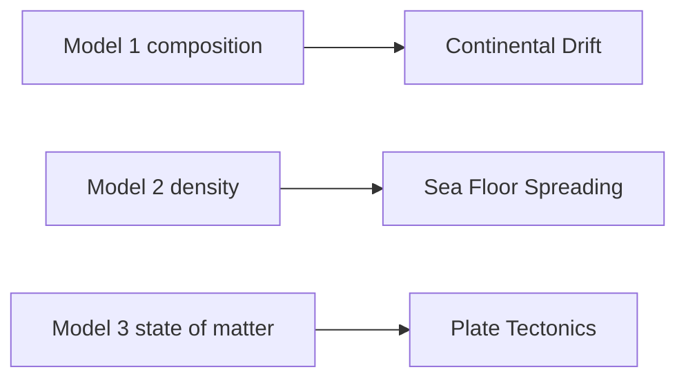
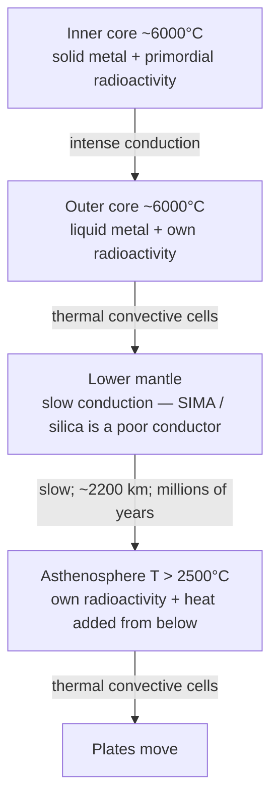
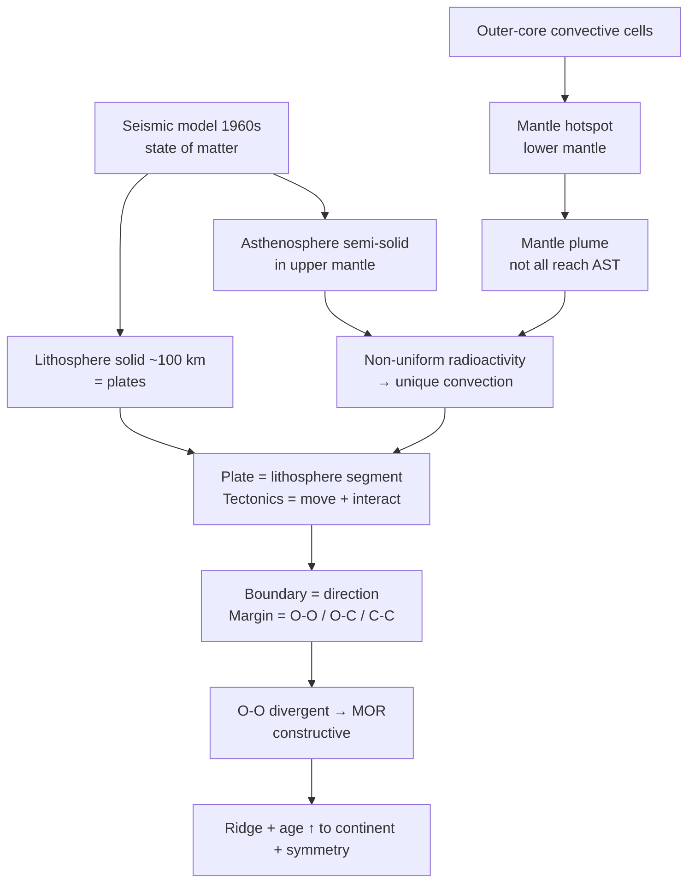
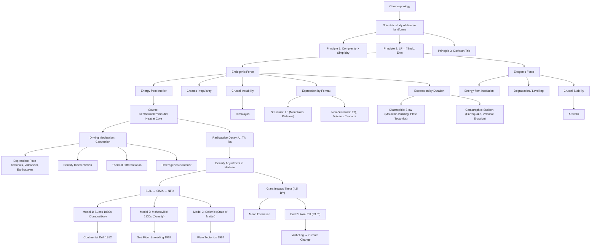

# 02 — Geomorphology (World Physical Geography — Chapter 1)

> **Date of Lecture:** 8 August 2026 (A1) + 9 August 2026 (A2) + 6 September 2026 (A3)
> **Date Added:** 2026-08-08; Lecture A3 added **2026-09-06**
> **Teacher:** **Rizwan Sir** (three Geomorphology lectures: A1–A3)
> **Source:** Vajiram & Ravi — **Rizwan Sir** | class notes (Lecture A1 + A2 + A3) + Audio Transcripts
> **Prelims Weightage:** 2–3 Questions | **Mains Weightage:** GS-1, ~2 Questions (25–30 marks)

---

### Lecture A1 — 8 August 2026 (Rizwan Sir)

## References

| Priority | Source | Usage |
|:---:|:---|:---|
| 1 | **Class Notes** | Primary — conceptual understanding |
| 2 | **NCERT Class 11** — *Fundamentals of Physical Geography* | Topic-wise reading alongside class (not cover-to-cover) |
| 3 | **Atlas** | Locate every feature mentioned (Rocky, Andes, etc.) |
| 4 | **G.C. Leong / Yellow Book** | Supplementary — selective reading only. More important for Climatology & Oceanography. In Geomorphology, refer selectively: Volcanism, Earthquake, Interior of Earth |

---

## Geomorphology Syllabus (9 Topics)

| # | Topic | Status |
|:---:|:---|:---:|
| I | Landform: Definition & Classification | Covered (Lec A1) |
| II | Endogenetic Forces | Covered (Lec A2) |
| III | Interior of the Earth | Covered (Lec A2 Models 1–2 + Lec A3 Model 3 / plates / SFS) |
| IV | Geomagnetism (Magnetic Field of Earth) | Pending |
| V | Exogenetic Forces / Denudation | Pending |
| VI | Landforms Created by Denudation | Pending |
| | — (i) Fluvial Landform → Water | |
| | — (ii) Aeolian Landform → Wind (desert features: sand dunes) | |
| | — (iii) Glacial Landform → Glacier | |
| | — (iv) Karst Landform → Limestone (CaCO₃) | |
| VII | Volcanism | Pending |
| VIII | Earthquakes | Pending |
| IX | Surface Configuration of Earth | Pending |

---

## 1. Geography — Foundational Framework

### 1.1 What is Geography?
- **Geography** = Study of **Earth's Surface**
- The surface consists of two types of features:
  - **Natural Landscape** (Physical features) → Physical Geography
  - **Human Landscape** (Man-made features) → Human Geography

### 1.2 Branches of Geography

<div style="overflow-x:auto;">
<svg xmlns="http://www.w3.org/2000/svg" viewBox="0 0 400 390" role="img" aria-label="Branches of geography: physical geography and human geography" style="display:block;margin:0 auto;width:100%;min-width:340px;max-width:560px;font-family:system-ui,Segoe UI,Arial,sans-serif;">
<rect x="1" y="1" width="398" height="388" rx="12" fill="#f8fafc" stroke="#e2e8f0" />
<rect x="130" y="12" width="140" height="32" rx="8" fill="#e2e8f0" stroke="#94a3b8" />
<text x="200" y="33" text-anchor="middle" font-size="14" font-weight="700" fill="#0f172a">Geography</text>
<path d="M 200 44 L 200 54 M 20 54 L 200 54 M 20 54 L 20 298 M 20 134 L 34 134 M 20 298 L 34 298" fill="none" stroke="#94a3b8" stroke-width="1.5" />
<rect x="34" y="64" width="352" height="140" rx="8" fill="#f0fdfa" stroke="#2dd4bf" />
<text x="48" y="86" font-size="13" font-weight="700" fill="#115e59">Physical Geography <tspan font-size="11.5" font-weight="400" fill="#64748b">(Natural Landscape)</tspan></text>
<rect x="46" y="98" width="328" height="28" rx="6" fill="#ccfbf1" stroke="#5eead4" />
<text x="60" y="116" font-size="12" fill="#334155">Rock → Lithosphere → <tspan font-weight="700" fill="#115e59">GEOMORPHOLOGY</tspan></text>
<rect x="46" y="132" width="328" height="28" rx="6" fill="#ccfbf1" stroke="#5eead4" />
<text x="60" y="150" font-size="12" fill="#334155">Air → Atmosphere → <tspan font-weight="700" fill="#115e59">CLIMATOLOGY</tspan></text>
<rect x="46" y="166" width="328" height="28" rx="6" fill="#ccfbf1" stroke="#5eead4" />
<text x="60" y="184" font-size="12" fill="#334155">Water → Hydrosphere → <tspan font-weight="700" fill="#115e59">OCEANOGRAPHY</tspan></text>
<rect x="34" y="220" width="352" height="156" rx="8" fill="#fffbeb" stroke="#fbbf24" />
<text x="48" y="242" font-size="13" font-weight="700" fill="#92400e">Human Geography <tspan font-size="11.5" font-weight="400" fill="#64748b">(Man-made features)</tspan></text>
<text x="52" y="264" font-size="12" fill="#334155">• Agriculture</text>
<text x="52" y="284" font-size="12" fill="#334155">• Population</text>
<text x="52" y="304" font-size="12" fill="#334155">• Culture, Religion, Language</text>
<text x="52" y="324" font-size="12" fill="#334155">• Regions</text>
<text x="52" y="344" font-size="12" fill="#334155">• Economic Activities</text>
<text x="64" y="362" font-size="12" fill="#64748b">(Primary, Secondary, Tertiary)</text>
</svg>
</div>

<p style="text-align:center;"><em><strong>Figure:</strong> Geography splits into Physical Geography — each sphere giving one branch — and Human Geography.</em></p>

> **Key:** The intersection of Lithosphere + Atmosphere + Hydrosphere = **Biosphere**

### 1.3 World vs Indian Physical Geography
- **World Physical Geography** → Study of lithosphere, atmosphere, hydrosphere of the entire world
- **Indian Physical Geography** → Physiography/Mapping of India (Bay of Bengal, Arabian Sea, Indian Ocean)

---

## 2. Surface Configuration of Earth (Topic IX — Preview)

Three theories that explain the arrangement of continents & ocean basins:

| Theory | Proponent | Year | Key Idea |
|:---|:---|:---:|:---|
| **Continental Drift** | Alfred Wegener | 1912 | Pangaea → Laurasia + Gondwanaland → present continents |
| **Sea Floor Spreading** | Harry Hess | 1962 | Research during WWII (1940s); published 1962. Improvement over Continental Drift |
| **Plate Tectonics** | T. Wilson & J. Morgan | 1967 | Most scientific, comprehensive, accepted theory |

> **Key Statement:** *"Plate Tectonic Theory validates the concept of Continental Drift and Sea Floor Spreading."*
> - Plate Tectonics does NOT reject Wegener — the idea of supercontinents is correct
> - It provides the **scientific explanation** that Wegener's theory lacked
> - Similarly, Hess's Sea Floor Spreading concept is validated by Plate Tectonics

> **UPSC Mains Trend (10 marks):** Questions now combine all 3 theories into one question (e.g., "Plate tectonic validates the concept of continental drift and sea floor spreading — Discuss"). Earlier, each was asked separately for 15 marks.

---

## 3. What is Geomorphology?

### 3.1 Definition
**Geomorphology** = **Scientific study of diverse landforms**

- *Geo* = Earth | *Morpho* = Structure/Form | *Logy* = Study
- It is a **scientific** discipline → based on verifiable, measurable, factual evidence
- Geography evolved from traditional/religious explanations to scientific study after the 16th century

### 3.2 What is a Landform?

> **Definition:** A landform is a **structural feature** that is:
> 1. **Composed of rock**
> 2. **Part of the lithosphere**
> 3. **Natural in origin** (not man-made)

**Examples:** Mountain, plateau, hill, valley, plain, peninsula, gulf, bay, canyon, gorge

### 3.3 Four Dimensions of Landform Study

| Dimension | Focus | Example (Rocky Mountains) |
|:---|:---|:---|
| **Quantification** | Measuring height, area, extent | ~10,000 km long, ~1,000 km wide |
| **Distribution** | Location on the continent | Western margin of North America |
| **Evolution** | How it came into existence | Created by plate collision (convergent boundary) |
| **Processes** | Forces currently operating on it | Snow/glacier, river, wind, desert — all simultaneously |

---

## 4. Surface of Earth — Non-Uniformity

### 4.1 Why is the Surface Non-Uniform?
- **Diversity of Landforms** → No two landforms are identical, even when located in the same region
  - Western Ghats ≠ Eastern Ghats (same Indian Peninsula)
  - Vindhyas ≠ Satpuras (same Central India)
  - Siwalik ≠ Middle Himalayas ≠ Greater Himalayas (same Himalayan system)
  - Dhauladhar ≠ Pir Panjal; Ladakh ≠ Zanskar ≠ Karakoram

### 4.2 Why are Landforms Different?
- **Uniqueness in evolution** → Every landform evolved in its own unique manner
- Each landform is a product of **multiple processes** that do not match with each other
  - Landform A = Processes {A, B, C, D} (4 processes)
  - Landform B = Processes {B, E, F, G, H} (5 processes)
  - Only Process B is common → rest are different → unique identity

### Principle 1: Complexity Principle

> **"Complexity is more common than simplicity in development of landforms."**

- 99% of landforms are created by **more than 2–3 processes**
- Only ~1% may result from a single process
- Geomorphology is like **forensic science** → two landforms are like two individuals with different fingerprints, even if they are twins

---

## 5. Relief & Slope — Fundamental Identities of Landforms

### 5.1 Base Level

> **Base Level** = Reference level for measuring variation of the surface

- For continental landforms → **Sea Level** is the base level
- Defines the **maximum extent of degradation** of a landform (exogenic forces reduce landforms toward this level)

### 5.2 Relief & Slope

> **Relief** and **Slope** are the **two fundamental identifiers** of any landform, and they are **interdependent**.

- **Relief** = The height/variation of a landform (height for mountains, depth for valleys)
- **Slope** = Angle of inclination (θ) with the base level

**Interdependence:** If relief changes → slope changes, and vice versa.
- Example: Landslide breaks off part of a mountain → height (relief) decreases → new slope angle (θ) also changes → both are modified simultaneously

### 5.3 Absolute vs Relative Relief

| Type | Definition | Measured From | Example |
|:---|:---|:---|:---|
| **Absolute Relief** | Height of landform measured from **sea level** | Sea Level | Mt. Everest = 8,848 m (from sea level) |
| **Relative Relief** | Height difference between **any two nearby locations** (irrespective of sea level) | Nearby lowest location | Everest from base camp at 7,000 m = ~1,848 m |

**Key Examples:**
- Western Ghat peak measured from Arabian Sea → **Absolute Relief**
- Same peak measured from Deccan Plateau surface → **Relative Relief**
- Same location can have BOTH absolute and relative relief depending on reference point

### 5.4 Valley Deepening & Relief

> **"The process of valley deepening will increase relative relief, with the assumption that absolute relief has remained constant."**

- River cuts valley deeper: P → P' (valley floor drops)
- Mountain height (absolute relief) remains unchanged when viewed from distance
- But difference between peak and valley floor (relative relief) increases
- If the peak ALSO erodes simultaneously → both absolute and relative relief change (more complex scenario)

---

## 6. Endogenic & Exogenic Forces

### 6.1 Endogenic Force

> **Endogenic Force** = The expression of energy derived from the **interior of the Earth**

| Aspect | Detail |
|:---|:---|
| **Energy Source** | Interior of Earth (Geosphere — mantle, core) |
| **Impact** | Creates **irregularity** on the surface (mountains, plateaus, hills, rifts) |
| **Primary Function** | **Creation** of landforms (macro-scale) |
| **Secondary Function** | Destruction (e.g., earthquake breaking a mountain — smaller scale) |
| **Expressions** | Volcanism, earthquakes, mountain building, tectonic movements |

### 6.2 Crustal Stability

> **"The stability of the crust is defined on the basis of frequency and intensity of endogenic force."**

| Condition | Endo Character | Crust Status | Example |
|:---|:---|:---|:---|
| Intense & Frequent | Strong, regular | **Unstable** (earthquakes, volcanoes common) | Himalayas |
| Weak & Infrequent | Low, rare | **Stable** (maybe 1 earthquake/100 years) | Aravalis |

### 6.3 Exogenic Force

| Aspect | Detail |
|:---|:---|
| **Origin** | **Majority** originate in the **atmosphere** (not all — meteoroids come from cosmosphere) |
| **Energy Source** | **Insolation** (Incoming Solar Radiation) is the major energy source |
| **Primary Function** | **Degradation** of the surface → achieve uniformity → reduction of relief (both absolute & relative) |
| **Secondary Function** | Creation of smaller landforms (valley, flood plain, delta — byproducts of degradation) |
| **Agent forms** | Water (fluvial), Wind (aeolian), Glacier (glacial), Temperature, Atmospheric pressure, Moisture |
| **Also called** | **Levelling forces** (reduce relief toward base level / sea level) |

### 6.4 Latitudinal Variation of Exogenic Forces

> **"Exogenic forces operate throughout the surface of Earth, but there is latitudinal variation in type and intensity of the force."**

- **Tropical Region** → Highest capability to degrade landforms (maximum insolation = maximum exogenic energy)
- **Temperate Region** → Moderate degradation capability
- **Polar Region** → Exo in form of glaciers

> **"Interpretation of climate is essential to estimate the nature of exogenic force."**
> - Desert (arid) climate → Exo = temperature + wind
> - Humid climate → Exo = water/rainfall (fluvial)
> - Polar climate → Exo = glaciers

### 6.5 LF = f(Endo, Exo) — The Fundamental Equation

> **Principle 2: "The evolution of the landform is a product of competition between endogenic and exogenic forces."**

`LF = f(ENDO / EXO)`

- If Endo = Exo (hypothetical balance) → Surface would be flat/uniform
- But surface is NOT uniform → **imbalance** always exists between the two forces
- This imbalance drives landform development
- Different locations have different Endo-Exo combinations → different landforms develop

### 6.6 Case Study: Aravalis vs Himalayas

| Parameter | Aravalis | Himalayas |
|:---|:---|:---|
| **Age** | ~3 billion years old | ~40 million years old |
| **Original Height** | Estimated up to ~11,000 m (higher than Everest!) | Currently still rising |
| **Present Height** | ~400–1,722 m (Guru Shikhar) | Avg. 3,000 m; Everest ~8,848 m |
| **Endo Activity** | No active endogenic force for last 2.5 billion years | Active — Indian plate still colliding with Eurasian plate |
| **Crustal Status** | **Crustal Stability** (long period) | **Crustal Instability** (tectonically active) |
| **Dominant Force** | **Exogenic** (continuous degradation without endo renewal) | **Endogenic** (despite exo, height continues to increase) |
| **Classification** | Relict mountains (remains of original) | Young fold mountains (still rising) |
| **Plate Position** | NOT at plate boundary | AT convergent plate boundary |

> **Key Statements:**
> - *"Aravalis are relict mountains created by dominance of exogenic force during long period of crustal stability."*
> - *"In case of Himalayas, in spite of presence of exogenic forces, the height of mountain continues to increase — this indicates dominance of endogenic force (crustal instability)."*
> - Everest rises by a few centimeters every year

---

## 7. Davisian Trio — Third Principle

> **Principle 3 (W.M. Davis — American Geographer):**
> `LF = f(Structure, Process, Time)`

| Component | Meaning | Explanation |
|:---|:---|:---|
| **Structure** | Rock composition | Igneous vs sedimentary vs metamorphic — different rocks evolve differently |
| **Process** | Endogenic + Exogenic forces | Rainfall, glacier, wind, tectonic uplift, volcanism, etc. |
| **Time** | Duration of the process | How long the process operated (15 million years of glacier vs 10 million years) |

### Why Two Landforms Differ (Consolidated):
1. **Different rock composition** (Structure) → different evolution
2. **Same rock, but different processes** (e.g., rainfall vs glacier) → different evolution
3. **Same rock, same process, but different duration** (Time) → different evolution
4. All three can **simultaneously differ** → making landform development even more complex

> These three principles — **Complexity, Functionality (LF = f(Endo, Exo)), and Davisian Trio** — explain the non-uniformity of Earth's surface. The entire chapter is based on these three ideas.

---

## 8. Classification of Landforms

### 8.1 Classification Basis 1: Size / Order

| Order | Landform | Scale | Examples |
|:---:|:---|:---|:---|
| **1st Order** | Continent / Ocean Basin | Largest | Asia, Africa, Pacific Ocean Basin |
| **2nd Order** | Fold Mountains | Large | Rockies, Andes, Alps, Himalayas |
| **3rd Order** | Plateaus | Medium | Brazilian Plateau, Deccan Plateau |
| **4th+ Order** | Hills, Valleys, etc. | Smaller | Progressively decreasing size |

**Oceanic Orders (studied under Oceanography, NOT Geomorphology):**
- Continental Slope → Mid-Oceanic Ridge (MOR) → Islands → Seamounts → Trenches
- All submarine features = **Ocean Bottom Relief (OBR)** → Part of **Oceanography**

> **Geomorphology** studies what lies **above sea level** (continental landforms)
> **Oceanography** studies what lies **below sea level** (ocean bottom relief)

### 8.2 Classification Basis 2: Origin

| Origin Type | Explanation |
|:---|:---|
| **Formation of Crust** | Crust itself was formed unevenly from day one → landforms inherent since crust formation |
| **Endogenic Forces** | Create **macro landforms** (mountains, plateaus, continental-scale features) |
| **Exogenic Forces** | Create **micro landforms** (valleys, passes, waterfalls, canyons, gorges, flood plains, deltas) |

**Endo vs Exo — Function Summary:**

| | **Primary Function** | **Secondary Function** | **Scale of Landforms** |
|:---|:---|:---|:---|
| **Endogenic** | Create landforms | Destroy (e.g., earthquake breaks mountain) | **Macro** (Himalayas, Rockies) |
| **Exogenic** | Destroy/degrade landforms | Create new features (valley, delta, flood plain) | **Micro** (canyon, gorge, waterfall) |

---

<!-- ═══════════════════════════════════════════════════════════════════════════ -->
<!-- ██  LECTURE A2 — 9 August 2026  ██ -->
<!-- ═══════════════════════════════════════════════════════════════════════════ -->

### Lecture A2 — 9 August 2026 (Rizwan Sir)

> **Date of Lecture:** 9 August 2026 (Lecture A2)
> **Date Added:** 2026-08-09
> **Teacher:** **Rizwan Sir**
> **Source:** Vajiram & Ravi — **Rizwan Sir** | class notes (Lecture A2) + Audio Transcript
> **Topics Covered:** Endogenetic Forces (detailed), Energy Source for Endo, Earth's Evolution & Geological Time Scale, Hadean Eon & Giant Impact, Density Adjustment, Heat Transfer Mechanisms (Convection as driving mechanism), Interior of Earth (Approaches & Models 1–2)

---

## 9. Endogenetic Forces — Detailed Elaboration (Lecture A2)

### 9.1 Definition (Recap & Expansion)

> **Endogenic Force** = Expression of energy derived from the **interior of the Earth**.

Three key dimensions:
1. **Expression** — How the force appears on the crust
2. **Energy** — The driving fuel (geothermal/primordial heat)
3. **Source** — Interior of the Earth (core)

### 9.2 Classification by Format (Expression)

| Type | What It Means | Creates | Examples |
|:---|:---|:---|:---|
| **Structural (LF)** | Directly creates a **measurable relief** / landform | Mountains, plateaus, hills, valleys | Himalayas, Rockies, Andes, Vindhyas, Western Ghats |
| **Non-Structural (Mass)** | Does NOT directly create relief; expressed as tremor, liquid material, or wave | Earthquake, volcanism, tsunami | 2004 Indian Ocean Tsunami, Mt. Vesuvius eruption |

> **Key Definition:** *"Landform is a structural expression of endogenic force."*

- **Volcanic eruption** = Non-structural because the primary expression is hot liquid material (lava/magma), not a relief directly. The lava cools and *then* establishes a relief — that is secondary.

### 9.3 Classification by Duration

| Type | Duration | Character | Examples |
|:---|:---|:---|:---|
| **Diastrophic** | Slow-acting (thousands to millions of years) | Gradual, operates over geological time | Mountain building, continental drift, sea floor spreading, plate tectonics, faulting, rifting |
| **Catastrophic** | Short duration (seconds to minutes) | Sudden, violent | Earthquake, volcanic eruption, tsunami |

> **Key Statement:** *"Majority of the Earth's surface configuration is the product of diastrophism."*

- ~80% of features from Kashmir to Kanyakumari → product of **diastrophic** (slow-acting) endogenic forces
- Himalayas, Northern Plains, Vindhyas, Satpuras, Western Ghats, Eastern Ghats — all diastrophic
- Catastrophic contribution is very limited (e.g., some volcanic islands, tectonic fall lines)

---

## 10. Earth — Factual Profile

### 10.1 Basic Parameters

| Parameter | Value |
|:---|:---|
| **Age of Earth** | **4.6 billion years** (4,600 million years) |
| **Radius** | **6,400 km** |
| **Average Density** | **5.5 g/cm³** |
| **Origin** | From **primordial matter** (cosmic dust nebula) |
| **Temperature at Origin** | **~6,000°C** (estimated from radioactive decay) |

### 10.2 Composition of Entire Earth (Decreasing Proportion)

| Rank | Element | Key Property | Role in Earth's Structure |
|:---:|:---|:---|:---|
| 1 | **Iron (Fe)** | Heavy metal, good conductor of heat | Core composition (NiFe) |
| 2 | **Oxygen (O)** | Lighter element | Silicate minerals |
| 3 | **Silicon (Si)** | **Poor conductor of heat** | SIAL & SIMA (crust & mantle) |
| 4 | **Magnesium (Mg)** | Moderate density | SIMA layer |
| 5 | **Aluminium (Al)** | Lighter metal | SIAL layer (crust) |
| 6 | **Nickel (Ni)** | Heavy metal (~2% of Earth) | Core composition (NiFe) |

> ⚠️ This is composition of **entire Earth**, NOT just the crust.

### 10.3 Radioactive Elements in Earth's Interior

| Element | Character |
|:---|:---|
| **Uranium** | Heavy, unstable, decays → produces heat |
| **Thorium** | Heavy, unstable, decays → produces heat |
| **Radium** | Heavy, unstable, decays → produces heat |

- Radioactive elements are **heavy**, **unstable**, undergo continuous **decay/disintegration** → **generate heat**
- Half-life of radioactive elements helps determine the **age of Earth** (radiometric dating)

### 10.4 Other Gases in Interior

CO₂, N₂O, Hydrogen, Helium, SO₂ — same gases that emerge from volcanic eruptions exist in Earth's interior.

---

## 11. Geological Time Scale (GTS)

> **Geological Time** = The 4.6-billion-year history of Earth.
> **Geological Time Scale (GTS)** = Division of this history into intervals based on key events & evidence.

### 11.1 Hierarchy of Divisions

```
EON (largest) → ERA → PERIOD → EPOCH (smallest)
```

- **Eon** = Longest division (like "hours" on a clock dial)
- **Epoch** = Shortest division (like "seconds")

### 11.2 The Four Eons

| # | Eon | Time Span | Duration | Key Significance |
|:---:|:---|:---|:---|:---|
| 1 | **Hadean** | 4.6 – 4.0 BY ago | 600 million years | Hell-like conditions; no spheres, no rock, no crust, no life. Temperature ~6,000°C. Giant Impact (Theia collision) |
| 2 | **Archean** | 4.0 – 2.5 BY ago | 1,500 million years | First rock formation (solidification of crust); establishment of lithosphere, atmosphere, hydrosphere; **beginning of life** — cyanobacteria (blue-green algae) at end of Archean (~2.5 BY) |
| 3 | **Proterozoic** | 2.5 BY – 541 MY ago | ~2,000 million years | **Early life** (*protero* = primitive + *zoic* = life); simple, aquatic, invertebrate organisms; fossil records; no terrestrial organisms; flora = small climbers/grass, no large trees |
| 4 | **Phanerozoic** | 541 MY ago – Present | ~541 million years | **New/complex life** (*phanero* = new + *zoic* = life); simple → complex transition; repeated **mass extinctions** triggered by **climate change**; invertebrate → vertebrate; aquatic → terrestrial; amphibian → reptile → mammal → apes; establishment of dense forests |

> **Key:** *Proterozoic* = Early/primitive life | *Phanerozoic* = New/complex life
> Whatever complex life (flora & fauna) we see on Earth today belongs to the **Phanerozoic Eon**.

---

## 12. Hadean Eon — Earth's Violent Birth

### 12.1 Formation of Earth from Primordial Matter

1. Before the solar system → a **rotating nebula of cosmic dust** (= **primordial matter**) existed
2. Two **inertial forces of the universe** acted on this nebula:
   - **Centripetal force** (gravity) → pulled material toward the center
   - **Centrifugal force** → pushed material outward
3. ~90% of matter converged at the center → **formation of the Sun**
4. Remaining 8–10% material thrown outward by centrifugal force → arranged in **concentric rings**
5. Each ring contained unequal, irregular segments of primordial matter
6. Segments within each ring collided (unequal velocities) → consolidated → **formation of planets**
7. Density of material **decreases** with increasing distance from the Sun → inner planets (terrestrial) are denser than outer planets (gaseous)

> **Key:** Earth was formed by **consolidation of primordial matter** that got separated from the Sun.

### 12.2 Hadean Conditions (4.6 – 4.0 BY ago)

- Temperature: ~6,000°C (from collision energy + randomly distributed radioactivity near surface)
- State: Semi-solid, blob-like, irregular shape
- No rock, no crust, no atmosphere, no hydrosphere, no life — **hell-like scenario**
- Two reasons for extremely high temperature:
  1. **Collision energy** from consolidation of primordial matter
  2. **Randomly distributed radioactivity** near the surface → producing additional heat

### 12.3 The Giant Impact (Theia Collision) — ~4.5 BY ago

> ~100 million years after Earth's formation, a Mars-sized body called **Theia** collided with Earth.

**Four major outcomes of Giant Impact:**

| # | Outcome | Detail |
|:---:|:---|:---|
| 1 | **Moon formation** | Material ejected from Earth consolidated to form the Moon |
| 2 | **Change in Earth's axial tilt** | Earth's axis of rotation was tilted (currently 23.5°) |
| 3 | **Moon's receding orbit** | The orbit of Moon is not static — distance between Earth and Moon has **increased** over time |
| 4 | **Wobbling of Earth** | Tilt of Earth **fluctuates** over time → influences **climate change** |

### 12.4 Wobbling of Earth

- The tilt (currently 23.5°) is **NOT permanent** — it changes over geological time
- **Current rate:** ~0.5° change per ~50,000 years
- **Past rate:** Faster (force of impact was stronger initially → more frequent fluctuation)
- Wobbling → changes position of Tropics (Cancer & Capricorn) → influences **insolation distribution** → **climate change**
- Placement of Tropic of Cancer & Capricorn is decided by the **tilt of Earth's axis**
- Moon rocks provide evidence of Earth's early formation (common primordial origin)

### Update — 8 September 2026 (Yellow Book Concepts of Geography, Ch 1 — Moon extras; not a new topic)

Same Giant Impact. Book name **Big Splat**; timing **~4.44 billion years** (class **~4.5**). Mean distance **384,000 km**; sidereal orbit **27.32 days**; **tidal locking** → about **59%** of the surface is ever seen from Earth. **Super Moon** at perigee **356,500 km**; **Micro Moon** at apogee **406,700 km**. Full solar-system packet: `Yellow_Books/Concepts_of_Geography/01_Earth_in_the_Universe.md` (cluster **GEO-11**).

### 12.5 Traces of Water Vapour

- During consolidation, different primordial segments brought different gases (some O₂, some H₂)
- H₂ + O₂ combined → traces of **water vapour** formed
- This water vapour could NOT reach the surface (temperature too high) → existed at great height
- As Earth cooled → water vapour descended → eventually contributed to formation of hydrosphere
- **Age of water vapour ≈ Age of Earth** (same origin)

### 12.6 Evolution of the Atmosphere (Degassing)

- Earth's early atmosphere (mostly hydrogen & helium) was largely stripped away by solar winds.
- <span style="color: #e53e3e;">**Degassing (Aug 2026 MCQ):** The primary process that contributed to the evolution of the present atmosphere was **Degassing** from the Earth's interior, releasing water vapour, nitrogen, carbon dioxide, methane, and ammonia. Biological fixation (like photosynthesis) contributed much later to oxygenate it.</span>

---

## 13. Density Adjustment — The Key Hadean Process (4.4 – 4.0 BY ago)

### 13.1 Initial State of Earth's Interior

- After formation, material inside Earth was **randomly distributed** (not layered)
- Iron, oxygen, silicon, aluminium, nickel, radioactive elements — all scattered irregularly
- No systematic layers like SIAL, SIMA, NiFe existed initially

### 13.2 The Process of Density Adjustment

> **Density Adjustment** = Rearrangement of material in Earth's interior, achieved by the action of **centripetal** (gravity) and **centrifugal** forces.

**Mechanism:**
1. Earth searched for its center → centripetal force (gravity) established
2. All **high-density elements** (Iron, Nickel, Radioactive elements) → **shifted toward the center** by gravity
3. All **low-density elements** (Silica, Aluminium) → **pushed toward the surface** by centrifugal force
4. This was possible because the entire interior was in a **semi-solid/flexible state** (not solidified yet)

### 13.3 Results of Density Adjustment

| Result | Detail |
|:---|:---|
| **Core organized** | Made up of **NiFe** (Nickel + Iron); metallic; has **highest concentration of radioactive elements** |
| **Layering established** | Interior configured as **SIAL** (surface) → **SIMA** (intermediate) → **NiFe** (core) |
| **Radioactivity displaced** | Shifted from near surface → to core → **surface temperature rapidly declined** |
| **Rock formation began** | Temperature dropped below ~600°C → sufficient for solidification → **beginning of rock formation** → end of Hadean, start of **Archean Eon** |

### 13.4 Why Earth Cooled Rapidly (Two Reasons)

1. **Re-radiation** — Earth lost heat to outer environment (space)
2. **Displacement of radioactivity** — Radioactive elements shifted from near surface to core → surface heat source removed → rapid cooling

---

## 14. Geothermal Heat — Source of Endogenic Force

### 14.1 Establishing the Source

> **Geothermal heat** (= **Primordial heat**) produced at the **core** is the **source of energy** for endogenic forces.

- Core has concentration of radioactive elements (Uranium, Thorium, Radium) → continuous decay → **generates heat**
- Estimated core temperature: **~6,000°C**
- This heat drives all endogenic expressions (mountain building, volcanism, earthquakes, plate tectonics)

### 14.2 The Source → Mechanism → Expression Chain

```
SOURCE (Geothermal Heat at Core)
    ↓
DRIVING MECHANISM (Heat Transfer from Interior to Surface)
    ↓
EXPRESSION (Mountain building, Volcanism, Earthquakes, Plate Tectonics)
```

- **Source** = Geothermal/Primordial heat at the core
- **Driving Mechanism** = The most efficient heat transfer mechanism from interior to surface
- **Expression** = The surface manifestation of endogenic forces
- Whichever heat transfer mechanism is most efficient → becomes the **driving mechanism** → determines the **expression**

---

## 15. Heat Transfer from Interior to Surface

### 15.1 Three Mechanisms (General Thermodynamics)

| # | Mechanism | How It Works | Effective in Earth? | Why? |
|:---:|:---|:---|:---:|:---|
| 1 | **Radiation** | Transfer through transparent medium | **❌ Not effective** | Earth is **not a transparent object** → radiation cannot pass from core to surface |
| 2 | **Conduction** | Transfer by contact (molecule to molecule) | **❌ Not effective (overall)** | Earth is **not thoroughly metallic**; conduction works at core (metallic) but **declines in outer layers** due to increasing proportion of **silica** (poor conductor) |
| 3 | **Convection** | Transfer by **displacement of material** (liquid/gas) | **✅ Most effective** | Liquid/semi-liquid material in Earth's interior physically moves from one location to another, carrying heat |

### 15.2 Why Radiation Fails

- Radiation requires a **transparent medium**
- Earth is opaque → radiation cannot transfer heat from core to surface
- **Do NOT confuse** with Earth's surface long-wave radiation (terrestrial radiation to atmosphere) — that is a completely different phenomenon

### 15.3 Why Conduction Fails

- Conduction requires **metallic material** (good conductor)
- Earth's core IS metallic (NiFe) → conduction is efficient **at the core only**
- But outer layers (SIMA, SIAL) have increasing proportion of **silica** → poor conductor of heat
- Process of conduction **declines/slows down** in outer layers
- Therefore, conduction is **NOT a direct driving mechanism** for endogenic forces

### 15.4 Convection — The Driving Mechanism

> **Convection** = Heat transfer by **physical displacement of material** from one location to another.

- Requires material in **liquid or gaseous state** (not solid — that's conduction)
- In Earth's interior: semi-liquid/plastic material physically moves, carrying heat from interior to near-surface
- **Convection is the most effective mechanism of heat transfer** in Earth's interior
- **Convective force = Endogenic force** → all expressions of endo (plate tectonics, mountain building, volcanism, earthquakes) can be explained by convection

---

## 16. Conditions Enabling Convection in Earth's Interior

### 16.1 Three Properties of Earth's Interior

| # | Property | Technical Term | Description |
|:---:|:---|:---|:---|
| 1 | Density changes with depth | **Density Differentiation** | Density increases with depth (Surface: 2.7 → Average: 5.5 → Core: ~13) |
| 2 | Temperature changes with depth | **Thermal Differentiation** | Temperature increases with depth (surface → core: ~6,000°C) |
| 3 | Composition varies | **Heterogeneous** | Interior is NOT homogeneous — material composition changes throughout |

### 16.2 Melting Point vs Temperature — The State Logic

> At any location inside Earth, the **state of matter** (solid or liquid) depends on the relationship between **melting point** and **temperature** of the material at that place.

| Condition | Result |
|:---|:---|
| **Melting Point > Temperature** | Material remains **solid** |
| **Temperature > Melting Point** | Material becomes **liquid** |

- This relationship varies at **every depth** because both temperature AND melting point change with depth
- When liquid material exists at a certain depth → convection becomes possible at that depth
- This is why Earth's interior has **both solid and liquid zones** — not uniform throughout

### 16.3 Thermal Convection Currents

- Where liquid material exists in Earth's interior → **thermal convection currents** form
- These currents transport heat from the core toward the surface
- They are the **driving mechanism** for all endogenic forces
- This is an outcome of **density adjustment** — the process that organized Earth's interior

> **Key Statement:** *"The interior of Earth has thermal convection currents which transport heat toward the surface, and they are the driving mechanism for expression of endogenic force. This is an outcome of density adjustment."*

---

## 17. Interior of Earth — Study Approaches

### 17.1 Why Study the Interior?

> *"The study of interior of Earth helps in understanding **endogenic force** and **configuration of the surface**."*

- The surface of Earth is **not an isolated entity** — what happens on the surface depends on what's going on in the interior
- Analogy: *"Face of a person is an expression of what is going on in his head"* — similarly, surface configuration reflects interior processes

### 17.2 Direct Evidence

| Source | How It Works | Depth Limit |
|:---|:---|:---|
| **Rocks** | Study of surface and volcanic rocks | Surface only |
| **Volcanic material** | Lava & magma provide samples from depth | ~40–250 km |
| **Mining** | Diamond & gold mines (esp. South Africa) | ~3–8 km |
| **Drilling projects** | Bore into Earth's interior for study | ~13–14 km |

**Key Drilling Projects:**
- **Kola Superdeep Borehole** (Russia, near Norway) — deepest drilling project to date (~13.7 km). No longer operational.
- **Koyna Superdeep Borehole** (Maharashtra, India — near Koyna River/Shivaji Sagar Dam, tributary of Krishna) — planned continental drilling project

> **Limitation:** Direct evidence covers only the **superficial layer** (max ~250 km via volcanoes vs 6,400 km radius). Man is only ~10% aware of what lies inside Earth.

### 17.3 Indirect Evidence

| # | Source | What It Reveals |
|:---:|:---|:---|
| 1 | **Earthquake waves (Seismic study)** | Behaviour changes at different layers → reveals composition, density, state |
| 2 | **Geomagnetism** | Magnetic field reveals core properties |
| 3 | **Meteorites** | Common primordial origin → composition analogous to Earth's interior (classified as indirect because NOT obtained from Earth's interior) |
| 4 | **Gravity anomaly** | Variation of gravity from one location to another → reveals density variations in interior |

---

## 18. Three Models of Earth's Interior

### 18.1 Model 1 — Edward Suess (1880s) — Based on Composition

| Layer | Composition | Position |
|:---|:---|:---|
| **SIAL** | Silica + Aluminium | Outermost |
| **SIMA** | Silica + Magnesium | Intermediate |
| **NiFe** | Nickel + Iron | Core/Center |

- **Basis:** Composition of material
- **Limitation:** Did NOT quantify thickness of layers
- **Significance:** Became the basis for **Wegener's Continental Drift Theory** (1912)

### 18.2 Model 2 — Mohorovičić (1930s) — Based on Density

| Layer | Density | Depth Range |
|:---|:---|:---|
| **Crust** (= SIAL) | ~2.7 g/cm³ | 0–40 km |
| **Mantle** (= SIMA) | ~5.4 g/cm³ | 40–2,900 km |
| **Core** (= NiFe) | ~13 g/cm³ | 2,900–6,400 km |

- **Basis:** Density (quantified values + thickness)
- **Improvement over Model 1:** Provided numerical values for density AND thickness
- First model got **subsumed/merged** into this one
- **Significance:** Became the basis for **Harry Hess's Sea Floor Spreading** (1962)

### 18.3 Discontinuities

> **Discontinuity** = Boundary between layers of Earth's interior at which there is a **change in behaviour of earthquake waves**.

| Discontinuity | Location | Depth | Between |
|:---|:---|:---|:---|
| <span style="color: #e53e3e;">**Conrad**</span> | <span style="color: #e53e3e;">Upper Crust & Lower Crust</span> | <span style="color: #e53e3e;">~15–20 km</span> | <span style="color: #e53e3e;">Upper Crust ↔ Lower Crust</span> |
| **Mohorovičić (Moho)** | Boundary of Crust & Mantle | ~40 km | Crust ↔ Mantle |
| <span style="color: #e53e3e;">**Repetti**</span> | <span style="color: #e53e3e;">Upper Mantle & Lower Mantle</span> | <span style="color: #e53e3e;">~700 km</span> | <span style="color: #e53e3e;">Upper Mantle ↔ Lower Mantle</span> |
| **Gutenberg** | Boundary of Mantle & Core | ~2,900 km | Mantle ↔ Core |
| <span style="color: #e53e3e;">**Lehmann**</span> | <span style="color: #e53e3e;">Outer Core & Inner Core</span> | <span style="color: #e53e3e;">~5,150 km</span> | <span style="color: #e53e3e;">Outer Core ↔ Inner Core</span> |

### 18.4 Model 3 — Seismic Model (Post-1960) — Based on State of Matter

- **Basis:** State of matter (solid vs liquid) — NOT just composition or density
- Key changes from Model 2:
  - **Core** → divided into **Outer Core** (liquid) and **Inner Core** (solid)
  - **Mantle** → differentiated into **Lithosphere** and **Asthenosphere**
- **Significance:** Became the basis for **Plate Tectonic Theory**
- **Elaborated same chapter:** Lecture A3 — 6 September 2026 (§§19–29 below). Cluster **GEO-09**.

### 18.5 Models ↔ Surface Theories Linkage

| Model | Year | Basis | Surface Theory It Enabled |
|:---|:---|:---|:---|
| Edward Suess | 1880s | Composition | **Continental Drift** (Wegener, 1912) |
| Mohorovičić | 1930s | Density | **Sea Floor Spreading** (Hess, 1962) |
| Seismic Model | 1960s+ | State of Matter | **Plate Tectonics** (Wilson & Morgan, 1967) |

> As understanding of Earth's interior improved → surface configuration theories also improved.

---

### Lecture A3 — 6 September 2026 (Rizwan Sir)

> **Date of Lecture:** 6 September 2026  
> **Date Added:** 2026-09-06  
> **Faculty:** **Rizwan Sir**. Vajiram & Ravi World Physical Geography.  
> **Source:** Class + audio transcript (`Geography L060926`) + 5 handwritten sheets (wedge cross-section, heat path, mid-ocean ridge / R₁–R₃, continental vs oceanic crust, inner-core pressure).  
> **Continues:** Lecture A2 — 9 August 2026, §§18.1–18.5 above. This sitting is **Model 3** (state of matter) and the surface theories it unlocks.  
> **Also relevant for:** Prelims (discontinuities, lithosphere ≠ crust, Conrad, mantle plume); **GS-I** (endogenic force, plate tectonics); class flagged a **2021** mains-style ask on **mantle plume ↔ plate tectonics**.

**How to read class shortcuts:** full form on first use. Glossary at the end. Do not invent a depth the sheet / class did not give.

Class paused after **pressure vs melting point** (why the inner core stays solid). Geomagnetism and the rest of Topic IV are still pending.

**Already in Lecture A2 — do not restudy as a new topic:** Suess SIAL / SIMA / NiFe → Continental Drift; Mohorovičić crust–mantle–core → Sea Floor Spreading (Hess, 1962); Moho ~40 km and Gutenberg 2,900 km as *average* Model-2 numbers. Those rows stay on **GEO-04**. This cluster is **GEO-09**.

---

## 19. Three models, three surface theories (GEO-09-01)

Landform is still **f(endogenic, exogenic)**. Energy for endogenic force = **primordial / radioactive heat** at the core. Mechanism = **convection**. The *picture* of the interior has changed three times; each picture licensed a surface theory.

| Model | When | Basis | Surface theory it enabled |
|:---|:---|:---|:---|
| **1 — Edward Suess** | 1880s | **Composition** — SIAL / SIMA / NiFe | **Continental Drift** (Wegener, 1912) |
| **2 — Andrija Mohorovičić** | 1930s | **Density** — crust / mantle / core | **Sea Floor Spreading** (Harry Hess, 1962) |
| **3 — Seismic model** | **1960s** | **State of matter** (solid / semi-solid / liquid) | **Plate Tectonics** |

Until the **1950s** geologists accepted different *materials* and *densities*, but treated the whole Earth as **thoroughly solid**. Earthquake-wave data broke that. Model 3 has **no single author** — several workers / institutes. Class audio garbled a name list; do not invent one.

**Linkage class keeps repeating:** more we know about the interior, more the *surface* theory changes.



---

## 20. Seismic model — layers by state (GEO-09-01)

| Layer | State | Class placement |
|:---|:---|:---|
| **Lithosphere** | **Solid** | Outermost; *lithos* = rock |
| **Asthenosphere** | **Semi-solid** (flexible / elastic) | Directly under the lithosphere |
| **Lower mantle** | **Solid** | Below ~700 km |
| **Outer core** | **Liquid**, metallic (NiFe) | 2,900–5,150 km |
| **Inner core** | **Solid**, metallic (NiFe) | 5,150–6,400 km |

Composition of the **core is the same** (NiFe). State differs. Recent work: inner core has a **slightly higher** iron share (~**10%**). Class: do not chase the research paper — **liquid outer / solid inner** is the exam line.

---

## 21. Plate and tectonics (GEO-09-02)

The lithosphere is **not continuous**. It is **fragmented**. Each **segment of lithosphere** = a **plate**. Sizes are unequal → **major** and **minor** plates.

Plates **rest on** the asthenosphere. Energy in the asthenosphere (from the interior, plus its own radioactivity — §24) **moves** the plates. When they move they **interact**.

| Term | Class line |
|:---|:---|
| **Plate** | A **segment of lithosphere** |
| **Tectonics** | **Movement and interaction** of plates |
| **Convergent** boundary | Plates move **towards** each other |
| **Divergent** boundary | Plates move **away** from each other |

**Plate types on the surface:** **continental**, **oceanic**, or **continental–oceanic** (a plate can carry both a continent and an ocean floor).

---

## 22. Cross-section: depths and discontinuities (GEO-09-03)

**Radius** used in class = **6,400 km** (surface → centre).

<div style="overflow-x:auto;">
<svg xmlns="http://www.w3.org/2000/svg" viewBox="0 0 640 400" role="img" aria-label="Earth interior wedge. Crust is the green 0 to 40 km rind ending at Moho. Upper mantle is 40 to 700 km. Then lower mantle, outer core and inner core." style="display:block;margin:0 auto;width:100%;min-width:340px;max-width:680px;font-family:system-ui,Segoe UI,Arial,sans-serif;">
<rect x="1" y="1" width="638" height="398" rx="12" fill="#f8fafc" stroke="#e2e8f0"/>
<text x="20" y="26" font-size="13" font-weight="700" fill="#0f172a">Cross-section of Earth's interior (class depths — not to scale)</text>
<text x="20" y="44" font-size="11" fill="#64748b">Crust is its own rind (0–40 km). Upper mantle is the 40–700 km band, not its own colour.</text>
<!-- wedge: centre (360, 368); vertical cut faces the depth rail -->
<path d="M360 68 A300 300 0 0 0 60 368 L360 368 Z" fill="#fef3c7" stroke="#d97706" stroke-width="1"/>
<path d="M360 88 A280 280 0 0 0 80 368 L360 368 Z" fill="#fde68a" stroke="#ca8a04" stroke-width="1"/>
<path d="M360 108 A260 260 0 0 0 100 368 L360 368 Z" fill="#fed7aa" stroke="#ea580c" stroke-width="1"/>
<path d="M360 148 A220 220 0 0 0 140 368 L360 368 Z" fill="#fdba74" stroke="#c2410c" stroke-width="1"/>
<path d="M360 228 A140 140 0 0 0 220 368 L360 368 Z" fill="#fca5a5" stroke="#dc2626" stroke-width="1"/>
<path d="M360 300 A68 68 0 0 0 292 368 L360 368 Z" fill="#fb7185" stroke="#9f1239" stroke-width="1"/>
<!-- crust rind on top so the 0–40 km skin is visible -->
<path d="M360 68 A300 300 0 0 0 60 368 L80 368 A280 280 0 0 1 360 88 Z" fill="#86efac" stroke="#15803d" stroke-width="1"/>
<!-- layer names -->
<text x="72" y="78" font-size="11" font-weight="700" fill="#14532d">Crust · SIAL · 0–40 km</text>
<text x="100" y="104" font-size="11" font-weight="700" fill="#92400e">Lithospheric root · solid SIMA</text>
<text x="100" y="118" font-size="10" fill="#92400e">still lithosphere · already in UM</text>
<text x="110" y="146" font-size="11" font-weight="700" fill="#9a3412">Asthenosphere · semi-solid</text>
<text x="110" y="160" font-size="10" fill="#9a3412">entirely inside upper mantle</text>
<text x="148" y="210" font-size="11" font-weight="700" fill="#7c2d12">Lower mantle · solid SIMA</text>
<text x="198" y="292" font-size="11" font-weight="700" fill="#7f1d1d">Outer core · liquid NiFe</text>
<text x="288" y="348" font-size="10" font-weight="700" fill="#4c0519">Inner core</text>
<text x="288" y="362" font-size="10" font-weight="700" fill="#4c0519">solid NiFe</text>
<!-- crust brace 0–40; upper-mantle brace 40–700 -->
<line x1="366" y1="68" x2="366" y2="88" stroke="#15803d" stroke-width="3"/>
<line x1="360" y1="68" x2="366" y2="68" stroke="#15803d" stroke-width="2"/>
<line x1="360" y1="88" x2="366" y2="88" stroke="#15803d" stroke-width="2"/>
<line x1="366" y1="88" x2="366" y2="148" stroke="#0f766e" stroke-width="3"/>
<line x1="360" y1="148" x2="366" y2="148" stroke="#0f766e" stroke-width="2"/>
<!-- depth rail -->
<line x1="376" y1="68" x2="376" y2="368" stroke="#94a3b8" stroke-width="1.5"/>
<circle cx="376" cy="68" r="3.5" fill="#d97706"/>
<circle cx="376" cy="88" r="3.5" fill="#0f766e"/>
<circle cx="376" cy="108" r="3.5" fill="#ea580c"/>
<circle cx="376" cy="148" r="3.5" fill="#0f766e"/>
<circle cx="376" cy="228" r="3.5" fill="#dc2626"/>
<circle cx="376" cy="300" r="3.5" fill="#9f1239"/>
<circle cx="376" cy="368" r="3.5" fill="#0f172a"/>
<text x="392" y="58" font-size="12" font-weight="700" fill="#14532d">0 km · surface · CRUST starts</text>
<text x="392" y="74" font-size="11" font-weight="700" fill="#15803d">CRUST · 0–40 km · SIAL</text>
<text x="392" y="90" font-size="12" font-weight="700" fill="#0f766e">~40 km · Moho · crust ends · UM starts</text>
<text x="392" y="104" font-size="10.5" fill="#0f766e">crust ↔ mantle · still inside lithosphere</text>
<text x="392" y="118" font-size="11" fill="#0f172a">~100 km · lithosphere ends</text>
<text x="392" y="132" font-size="12" font-weight="700" fill="#0f766e">UPPER MANTLE · 40–700 km</text>
<text x="392" y="152" font-size="12" font-weight="700" fill="#0f172a">700 km · Repetti · UM ends</text>
<text x="392" y="166" font-size="10.5" fill="#64748b">upper ↔ lower mantle · astheno ↔ LM</text>
<text x="392" y="224" font-size="12" font-weight="700" fill="#0f172a">2,900 km · Gutenberg</text>
<text x="392" y="240" font-size="11" fill="#64748b">mantle ↔ core · solid → liquid</text>
<text x="392" y="296" font-size="12" font-weight="700" fill="#0f172a">5,150 km · Lehmann</text>
<text x="392" y="312" font-size="11" fill="#64748b">outer ↔ inner core · liquid → solid</text>
<text x="392" y="372" font-size="12" font-weight="700" fill="#0f172a">6,400 km · centre</text>
</svg>
</div>

**Discontinuity** = a depth where the **behaviour of earthquake waves changes** because the material **abruptly** changes state / density. Travel **20–40 km** past the line and the material is a different thing.

| Depth (class) | What sits there |
|:---|:---|
| **~40 km** (average) | **Crust** ends. **Mohorovičić (Moho)** = crust ↔ mantle. Crust can be **~20 km** or **70–80 km**; **40** is the average |
| **~100 km** | Average thickness of the **lithosphere** (solid from the surface down) |
| **~400–500 km** | Asthenosphere is **established**; books that write 400 / 500 mean the **mid-point** of the semi-solid layer |
| **~700 km** | **Repetti** discontinuity. Upper mantle ↔ lower mantle. Also: **asthenosphere ↔ lower mantle**. Above 700 = semi-solid; below 700 = solid. At many places the asthenosphere **reaches 700 km** |
| **2,900 km** | **Gutenberg** — mantle ↔ core (solid → liquid) |
| **5,150 km** | **Lehmann** (class spelling **Lehman**) — outer core ↔ inner core (liquid → solid) |
| **6,400 km** | Centre |

**Mantle in Model 2:** 40–2,900 km, **SIMA**. Split today: **upper mantle 40–700** / **lower mantle 700–2,900** (both SIMA; lower mantle **solid**).

**Where is the upper mantle on the wedge?** It is **not** a sixth colour. It is the **teal band on the rail: Moho (~40 km) → Repetti (700 km)**. That band is **two states stacked**: the **solid lithospheric root** (40–100 km) plus the **whole asthenosphere** (semi-solid, to 700 km). Class line: asthenosphere is **entirely within** the upper mantle; lithosphere is only **partially embedded** in it (the crust sits above Moho).

### Trap: Moho is *not* lithosphere ↔ asthenosphere

- **Moho** = **crust ↔ mantle**, at ~**40 km**, **inside** the lithosphere (lithosphere goes to ~100 km).
- Lithosphere ↔ asthenosphere is a **zone of transition**, not Moho.

---

## 23. Five placement lines (GEO-09-04)

Class dictated these. Keep the wording.

1. **Crust is the outermost layer of the lithosphere.**
2. **Lithosphere is partially embedded in the upper mantle** (lithosphere starts at the surface; upper mantle starts at ~40 km).
3. **Composition of the lithosphere varies with depth** — more **SIAL** near the surface, more **SIMA** as you go in.
4. **There exists a zone of transition** between lithosphere and asthenosphere (drill: solid at 10 / 20 / 100 km; looser by ~200; semi-solid by ~300–350 / 400–500 km).
5. **Asthenosphere is a semi-solid layer entirely within the upper mantle** (upper mantle = 40–700 km).

Lithosphere = **identify the rock**, whether continent or ocean floor. Continent **and** ocean floor are both lithosphere.

---

## 24. Heat path and radioactivity (GEO-09-05)



| Step | Mechanism | Why |
|:---|:---|:---|
| Inner core → outer core | **Intense conduction** | Solid **and** metallic |
| Outer core → lower-mantle basement | **Thermal convective cells** (class: millions of them). Outer core is **not at rest** | Liquid metal |
| Lower mantle (700→2,900 km) | **Slow conduction** | **Not thoroughly metallic** — silica is a poor conductor. Distance ~**2,200 km**. Heat can take **millions of years** |
| Asthenosphere | **Convection** (many cells) | T **> 2,500°C** (class also **2,800 / 3,000°C** recorded) **exceeds melting point** → semi-solid |

**Thermal equilibrium (class phrase):** outer core and inner core look like the **same ~6,000°C**. Outer core **generates** heat (it also has radioactivity), **acquires** heat from the inner core, and **transfers** heat upward. If transfer stopped, outer-core T would climb **above** 6,000. The balance is **primordial-heat distribution + intense conduction + convection**. It is a *process* of keeping temperatures together — **not** a perfectly frozen uniform T (thermodynamics: perfect uniformity would *stop* transfer).

**Do not write outer core = 4,000°C.** Class killed that guess: heat does not *stay* there, but radioactivity puts T back near 6,000.

### Why the asthenosphere is hot enough to be semi-solid

Slow conduction from the lower mantle **cannot** explain T > 2,500°C — if it could, the lower mantle itself would not still be solid. The asthenosphere has **its own source**.

**Density adjustment** (Hadean, Lecture A2) did **not** move radioactivity uniformly:

| Share (class) | Where it sat |
|:---|:---|
| **~70%** | **Core** — highest concentration |
| Part of the remaining **~30%** | Stuck between **100–700 km** → today’s asthenosphere. **Second-highest** concentration |
| **~4–5%** | Still near the **surface** — uranium / thorium mining |

Semi-solid asthenosphere = **concentration of radioactive elements** (T > melting point), **not** “heat piped up from the core alone.”

Radioactivity inside the asthenosphere is **not uniform** → convection cells differ in **size and intensity** → plates are **not** the same size, do not move at the same speed, and every boundary is **unique**.

Class examples (illustrative, not a table to memorise): one plate **5 cm/year**, another **10 cm/year**; a boundary with **2 earthquakes / year** vs **10 / year** after a plume adds energy.

**Identity of a plate** = set by **thermal convection in the asthenosphere**. **Type of boundary** and the **expression of endogenic force** are also functions of that convection.

---

## 25. Mantle hotspot and mantle plume (GEO-09-06)

Class: **2021** question — explain plate tectonics **with** the mantle plume.

| Term | Class definition |
|:---|:---|
| **Mantle hotspot** | A **region in the lower mantle** with **accumulation of heat** and a rise in temperature, **caused by convection of the outer core**. Hundreds of convective hits on the **same** basement spot (class: think thousands of years) |
| **Mantle plume** | A **thermal convective current rising from a mantle hotspot**. It **adds energy to the asthenosphere** and has an **indirect** influence on **plate movement** and the **expression of endogenic force** |

Hotspot material can exceed melting point → low-density liquid **rises**, melting a path (no ready-made pipe) → some plumes **reach the asthenosphere**; many **exhaust in between**. Not every asthenosphere cell is plume-fed. Plumes are **not permanent** — when the feeding convection dies, the plume **withdraws**, plate speed falls, earthquakes / volcanism quieten. A **new** hotspot can wake a different plate.

That is why a **minor** plate (class: **Philippines, Java** / south-eastern plates) can still be **very active** — convection under it is plume-connected.

**Heat transfer from interior to surface is complex:** **conduction + convection with varying intensity**. **Convection is the most effective** mechanism — and the one that **moves plates**.

---

## 26. Boundary ≠ margin (GEO-09-07)

Same *place* on the map can be named two ways.

| Word | Asked by | Types |
|:---|:---|:---|
| **Boundary** | **Direction** of movement | **Convergent** or **divergent** |
| **Margin** | **Location** of the junction | **Ocean–ocean (O–O)**, **ocean–continent (O–C)**, **continent–continent (C–C)** |

**Six combinations** (3 margins × 2 directions). You **cannot** read convergent vs divergent from a static sketch — you need the **direction** arrows.

---

## 27. Sea-floor spreading and constructive boundaries (GEO-09-08)

**Ocean–ocean divergent:** convection under the two plates pulls them **apart** → ocean floor **opens** → asthenosphere material (**magma / lava**) rises and fills the gap → a mountain-like ridge = **mid-oceanic ridge**.

Class sequence (sheet R₁ → R₂ → R₃):

1. Ridge **R₁** forms (class: say **1 million years** for that pulse).
2. Divergence continues; **R₁ splits and is dragged both ways**; new central ridge **R₂**.
3. Same again → **R₃** at the centre. Ocean-floor **area expands**. Adjoining continents **move apart**. Class line: **sea-floor spreading resulting in continental drift**, **initiated by a divergent boundary**.

Even a **continent–continent divergent** first **rifts**, deepens, becomes a **sea**, then continues as sea-floor spreading. So the **major site for addition of crust** is the **ocean floor**, not the continent.

| Class line | |
|:---|:---|
| Major site of **new crust** | **Ocean floor** |
| Process | **Sea-floor spreading**, supported by a **divergent** boundary |
| Therefore divergent boundaries are | **Constructive** plate boundaries |

**Three evidences** (class list — stop here):

1. **Mid-oceanic ridge**
2. **Age of the rock** — **increases** from the ridge **towards the continent** (newest at the live ridge; R₁ is older and has been carried outward)
3. **Symmetry of the rock** — the **same** rock at **equal distance** on both sides of the central ridge

---

## 28. Continental crust vs oceanic crust (GEO-09-09)

**Continental crust** = part of the crust **above sea level**. **Oceanic crust** = crust of the **ocean floor** (below sea level). Both are still the **outer part of the lithosphere**.

<div style="overflow-x:auto;">
<svg xmlns="http://www.w3.org/2000/svg" viewBox="0 0 640 340" role="img" aria-label="Continental crust stands above sea level as a thick granite block with a deep Moho; oceanic crust is a thin basalt slab under the ocean with a shallow Moho; Conrad is the inclined join between them" style="display:block;margin:0 auto;width:100%;min-width:340px;max-width:680px;font-family:system-ui,Segoe UI,Arial,sans-serif;">
<rect x="1" y="1" width="638" height="338" rx="12" fill="#f8fafc" stroke="#e2e8f0"/>
<text x="20" y="24" font-size="13" font-weight="700" fill="#0f172a">Continental crust vs oceanic crust (class — not to scale)</text>
<text x="20" y="40" font-size="11" fill="#64748b">Moho deeper under continents · Conrad = granite ↔ basalt, not crust ↔ mantle</text>
<!-- upper mantle -->
<rect x="24" y="196" width="592" height="120" rx="6" fill="#fed7aa"/>
<text x="40" y="300" font-size="11" font-weight="700" fill="#9a3412">Upper mantle · SIMA</text>
<!-- sea level -->
<line x1="24" y1="92" x2="616" y2="92" stroke="#0284c7" stroke-width="1.25" stroke-dasharray="5 3"/>
<text x="548" y="86" font-size="10" fill="#0369a1">sea level</text>
<!-- continent: land above SL + thick root -->
<path d="M36 52 L250 52 L250 92 L270 252 L36 252 Z" fill="#86efac" stroke="#15803d" stroke-width="1.6"/>
<text x="70" y="74" font-size="12" font-weight="700" fill="#14532d">Continental crust</text>
<text x="70" y="130" font-size="11" fill="#166534">granite · SIAL</text>
<text x="70" y="148" font-size="11" fill="#166534">density ~2.7</text>
<text x="70" y="166" font-size="11" fill="#166534">60–70 km thick</text>
<!-- ocean water -->
<rect x="250" y="92" width="366" height="28" fill="#7dd3fc"/>
<text x="400" y="111" font-size="11" font-weight="600" fill="#0c4a6e">ocean</text>
<!-- oceanic crust -->
<path d="M250 120 L616 120 L616 196 L270 196 Z" fill="#94a3b8" stroke="#334155" stroke-width="1.6"/>
<text x="360" y="150" font-size="12" font-weight="700" fill="#0f172a">Oceanic crust</text>
<text x="360" y="168" font-size="11" fill="#1e293b">basalt · SIMA · density ~3 · 15–20 km</text>
<!-- Conrad: inclined granite–basalt join -->
<line x1="250" y1="52" x2="270" y2="196" stroke="#7c3aed" stroke-width="2.4"/>
<text x="278" y="214" font-size="11" font-weight="700" fill="#5b21b6">Conrad D. · inclined · C crust ↔ O crust</text>
<!-- Moho -->
<line x1="36" y1="252" x2="270" y2="252" stroke="#b45309" stroke-width="2.6"/>
<text x="44" y="268" font-size="11" font-weight="700" fill="#92400e">Moho (deep)</text>
<line x1="270" y1="196" x2="616" y2="196" stroke="#b45309" stroke-width="2.6"/>
<text x="500" y="214" font-size="11" font-weight="700" fill="#92400e">Moho (shallow)</text>
</svg>
</div>

| | **Continental crust** | **Oceanic crust** |
|:---|:---|:---|
| **Density** (class) | **~2.7** | **~3** |
| Rock | Lighter → **granite** (**SIAL**) | Denser → **basalt** (**SIMA**) |
| Thickness (class) | **60–70 km** | **15–20 km** |

**NCERT trap (class):** NCERT has **reversed** granite / basalt density. **Basalt is always denser than granite.** Oceanic **>** continental density.

They **balance at different depths** (isostasy idea, class wording: lighter pile needs more thickness; denser pile needs less). So **Moho is not at equal depth everywhere** — **deeper under continents, shallower under oceans**.

**Conrad discontinuity (today’s class):** an **inclined** boundary between **continental crust and oceanic crust** (granite ↔ basalt). Purpose is **not** crust ↔ mantle (that is Moho).

Lecture A2’s discontinuity table listed Conrad as **upper crust ↔ lower crust ~15–20 km**. **Today’s dictated line is continental ↔ oceanic.** Keep today’s wording for this cluster; do not silently overwrite A2.

**Why the ocean floor is basaltic:** oceanic crust is **cooled upwelled asthenosphere** (sea-floor spreading). Asthenosphere sits in the **upper mantle** → **SIMA / basalt**.

---

## 29. Pressure, density, temperature — why the inner core is solid (GEO-09-10)

**P, density and T** all **increase with depth**, and the increase is **non-uniform**.

**Pressure** = **weight exerted by the overlying material**.

Class frame: we study temperature / pressure of the **atmosphere** as an **open system** (boundary permeable; energy and matter can be added / exchanged). The **interior of the Earth is a closed system**. That is why both T and P inside behave as they do.

| | **Outer core** | **Inner core** |
|:---|:---|:---|
| State | **Liquid** | **Solid** |
| Composition | **NiFe** | **NiFe** |
| Temperature (class) | **~6,000°C** | **~6,000°C** |
| Melting point vs 6,000 | **MP < 6,000** | **MP > 6,000** |

**Pressure is the major reason the two cores differ in state** at the same temperature. The inner core is at the **highest pressure**, **compressed from all directions**, which **prevents a change of state** despite the high temperature.

---

## Knowledge Graph — Lecture A3



---

## Abbreviations used in Lecture A3

| Short | Full form |
|:---|:---|
| SIAL | Silica + Aluminium |
| SIMA | Silica + Magnesium |
| NiFe | Nickel + Iron |
| Moho | Mohorovičić discontinuity |
| O–O / O–C / C–C | Ocean–ocean / ocean–continent / continent–continent |
| SFS | Sea Floor Spreading |
| MOR | Mid-oceanic ridge |
| NCERT | National Council of Educational Research and Training |
| PYQ | Previous Year Question |

---

## Knowledge Graph — Key Conceptual Links (Updated with Lecture A2)



---

## UPSC Quick Recall Points

1. **Geography** = Study of Earth's Surface (Physical + Human)
2. **Physical Geography** = 3 branches: Geomorphology, Climatology, Oceanography
3. **Geomorphology** = Scientific study of diverse landforms
4. **Landform** = Structural feature, composed of rock, part of lithosphere, natural in origin
5. **4 study dimensions**: Quantification, Distribution, Evolution, Processes
6. **Base Level** = Sea Level = reference for measuring surface variation
7. **Relief & Slope** = 2 fundamental identifiers of landforms; they are **interdependent**
8. **Absolute Relief** = measured from sea level | **Relative Relief** = between two nearby locations
9. **Valley deepening increases relative relief** (assuming absolute relief constant)
10. **Endogenic Force** = energy from Earth's interior → creates irregularity → crustal instability
11. **Exogenic Force** = energy from insolation → degradation → levelling → crustal stability
12. **Crustal Stability** defined by frequency & intensity of endogenic force
13. **Exogenic forces** = highest degradation capability in **tropical regions** (max insolation)
14. **Climate interpretation** essential to estimate nature of exogenic force
15. **LF = f(Endo/Exo)** — landform = product of competition between two forces
16. **Aravalis** = 3 billion years old, crustal stability, exo-dominated, relict mountains (~11,000 m → ~1,722 m)
17. **Himalayas** = 40 million years old, crustal instability, endo-dominated, still rising
18. **Davisian Trio** (W.M. Davis) → LF = f(Structure, Process, Time)
19. **Classification**: By Size (1st/2nd/3rd order) and By Origin (Crust formation / Endo / Exo)
20. **Endo** → macro landforms | **Exo** → micro landforms
21. **Continental Drift** (Wegener, 1912) → **Sea Floor Spreading** (Hess, 1962) → **Plate Tectonics** (Wilson & Morgan, 1967)
22. **OBR** (Ocean Bottom Relief) → studied under Oceanography, NOT Geomorphology
23. **Structural expression** = creates relief (mountains) | **Non-structural** = earthquake, volcano, tsunami
24. **Diastrophic** = slow-acting (millions of years) | **Catastrophic** = sudden (seconds to minutes)
25. **~80% of Earth's surface** = product of diastrophism
26. **Earth's composition** (decreasing): Iron → Oxygen → Silicon → Magnesium → Aluminium → Nickel
27. **Radioactive elements**: Uranium, Thorium, Radium → decay → generate heat
28. **4 Eons**: Hadean (4.6–4.0 BY) → Archean (4.0–2.5 BY) → Proterozoic (2.5 BY–541 MY) → Phanerozoic (541 MY–Present)
29. **Archean**: First rock, 3 spheres established, life began (cyanobacteria/blue-green algae)
30. **Proterozoic**: Early/primitive life, aquatic, invertebrate, simple flora
31. **Phanerozoic**: Complex life, mass extinctions, invertebrate → vertebrate, aquatic → terrestrial
32. **Giant Impact (Theia, ~4.5 BY)**: Moon formed, Earth tilted, wobbling → climate change
33. **Wobbling**: Tilt fluctuates (~0.5° per 50,000 years currently) → affects Tropics placement → climate change
34. **Density Adjustment**: High-density → center (NiFe core), Low-density → surface (SIAL) — by centripetal & centrifugal forces
35. **Geothermal/Primordial Heat** at core = source of energy for endogenic force
36. **Heat Transfer**: Radiation ❌ (not transparent) | Conduction ❌ (not fully metallic) | **Convection ✅** (most effective)
37. **Convection** = heat transfer by displacement of liquid/gas material → driving mechanism for endo
38. **Density Differentiation**: Density increases with depth (2.7 → 5.5 → 13)
39. **Thermal Differentiation**: Temperature increases with depth
40. **Melting Point > Temp** → solid | **Temp > Melting Point** → liquid (determines state at each depth)
41. **Direct evidence**: Rocks, volcanic material, mining, drilling (Kola Superdeep ~13.7 km; Koyna planned — Maharashtra)
42. **Indirect evidence**: Earthquake waves, geomagnetism, meteorites (common primordial origin), gravity anomaly
43. **Model 1 (Suess, 1880s)**: SIAL/SIMA/NiFe by composition → basis for Continental Drift
44. **Model 2 (Mohorovičić, 1930s)**: Crust/Mantle/Core by density (2.7/5.4/13; 0–40/40–2900/2900–6400 km) → basis for Sea Floor Spreading
45. **Moho Discontinuity**: Crust–Mantle boundary (~40 km) | **Gutenberg Discontinuity**: Mantle–Core boundary (~2,900 km)
46. **Model 3 (Seismic, 1960s+)**: State of matter → Outer/Inner Core, Lithosphere/Asthenosphere → basis for Plate Tectonics
47. **Man is only ~10% aware** of what lies inside Earth (limited by temperature & pressure at depth)

---

<!-- 2026-08-08: Created from Vajiram Lecture A1 (Geomorphology intro). Covers Topics I & partial IX of syllabus. 6 handwritten pages + full audio transcript integrated. -->
<!-- 2026-08-09: Lecture A2 integrated. Topics II (Endogenetic Forces) & III (Interior of Earth — Models 1 & 2) added. 7 handwritten pages + full audio transcript processed. Seismic Model (Model 3) to be elaborated in next class. -->
<!-- 2026-09-06: Faculty correction — Geomorphology A1 (8 Aug), A2 (9 Aug), A3 (6 Sep) are Rizwan Sir, not Shiv Arpit. -->
<!-- 2026-09-06: Lecture A3 — Seismic Model, heat path, mantle plume, SFS, crust types. Merged into this file (same Geomorphology chapter). Cluster GEO-09. -->
