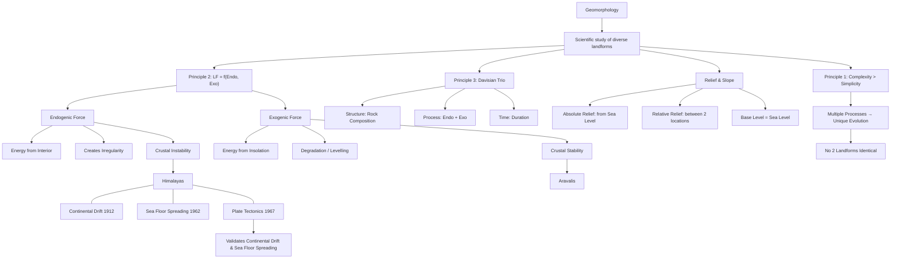

# 02 — Geomorphology (World Physical Geography — Chapter 1)

> **Source:** Vajiram & Ravi class notes (Lecture A1) + Audio Transcript
> **Date added:** 2026-08-08
> **Prelims Weightage:** 2–3 Questions | **Mains Weightage:** GS-1, ~2 Questions (25–30 marks)

---

## 📚 References

| Priority | Source | Usage |
|:---:|:---|:---|
| 1 | **Class Notes** | Primary — conceptual understanding |
| 2 | **NCERT Class 11** — *Fundamentals of Physical Geography* | Topic-wise reading alongside class (not cover-to-cover) |
| 3 | **Atlas** | Locate every feature mentioned (Rocky, Andes, etc.) |
| 4 | **G.C. Leong / Yellow Book** | Supplementary — selective reading only. More important for Climatology & Oceanography. In Geomorphology, refer selectively: Volcanism, Earthquake, Interior of Earth |

---

## 📋 Geomorphology Syllabus (9 Topics)

| # | Topic | Status |
|:---:|:---|:---:|
| I | Landform: Definition & Classification | ✅ Covered (Lec A1) |
| II | Endogenetic Forces | 🔜 Next |
| III | Interior of the Earth | 🔜 |
| IV | Geomagnetism (Magnetic Field of Earth) | 🔜 |
| V | Exogenetic Forces / Denudation | 🔜 |
| VI | Landforms Created by Denudation | 🔜 |
| | — (i) Fluvial Landform → Water | |
| | — (ii) Aeolian Landform → Wind (desert features: sand dunes) | |
| | — (iii) Glacial Landform → Glacier | |
| | — (iv) Karst Landform → Limestone (CaCO₃) | |
| VII | Volcanism | 🔜 |
| VIII | Earthquakes | 🔜 |
| IX | Surface Configuration of Earth | 🔜 |

---

## 1. Geography — Foundational Framework

### 1.1 What is Geography?
- **Geography** = Study of **Earth's Surface**
- The surface consists of two types of features:
  - **Natural Landscape** (Physical features) → Physical Geography
  - **Human Landscape** (Man-made features) → Human Geography

### 1.2 Branches of Geography

```
Geography
├── Physical Geography (Natural Landscape)
│   ├── Rock → Lithosphere → GEOMORPHOLOGY
│   ├── Air → Atmosphere → CLIMATOLOGY
│   └── Water → Hydrosphere → OCEANOGRAPHY
│
└── Human Geography (Man-made features)
    ├── Agriculture
    ├── Population
    ├── Culture, Religion, Language
    ├── Regions
    └── Economic Activities (Primary, Secondary, Tertiary)
```

> **Key:** The intersection of Lithosphere + Atmosphere + Hydrosphere = **Biosphere**

### 1.3 World vs Indian Physical Geography
- **World Physical Geography** → Study of lithosphere, atmosphere, hydrosphere of the entire world
- **Indian Physical Geography** → Physiography/Mapping of India (Bay of Bengal, Arabian Sea, Indian Ocean)

---

## 2. Surface Configuration of Earth (Topic IX — Preview)

Three theories that explain the arrangement of continents & ocean basins:

| Theory | Proponent | Year | Key Idea |
|:---|:---|:---:|:---|
| **Continental Drift** | Alfred Wegener | 1912 | Pangaea → Laurasia + Gondwanaland → present continents |
| **Sea Floor Spreading** | Harry Hess | 1962 | Research during WWII (1940s); published 1962. Improvement over Continental Drift |
| **Plate Tectonics** | T. Wilson & J. Morgan | 1967 | Most scientific, comprehensive, accepted theory |

> **⭐ Key Statement:** *"Plate Tectonic Theory validates the concept of Continental Drift and Sea Floor Spreading."*
> - Plate Tectonics does NOT reject Wegener — the idea of supercontinents is correct
> - It provides the **scientific explanation** that Wegener's theory lacked
> - Similarly, Hess's Sea Floor Spreading concept is validated by Plate Tectonics

> **UPSC Mains Trend (10 marks):** Questions now combine all 3 theories into one question (e.g., "Plate tectonic validates the concept of continental drift and sea floor spreading — Discuss"). Earlier, each was asked separately for 15 marks.

---

## 3. What is Geomorphology?

### 3.1 Definition
**Geomorphology** = **Scientific study of diverse landforms**

- *Geo* = Earth | *Morpho* = Structure/Form | *Logy* = Study
- It is a **scientific** discipline → based on verifiable, measurable, factual evidence
- Geography evolved from traditional/religious explanations to scientific study after the 16th century

### 3.2 What is a Landform?

> **Definition:** A landform is a **structural feature** that is:
> 1. **Composed of rock**
> 2. **Part of the lithosphere**
> 3. **Natural in origin** (not man-made)

**Examples:** Mountain, plateau, hill, valley, plain, peninsula, gulf, bay, canyon, gorge

### 3.3 Four Dimensions of Landform Study

| Dimension | Focus | Example (Rocky Mountains) |
|:---|:---|:---|
| **Quantification** | Measuring height, area, extent | ~10,000 km long, ~1,000 km wide |
| **Distribution** | Location on the continent | Western margin of North America |
| **Evolution** | How it came into existence | Created by plate collision (convergent boundary) |
| **Processes** | Forces currently operating on it | Snow/glacier, river, wind, desert — all simultaneously |

---

## 4. Surface of Earth — Non-Uniformity

### 4.1 Why is the Surface Non-Uniform?
- **Diversity of Landforms** → No two landforms are identical, even when located in the same region
  - Western Ghats ≠ Eastern Ghats (same Indian Peninsula)
  - Vindhyas ≠ Satpuras (same Central India)
  - Siwalik ≠ Middle Himalayas ≠ Greater Himalayas (same Himalayan system)
  - Dhauladhar ≠ Pir Panjal; Ladakh ≠ Zanskar ≠ Karakoram

### 4.2 Why are Landforms Different?
- **Uniqueness in evolution** → Every landform evolved in its own unique manner
- Each landform is a product of **multiple processes** that do not match with each other
  - Landform A = Processes {A, B, C, D} (4 processes)
  - Landform B = Processes {B, E, F, G, H} (5 processes)
  - Only Process B is common → rest are different → unique identity

### ⭐ Principle 1: Complexity Principle

> **"Complexity is more common than simplicity in development of landforms."**

- 99% of landforms are created by **more than 2–3 processes**
- Only ~1% may result from a single process
- Geomorphology is like **forensic science** → two landforms are like two individuals with different fingerprints, even if they are twins

---

## 5. Relief & Slope — Fundamental Identities of Landforms

### 5.1 Base Level

> **Base Level** = Reference level for measuring variation of the surface

- For continental landforms → **Sea Level** is the base level
- Defines the **maximum extent of degradation** of a landform (exogenic forces reduce landforms toward this level)

### 5.2 Relief & Slope

> **Relief** and **Slope** are the **two fundamental identifiers** of any landform, and they are **interdependent**.

- **Relief** = The height/variation of a landform (height for mountains, depth for valleys)
- **Slope** = Angle of inclination (θ) with the base level

**Interdependence:** If relief changes → slope changes, and vice versa.
- Example: Landslide breaks off part of a mountain → height (relief) decreases → new slope angle (θ) also changes → both are modified simultaneously

### 5.3 Absolute vs Relative Relief

| Type | Definition | Measured From | Example |
|:---|:---|:---|:---|
| **Absolute Relief** | Height of landform measured from **sea level** | Sea Level | Mt. Everest = 8,848 m (from sea level) |
| **Relative Relief** | Height difference between **any two nearby locations** (irrespective of sea level) | Nearby lowest location | Everest from base camp at 7,000 m = ~1,848 m |

**Key Examples:**
- Western Ghat peak measured from Arabian Sea → **Absolute Relief**
- Same peak measured from Deccan Plateau surface → **Relative Relief**
- Same location can have BOTH absolute and relative relief depending on reference point

### 5.4 Valley Deepening & Relief

> **"The process of valley deepening will increase relative relief, with the assumption that absolute relief has remained constant."**

- River cuts valley deeper: P → P' (valley floor drops)
- Mountain height (absolute relief) remains unchanged when viewed from distance
- But difference between peak and valley floor (relative relief) increases
- If the peak ALSO erodes simultaneously → both absolute and relative relief change (more complex scenario)

---

## 6. Endogenic & Exogenic Forces

### 6.1 Endogenic Force

> **Endogenic Force** = The expression of energy derived from the **interior of the Earth**

| Aspect | Detail |
|:---|:---|
| **Energy Source** | Interior of Earth (Geosphere — mantle, core) |
| **Impact** | Creates **irregularity** on the surface (mountains, plateaus, hills, rifts) |
| **Primary Function** | **Creation** of landforms (macro-scale) |
| **Secondary Function** | Destruction (e.g., earthquake breaking a mountain — smaller scale) |
| **Expressions** | Volcanism, earthquakes, mountain building, tectonic movements |

### 6.2 Crustal Stability

> **"The stability of the crust is defined on the basis of frequency and intensity of endogenic force."**

| Condition | Endo Character | Crust Status | Example |
|:---|:---|:---|:---|
| Intense & Frequent | Strong, regular | **Unstable** (earthquakes, volcanoes common) | Himalayas |
| Weak & Infrequent | Low, rare | **Stable** (maybe 1 earthquake/100 years) | Aravalis |

### 6.3 Exogenic Force

| Aspect | Detail |
|:---|:---|
| **Origin** | **Majority** originate in the **atmosphere** (not all — meteoroids come from cosmosphere) |
| **Energy Source** | **Insolation** (Incoming Solar Radiation) is the major energy source |
| **Primary Function** | **Degradation** of the surface → achieve uniformity → reduction of relief (both absolute & relative) |
| **Secondary Function** | Creation of smaller landforms (valley, flood plain, delta — byproducts of degradation) |
| **Agent forms** | Water (fluvial), Wind (aeolian), Glacier (glacial), Temperature, Atmospheric pressure, Moisture |
| **Also called** | **Levelling forces** (reduce relief toward base level / sea level) |

### 6.4 Latitudinal Variation of Exogenic Forces

> **"Exogenic forces operate throughout the surface of Earth, but there is latitudinal variation in type and intensity of the force."**

- **Tropical Region** → Highest capability to degrade landforms (maximum insolation = maximum exogenic energy)
- **Temperate Region** → Moderate degradation capability
- **Polar Region** → Exo in form of glaciers

> **"Interpretation of climate is essential to estimate the nature of exogenic force."**
> - Desert (arid) climate → Exo = temperature + wind
> - Humid climate → Exo = water/rainfall (fluvial)
> - Polar climate → Exo = glaciers

### 6.5 LF = f(Endo, Exo) — The Fundamental Equation

> **⭐ Principle 2: "The evolution of the landform is a product of competition between endogenic and exogenic forces."**

$$LF = f\left(\frac{ENDO}{EXO}\right)$$

- If Endo = Exo (hypothetical balance) → Surface would be flat/uniform
- But surface is NOT uniform → **imbalance** always exists between the two forces
- This imbalance drives landform development
- Different locations have different Endo-Exo combinations → different landforms develop

### 6.6 Case Study: Aravalis vs Himalayas

| Parameter | Aravalis | Himalayas |
|:---|:---|:---|
| **Age** | ~3 billion years old | ~40 million years old |
| **Original Height** | Estimated up to ~11,000 m (higher than Everest!) | Currently still rising |
| **Present Height** | ~400–1,722 m (Guru Shikhar) | Avg. 3,000 m; Everest ~8,848 m |
| **Endo Activity** | No active endogenic force for last 2.5 billion years | Active — Indian plate still colliding with Eurasian plate |
| **Crustal Status** | **Crustal Stability** (long period) | **Crustal Instability** (tectonically active) |
| **Dominant Force** | **Exogenic** (continuous degradation without endo renewal) | **Endogenic** (despite exo, height continues to increase) |
| **Classification** | Relict mountains (remains of original) | Young fold mountains (still rising) |
| **Plate Position** | NOT at plate boundary | AT convergent plate boundary |

> **⭐ Key Statements:**
> - *"Aravalis are relict mountains created by dominance of exogenic force during long period of crustal stability."*
> - *"In case of Himalayas, in spite of presence of exogenic forces, the height of mountain continues to increase — this indicates dominance of endogenic force (crustal instability)."*
> - Everest rises by a few centimeters every year

---

## 7. Davisian Trio — Third Principle

> **⭐ Principle 3 (W.M. Davis — American Geographer):**
> $$LF = f(\text{Structure, Process, Time})$$

| Component | Meaning | Explanation |
|:---|:---|:---|
| **Structure** | Rock composition | Igneous vs sedimentary vs metamorphic — different rocks evolve differently |
| **Process** | Endogenic + Exogenic forces | Rainfall, glacier, wind, tectonic uplift, volcanism, etc. |
| **Time** | Duration of the process | How long the process operated (15 million years of glacier vs 10 million years) |

### Why Two Landforms Differ (Consolidated):
1. **Different rock composition** (Structure) → different evolution
2. **Same rock, but different processes** (e.g., rainfall vs glacier) → different evolution
3. **Same rock, same process, but different duration** (Time) → different evolution
4. All three can **simultaneously differ** → making landform development even more complex

> These three principles — **Complexity, Functionality (LF = f(Endo, Exo)), and Davisian Trio** — explain the non-uniformity of Earth's surface. The entire chapter is based on these three ideas.

---

## 8. Classification of Landforms

### 8.1 Classification Basis 1: Size / Order

| Order | Landform | Scale | Examples |
|:---:|:---|:---|:---|
| **1st Order** | Continent / Ocean Basin | Largest | Asia, Africa, Pacific Ocean Basin |
| **2nd Order** | Fold Mountains | Large | Rockies, Andes, Alps, Himalayas |
| **3rd Order** | Plateaus | Medium | Brazilian Plateau, Deccan Plateau |
| **4th+ Order** | Hills, Valleys, etc. | Smaller | Progressively decreasing size |

**Oceanic Orders (studied under Oceanography, NOT Geomorphology):**
- Continental Slope → Mid-Oceanic Ridge (MOR) → Islands → Seamounts → Trenches
- All submarine features = **Ocean Bottom Relief (OBR)** → Part of **Oceanography**

> **Geomorphology** studies what lies **above sea level** (continental landforms)
> **Oceanography** studies what lies **below sea level** (ocean bottom relief)

### 8.2 Classification Basis 2: Origin

| Origin Type | Explanation |
|:---|:---|
| **Formation of Crust** | Crust itself was formed unevenly from day one → landforms inherent since crust formation |
| **Endogenic Forces** | Create **macro landforms** (mountains, plateaus, continental-scale features) |
| **Exogenic Forces** | Create **micro landforms** (valleys, passes, waterfalls, canyons, gorges, flood plains, deltas) |

**Endo vs Exo — Function Summary:**

| | **Primary Function** | **Secondary Function** | **Scale of Landforms** |
|:---|:---|:---|:---|
| **Endogenic** | Create landforms | Destroy (e.g., earthquake breaks mountain) | **Macro** (Himalayas, Rockies) |
| **Exogenic** | Destroy/degrade landforms | Create new features (valley, delta, flood plain) | **Micro** (canyon, gorge, waterfall) |

---

## 🔗 Knowledge Graph — Key Conceptual Links



---

## 🎯 UPSC Quick Recall Points

1. **Geography** = Study of Earth's Surface (Physical + Human)
2. **Physical Geography** = 3 branches: Geomorphology, Climatology, Oceanography
3. **Geomorphology** = Scientific study of diverse landforms
4. **Landform** = Structural feature, composed of rock, part of lithosphere, natural in origin
5. **4 study dimensions**: Quantification, Distribution, Evolution, Processes
6. **Base Level** = Sea Level = reference for measuring surface variation
7. **Relief & Slope** = 2 fundamental identifiers of landforms; they are **interdependent**
8. **Absolute Relief** = measured from sea level | **Relative Relief** = between two nearby locations
9. **Valley deepening increases relative relief** (assuming absolute relief constant)
10. **Endogenic Force** = energy from Earth's interior → creates irregularity → crustal instability
11. **Exogenic Force** = energy from insolation → degradation → levelling → crustal stability
12. **Crustal Stability** defined by frequency & intensity of endogenic force
13. **Exogenic forces** = highest degradation capability in **tropical regions** (max insolation)
14. **Climate interpretation** essential to estimate nature of exogenic force
15. **LF = f(Endo/Exo)** — landform = product of competition between two forces
16. **Aravalis** = 3 billion years old, crustal stability, exo-dominated, relict mountains (~11,000 m → ~1,722 m)
17. **Himalayas** = 40 million years old, crustal instability, endo-dominated, still rising
18. **Davisian Trio** (W.M. Davis) → LF = f(Structure, Process, Time)
19. **Classification**: By Size (1st/2nd/3rd order) and By Origin (Crust formation / Endo / Exo)
20. **Endo** → macro landforms | **Exo** → micro landforms
21. **Continental Drift** (Wegener, 1912) → **Sea Floor Spreading** (Hess, 1962) → **Plate Tectonics** (Wilson & Morgan, 1967)
22. **OBR** (Ocean Bottom Relief) → studied under Oceanography, NOT Geomorphology

---

<!-- 2026-08-08: Created from Vajiram Lecture A1 (Geomorphology intro). Covers Topics I & partial IX of syllabus. 6 handwritten pages + full audio transcript integrated. -->
