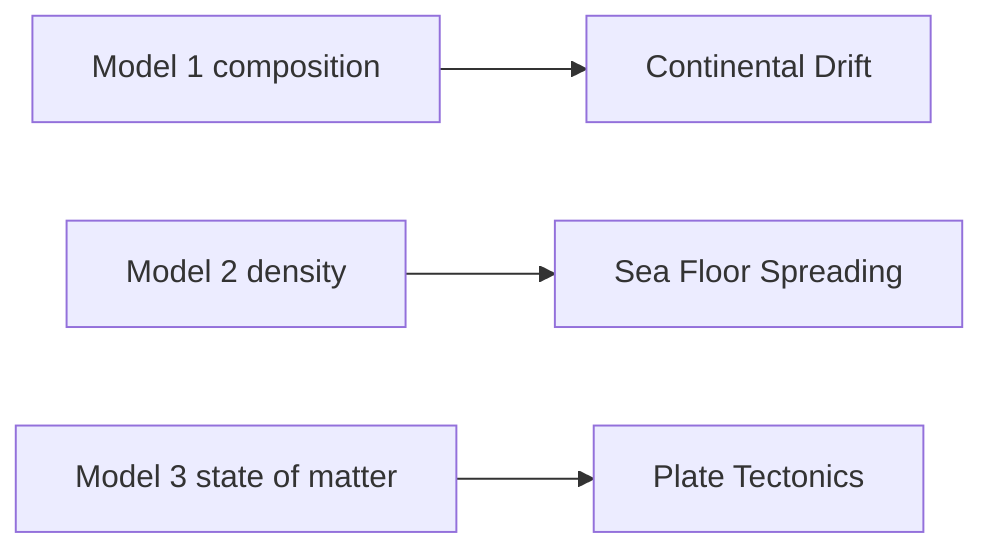
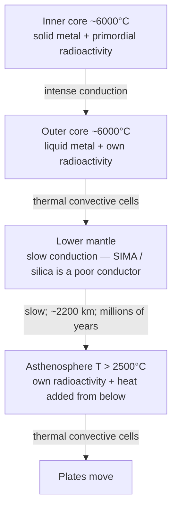
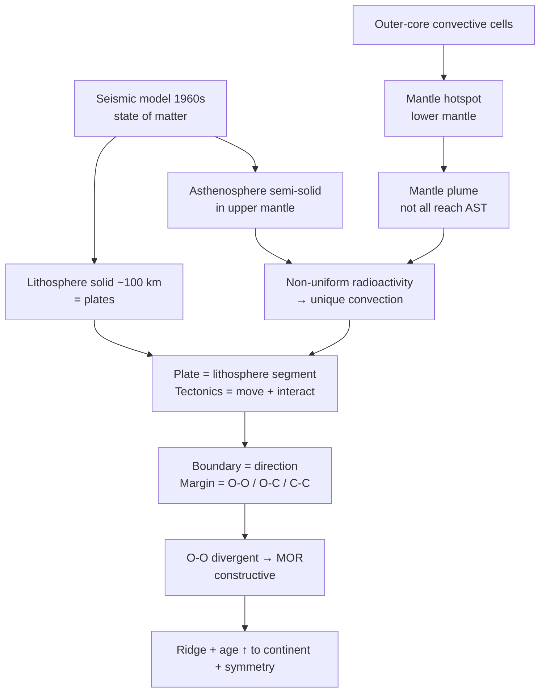
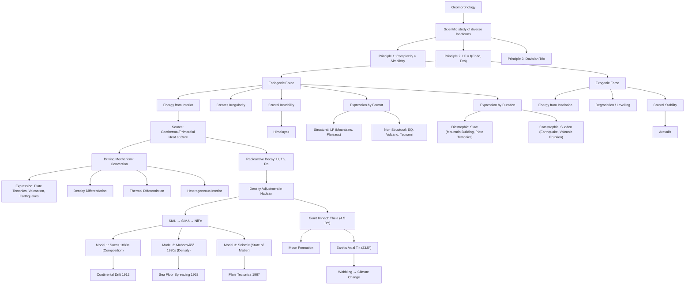

# 02 — Geomorphology (World Physical Geography — Chapter 1)

> **Date of Lecture:** 8 August 2026 (A1) + 9 August 2026 (A2) + 6 September 2026 (A3) + 11 September 2026 (A4 — Geomagnetism) + 25 September 2026 (A5 — endogenic classification) + 26 September 2026 (A6 — faults, folds, volcanism, rock cycle)
> **Date Added:** 2026-08-08; Lecture A3 added **2026-09-06**; Lecture A4 added **2026-09-11**; Lecture A5 added **2026-09-25**; Lecture A6 added **2026-09-26**
> **Teacher:** **Rizwan Sir** (Geomorphology lectures A1–A6)
> **Source:** Vajiram & Ravi — **Rizwan Sir** | class notes (Lecture A1 + A2 + A3 + A4 + A5) + Audio Transcripts
> **Prelims Weightage:** 2–3 Questions | **Mains Weightage:** GS-1, ~2 Questions (25–30 marks)  
> **Yellow Book Concepts Ch 3** (full): `Yellow_Books/Concepts_of_Geography/03_Interior_of_the_Earth.md`. Class stays master for models and depths. Wave types + shadow zones = extras below (A3).

---

### Lecture A1 — 8 August 2026 (Rizwan Sir)

## References

| Priority | Source | Usage |
|:---:|:---|:---|
| 1 | **Class Notes** | Primary — conceptual understanding |
| 2 | **NCERT Class 11** — *Fundamentals of Physical Geography* | Topic-wise reading alongside class (not cover-to-cover) |
| 3 | **Atlas** | Locate every feature mentioned (Rocky, Andes, etc.) |
| 4 | **G.C. Leong / Yellow Book** | Supplementary — selective reading only. More important for Climatology & Oceanography. In Geomorphology, refer selectively: Volcanism, Earthquake, Interior of Earth |

---

## Geomorphology Syllabus (9 Topics)

| # | Topic | Status |
|:---:|:---|:---:|
| I | Landform: Definition & Classification | Covered (Lec A1) |
| II | Endogenetic Forces | Covered (Lec A2) |
| III | Interior of the Earth | Covered (Lec A2 Models 1–2 + Lec A3 Model 3 / plates / SFS) |
| IV | Geomagnetism (Magnetic Field of Earth) | Covered — Lecture A4, `07_Geomagnetism.md` (cluster **GEO-12**) |
| V | Exogenetic Forces / Denudation | Pending |
| VI | Landforms Created by Denudation | Pending |
| | — (i) Fluvial Landform → Water | |
| | — (ii) Aeolian Landform → Wind (desert features: sand dunes) | |
| | — (iii) Glacial Landform → Glacier | |
| | — (iv) Karst Landform → Limestone (CaCO₃) | |
| VII | Volcanism | Pending |
| VIII | Earthquakes | Pending |
| IX | Surface Configuration of Earth | Pending |

---

## 1. Geography — Foundational Framework

### 1.1 What is Geography?
- **Geography** = Study of **Earth's Surface**
- The surface consists of two types of features:
  - **Natural Landscape** (Physical features) → Physical Geography
  - **Human Landscape** (Man-made features) → Human Geography

### 1.2 Branches of Geography

<div style="overflow-x:auto;">
<svg xmlns="http://www.w3.org/2000/svg" viewBox="0 0 400 390" role="img" aria-label="Branches of geography: physical geography and human geography" style="display:block;margin:0 auto;width:100%;min-width:340px;max-width:560px;font-family:system-ui,Segoe UI,Arial,sans-serif;">
<rect x="1" y="1" width="398" height="388" rx="12" fill="#f8fafc" stroke="#e2e8f0" />
<rect x="130" y="12" width="140" height="32" rx="8" fill="#e2e8f0" stroke="#94a3b8" />
<text x="200" y="33" text-anchor="middle" font-size="14" font-weight="700" fill="#0f172a">Geography</text>
<path d="M 200 44 L 200 54 M 20 54 L 200 54 M 20 54 L 20 298 M 20 134 L 34 134 M 20 298 L 34 298" fill="none" stroke="#94a3b8" stroke-width="1.5" />
<rect x="34" y="64" width="352" height="140" rx="8" fill="#f0fdfa" stroke="#2dd4bf" />
<text x="48" y="86" font-size="13" font-weight="700" fill="#115e59">Physical Geography <tspan font-size="11.5" font-weight="400" fill="#64748b">(Natural Landscape)</tspan></text>
<rect x="46" y="98" width="328" height="28" rx="6" fill="#ccfbf1" stroke="#5eead4" />
<text x="60" y="116" font-size="12" fill="#334155">Rock → Lithosphere → <tspan font-weight="700" fill="#115e59">GEOMORPHOLOGY</tspan></text>
<rect x="46" y="132" width="328" height="28" rx="6" fill="#ccfbf1" stroke="#5eead4" />
<text x="60" y="150" font-size="12" fill="#334155">Air → Atmosphere → <tspan font-weight="700" fill="#115e59">CLIMATOLOGY</tspan></text>
<rect x="46" y="166" width="328" height="28" rx="6" fill="#ccfbf1" stroke="#5eead4" />
<text x="60" y="184" font-size="12" fill="#334155">Water → Hydrosphere → <tspan font-weight="700" fill="#115e59">OCEANOGRAPHY</tspan></text>
<rect x="34" y="220" width="352" height="156" rx="8" fill="#fffbeb" stroke="#fbbf24" />
<text x="48" y="242" font-size="13" font-weight="700" fill="#92400e">Human Geography <tspan font-size="11.5" font-weight="400" fill="#64748b">(Man-made features)</tspan></text>
<text x="52" y="264" font-size="12" fill="#334155">• Agriculture</text>
<text x="52" y="284" font-size="12" fill="#334155">• Population</text>
<text x="52" y="304" font-size="12" fill="#334155">• Culture, Religion, Language</text>
<text x="52" y="324" font-size="12" fill="#334155">• Regions</text>
<text x="52" y="344" font-size="12" fill="#334155">• Economic Activities</text>
<text x="64" y="362" font-size="12" fill="#64748b">(Primary, Secondary, Tertiary)</text>
</svg>
</div>

<p style="text-align:center;"><em><strong>Figure:</strong> Geography splits into Physical Geography — each sphere giving one branch — and Human Geography.</em></p>

> **Key:** The intersection of Lithosphere + Atmosphere + Hydrosphere = **Biosphere**

### 1.3 World vs Indian Physical Geography
- **World Physical Geography** → Study of lithosphere, atmosphere, hydrosphere of the entire world
- **Indian Physical Geography** → Physiography/Mapping of India (Bay of Bengal, Arabian Sea, Indian Ocean)

---

## 2. Surface Configuration of Earth (Topic IX — Preview)

Three theories that explain the arrangement of continents & ocean basins:

| Theory | Proponent | Year | Key Idea |
|:---|:---|:---:|:---|
| **Continental Drift** | Alfred Wegener | 1912 | Pangaea → Laurasia + Gondwanaland → present continents |
| **Sea Floor Spreading** | Harry Hess | 1962 | Research during WWII (1940s); published 1962. Improvement over Continental Drift |
| **Plate Tectonics** | T. Wilson & J. Morgan | 1967 | Most scientific, comprehensive, accepted theory |

> **Key Statement:** *"Plate Tectonic Theory validates the concept of Continental Drift and Sea Floor Spreading."*
> - Plate Tectonics does NOT reject Wegener — the idea of supercontinents is correct
> - It provides the **scientific explanation** that Wegener's theory lacked
> - Similarly, Hess's Sea Floor Spreading concept is validated by Plate Tectonics

> **UPSC Mains Trend (10 marks):** Questions now combine all 3 theories into one question (e.g., "Plate tectonic validates the concept of continental drift and sea floor spreading — Discuss"). Earlier, each was asked separately for 15 marks.

---

## 3. What is Geomorphology?

### 3.1 Definition
**Geomorphology** = **Scientific study of diverse landforms**

- *Geo* = Earth | *Morpho* = Structure/Form | *Logy* = Study
- It is a **scientific** discipline → based on verifiable, measurable, factual evidence
- Geography evolved from traditional/religious explanations to scientific study after the 16th century

### 3.2 What is a Landform?

> **Definition:** A landform is a **structural feature** that is:
> 1. **Composed of rock**
> 2. **Part of the lithosphere**
> 3. **Natural in origin** (not man-made)

**Examples:** Mountain, plateau, hill, valley, plain, peninsula, gulf, bay, canyon, gorge

### 3.3 Four Dimensions of Landform Study

| Dimension | Focus | Example (Rocky Mountains) |
|:---|:---|:---|
| **Quantification** | Measuring height, area, extent | ~10,000 km long, ~1,000 km wide |
| **Distribution** | Location on the continent | Western margin of North America |
| **Evolution** | How it came into existence | Created by plate collision (convergent boundary) |
| **Processes** | Forces currently operating on it | Snow/glacier, river, wind, desert — all simultaneously |

---

## 4. Surface of Earth — Non-Uniformity

### 4.1 Why is the Surface Non-Uniform?
- **Diversity of Landforms** → No two landforms are identical, even when located in the same region
  - Western Ghats ≠ Eastern Ghats (same Indian Peninsula)
  - Vindhyas ≠ Satpuras (same Central India)
  - Siwalik ≠ Middle Himalayas ≠ Greater Himalayas (same Himalayan system)
  - Dhauladhar ≠ Pir Panjal; Ladakh ≠ Zanskar ≠ Karakoram

### 4.2 Why are Landforms Different?
- **Uniqueness in evolution** → Every landform evolved in its own unique manner
- Each landform is a product of **multiple processes** that do not match with each other
  - Landform A = Processes {A, B, C, D} (4 processes)
  - Landform B = Processes {B, E, F, G, H} (5 processes)
  - Only Process B is common → rest are different → unique identity

### Principle 1: Complexity Principle

> **"Complexity is more common than simplicity in development of landforms."**

- 99% of landforms are created by **more than 2–3 processes**
- Only ~1% may result from a single process
- Geomorphology is like **forensic science** → two landforms are like two individuals with different fingerprints, even if they are twins

---

## 5. Relief & Slope — Fundamental Identities of Landforms

### 5.1 Base Level

> **Base Level** = Reference level for measuring variation of the surface

- For continental landforms → **Sea Level** is the base level
- Defines the **maximum extent of degradation** of a landform (exogenic forces reduce landforms toward this level)

### 5.2 Relief & Slope

> **Relief** and **Slope** are the **two fundamental identifiers** of any landform, and they are **interdependent**.

- **Relief** = The height/variation of a landform (height for mountains, depth for valleys)
- **Slope** = Angle of inclination (θ) with the base level

**Interdependence:** If relief changes → slope changes, and vice versa.
- Example: Landslide breaks off part of a mountain → height (relief) decreases → new slope angle (θ) also changes → both are modified simultaneously

### 5.3 Absolute vs Relative Relief

| Type | Definition | Measured From | Example |
|:---|:---|:---|:---|
| **Absolute Relief** | Height of landform measured from **sea level** | Sea Level | Mt. Everest = 8,848 m (from sea level) |
| **Relative Relief** | Height difference between **any two nearby locations** (irrespective of sea level) | Nearby lowest location | Everest from base camp at 7,000 m = ~1,848 m |

**Key Examples:**
- Western Ghat peak measured from Arabian Sea → **Absolute Relief**
- Same peak measured from Deccan Plateau surface → **Relative Relief**
- Same location can have BOTH absolute and relative relief depending on reference point

### 5.4 Valley Deepening & Relief

> **"The process of valley deepening will increase relative relief, with the assumption that absolute relief has remained constant."**

- River cuts valley deeper: P → P' (valley floor drops)
- Mountain height (absolute relief) remains unchanged when viewed from distance
- But difference between peak and valley floor (relative relief) increases
- If the peak ALSO erodes simultaneously → both absolute and relative relief change (more complex scenario)

---

## 6. Endogenic & Exogenic Forces

### 6.1 Endogenic Force

> **Endogenic Force** = The expression of energy derived from the **interior of the Earth**

| Aspect | Detail |
|:---|:---|
| **Energy Source** | Interior of Earth (Geosphere — mantle, core) |
| **Impact** | Creates **irregularity** on the surface (mountains, plateaus, hills, rifts) |
| **Primary Function** | **Creation** of landforms (macro-scale) |
| **Secondary Function** | Destruction (e.g., earthquake breaking a mountain — smaller scale) |
| **Expressions** | Volcanism, earthquakes, mountain building, tectonic movements |

### 6.2 Crustal Stability

> **"The stability of the crust is defined on the basis of frequency and intensity of endogenic force."**

| Condition | Endo Character | Crust Status | Example |
|:---|:---|:---|:---|
| Intense & Frequent | Strong, regular | **Unstable** (earthquakes, volcanoes common) | Himalayas |
| Weak & Infrequent | Low, rare | **Stable** (maybe 1 earthquake/100 years) | Aravalis |

### 6.3 Exogenic Force

| Aspect | Detail |
|:---|:---|
| **Origin** | **Majority** originate in the **atmosphere** (not all — meteoroids come from cosmosphere) |
| **Energy Source** | **Insolation** (Incoming Solar Radiation) is the major energy source |
| **Primary Function** | **Degradation** of the surface → achieve uniformity → reduction of relief (both absolute & relative) |
| **Secondary Function** | Creation of smaller landforms (valley, flood plain, delta — byproducts of degradation) |
| **Agent forms** | Water (fluvial), Wind (aeolian), Glacier (glacial), Temperature, Atmospheric pressure, Moisture |
| **Also called** | **Levelling forces** (reduce relief toward base level / sea level) |

### 6.4 Latitudinal Variation of Exogenic Forces

> **"Exogenic forces operate throughout the surface of Earth, but there is latitudinal variation in type and intensity of the force."**

- **Tropical Region** → Highest capability to degrade landforms (maximum insolation = maximum exogenic energy)
- **Temperate Region** → Moderate degradation capability
- **Polar Region** → Exo in form of glaciers

> **"Interpretation of climate is essential to estimate the nature of exogenic force."**
> - Desert (arid) climate → Exo = temperature + wind
> - Humid climate → Exo = water/rainfall (fluvial)
> - Polar climate → Exo = glaciers

### 6.5 LF = f(Endo, Exo) — The Fundamental Equation

> **Principle 2: "The evolution of the landform is a product of competition between endogenic and exogenic forces."**

`LF = f(ENDO / EXO)`

- If Endo = Exo (hypothetical balance) → Surface would be flat/uniform
- But surface is NOT uniform → **imbalance** always exists between the two forces
- This imbalance drives landform development
- Different locations have different Endo-Exo combinations → different landforms develop

### 6.6 Case Study: Aravalis vs Himalayas

| Parameter | Aravalis | Himalayas |
|:---|:---|:---|
| **Age** | ~3 billion years old | ~40 million years old |
| **Original Height** | Estimated up to ~11,000 m (higher than Everest!) | Currently still rising |
| **Present Height** | ~400–1,722 m (Guru Shikhar) | Avg. 3,000 m; Everest ~8,848 m |
| **Endo Activity** | No active endogenic force for last 2.5 billion years | Active — Indian plate still colliding with Eurasian plate |
| **Crustal Status** | **Crustal Stability** (long period) | **Crustal Instability** (tectonically active) |
| **Dominant Force** | **Exogenic** (continuous degradation without endo renewal) | **Endogenic** (despite exo, height continues to increase) |
| **Classification** | Relict mountains (remains of original) | Young fold mountains (still rising) |
| **Plate Position** | NOT at plate boundary | AT convergent plate boundary |

> **Key Statements:**
> - *"Aravalis are relict mountains created by dominance of exogenic force during long period of crustal stability."*
> - *"In case of Himalayas, in spite of presence of exogenic forces, the height of mountain continues to increase — this indicates dominance of endogenic force (crustal instability)."*
> - Everest rises by a few centimeters every year

---

## 7. Davisian Trio — Third Principle

> **Principle 3 (W.M. Davis — American Geographer):**
> `LF = f(Structure, Process, Time)`

| Component | Meaning | Explanation |
|:---|:---|:---|
| **Structure** | Rock composition | Igneous vs sedimentary vs metamorphic — different rocks evolve differently |
| **Process** | Endogenic + Exogenic forces | Rainfall, glacier, wind, tectonic uplift, volcanism, etc. |
| **Time** | Duration of the process | How long the process operated (15 million years of glacier vs 10 million years) |

### Why Two Landforms Differ (Consolidated):
1. **Different rock composition** (Structure) → different evolution
2. **Same rock, but different processes** (e.g., rainfall vs glacier) → different evolution
3. **Same rock, same process, but different duration** (Time) → different evolution
4. All three can **simultaneously differ** → making landform development even more complex

> These three principles — **Complexity, Functionality (LF = f(Endo, Exo)), and Davisian Trio** — explain the non-uniformity of Earth's surface. The entire chapter is based on these three ideas.

---

## 8. Classification of Landforms

### 8.1 Classification Basis 1: Size / Order

| Order | Landform | Scale | Examples |
|:---:|:---|:---|:---|
| **1st Order** | Continent / Ocean Basin | Largest | Asia, Africa, Pacific Ocean Basin |
| **2nd Order** | Fold Mountains | Large | Rockies, Andes, Alps, Himalayas |
| **3rd Order** | Plateaus | Medium | Brazilian Plateau, Deccan Plateau |
| **4th+ Order** | Hills, Valleys, etc. | Smaller | Progressively decreasing size |

**Oceanic Orders (studied under Oceanography, NOT Geomorphology):**
- Continental Slope → Mid-Oceanic Ridge (MOR) → Islands → Seamounts → Trenches
- All submarine features = **Ocean Bottom Relief (OBR)** → Part of **Oceanography**

> **Geomorphology** studies what lies **above sea level** (continental landforms)
> **Oceanography** studies what lies **below sea level** (ocean bottom relief)

### 8.2 Classification Basis 2: Origin

| Origin Type | Explanation |
|:---|:---|
| **Formation of Crust** | Crust itself was formed unevenly from day one → landforms inherent since crust formation |
| **Endogenic Forces** | Create **macro landforms** (mountains, plateaus, continental-scale features) |
| **Exogenic Forces** | Create **micro landforms** (valleys, passes, waterfalls, canyons, gorges, flood plains, deltas) |

**Endo vs Exo — Function Summary:**

| | **Primary Function** | **Secondary Function** | **Scale of Landforms** |
|:---|:---|:---|:---|
| **Endogenic** | Create landforms | Destroy (e.g., earthquake breaks mountain) | **Macro** (Himalayas, Rockies) |
| **Exogenic** | Destroy/degrade landforms | Create new features (valley, delta, flood plain) | **Micro** (canyon, gorge, waterfall) |

---

<!-- ═══════════════════════════════════════════════════════════════════════════ -->
<!-- ██  LECTURE A2 — 9 August 2026  ██ -->
<!-- ═══════════════════════════════════════════════════════════════════════════ -->

### Lecture A2 — 9 August 2026 (Rizwan Sir)

> **Date of Lecture:** 9 August 2026 (Lecture A2)
> **Date Added:** 2026-08-09
> **Teacher:** **Rizwan Sir**
> **Source:** Vajiram & Ravi — **Rizwan Sir** | class notes (Lecture A2) + Audio Transcript
> **Topics Covered:** Endogenetic Forces (detailed), Energy Source for Endo, Earth's Evolution & Geological Time Scale, Hadean Eon & Giant Impact, Density Adjustment, Heat Transfer Mechanisms (Convection as driving mechanism), Interior of Earth (Approaches & Models 1–2)

---

## 9. Endogenetic Forces — Detailed Elaboration (Lecture A2)

### 9.1 Definition (Recap & Expansion)

> **Endogenic Force** = Expression of energy derived from the **interior of the Earth**.

Three key dimensions:
1. **Expression** — How the force appears on the crust
2. **Energy** — The driving fuel (geothermal/primordial heat)
3. **Source** — Interior of the Earth (core)

### 9.2 Classification by Format (Expression)

| Type | What It Means | Creates | Examples |
|:---|:---|:---|:---|
| **Structural (LF)** | Directly creates a **measurable relief** / landform | Mountains, plateaus, hills, valleys | Himalayas, Rockies, Andes, Vindhyas, Western Ghats |
| **Non-Structural (Mass)** | Does NOT directly create relief; expressed as tremor, liquid material, or wave | Earthquake, volcanism, tsunami | 2004 Indian Ocean Tsunami, Mt. Vesuvius eruption |

> **Key Definition:** *"Landform is a structural expression of endogenic force."*

- **Volcanic eruption** = Non-structural because the primary expression is hot liquid material (lava/magma), not a relief directly. The lava cools and *then* establishes a relief — that is secondary.

### 9.3 Classification by Duration

| Type | Duration | Character | Examples |
|:---|:---|:---|:---|
| **Diastrophic** | Slow-acting (thousands to millions of years) | Gradual, operates over geological time | Mountain building, continental drift, sea floor spreading, plate tectonics, faulting, rifting |
| **Catastrophic** | Short duration (seconds to minutes) | Sudden, violent | Earthquake, volcanic eruption, tsunami |

> **Key Statement:** *"Majority of the Earth's surface configuration is the product of diastrophism."*

- ~80% of features from Kashmir to Kanyakumari → product of **diastrophic** (slow-acting) endogenic forces
- Himalayas, Northern Plains, Vindhyas, Satpuras, Western Ghats, Eastern Ghats — all diastrophic
- Catastrophic contribution is very limited (e.g., some volcanic islands, tectonic fall lines)

---

## 10. Earth — Factual Profile

### 10.1 Basic Parameters

| Parameter | Value |
|:---|:---|
| **Age of Earth** | **4.6 billion years** (4,600 million years) |
| **Radius** | **6,400 km** |
| **Average Density** | **5.5 g/cm³** |
| **Origin** | From **primordial matter** (cosmic dust nebula) |
| **Temperature at Origin** | **~6,000°C** (estimated from radioactive decay) |

### 10.2 Composition of Entire Earth (Decreasing Proportion)

| Rank | Element | Key Property | Role in Earth's Structure |
|:---:|:---|:---|:---|
| 1 | **Iron (Fe)** | Heavy metal, good conductor of heat | Core composition (NiFe) |
| 2 | **Oxygen (O)** | Lighter element | Silicate minerals |
| 3 | **Silicon (Si)** | **Poor conductor of heat** | SIAL & SIMA (crust & mantle) |
| 4 | **Magnesium (Mg)** | Moderate density | SIMA layer |
| 5 | **Aluminium (Al)** | Lighter metal | SIAL layer (crust) |
| 6 | **Nickel (Ni)** | Heavy metal (~2% of Earth) | Core composition (NiFe) |

> ⚠️ This is composition of **entire Earth**, NOT just the crust.

### 10.3 Radioactive Elements in Earth's Interior

| Element | Character |
|:---|:---|
| **Uranium** | Heavy, unstable, decays → produces heat |
| **Thorium** | Heavy, unstable, decays → produces heat |
| **Radium** | Heavy, unstable, decays → produces heat |

- Radioactive elements are **heavy**, **unstable**, undergo continuous **decay/disintegration** → **generate heat**
- Half-life of radioactive elements helps determine the **age of Earth** (radiometric dating)

### 10.4 Other Gases in Interior

CO₂, N₂O, Hydrogen, Helium, SO₂ — same gases that emerge from volcanic eruptions exist in Earth's interior.

### Update — 13 September 2026 (UPSC CSE Prelims 2024)

`CSE-2024-Q03` **held**. **All four** are products of volcanic eruptions: pyroclastic debris, ash and dust, nitrogen compounds, sulphur compounds. Class already names **N₂O** and **SO₂** among interior / eruption gases.

---

## 11. Geological Time Scale (GTS)

> **Geological Time** = The 4.6-billion-year history of Earth.
> **Geological Time Scale (GTS)** = Division of this history into intervals based on key events & evidence.

### 11.1 Hierarchy of Divisions

```
EON (largest) → ERA → PERIOD → EPOCH (smallest)
```

- **Eon** = Longest division (like "hours" on a clock dial)
- **Epoch** = Shortest division (like "seconds")

### 11.2 The Four Eons

| # | Eon | Time Span | Duration | Key Significance |
|:---:|:---|:---|:---|:---|
| 1 | **Hadean** | 4.6 – 4.0 BY ago | 600 million years | Hell-like conditions; no spheres, no rock, no crust, no life. Temperature ~6,000°C. Giant Impact (Theia collision) |
| 2 | **Archean** | 4.0 – 2.5 BY ago | 1,500 million years | First rock formation (solidification of crust); establishment of lithosphere, atmosphere, hydrosphere; **beginning of life** — cyanobacteria (blue-green algae) at end of Archean (~2.5 BY) |
| 3 | **Proterozoic** | 2.5 BY – 541 MY ago | ~2,000 million years | **Early life** (*protero* = primitive + *zoic* = life); simple, aquatic, invertebrate organisms; fossil records; no terrestrial organisms; flora = small climbers/grass, no large trees |
| 4 | **Phanerozoic** | 541 MY ago – Present | ~541 million years | **New/complex life** (*phanero* = new + *zoic* = life); simple → complex transition; repeated **mass extinctions** triggered by **climate change**; invertebrate → vertebrate; aquatic → terrestrial; amphibian → reptile → mammal → apes; establishment of dense forests |

> **Key:** *Proterozoic* = Early/primitive life | *Phanerozoic* = New/complex life
> Whatever complex life (flora & fauna) we see on Earth today belongs to the **Phanerozoic Eon**.

---

## 12. Hadean Eon — Earth's Violent Birth

### 12.1 Formation of Earth from Primordial Matter

1. Before the solar system → a **rotating nebula of cosmic dust** (= **primordial matter**) existed
2. Two **inertial forces of the universe** acted on this nebula:
   - **Centripetal force** (gravity) → pulled material toward the center
   - **Centrifugal force** → pushed material outward
3. ~90% of matter converged at the center → **formation of the Sun**
4. Remaining 8–10% material thrown outward by centrifugal force → arranged in **concentric rings**
5. Each ring contained unequal, irregular segments of primordial matter
6. Segments within each ring collided (unequal velocities) → consolidated → **formation of planets**
7. Density of material **decreases** with increasing distance from the Sun → inner planets (terrestrial) are denser than outer planets (gaseous)

> **Key:** Earth was formed by **consolidation of primordial matter** that got separated from the Sun.

### 12.2 Hadean Conditions (4.6 – 4.0 BY ago)

- Temperature: ~6,000°C (from collision energy + randomly distributed radioactivity near surface)
- State: Semi-solid, blob-like, irregular shape
- No rock, no crust, no atmosphere, no hydrosphere, no life — **hell-like scenario**
- Two reasons for extremely high temperature:
  1. **Collision energy** from consolidation of primordial matter
  2. **Randomly distributed radioactivity** near the surface → producing additional heat

### 12.3 The Giant Impact (Theia Collision) — ~4.5 BY ago

> ~100 million years after Earth's formation, a Mars-sized body called **Theia** collided with Earth.

**Four major outcomes of Giant Impact:**

| # | Outcome | Detail |
|:---:|:---|:---|
| 1 | **Moon formation** | Material ejected from Earth consolidated to form the Moon |
| 2 | **Change in Earth's axial tilt** | Earth's axis of rotation was tilted (currently 23.5°) |
| 3 | **Moon's receding orbit** | The orbit of Moon is not static — distance between Earth and Moon has **increased** over time |
| 4 | **Wobbling of Earth** | Tilt of Earth **fluctuates** over time → influences **climate change** |

### 12.4 Wobbling of Earth

- The tilt (currently 23.5°) is **NOT permanent** — it changes over geological time
- **Current rate:** ~0.5° change per ~50,000 years
- **Past rate:** Faster (force of impact was stronger initially → more frequent fluctuation)
- Wobbling → changes position of Tropics (Cancer & Capricorn) → influences **insolation distribution** → **climate change**
- Placement of Tropic of Cancer & Capricorn is decided by the **tilt of Earth's axis**
- Moon rocks provide evidence of Earth's early formation (common primordial origin)

### Update — 8 September 2026 (Yellow Book Concepts of Geography, Ch 1 — Moon extras; not a new topic)

Same Giant Impact. Book name **Big Splat**; timing **~4.44 billion years** (class **~4.5**). Mean distance **384,000 km**; sidereal orbit **27.32 days**; **tidal locking** → about **59%** of the surface is ever seen from Earth. **Super Moon** at perigee **356,500 km**; **Micro Moon** at apogee **406,700 km**. Full solar-system packet: `Yellow_Books/Concepts_of_Geography/01_Earth_in_the_Universe.md` (cluster **GEO-11**).

### Update — 8 September 2026 (Yellow Book Concepts Ch 2 — early Earth / oceans; not a new topic)

Same differentiation as class (Fe–Ni down, silica–aluminium up). Book extras: early thin **H + He** atmosphere; crust **wrinkles** into ridges and basins; rain for **thousands of years** fills basins = **oceans**; giant impact as the heat that **starts** layering. Origin-theory names (Jeans–Jeffreys tidal; Laplace **1796**) sit in `Yellow_Books/Concepts_of_Geography/02_Origin_and_Evolution_of_the_Earth.md`. **Do not** add a new cluster.

### 12.5 Traces of Water Vapour

- During consolidation, different primordial segments brought different gases (some O₂, some H₂)
- H₂ + O₂ combined → traces of **water vapour** formed
- This water vapour could NOT reach the surface (temperature too high) → existed at great height
- As Earth cooled → water vapour descended → eventually contributed to formation of hydrosphere
- **Age of water vapour ≈ Age of Earth** (same origin)

### 12.6 Evolution of the Atmosphere (Degassing)

- Earth's early atmosphere (mostly hydrogen & helium) was largely stripped away by solar winds.
- <span style="color: #e53e3e;">**Degassing (Aug 2026 MCQ):** The primary process that contributed to the evolution of the present atmosphere was **Degassing** from the Earth's interior, releasing water vapour, nitrogen, carbon dioxide, methane, and ammonia. Biological fixation (like photosynthesis) contributed much later to oxygenate it.</span>

### Update — 11 September 2026 (UPSC CSE Prelims 2018)

`CSE-2018-Q57` extras sit on `07_Geomagnetism` (`MST-077`). Atmosphere lock here: early Earth was **not** **54% oxygen with no CO₂**. Organisms **did** modify the early atmosphere (statement 3). Degassing still comes first; oxygenation is later.

---

## 13. Density Adjustment — The Key Hadean Process (4.4 – 4.0 BY ago)

### 13.1 Initial State of Earth's Interior

- After formation, material inside Earth was **randomly distributed** (not layered)
- Iron, oxygen, silicon, aluminium, nickel, radioactive elements — all scattered irregularly
- No systematic layers like SIAL, SIMA, NiFe existed initially

### 13.2 The Process of Density Adjustment

> **Density Adjustment** = Rearrangement of material in Earth's interior, achieved by the action of **centripetal** (gravity) and **centrifugal** forces.

**Mechanism:**
1. Earth searched for its center → centripetal force (gravity) established
2. All **high-density elements** (Iron, Nickel, Radioactive elements) → **shifted toward the center** by gravity
3. All **low-density elements** (Silica, Aluminium) → **pushed toward the surface** by centrifugal force
4. This was possible because the entire interior was in a **semi-solid/flexible state** (not solidified yet)

### 13.3 Results of Density Adjustment

| Result | Detail |
|:---|:---|
| **Core organized** | Made up of **NiFe** (Nickel + Iron); metallic; has **highest concentration of radioactive elements** |
| **Layering established** | Interior configured as **SIAL** (surface) → **SIMA** (intermediate) → **NiFe** (core) |
| **Radioactivity displaced** | Shifted from near surface → to core → **surface temperature rapidly declined** |
| **Rock formation began** | Temperature dropped below ~600°C → sufficient for solidification → **beginning of rock formation** → end of Hadean, start of **Archean Eon** |

### 13.4 Why Earth Cooled Rapidly (Two Reasons)

1. **Re-radiation** — Earth lost heat to outer environment (space)
2. **Displacement of radioactivity** — Radioactive elements shifted from near surface to core → surface heat source removed → rapid cooling

---

## 14. Geothermal Heat — Source of Endogenic Force

### 14.1 Establishing the Source

> **Geothermal heat** (= **Primordial heat**) produced at the **core** is the **source of energy** for endogenic forces.

- Core has concentration of radioactive elements (Uranium, Thorium, Radium) → continuous decay → **generates heat**
- Estimated core temperature: **~6,000°C**
- This heat drives all endogenic expressions (mountain building, volcanism, earthquakes, plate tectonics)

### 14.2 The Source → Mechanism → Expression Chain

```
SOURCE (Geothermal Heat at Core)
    ↓
DRIVING MECHANISM (Heat Transfer from Interior to Surface)
    ↓
EXPRESSION (Mountain building, Volcanism, Earthquakes, Plate Tectonics)
```

- **Source** = Geothermal/Primordial heat at the core
- **Driving Mechanism** = The most efficient heat transfer mechanism from interior to surface
- **Expression** = The surface manifestation of endogenic forces
- Whichever heat transfer mechanism is most efficient → becomes the **driving mechanism** → determines the **expression**

---

## 15. Heat Transfer from Interior to Surface

### 15.1 Three Mechanisms (General Thermodynamics)

| # | Mechanism | How It Works | Effective in Earth? | Why? |
|:---:|:---|:---|:---:|:---|
| 1 | **Radiation** | Transfer through transparent medium | **❌ Not effective** | Earth is **not a transparent object** → radiation cannot pass from core to surface |
| 2 | **Conduction** | Transfer by contact (molecule to molecule) | **❌ Not effective (overall)** | Earth is **not thoroughly metallic**; conduction works at core (metallic) but **declines in outer layers** due to increasing proportion of **silica** (poor conductor) |
| 3 | **Convection** | Transfer by **displacement of material** (liquid/gas) | **✅ Most effective** | Liquid/semi-liquid material in Earth's interior physically moves from one location to another, carrying heat |

### 15.2 Why Radiation Fails

- Radiation requires a **transparent medium**
- Earth is opaque → radiation cannot transfer heat from core to surface
- **Do NOT confuse** with Earth's surface long-wave radiation (terrestrial radiation to atmosphere) — that is a completely different phenomenon

### 15.3 Why Conduction Fails

- Conduction requires **metallic material** (good conductor)
- Earth's core IS metallic (NiFe) → conduction is efficient **at the core only**
- But outer layers (SIMA, SIAL) have increasing proportion of **silica** → poor conductor of heat
- Process of conduction **declines/slows down** in outer layers
- Therefore, conduction is **NOT a direct driving mechanism** for endogenic forces

### 15.4 Convection — The Driving Mechanism

> **Convection** = Heat transfer by **physical displacement of material** from one location to another.

- Requires material in **liquid or gaseous state** (not solid — that's conduction)
- In Earth's interior: semi-liquid/plastic material physically moves, carrying heat from interior to near-surface
- **Convection is the most effective mechanism of heat transfer** in Earth's interior
- **Convective force = Endogenic force** → all expressions of endo (plate tectonics, mountain building, volcanism, earthquakes) can be explained by convection

---

## 16. Conditions Enabling Convection in Earth's Interior

### 16.1 Three Properties of Earth's Interior

| # | Property | Technical Term | Description |
|:---:|:---|:---|:---|
| 1 | Density changes with depth | **Density Differentiation** | Density increases with depth (Surface: 2.7 → Average: 5.5 → Core: ~13) |
| 2 | Temperature changes with depth | **Thermal Differentiation** | Temperature increases with depth (surface → core: ~6,000°C) |
| 3 | Composition varies | **Heterogeneous** | Interior is NOT homogeneous — material composition changes throughout |

### 16.2 Melting Point vs Temperature — The State Logic

> At any location inside Earth, the **state of matter** (solid or liquid) depends on the relationship between **melting point** and **temperature** of the material at that place.

| Condition | Result |
|:---|:---|
| **Melting Point > Temperature** | Material remains **solid** |
| **Temperature > Melting Point** | Material becomes **liquid** |

- This relationship varies at **every depth** because both temperature AND melting point change with depth
- When liquid material exists at a certain depth → convection becomes possible at that depth
- This is why Earth's interior has **both solid and liquid zones** — not uniform throughout

### 16.3 Thermal Convection Currents

- Where liquid material exists in Earth's interior → **thermal convection currents** form
- These currents transport heat from the core toward the surface
- They are the **driving mechanism** for all endogenic forces
- This is an outcome of **density adjustment** — the process that organized Earth's interior

> **Key Statement:** *"The interior of Earth has thermal convection currents which transport heat toward the surface, and they are the driving mechanism for expression of endogenic force. This is an outcome of density adjustment."*

---

## 17. Interior of Earth — Study Approaches

### 17.1 Why Study the Interior?

> *"The study of interior of Earth helps in understanding **endogenic force** and **configuration of the surface**."*

- The surface of Earth is **not an isolated entity** — what happens on the surface depends on what's going on in the interior
- Analogy: *"Face of a person is an expression of what is going on in his head"* — similarly, surface configuration reflects interior processes

### 17.2 Direct Evidence

| Source | How It Works | Depth Limit |
|:---|:---|:---|
| **Rocks** | Study of surface and volcanic rocks | Surface only |
| **Volcanic material** | Lava & magma provide samples from depth | ~40–250 km |
| **Mining** | Diamond & gold mines (esp. South Africa) | ~3–8 km |
| **Drilling projects** | Bore into Earth's interior for study | ~13–14 km |

**Key Drilling Projects:**
- **Kola Superdeep Borehole** (Russia, near Norway) — deepest drilling project to date (~13.7 km). No longer operational.
- **Koyna Superdeep Borehole** (Maharashtra, India — near Koyna River/Shivaji Sagar Dam, tributary of Krishna) — planned continental drilling project

> **Limitation:** Direct evidence covers only the **superficial layer** (max ~250 km via volcanoes vs 6,400 km radius). Man is only ~10% aware of what lies inside Earth.

### 17.3 Indirect Evidence

| # | Source | What It Reveals |
|:---:|:---|:---|
| 1 | **Earthquake waves (Seismic study)** | Behaviour changes at different layers → reveals composition, density, state |
| 2 | **Geomagnetism** | Magnetic field reveals core properties |
| 3 | **Meteorites** | Common primordial origin → composition analogous to Earth's interior (classified as indirect because NOT obtained from Earth's interior) |
| 4 | **Gravity anomaly** | Variation of gravity from one location to another → reveals density variations in interior |

---

## 18. Three Models of Earth's Interior

### 18.1 Model 1 — Edward Suess (1880s) — Based on Composition

| Layer | Composition | Position |
|:---|:---|:---|
| **SIAL** | Silica + Aluminium | Outermost |
| **SIMA** | Silica + Magnesium | Intermediate |
| **NiFe** | Nickel + Iron | Core/Center |

- **Basis:** Composition of material
- **Limitation:** Did NOT quantify thickness of layers
- **Significance:** Became the basis for **Wegener's Continental Drift Theory** (1912)

### 18.2 Model 2 — Mohorovičić (1930s) — Based on Density

| Layer | Density | Depth Range |
|:---|:---|:---|
| **Crust** (= SIAL) | ~2.7 g/cm³ | 0–40 km |
| **Mantle** (= SIMA) | ~5.4 g/cm³ | 40–2,900 km |
| **Core** (= NiFe) | ~13 g/cm³ | 2,900–6,400 km |

- **Basis:** Density (quantified values + thickness)
- **Improvement over Model 1:** Provided numerical values for density AND thickness
- First model got **subsumed/merged** into this one
- **Significance:** Became the basis for **Harry Hess's Sea Floor Spreading** (1962)

### 18.3 Discontinuities

> **Discontinuity** = Boundary between layers of Earth's interior at which there is a **change in behaviour of earthquake waves**.

| Discontinuity | Location | Depth | Between |
|:---|:---|:---|:---|
| <span style="color: #e53e3e;">**Conrad**</span> | <span style="color: #e53e3e;">Upper Crust & Lower Crust</span> | <span style="color: #e53e3e;">~15–20 km</span> | <span style="color: #e53e3e;">Upper Crust ↔ Lower Crust</span> |
| **Mohorovičić (Moho)** | Boundary of Crust & Mantle | ~40 km | Crust ↔ Mantle |
| <span style="color: #e53e3e;">**Repetti**</span> | <span style="color: #e53e3e;">Upper Mantle & Lower Mantle</span> | <span style="color: #e53e3e;">~700 km</span> | <span style="color: #e53e3e;">Upper Mantle ↔ Lower Mantle</span> |
| **Gutenberg** | Boundary of Mantle & Core | ~2,900 km | Mantle ↔ Core |
| <span style="color: #e53e3e;">**Lehmann**</span> | <span style="color: #e53e3e;">Outer Core & Inner Core</span> | <span style="color: #e53e3e;">~5,150 km</span> | <span style="color: #e53e3e;">Outer Core ↔ Inner Core</span> |

### 18.4 Model 3 — Seismic Model (Post-1960) — Based on State of Matter

- **Basis:** State of matter (solid vs liquid) — NOT just composition or density
- Key changes from Model 2:
  - **Core** → divided into **Outer Core** (liquid) and **Inner Core** (solid)
  - **Mantle** → differentiated into **Lithosphere** and **Asthenosphere**
- **Significance:** Became the basis for **Plate Tectonic Theory**
- **Elaborated same chapter:** Lecture A3 — 6 September 2026 (§§19–29 below). Cluster **GEO-09**. Lecture A4 — 11 September 2026 (geomagnetism) in `07_Geomagnetism.md`. Cluster **GEO-12**.

### 18.5 Models ↔ Surface Theories Linkage

| Model | Year | Basis | Surface Theory It Enabled |
|:---|:---|:---|:---|
| Edward Suess | 1880s | Composition | **Continental Drift** (Wegener, 1912) |
| Mohorovičić | 1930s | Density | **Sea Floor Spreading** (Hess, 1962) |
| Seismic Model | 1960s+ | State of Matter | **Plate Tectonics** (Wilson & Morgan, 1967) |

> As understanding of Earth's interior improved → surface configuration theories also improved.

---

### Lecture A3 — 6 September 2026 (Rizwan Sir)

> **Date of Lecture:** 6 September 2026  
> **Date Added:** 2026-09-06  
> **Faculty:** **Rizwan Sir**. Vajiram & Ravi World Physical Geography.  
> **Source:** Class + audio transcript (`Geography L060926`) + 5 handwritten sheets (wedge cross-section, heat path, mid-ocean ridge / R₁–R₃, continental vs oceanic crust, inner-core pressure).  
> **Continues:** Lecture A2 — 9 August 2026, §§18.1–18.5 above. This sitting is **Model 3** (state of matter) and the surface theories it unlocks.  
> **Also relevant for:** Prelims (discontinuities, lithosphere ≠ crust, Conrad, mantle plume); **GS-I** (endogenic force, plate tectonics); class flagged a **2021** mains-style ask on **mantle plume ↔ plate tectonics**.

**How to read class shortcuts:** full form on first use. Glossary at the end. Do not invent a depth the sheet / class did not give.

Class paused after **pressure vs melting point** (why the inner core stays solid). Geomagnetism and the rest of Topic IV are still pending.

**Already in Lecture A2 — do not restudy as a new topic:** Suess SIAL / SIMA / NiFe → Continental Drift; Mohorovičić crust–mantle–core → Sea Floor Spreading (Hess, 1962); Moho ~40 km and Gutenberg 2,900 km as *average* Model-2 numbers. Those rows stay on **GEO-04**. This cluster is **GEO-09**.

---

## 19. Three models, three surface theories (GEO-09-01)

Landform is still **f(endogenic, exogenic)**. Energy for endogenic force = **primordial / radioactive heat** at the core. Mechanism = **convection**. The *picture* of the interior has changed three times; each picture licensed a surface theory.

| Model | When | Basis | Surface theory it enabled |
|:---|:---|:---|:---|
| **1 — Edward Suess** | 1880s | **Composition** — SIAL / SIMA / NiFe | **Continental Drift** (Wegener, 1912) |
| **2 — Andrija Mohorovičić** | 1930s | **Density** — crust / mantle / core | **Sea Floor Spreading** (Harry Hess, 1962) |
| **3 — Seismic model** | **1960s** | **State of matter** (solid / semi-solid / liquid) | **Plate Tectonics** |

Until the **1950s** geologists accepted different *materials* and *densities*, but treated the whole Earth as **thoroughly solid**. Earthquake-wave data broke that. Model 3 has **no single author** — several workers / institutes. Class audio garbled a name list; do not invent one.

**Linkage class keeps repeating:** more we know about the interior, more the *surface* theory changes.



---

## 20. Seismic model — layers by state (GEO-09-01)

| Layer | State | Class placement |
|:---|:---|:---|
| **Lithosphere** | **Solid** | Outermost; *lithos* = rock |
| **Asthenosphere** | **Semi-solid** (flexible / elastic) | Directly under the lithosphere |
| **Lower mantle** | **Solid** | Below ~700 km |
| **Outer core** | **Liquid**, metallic (NiFe) | 2,900–5,150 km |
| **Inner core** | **Solid**, metallic (NiFe) | 5,150–6,400 km |

Composition of the **core is the same** (NiFe). State differs. Recent work: inner core has a **slightly higher** iron share (~**10%**). Class: do not chase the research paper — **liquid outer / solid inner** is the exam line.

---

## 21. Plate and tectonics (GEO-09-02)

The lithosphere is **not continuous**. It is **fragmented**. Each **segment of lithosphere** = a **plate**. Sizes are unequal → **major** and **minor** plates.

Plates **rest on** the asthenosphere. Energy in the asthenosphere (from the interior, plus its own radioactivity — §24) **moves** the plates. When they move they **interact**.

| Term | Class line |
|:---|:---|
| **Plate** | A **segment of lithosphere** |
| **Tectonics** | **Movement and interaction** of plates |
| **Convergent** boundary | Plates move **towards** each other |
| **Divergent** boundary | Plates move **away** from each other |

**Plate types on the surface:** **continental**, **oceanic**, or **continental–oceanic** (a plate can carry both a continent and an ocean floor).

---

## 22. Cross-section: depths and discontinuities (GEO-09-03)

**Radius** used in class = **6,400 km** (surface → centre).

<div style="overflow-x:auto;">
<svg xmlns="http://www.w3.org/2000/svg" viewBox="0 0 640 400" role="img" aria-label="Earth interior wedge. Crust is the green 0 to 40 km rind ending at Moho. Upper mantle is 40 to 700 km. Then lower mantle, outer core and inner core." style="display:block;margin:0 auto;width:100%;min-width:340px;max-width:680px;font-family:system-ui,Segoe UI,Arial,sans-serif;">
<rect x="1" y="1" width="638" height="398" rx="12" fill="#f8fafc" stroke="#e2e8f0"/>
<text x="20" y="26" font-size="13" font-weight="700" fill="#0f172a">Cross-section of Earth's interior (class depths — not to scale)</text>
<text x="20" y="44" font-size="11" fill="#64748b">Crust is its own rind (0–40 km). Upper mantle is the 40–700 km band, not its own colour.</text>
<!-- wedge: centre (360, 368); vertical cut faces the depth rail -->
<path d="M360 68 A300 300 0 0 0 60 368 L360 368 Z" fill="#fef3c7" stroke="#d97706" stroke-width="1"/>
<path d="M360 88 A280 280 0 0 0 80 368 L360 368 Z" fill="#fde68a" stroke="#ca8a04" stroke-width="1"/>
<path d="M360 108 A260 260 0 0 0 100 368 L360 368 Z" fill="#fed7aa" stroke="#ea580c" stroke-width="1"/>
<path d="M360 148 A220 220 0 0 0 140 368 L360 368 Z" fill="#fdba74" stroke="#c2410c" stroke-width="1"/>
<path d="M360 228 A140 140 0 0 0 220 368 L360 368 Z" fill="#fca5a5" stroke="#dc2626" stroke-width="1"/>
<path d="M360 300 A68 68 0 0 0 292 368 L360 368 Z" fill="#fb7185" stroke="#9f1239" stroke-width="1"/>
<!-- crust rind on top so the 0–40 km skin is visible -->
<path d="M360 68 A300 300 0 0 0 60 368 L80 368 A280 280 0 0 1 360 88 Z" fill="#86efac" stroke="#15803d" stroke-width="1"/>
<!-- layer names -->
<text x="72" y="78" font-size="11" font-weight="700" fill="#14532d">Crust · SIAL · 0–40 km</text>
<text x="100" y="104" font-size="11" font-weight="700" fill="#92400e">Lithospheric root · solid SIMA</text>
<text x="100" y="118" font-size="10" fill="#92400e">still lithosphere · already in UM</text>
<text x="110" y="146" font-size="11" font-weight="700" fill="#9a3412">Asthenosphere · semi-solid</text>
<text x="110" y="160" font-size="10" fill="#9a3412">entirely inside upper mantle</text>
<text x="148" y="210" font-size="11" font-weight="700" fill="#7c2d12">Lower mantle · solid SIMA</text>
<text x="198" y="292" font-size="11" font-weight="700" fill="#7f1d1d">Outer core · liquid NiFe</text>
<text x="288" y="348" font-size="10" font-weight="700" fill="#4c0519">Inner core</text>
<text x="288" y="362" font-size="10" font-weight="700" fill="#4c0519">solid NiFe</text>
<!-- crust brace 0–40; upper-mantle brace 40–700 -->
<line x1="366" y1="68" x2="366" y2="88" stroke="#15803d" stroke-width="3"/>
<line x1="360" y1="68" x2="366" y2="68" stroke="#15803d" stroke-width="2"/>
<line x1="360" y1="88" x2="366" y2="88" stroke="#15803d" stroke-width="2"/>
<line x1="366" y1="88" x2="366" y2="148" stroke="#0f766e" stroke-width="3"/>
<line x1="360" y1="148" x2="366" y2="148" stroke="#0f766e" stroke-width="2"/>
<!-- depth rail -->
<line x1="376" y1="68" x2="376" y2="368" stroke="#94a3b8" stroke-width="1.5"/>
<circle cx="376" cy="68" r="3.5" fill="#d97706"/>
<circle cx="376" cy="88" r="3.5" fill="#0f766e"/>
<circle cx="376" cy="108" r="3.5" fill="#ea580c"/>
<circle cx="376" cy="148" r="3.5" fill="#0f766e"/>
<circle cx="376" cy="228" r="3.5" fill="#dc2626"/>
<circle cx="376" cy="300" r="3.5" fill="#9f1239"/>
<circle cx="376" cy="368" r="3.5" fill="#0f172a"/>
<text x="392" y="58" font-size="12" font-weight="700" fill="#14532d">0 km · surface · CRUST starts</text>
<text x="392" y="74" font-size="11" font-weight="700" fill="#15803d">CRUST · 0–40 km · SIAL</text>
<text x="392" y="90" font-size="12" font-weight="700" fill="#0f766e">~40 km · Moho · crust ends · UM starts</text>
<text x="392" y="104" font-size="10.5" fill="#0f766e">crust ↔ mantle · still inside lithosphere</text>
<text x="392" y="118" font-size="11" fill="#0f172a">~100 km · lithosphere ends</text>
<text x="392" y="132" font-size="12" font-weight="700" fill="#0f766e">UPPER MANTLE · 40–700 km</text>
<text x="392" y="152" font-size="12" font-weight="700" fill="#0f172a">700 km · Repetti · UM ends</text>
<text x="392" y="166" font-size="10.5" fill="#64748b">upper ↔ lower mantle · astheno ↔ LM</text>
<text x="392" y="224" font-size="12" font-weight="700" fill="#0f172a">2,900 km · Gutenberg</text>
<text x="392" y="240" font-size="11" fill="#64748b">mantle ↔ core · solid → liquid</text>
<text x="392" y="296" font-size="12" font-weight="700" fill="#0f172a">5,150 km · Lehmann</text>
<text x="392" y="312" font-size="11" fill="#64748b">outer ↔ inner core · liquid → solid</text>
<text x="392" y="372" font-size="12" font-weight="700" fill="#0f172a">6,400 km · centre</text>
</svg>
</div>

**Discontinuity** = a depth where the **behaviour of earthquake waves changes** because the material **abruptly** changes state / density. Travel **20–40 km** past the line and the material is a different thing.

| Depth (class) | What sits there |
|:---|:---|
| **~40 km** (average) | **Crust** ends. **Mohorovičić (Moho)** = crust ↔ mantle. Crust can be **~20 km** or **70–80 km**; **40** is the average |
| **~100 km** | Average thickness of the **lithosphere** (solid from the surface down) |
| **~400–500 km** | Asthenosphere is **established**; books that write 400 / 500 mean the **mid-point** of the semi-solid layer |
| **~700 km** | **Repetti** discontinuity. Upper mantle ↔ lower mantle. Also: **asthenosphere ↔ lower mantle**. Above 700 = semi-solid; below 700 = solid. At many places the asthenosphere **reaches 700 km** |
| **2,900 km** | **Gutenberg** — mantle ↔ core (solid → liquid) |
| **5,150 km** | **Lehmann** (class spelling **Lehman**) — outer core ↔ inner core (liquid → solid) |
| **6,400 km** | Centre |

**Mantle in Model 2:** 40–2,900 km, **SIMA**. Split today: **upper mantle 40–700** / **lower mantle 700–2,900** (both SIMA; lower mantle **solid**).

**Where is the upper mantle on the wedge?** It is **not** a sixth colour. It is the **teal band on the rail: Moho (~40 km) → Repetti (700 km)**. That band is **two states stacked**: the **solid lithospheric root** (40–100 km) plus the **whole asthenosphere** (semi-solid, to 700 km). Class line: asthenosphere is **entirely within** the upper mantle; lithosphere is only **partially embedded** in it (the crust sits above Moho).

### Trap: Moho is *not* lithosphere ↔ asthenosphere

- **Moho** = **crust ↔ mantle**, at ~**40 km**, **inside** the lithosphere (lithosphere goes to ~100 km).
- Lithosphere ↔ asthenosphere is a **zone of transition**, not Moho.

---

## 23. Five placement lines (GEO-09-04)

Class dictated these. Keep the wording.

1. **Crust is the outermost layer of the lithosphere.**
2. **Lithosphere is partially embedded in the upper mantle** (lithosphere starts at the surface; upper mantle starts at ~40 km).
3. **Composition of the lithosphere varies with depth** — more **SIAL** near the surface, more **SIMA** as you go in.
4. **There exists a zone of transition** between lithosphere and asthenosphere (drill: solid at 10 / 20 / 100 km; looser by ~200; semi-solid by ~300–350 / 400–500 km).
5. **Asthenosphere is a semi-solid layer entirely within the upper mantle** (upper mantle = 40–700 km).

Lithosphere = **identify the rock**, whether continent or ocean floor. Continent **and** ocean floor are both lithosphere.

---

## 24. Heat path and radioactivity (GEO-09-05)



| Step | Mechanism | Why |
|:---|:---|:---|
| Inner core → outer core | **Intense conduction** | Solid **and** metallic |
| Outer core → lower-mantle basement | **Thermal convective cells** (class: millions of them). Outer core is **not at rest** | Liquid metal |
| Lower mantle (700→2,900 km) | **Slow conduction** | **Not thoroughly metallic** — silica is a poor conductor. Distance ~**2,200 km**. Heat can take **millions of years** |
| Asthenosphere | **Convection** (many cells) | T **> 2,500°C** (class also **2,800 / 3,000°C** recorded) **exceeds melting point** → semi-solid |

**Thermal equilibrium (class phrase):** outer core and inner core look like the **same ~6,000°C**. Outer core **generates** heat (it also has radioactivity), **acquires** heat from the inner core, and **transfers** heat upward. If transfer stopped, outer-core T would climb **above** 6,000. The balance is **primordial-heat distribution + intense conduction + convection**. It is a *process* of keeping temperatures together — **not** a perfectly frozen uniform T (thermodynamics: perfect uniformity would *stop* transfer).

**Do not write outer core = 4,000°C.** Class killed that guess: heat does not *stay* there, but radioactivity puts T back near 6,000.

### Why the asthenosphere is hot enough to be semi-solid

Slow conduction from the lower mantle **cannot** explain T > 2,500°C — if it could, the lower mantle itself would not still be solid. The asthenosphere has **its own source**.

**Density adjustment** (Hadean, Lecture A2) did **not** move radioactivity uniformly:

| Share (class) | Where it sat |
|:---|:---|
| **~70%** | **Core** — highest concentration |
| Part of the remaining **~30%** | Stuck between **100–700 km** → today’s asthenosphere. **Second-highest** concentration |
| **~4–5%** | Still near the **surface** — uranium / thorium mining |

Semi-solid asthenosphere = **concentration of radioactive elements** (T > melting point), **not** “heat piped up from the core alone.”

Radioactivity inside the asthenosphere is **not uniform** → convection cells differ in **size and intensity** → plates are **not** the same size, do not move at the same speed, and every boundary is **unique**.

Class examples (illustrative, not a table to memorise): one plate **5 cm/year**, another **10 cm/year**; a boundary with **2 earthquakes / year** vs **10 / year** after a plume adds energy.

**Identity of a plate** = set by **thermal convection in the asthenosphere**. **Type of boundary** and the **expression of endogenic force** are also functions of that convection.

---

## 25. Mantle hotspot and mantle plume (GEO-09-06)

Class: **2021** question — explain plate tectonics **with** the mantle plume.

| Term | Class definition |
|:---|:---|
| **Mantle hotspot** | A **region in the lower mantle** with **accumulation of heat** and a rise in temperature, **caused by convection of the outer core**. Hundreds of convective hits on the **same** basement spot (class: think thousands of years) |
| **Mantle plume** | A **thermal convective current rising from a mantle hotspot**. It **adds energy to the asthenosphere** and has an **indirect** influence on **plate movement** and the **expression of endogenic force** |

Hotspot material can exceed melting point → low-density liquid **rises**, melting a path (no ready-made pipe) → some plumes **reach the asthenosphere**; many **exhaust in between**. Not every asthenosphere cell is plume-fed. Plumes are **not permanent** — when the feeding convection dies, the plume **withdraws**, plate speed falls, earthquakes / volcanism quieten. A **new** hotspot can wake a different plate.

That is why a **minor** plate (class: **Philippines, Java** / south-eastern plates) can still be **very active** — convection under it is plume-connected.

**Heat transfer from interior to surface is complex:** **conduction + convection with varying intensity**. **Convection is the most effective** mechanism — and the one that **moves plates**.

---

## 26. Boundary ≠ margin (GEO-09-07)

Same *place* on the map can be named two ways.

| Word | Asked by | Types |
|:---|:---|:---|
| **Boundary** | **Direction** of movement | **Convergent** or **divergent** |
| **Margin** | **Location** of the junction | **Ocean–ocean (O–O)**, **ocean–continent (O–C)**, **continent–continent (C–C)** |

**Six combinations** (3 margins × 2 directions). You **cannot** read convergent vs divergent from a static sketch — you need the **direction** arrows.

---

## 27. Sea-floor spreading and constructive boundaries (GEO-09-08)

**Ocean–ocean divergent:** convection under the two plates pulls them **apart** → ocean floor **opens** → asthenosphere material (**magma / lava**) rises and fills the gap → a mountain-like ridge = **mid-oceanic ridge**.

Class sequence (sheet R₁ → R₂ → R₃):

1. Ridge **R₁** forms (class: say **1 million years** for that pulse).
2. Divergence continues; **R₁ splits and is dragged both ways**; new central ridge **R₂**.
3. Same again → **R₃** at the centre. Ocean-floor **area expands**. Adjoining continents **move apart**. Class line: **sea-floor spreading resulting in continental drift**, **initiated by a divergent boundary**.

Even a **continent–continent divergent** first **rifts**, deepens, becomes a **sea**, then continues as sea-floor spreading. So the **major site for addition of crust** is the **ocean floor**, not the continent.

| Class line | |
|:---|:---|
| Major site of **new crust** | **Ocean floor** |
| Process | **Sea-floor spreading**, supported by a **divergent** boundary |
| Therefore divergent boundaries are | **Constructive** plate boundaries |

**Three evidences** (class list — stop here):

1. **Mid-oceanic ridge**
2. **Age of the rock** — **increases** from the ridge **towards the continent** (newest at the live ridge; R₁ is older and has been carried outward)
3. **Symmetry of the rock** — the **same** rock at **equal distance** on both sides of the central ridge

---

## 28. Continental crust vs oceanic crust (GEO-09-09)

**Continental crust** = part of the crust **above sea level**. **Oceanic crust** = crust of the **ocean floor** (below sea level). Both are still the **outer part of the lithosphere**.

<div style="overflow-x:auto;">
<svg xmlns="http://www.w3.org/2000/svg" viewBox="0 0 640 340" role="img" aria-label="Continental crust stands above sea level as a thick granite block with a deep Moho; oceanic crust is a thin basalt slab under the ocean with a shallow Moho; Conrad is the inclined join between them" style="display:block;margin:0 auto;width:100%;min-width:340px;max-width:680px;font-family:system-ui,Segoe UI,Arial,sans-serif;">
<rect x="1" y="1" width="638" height="338" rx="12" fill="#f8fafc" stroke="#e2e8f0"/>
<text x="20" y="24" font-size="13" font-weight="700" fill="#0f172a">Continental crust vs oceanic crust (class — not to scale)</text>
<text x="20" y="40" font-size="11" fill="#64748b">Moho deeper under continents · Conrad = granite ↔ basalt, not crust ↔ mantle</text>
<!-- upper mantle -->
<rect x="24" y="196" width="592" height="120" rx="6" fill="#fed7aa"/>
<text x="40" y="300" font-size="11" font-weight="700" fill="#9a3412">Upper mantle · SIMA</text>
<!-- sea level -->
<line x1="24" y1="92" x2="616" y2="92" stroke="#0284c7" stroke-width="1.25" stroke-dasharray="5 3"/>
<text x="548" y="86" font-size="10" fill="#0369a1">sea level</text>
<!-- continent: land above SL + thick root -->
<path d="M36 52 L250 52 L250 92 L270 252 L36 252 Z" fill="#86efac" stroke="#15803d" stroke-width="1.6"/>
<text x="70" y="74" font-size="12" font-weight="700" fill="#14532d">Continental crust</text>
<text x="70" y="130" font-size="11" fill="#166534">granite · SIAL</text>
<text x="70" y="148" font-size="11" fill="#166534">density ~2.7</text>
<text x="70" y="166" font-size="11" fill="#166534">60–70 km thick</text>
<!-- ocean water -->
<rect x="250" y="92" width="366" height="28" fill="#7dd3fc"/>
<text x="400" y="111" font-size="11" font-weight="600" fill="#0c4a6e">ocean</text>
<!-- oceanic crust -->
<path d="M250 120 L616 120 L616 196 L270 196 Z" fill="#94a3b8" stroke="#334155" stroke-width="1.6"/>
<text x="360" y="150" font-size="12" font-weight="700" fill="#0f172a">Oceanic crust</text>
<text x="360" y="168" font-size="11" fill="#1e293b">basalt · SIMA · density ~3 · 15–20 km</text>
<!-- Conrad: inclined granite–basalt join -->
<line x1="250" y1="52" x2="270" y2="196" stroke="#7c3aed" stroke-width="2.4"/>
<text x="278" y="214" font-size="11" font-weight="700" fill="#5b21b6">Conrad D. · inclined · C crust ↔ O crust</text>
<!-- Moho -->
<line x1="36" y1="252" x2="270" y2="252" stroke="#b45309" stroke-width="2.6"/>
<text x="44" y="268" font-size="11" font-weight="700" fill="#92400e">Moho (deep)</text>
<line x1="270" y1="196" x2="616" y2="196" stroke="#b45309" stroke-width="2.6"/>
<text x="500" y="214" font-size="11" font-weight="700" fill="#92400e">Moho (shallow)</text>
</svg>
</div>

| | **Continental crust** | **Oceanic crust** |
|:---|:---|:---|
| **Density** (class) | **~2.7** | **~3** |
| Rock | Lighter → **granite** (**SIAL**) | Denser → **basalt** (**SIMA**) |
| Thickness (class) | **60–70 km** | **15–20 km** |

**NCERT trap (class):** NCERT has **reversed** granite / basalt density. **Basalt is always denser than granite.** Oceanic **>** continental density.

They **balance at different depths** (isostasy idea, class wording: lighter pile needs more thickness; denser pile needs less). So **Moho is not at equal depth everywhere** — **deeper under continents, shallower under oceans**.

**Conrad discontinuity (today’s class):** an **inclined** boundary between **continental crust and oceanic crust** (granite ↔ basalt). Purpose is **not** crust ↔ mantle (that is Moho).

Lecture A2’s discontinuity table listed Conrad as **upper crust ↔ lower crust ~15–20 km**. **Today’s dictated line is continental ↔ oceanic.** Keep today’s wording for this cluster; do not silently overwrite A2.

**Why the ocean floor is basaltic:** oceanic crust is **cooled upwelled asthenosphere** (sea-floor spreading). Asthenosphere sits in the **upper mantle** → **SIMA / basalt**.

---

## 29. Pressure, density, temperature — why the inner core is solid (GEO-09-10)

**P, density and T** all **increase with depth**, and the increase is **non-uniform**.

**Pressure** = **weight exerted by the overlying material**.

Class frame: we study temperature / pressure of the **atmosphere** as an **open system** (boundary permeable; energy and matter can be added / exchanged). The **interior of the Earth is a closed system**. That is why both T and P inside behave as they do.

| | **Outer core** | **Inner core** |
|:---|:---|:---|
| State | **Liquid** | **Solid** |
| Composition | **NiFe** | **NiFe** |
| Temperature (class) | **~6,000°C** | **~6,000°C** |
| Melting point vs 6,000 | **MP < 6,000** | **MP > 6,000** |

**Pressure is the major reason the two cores differ in state** at the same temperature. The inner core is at the **highest pressure**, **compressed from all directions**, which **prevents a change of state** despite the high temperature.

### Update — 8 September 2026 (Yellow Book Concepts Ch 3 — extras; not a new topic)

Full chapter: `Yellow_Books/Concepts_of_Geography/03_Interior_of_the_Earth.md`. **Do not** add a cluster. Class models, Moho/Gutenberg/Lehmann, lithosphere ≠ crust stay.

**Waves (class never named P/S/Love/Rayleigh)**  
**Focus** underground; **epicentre** on the surface above it. **P** = fastest, compressional, solids **and** liquids. **S** = shear, **solids only** → outer core liquid. **Love** = side-to-side; **Rayleigh** = rolling; both slow, surface, damage. **2023:** P before S, and the particle-motion pair — **both** correct.

**Shadow zones (book ~105° / 142°; same page also 103°)**  
Within ~105°: **P and S**. **105–142°:** neither (P refracted, S blocked). Beyond 142°: **P returns, no S**. Whole far side beyond ~105°: **no direct S**.

**Other extras**  
**Mponeng** (South Africa) ~**4 km**. Kola book **12.2 km** (class **13.7**). Crust **0.5–1%** volume; ~**30°C/km**. Oceanic crust **not older than ~200 million years**. Mantle ~**83%** volume / **67%** mass. **Mesosphere** here = lower mantle (~**660 km** up), **not** the atmosphere layer. Outer-core convection + Coriolis = **dynamo** — **class now taught as Lecture A4** in `07_Geomagnetism.md` (cluster **GEO-12**). Book Conrad = jump **inside continental crust**; **A3 Conrad = continental ↔ oceanic** — keep A3 for GEO-09.

### Update — 11 September 2026 (Lecture A4 — density/T extras; geomagnetism is a new file)

Full A4: `GS_Geography_VR_Notes/07_Geomagnetism.md`. **Do not** rewrite A3 as the dynamo lecture.

**Density (new framing, same 2.7 / 5.5 / 13):** two depths are **not** the same density because of **composition, state of matter, and pressure**.

**Geothermal (direct mines/drilling):** **1°C / 30 m** = **30°C / km**. If that rate ran the whole **~6,400 km** radius you would get ~**2 lakh °C** — class killed it. After a depth the rate **slows or becomes constant**; max stays ~**6,000°C**. Lower mantle slow = **no radioactivity + slow conduction**. Core T **uniform**. Pressure sets **melting point**, not temperature. Patch **GEO-09-10**; **no extra Day-1**.

---

## Knowledge Graph — Lecture A3



---

## Abbreviations used in Lecture A3

| Short | Full form |
|:---|:---|
| SIAL | Silica + Aluminium |
| SIMA | Silica + Magnesium |
| NiFe | Nickel + Iron |
| Moho | Mohorovičić discontinuity |
| O–O / O–C / C–C | Ocean–ocean / ocean–continent / continent–continent |
| SFS | Sea Floor Spreading |
| MOR | Mid-oceanic ridge |
| NCERT | National Council of Educational Research and Training |
| PYQ | Previous Year Question |

---

## Knowledge Graph — Key Conceptual Links (Updated with Lecture A2)



---

## UPSC Quick Recall Points

1. **Geography** = Study of Earth's Surface (Physical + Human)
2. **Physical Geography** = 3 branches: Geomorphology, Climatology, Oceanography
3. **Geomorphology** = Scientific study of diverse landforms
4. **Landform** = Structural feature, composed of rock, part of lithosphere, natural in origin
5. **4 study dimensions**: Quantification, Distribution, Evolution, Processes
6. **Base Level** = Sea Level = reference for measuring surface variation
7. **Relief & Slope** = 2 fundamental identifiers of landforms; they are **interdependent**
8. **Absolute Relief** = measured from sea level | **Relative Relief** = between two nearby locations
9. **Valley deepening increases relative relief** (assuming absolute relief constant)
10. **Endogenic Force** = energy from Earth's interior → creates irregularity → crustal instability
11. **Exogenic Force** = energy from insolation → degradation → levelling → crustal stability
12. **Crustal Stability** defined by frequency & intensity of endogenic force
13. **Exogenic forces** = highest degradation capability in **tropical regions** (max insolation)
14. **Climate interpretation** essential to estimate nature of exogenic force
15. **LF = f(Endo/Exo)** — landform = product of competition between two forces
16. **Aravalis** = 3 billion years old, crustal stability, exo-dominated, relict mountains (~11,000 m → ~1,722 m)
17. **Himalayas** = 40 million years old, crustal instability, endo-dominated, still rising
18. **Davisian Trio** (W.M. Davis) → LF = f(Structure, Process, Time)
19. **Classification**: By Size (1st/2nd/3rd order) and By Origin (Crust formation / Endo / Exo)
20. **Endo** → macro landforms | **Exo** → micro landforms
21. **Continental Drift** (Wegener, 1912) → **Sea Floor Spreading** (Hess, 1962) → **Plate Tectonics** (Wilson & Morgan, 1967)
22. **OBR** (Ocean Bottom Relief) → studied under Oceanography, NOT Geomorphology
23. **Structural expression** = creates relief (mountains) | **Non-structural** = earthquake, volcano, tsunami
24. **Diastrophic** = slow-acting (millions of years) | **Catastrophic** = sudden (seconds to minutes)
25. **~80% of Earth's surface** = product of diastrophism
26. **Earth's composition** (decreasing): Iron → Oxygen → Silicon → Magnesium → Aluminium → Nickel
27. **Radioactive elements**: Uranium, Thorium, Radium → decay → generate heat
28. **4 Eons**: Hadean (4.6–4.0 BY) → Archean (4.0–2.5 BY) → Proterozoic (2.5 BY–541 MY) → Phanerozoic (541 MY–Present)
29. **Archean**: First rock, 3 spheres established, life began (cyanobacteria/blue-green algae)
30. **Proterozoic**: Early/primitive life, aquatic, invertebrate, simple flora
31. **Phanerozoic**: Complex life, mass extinctions, invertebrate → vertebrate, aquatic → terrestrial
32. **Giant Impact (Theia, ~4.5 BY)**: Moon formed, Earth tilted, wobbling → climate change
33. **Wobbling**: Tilt fluctuates (~0.5° per 50,000 years currently) → affects Tropics placement → climate change
34. **Density Adjustment**: High-density → center (NiFe core), Low-density → surface (SIAL) — by centripetal & centrifugal forces
35. **Geothermal/Primordial Heat** at core = source of energy for endogenic force
36. **Heat Transfer**: Radiation ❌ (not transparent) | Conduction ❌ (not fully metallic) | **Convection ✅** (most effective)
37. **Convection** = heat transfer by displacement of liquid/gas material → driving mechanism for endo
38. **Density Differentiation**: Density increases with depth (2.7 → 5.5 → 13)
39. **Thermal Differentiation**: Temperature increases with depth
40. **Melting Point > Temp** → solid | **Temp > Melting Point** → liquid (determines state at each depth)
41. **Direct evidence**: Rocks, volcanic material, mining, drilling (Kola Superdeep ~13.7 km; Koyna planned — Maharashtra)
42. **Indirect evidence**: Earthquake waves, geomagnetism, meteorites (common primordial origin), gravity anomaly
43. **Model 1 (Suess, 1880s)**: SIAL/SIMA/NiFe by composition → basis for Continental Drift
44. **Model 2 (Mohorovičić, 1930s)**: Crust/Mantle/Core by density (2.7/5.4/13; 0–40/40–2900/2900–6400 km) → basis for Sea Floor Spreading
45. **Moho Discontinuity**: Crust–Mantle boundary (~40 km) | **Gutenberg Discontinuity**: Mantle–Core boundary (~2,900 km)
46. **Model 3 (Seismic, 1960s+)**: State of matter → Outer/Inner Core, Lithosphere/Asthenosphere → basis for Plate Tectonics
47. **Man is only ~10% aware** of what lies inside Earth (limited by temperature & pressure at depth)

---

<!-- 2026-08-08: Created from Vajiram Lecture A1 (Geomorphology intro). Covers Topics I & partial IX of syllabus. 6 handwritten pages + full audio transcript integrated. -->
<!-- 2026-08-09: Lecture A2 integrated. Topics II (Endogenetic Forces) & III (Interior of Earth — Models 1 & 2) added. 7 handwritten pages + full audio transcript processed. Seismic Model (Model 3) to be elaborated in next class. -->
<!-- 2026-09-06: Faculty correction — Geomorphology A1 (8 Aug), A2 (9 Aug), A3 (6 Sep) are Rizwan Sir, not Shiv Arpit. -->
<!-- 2026-09-06: Lecture A3 — Seismic Model, heat path, mantle plume, SFS, crust types. Merged into this file (same Geomorphology chapter). Cluster GEO-09. -->
<!-- 2026-09-25: Lecture A5 — diastrophic vertical (epeirogenic) and horizontal (orogenetic); horst and graben; Malda gap; central fault and Gujarat zone 4; East African Rift. Cluster GEO-17. First-pass 1 Oct Q2. -->

---

### Lecture A5 — 25 September 2026 (Rizwan Sir)

> **Date of Lecture:** 25 September 2026. Two sheets, circled **1–2**, dated **25/9/26**.  
> **Cluster:** **GEO-17**. Thursday 1 October, question 2. Question 1 that morning is the medieval class.  
> **Already taught:** diastrophic versus catastrophic, and the ~80% line, are Lecture A2. Divergent boundary → rift → sea is GEO-09. Today is the direction of the displacement. He said prefer the word **displacement** over force, so a physics reading does not take over. He also said this topic should be read as the class taught it.  
> **He stopped** before the diagrams of the three faults. Convergent outcomes, volcanism and the earthquake chapter are the next sitting. He said that class would start at 10:30.

### 30. Two speeds, then two directions (GEO-17-01)

Endogenic force is classified by how the crust answers.

| Class | Pace | What he opened today |
|:---|:---|:---|
| **Diastrophic** | Slow. The effect is felt over a long time | The whole of this lecture |
| **Catastrophic** | Sudden, inside a very short time | Named, not opened |

Under a patch of crust, **thermal convection** is what has acted. The crust is displaced. Vertical displacement is **perpendicular** to the surface. Horizontal displacement is **parallel** to the surface.

<div style="overflow-x:auto;">
<svg xmlns="http://www.w3.org/2000/svg" viewBox="0 0 760 168" role="img" aria-label="Diastrophic endogenic force splits into vertical continent-building and horizontal mountain-building" style="width:100%;height:auto;font-family:ui-sans-serif,system-ui,sans-serif;">
  <rect width="760" height="168" rx="12" fill="#f8fafc"/>
  <text x="380" y="22" text-anchor="middle" font-size="13" font-weight="700" fill="#0f172a">Diastrophic · slow</text>
  <rect x="16" y="40" width="356" height="112" rx="10" fill="#dbeafe" stroke="#2563eb"/>
  <text x="194" y="64" text-anchor="middle" font-size="13" font-weight="700" fill="#1e3a8a">Vertical · epeirogenic</text>
  <text x="194" y="86" text-anchor="middle" font-size="12" fill="#1e40af">Perpendicular · continent building</text>
  <text x="194" y="108" text-anchor="middle" font-size="12" fill="#1e40af">Up → horst · Down → depression</text>
  <text x="194" y="130" text-anchor="middle" font-size="12" fill="#1e40af">Both ways can make a graben</text>
  <rect x="388" y="40" width="356" height="112" rx="10" fill="#ffedd5" stroke="#ea580c"/>
  <text x="566" y="64" text-anchor="middle" font-size="13" font-weight="700" fill="#9a3412">Horizontal · orogenetic</text>
  <text x="566" y="86" text-anchor="middle" font-size="12" fill="#7c2d12">Parallel · mountain building</text>
  <text x="566" y="108" text-anchor="middle" font-size="12" fill="#7c2d12">Away → divergent, tensional</text>
  <text x="566" y="130" text-anchor="middle" font-size="12" fill="#7c2d12">Toward → convergent, compressive</text>
</svg>
</div>

<p style="text-align:center;"><em><strong>Figure:</strong> Catastrophic force, and the convergent half, were named and left for the next class.</em></p>

### 31. Vertical displacement — horst and graben (GEO-17-02)

**Upward.** A piece of crust breaks and rises. That raised block is a **block mountain**, also called a **horst**. The **Vosges** of France are his example of a block mountain. Two horsts side by side leave a valley between them: a **graben**.

**Downward.** A descending limb of convection pulls the crust down. The land **subsides**, a depression forms, and water collects as a lake or a sea inside a continent. The floor can be among the lowest places on that landmass. His examples: the **Dead Sea**, the **Caspian Sea**, the **Black Sea**, and the large lakes beside them.

A horst and a graben can be made **either** way. If the middle sinks and the sides stay, the sides read as horsts and the middle as a graben. If the sides rise and the middle stays, the middle still reads as a graben.

| Place | What it is |
|:---|:---|
| **Vindhyas** and **Satpuras** | Uplifted blocks. They are **not** pure block mountains. They are folded **and** block |
| **Narmada** valley | The graben between those two blocks |
| **Meghalaya plateau** and **Chota Nagpur plateau** | Block structures. They were one continuous land |
| **Malda gap** | The graben. The middle sank when India collided with Eurasia. **Bangladesh** sits on most of that subsided ground |

The evidence they were one land is **geological similarity**: the same kind of rock, and the same minerals, on Chota Nagpur and on the Meghalaya plateau. The Ganga and the Brahmaputra ran into the depression and filled it. It was born a graben. It now looks like a **depositional plain**, not an open hole.

**Epeirogenic** (he also said epirogenetic; he once slipped and said epigenetic, then corrected it). *Epeiros* is the continental land. The general tendency he gave this force is to raise land **above sea level**, so it is **continent building**. The same vertical pair can also drop land below sea level. That is the Dead Sea case, not a second category.

### 32. Horizontal displacement — tension first (GEO-17-03)

**Orogenetic** force is **mountain building**. Block mountains exist, but they are isolated. The great chains — Rockies, Andes, Alps, Himalaya — are second-order landforms made by **horizontal** displacement. Most mountain chains belong to that horizontal movement. It does not mean every mountain is made that way.

Which way the crust moves is set by how the convection sits under the lithosphere.

| Movement | Name | What he taught |
|:---|:---|:---|
| Away from a point | **Divergent**, also **tensional** | Opened today |
| Toward a point | **Convergent**, also **compressive** | Named only |

**First outcome of tension: a fault.** The crust is pulled apart at a point. The rock breaks. A fault is a **crack**, a fracture in a layer of rock. It can be a few metres long, or hundreds, or thousands of kilometres. The fault between **Ladakh** and **Zanskar** (he said “Jaskar”) is almost **400 km**. Faults through the Himalaya are why that belt is a seismic zone.

Before the crack, the crust is in **equilibrium**. The energy sitting there is stored energy, which he called **potential energy**. The crack lowers the strength of the crust. The stored energy can be released as the blocks beside the fault move. That release is an **earthquake**. A faulted region is a seismic zone.

**India’s central fault** runs from **Gujarat toward Madhya Pradesh**. It was made by tensional force **during the collision of India with Eurasia**. **Northward** drift of the Indian plate activates it, so Gujarat is vulnerable. The **Bhuj earthquake of 2001** was that fault waking up.

He walked the zones as: **2** low, **3** moderate, **4** high, **5** very high. The scheme has five numbers. He said that in practice the live ones are these four. **Zone 5** is the **Himalaya**, because a plate boundary and many faults sit there. **Delhi is zone 4**, close to that boundary. The **interior of the Deccan plateau is zone 2**. He pointed at one belt as zone 3 and did not name it. **Gujarat is zone 4.** The page writes “westward” drift and **Gujarat zone V**. Lock **northward** and **zone 4**.

<div style="overflow-x:auto;">
<svg xmlns="http://www.w3.org/2000/svg" viewBox="0 0 760 150" role="img" aria-label="India's central fault from Gujarat to Madhya Pradesh is zone 4; the Himalaya is zone 5" style="width:100%;height:auto;font-family:ui-sans-serif,system-ui,sans-serif;">
  <rect width="760" height="150" rx="12" fill="#f8fafc"/>
  <text x="380" y="22" text-anchor="middle" font-size="13" font-weight="700" fill="#0f172a">Seismic zones he locked</text>
  <rect x="16" y="42" width="140" height="88" rx="8" fill="#d1fae5" stroke="#059669"/>
  <text x="86" y="78" text-anchor="middle" font-size="13" font-weight="700" fill="#065f46">2 · low</text>
  <text x="86" y="100" text-anchor="middle" font-size="11" fill="#064e3b">Deccan interior</text>
  <rect x="168" y="42" width="140" height="88" rx="8" fill="#fef9c3" stroke="#ca8a04"/>
  <text x="238" y="78" text-anchor="middle" font-size="13" font-weight="700" fill="#854d0e">3 · moderate</text>
  <text x="238" y="100" text-anchor="middle" font-size="11" fill="#713f12">Belt unnamed</text>
  <rect x="320" y="42" width="200" height="88" rx="8" fill="#ffedd5" stroke="#ea580c"/>
  <text x="420" y="72" text-anchor="middle" font-size="13" font-weight="700" fill="#9a3412">4 · high</text>
  <text x="420" y="94" text-anchor="middle" font-size="11" fill="#7c2d12">Gujarat and Delhi</text>
  <text x="420" y="112" text-anchor="middle" font-size="11" fill="#7c2d12">Bhuj 2001</text>
  <rect x="532" y="42" width="212" height="88" rx="8" fill="#fee2e2" stroke="#dc2626"/>
  <text x="638" y="78" text-anchor="middle" font-size="13" font-weight="700" fill="#991b1b">5 · very high</text>
  <text x="638" y="100" text-anchor="middle" font-size="11" fill="#7f1d1d">Himalaya</text>
</svg>
</div>

<p style="text-align:center;"><em><strong>Figure:</strong> The notebook’s “zone V” and “westward drift” are the slips. The dictation is zone 4 and northward drift.</em></p>

### 33. From a crack to two continents (GEO-17-04)

If tension keeps acting, the fault becomes **deep and wide**. That opening is a **rift**. A rift is the sign that the land is starting to break. It is still diastrophic, so it is slow. He sketched the pace as something like a few centimetres a year, and a 200-metre rift as the work of millions of years. Those figures are the sketch of “slow”. They are not the measured rate of a named rift.

Water in a rift is a **rift lake**. That is the second kind of lake in this class. The first kind was the subsidence lake of a downward vertical force.

The chain: **fault → rift → sea → two landmasses out of one**. The major outcome of a tensional force is **fragmentation of the land**. **Pangaea** broke into **Laurasia** and **Gondwana**, with the **Tethys Sea** between them.

**East African Rift.** Two convection limbs drag Africa apart. Near the equator it branches.

| Branch | Where he put it |
|:---|:---|
| **Gregory Rift** | Toward the Horn, **Ethiopia** and **Somalia**. It continues into the **Red Sea**. A recent eruption in Ethiopia, which he did not name, he tied to this rift waking up |
| **Albertine Rift** | West, toward the **Congo**. The page writes “Albert Rift” |

**Lake Victoria is not part of the rift.** The rift lakes he listed: **Turkana, Tanganyika, Albert, Kivu, Malawi, Nyasa**. He put Malawi and Nyasa in the same list as two names. **Tanganyika**, he said, has come twice in Prelims. He told the class to place the lakes against Tanzania, Kenya, Uganda, Somalia and Ethiopia on an atlas, and to mark the equator and the two tropics. He said that African belt has been asked two or three times in the last five or six years.

The page also labels the **Gulf of Aden** on the same sketch. He said the list of water bodies is not complete and the atlas should fill the minor ones.

If the rift runs north to south, the east side is the **Somalian** landmass and the west side the **Nubian**. He put that break **20 to 30 million years** ahead, if the force continues. The **Arabian peninsula** was once continuous with Africa. Tension opened the **Red Sea**, so the Red Sea is a divergent plate boundary.

<div style="overflow-x:auto;">
<svg xmlns="http://www.w3.org/2000/svg" viewBox="0 0 760 120" role="img" aria-label="Tension turns a fault into a rift, then a sea, then two continents" style="width:100%;height:auto;font-family:ui-sans-serif,system-ui,sans-serif;">
  <rect width="760" height="120" rx="12" fill="#f8fafc"/>
  <text x="380" y="22" text-anchor="middle" font-size="13" font-weight="700" fill="#0f172a">Tensional force · fragmentation</text>
  <rect x="20" y="42" width="160" height="58" rx="8" fill="#e2e8f0" stroke="#64748b"/>
  <text x="100" y="76" text-anchor="middle" font-size="13" font-weight="700" fill="#334155">Fault</text>
  <rect x="206" y="42" width="160" height="58" rx="8" fill="#dbeafe" stroke="#2563eb"/>
  <text x="286" y="76" text-anchor="middle" font-size="13" font-weight="700" fill="#1e3a8a">Rift</text>
  <rect x="392" y="42" width="160" height="58" rx="8" fill="#cffafe" stroke="#0891b2"/>
  <text x="472" y="76" text-anchor="middle" font-size="13" font-weight="700" fill="#155e75">Sea</text>
  <rect x="578" y="42" width="162" height="58" rx="8" fill="#d1fae5" stroke="#059669"/>
  <text x="659" y="76" text-anchor="middle" font-size="13" font-weight="700" fill="#065f46">Two lands</text>
</svg>
</div>

<p style="text-align:center;"><em><strong>Figure:</strong> Pangaea → Laurasia and Gondwana, with the Tethys between, is the same chain.</em></p>

### 34. Three kinds of fault — named, not drawn (GEO-17-05)

A fault is classified by **how the two crustal blocks beside the crack move**. He named three and then stopped.

| # | Name | Also called |
|:---|:---|:---|
| 1 | **Normal** fault | — |
| 2 | **Reverse** fault | **Overthrust** (the page says thrust fault) |
| 3 | **Strike-slip** fault | **Transform** fault |

He did not draw which block rises, which falls, or which slides past in this sitting. The diagrams are Lecture A6.

### Lecture A5 — locks

1. Diastrophic is slow. Vertical is **epeirogenic** (continent building). Horizontal is **orogenetic** (mountain building).  
2. Horst = block mountain. Graben = the valley. Either subsidence of the middle or uplift of the sides will produce the pair. Vosges are his block-mountain example.  
3. Vindhya and Satpura are uplifted blocks, folded as well as block. Narmada is the graben. Meghalaya and Chota Nagpur are blocks. **Malda** is the graben, now a plain filled by the Ganga and the Brahmaputra.  
4. Dead Sea, Caspian and Black Sea are downward-force depressions.  
5. A fault stores the release as an earthquake. Gujarat–Madhya Pradesh fault: collision, then **northward** drift, **zone 4**, Bhuj **2001**. Himalaya is zone **5**. Delhi is zone **4**. Deccan interior is zone **2**.  
6. Fault → rift → sea → fragmentation. Victoria is **not** a rift lake. Gregory toward Ethiopia; Albertine toward the Congo. Red Sea is divergent. Somalian and Nubian are the future split, **20–30 million years** if the force holds.  
7. Normal, reverse (overthrust) and strike-slip (transform) were names only on 25 September. How the blocks move, and what the river does, is Lecture A6. No extra Day-1 on this row.

---

<!-- 2026-09-26: Lecture A6 — fault mechanics, waterfalls, folds, Benioff and the opening of volcanism, rock cycle. Cluster GEO-18. First-pass 2 Oct Q2. -->

### Lecture A6 — 26 September 2026 (Rizwan Sir)

Second class of the day. He opened by restating Lecture A5: diastrophic displacement is epeirogenic (vertical, block mountains) or orogenetic (horizontal). Tension opens a fault, then a rift, then a sea. The Red Sea is that last step. This sitting draws the three faults, then the convergent half, then the start of volcanism and the rock cycle.

**Cluster GEO-18.** First-pass **Friday 2 October, Q2**. Question 1 that morning is the polity sitting. Do **not** steal **27 September–1 October**, and do **not** take Haifa off the leftover slot.

**Parked:** a fuller account of magma, the named volcanic landforms beyond extrusive and intrusive, and the earthquake chapter except the Benioff point below. He said the next session would finish magma and then move on. Global distribution of volcanoes he treated as already done with plate tectonics.

### 35. Three faults, by how the blocks move (GEO-18-01)

A fault is a crack. The type is decided by how the two crustal blocks move. The block that moves more is the **hanging wall**. The block that stays is the **footwall**. Hanging wall does **not** mean “the one that fell.” It means the unstable block, whether it drops or climbs.

| Fault | Movement | Force on the crack |
|:---|:---|:---|
| **Normal** | One block moves **down** along the fault. In his first sketch, A stays (footwall) and B drops (hanging wall) | **Tension**, pulling **away** from the fault. Gravity, and the soft asthenosphere under the crust, let it slide down |
| **Reverse**, also **overthrust** | One block **climbs over** the other. A is still the footwall; B is still the hanging wall, now going **up** | **Compression**, pushing **toward** the fault. A block squeezed from the side tends to ride up |
| **Strike-slip**, also **transform** | The two blocks slide **parallel** to each other. No up, no down | Footwall and hanging wall are hard to name, because nothing has risen or fallen |

**Formula he wanted.** Compression on a fault turns it into a **reverse** fault. Tension on a fault turns it into a **normal** fault.

**Himalaya.** The interiors are **reverse** faults. The Indian plate is colliding with Eurasia, so one crustal block is sliding over the other. That is compression, not tension.

Rain on a cracked mountain can send the broken side down the crack. He called that debris fall, a mountain flow, a landslide or an earth flow, depending on how much material moves. If it slides **down** under gravity, that crack is a **normal** fault. If a neighbouring block pushes the broken piece **up**, the same crack is read as a **reverse** fault.

### 36. What the river does (GEO-18-02)

| Fault | River |
|:---|:---|
| **Normal**, source on the **footwall** | The slope steepens. The river keeps its direction, drops from the footwall onto the dropped block, and **stays in contact** with the rock. Velocity is checked by friction. This is a **segmented** waterfall. **No plunge pool** |
| **Reverse**, source on the **hanging wall** | The river drops **straight and vertical** and **loses contact** with the rock. Kinetic energy stays high. The hit digs a depression at the foot: a **plunge pool**. Plunge waterfalls are the mark of reverse faulting when the source is on the hanging wall |
| **Strike-slip** | The slope does not change, so the fault itself does **not** make a waterfall. The river **shifts its channel**, and the **catchment** (the basin it collects from) changes. A waterfall from some other hill is a separate fact |

The sheet’s “flange” is the audio’s slip for **plunge**. Lock plunge.

**Second way a plunge waterfall is made**, the one he said the books also give. A **hard** layer on top, a **soft** layer under it. The river cuts the soft rock back, the hard lip stays, and the drop becomes vertical. Essential condition: the river must be on the **hard** rock, and the layer beneath must be **soft**. Soft on top of hard does **not** make a plunge. The river cuts the soft cap and then follows the hard rock, so it never falls clear.

He added that many waterfalls **begin** segmented, or as a cascade or a horseshoe, and **become** a plunge only after the soft layer has been cut away. Do not treat cascade and horseshoe as a third classified pair. They were his list of starting shapes.

If the hanging wall rises under a river that had been flowing onto it, the slope reverses and the drainage can turn back. That is a reversal of drainage, not a second waterfall type.

<div style="overflow-x:auto;">
<svg xmlns="http://www.w3.org/2000/svg" viewBox="0 0 760 200" role="img" aria-label="Normal fault makes a segmented waterfall. Reverse fault makes a plunge waterfall and a plunge pool. Strike-slip shifts the channel." style="width:100%;height:auto;font-family:ui-sans-serif,system-ui,sans-serif;">
  <rect width="760" height="200" rx="12" fill="#f8fafc"/>
  <text x="380" y="22" text-anchor="middle" font-size="13" font-weight="700" fill="#0f172a">Fault type is the force · the river answers the slope</text>
  <rect x="16" y="40" width="236" height="144" rx="10" fill="#dbeafe" stroke="#2563eb"/>
  <text x="134" y="64" text-anchor="middle" font-size="13" font-weight="700" fill="#1e3a8a">Normal · tension</text>
  <text x="134" y="88" text-anchor="middle" font-size="12" fill="#1e40af">Hanging wall drops</text>
  <text x="134" y="110" text-anchor="middle" font-size="12" fill="#1e40af">Source on the footwall</text>
  <text x="134" y="132" text-anchor="middle" font-size="12" fill="#1e40af">Segmented waterfall</text>
  <text x="134" y="160" text-anchor="middle" font-size="11" fill="#1e40af">River stays on the rock</text>
  <rect x="264" y="40" width="236" height="144" rx="10" fill="#ffedd5" stroke="#ea580c"/>
  <text x="382" y="64" text-anchor="middle" font-size="13" font-weight="700" fill="#9a3412">Reverse · compression</text>
  <text x="382" y="88" text-anchor="middle" font-size="12" fill="#7c2d12">Hanging wall climbs</text>
  <text x="382" y="110" text-anchor="middle" font-size="12" fill="#7c2d12">Source on the hanging wall</text>
  <text x="382" y="132" text-anchor="middle" font-size="12" fill="#7c2d12">Plunge · loses the rock</text>
  <text x="382" y="160" text-anchor="middle" font-size="11" fill="#7c2d12">Plunge pool at the foot</text>
  <rect x="512" y="40" width="232" height="144" rx="10" fill="#dcfce7" stroke="#16a34a"/>
  <text x="628" y="64" text-anchor="middle" font-size="13" font-weight="700" fill="#14532d">Strike-slip</text>
  <text x="628" y="88" text-anchor="middle" font-size="12" fill="#166534">Blocks slide past</text>
  <text x="628" y="110" text-anchor="middle" font-size="12" fill="#166534">Slope unchanged</text>
  <text x="628" y="132" text-anchor="middle" font-size="12" fill="#166534">No waterfall from the fault</text>
  <text x="628" y="160" text-anchor="middle" font-size="11" fill="#166534">Channel and catchment shift</text>
</svg>
</div>

<p style="text-align:center;"><em><strong>Figure:</strong> Hard rock over soft rock is a second road to a plunge waterfall. Himalayan interiors are reverse faults, because India is still pushing into Eurasia.</em></p>

### 37. Folds — the convergent half (GEO-18-03)

Orogenetic force **toward** a point is compression. Layers at that point **bend**. The bend is a **fold**. The process is **folding**. A fold is a relief feature made by bent rock. A small one is a local hill. A large one is a **fold mountain**. He named the **Rockies** and the **Himalaya** (the audio’s “Israels” and “Simalia” are not a second range to learn). The Andes and the Alps stay on Lecture A5’s list of the great chains.

Two parts, the fold’s answer to horst and graben:

| Part | What it is |
|:---|:---|
| **Anticline** | The raised crest |
| **Syncline** | The down-bent valley between two crests |

Geometry he used, and said a direct question on the drawing is unlikely: a horizontal **base**, the top as the **hinge** (also apex), an **axis** from the hinge down along the bend, making an angle with the base, and two **limbs** (L1 and L2) making angles with the axis.

**Symmetrical:** the axis is at **90°** to the base, the two limb-angles are equal, and L1 equals L2. The axis cuts the fold in half. Only the **size** can change. There is no second type of symmetrical fold.

**Asymmetrical:** the axis has left 90°, the limbs are unequal. The axis inclination is what sorts them.

What decides the bend: **intensity of compression**, and the **nature of the rock**. Equal push from both sides, on the same rock, tends to a symmetrical fold.

**Isoclinal folding** is a **system** of folds over a wide tract: the bends are **uniform**, and the axes are **parallel**. Every fold in that system can be symmetrical, or every fold can be asymmetrical, but they must be **the same as each other**. The essential condition is a **homogeneous** rock, not equal compression. Unequal compression on a homogeneous rock can still be isoclinal. Homogeneous rock over a whole region is rare, so isoclinal folding is rare.

**Fan folding** is the practical opposite. The rock is heterogeneous and the push is unequal, so neighbouring bends do not match. Fan folds are the common case.

### 38. Four asymmetrical folds (GEO-18-04)

He walked the axis from upright toward flat. The degree-steps below are his classroom sketches of “more inclined,” not a surveyed scale. The sheet itself only writes that the axis has left 90°.

| | Axis | Limbs | What the forces say |
|:---|:---|:---|:---|
| **Normal asymmetrical** | Has left 90°. He sketched about **80 or 70** | L1 still almost equals L2 | The two pushes are not equal, but you **cannot** yet say which side dominates. A weak rock can bend the same way |
| **Overturned** | Further over. He sketched about **50 or 60** | L1 keeps its shape. **L2 bends inward**. L1 is not equal to L2 | Now **X is greater than Y**. The inward limb is the evidence |
| **Recumbent** | Steeper still. He sketched **under 25** | **L1, L2 and the surface are parallel**, but a **gap** remains under the fold | **X is much greater than Y**. Intense compression from **one** side |
| **Nappe** | **Horizontal**, parallel to the surface | **L2 is attached to the surface**. The recumbent gap is gone | The opposite push is almost nothing (**Y ≈ 0**). Needs **soft** rock, which he tied to **sedimentary** rock, and a very strong push from one side |

**Himalaya, the folds** (a different sentence from “the interiors are reverse **faults**”). Eurasia stayed put. India collided. So the push from the Indian side dominates, the folds are **asymmetrical**, and the interiors carry **recumbent and nappe** folds. Nappes sit where the rock is sedimentary: the **Tethys** sequence, which he placed in the **Trans-Himalaya**.

<div style="overflow-x:auto;">
<svg xmlns="http://www.w3.org/2000/svg" viewBox="0 0 760 168" role="img" aria-label="Four asymmetrical folds. The axis leans from just off vertical, to overturned, to recumbent with a gap, to a nappe lying on the surface." style="width:100%;height:auto;font-family:ui-sans-serif,system-ui,sans-serif;">
  <rect width="760" height="168" rx="12" fill="#f8fafc"/>
  <text x="380" y="22" text-anchor="middle" font-size="13" font-weight="700" fill="#0f172a">Asymmetrical folds · the axis leans further each time</text>
  <rect x="16" y="40" width="176" height="112" rx="10" fill="#dbeafe" stroke="#2563eb"/>
  <text x="104" y="64" text-anchor="middle" font-size="12" font-weight="700" fill="#1e3a8a">Normal asymmetrical</text>
  <text x="104" y="88" text-anchor="middle" font-size="11" fill="#1e40af">Axis has left 90°</text>
  <text x="104" y="108" text-anchor="middle" font-size="11" fill="#1e40af">Limbs still nearly equal</text>
  <text x="104" y="130" text-anchor="middle" font-size="11" fill="#1e40af">Which side wins is unclear</text>
  <rect x="204" y="40" width="176" height="112" rx="10" fill="#ffedd5" stroke="#ea580c"/>
  <text x="292" y="64" text-anchor="middle" font-size="12" font-weight="700" fill="#9a3412">Overturned</text>
  <text x="292" y="88" text-anchor="middle" font-size="11" fill="#7c2d12">One limb bends inward</text>
  <text x="292" y="108" text-anchor="middle" font-size="11" fill="#7c2d12">Limbs no longer equal</text>
  <text x="292" y="130" text-anchor="middle" font-size="11" fill="#7c2d12">One side is stronger</text>
  <rect x="392" y="40" width="176" height="112" rx="10" fill="#fef9c3" stroke="#ca8a04"/>
  <text x="480" y="64" text-anchor="middle" font-size="12" font-weight="700" fill="#854d0e">Recumbent</text>
  <text x="480" y="88" text-anchor="middle" font-size="11" fill="#713f12">Limbs parallel to the ground</text>
  <text x="480" y="108" text-anchor="middle" font-size="11" fill="#713f12">A gap remains</text>
  <text x="480" y="130" text-anchor="middle" font-size="11" fill="#713f12">Intense, from one side</text>
  <rect x="580" y="40" width="164" height="112" rx="10" fill="#dcfce7" stroke="#16a34a"/>
  <text x="662" y="64" text-anchor="middle" font-size="12" font-weight="700" fill="#14532d">Nappe</text>
  <text x="662" y="88" text-anchor="middle" font-size="11" fill="#166534">Axis flat on the surface</text>
  <text x="662" y="108" text-anchor="middle" font-size="11" fill="#166534">Lower limb is attached</text>
  <text x="662" y="130" text-anchor="middle" font-size="11" fill="#166534">Soft rock · one-sided push</text>
</svg>
</div>

<p style="text-align:center;"><em><strong>Figure:</strong> Isoclinal means a whole belt of matching folds, and it needs homogeneous rock. Fan folding is the ordinary, mismatched belt.</em></p>

### 39. Volcanism, opened (GEO-18-05)

He split the word before the diagram.

| Word | Lock |
|:---|:---|
| **Volcanism** | The **process** of forming magma and of moving it. **Diastrophic**. Making that melt takes a long time |
| **Volcano** | The **structure on the surface**, together with the eruption. The **eruption** is **catastrophic** |
| **Magma** | Molten material **inside** the earth. Solid, liquid and gas together |
| **Lava** | Only the **liquid** that flows out of the vent |

**Benioff zone.** Named for a geologist. It is the patch inside the lithosphere where solid rock is melting, and that melt is the **magma chamber**. It belongs to a **convergent** boundary, inside the **subduction** zone. A **divergent** boundary does not make one: the asthenosphere under a plate that is pulling apart is already a body of magma. The subducting plate starts to melt **on the way down**, before it has reached the asthenosphere. He put the asthenosphere at about **150–200 km**, and the early melting at about **20–40 km**. Those are his depth sketches for “before it arrives,” not a surveyed Benioff depth.

A Benioff zone **weakens** the crust. The melt is a loss of strength, energy is released, and that release is an **earthquake**. Benioff zones are a **region of origin of earthquakes**. He flagged this as a question. The earthquake chapter itself is still the next sitting.

**The structure he drew.** Magma chamber, then a **vent** (the pipe). The vent is **made by the magma moving**. It is not a hole that was already there. What solidifies **above** the surface is an **extrusive** landform (his drawing was a cone; he said the shape need not be a cone, and left the named forms for later). What solidifies **inside** the crust, still igneous, is **intrusive**. Igneous rock is classed the same way: extrusive or intrusive.

**Type of eruption** is counted by vents that **actually reach the surface**, not by how many pipes the chamber has grown.

| Type | Meaning |
|:---|:---|
| **Central** | Magma comes out through **one** dominating vent |
| **Fissure** | It comes out through **more than one** vent. The audio says “feature.” The sheet says fissure. Lock **fissure** |

**Crater.** A narrow depression at the **mouth** of the vent, cut by the explosive tendency of the volcano. If the volcano is **dormant** (he also said passive, silent, not erupting) and rain collects there, that water is a **crater lake**. This is his **third** kind of lake, after the subsidence lakes of Lecture A5 and the rift lakes. Crater lakes sit among the **highest** water bodies on the surface. The “2,000 metres” in the recording is an example he told them not to learn. Most crater lakes are warm. He treats them as **hot springs**: the chamber is not erupting, but heat still climbs the vent. 

Recent eruptions he told them to know from the last year or two, as names and places only: **Merapi** in Indonesia (the audio says “Merawi”), **Mayon** in the Philippines (the audio says “Mayan”), **La Palma** in Spain, an eruption in **Congo**, and an eruption in **Ethiopia**. He did not name the Ethiopian volcano. Do not add dates.

### 40. Rock cycle (GEO-18-06)

A magma chamber in the lithosphere forms because temperature rises. His three causes: **plate friction**, **geothermal heat**, and **radioactivity**. There is no single magma temperature. Inside the lithosphere he gave a **range of 600–2,000°C**: 600 as the least at which that crustal material melts, 2,000 as the most he would allow inside the lithosphere. It depends on depth. The asthenosphere is already hot and already partly molten. The figure he spoke for it is garbled. Do not lock one.

**Partial melting.** The chamber is not one mineral. At one temperature some of it melts, some vaporises, some stays solid. So magma is **solid, liquid and gas, in proportions that change from chamber to chamber**. That is why two eruptions do not look alike.

If the **solid** share is high, the eruption is **pyroclastic**.

**Silica and viscosity.** Silicon as a poor conductor of heat is already in section 10.2. He used it here: more silica, more thermal resistance, the melt stays thicker, **viscosity rises**, the solid share rises, and the eruption tends to be pyroclastic. Less silica, the melt is more fluid, and the eruption is not pyroclastic. **Silica content is directly proportional to viscosity.** That is the relationship he marked.

**Why it erupts.** Pressure built in the chamber, **escape of trapped gases**, and **density adjustment** (lighter material moving toward the surface).

**Igneous rock** is cooled lava. It is the **primary** rock, also the **parent** or **foundation** rock. Two volcanoes do not make the same igneous rock, because the magma differs and the **cooling** differs (a polar vent and a tropical vent do not cool at the same rate). Sort igneous rocks by **colour**, **grain** (crystalline nature: fine or coarse), and **mechanical strength**.

**To sedimentary rock.** **Denudation** is weathering plus erosion. **Weathering is in situ**: the rock breaks where it stands. An agent of erosion (river, wind, glacier) carries the pieces from A to B. At B the three steps are **deposition**, **cohesion**, and **compression**. Compression can be the weight of later layers, or an endogenic squeeze. The result is layered. He called that a **foliated** structure, and said a question may use “foliated” for this layering. Do not merge it with metamorphic banding, which is pressure, not deposition.

**Fossils** form by **petrification**: organic remains mineralise under the later layers. Only **sedimentary** rock keeps a fossil. Igneous rock cooled from lava and has none. Metamorphic rock has been through heat and pressure, so the imprint is destroyed. A scrap may survive. The fossil as a fossil does not. Sedimentary rock is therefore the evidence for **evolution of life**, for **paleoclimate**, and for **radiocarbon dating** of the age of a landform. His example: the sedimentary rocks of the **Aravali** have been used to estimate the age of that range. He did not give the age.

**Four sedimentary rocks he named**, from the size of the pieces. The sheet maps them like this:

| Pieces | Rock he wrote |
|:---|:---|
| Gravel | **Conglomerate** |
| Sand | **Sandstone** |
| Silt | **Breccia** |
| Clay | **Shale** |

He also said “siltstone” once in the same list. Usual texts keep breccia for coarse angular fragments and use siltstone for silt. **Lock the sheet’s four names**, and do not silently rename the silt row. **Conglomerate** has the largest gaps, so it is the most porous and the most permeable: water enters and leaves, and it **does not hold a water table**. Least water-holding capacity, on his line, is conglomerate. The **Shivalik** is largely conglomerate, which is why its towns run short of water.

**Porosity** is the ability to **store** water. **Permeability** is the ability to **let water move**. Together they set the **water table**. He called that store an **aquifer** (the audio says “aquipar”). **Geohydrology** is this groundwater store. One spoken sentence muddles the middle row. The sheet, and the regional examples, lock this:

| Rock | Porosity | Permeability | Irrigation he tied to it |
|:---|:---|:---|:---|
| **Sedimentary** | Very high | High | No lasting well. Water leaves after the rains. Tube wells have to go deep. **Ganga plain**, Uttar Pradesh and Bihar |
| **Igneous** | High | Low | **Wells** work. Water stays near the surface. **Deccan plateau**, Maharashtra. The well is high in the rains and low in summer, and that drop is slow |
| **Metamorphic** | Low | Low | Water sits **on** the rock. **Tank** irrigation. **Rajasthan** and **Tamil Nadu** |

**To metamorphic rock.** High temperature and high pressure, from sedimentary rock or from igneous rock. **Limestone → marble. Granite → gneiss** (the audio says “knees and cysts”). Metamorphic rock shows **bands** from compression, not from deposition. It breaks in a straight line, it is the **toughest** of the three, and it is formed **buried**, then may be brought to the surface. Marble is his building stone. He sketched metamorphic rock as forming at a few kilometres, “maybe 1 to 5,” against subduction that can reach the asthenosphere. Treat 1 to 5 as a sketch.

**What can turn into what.**

- Sedimentary and metamorphic rocks can turn **into each other**, and each can turn **into itself** (another sedimentary rock; a further metamorphism).
- **No surface process** turns any rock back into igneous rock. Igneous rock is made only by cooling lava or magma. Every other rock can be made from igneous rock. That is why it is primary.
- **Subduction** carries igneous, sedimentary or metamorphic rock to a depth where geothermal heat melts it back to magma. For the rock that already exists, subduction is **destructive**. **Convergent boundaries are destructive plate boundaries.**
- Volcanism **starts** the cycle again by bringing material to the surface.

<div style="overflow-x:auto;">
<svg xmlns="http://www.w3.org/2000/svg" viewBox="0 0 760 188" role="img" aria-label="Rock cycle. Igneous rock is only made by cooling. Sedimentary and metamorphic rocks can turn into each other. Subduction melts all three back to magma." style="width:100%;height:auto;font-family:ui-sans-serif,system-ui,sans-serif;">
  <rect width="760" height="188" rx="12" fill="#f8fafc"/>
  <text x="380" y="22" text-anchor="middle" font-size="13" font-weight="700" fill="#0f172a">Rock cycle · igneous rock is the parent</text>
  <rect x="16" y="40" width="236" height="132" rx="10" fill="#ffedd5" stroke="#ea580c"/>
  <text x="134" y="64" text-anchor="middle" font-size="13" font-weight="700" fill="#9a3412">Igneous · primary</text>
  <text x="134" y="88" text-anchor="middle" font-size="12" fill="#7c2d12">Cooled lava only</text>
  <text x="134" y="110" text-anchor="middle" font-size="12" fill="#7c2d12">No fossil</text>
  <text x="134" y="132" text-anchor="middle" font-size="12" fill="#7c2d12">High porosity · low permeability</text>
  <text x="134" y="154" text-anchor="middle" font-size="11" fill="#7c2d12">Wells · Deccan</text>
  <rect x="264" y="40" width="236" height="132" rx="10" fill="#dbeafe" stroke="#2563eb"/>
  <text x="382" y="64" text-anchor="middle" font-size="13" font-weight="700" fill="#1e3a8a">Sedimentary</text>
  <text x="382" y="88" text-anchor="middle" font-size="12" fill="#1e40af">Deposit · cohere · compress</text>
  <text x="382" y="110" text-anchor="middle" font-size="12" fill="#1e40af">Layers · fossils · soft</text>
  <text x="382" y="132" text-anchor="middle" font-size="12" fill="#1e40af">Very high porosity · high permeability</text>
  <text x="382" y="154" text-anchor="middle" font-size="11" fill="#1e40af">No lasting well · Ganga plain</text>
  <rect x="512" y="40" width="232" height="132" rx="10" fill="#dcfce7" stroke="#16a34a"/>
  <text x="628" y="64" text-anchor="middle" font-size="13" font-weight="700" fill="#14532d">Metamorphic</text>
  <text x="628" y="88" text-anchor="middle" font-size="12" fill="#166534">Heat and pressure</text>
  <text x="628" y="110" text-anchor="middle" font-size="12" fill="#166534">Bands · buried · toughest</text>
  <text x="628" y="132" text-anchor="middle" font-size="12" fill="#166534">Low porosity · low permeability</text>
  <text x="628" y="154" text-anchor="middle" font-size="11" fill="#166534">Tanks · Rajasthan, Tamil Nadu</text>
</svg>
</div>

<p style="text-align:center;"><em><strong>Figure:</strong> More silica, higher viscosity, more chance of a pyroclastic eruption. Conglomerate, the Shivalik rock, does not hold a water table.</em></p>

### Lecture A6 — locks

1. Hanging wall is the block that **moves**, up or down. Footwall stays.  
2. Tension → normal. Compression → reverse. Parallel → strike-slip, and no waterfall from that fault.  
3. Segmented waterfall: source on the footwall, river stays on the rock. Plunge: source on the hanging wall, or hard rock over soft rock. Plunge pool only on the plunge.  
4. Himalayan **faults** in the interior are reverse. Himalayan **folds** in the interior are asymmetrical, with recumbent and nappe folds, because Eurasia did not come to meet India.  
5. Isoclinal needs **homogeneous rock**. Equal compression is not the essential condition. Fan folding is the ordinary mismatched belt.  
6. Volcanism is slow. The eruption is sudden. Benioff zones are convergent only, and they are a source of earthquakes.  
7. Central eruption is one vent. Fissure eruption is many vents that reach the surface.  
8. Silica is directly proportional to viscosity. Pyroclastic means a high share of solid. Magma in the lithosphere: **600–2,000°C**, not one temperature.  
9. Igneous rock cannot be made again by a surface process. Convergent boundaries are destructive because subduction melts the rock.  
10. Fossils stay in sedimentary rock. The silt row on the sheet is written **breccia**. Do not silently call it siltstone.  
11. Wells on the Deccan. No lasting well on the Ganga plain. Tanks in Rajasthan and Tamil Nadu.


