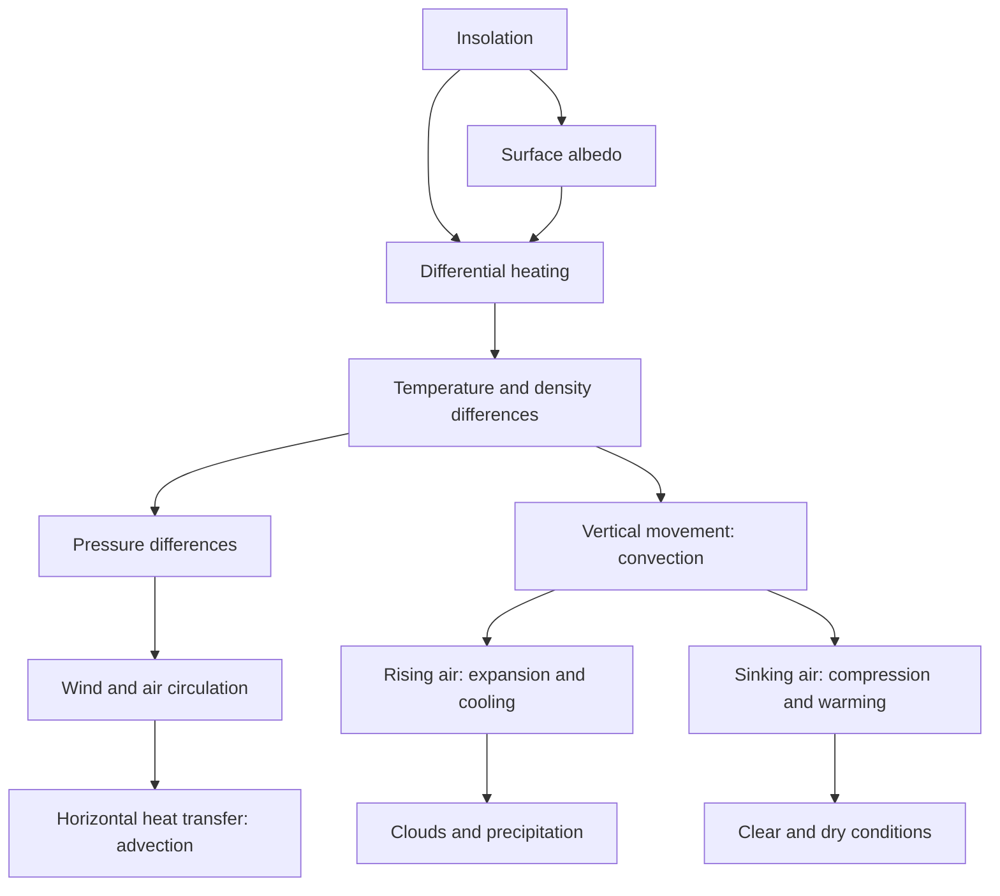

# 03 — Climatology: Atmosphere and Troposphere

> **Date of Lecture:** 25 August 2026 (Lecture 6)  
> **Date Added:** 2026-08-25  
> **Source:** Vajiram & Ravi class lecture + audio transcript + 5 handwritten notebook pages  
> **Topics Covered:** Basic properties of the atmosphere, heat transfer, vertical zonation, troposphere, air circulation, albedo, and adiabatic temperature change

---

## 1. Why the Atmosphere Matters

- The **atmosphere** is a mixture of gases held to the Earth by **gravity**.
- Gravity concentrates most atmospheric mass close to the Earth's surface.
- Traces of atmospheric gases may extend up to **9,000–10,000 km**, but for most practical studies the atmosphere is taken only up to about **400–500 km**, beyond which it becomes increasingly rarefied.

### Distribution of Atmospheric Mass

| Height above surface | Approximate atmospheric mass below it |
|:---:|:---:|
| 5.6 km | 50% |
| 30 km | 97% |
| 40 km | 99% |

> **Core idea:** The atmosphere extends very far, but almost all its mass is concentrated near the Earth's surface.

---

## 2. Heating of the Atmosphere

### 2.1 Direct and Indirect Heating

1. Incoming solar radiation is predominantly **short-wave radiation**.
2. Atmospheric gases do not absorb most short-wave radiation efficiently.
3. The Earth's surface absorbs solar energy and becomes heated.
4. The Earth re-radiates this energy as **long-wave terrestrial radiation**.
5. Atmospheric constituents such as **water vapour and carbon dioxide** absorb long-wave radiation efficiently.

> **Therefore, the atmosphere is heated mainly from below by terrestrial radiation, not directly by sunlight.**

### 2.2 Temperature with Height

Since the Earth's surface is the atmosphere's principal heat source:

- Temperature is generally expected to **decrease with increasing altitude**.
- Nature is complex, so this trend is not universal; temperature increases with altitude in some atmospheric layers because of specific absorption processes.

---

## 3. Atmospheric Heat Transfer

### 3.1 Global Heat Imbalance

- Roughly between **35° N and 35° S**, the Earth has a heat surplus.
- Middle and high latitudes have a heat deficit.
- Atmospheric and oceanic circulation transfer heat from surplus to deficit regions and moderate this imbalance.

| Medium | Approximate share in global heat transfer |
|:---|:---:|
| Atmosphere | 80% |
| World ocean | 20% |

### 3.2 Conduction

> **Conduction:** Transfer of heat from particle to particle while the particles of the medium remain substantially fixed.

- Air is a **poor conductor** and a good insulator.
- Therefore, conduction is generally insignificant in atmospheric heat transfer.
- It becomes locally important in the **lowest layer of air in direct contact with the ground**.
- Example: ground–air conductive exchange contributes to near-surface cooling and **winter fog formation**.

### 3.3 Convection

> **Convection:** Transfer of heat in a fluid through movement of the fluid itself.

- Warm air becomes lighter and rises.
- Cold air becomes denser and sinks.
- This vertical circulation transfers heat and is called a **convection current**.
- Convection plays the major role in atmospheric heat transfer.
- Strong convection is especially characteristic of the intensely heated **lower latitudes**.

### 3.4 Convection and Advection

| Term | Direction of heat transfer | Major natural agent |
|:---|:---:|:---|
| **Convection** | Vertical | Rising or sinking air currents |
| **Advection** | Horizontal | Winds and ocean currents |

### Essential Definitions

- **Wind:** Horizontal movement of air in the atmosphere.
- **Air current:** Vertical movement of air in the atmosphere.
- **Ocean current:** Horizontal movement of surface water in the world ocean.

> Winds and ocean currents are nature's major agents of **advection**.

---

## 4. Vertical Structure of the Atmosphere

The atmosphere can be divided using three independent criteria:

1. **Thermal zonation** — behaviour of temperature with altitude.
2. **Compositional zonation** — changes in the composition and mixing of gases.
3. **Functional zonation** — atmospheric regions performing a distinctive function.

Keeping these schemes separate avoids the ambiguity created when school texts mix thermal, compositional, and functional terms.

---

## 5. Thermal Zonation

| Layer | Approximate altitude | General temperature trend | Main reason |
|:---|:---:|:---:|:---|
| **Troposphere** | Surface to average 13–14 km | Decreases with height | Heating from Earth's surface |
| **Stratosphere** | 13–14 km to 50 km | Increases with height | Ozone absorbs ultraviolet radiation |
| **Mesosphere** | 50 km to 80 km | Decreases with height | Absence of a strong absorbing mechanism |
| **Thermosphere** | Above 80 km | Increases with height | Absorption of high-energy radiation and ionisation |

### 5.1 Atmospheric “Pauses”

The suffix **-pause** identifies a transition between adjacent thermal layers:

- **Tropopause:** Troposphere–stratosphere transition
- **Stratopause:** Stratosphere–mesosphere transition
- **Mesopause:** Mesosphere–thermosphere transition
- **Thermopause:** Sometimes used for the thermosphere's upper transition, but there is no universally fixed upper limit of the atmosphere.

> These are transition **zones**, although diagrams conventionally represent them as sharp lines.

### 5.2 Why Temperature Alternately Falls and Rises

- Where there is no special absorption mechanism, temperature generally **falls with altitude** because the atmosphere is heated chiefly from below.
- In the **stratosphere**, ozone absorbs UV radiation and produces warming with height.
- In the **thermosphere**, absorption and ionisation of high-energy solar radiation cause temperature to rise.

### Terminological Caution

- **Thermosphere** is a thermal term and belongs to thermal zonation.
- **Ionosphere** is a functional term and largely overlaps the thermosphere.
- **Exosphere** refers to the extremely rarefied outermost region; it should not replace “thermosphere” within a strictly temperature-based classification.

---

## 6. Compositional Zonation

| Zone | Approximate extent | Character |
|:---|:---:|:---|
| **Homosphere** | Surface to about 80 km | Gases are relatively well mixed; homogeneity gradually decreases with height |
| **Heterosphere** | Above about 80 km | Gases become increasingly stratified by molecular mass; heavier gases occur lower and lighter gases higher |

- Vigorous circulation keeps the lower atmosphere well mixed.
- The homosphere is not perfectly uniform; mixing is strongest near the surface and gradually weakens upward.

---

## 7. Functional Zonation

| Zone | Function | Broad overlap |
|:---|:---|:---|
| **Ozonosphere** | Ozone absorbs harmful ultraviolet radiation and protects life | Largely the stratosphere |
| **Ionosphere** | Concentration of ionised particles supports radio-wave propagation and communication | Largely the thermosphere |

- Ionised particles also occur outside the thermosphere, but their concentration is greatest there.
- The ionosphere includes sub-layers such as the **D, E, and F regions**.

---

## 8. Troposphere

### 8.1 Meaning and Extent

- The troposphere is the lowest atmospheric layer.
- In it, temperature **generally decreases with altitude**.
- Its upper transition is the **tropopause**.
- Average tropopause height: **13–14 km**.

### 8.2 Latitudinal Variation of Tropopause

| Location | Approximate tropopause height |
|:---|:---:|
| Equator / lower latitudes | 16–18 km |
| Global average | 13–14 km |
| Poles / higher latitudes | 8–10 km |

Thus, the tropopause is:

- Higher over lower latitudes.
- Lower over higher latitudes.
- An inclined and variable transition zone rather than a perfectly level boundary.

### 8.3 Spatial and Temporal Variation

The height of the tropopause varies:

- **Spatially:** From equator to poles and from place to place.
- **Temporally:** At the same place with changes in weather and season.

### 8.4 Why It Is the “Real Atmosphere” for Geographers

The **troposphere** is the principal domain of geographical and meteorological study because:

- Most atmospheric mass, moisture, clouds, and weather phenomena are concentrated near the surface.
- Heat, moisture, and air motion interact primarily in this layer.
- Monsoons, cyclones, precipitation, and most ecological weather controls operate here.

> **Correction of transcript:** The lecture's phrase “atmosphere only means tropopause” is a transcription error; the intended term is **troposphere**.

### 8.5 Aircraft and the Lower Stratosphere

Commercial aircraft commonly cruise near the tropopause or in the **lower stratosphere** because:

- Weather disturbances and vertical convection are weaker.
- Air is more stable.
- Reduced air density lowers drag and improves fuel efficiency, subject to aircraft design and route requirements.

---

## 9. Basics of Air Circulation

> **“Air in a hurry is called wind.”**

### 9.1 Pressure Gradient and Wind

- Atmospheric pressure is not uniformly distributed.
- Air moves horizontally from **high pressure to low pressure**.
- Wind is nature's balancing response to uneven pressure distribution.

### 9.2 Differential Heating: Primary Cause

The main chain is:

```text
Differential heating of Earth's surface
                 ↓
Uneven air temperature and density
                 ↓
Atmospheric pressure differences
                 ↓
Movement of air: wind
```

Basic thermal relationship:

- **High temperature → warm, expanding, rising air → low pressure**
- **Low temperature → cold, dense, sinking air → high pressure**

This is a fundamental tendency, not an absolute rule; Earth's rotation and dynamic atmospheric processes complicate actual pressure patterns.

### 9.3 Causes of Differential Heating

1. **Latitude:** Lower latitudes generally receive more intense insolation than higher latitudes.
2. **Land–water contrast:** Land has lower specific heat and heats/cools faster; water has higher specific heat and heats/cools slowly.
3. **Surface properties:** Forest, grassland, sand, rock, snow, ice, and urban surfaces absorb and reflect different proportions of solar energy.

### 9.4 Role of Earth's Rotation

- Atmospheric motion is further modified by Earth's rotation through the **Coriolis effect**.
- Moving air, ocean water, aircraft, and projectiles are deflected relative to the rotating Earth.

### 9.5 Naming Winds

Winds are named after the **direction from which they originate**:

- **South-westerly wind:** Comes from the south-west.
- **North-easterly wind:** Comes from the north-east.

The origin often indicates the wind's likely temperature and moisture characteristics.

---

## 10. Albedo

### 10.1 Meaning

- The term **albedo** comes from the Latin *albus*, meaning **white**.
- It indicates the reflectivity of a surface.

> **Albedo:** Percentage of incident solar energy reflected by a surface.

`Albedo (%) = (Reflected solar radiation ÷ Incident solar radiation) × 100`

### 10.2 Illustrative Values from the Lecture

| Surface | Approximate albedo |
|:---|:---:|
| Fresh snow | Up to about 90% |
| Snow and ice surfaces | 70–90% in the lecture's broad illustration |
| Clouds | 50–70%, varying by cloud type |
| Tar / bituminous road | 5–10% |
| Earth: average planetary albedo | About 30–35% (roughly one-third) |

> Actual values vary with age, thickness, moisture, angle of the Sun, cloud type, and wavelength. Bare glacial ice can have a substantially lower albedo than fresh snow.

### 10.3 Earth and Moon

- Earth's relatively high planetary albedo results substantially from its **clouds, atmosphere, snow, ice, and varied surface cover**.
- The Moon lacks an atmosphere and clouds and therefore has a much lower albedo.
- The lecture quoted **7–8%** for the Moon; standard modern estimates put the Moon's Bond albedo closer to **11–12%**.

### 10.4 Snow–Ice Albedo Feedback

```text
Global warming
      ↓
Melting of snow and sea ice
      ↓
Exposure of darker land/ocean
      ↓
Lower albedo and greater solar absorption
      ↓
Further warming and melting
```

- This is a **positive feedback**: an initial effect amplifies its original cause.
- In the Arctic, the process contributes to **Arctic amplification**.
- High-latitude regions therefore act as sensitive indicators or “barometers” of climate change.
- Snow blindness is associated with intense solar reflection from bright snow surfaces, especially strong UV exposure.

---

## 11. Adiabatic Change in Temperature

### 11.1 Definition

> **Adiabatic temperature change:** A change in a body's temperature without significant transfer of heat between it and its surroundings.

- Air is a poor conductor.
- A moving air parcel exchanges relatively little heat with surrounding air over short periods.
- Its temperature can nevertheless change because pressure and volume change.

### 11.2 Column of Air

> **Column of air:** The vertical body of atmosphere over a particular area, having a characteristic identity in terms of temperature, moisture, and related properties.

- Air that remains over a large, relatively uniform surface develops characteristics influenced by that surface.
- Example: air over the Sahara differs from air over the Atlantic Ocean.
- Atmospheric stability is studied by comparing a parcel or column with surrounding air at the same height.

### 11.3 Golden Rule 1: Rising Air Cools

```text
Warm air is lighter
        ↓
Air rises
        ↓
Pressure decreases with altitude
        ↓
Air expands and uses internal energy
        ↓
Air cools adiabatically
```

> **Rising air expands and cools adiabatically.**

Consequences:

- Cooling may bring air to saturation.
- Condensation can produce clouds and precipitation.
- This principle is fundamental to understanding convection, monsoons, and cyclones.

### 11.4 Golden Rule 2: Sinking Air Warms

```text
Cold air is denser
        ↓
Air sinks
        ↓
Pressure increases downward
        ↓
Air is compressed
        ↓
Air warms adiabatically
```

> **Sinking air is compressed and warms adiabatically.**

Consequences:

- Relative humidity falls as air warms.
- Cloud formation is suppressed.
- Persistent subsidence favours clear skies and may contribute to arid or desert conditions.

### 11.5 Atmospheric Significance

| Vertical motion | Pressure/volume change | Temperature change | Typical outcome |
|:---|:---|:---|:---|
| Rising air | Pressure falls; air expands | Adiabatic cooling | Clouds, precipitation, greater ecological productivity |
| Sinking air | Pressure rises; air compresses | Adiabatic warming | Clear skies, dryness, possible desert conditions |

---

## 12. Conceptual Links



---

## 13. UPSC Quick Recall

1. Atmosphere is a mixture of gases held to Earth by gravity.
2. About 50% of atmospheric mass lies below 5.6 km, 97% below 30 km, and 99% below 40 km.
3. Atmosphere is heated mainly by Earth's long-wave radiation, not direct short-wave sunlight.
4. Air is a poor conductor; conduction matters mainly near the ground.
5. Convection = vertical heat transfer; advection = horizontal heat transfer.
6. Wind and ocean currents are major agents of advection.
7. Thermal layers: Troposphere → Stratosphere → Mesosphere → Thermosphere.
8. Stratospheric warming is linked to ozone absorption; thermospheric warming to high-energy absorption and ionisation.
9. Homosphere extends broadly to 80 km; heterosphere lies above it.
10. Ozonosphere largely overlaps the stratosphere; ionosphere largely overlaps the thermosphere.
11. Tropopause averages 13–14 km, rising to 16–18 km near the equator and falling to 8–10 km near the poles.
12. The troposphere is the geographer's “real atmosphere” because most weather and moisture occur there.
13. Wind flows from high to low pressure and is named by its direction of origin.
14. Differential heating is the primary driver of pressure differences and wind.
15. Albedo is the percentage of incident solar radiation reflected by a surface.
16. Snow–ice loss lowers albedo and creates a positive feedback that contributes to Arctic amplification.
17. Rising air expands and cools adiabatically.
18. Sinking air compresses and warms adiabatically.
19. Rising air favours clouds and precipitation; sinking air favours clear, dry conditions.

---

<!-- 2026-08-25: Created from Geography Lecture 6 transcript and five handwritten notebook pages. -->
