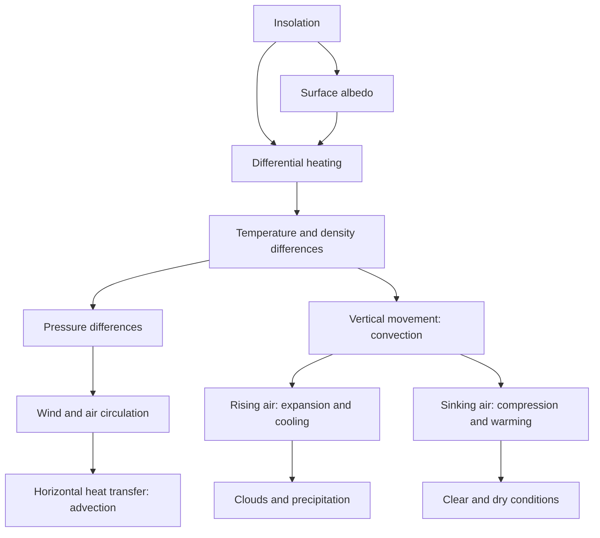

# 03 — Climatology: Atmosphere and Troposphere

> **Dates of Lecture:** 25 August 2026 (Lecture 6) + **29 August 2026 (Lecture 7)** + **31 August 2026 (Lecture 8)**  
> **Date Added:** 2026-08-25; Lecture 7 added **2026-08-29**; Lecture 8 added **2026-08-31**  
> **Source:** Vajiram & Ravi class lecture + audio transcript + handwritten notebook pages (5 pages on 25/8; 6 pages on 29/8; 3 pages on 31/8)  
> **Topics Covered:** Atmosphere basics, heat transfer, zonation, troposphere, albedo, adiabatic change (L6); **ELR / NLR, temperature inversion, tropopause height & paradox, weather-sphere lid, isothermal zone / aviation, Earth's rotation & speed (L7)**; **three forces on near-surface air — Pressure Gradient Force (PGF), Coriolis, friction (L8)**

### Lecture 6 — 25 August 2026

---

## 1. Why the Atmosphere Matters

- The **atmosphere** is a mixture of gases held to the Earth by **gravity**.
- Gravity concentrates most atmospheric mass close to the Earth's surface.
- Traces of atmospheric gases may extend up to **9,000–10,000 km**, but for most practical studies the atmosphere is taken only up to about **400–500 km**, beyond which it becomes increasingly rarefied.

### Distribution of Atmospheric Mass

| Height above surface | Approximate atmospheric mass below it |
|:---:|:---:|
| 5.6 km | 50% |
| 30 km | 97% |
| 40 km | 99% |

> **Core idea:** The atmosphere extends very far, but almost all its mass is concentrated near the Earth's surface.

---

## 2. Heating of the Atmosphere

### 2.1 Direct and Indirect Heating

1. Incoming solar radiation is predominantly **short-wave radiation**.
2. Atmospheric gases do not absorb most short-wave radiation efficiently.
3. The Earth's surface absorbs solar energy and becomes heated.
4. The Earth re-radiates this energy as **long-wave terrestrial radiation**.
5. Atmospheric constituents such as **water vapour and carbon dioxide** absorb long-wave radiation efficiently.

> **Therefore, the atmosphere is heated mainly from below by terrestrial radiation, not directly by sunlight.**

### 2.2 Temperature with Height

Since the Earth's surface is the atmosphere's principal heat source:

- Temperature is generally expected to **decrease with increasing altitude**.
- Nature is complex, so this trend is not universal; temperature increases with altitude in some atmospheric layers because of specific absorption processes.

---

## 3. Atmospheric Heat Transfer

### 3.1 Global Heat Imbalance

- Roughly between **35° N and 35° S**, the Earth has a heat surplus.
- Middle and high latitudes have a heat deficit.
- Atmospheric and oceanic circulation transfer heat from surplus to deficit regions and moderate this imbalance.

| Medium | Approximate share in global heat transfer |
|:---|:---:|
| Atmosphere | 80% |
| World ocean | 20% |

### 3.2 Conduction

> **Conduction:** Transfer of heat from particle to particle while the particles of the medium remain substantially fixed.

- Air is a **poor conductor** and a good insulator.
- Therefore, conduction is generally insignificant in atmospheric heat transfer.
- It becomes locally important in the **lowest layer of air in direct contact with the ground**.
- Example: ground–air conductive exchange contributes to near-surface cooling and **winter fog formation**.

### 3.3 Convection

> **Convection:** Transfer of heat in a fluid through movement of the fluid itself.

- Warm air becomes lighter and rises.
- Cold air becomes denser and sinks.
- This vertical circulation transfers heat and is called a **convection current**.
- Convection plays the major role in atmospheric heat transfer.
- Strong convection is especially characteristic of the intensely heated **lower latitudes**.

### 3.4 Convection and Advection

| Term | Direction of heat transfer | Major natural agent |
|:---|:---:|:---|
| **Convection** | Vertical | Rising or sinking air currents |
| **Advection** | Horizontal | Winds and ocean currents |

### Essential Definitions

- **Wind:** Horizontal movement of air in the atmosphere.
- **Air current:** Vertical movement of air in the atmosphere.
- **Ocean current:** Horizontal movement of surface water in the world ocean.

> Winds and ocean currents are nature's major agents of **advection**.

---

## 4. Vertical Structure of the Atmosphere

The atmosphere can be divided using three independent criteria:

1. **Thermal zonation** — behaviour of temperature with altitude.
2. **Compositional zonation** — changes in the composition and mixing of gases.
3. **Functional zonation** — atmospheric regions performing a distinctive function.

Keeping these schemes separate avoids the ambiguity created when school texts mix thermal, compositional, and functional terms.

---

## 5. Thermal Zonation

| Layer | Approximate altitude | General temperature trend | Main reason |
|:---|:---:|:---:|:---|
| **Troposphere** | Surface to average 13–14 km | Decreases with height | Heating from Earth's surface |
| **Stratosphere** | 13–14 km to 50 km | Increases with height | Ozone absorbs ultraviolet radiation |
| **Mesosphere** | 50 km to 80 km | Decreases with height | Absence of a strong absorbing mechanism |
| **Thermosphere** | Above 80 km | Increases with height | Absorption of high-energy radiation and ionisation |

### 5.1 Atmospheric “Pauses”

The suffix **-pause** identifies a transition between adjacent thermal layers:

- **Tropopause:** Troposphere–stratosphere transition
- **Stratopause:** Stratosphere–mesosphere transition
- **Mesopause:** Mesosphere–thermosphere transition
- **Thermopause:** Sometimes used for the thermosphere's upper transition, but there is no universally fixed upper limit of the atmosphere.

> These are transition **zones**, although diagrams conventionally represent them as sharp lines.

### 5.2 Why Temperature Alternately Falls and Rises

- Where there is no special absorption mechanism, temperature generally **falls with altitude** because the atmosphere is heated chiefly from below.
- In the **stratosphere**, ozone absorbs UV radiation and produces warming with height.
- In the **thermosphere**, absorption and ionisation of high-energy solar radiation cause temperature to rise.

### Terminological Caution

- **Thermosphere** is a thermal term and belongs to thermal zonation.
- **Ionosphere** is a functional term and largely overlaps the thermosphere.
- **Exosphere** refers to the extremely rarefied outermost region; it should not replace “thermosphere” within a strictly temperature-based classification.

---

## 6. Compositional Zonation

| Zone | Approximate extent | Character |
|:---|:---:|:---|
| **Homosphere** | Surface to about 80 km | Gases are relatively well mixed; homogeneity gradually decreases with height |
| **Heterosphere** | Above about 80 km | Gases become increasingly stratified by molecular mass; heavier gases occur lower and lighter gases higher |

- Vigorous circulation keeps the lower atmosphere well mixed.
- The homosphere is not perfectly uniform; mixing is strongest near the surface and gradually weakens upward.

---

## 7. Functional Zonation

| Zone | Function | Broad overlap |
|:---|:---|:---|
| **Ozonosphere** | Ozone absorbs harmful ultraviolet radiation and protects life | Largely the stratosphere |
| **Ionosphere** | Concentration of ionised particles supports radio-wave propagation and communication | Largely the thermosphere |

- Ionised particles also occur outside the thermosphere, but their concentration is greatest there.
- The ionosphere includes sub-layers such as the **D, E, and F regions**.

---

## 8. Troposphere

### 8.1 Meaning and Extent

- The troposphere is the lowest atmospheric layer.
- In it, temperature **generally decreases with altitude**.
- Its upper transition is the **tropopause**.
- Average tropopause height: **13–14 km**.

### 8.2 Latitudinal Variation of Tropopause

| Location | Approximate tropopause height |
|:---|:---:|
| Equator / lower latitudes | 16–18 km |
| Global average | 13–14 km |
| Poles / higher latitudes | 8–10 km |

Thus, the tropopause is:

- Higher over lower latitudes.
- Lower over higher latitudes.
- An inclined and variable transition zone rather than a perfectly level boundary.

### 8.3 Spatial and Temporal Variation

The height of the tropopause varies:

- **Spatially:** From equator to poles and from place to place.
- **Temporally:** At the same place with changes in weather and season.

### 8.4 Why It Is the “Real Atmosphere” for Geographers

The **troposphere** is the principal domain of geographical and meteorological study because:

- Most atmospheric mass, moisture, clouds, and weather phenomena are concentrated near the surface.
- Heat, moisture, and air motion interact primarily in this layer.
- Monsoons, cyclones, precipitation, and most ecological weather controls operate here.

> **Correction of transcript:** The lecture's phrase “atmosphere only means tropopause” is a transcription error; the intended term is **troposphere**.

### 8.5 Aircraft and the Lower Stratosphere

Commercial aircraft commonly cruise near the tropopause or in the **lower stratosphere** because:

- Weather disturbances and vertical convection are weaker.
- Air is more stable.
- Reduced air density lowers drag and improves fuel efficiency, subject to aircraft design and route requirements.

---

## 9. Basics of Air Circulation

> **“Air in a hurry is called wind.”**

### 9.1 Pressure Gradient and Wind

- Atmospheric pressure is not uniformly distributed.
- Air moves horizontally from **high pressure to low pressure**.
- Wind is nature's balancing response to uneven pressure distribution.

### 9.2 Differential Heating: Primary Cause

The main chain is:

```text
Differential heating of Earth's surface
                 ↓
Uneven air temperature and density
                 ↓
Atmospheric pressure differences
                 ↓
Movement of air: wind
```

Basic thermal relationship:

- **High temperature → warm, expanding, rising air → low pressure**
- **Low temperature → cold, dense, sinking air → high pressure**

This is a fundamental tendency, not an absolute rule; Earth's rotation and dynamic atmospheric processes complicate actual pressure patterns.

### 9.3 Causes of Differential Heating

1. **Latitude:** Lower latitudes generally receive more intense insolation than higher latitudes.
2. **Land–water contrast:** Land has lower specific heat and heats/cools faster; water has higher specific heat and heats/cools slowly.
3. **Surface properties:** Forest, grassland, sand, rock, snow, ice, and urban surfaces absorb and reflect different proportions of solar energy.

### 9.4 Role of Earth's Rotation

- Atmospheric motion is further modified by Earth's rotation through the **Coriolis effect**.
- Moving air, ocean water, aircraft, and projectiles are deflected relative to the rotating Earth.

### 9.5 Naming Winds

Winds are named after the **direction from which they originate**:

- **South-westerly wind:** Comes from the south-west.
- **North-easterly wind:** Comes from the north-east.

The origin often indicates the wind's likely temperature and moisture characteristics.

---

## 10. Albedo

### 10.1 Meaning

- The term **albedo** comes from the Latin *albus*, meaning **white**.
- It indicates the reflectivity of a surface.

> **Albedo:** Percentage of incident solar energy reflected by a surface.

`Albedo (%) = (Reflected solar radiation ÷ Incident solar radiation) × 100`

### 10.2 Illustrative Values from the Lecture

| Surface | Approximate albedo |
|:---|:---:|
| Fresh snow | Up to about 90% |
| Snow and ice surfaces | 70–90% in the lecture's broad illustration |
| Clouds | 50–70%, varying by cloud type |
| Tar / bituminous road | 5–10% |
| Earth: average planetary albedo | About 30–35% (roughly one-third) |

> Actual values vary with age, thickness, moisture, angle of the Sun, cloud type, and wavelength. Bare glacial ice can have a substantially lower albedo than fresh snow.

### 10.3 Earth and Moon

- Earth's relatively high planetary albedo results substantially from its **clouds, atmosphere, snow, ice, and varied surface cover**.
- The Moon lacks an atmosphere and clouds and therefore has a much lower albedo.
- The lecture quoted **7–8%** for the Moon; standard modern estimates put the Moon's Bond albedo closer to **11–12%**.

### 10.4 Snow–Ice Albedo Feedback

```text
Global warming
      ↓
Melting of snow and sea ice
      ↓
Exposure of darker land/ocean
      ↓
Lower albedo and greater solar absorption
      ↓
Further warming and melting
```

- This is a **positive feedback**: an initial effect amplifies its original cause.
- In the Arctic, the process contributes to **Arctic amplification**.
- High-latitude regions therefore act as sensitive indicators or “barometers” of climate change.
- Snow blindness is associated with intense solar reflection from bright snow surfaces, especially strong UV exposure.

---

## 11. Adiabatic Change in Temperature

### 11.1 Definition

> **Adiabatic temperature change:** A change in a body's temperature without significant transfer of heat between it and its surroundings.

- Air is a poor conductor.
- A moving air parcel exchanges relatively little heat with surrounding air over short periods.
- Its temperature can nevertheless change because pressure and volume change.

### 11.2 Column of Air

> **Column of air:** The vertical body of atmosphere over a particular area, having a characteristic identity in terms of temperature, moisture, and related properties.

- Air that remains over a large, relatively uniform surface develops characteristics influenced by that surface.
- Example: air over the Sahara differs from air over the Atlantic Ocean.
- Atmospheric stability is studied by comparing a parcel or column with surrounding air at the same height.

### 11.3 Golden Rule 1: Rising Air Cools

```text
Warm air is lighter
        ↓
Air rises
        ↓
Pressure decreases with altitude
        ↓
Air expands and uses internal energy
        ↓
Air cools adiabatically
```

> **Rising air expands and cools adiabatically.**

Consequences:

- Cooling may bring air to saturation.
- Condensation can produce clouds and precipitation.
- This principle is fundamental to understanding convection, monsoons, and cyclones.

### 11.4 Golden Rule 2: Sinking Air Warms

```text
Cold air is denser
        ↓
Air sinks
        ↓
Pressure increases downward
        ↓
Air is compressed
        ↓
Air warms adiabatically
```

> **Sinking air is compressed and warms adiabatically.**

Consequences:

- Relative humidity falls as air warms.
- Cloud formation is suppressed.
- Persistent subsidence favours clear skies and may contribute to arid or desert conditions.

### 11.5 Atmospheric Significance

| Vertical motion | Pressure/volume change | Temperature change | Typical outcome |
|:---|:---|:---|:---|
| Rising air | Pressure falls; air expands | Adiabatic cooling | Clouds, precipitation, greater ecological productivity |
| Sinking air | Pressure rises; air compresses | Adiabatic warming | Clear skies, dryness, possible desert conditions |

---

## 12. Conceptual Links



---

## 13. UPSC Quick Recall

1. Atmosphere is a mixture of gases held to Earth by gravity.
2. About 50% of atmospheric mass lies below 5.6 km, 97% below 30 km, and 99% below 40 km.
3. Atmosphere is heated mainly by Earth's long-wave radiation, not direct short-wave sunlight.
4. Air is a poor conductor; conduction matters mainly near the ground.
5. Convection = vertical heat transfer; advection = horizontal heat transfer.
6. Wind and ocean currents are major agents of advection.
7. Thermal layers: Troposphere → Stratosphere → Mesosphere → Thermosphere.
8. Stratospheric warming is linked to ozone absorption; thermospheric warming to high-energy absorption and ionisation.
9. Homosphere extends broadly to 80 km; heterosphere lies above it.
10. Ozonosphere largely overlaps the stratosphere; ionosphere largely overlaps the thermosphere.
11. Tropopause averages 13–14 km, rising to 16–18 km near the equator and falling to 8–10 km near the poles.
12. The troposphere is the geographer's “real atmosphere” because most weather and moisture occur there.
13. Wind flows from high to low pressure and is named by its direction of origin.
14. Differential heating is the primary driver of pressure differences and wind.
15. Albedo is the percentage of incident solar radiation reflected by a surface.
16. Snow–ice loss lowers albedo and creates a positive feedback that contributes to Arctic amplification.
17. Rising air expands and cools adiabatically.
18. Sinking air compresses and warms adiabatically.
19. Rising air favours clouds and precipitation; sinking air favours clear, dry conditions.

---

# Lecture 7 — 29 August 2026

> Continues Lecture 6. Four questions the class was collecting tools for: (1) why tropopause height varies, (2) why the troposphere is the geographer's real atmosphere, (3) why it is named *troposphere*, (4) why the lower stratosphere is the ideal flying zone. Then the first two *pieces* of the **tropospheric air-circulation** puzzle (Lectures 8–10).

**How to read class shortcuts:** **ELR** = Environmental Lapse Rate; **NLR** = Normal Lapse Rate. Full forms on first use; glossary at the end of this lecture block.

---

## 14. Environmental Lapse Rate and Normal Lapse Rate (GEO-06-01)

**Lapse** in English = decline. In the atmosphere we quantify *how fast* temperature falls with height. That rate depends on the **local weather**, so it is a tool for comparing weather, not a single worldwide constant.

### 14.1 Environmental Lapse Rate (ELR)

> **ELR:** the **actual** rate of decline of temperature with increase in height in the atmosphere at a **particular place and time**, under **local weather conditions**.

- If you could go up over Karol Bagh at 4 pm and measure it, that observed value is today's ELR there.
- Change the **place** (Delhi vs Chennai — inland vs coast) → ELR changes. That is **spatial** variation.
- Change the **time** (afternoon vs 7 pm, or summer vs winter) at the same place → ELR changes. That is **temporal** variation.

> **ELR has lots of spatial and temporal variations.** It is the *weather-department* number, not the GS average.

### 14.2 Normal Lapse Rate (NLR)

A GS student does not need every local sounding. Scientists averaged ELRs of many places and many years.

> **NLR:** the **average** of the ELR. Generally estimated as a decline of about **6.5 °C per km** rise in the atmosphere.

- Keyword in ELR = **actual**. Keyword in NLR = **average**.
- On a given day the ELR may be less than, close to, or more than 6.5 °C/km — same logic as an “expected exam score” vs the score you actually get.

| | ELR | NLR |
|:---|:---|:---|
| Meaning | Observed lapse *here, now* | Long-run average of ELRs |
| Value | Varies in space and time | **~6.5 °C / km** |
| Use | Weather / sounding | GS baseline (“what do I expect if I go up?”) |

---

## 15. Temperature Inversion — and What It Is *Not* (GEO-06-02)

Routine: temperature **falls** with height (ELR). Special case: it **rises**.

> **Temperature inversion:** an atmospheric condition in which, with increase in height, there is an **increase** in temperature rather than the usual ELR decline.

**Inversion** in English = the opposite of what you expect. You expect decline; you get rise.

### 15.1 Do not confuse inversion with stratosphere / thermosphere

Last lecture: temperature **rises** with height in the **stratosphere** (ozone absorbs ultraviolet) and in the **thermosphere** (ionisation / high-energy absorption). That is **not** called inversion.

| Layer | Temperature rises with height because… | Inversion? |
|:---|:---|:---|
| **Stratosphere** | Ozone (O₃) — you *expect* warming, and you *get* warming | **No** |
| **Thermosphere** | Ionisation — you *expect* warming, and you *get* warming | **No** |
| **Troposphere** (usual) | Heated from below → ELR decline | — |
| **Troposphere** (special) | You expect decline, you get rise | **Yes** |

> **Temperature inversion as a phenomenon primarily relates to the troposphere.**

**Why “primarily”, not “only”?** Two reasons from class:

1. Nature is complex — never make an absolute statement.
2. Of the 6–7 inversion examples coming in this course, **all but one** sit inside the troposphere. The **first** example (today) is the exception: inversion **across the tropopause** (cold tropospheric top under a warmer lower stratosphere). Writing “only troposphere” would be caught by that one case.

---

## 16. Why Tropopause Height Varies — and the Apparent Paradox (GEO-06-03)

Redraw the Lecture 6 wedge. Average tropopause **13–14 km**; **16–18 km** over the equator; **8–10 km** over the poles. The tropopause is an **inclined** transition, not a flat lid.

<div style="overflow-x:auto;">
<svg xmlns="http://www.w3.org/2000/svg" viewBox="0 0 520 272" role="img" aria-label="Tropopause higher and colder over the equator than over the North Pole" style="display:block;margin:0 auto;width:100%;min-width:340px;max-width:560px;font-family:system-ui,Segoe UI,Arial,sans-serif;">
<rect x="8" y="8" width="504" height="256" fill="#f8fafc" stroke="#94a3b8" stroke-width="1"/>
<text x="260" y="28" text-anchor="middle" font-size="13" font-weight="700" fill="#0f172a">Tropopause = lid of the weather sphere</text>
<ellipse cx="360" cy="48" rx="118" ry="16" fill="#e0f2fe" stroke="#0284c7" stroke-width="1"/>
<text x="360" y="52" text-anchor="middle" font-size="11" fill="#0369a1">Isothermal zone (lower stratosphere)</text>
<line x1="48" y1="200" x2="472" y2="200" stroke="#334155" stroke-width="2"/>
<text x="68" y="218" font-size="12" fill="#0f172a">N. Pole</text>
<text x="418" y="218" font-size="12" fill="#0f172a">Equator</text>
<polygon points="70,196 70,164 448,88 448,196" fill="#dcfce7" stroke="#166534" stroke-width="1"/>
<line x1="70" y1="164" x2="448" y2="88" stroke="#1d4ed8" stroke-width="2.5"/>
<text x="230" y="118" font-size="12" font-weight="700" fill="#1d4ed8">Tropopause</text>
<text x="84" y="156" font-size="11" fill="#1e3a8a">8–10 km</text>
<text x="84" y="142" font-size="11" fill="#b91c1c">-45 C</text>
<text x="392" y="80" font-size="11" fill="#1e3a8a">16–18 km</text>
<text x="392" y="66" font-size="11" fill="#b91c1c">-80 C</text>
<text x="200" y="178" font-size="12" fill="#166534">Troposphere = weather sphere</text>
<text x="36" y="242" font-size="11" fill="#475569">Stronger convection: air rises higher, lapse seen to greater height, tropopause higher and colder.</text>
<text x="36" y="258" font-size="11" fill="#475569">Weaker convection toward poles: tropopause lower and less cold at its top.</text>
</svg>
</div>

### 16.1 Why the equator’s tropopause is higher

Lower latitudes are the most intensely heated belt (Sun stays between the tropics; rays at a **higher angle** → thinner atmospheric path + energy concentrated on a smaller area). So they have **very strong convectional currents**.

- **Warmer the air, higher it rises.**
- As warm air rises it is **adiabatically cooled** (expansion).
- Therefore the decline of temperature is seen up to **greater elevations** over the lower latitudes — in particular over the equator, generally **16–18 km**.
- As we go higher in latitude, convection gets weaker — warm air rises only to a **lower** elevation. Decline of temperature is seen only up to **8–10 km** over the poles.

This is the **spatial** variation of tropopause height. PYQ (Previous Year Question) theme (asked about three times): *why is tropopause higher over the equator?*

### 16.2 Temporal variation

What decides the height is **convection**. Convection at a given place also changes with time (cloud cover, season).

- **Summer** = stronger convection → **higher** tropopause at that place.
- Winter / weaker heating → lower tropopause.

So tropopause height varies **spatially** (place to place) **and temporally** (at one place).

### 16.3 Apparent paradox (exam line)

At tropopause height:

| Place | Height | Typical temperature |
|:---|:---|:---|
| Equator (hottest surface) | 16–18 km | about **−80 °C** |
| Poles (coldest surface) | 8–10 km | about **−45 °C** |

> It is **apparently** a paradox that the **lowest temperature in the troposphere** is vertically overhead at the **equator**, rather than at the poles.

It is only *apparent*. Equatorial air rises farther, so it is cooled through more kilometres. −80 °C vs −45 °C is therefore **logically explained**, not a real contradiction.

### 16.4 Coldest place in the *whole* atmosphere

- Coldest **in the troposphere** = tropopause over the equator (~ −80 °C).
- Coldest **in the entire atmosphere** = **mesopause** (top of the mesosphere, ~90–100 km): generally **−90 °C to −100 °C** (remember ~ −95 °C).

---

## 17. Why the Troposphere Is the Real Atmosphere (GEO-06-04)

We study the atmosphere in geography to understand **weather** (weathering of rocks, soils, agriculture all need it).

- Most of what comprises weather (say **clouds**) remains confined within the troposphere.
- Science therefore calls the troposphere the **weather sphere** of nature.
- If the subject-matter (weather) lives here, **this** is the geographer’s real atmosphere.

**Practical evidence:** after take-off a civil aircraft is climbed above the tropopause; from the window the flight level is generally clear and the **clouds lie beneath**. Most clouds, most of the time, are inside the troposphere.

**Not absolute:** some weather can enter the stratosphere. Later: **jet streams** (high-velocity upper-tropospheric winds, typically **west → east**, ~100–400+ km/h) can **puncture** the tropopause at places and carry cloud / weather elements upward. *Generally*, the tropopause still holds.

### 17.1 Tropopause as the “lid”

The tropopause is the **lid** of the tropospheric container. It generally does **not** allow weather elements (clouds) into the stratosphere.

**Why the lid works — first inversion example (the exception):**

1. Air near the surface is warmed by Earth’s **out-radiation** (atmosphere heated from below).
2. Warm air rises and is adiabatically cooled. Just **beneath** the tropopause it is very cold (−80 °C equator, −45 °C poles, maybe ~ −60 °C in mid-latitudes).
3. The **stratosphere** above is warmer because **ozone** absorbs ultraviolet.
4. Crossing the tropopause, height increases and temperature **increases** → **temperature inversion**.
5. **Cold air under warm air cannot rise.** Warm air is what rises. So weather stays trapped below the lid.

```text
Surface: out-radiation warms air
        ↓ convection (rise + adiabatic cooling)
Cold top of troposphere  (−80 °C / −45 °C)
        ── tropopause (inversion) ──
Warmer lower stratosphere (ozone)
        ↓
Cold-under-warm = stable lid → weather confined
```

---

## 18. Why “Troposphere”? Air Keeps Turning (GEO-06-05)

*Tropos* in Latin → **turn**.

1. Air near the Earth’s surface gets warm by Earth’s out-radiation.
2. As warm air rises, it gets **adiabatically cooled**.
3. This cold air **cannot go beyond the tropopause**, so it sinks.
4. As it sinks it gets **adiabatically warmed** (compression). Near the surface it is also warmed again by out-radiation.
5. This warm air rises again.

> The troposphere is the zone of the atmosphere in which **air keeps turning itself**.

(Cloud formation comes later — do not jump ahead.)

---

## 19. Isothermal Zone and Why Aircraft Fly There (GEO-06-06)

Three possibilities as you go up:

| With height, temperature… | Name |
|:---|:---|
| Falls | ELR / routine lapse |
| Rises | Inversion |
| Stays **almost constant** for several km | **Isothermal** (*iso* = same, *thermal* = temperature) |

An isothermal patch *can* appear anywhere, anytime (weather is *n* elements in changing permutations). For General Studies, the **more-or-less permanent** case is:

> The **lower stratosphere**, just above the tropopause (a vertical slab of roughly **6–8 km**), generally represents isothermal conditions. That slab is the **isothermal zone**.

**Why it is isothermal (two sides):**

- Temperature does **not decrease much** — there is **not much convection** here (the tropopause lid has already stopped most rising air).
- Temperature does **not increase much** — there is **not much ozone** here. Most stratospheric ozone starts around **~25–26 km**, not in this lowest stratospheric slab.

**Trap:** “with increase in **height**”. Iso-thermal is a **vertical** statement. There is **no** constancy of temperature if you fly *horizontally* from India to Europe.

### 19.1 Three reasons this zone is ideal for aircraft

1. **In general, the absence of clouds** — visibility + avoid thunder/lightning. (Low / middle / high / **vertically developed** clouds, e.g. tropical-cyclone towers 15–16 km, all live mainly in the troposphere.)
2. **In general, the absence of strong convectional currents** — smoother ride; tropopause already boxed the strong convection in. Avoid tropical-cyclone convection as a safety hazard.
3. **In general, the presence of isothermal conditions** — less vertical change of temperature → less turbulence. Horizontal change still exists; vertical change is muted, so the ride is smoother than in the troposphere.

After climb-out, the aircraft is typically put on auto; this is why long-haul crews can rest (one at a time). UPSC will ask the **three technical reasons**, not the crew-rest anecdote.

**Coming later (not a finished topic today):** upper-tropospheric **westerlies** and their fast cores (**jet streams**, ~100–400+ km/h, west → east). Westbound vs eastbound routing can use or avoid that push. **Rossby waves**, monsoon, tropical / temperate cyclones, El Niño / La Niña, Indian Ocean Dipole, Madden–Julian Oscillation, polar vortex — all are **circulation systems**. Prerequisite = **tropospheric air circulation** (Lectures 8–10). Treat today’s rotation notes as puzzle pieces, not the finished picture.

---

## 20. Earth’s Rotation: Three Perspectives and Two Speeds (GEO-06-07)

Title for the next block of classes: **Tropospheric air circulations.** First pieces collected today.

### 20.1 Direction — three perspectives

School said “Earth rotates **west to east**.” That is only one way of looking.

| Perspective | How you look | What you see |
|:---|:---|:---|
| **Equatorial** | Through the equator (the school view) | **West → East** |
| **North Pole** | From above the North Pole | **Anti-clockwise** |
| **South Pole** | From above the South Pole | **Clockwise** |

There is no east/west *at the pole* — only a sense of spin. North-Pole / anti-clockwise will be used in the next lecture.

### 20.2 Angular speed — uniform

Earth spins once in **24 hours**. Every place turns **360°** in that time.

<div style="text-align:center;margin:12px 0;padding:12px 10px;background:#f1f5f9;border-radius:8px;font-size:16px;line-height:1.45">
<strong>Angular speed</strong> = 360° ÷ 24 h = <strong>15°/h</strong>
</div>

**Uniform** for every place on Earth.

### 20.3 Rotational (linear) speed — not uniform

<div style="text-align:center;margin:12px 0;padding:12px 10px;background:#f1f5f9;border-radius:8px;font-size:16px;line-height:1.45">
<strong>Rotational speed</strong> = distance travelled ÷ time taken
</div>

Time is the same (24 h) everywhere. Distance along a parallel is **not**.

<div style="overflow-x:auto;">
<svg xmlns="http://www.w3.org/2000/svg" viewBox="0 0 480 300" role="img" aria-label="Parallels shrink toward the pole so linear rotational speed falls from equator to pole" style="display:block;margin:0 auto;width:100%;min-width:320px;max-width:520px;font-family:system-ui,Segoe UI,Arial,sans-serif;">
<rect x="8" y="8" width="464" height="284" fill="#f8fafc" stroke="#94a3b8" stroke-width="1"/>
<text x="240" y="30" text-anchor="middle" font-size="13" font-weight="700" fill="#0f172a">Linear speed falls toward the poles</text>
<circle cx="148" cy="160" r="96" fill="#e0f2fe" stroke="#0369a1" stroke-width="1.5"/>
<line x1="52" y1="160" x2="244" y2="160" stroke="#0f172a" stroke-width="1.5"/>
<line x1="56" y1="128" x2="240" y2="128" stroke="#334155" stroke-width="1"/>
<line x1="72" y1="100" x2="224" y2="100" stroke="#334155" stroke-width="1"/>
<line x1="100" y1="78" x2="196" y2="78" stroke="#334155" stroke-width="1"/>
<line x1="126" y1="70" x2="170" y2="70" stroke="#334155" stroke-width="1"/>
<text x="262" y="164" font-size="12" fill="#0f172a">0° Eq — P1 D1 S1</text>
<text x="262" y="132" font-size="12" fill="#0f172a">20°N — P2 D2 S2</text>
<text x="262" y="104" font-size="12" fill="#0f172a">40°N — P3 D3 S3</text>
<text x="262" y="82" font-size="12" fill="#0f172a">60°N — P4 D4 S4</text>
<text x="262" y="68" font-size="12" fill="#0f172a">80°N — P5 D5 S5</text>
<text x="28" y="248" font-size="12" fill="#475569">P = parallel. D = distance travelled in 24 h.</text>
<text x="28" y="268" font-size="12" fill="#475569">S = linear rotational speed. Time = 24 h at every latitude.</text>
</svg>
</div>

Earth is spherical → it gets **smaller** at higher latitudes.

**Trend**

- Distances: **D1 > D2 > D3 > D4 > D5**
- Speeds: **S1 > S2 > S3 > S4 > S5**

Maximum linear speed at the **equator**; it **decreases toward the poles**.

**Progressive change** (Earth gets *increasingly* smaller toward the poles — the *gaps* widen):

- **(D1 − D2) < (D2 − D3) < (D3 − D4) < (D4 − D5)**
- **(S1 − S2) < (S2 − S3) < (S3 − S4) < (S4 − S5)**

The drop in distance (and therefore in linear speed) **steepens** as you approach the pole. This piece is for next class’s circulation, not a finished Coriolis lecture.

---

## 21. Lecture 7 — UPSC Quick Recall

1. **ELR** = actual lapse at a place and time; lots of spatial and temporal variation.
2. **NLR** = average of ELRs ≈ **6.5 °C/km**.
3. **Inversion** = temperature *rises* with height; **primarily tropospheric**. Stratosphere (O₃) and thermosphere (ionisation) are *expected* warming, not inversion.
4. Tropopause higher over equator (**16–18 km**, ~ **−80 °C**) than poles (**8–10 km**, ~ **−45 °C**) because convection is stronger / air rises farther.
5. Summer → higher tropopause at a given place.
6. Apparent paradox: coldest *tropospheric* air is overhead at the **equator**. Real coldest of the whole atmosphere = **mesopause** (−90 to −100 °C).
7. Troposphere = **weather sphere**; tropopause = **lid** because of inversion (cold under warm).
8. *Tropos* = turn: rise–cool–blocked–sink–warm–rise again.
9. **Isothermal zone** = lower stratosphere just above tropopause: little convection + little ozone. Constancy is **vertical**, not horizontal.
10. Aircraft fly there: few clouds, no strong convection, isothermal smoothness.
11. Rotation views: equator **W→E**; North Pole **anti-clockwise**; South Pole **clockwise**.
12. Angular speed **15°/h** everywhere. Linear speed **maximum at equator**, decreases (progressively) toward the poles.

---

## Abbreviations used in Lecture 7

| Shortcut | Full form |
|:---|:---|
| **ELR** | Environmental Lapse Rate |
| **NLR** | Normal Lapse Rate |
| **GS** | General Studies |
| **O₃** | Ozone |
| **UV** | Ultraviolet radiation |
| **PYQ** | Previous Year Question |

---

### Lecture 8 — 31 August 2026

> Notebook dated **31/8/26**. Eighth class. Continues Lecture 7’s first pieces of **tropospheric air circulation**. Today’s whole class is the behaviour of **wind near the Earth’s surface** — the three forces that set its **direction and speed**. Upper-troposphere air comes later (needs aircraft and instruments; historically understood after surface wind). By Lecture 10 the board should show the world-scale pattern.

**How to read class shortcuts:** **T.A.C.** = Three forces Acting on moving air (near the Earth’s surface); **PGF** = Pressure Gradient Force. Full forms on first use; glossary at the end of this lecture block.

---

## 22. Quotes from this class

> Useful for Essay / Ethics more than for Geography facts.

- "If opportunity doesn't knock, build a door."
- "Don't raise the voice. Improve your argument."
- "We can't help everyone, but everyone can help someone."
- "Nothing shows a man's character more than what he laughs at."
- "Not doing more than average is what keeps the average down."

Class gloss on the last one: arithmetic mean **x-bar = Σx / n**. The average stays down if **your** x does not change. This exam is a chance to change the numerator.

---

## 23. Three Forces on Near-Surface Air (T.A.C.) (GEO-08-01)

Wind (or a cyclone, monsoon, jet stream, El Niño / La Niña, etc.) is studied for two things: **direction** and **speed**. Both are decided by the forces acting on the air.

We start with air **near the Earth’s surface** (lower troposphere). Wind is nature’s balancing act for unequal air pressure: air moves from where there is more air (high pressure) to where there is less (low pressure).

| # | Force | Role | Rank |
|:---:|:---|:---|:---:|
| (i) | **Pressure Gradient Force (PGF)** | Starts the air moving | **Major** |
| (ii) | **Coriolis force** | Earth’s rotation acting on a **freely moving object** | **Major** |
| (iii) | **Frictional force** | Drag of mountains, trees, buildings | **Minor** (still matters) |

**Class analogy:** PGF is like **Prelims**. If air does not move, Coriolis and friction have nothing to act on. Clear Prelims and the rest of the package becomes relevant; the wind you feel outside is the **combined** result of all three.

### 23.1 Freely moving objects

Earth’s rotation affects objects that **move and are free to change location**.

| Is freely moving | Is *not* (moving but anchored) |
|:---|:---|
| Ball thrown across a room | Ceiling fan |
| Aeroplane flying city to city | Any machine fixed to one place |
| Missile fired at a target | |
| Air in the atmosphere | |
| Water in the world ocean (ocean currents — later) | |

Coriolis is needed for almost every later circulation topic: ordinary winds, cyclones, monsoon, jet streams, ocean currents. School books usually give **one sentence**. Class splits it into **four parts**.

---

## 24. Pressure Gradient Force (PGF) (GEO-08-02)

> **PGF** is the **basic activating force** for the wind — it **initiates** the movement of air.

### 24.1 Why it is named “gradient”

The **magnitude** of PGF depends on the **rate of change of pressure** (the pressure *gradient*). Hence the name.

- Stand at a high-pressure place and walk toward low pressure.
- If a unit drop **ΔP** happens after a **short** distance → **fast** rate of change → **strong** PGF → air moves **fast**.
- If the same ΔP needs a **long** distance → **gradual** rate of change → **weak** PGF → air moves **slow**.

Rate of change of pressure **correlates with atmospheric / weather conditions**. Weather can vary in almost infinite ways, so for easy comprehension scientists bundle the extremes into **two groups**. Reality is a continuum (tall students and short students — plus everyone in between).

### 24.2 Slope analogy (Geomorphology parallel)

A **steep** slope: elevation changes fast over a short horizontal distance x. A **gentle** slope: the same rise h needs a much longer run (n × x). Pressure works the same way: steep gradient = ΔP over a short distance; gentle = ΔP over a long distance.

Classroom feel: a mouth (or bicycle-tube valve) packed with air vs barely filled. Inside is still higher than outside in both cases; the **rate** of change decides whether the rush is noisy-fast or almost unnoticed.

### 24.3 Steep vs gentle

| | **Steep** pressure-gradient situation | **Gentle** pressure-gradient situation |
|:---|:---|:---|
| Rate of change of pressure | Faster | Gradual |
| PGF | Stronger | Weaker |
| Movement of air | Faster | Slower |
| **Example** | Tropical cyclone | An ordinary day’s weather |
| Isolines | **Closely spaced isobars** | **Widely spaced isobars** |

> **Cyclone (working sentence for later):** a cyclone is a **wind system with an intense low pressure at the centre**. Outside that centre, pressure is relatively high. Air races inward because the drop from outer high to central low is very steep. Strong winds are one reason tropical cyclones are destructive.

All cyclones have close isobars. **Tropical** cyclones are more destructive than **temperate** ones because their pressure gradient is **steeper still** (even closer isobars, stronger winds). Full cyclone treatment comes later.

### 24.4 Weather between the two extremes — dry summer in India

Southwest (S–W) monsoon, **June–September**, brings about **73–75%** (roughly three-fourths) of India’s annual rainfall — India’s **wet summer**. **October–May** are dry; **March–April–May** (and early June until the monsoon arrives) are the **dry summer / pre-monsoon** months: heat builds, moisture is still low.

Winds then are **faster than an ordinary day, nowhere near a cyclone**. Localised pressure gradients produce **local winds** (a given season + a given area).

| Circulation | Where / what |
|:---|:---|
| **Loo** | Hot, dry local wind of the north-Indian dry summer; faster than moderate everyday wind |
| **Squall** (Hindi: **Andhi**; a very dusty one: **Kali Andhi**) | Short-duration rush (~40–50 km/h) with thunderstorms; picks up dust so you cannot open your eyes |
| **Norwesters** | Eastern India (e.g. West Bengal (WB)): winds from the **north-west**, faster than normal |

This year’s Mains had a ~50-mark local-winds question (Loo plus **Chinook** of the Rocky Mountains, North America, and **Foehn** of the Alps, Switzerland). Local winds as a topic come later; today’s job is only to park them as the **in-between** Indian examples.

### 24.5 Isolines, contours, isobars

**Iso** = same. An **isoline** joins places with the **same value** of a parameter.

| Isoline | Joins places of equal… |
|:---|:---|
| **Isotherm** | Temperature (e.g. a National Capital Region (NCR) temperature map) |
| **Contour** | Elevation |
| **Isobar** | Pressure (*bar* = pressure) |

**Common property of all isolines:** if the parameter changes **fast**, the lines are **closely spaced**; if it changes **gradually**, they are **widely spaced**.

Same rule on India’s relief:

- **Western side of the Western Ghats** — very steep (western India downfaulted as the plate moved toward Eurasia) → **closely spaced contours**.
- **Himalaya** — young fold mountains, steep in many parts → close contours.
- **Peninsular Plateau Region (PPR)** — one of the Earth’s oldest slabs; long-run exogenetic work → slopes gentler than the Himalaya → **wider** contours.
- **Great Northern Plains** — little change of elevation → **widely** spaced contours.

<div style="overflow-x:auto;">
<svg xmlns="http://www.w3.org/2000/svg" viewBox="0 0 560 250" role="img" aria-label="Closely spaced isobars between high and low pressure versus widely spaced isobars" style="display:block;margin:0 auto;width:100%;min-width:340px;max-width:600px;font-family:system-ui,Segoe UI,Arial,sans-serif;">
<rect x="8" y="8" width="544" height="234" fill="#f8fafc" stroke="#94a3b8" stroke-width="1"/>
<text x="150" y="28" text-anchor="middle" font-size="13" font-weight="700" fill="#0f172a">Steep — close isobars</text>
<text x="410" y="28" text-anchor="middle" font-size="13" font-weight="700" fill="#0f172a">Gentle — wide isobars</text>
<circle cx="58" cy="120" r="28" fill="#fecaca" stroke="#b91c1c" stroke-width="1.5"/>
<text x="58" y="124" text-anchor="middle" font-size="12" font-weight="700" fill="#7f1d1d">HP</text>
<circle cx="242" cy="120" r="28" fill="#bfdbfe" stroke="#1d4ed8" stroke-width="1.5"/>
<text x="242" y="124" text-anchor="middle" font-size="12" font-weight="700" fill="#1e3a8a">LP</text>
<path d="M 92 88 Q 150 120 208 88" fill="none" stroke="#334155" stroke-width="1.4"/>
<path d="M 96 104 Q 150 128 204 104" fill="none" stroke="#334155" stroke-width="1.4"/>
<path d="M 96 136 Q 150 112 204 136" fill="none" stroke="#334155" stroke-width="1.4"/>
<path d="M 92 152 Q 150 120 208 152" fill="none" stroke="#334155" stroke-width="1.4"/>
<polygon points="118,118 178,118 168,110 168,126" fill="#b91c1c"/>
<circle cx="318" cy="120" r="28" fill="#fecaca" stroke="#b91c1c" stroke-width="1.5"/>
<text x="318" y="124" text-anchor="middle" font-size="12" font-weight="700" fill="#7f1d1d">HP</text>
<circle cx="502" cy="120" r="28" fill="#bfdbfe" stroke="#1d4ed8" stroke-width="1.5"/>
<text x="502" y="124" text-anchor="middle" font-size="12" font-weight="700" fill="#1e3a8a">LP</text>
<line x1="352" y1="78" x2="352" y2="162" stroke="#334155" stroke-width="1.4"/>
<line x1="410" y1="78" x2="410" y2="162" stroke="#334155" stroke-width="1.4"/>
<line x1="468" y1="78" x2="468" y2="162" stroke="#334155" stroke-width="1.4"/>
<polygon points="372,118 448,118 438,110 438,126" fill="#b91c1c"/>
<text x="280" y="198" text-anchor="middle" font-size="12" fill="#0f172a">PGF acts at right angles to the isobars, toward low pressure.</text>
<text x="280" y="218" text-anchor="middle" font-size="11" fill="#475569">No real wind on any weather chart ever moves at 90° — Coriolis and friction also act.</text>
</svg>
</div>

### 24.6 Nature of PGF — and why no real wind is perpendicular

PGF tries to take air from high pressure to low pressure **straight across the isobars**.

> **PGF acts at right angles to the isobars, in the direction of low pressure.**

Why 90°? The shortest path from an isobar of pressure P to the next isobar (P − ΔP) is the perpendicular. That is the nearest place with a unit drop.

**Exam trap:** though PGF *aims* at 90°, **no real wind on any weather chart of the world is seen moving at 90° to the isobars.** Coriolis and friction pull the path off that perpendicular. The observed wind is the compromise of three forces, not PGF alone.

---

## 25. Coriolis Force — Four Parts (GEO-08-03)

Without Coriolis analysis, no aeroplane reaches its city, no missile its target, and air / ocean circulation cannot be understood. We live on a **moving** Earth; Lecture 7 already showed that **linear rotational speed changes from parallel to parallel**.

In physics this is a **pseudo-force**. In this geography class the 18th-century scientists are said to have **“invented”** a force so that an *apparent* deflection could be analysed (no deflection can be analysed without a force). Named after the French mathematician **Gaspard Coriolis** (major late-18th-century contribution; others had worked on it). **Coriolis effect** and **Coriolis force** are used **interchangeably**: call it an effect when you stress the deflection; call it a force when you put it next to PGF and friction.

### 25.1 (i) Apparent deflection from the true path

> Because of the Earth’s rotation, all **freely moving objects** on the Earth **appear to be deflected** from their **true paths**. To account for this apparent deflection, scientists “invented” a force called **Coriolis force**.

**On the Earth** here means: in the **atmosphere**, in the **hydrosphere**, and on the **solid surface**.

**Rotating-floor illustration:** throw a ball straight at a student in the corner. The floor (Earth) has rotated; by the time the ball arrives the student has moved. To everyone **on** the floor the ball *appears* deflected. An observer **off** the rotating floor would say the throw was straight. Humans are always on the rotating Earth, so we have to analyse the appearance.

Same logic, higher stakes: a missile that does not “notice” Earth’s rotation (and the change of linear speed with parallel) misses target X.

### 25.2 (ii) Ferrel’s Law of Apparent Deflection

School books usually stop at this one rule. **William Ferrel** (19th century; he returns in later atmosphere classes) stated the **nature** of the deflection. Concept of the force: 18th century; this generalisation: 19th.

> **Ferrel’s Law** states the effect of Coriolis force: there is an **apparent deflection** of a moving body **to its right** in the **Northern Hemisphere** and **to its left** in the **Southern Hemisphere** (this is so because the Earth rotates **west → east**).

**Right / left** = of the **moving object**, not of the reader. Always read them against the **intended path of the journey**.

**Why this sense?** Earth rotates in a particular way, so the apparent deflection has a particular sense. Lecture 7: from above the **North Pole** the Earth is **anti-clockwise**; from above the **South Pole**, **clockwise**.

**Merry-go-round:** sit facing a friend on another horse. Spin the roundabout **anti-clockwise** (North-Pole view) and throw a ball — it appears to go to the thrower’s **right**. Spin **clockwise** (South-Pole view) — to the thrower’s **left**.

<div style="overflow-x:auto;">
<svg xmlns="http://www.w3.org/2000/svg" viewBox="0 0 360 280" role="img" aria-label="Ferrel law: apparent deflection right in the Northern Hemisphere and left in the Southern Hemisphere" style="display:block;margin:0 auto;width:100%;min-width:280px;max-width:400px;font-family:system-ui,Segoe UI,Arial,sans-serif;">
<rect x="8" y="8" width="344" height="264" fill="#f8fafc" stroke="#94a3b8" stroke-width="1"/>
<text x="180" y="28" text-anchor="middle" font-size="13" font-weight="700" fill="#0f172a">Ferrel: right in NH, left in SH</text>
<circle cx="180" cy="150" r="88" fill="#e0f2fe" stroke="#0369a1" stroke-width="1.5"/>
<line x1="92" y1="150" x2="268" y2="150" stroke="#0f172a" stroke-width="1.5"/>
<text x="180" y="144" text-anchor="middle" font-size="11" fill="#334155">Equator</text>
<text x="180" y="58" text-anchor="middle" font-size="11" fill="#0f172a">N. Pole</text>
<text x="180" y="248" text-anchor="middle" font-size="11" fill="#0f172a">S. Pole</text>
<text x="180" y="108" text-anchor="middle" font-size="28" font-weight="700" fill="#b91c1c">R</text>
<text x="180" y="204" text-anchor="middle" font-size="28" font-weight="700" fill="#1d4ed8">L</text>
<text x="180" y="268" text-anchor="middle" font-size="11" fill="#475569">Earth rotates west → east</text>
</svg>
</div>

### 25.3 (iii) Strength with latitude — rate of decrease, not speed itself

> Coriolis effect / force is **negligible near the equator** and **increases progressively** as we go **higher in latitudes**.

<div style="text-align:center;margin:12px 0;padding:12px 10px;background:#f1f5f9;border-radius:8px;font-size:16px;line-height:1.45">
<strong>Coriolis E/F</strong> ∝ <strong>rate of decrease</strong> of Earth’s rotational (linear) speed
</div>

**Trap:** it is **not** proportional to rotational speed. Equator has the *maximum* linear speed, yet Coriolis there is *least*. Lecture 7’s last point: linear speed is maximum at the equator and falls toward the poles, and the **drop steepens** — (S1 − S2) < (S2 − S3) < …

- **Lower latitudes:** Earth’s rotational speed decreases at **lower** rates → Coriolis **less**.
- **Higher latitudes:** rotational speed decreases at **higher** rates → Coriolis **more**. Progressive increase (not a linear crawl).

### 25.4 (iv) Speed of the moving object

Point (iii) was about the **Earth’s** speed. Point (iv) is about the **object** (aeroplane, missile, wind, later ocean water).

> Coriolis E/F also depends on the **speed of the moving object** under consideration — **faster-moving objects experience more Coriolis effect.**

---

## 26. Aeroplane Illustration — All Four Parts at Once (GEO-08-04)

Two parallels in the **Northern Hemisphere**. City **A** on parallel **P_A** (lower latitude); city **B** on parallel **P_B** (higher). Flight **A → B**, assumed **1 hour**. Earth’s linear speed along P_A is **S_A**; along P_B is **S_B**. From Lecture 7, S_A > S_B. For easy numbers, choose parallels so **S_A = 2 S_B**.

Anything on a parallel is always moving **east** at that parallel’s speed. We do not *feel* it because (1) the motion is **smooth** (no jerks), (2) there is no nearby **stationary** reference body, (3) the **atmosphere is attached** and moves with the solid Earth at the same speed.

**Newton’s first law:** an aeroplane standing at A’s airport already has eastward speed S_A. During the hour toward B it **keeps** that eastward drift S_A, unless something cancels it. Destination **B** only crawls east at S_B (half of S_A in this setup).

If the aircraft does **not** allow for S_A − S_B: in one hour B reaches **B′**; the aeroplane, having drifted twice as far east, reaches **A′**. To people on Earth it *appears* to have followed the broken path, to the **right** of the dark **intended path** A → B.

<div style="overflow-x:auto;">
<svg xmlns="http://www.w3.org/2000/svg" viewBox="0 0 520 340" role="img" aria-label="Aeroplane from city A to city B appears deflected to the right of the intended path because it keeps the faster eastward speed of the lower-latitude parallel" style="display:block;margin:0 auto;width:100%;min-width:340px;max-width:560px;font-family:system-ui,Segoe UI,Arial,sans-serif;">
<rect x="8" y="8" width="504" height="324" fill="#f8fafc" stroke="#94a3b8" stroke-width="1"/>
<text x="260" y="28" text-anchor="middle" font-size="13" font-weight="700" fill="#0f172a">A → B in 1 h: apparent deflection to the right</text>
<circle cx="200" cy="175" r="118" fill="#e0f2fe" stroke="#0369a1" stroke-width="1.5"/>
<line x1="82" y1="175" x2="318" y2="175" stroke="#0f172a" stroke-width="1.6"/>
<text x="330" y="178" font-size="11" fill="#0f172a">0° Eq</text>
<line x1="95" y1="128" x2="305" y2="128" stroke="#334155" stroke-width="1.2"/>
<text x="330" y="132" font-size="11" fill="#0f172a">P_A / S_A</text>
<line x1="118" y1="78" x2="282" y2="78" stroke="#334155" stroke-width="1.2"/>
<text x="330" y="82" font-size="11" fill="#0f172a">P_B / S_B</text>
<circle cx="168" cy="128" r="5" fill="#0f172a"/>
<text x="152" y="148" font-size="12" font-weight="700" fill="#0f172a">A</text>
<circle cx="168" cy="78" r="5" fill="#0f172a"/>
<text x="152" y="70" font-size="12" font-weight="700" fill="#0f172a">B</text>
<line x1="168" y1="128" x2="168" y2="78" stroke="#166534" stroke-width="2" stroke-dasharray="4 3"/>
<text x="118" y="108" font-size="10" fill="#166534">intended</text>
<circle cx="214" cy="78" r="4" fill="#b91c1c"/>
<text x="220" y="70" font-size="12" fill="#b91c1c">B′</text>
<circle cx="260" cy="78" r="5" fill="#b91c1c"/>
<text x="268" y="70" font-size="12" font-weight="700" fill="#b91c1c">A′</text>
<path d="M 168 128 Q 200 118 260 78" fill="none" stroke="#b91c1c" stroke-width="2"/>
<text x="218" y="118" font-size="10" fill="#b91c1c">apparent</text>
<text x="28" y="268" font-size="12" fill="#475569">S_A &gt; S_B; take S_A = 2 S_B. Time = 1 h. A.D. ∝ (S_A − S_B).</text>
<text x="28" y="288" font-size="12" fill="#475569">Deflection is always judged against the intended path of the journey.</text>
<text x="28" y="308" font-size="12" fill="#475569">NH: apparent path lies to the right of intended A → B.</text>
<text x="28" y="326" font-size="11" fill="#64748b">Two bodies from the equator in time t: S_I = 2 S_II → I crosses more parallels → more Coriolis.</text>
</svg>
</div>

**What this proves**

1. **Apparent deflection exists** (intended path vs broken path).
2. **Ferrel:** in the Northern Hemisphere the apparent path is to the **right** of the intended path.
3. **Latitude:** apparent deflection in this picture **is** distance B′A′, and **A.D. ∝ (S_start − S_end)** of the two parallels. A 20°-span flight near the equator (C → D) has small (S1 − S2); the same span at high latitude (E → F) has large (S4 − S5). Higher latitude → more Coriolis, because the **rate of decrease** is larger — not because the Earth is “faster” there (it is slower).
4. **Object speed:** more parallels crossed → more apparent deflection. Two bodies leave the equator in the **same time t**, one at twice the speed of the other: the faster one covers more parallels → more Coriolis.

### 26.1 Clarifications from class

- To compare two bodies **on speed**, give them the **same time**, not the same distance. Same distance would not be a speed comparison.
- Motion **exactly along one parallel:** theoretically Coriolis ≈ 0, but staying on a parallel on a spherical Earth means changing heading every moment. Practical rule: **the closer a body stays to one parallel, the less the Coriolis effect.**
- Walking from class to the hostel is *theoretically* a freely moving object; **practically** the effect is insignificant. Coriolis matters for objects that move **fast and/or cover great distances** (aircraft, missiles, atmospheric air, ocean water). Cyclone air is fast; ordinary wind may be slower but can travel far.
- Textbooks and teachers introduce the topic with **north–south** journeys because the ΔS between parallels is large and the deflection is **visible**. An **east–west** hop of the same length, between two nearby parallels, has a much smaller S_x − S_y, so the deflection is harder to see. After the idea is clear, that is why.
- Crossing from the Northern into the Southern Hemisphere does **not** “cancel” Coriolis. Each hemisphere applies its own rule as the body travels there. Two slaps, one on each cheek, do not cancel.

---

## 27. Friction (GEO-08-05)

Minor force, **five minutes**, but Prelims-sharp. Near the surface, **mountains, trees, buildings** exert a frictional drag on moving air.

**Incomplete answer:** “friction only slows the wind.” That would be marked wrong. Friction does **two** things.

> The **frictional drag of the Earth’s surface** acts both to **slow down wind movement** and to **modify its direction of flow**.

| Force | Rank | What it changes |
|:---|:---:|:---|
| **Coriolis** | Major | **Direction only** |
| **Friction** | Minor | **Speed and direction** (two-fold) |

**Why direction as well as speed (scientific sequence):**

1. Pressure difference appears → **PGF** starts the air.
2. The air is now moving → **Coriolis** appears. Together they set some direction **D**.
3. Terrain / vegetation / buildings **slow** the air.
4. Lower speed → **weaker Coriolis** (point 25.4).
5. The PGF–Coriolis pairing must be **revised** → direction becomes **D′**.

Crude picture: hit an unexpected speed-breaker on a fast bike on an unknown road — you slow down **and** you leave the intended line.

Next class picks these three forces up and starts assembling **tropospheric air circulation**.

---

## 28. Lecture 8 — UPSC Quick Recall

1. Near-surface wind = **PGF + Coriolis + friction**. First two major; friction minor but two-fold.
2. **PGF** initiates motion; magnitude = **rate of change of pressure**.
3. **Steep** gradient → strong PGF → fast air → **close isobars** (tropical cyclone). **Gentle** → weak PGF → slow air → **wide isobars** (ordinary day).
4. Indian in-between: dry summer **March–May** — **Loo, squall / Andhi, Norwesters**. S–W monsoon ~**73–75%** of annual rain.
5. Isolines pack where the parameter changes fast (contours on the Western Ghats / Himalaya; isobars in a cyclone).
6. PGF acts **perpendicular to isobars toward low pressure**. **No real wind** is seen at 90° (other two forces).
7. Coriolis = **apparent** deflection of freely moving objects; force was **“invented”** to analyse it (**Gaspard Coriolis**).
8. **Ferrel:** right in NH, left in SH (Earth rotates W → E). Right/left = of the **object**, vs **intended path**.
9. Coriolis **∝ rate of decrease** of Earth’s linear speed — **not** the speed itself. Negligible at equator; **progressive** increase poleward.
10. Faster objects (and bodies that **cross more parallels**) feel more Coriolis.
11. Friction: **slows** the wind **and** turns it, because slowing weakens Coriolis and revises the PGF–Coriolis result.

---

## Abbreviations used in Lecture 8

| Shortcut | Full form |
|:---|:---|
| **T.A.C.** | Three forces Acting on moving air (near the Earth’s surface) |
| **PGF** | Pressure Gradient Force |
| **HP / LP** | High Pressure / Low Pressure |
| **NCR** | National Capital Region |
| **PPR** | Peninsular Plateau Region |
| **S–W** | Southwest (monsoon) |
| **WB** | West Bengal |
| **NH / SH** | Northern Hemisphere / Southern Hemisphere |
| **A.D.** | Apparent Deflection |
| **PYQ** | Previous Year Question |

---

<!-- 2026-08-25: Created from Geography Lecture 6 transcript and five handwritten notebook pages. -->
<!-- 2026-08-29: Appended Lecture 7 (29/8) from transcript + 6 notebook pages — ELR/NLR, inversion vs strat/thermo, tropopause height and apparent paradox, weather-sphere lid, tropos=turn, isothermal zone and aviation, Earth rotation perspectives and linear speed. -->
<!-- 2026-08-31: Appended Lecture 8 (31/8) from transcript + 3 notebook pages — T.A.C. three forces on near-surface air: PGF (steep/gentle, isobars), Coriolis (apparent deflection, Ferrel's law, latitude, object speed, aeroplane illustration), friction (speed + direction). -->
