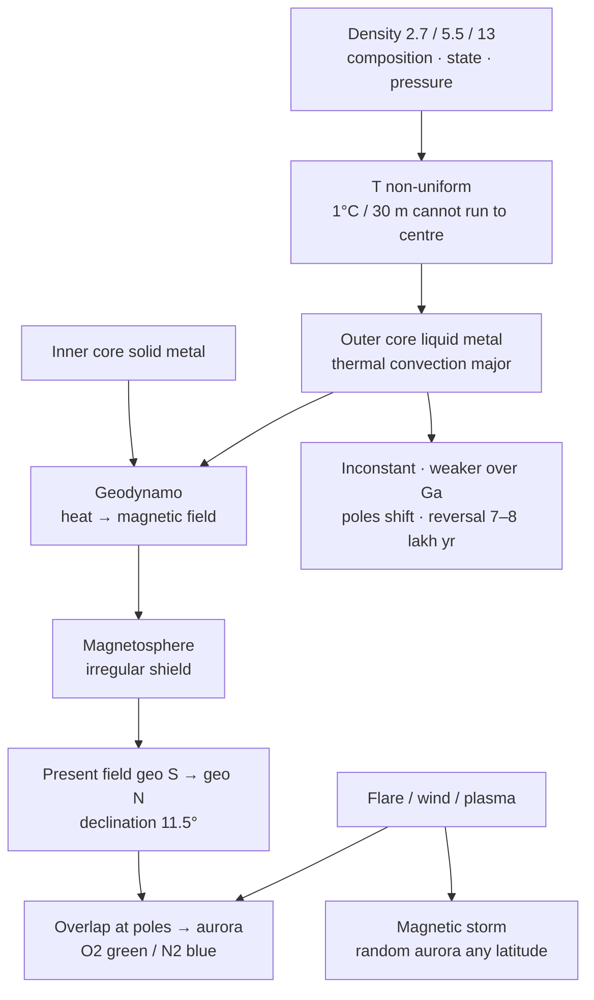

# 07 — Geomagnetism (Magnetic Field of the Earth)

### Lecture A4 — 11 September 2026 (Rizwan Sir)

> **Date of Lecture:** 11 September 2026  
> **Date Added:** 2026-09-11  
> **Teacher:** **Rizwan Sir** (Geomorphology syllabus topic **IV**)  
> **Source:** Vajiram & Ravi — class notes (6 sheets dated **11/9/26**) + audio transcript  
> **Continues:** `02_Geomorphology.md` Lectures A2–A3 (interior models, heat path, both cores ~6,000°C). Cluster **GEO-12**.  
> **Parked:** classification of **endogenic** forces (folding / faulting / nappe) — next class; then volcanism and earthquakes. **Exogenic landforms** is on the portal (watch before that class).  
> **Do not:** Faraday / Maxwell / Lorentz for this paper — class said applied geography only.  
> **Yellow Book:** dynamo one-liner stays in `Yellow_Books/Concepts_of_Geography/03_Interior_of_the_Earth.md`. **This lecture is the exam default.**

---

## 1. Density — three reasons it is not the same at two depths (GEO-12-01)

Sheet: average **5.5**, surface **2.7**, centre **13**. Density **increases with depth**, and the increase is **non-uniform**.

If A sits higher than B, **A and B do not have the same density.** Three factors (class):

| Factor | Why density can differ |
|:---|:---|
| **Composition** | Different material (SIAL vs SIMA vs NiFe) |
| **State of matter** | Solid / semi-solid / liquid |
| **Pressure** | Weight of overlying material compresses |

These numbers already sat on A2 Model 2. Today’s lock is the **three-factor** trap, not a new 5.5.

<svg xmlns="http://www.w3.org/2000/svg" viewBox="0 0 560 220" role="img" aria-label="Density increases with depth: surface 2.7, average 5.5, centre 13; A and B are not the same density" style="display:block;margin:0 auto;width:100%;min-width:340px;max-width:560px;font-family:system-ui,Segoe UI,Arial,sans-serif;">
<rect x="8" y="8" width="544" height="204" rx="12" fill="#f8fafc" stroke="#94a3b8"/>
<text x="280" y="28" text-anchor="middle" font-size="13" font-weight="700" fill="#0f172a">Density increases with depth — non-uniform</text>
<circle cx="150" cy="118" r="78" fill="#e2e8f0" stroke="#334155" stroke-width="1.6"/>
<circle cx="150" cy="118" r="52" fill="#cbd5e1" stroke="#475569" stroke-width="1.2"/>
<circle cx="150" cy="118" r="22" fill="#64748b" stroke="#0f172a" stroke-width="1.2"/>
<circle cx="150" cy="52" r="5" fill="#0f766e"/>
<text x="162" y="48" font-size="11" font-weight="700" fill="#115e59">surface 2.7</text>
<circle cx="150" cy="118" r="5" fill="#7c2d12"/>
<text x="178" y="122" font-size="11" font-weight="700" fill="#7c2d12">centre 13</text>
<text x="150" y="208" text-anchor="middle" font-size="11" fill="#334155">mean Earth = 5.5</text>
<text x="330" y="58" font-size="12" font-weight="700" fill="#0f172a">A (shallower) ≠ B (deeper)</text>
<circle cx="348" cy="108" r="8" fill="#0f766e"/>
<text x="364" y="112" font-size="12" fill="#0f172a">A</text>
<circle cx="348" cy="156" r="8" fill="#7c2d12"/>
<text x="364" y="160" font-size="12" fill="#0f172a">B</text>
<text x="330" y="188" font-size="11" fill="#475569">composition · state · pressure</text>
</svg>

---

## 2. Temperature — increases, but not at one rate (GEO-12-01)

Temperature **increases with depth** and is **non-uniform**. Two governors: **radioactivity** (heat source) and **heat transfer**. Max class T ~**6,000°C** (both cores — already A3).

**Direct data** (mines / drilling — data collected):

| Rise | Depth |
|:---|:---|
| **1°C** | **30 m** |
| **5°C** | **150 m** |
| **30°C** | **1 km** |

If that **30°C / km** held for the whole radius **~6,400 km**, interior T would be ~**1.92 lakh °C**. Class: **impossible**. After a certain depth the rate **slows or becomes constant**, so the **max** stays around **6,000°C**.

- **Lower mantle:** increase is **very slow** — **absence of radioactivity** + **slow conduction** (silica is a poor conductor — A3 heat path).
- **Core:** temperature remains **uniform** (~6,000°C).
- **Pressure does not set temperature.** It sets **melting point** / how the material **responds** (why inner core is solid at the same T as liquid outer core). Interior = **closed system**.

---

## 3. Geomagnetism and the magnetosphere (GEO-12-02)

**Geomagnetism** = the behaviour of Earth as a **giant magnet**, with poles and a magnetic field around it.

**Magnetosphere** = the **envelope** of Earth’s magnetic field. It acts as a **protective shield**: it prevents **direct interaction** of **high-intensity solar and cosmic radiation** with the surface. Without it, that energy would hit the surface and raise temperature.

Field of a bar magnet is **systematic / symmetrical** because the current in the coil is **continuous and consistent**. Earth’s field is **not**.

<svg xmlns="http://www.w3.org/2000/svg" viewBox="0 0 640 250" role="img" aria-label="Bar magnet has a symmetrical field; Earth magnetosphere is an irregular shield against solar and cosmic radiation" style="display:block;margin:0 auto;width:100%;min-width:340px;max-width:640px;font-family:system-ui,Segoe UI,Arial,sans-serif;">
<rect x="8" y="8" width="624" height="234" rx="12" fill="#f8fafc" stroke="#94a3b8"/>
<text x="140" y="28" text-anchor="middle" font-size="12" font-weight="700" fill="#0f172a">Bar magnet — symmetrical</text>
<rect x="118" y="88" width="44" height="88" rx="4" fill="#e2e8f0" stroke="#334155"/>
<text x="140" y="118" text-anchor="middle" font-size="12" font-weight="700" fill="#1e3a8a">N</text>
<text x="140" y="158" text-anchor="middle" font-size="12" font-weight="700" fill="#b91c1c">S</text>
<path d="M 140 92 C 88 92 72 176 140 176" fill="none" stroke="#1d4ed8" stroke-width="1.6"/>
<path d="M 140 92 C 192 92 208 176 140 176" fill="none" stroke="#1d4ed8" stroke-width="1.6"/>
<path d="M 140 100 C 108 100 98 168 140 168" fill="none" stroke="#38bdf8" stroke-width="1.2"/>
<path d="M 140 100 C 172 100 182 168 140 168" fill="none" stroke="#38bdf8" stroke-width="1.2"/>
<text x="140" y="228" text-anchor="middle" font-size="10" fill="#475569">current consistent → field regular</text>
<text x="430" y="28" text-anchor="middle" font-size="12" font-weight="700" fill="#0f172a">Earth — irregular magnetosphere</text>
<ellipse cx="430" cy="128" rx="118" ry="78" fill="#e0f2fe" stroke="#0369a1" stroke-width="1.6"/>
<ellipse cx="418" cy="128" rx="96" ry="62" fill="#f8fafc" stroke="#7dd3fc" stroke-width="1.2" stroke-dasharray="4 3"/>
<circle cx="430" cy="128" r="28" fill="#bbf7d0" stroke="#166534"/>
<text x="430" y="132" text-anchor="middle" font-size="11" font-weight="700" fill="#14532d">Earth</text>
<polygon points="268,72 300,84 268,96" fill="#f97316"/>
<text x="248" y="68" font-size="10" fill="#c2410c">solar / cosmic</text>
<line x1="300" y1="84" x2="338" y2="100" stroke="#f97316" stroke-width="1.6"/>
<text x="430" y="228" text-anchor="middle" font-size="10" fill="#475569">shield — deflects high-intensity radiation</text>
</svg>

---

## 4. Geodynamo — why Earth behaves as a magnet (GEO-12-02)

Class analogy: a **metallic bar** with **current** around it behaves as a magnet. **I ∝ B** (more current → stronger field). Reverse the current → reverse the polarity.

**Inside Earth:**

- **Inner core** = solid **metallic** basement (the “bar”).
- **Outer core** = **liquid metallic** iron, **not at rest**. Rotation of the outer core over the inner core converts **heat → magnetic field**. That conversion is the **geodynamo** — a **self-sustaining engine**. Law of conservation of energy: heat is converted, not created.

**Two reasons the outer core rotates:**

| Driver | Role |
|:---|:---|
| **Thermal convection** (heat transfer; hot liquid iron jumping) | **Major**. If this stopped, the outer core would stop. |
| **Rotation of the Earth** (Coriolis-type force on the liquid) | **Additional**, not primary. |

**Trap:** “A non-rotating Earth would have no magnetism” is **incorrect**. Even if Earth stopped spinning, the outer core would still rotate from **thermal convection**. Earth continues as a magnet **as long as thermal convection and heat transfer go on in the outer core**. If current = 0 in the coil experiment, the bar **demagnetises**. Same logic: no heat transfer in the outer core → no dynamo.

It is **movement of hot liquid iron**, not a flow of electrons.

**Why not the asthenosphere?** There **is** convection in the asthenosphere. The basement under it is the **lower mantle** — **non-metallic** (SIMA / silica). Geomagnetism is an **endogenic** property caused by the **geodynamo effect of the core only**, not the whole interior.

<svg xmlns="http://www.w3.org/2000/svg" viewBox="0 0 560 240" role="img" aria-label="Geodynamo: rotating liquid outer core over solid inner core converts heat to magnetic field" style="display:block;margin:0 auto;width:100%;min-width:340px;max-width:560px;font-family:system-ui,Segoe UI,Arial,sans-serif;">
<rect x="8" y="8" width="544" height="224" rx="12" fill="#f8fafc" stroke="#94a3b8"/>
<text x="280" y="28" text-anchor="middle" font-size="13" font-weight="700" fill="#0f172a">Core = geodynamo · heat → magnetic field</text>
<circle cx="168" cy="128" r="78" fill="#fed7aa" stroke="#c2410c" stroke-width="1.6"/>
<circle cx="168" cy="128" r="42" fill="#fdba74" stroke="#9a3412" stroke-width="1.4"/>
<circle cx="168" cy="128" r="18" fill="#7c2d12"/>
<text x="168" y="124" text-anchor="middle" font-size="10" font-weight="700" fill="#fff7ed">IC</text>
<text x="168" y="138" text-anchor="middle" font-size="9" fill="#ffedd5">solid metal</text>
<text x="168" y="78" text-anchor="middle" font-size="11" font-weight="700" fill="#9a3412">outer core · liquid Fe</text>
<path d="M 210 92 A 52 52 0 0 1 210 164" fill="none" stroke="#1d4ed8" stroke-width="2" marker-end="url(#gd)"/>
<defs><marker id="gd" markerWidth="8" markerHeight="8" refX="6" refY="4" orient="auto"><polygon points="0,0 8,4 0,8" fill="#1d4ed8"/></marker></defs>
<text x="248" y="100" font-size="11" fill="#1e3a8a">rotation</text>
<text x="320" y="72" font-size="12" font-weight="700" fill="#0f172a">1. Thermal convection (major)</text>
<text x="320" y="94" font-size="12" fill="#334155">2. Earth rotation (additional)</text>
<text x="320" y="124" font-size="12" fill="#0f172a">Asthenosphere convects —</text>
<text x="320" y="144" font-size="12" fill="#b91c1c">basement is non-metallic</text>
<text x="320" y="176" font-size="11" fill="#475569">Earth still a magnet if it stops spinning</text>
<text x="320" y="194" font-size="11" fill="#475569">— as long as OC heat transfer lasts</text>
</svg>

---

## 5. Irregular magnetosphere; poles, declination, inclination (GEO-12-03)

Outer core is **more than 2,000 km** thick. Thermal convection is **not the same speed / intensity everywhere**, so outer-core rotation is **inconsistent**. Therefore the magnetosphere is **irregular in shape and size**. **Height and extent** of the field **differ from one location to another**.

**Magnetic pole** = where the **intensity** of the field is **highest** (energy most concentrated). Geographic poles are a **geometrical** identity — they **do not shift** while Earth’s shape stays. Magnetic poles **can shift** when the place of maximum intensity moves.

| Line | What it is |
|:---|:---|
| **Geographic axis** | Imaginary line geographic N → geographic S. Perpendicular to the **geographic equator**. |
| **Magnetic axis** | Line joining the two magnetic poles. |
| **Magnetic declination (θ)** | Angle between **magnetic axis** and **geographic axis**. Present class value **11.5°**. Not fixed forever. |
| **Magnetic inclination** | Angle between **magnetic axis** and **geographic equator** = **90° − 11.5°**. |
| **Magnetic equator** | Line **perpendicular to the magnetic axis**. Angle between magnetic equator and geographic equator = **same θ (11.5°)**. |

**Present locations (class):**

- Geomagnetic pole of the **northern** hemisphere: **Ellesmere Island**, **northern Canada**.
- Geomagnetic pole of the **southern** hemisphere: **Southern Ocean** — **outside Antarctica**, **not** over the Antarctic continent.

### Orientation trap (Prelims)

Energy **emerges** from the magnetic **north** of the dipole and returns to magnetic **south**. On **present** Earth the dipole is **flipped relative to geographic polarity**:

- **Magnetic north of Earth is in the southern hemisphere.**
- **Magnetic south of Earth is in the northern hemisphere.**

So the field is oriented **geographic south → geographic north**. Reversals have happened; they are **not felt immediately**. For now, circulation is **S → N**.

<svg xmlns="http://www.w3.org/2000/svg" viewBox="0 0 560 280" role="img" aria-label="Geographic axis versus magnetic axis, declination 11.5 degrees, Ellesmere Island north, Southern Ocean south" style="display:block;margin:0 auto;width:100%;min-width:340px;max-width:560px;font-family:system-ui,Segoe UI,Arial,sans-serif;">
<rect x="8" y="8" width="544" height="264" rx="12" fill="#f8fafc" stroke="#94a3b8"/>
<text x="280" y="26" text-anchor="middle" font-size="13" font-weight="700" fill="#0f172a">Axes · declination 11.5° · poles not the same place</text>
<circle cx="200" cy="148" r="88" fill="#e0f2fe" stroke="#0369a1" stroke-width="1.6"/>
<line x1="200" y1="62" x2="200" y2="234" stroke="#0f172a" stroke-width="2"/>
<text x="208" y="74" font-size="10" font-weight="700" fill="#0f172a">geo axis</text>
<line x1="118" y1="148" x2="282" y2="148" stroke="#64748b" stroke-width="1.4" stroke-dasharray="4 3"/>
<text x="286" y="152" font-size="10" fill="#475569">geo equator</text>
<line x1="168" y1="66" x2="232" y2="230" stroke="#b91c1c" stroke-width="2"/>
<text x="236" y="78" font-size="10" font-weight="700" fill="#b91c1c">magnetic axis</text>
<path d="M 200 78 A 18 18 0 0 1 214 88" fill="none" stroke="#c2410c" stroke-width="1.4"/>
<text x="218" y="86" font-size="10" font-weight="700" fill="#9a3412">θ 11.5°</text>
<circle cx="176" cy="72" r="5" fill="#1d4ed8"/>
<text x="52" y="68" font-size="10" fill="#1e3a8a">N mag pole</text>
<text x="52" y="82" font-size="10" fill="#1e3a8a">Ellesmere I.</text>
<text x="52" y="96" font-size="10" fill="#64748b">N Canada</text>
<circle cx="224" cy="224" r="5" fill="#b91c1c"/>
<text x="236" y="220" font-size="10" fill="#9a3412">S mag pole</text>
<text x="236" y="234" font-size="10" fill="#9a3412">Southern Ocean</text>
<text x="236" y="248" font-size="10" fill="#64748b">outside Antarctica</text>
<text x="400" y="120" font-size="11" fill="#0f172a">inclination = 90 − 11.5</text>
<text x="400" y="140" font-size="11" fill="#0f172a">mag eq ∠ geo eq = 11.5°</text>
<text x="400" y="168" font-size="11" font-weight="700" fill="#1e3a8a">field now: geo S → geo N</text>
<text x="400" y="188" font-size="11" fill="#475569">mag N sits in SH</text>
<text x="400" y="204" font-size="11" fill="#475569">mag S sits in NH</text>
</svg>

**Equator vs poles (field height):**

| Belt | Height of field | Strength |
|:---|:---|:---|
| Equatorial / tropical | **Greater height**; **not** attached to the surface; more **scattered** | **Weaker** |
| Toward poles | Field **descends**; attached to the surface | **Maximum at the poles** |

---

## 6. Atmosphere overlap → aurora (GEO-12-04)

Atmosphere = envelope of gases. Class mix: **nitrogen 78%**, **oxygen 21%**. Density **falls with height**. **~97%** of atmospheric gases sit in the **first 30 km** (class benchmark **30–40 km**). Source of oxygen is **photosynthesis**, so **highest O₂ is near the surface**.

**Atmosphere and magnetosphere do not overlap at low latitudes** (field is high; gases hug the surface). They **overlap in the polar region** as the field descends. That overlap is the **essential condition** for aurora **as a pattern**.

**Mechanism:** high-intensity solar energy (e.g. a **solar flare**) hits the magnetosphere → charges **absorb / deflect / divert** it (it does **not** go straight to the surface) → extra energy is **carried toward the poles** → at the overlap, energy is **dissipated** by lifting an electron off an atmospheric-gas atom and dropping it back → **light** = sparkling / lightning effect in the sky = **aurora**.

| | North Pole | South Pole |
|:---|:---|:---|
| Name | **Aurora Borealis** | **Aurora Australis** |
| Colour lock | **O₂ → green**; **N₂ → blue** | same gases |

Green and blue **dominate** because N₂ and O₂ dominate. Colour **can differ with height** (composition and density change): closer to the surface → more **green** (more O₂); a few km up → more **bluish**; **40–60 km** may go **reddish / purple**.

**Borealis is more common** because present field direction is **S → N**: added energy prefers **geographic north**. Australis needs energy **against** the field — rarer unless the hit is very strong. **Norway** / Scandinavia / northern Europe are the classic watch spots.

**Not a seasonal solar event.** The Sun does not fire flares to match Earth’s seasons. **Visibility** rises in **winter** — **absence of insolation** at that pole. Watch **Norway in winter** (class: around Christmas). Southern watch would be **southern Argentina in June** — still less fruitful than Norway in December.

<svg xmlns="http://www.w3.org/2000/svg" viewBox="0 0 640 260" role="img" aria-label="Solar energy hits the magnetosphere, rides to the poles, and sparks green oxygen and blue nitrogen aurora where field overlaps atmosphere" style="display:block;margin:0 auto;width:100%;min-width:340px;max-width:640px;font-family:system-ui,Segoe UI,Arial,sans-serif;">
<rect x="8" y="8" width="624" height="244" rx="12" fill="#f8fafc" stroke="#94a3b8"/>
<text x="320" y="26" text-anchor="middle" font-size="13" font-weight="700" fill="#0f172a">Overlap at poles → aurora · O₂ green · N₂ blue</text>
<circle cx="280" cy="140" r="52" fill="#bbf7d0" stroke="#166534"/>
<ellipse cx="280" cy="140" rx="78" ry="64" fill="none" stroke="#86efac" stroke-width="2"/>
<text x="280" y="136" text-anchor="middle" font-size="11" font-weight="700" fill="#14532d">Earth</text>
<text x="280" y="152" text-anchor="middle" font-size="9" fill="#166534">atm ~30 km</text>
<ellipse cx="280" cy="140" rx="130" ry="88" fill="none" stroke="#0369a1" stroke-width="1.8"/>
<text x="430" y="88" font-size="10" fill="#0369a1">magnetosphere</text>
<polygon points="48,88 88,100 48,112" fill="#f97316"/>
<text x="40" y="78" font-size="10" fill="#c2410c">solar flare</text>
<path d="M 88 100 Q 160 70 210 92" fill="none" stroke="#f97316" stroke-width="1.6"/>
<path d="M 210 92 Q 248 48 280 52" fill="none" stroke="#22c55e" stroke-width="2"/>
<text x="248" y="44" font-size="10" font-weight="700" fill="#15803d">Borealis · green</text>
<path d="M 210 188 Q 248 232 280 228" fill="none" stroke="#2563eb" stroke-width="2"/>
<text x="300" y="248" font-size="10" font-weight="700" fill="#1d4ed8">Australis · rarer</text>
<text x="470" y="130" font-size="11" fill="#0f172a">Eq: field high, no overlap</text>
<text x="470" y="148" font-size="11" fill="#0f172a">Poles: field descends</text>
<text x="470" y="166" font-size="11" fill="#0f172a">Winter = visibility, not season</text>
<text x="470" y="192" font-size="11" fill="#15803d">near surface → green</text>
<text x="470" y="210" font-size="11" fill="#1d4ed8">higher → blue / red-purple</text>
</svg>

**Aurora vs lights (same mechanism, different scale):**

| | **Aurora** | **Lights** (northern lights) |
|:---|:---|:---|
| Energy | Localised dump | **Continuous + large-scale** over the whole polar cap |
| Who sees it | One place (Alaska **or** Greenland **or** Norway) | **All** polar locations at once (Alaska, Hudson Bay, Greenland, Norway, Siberia) |
| Look | Curtain, **hours** | Green **circle** over the whole pole; can last **days** (class 5–7, even ~15 with wind) |
| South | Australis less common | **Southern lights = rarest of rare** |

---

## 7. Insolation, CME, storms (GEO-12-05)

Sun’s heat is from **thermonuclear** reaction; convection carries it to the **coronal layer**. Ordinary **insolation** from that layer is **not charged** (class also: mainly **protons**, weak). The magnetosphere is **transparent to insolation** — it is **not blocked**.

**Solar hotspot** = a **heated patch** on the Sun’s surface where an enlarged convection has broken into the corona.

Class treats **flare, wind, plasma** as **three types of Coronal Mass Ejection (CME)**. Online sources **merge** the terms — keep **class meanings**.

<svg xmlns="http://www.w3.org/2000/svg" viewBox="0 0 640 250" role="img" aria-label="Four solar outputs: insolation passes through; flare makes aurora; wind makes lights and can suppress the field into a magnetic storm; plasma is the strongest storm" style="display:block;margin:0 auto;width:100%;min-width:340px;max-width:640px;font-family:system-ui,Segoe UI,Arial,sans-serif;">
<rect x="8" y="8" width="624" height="234" rx="12" fill="#f8fafc" stroke="#94a3b8"/>
<text x="320" y="26" text-anchor="middle" font-size="13" font-weight="700" fill="#0f172a">Coronal layer → four ways energy meets Earth</text>
<circle cx="70" cy="128" r="36" fill="#fde68a" stroke="#d97706"/>
<text x="70" y="124" text-anchor="middle" font-size="11" font-weight="700" fill="#92400e">Sun</text>
<text x="70" y="140" text-anchor="middle" font-size="9" fill="#92400e">corona</text>
<rect x="130" y="48" width="110" height="56" rx="8" fill="#ecfdf5" stroke="#059669"/>
<text x="185" y="70" text-anchor="middle" font-size="11" font-weight="700" fill="#047857">Insolation</text>
<text x="185" y="88" text-anchor="middle" font-size="10" fill="#334155">transparent to B</text>
<rect x="258" y="48" width="110" height="56" rx="8" fill="#ffedd5" stroke="#ea580c"/>
<text x="313" y="70" text-anchor="middle" font-size="11" font-weight="700" fill="#c2410c">Solar flare</text>
<text x="313" y="88" text-anchor="middle" font-size="10" fill="#334155">short burst → aurora</text>
<rect x="386" y="48" width="110" height="56" rx="8" fill="#dbeafe" stroke="#2563eb"/>
<text x="441" y="70" text-anchor="middle" font-size="11" font-weight="700" fill="#1d4ed8">Solar wind</text>
<text x="441" y="88" text-anchor="middle" font-size="10" fill="#334155">lights + storm</text>
<rect x="514" y="48" width="110" height="56" rx="8" fill="#fee2e2" stroke="#dc2626"/>
<text x="569" y="70" text-anchor="middle" font-size="11" font-weight="700" fill="#b91c1c">Plasma / CME</text>
<text x="569" y="88" text-anchor="middle" font-size="10" fill="#334155">strongest storm</text>
<text x="48" y="196" font-size="12" fill="#0f172a">Hotspot = heated patch. Flare = burst from a small hotspot. Wind = hotspot bigger and hotter, continuous. Plasma = convection torn off the Sun (~1000× wind).</text>
<text x="48" y="216" font-size="12" fill="#0f172a">Storm = field suppressed / fragmented, closer to surface. Aurora then at any latitude. Geodynamo rebuilds the field — not permanent.</text>
</svg>

| Ejection | What the hotspot is doing | Typical Earth result |
|:---|:---|:---|
| **Solar flare** | Short **burst** from a hotspot | **Aurora** (sometimes lights if flares keep hitting) |
| **Solar wind** | Hotspot **larger and hotter**; energy **continuous and intense** | **Lights** (can last a **week**); can **suppress** the field → **magnetic storm** |
| **Plasma** | Whole convection **detached** and thrown off the Sun | **Highest-intensity magnetic storm**; random aurora |

**Magnetic storm** = **suppression / distortion** of the magnetosphere by high-intensity solar radiation (class cyclone analogy: normal pattern is disturbed). Field is **brought down** toward the surface and may **fragment**. Energy then **cannot** ride the usual path to the poles. Dissipation happens **wherever** the crushed field meets the atmosphere → **random aurora at multiple latitudes**, including tropics. **Not permanent** — after the pulse passes, the **geodynamo reorganises** the field.

Class also: more frequent CME → some extra heat is transferred, **especially to the polar / Arctic** side of the present field → glaciers melt → **sea-level** rise. Treat as the class **endogenic–exogenic link**, not an IPCC table. **Do not invent numbers.**

---

## 8. Four features of geomagnetism (GEO-12-06)

<svg xmlns="http://www.w3.org/2000/svg" viewBox="0 0 640 200" role="img" aria-label="Pole shift is a tilt of outer-core rotation; polar reversal is a full reverse of outer-core direction, last 7 to 8 lakh years ago, cyclic but not periodic" style="display:block;margin:0 auto;width:100%;min-width:340px;max-width:640px;font-family:system-ui,Segoe UI,Arial,sans-serif;">
<rect x="8" y="8" width="624" height="184" rx="12" fill="#f8fafc" stroke="#94a3b8"/>
<text x="168" y="28" text-anchor="middle" font-size="12" font-weight="700" fill="#0f172a">Pole shift = OC tilts</text>
<circle cx="168" cy="108" r="48" fill="#e0f2fe" stroke="#0369a1"/>
<circle cx="168" cy="108" r="18" fill="#fdba74"/>
<line x1="148" y1="68" x2="188" y2="148" stroke="#b91c1c" stroke-width="2"/>
<text x="200" y="84" font-size="10" fill="#9a3412">pole moves</text>
<text x="472" y="28" text-anchor="middle" font-size="12" font-weight="700" fill="#0f172a">Reversal = OC direction flips</text>
<circle cx="400" cy="108" r="40" fill="#fee2e2" stroke="#b91c1c"/>
<text x="400" y="104" text-anchor="middle" font-size="11" font-weight="700" fill="#7f1d1d">N</text>
<text x="400" y="120" text-anchor="middle" font-size="10" fill="#7f1d1d">then S</text>
<text x="448" y="112" font-size="18" fill="#64748b">↔</text>
<circle cx="536" cy="108" r="40" fill="#dbeafe" stroke="#1d4ed8"/>
<text x="536" y="104" text-anchor="middle" font-size="11" font-weight="700" fill="#1e3a8a">S</text>
<text x="536" y="120" text-anchor="middle" font-size="10" fill="#1e3a8a">then N</text>
<text x="320" y="176" text-anchor="middle" font-size="11" fill="#334155">Last reversal 7–8 lakh years ago · cyclic, not periodic (unequal gaps)</text>
</svg>

1. **Magnetic field is inconsistent** — it fluctuates, because outer-core “current” is not steady.
2. **Average field intensity over geological time has declined.** Radioactivity (the “battery”) has **decayed**; Earth has **lost heat**; the magnet has **weakened** and will weaken further.
3. **Position of magnetic poles will shift** when the **orientation / tilt** of outer-core rotation changes. (Geographic poles do not.)
4. **Polar reversal** = **full reverse** of outer-core **direction** (clockwise ↔ opposite) → magnetic **N and S swap**. Last event **7–8 lakh years before present**. **Cyclic** (it keeps repeating) **but not periodic** (two reversals are **not** separated by equal time). Random outer-core behaviour.

**Shift ≠ reversal.** A slight tilt moves the *place* of the pole. A complete reverse of rotation reverses **polarity**.

---

## Knowledge Graph — Lecture A4

---

## UPSC Quick Recall

1. Surface **2.7** / mean **5.5** / centre **13**. A ≠ B at two depths — **composition, state, pressure**.
2. Geothermal **1°C / 30 m** ≈ **30°C / km** is **only near-surface**. Cap ~**6,000°C**. Lower mantle slow; core **uniform**.
3. Magnetosphere = **shield** against **high-intensity solar and cosmic** radiation. **Transparent to insolation**.
4. Dynamo = **outer core rotating over solid inner core**. **Thermal convection is the major driver**; Earth rotation is extra. Asthenosphere **does not** make the field.
5. “Non-rotating Earth has no magnetism” = **false**.
6. Declination **11.5°**. N mag pole = **Ellesmere Island** (N Canada). S = **Southern Ocean**, **not** Antarctic land.
7. Present circulation **geographic south → north**. Magnetic **north** of the dipole sits in the **southern** hemisphere.
8. Aurora needs **overlap of field and atmosphere** → **poles as a pattern**. **Borealis more common**. Winter = **visibility**.
9. **O₂ green, N₂ blue.** Lights = **large-scale** aurora.
10. Class CME trio: **flare → aurora**; **wind → lights + storm**; **plasma → strongest storm**. Storm aurora can be **anywhere**.
11. Four features: **inconstant**; intensity **declined**; poles **shift**; reversal **cyclic not periodic**, last **7–8 lakh years ago**.

---

## Abbreviations used in Lecture A4

| Short | Full form |
|:---|:---|
| CME | Coronal Mass Ejection |
| OC / IC | Outer core / Inner core |
| SIAL / SIMA / NiFe | Silica + Aluminium / Silica + Magnesium / Nickel + Iron |
| O₂ / N₂ | Oxygen / Nitrogen |
| Ga | Billion years (geological time in the intensity-decline point) |

---

<!-- 2026-09-11: Lecture A4 — density/T recap + geomagnetism (geodynamo, magnetosphere, aurora, CME, four features). Cluster GEO-12. -->
