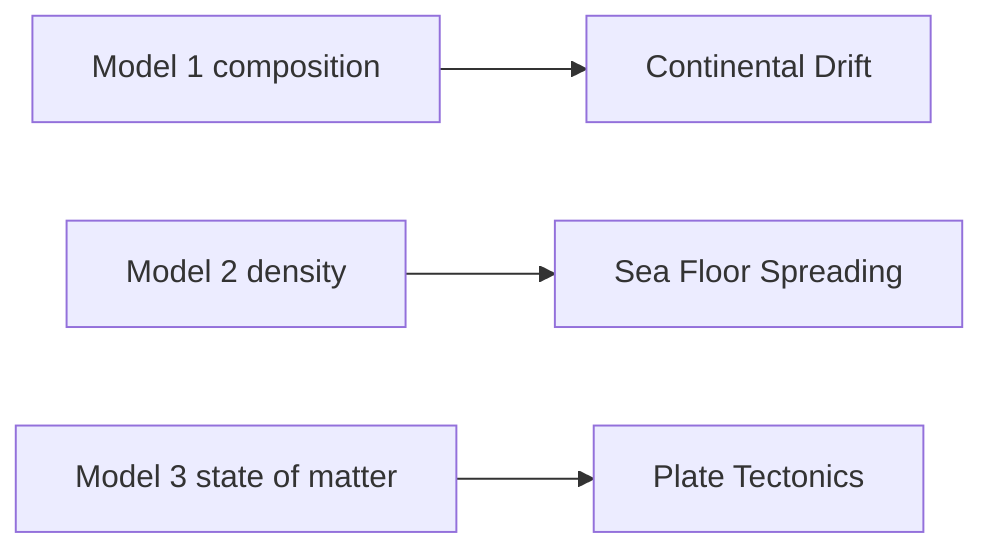
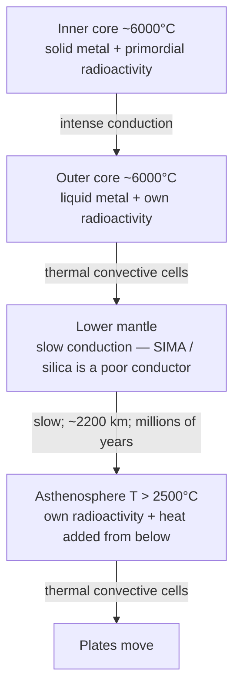
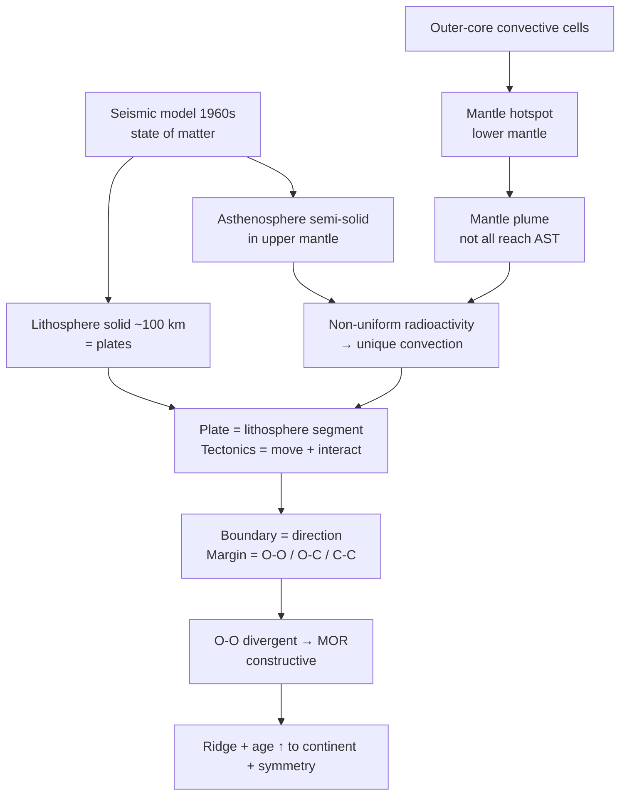

# 07 — Geomorphology: Seismic Model, Heat Path & Sea-Floor Spreading

### Lecture A3 — 6 September 2026 (Shiv Arpit Sir)

> **Date of Lecture:** 6 September 2026  
> **Date Added:** 2026-09-06  
> **Faculty:** **Shiv Arpit Sir**. Vajiram & Ravi World Physical Geography.  
> **Source:** Class + audio transcript (`Geography L060926`) + 5 handwritten sheets (wedge cross-section, heat path, mid-ocean ridge / R₁–R₃, continental vs oceanic crust, inner-core pressure).  
> **Continues:** Lecture A2 — 9 August 2026 (`02_Geomorphology.md` §§18.1–18.5). Models 1 and 2 stay there. This file is **Model 3** (state of matter) and the surface theories it unlocks.  
> **Also relevant for:** Prelims (discontinuities, lithosphere ≠ crust, Conrad, mantle plume); **GS-I** (endogenic force, plate tectonics); class flagged a **2021** mains-style ask on **mantle plume ↔ plate tectonics**.

**How to read class shortcuts:** full form on first use. Glossary at the end. Do not invent a depth the sheet / class did not give.

Class paused after **pressure vs melting point** (why the inner core stays solid). Geomagnetism and the rest of Topic IV are still pending.

**Already in Lecture A2 — do not restudy as a new topic:** Suess SIAL / SIMA / NiFe → Continental Drift; Mohorovičić crust–mantle–core → Sea Floor Spreading (Hess, 1962); Moho ~40 km and Gutenberg 2,900 km as *average* Model-2 numbers. Those rows stay on **GEO-04**. This cluster is **GEO-09**.

---

## 1. Three models, three surface theories (GEO-09-01)

Landform is still **f(endogenic, exogenic)**. Energy for endogenic force = **primordial / radioactive heat** at the core. Mechanism = **convection**. The *picture* of the interior has changed three times; each picture licensed a surface theory.

| Model | When | Basis | Surface theory it enabled |
|:---|:---|:---|:---|
| **1 — Edward Suess** | 1880s | **Composition** — SIAL / SIMA / NiFe | **Continental Drift** (Wegener, 1912) |
| **2 — Andrija Mohorovičić** | 1930s | **Density** — crust / mantle / core | **Sea Floor Spreading** (Harry Hess, 1962) |
| **3 — Seismic model** | **1960s** | **State of matter** (solid / semi-solid / liquid) | **Plate Tectonics** |

Until the **1950s** geologists accepted different *materials* and *densities*, but treated the whole Earth as **thoroughly solid**. Earthquake-wave data broke that. Model 3 has **no single author** — several workers / institutes. Class audio garbled a name list; do not invent one.

**Linkage class keeps repeating:** more we know about the interior, more the *surface* theory changes.

---

## 2. Seismic model — layers by state (GEO-09-01)

| Layer | State | Class placement |
|:---|:---|:---|
| **Lithosphere** | **Solid** | Outermost; *lithos* = rock |
| **Asthenosphere** | **Semi-solid** (flexible / elastic) | Directly under the lithosphere |
| **Lower mantle** | **Solid** | Below ~700 km |
| **Outer core** | **Liquid**, metallic (NiFe) | 2,900–5,150 km |
| **Inner core** | **Solid**, metallic (NiFe) | 5,150–6,400 km |

Composition of the **core is the same** (NiFe). State differs. Recent work: inner core has a **slightly higher** iron share (~**10%**). Class: do not chase the research paper — **liquid outer / solid inner** is the exam line.

---

## 3. Plate and tectonics (GEO-09-02)

The lithosphere is **not continuous**. It is **fragmented**. Each **segment of lithosphere** = a **plate**. Sizes are unequal → **major** and **minor** plates.

Plates **rest on** the asthenosphere. Energy in the asthenosphere (from the interior, plus its own radioactivity — §6) **moves** the plates. When they move they **interact**.

| Term | Class line |
|:---|:---|
| **Plate** | A **segment of lithosphere** |
| **Tectonics** | **Movement and interaction** of plates |
| **Convergent** boundary | Plates move **towards** each other |
| **Divergent** boundary | Plates move **away** from each other |

**Plate types on the surface:** **continental**, **oceanic**, or **continental–oceanic** (a plate can carry both a continent and an ocean floor).

---

## 4. Cross-section: depths and discontinuities (GEO-09-03)

**Radius** used in class = **6,400 km** (surface → centre).

<svg xmlns="http://www.w3.org/2000/svg" viewBox="0 0 640 400" role="img" aria-label="Earth interior wedge. Crust is the green 0 to 40 km rind ending at Moho. Upper mantle is 40 to 700 km. Then lower mantle, outer core and inner core." style="display:block;margin:0 auto;width:100%;min-width:340px;max-width:680px;font-family:system-ui,Segoe UI,Arial,sans-serif;">
<rect x="1" y="1" width="638" height="398" rx="12" fill="#f8fafc" stroke="#e2e8f0"/>
<text x="20" y="26" font-size="13" font-weight="700" fill="#0f172a">Cross-section of Earth's interior (class depths — not to scale)</text>
<text x="20" y="44" font-size="11" fill="#64748b">Crust is its own rind (0–40 km). Upper mantle is the 40–700 km band, not its own colour.</text>
<!-- wedge: centre (360, 368); vertical cut faces the depth rail -->
<path d="M360 68 A300 300 0 0 0 60 368 L360 368 Z" fill="#fef3c7" stroke="#d97706" stroke-width="1"/>
<path d="M360 88 A280 280 0 0 0 80 368 L360 368 Z" fill="#fde68a" stroke="#ca8a04" stroke-width="1"/>
<path d="M360 108 A260 260 0 0 0 100 368 L360 368 Z" fill="#fed7aa" stroke="#ea580c" stroke-width="1"/>
<path d="M360 148 A220 220 0 0 0 140 368 L360 368 Z" fill="#fdba74" stroke="#c2410c" stroke-width="1"/>
<path d="M360 228 A140 140 0 0 0 220 368 L360 368 Z" fill="#fca5a5" stroke="#dc2626" stroke-width="1"/>
<path d="M360 300 A68 68 0 0 0 292 368 L360 368 Z" fill="#fb7185" stroke="#9f1239" stroke-width="1"/>
<!-- crust rind on top so the 0–40 km skin is visible -->
<path d="M360 68 A300 300 0 0 0 60 368 L80 368 A280 280 0 0 1 360 88 Z" fill="#86efac" stroke="#15803d" stroke-width="1"/>
<!-- layer names -->
<text x="72" y="78" font-size="11" font-weight="700" fill="#14532d">Crust · SIAL · 0–40 km</text>
<text x="100" y="104" font-size="11" font-weight="700" fill="#92400e">Lithospheric root · solid SIMA</text>
<text x="100" y="118" font-size="10" fill="#92400e">still lithosphere · already in UM</text>
<text x="110" y="146" font-size="11" font-weight="700" fill="#9a3412">Asthenosphere · semi-solid</text>
<text x="110" y="160" font-size="10" fill="#9a3412">entirely inside upper mantle</text>
<text x="148" y="210" font-size="11" font-weight="700" fill="#7c2d12">Lower mantle · solid SIMA</text>
<text x="198" y="292" font-size="11" font-weight="700" fill="#7f1d1d">Outer core · liquid NiFe</text>
<text x="288" y="348" font-size="10" font-weight="700" fill="#4c0519">Inner core</text>
<text x="288" y="362" font-size="10" font-weight="700" fill="#4c0519">solid NiFe</text>
<!-- crust brace 0–40; upper-mantle brace 40–700 -->
<line x1="366" y1="68" x2="366" y2="88" stroke="#15803d" stroke-width="3"/>
<line x1="360" y1="68" x2="366" y2="68" stroke="#15803d" stroke-width="2"/>
<line x1="360" y1="88" x2="366" y2="88" stroke="#15803d" stroke-width="2"/>
<line x1="366" y1="88" x2="366" y2="148" stroke="#0f766e" stroke-width="3"/>
<line x1="360" y1="148" x2="366" y2="148" stroke="#0f766e" stroke-width="2"/>
<!-- depth rail -->
<line x1="376" y1="68" x2="376" y2="368" stroke="#94a3b8" stroke-width="1.5"/>
<circle cx="376" cy="68" r="3.5" fill="#d97706"/>
<circle cx="376" cy="88" r="3.5" fill="#0f766e"/>
<circle cx="376" cy="108" r="3.5" fill="#ea580c"/>
<circle cx="376" cy="148" r="3.5" fill="#0f766e"/>
<circle cx="376" cy="228" r="3.5" fill="#dc2626"/>
<circle cx="376" cy="300" r="3.5" fill="#9f1239"/>
<circle cx="376" cy="368" r="3.5" fill="#0f172a"/>
<text x="392" y="58" font-size="12" font-weight="700" fill="#14532d">0 km · surface · CRUST starts</text>
<text x="392" y="74" font-size="11" font-weight="700" fill="#15803d">CRUST · 0–40 km · SIAL</text>
<text x="392" y="90" font-size="12" font-weight="700" fill="#0f766e">~40 km · Moho · crust ends · UM starts</text>
<text x="392" y="104" font-size="10.5" fill="#0f766e">crust ↔ mantle · still inside lithosphere</text>
<text x="392" y="118" font-size="11" fill="#0f172a">~100 km · lithosphere ends</text>
<text x="392" y="132" font-size="12" font-weight="700" fill="#0f766e">UPPER MANTLE · 40–700 km</text>
<text x="392" y="152" font-size="12" font-weight="700" fill="#0f172a">700 km · Repetti · UM ends</text>
<text x="392" y="166" font-size="10.5" fill="#64748b">upper ↔ lower mantle · astheno ↔ LM</text>
<text x="392" y="224" font-size="12" font-weight="700" fill="#0f172a">2,900 km · Gutenberg</text>
<text x="392" y="240" font-size="11" fill="#64748b">mantle ↔ core · solid → liquid</text>
<text x="392" y="296" font-size="12" font-weight="700" fill="#0f172a">5,150 km · Lehmann</text>
<text x="392" y="312" font-size="11" fill="#64748b">outer ↔ inner core · liquid → solid</text>
<text x="392" y="372" font-size="12" font-weight="700" fill="#0f172a">6,400 km · centre</text>
</svg>

**Discontinuity** = a depth where the **behaviour of earthquake waves changes** because the material **abruptly** changes state / density. Travel **20–40 km** past the line and the material is a different thing.

| Depth (class) | What sits there |
|:---|:---|
| **~40 km** (average) | **Crust** ends. **Mohorovičić (Moho)** = crust ↔ mantle. Crust can be **~20 km** or **70–80 km**; **40** is the average |
| **~100 km** | Average thickness of the **lithosphere** (solid from the surface down) |
| **~400–500 km** | Asthenosphere is **established**; books that write 400 / 500 mean the **mid-point** of the semi-solid layer |
| **~700 km** | **Repetti** discontinuity. Upper mantle ↔ lower mantle. Also: **asthenosphere ↔ lower mantle**. Above 700 = semi-solid; below 700 = solid. At many places the asthenosphere **reaches 700 km** |
| **2,900 km** | **Gutenberg** — mantle ↔ core (solid → liquid) |
| **5,150 km** | **Lehmann** (class spelling **Lehman**) — outer core ↔ inner core (liquid → solid) |
| **6,400 km** | Centre |

**Mantle in Model 2:** 40–2,900 km, **SIMA**. Split today: **upper mantle 40–700** / **lower mantle 700–2,900** (both SIMA; lower mantle **solid**).

**Where is the upper mantle on the wedge?** It is **not** a sixth colour. It is the **teal band on the rail: Moho (~40 km) → Repetti (700 km)**. That band is **two states stacked**: the **solid lithospheric root** (40–100 km) plus the **whole asthenosphere** (semi-solid, to 700 km). Class line: asthenosphere is **entirely within** the upper mantle; lithosphere is only **partially embedded** in it (the crust sits above Moho).

### Trap: Moho is *not* lithosphere ↔ asthenosphere

- **Moho** = **crust ↔ mantle**, at ~**40 km**, **inside** the lithosphere (lithosphere goes to ~100 km).
- Lithosphere ↔ asthenosphere is a **zone of transition**, not Moho.

---

## 5. Five placement lines (GEO-09-04)

Class dictated these. Keep the wording.

1. **Crust is the outermost layer of the lithosphere.**
2. **Lithosphere is partially embedded in the upper mantle** (lithosphere starts at the surface; upper mantle starts at ~40 km).
3. **Composition of the lithosphere varies with depth** — more **SIAL** near the surface, more **SIMA** as you go in.
4. **There exists a zone of transition** between lithosphere and asthenosphere (drill: solid at 10 / 20 / 100 km; looser by ~200; semi-solid by ~300–350 / 400–500 km).
5. **Asthenosphere is a semi-solid layer entirely within the upper mantle** (upper mantle = 40–700 km).

Lithosphere = **identify the rock**, whether continent or ocean floor. Continent **and** ocean floor are both lithosphere.

---

## 6. Heat path and radioactivity (GEO-09-05)

| Step | Mechanism | Why |
|:---|:---|:---|
| Inner core → outer core | **Intense conduction** | Solid **and** metallic |
| Outer core → lower-mantle basement | **Thermal convective cells** (class: millions of them). Outer core is **not at rest** | Liquid metal |
| Lower mantle (700→2,900 km) | **Slow conduction** | **Not thoroughly metallic** — silica is a poor conductor. Distance ~**2,200 km**. Heat can take **millions of years** |
| Asthenosphere | **Convection** (many cells) | T **> 2,500°C** (class also **2,800 / 3,000°C** recorded) **exceeds melting point** → semi-solid |

**Thermal equilibrium (class phrase):** outer core and inner core look like the **same ~6,000°C**. Outer core **generates** heat (it also has radioactivity), **acquires** heat from the inner core, and **transfers** heat upward. If transfer stopped, outer-core T would climb **above** 6,000. The balance is **primordial-heat distribution + intense conduction + convection**. It is a *process* of keeping temperatures together — **not** a perfectly frozen uniform T (thermodynamics: perfect uniformity would *stop* transfer).

**Do not write outer core = 4,000°C.** Class killed that guess: heat does not *stay* there, but radioactivity puts T back near 6,000.

### Why the asthenosphere is hot enough to be semi-solid

Slow conduction from the lower mantle **cannot** explain T > 2,500°C — if it could, the lower mantle itself would not still be solid. The asthenosphere has **its own source**.

**Density adjustment** (Hadean, Lecture A2) did **not** move radioactivity uniformly:

| Share (class) | Where it sat |
|:---|:---|
| **~70%** | **Core** — highest concentration |
| Part of the remaining **~30%** | Stuck between **100–700 km** → today’s asthenosphere. **Second-highest** concentration |
| **~4–5%** | Still near the **surface** — uranium / thorium mining |

Semi-solid asthenosphere = **concentration of radioactive elements** (T > melting point), **not** “heat piped up from the core alone.”

Radioactivity inside the asthenosphere is **not uniform** → convection cells differ in **size and intensity** → plates are **not** the same size, do not move at the same speed, and every boundary is **unique**.

Class examples (illustrative, not a table to memorise): one plate **5 cm/year**, another **10 cm/year**; a boundary with **2 earthquakes / year** vs **10 / year** after a plume adds energy.

**Identity of a plate** = set by **thermal convection in the asthenosphere**. **Type of boundary** and the **expression of endogenic force** are also functions of that convection.

---

## 7. Mantle hotspot and mantle plume (GEO-09-06)

Class: **2021** question — explain plate tectonics **with** the mantle plume.

| Term | Class definition |
|:---|:---|
| **Mantle hotspot** | A **region in the lower mantle** with **accumulation of heat** and a rise in temperature, **caused by convection of the outer core**. Hundreds of convective hits on the **same** basement spot (class: think thousands of years) |
| **Mantle plume** | A **thermal convective current rising from a mantle hotspot**. It **adds energy to the asthenosphere** and has an **indirect** influence on **plate movement** and the **expression of endogenic force** |

Hotspot material can exceed melting point → low-density liquid **rises**, melting a path (no ready-made pipe) → some plumes **reach the asthenosphere**; many **exhaust in between**. Not every asthenosphere cell is plume-fed. Plumes are **not permanent** — when the feeding convection dies, the plume **withdraws**, plate speed falls, earthquakes / volcanism quieten. A **new** hotspot can wake a different plate.

That is why a **minor** plate (class: **Philippines, Java** / south-eastern plates) can still be **very active** — convection under it is plume-connected.

**Heat transfer from interior to surface is complex:** **conduction + convection with varying intensity**. **Convection is the most effective** mechanism — and the one that **moves plates**.

---

## 8. Boundary ≠ margin (GEO-09-07)

Same *place* on the map can be named two ways.

| Word | Asked by | Types |
|:---|:---|:---|
| **Boundary** | **Direction** of movement | **Convergent** or **divergent** |
| **Margin** | **Location** of the junction | **Ocean–ocean (O–O)**, **ocean–continent (O–C)**, **continent–continent (C–C)** |

**Six combinations** (3 margins × 2 directions). You **cannot** read convergent vs divergent from a static sketch — you need the **direction** arrows.

---

## 9. Sea-floor spreading and constructive boundaries (GEO-09-08)

**Ocean–ocean divergent:** convection under the two plates pulls them **apart** → ocean floor **opens** → asthenosphere material (**magma / lava**) rises and fills the gap → a mountain-like ridge = **mid-oceanic ridge**.

Class sequence (sheet R₁ → R₂ → R₃):

1. Ridge **R₁** forms (class: say **1 million years** for that pulse).
2. Divergence continues; **R₁ splits and is dragged both ways**; new central ridge **R₂**.
3. Same again → **R₃** at the centre. Ocean-floor **area expands**. Adjoining continents **move apart**. Class line: **sea-floor spreading resulting in continental drift**, **initiated by a divergent boundary**.

Even a **continent–continent divergent** first **rifts**, deepens, becomes a **sea**, then continues as sea-floor spreading. So the **major site for addition of crust** is the **ocean floor**, not the continent.

| Class line | |
|:---|:---|
| Major site of **new crust** | **Ocean floor** |
| Process | **Sea-floor spreading**, supported by a **divergent** boundary |
| Therefore divergent boundaries are | **Constructive** plate boundaries |

**Three evidences** (class list — stop here):

1. **Mid-oceanic ridge**
2. **Age of the rock** — **increases** from the ridge **towards the continent** (newest at the live ridge; R₁ is older and has been carried outward)
3. **Symmetry of the rock** — the **same** rock at **equal distance** on both sides of the central ridge

---

## 10. Continental crust vs oceanic crust (GEO-09-09)

**Continental crust** = part of the crust **above sea level**. **Oceanic crust** = crust of the **ocean floor** (below sea level). Both are still the **outer part of the lithosphere**.

<svg xmlns="http://www.w3.org/2000/svg" viewBox="0 0 640 340" role="img" aria-label="Continental crust stands above sea level as a thick granite block with a deep Moho; oceanic crust is a thin basalt slab under the ocean with a shallow Moho; Conrad is the inclined join between them" style="display:block;margin:0 auto;width:100%;min-width:340px;max-width:680px;font-family:system-ui,Segoe UI,Arial,sans-serif;">
<rect x="1" y="1" width="638" height="338" rx="12" fill="#f8fafc" stroke="#e2e8f0"/>
<text x="20" y="24" font-size="13" font-weight="700" fill="#0f172a">Continental crust vs oceanic crust (class — not to scale)</text>
<text x="20" y="40" font-size="11" fill="#64748b">Moho deeper under continents · Conrad = granite ↔ basalt, not crust ↔ mantle</text>
<!-- upper mantle -->
<rect x="24" y="196" width="592" height="120" rx="6" fill="#fed7aa"/>
<text x="40" y="300" font-size="11" font-weight="700" fill="#9a3412">Upper mantle · SIMA</text>
<!-- sea level -->
<line x1="24" y1="92" x2="616" y2="92" stroke="#0284c7" stroke-width="1.25" stroke-dasharray="5 3"/>
<text x="548" y="86" font-size="10" fill="#0369a1">sea level</text>
<!-- continent: land above SL + thick root -->
<path d="M36 52 L250 52 L250 92 L270 252 L36 252 Z" fill="#86efac" stroke="#15803d" stroke-width="1.6"/>
<text x="70" y="74" font-size="12" font-weight="700" fill="#14532d">Continental crust</text>
<text x="70" y="130" font-size="11" fill="#166534">granite · SIAL</text>
<text x="70" y="148" font-size="11" fill="#166534">density ~2.7</text>
<text x="70" y="166" font-size="11" fill="#166534">60–70 km thick</text>
<!-- ocean water -->
<rect x="250" y="92" width="366" height="28" fill="#7dd3fc"/>
<text x="400" y="111" font-size="11" font-weight="600" fill="#0c4a6e">ocean</text>
<!-- oceanic crust -->
<path d="M250 120 L616 120 L616 196 L270 196 Z" fill="#94a3b8" stroke="#334155" stroke-width="1.6"/>
<text x="360" y="150" font-size="12" font-weight="700" fill="#0f172a">Oceanic crust</text>
<text x="360" y="168" font-size="11" fill="#1e293b">basalt · SIMA · density ~3 · 15–20 km</text>
<!-- Conrad: inclined granite–basalt join -->
<line x1="250" y1="52" x2="270" y2="196" stroke="#7c3aed" stroke-width="2.4"/>
<text x="278" y="214" font-size="11" font-weight="700" fill="#5b21b6">Conrad D. · inclined · C crust ↔ O crust</text>
<!-- Moho -->
<line x1="36" y1="252" x2="270" y2="252" stroke="#b45309" stroke-width="2.6"/>
<text x="44" y="268" font-size="11" font-weight="700" fill="#92400e">Moho (deep)</text>
<line x1="270" y1="196" x2="616" y2="196" stroke="#b45309" stroke-width="2.6"/>
<text x="500" y="214" font-size="11" font-weight="700" fill="#92400e">Moho (shallow)</text>
</svg>

| | **Continental crust** | **Oceanic crust** |
|:---|:---|:---|
| **Density** (class) | **~2.7** | **~3** |
| Rock | Lighter → **granite** (**SIAL**) | Denser → **basalt** (**SIMA**) |
| Thickness (class) | **60–70 km** | **15–20 km** |

**NCERT trap (class):** NCERT has **reversed** granite / basalt density. **Basalt is always denser than granite.** Oceanic **>** continental density.

They **balance at different depths** (isostasy idea, class wording: lighter pile needs more thickness; denser pile needs less). So **Moho is not at equal depth everywhere** — **deeper under continents, shallower under oceans**.

**Conrad discontinuity (today’s class):** an **inclined** boundary between **continental crust and oceanic crust** (granite ↔ basalt). Purpose is **not** crust ↔ mantle (that is Moho).

Lecture A2’s discontinuity table listed Conrad as **upper crust ↔ lower crust ~15–20 km**. **Today’s dictated line is continental ↔ oceanic.** Keep today’s wording for this cluster; do not silently overwrite A2.

**Why the ocean floor is basaltic:** oceanic crust is **cooled upwelled asthenosphere** (sea-floor spreading). Asthenosphere sits in the **upper mantle** → **SIMA / basalt**.

---

## 11. Pressure, density, temperature — why the inner core is solid (GEO-09-10)

**P, density and T** all **increase with depth**, and the increase is **non-uniform**.

**Pressure** = **weight exerted by the overlying material**.

Class frame: we study temperature / pressure of the **atmosphere** as an **open system** (boundary permeable; energy and matter can be added / exchanged). The **interior of the Earth is a closed system**. That is why both T and P inside behave as they do.

| | **Outer core** | **Inner core** |
|:---|:---|:---|
| State | **Liquid** | **Solid** |
| Composition | **NiFe** | **NiFe** |
| Temperature (class) | **~6,000°C** | **~6,000°C** |
| Melting point vs 6,000 | **MP < 6,000** | **MP > 6,000** |

**Pressure is the major reason the two cores differ in state** at the same temperature. The inner core is at the **highest pressure**, **compressed from all directions**, which **prevents a change of state** despite the high temperature.

---

## Knowledge graph

---

## Abbreviations

| Short | Full form |
|:---|:---|
| SIAL | Silica + Aluminium |
| SIMA | Silica + Magnesium |
| NiFe | Nickel + Iron |
| Moho | Mohorovičić discontinuity |
| O–O / O–C / C–C | Ocean–ocean / ocean–continent / continent–continent |
| SFS | Sea Floor Spreading |
| MOR | Mid-oceanic ridge |
| NCERT | National Council of Educational Research and Training |
| PYQ | Previous Year Question |

---

<!-- 2026-09-06: Lecture A3 — Seismic Model (state of matter), heat path, mantle plume, boundary vs margin, sea-floor spreading evidences, continental vs oceanic crust, P/T/MP of the two cores. 5 sheets + Geography L060926 transcript. Cluster GEO-09. -->
