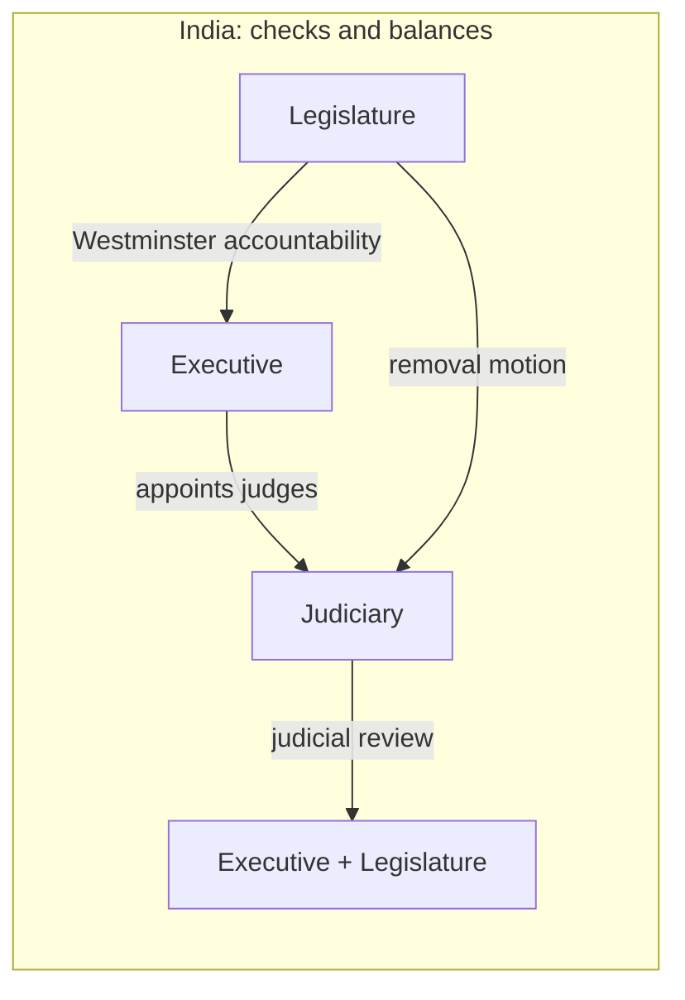
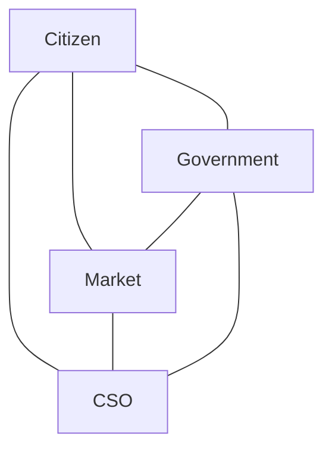

# 01 — Fundamentals of Governance and Role of Civil Services

### Lecture 1 — 17 September 2026

> **Date of Lecture:** 17 September 2026 (Lecture 1)  
> **Date Added:** 2026-09-17  
> **Lecture code:** **Gov-PS** (same faculty as Internal Security). Sheet: **~30/300** Mains; **~4/10** Prelims PYQ; **Yellow Book** after class.  
> **Source:** Vajiram & Ravi class + audio transcript + 6 handwritten sheets (dated **17/9/26**, circled **1–6**)  
> **Paper:** **GS-II** — Governance.  
> **How to read class shortcuts:** full form on first use. Glossary at the end.

**Already elsewhere — do not restudy as a new topic:** Directive Principles of State Policy (DPSP) as a *polity* chapter (this faculty’s **Pol-PS** later). **Viksit Bharat — Guarantee for Rozgar and Ajeevika Mission (Gramin) (VB-G RAM G)** vs Mahatma Gandhi National Rural Employment Guarantee Act (MGNREGA) = [22 August 2026 CA](file:///c:/Users/nitee/OneDrive/Desktop/UPSE_Syllabus/Current_Affairs/August_2026/2026-08-22_Current_Affairs.md). **Equalisation Levy / faceless assessment** sit on Economy tax notes. Today only uses those as *governance dimensions*.

**Parked for next class:** merits and demerits of the **generalist** nature of civil services. Full chapters on **Right to Information (RTI) Act**, **Citizen Charter**, **pressure groups**, **e-governance**.

**Mains lock Sir opened with:** “Minimum government and maximum governance is **not merely a slogan** but an **administrative philosophy**. In the context of the statement, discuss various initiatives taken by the Government of India to promote minimum government and maximum governance.”

---

## 1. No universal definition; government ≠ governance (GOV-01-01)

There is **no universal definition** of governance. **World Bank**, **Asian Development Bank (ADB)**, **United Nations Development Programme (UNDP)** each define it for their own convenience — and therefore list **different determinants**.

**Generalist approach (class lock):** governance is a **process** by which **formal and informal** actors interact to manage the **social, economic and political affairs** of the State.

| | **Government** | **Governance** |
|:---|:---|:---|
| What it is | An **institution** | A **process** |
| Approach | **Formal** — believes in the **attainment of formal power** | **Formal + informal** |
| Character | **Rigid** | **Flexible** |

**Government is not governance.** Government is **one component** of the process of governance.

**Informal components (sheet):** Civil Society Organisations (CSOs) — Non-Governmental Organisations (NGOs), Self Help Groups (SHGs), **pressure groups**, **market**.

**Pressure group (class):** any organisation that does **not** believe in the attainment of **formal power**; it aims at **influencing government policy from outside**. May use democratic or undemocratic instruments. **Refrains from electoral politics.**

**Class examples**

1. **Paper-leak protests** — not a political party; not part of government; still moved the Education Minister / Government of India to announce a **high-level committee** on examination leaks.  
2. **Farmers’ Protest 1.0** — three farm laws had been passed by a party with **272+** in the Lok Sabha; still **revoked**. Pressure, not formal power.

**Prelims trap:** a pressure group is **not** “informal so it cannot change statute.” Farmers’ Protest **did**.

---

## 2. Kautilya, Plato, welfare, DPSP (GOV-01-02)

Governance is **not new**.

**Kautilya**, *Arthashastra*: good governance **revolves around the traits of a good king**. A good king delivers good governance. Sheet traits:

- **Just and fair**
- **Pays fixed salary** to his subjects
- **Anti-corruption** measures
- **Replaces bad ministers** with good ones
- **Appreciative of writers** — writers are **critical** of policy; class: same role is anticipated of **media** as the **fourth pillar** of democracy

**Plato**, *Republic*: **goodness shall not be a concept**; it shall be the **ultimate aim of any State**. It must show in **diversified policymaking** — social, economic, administrative — not in a few “good” schemes. Class: this is the **welfare State**.

**Welfare (class sum):** the **greatest good** that can be done to the **greatest number** of people, **without much discrimination**. Plato’s **uniform development of all sections without compromising any section** is **utopian** — modern governance always trades off (reservation = social justice vs “killer of meritocracy / administrative efficiency”).

**Indian reflection:** [Directive Principles of State Policy (DPSP)](file:///c:/Users/nitee/OneDrive/Desktop/UPSE_Syllabus/Articles/Article_41.md) — **Part IV**. **Visionary / constitutional directives** from the **framers** to **today’s policymakers**. They **envision a welfare State**.

**Class Jai Aspah (lock, write this):** DPSPs **not only fulfil the aspirations of various sections of society** but also **cater to the dynamics of modern governance**. Highly **diversified**.

---

## 3. DPSP as modern governance (class chain, not a polity dump) (GOV-01-03)

Part IV **opens at Article 36**; class started the **working** articles at **38**.

| Article | Class line | Governance use |
|:---|:---|:---|
| **38(1)** | Social, economic and political **justice** shall inform all institutions of national life | Socialist character |
| **38(2)** | **Minimise** inequalities of **income**; **eliminate** inequalities of **status, facilities and opportunities** — among citizens **and** groups in different parts / vocations | |
| **39** | Dignified opportunity to earn a livelihood | |
| **39(b)–(c)** | **Distributive** economic system: resources **shall not be concentrated**; distributed to **subserve the common good** | |
| **39(d)** | **Equal pay for equal work** for men and women → **Equal Remuneration Act** (same recruitment + same conditions of work → same salary) | Gender justice |
| **39(e)–(f)** | Women and children shall not, by economic weakness, be victims of **moral or physical abuse** | Weaker sections |
| **40** | Organise **village panchayats** | **Principle of subsidiarity** |
| **[41](file:///c:/Users/nitee/OneDrive/Desktop/UPSE_Syllabus/Articles/Article_41.md)** | Right to **work**, **education**, and **public assistance** in cases of **undeserved want** | Widow / disability / unemployment |
| **42** | Just and humane conditions of work + **maternity benefit** | SC: maternity relief is **fundamental** — read with **Art 21**. **Vishaka** guidelines (workplace protection of women); class tied the statute year to the **Sexual Harassment of Women at Workplace (Prevention, Prohibition and Redressal) Act, 2013** |
| **[44](file:///c:/Users/nitee/OneDrive/Desktop/UPSE_Syllabus/Articles/Article_44.md)** | Uniform Civil Code | SC: **triple talaq** unconstitutional (dignity of Muslim women; breaking the marriage without conciliation). Read with **Art 14** and **Art 21** |
| **[47](file:///c:/Users/nitee/OneDrive/Desktop/UPSE_Syllabus/Articles/Article_47.md)** | **Improve public health** — a **constitutional obligation** | AIIMS expansion; Integrated Child Development Services (ICDS); **Mission Indradhanush**; **Ayushman**. National Health Policy preamble: **right to health is a fundamental right** |
| **[48A](file:///c:/Users/nitee/OneDrive/Desktop/UPSE_Syllabus/Articles/Article_48A.md)** | Protect environment and wildlife | **Graded Response Action Plan (GRAP)** 1–4 by Air Quality Index (AQI) in the National Capital Territory; **DEVI** (Delhi electric public transport, **zero carbon**, class: doing away with Compressed Natural Gas (CNG) too); **Faster Adoption and Manufacturing of Electric Vehicles (FAME)** — Ministry of Heavy Industries; **Bharat Stage (BS) IV discontinued → BS VI** with **catalytic converters** |

**Principle of subsidiarity (Art 40 lock):** **majority of powers and functions** shall sit with the tier **nearest to the people**. People have direct access to that tier; that tier has direct access to the people. Easier to reach a **gram pradhan** than a Member of Parliament (MP) / Member of the Legislative Assembly (MLA).

**Before Panchayati Raj Institutions (PRIs) and Urban Local Bodies (ULBs):** powers sat with **Union or State** → **excessive centralisation** → **grassroots** development suffered. **Third tier:** PRIs (rural — gram / block / district) and ULBs (urban; class: Municipal Corporation of Delhi).

**73rd and 74th Constitutional Amendment Acts** added **Part IX** and **Part IXA**. Class numbers: **29** functions to PRIs; **18** to ULBs. Before that those functions were Union/State work.

**Undeserved want (Art 41):** an unfortunate situation you do **not** want but that **may** still happen. Liability then shifts to the **State** (subject to **economic capacity**). Class illustrations: **Haryana** widow pension (and support for dependent children); **Uttarakhand** *divyangjan* pension; **unemployment allowance** via district **employment exchange** until work matching calibre / experience / qualification is found. Do **not** invent a ₹5 lakh/month claim — class joke: capacity of the State.

---

## 4. World Bank 1989 — three determinants (GOV-01-04)

**Most widely acclaimed** definition (class: **not** “universally accepted”) is the **World Bank, 1989** document ***Sub-Saharan Africa: From Crisis to Sustainable Development***.

**Determinants**

1. **Kind of political regime** — how government is **selected, monitored and replaced**.  
   - India **selects / replaces** by **universal adult franchise** — **Article 326**. Elections are a **periodic festival**.  
   - India **monitors** by **RTI**, **Public Interest Litigation (PIL)**, petitions, **judicial review**, **judicial activism**.  
   - Class contrast: **North Korea** (autocracy; 99.3% vote for the regime — not an election); **Iraq / Bangladesh** (political turmoil); **Pakistan** (military State); **Nepal** (democracy that is **not stable** — Gen-Z protests). **Mere existence of democracy is not enough; it must be stable.**

2. **Interaction among organs of the State.**  
   - **Montesquieu:** **separation of powers** = **watertight compartmentalisation** — Executive, Legislature, Judiciary shall **not intervene** in each other’s functions.  
   - **India adopted it as checks and balances.** Core: **each organ exercises reasonable control over the other in order to legitimise their action.**  
   - Judiciary → Executive/Legislature: **judicial review** = power of the **higher judiciary** (Supreme Court + High Courts; rest = subordinate) to declare a legislative or executive action **null and void** *to the extent* it is **ultra vires** (outside the Constitution). **Not** the whole law if only a slice is inconsistent.  
   - Legislature → Executive: **Westminster** parliamentary model (from the **United Kingdom**). Council of Ministers (executive) introduces a bill; the House **passes** it — political **and** financial accountability. Executive **is part of** the legislature (Prime Minister is also an MP).  
   - Executive → Judiciary: **appointment** of judges (President).  
   - Legislature → Judiciary: **removal** of SC/HC judges (motion in either House).  
   - **Prelims trap:** organic / watertight separation can promote **constitutional despotism**. Separation is **not always** quintessential to good governance. India writes **checks and balances**, not Montesquieu’s watertight boxes.  
   - Extra: **right to recall** in some PRIs — **Bihar**; **Haryana** (class: latest). Direct-democracy cousin (Switzerland).

3. **Role of markets and civil society organisations** → next section.

Citizens also sit inside this interaction: **mygov.in** invited public views on the **Budget**.

---

## 5. Markets, CSOs, triangle, and a progressive idea (GOV-01-05)

**Three components of governance:** **government** (the core) + **markets** + **CSOs**. Aim: **consensus-oriented** and **citizen-centric** governance — citizen at the **pivotal** position.

**Markets = market regulation, to avoid market failure.**

**Jio price war (class case):** pre-Jio — Subscriber Identity Module (SIM) ~₹100–150; incoming beyond a ~**180–200 km** roaming circle charged (even **inside** a State); outgoing ~**₹2.67**/minute; internet a dream; Short Message Service (SMS) a luxury. Jio gave voice/data/**even the SIM** free for **one year** and wanted a **second** year. **Telecom Regulatory Authority of India (TRAI)** stopped free service **beyond one year**.

Why intervene if Jio had paid **spectrum** auction fees? **Level playing field** for other Telecom Service Providers (TSPs). Class: **Idea** first-quarter loss ~**₹1,300 crore**; Idea could not sustain → **Vi**. **Airtel / Vodafone / Tata / MTS / Videocon** thinned out. Earlier **~7–8** major TSPs; a continued freebie path → **natural monopoly** → year 4 the survivor can charge (class: ₹1,500/month) because the customer has **no choice**. That is **bad governance** on the **economic** dimension. Public-sector cousin still on the board: **Bharat Sanchar Nigam Limited (BSNL)**.

**CSOs = linchpin** between **State and citizens**; they promote **grassroots** governance.

**Governance is dynamic and progressive — not static.** Determinants **vary by space and by time**. Even **inter-State** models differ (Arunachal Pradesh ≠ Uttar Pradesh; border States ≠ heartland).

| Space | Class problem | Governance implication |
|:---|:---|:---|
| **Several African States** | **Poverty** (class: “fly-patty burger” / National Geographic protein example) | Afford three meals |
| **India** | **Population** = “mother of all problems”; **unemployment** | **Targeted** governance — State has **no magic wand** |
| **Iceland** | **Negative** population growth (Germany too) | Class: graduates get **USD 3,400**/month till a job is secured; outsiders invited to settle with benefits ~**₹70 lakh**/year |

**NITI Aayog report 2024 (class number):** **2014–2024** India lifted ~**24.5 crore** (~25 crore) from **Below Poverty Line (BPL)** to **Above Poverty Line (APL)**.

**Time (India):** **1950s–1990** **centralised economic planning** (Soviet-inspired: land, labour, capital, entrepreneurship under the State — what / when / how / for whom). **New Economic Policy 1991** — Liberalisation, Privatisation, Globalisation (LPG); end of **Inspector Raj** / quota. Class: even a **shaving blade** and **breakfast bread** were State-made. **2026:** **100% Foreign Direct Investment (FDI)** in **strategic** sectors like **space and defence** (with exceptions); **automatic route** = no prior approval, inform the Reserve Bank of India (RBI) within **30 days**. Railways: first **private** station **Habibganj** (after Bhopal); **Tejas** private trains; **divestment** even in a public-sector giant.

**Public administration** is **part of** governance. Post-1990s cousin = **New Public Management**. Both are about **management**.

---

## 6. Five dimensions (GOV-01-06)

List is **illustrative** — class: “the list is endless.”

| Dimension | Sheet examples |
|:---|:---|
| **1. Political** | Free and fair elections; democratic setup; political accountability; **decriminalisation of politics**; **Representation of the People Act (RPA), 1950** and **RPA, 1951** |
| **2. Economic** | Goods and Services Tax (GST) = **one nation one tax**; FDI; **single-window clearance**; **Single Window Interface for Trade (SWIFT)**; **faceless appeals** in income tax |
| **3. Legal and judicial** | Independent judiciary; judicial instruments — **judicial activism**, **judicial review**; **rule of law**; respect for **human rights** and **Fundamental Rights**; maintenance of **law and order**. Class aside: do **not** call the judiciary an “arbiter of corruption” — corruption is an **individual** attribute |
| **4. Social** | **VB-G RAM G** (MGNREGA successor — already in 22 Aug CA); **social audit**; reservation policy; women-empowerment / **Nari Shakti** (Vision **2047**: no woman left behind; unlock rural-woman potential) |
| **5. Administrative** | Use of Information and Communication Technology (ICT) = **e-governance**; **capacity building** under **Mission Karmayogi**; accountability via **RTI Act**; **Lokpal and Lokayuktas Act, 2013**; **Citizen Charters** |

**This faculty’s Governance syllabus (six heads):**

1. Fundamentals of governance *(today)*  
2. Role of civil services in a democracy *(started today)*  
3. RTI Act  
4. Citizen Charter  
5. Pressure groups  
6. E-governance  

---

## 7. Role of civil services — Weber + Westminster two heads (GOV-01-07)

**Three Mains frames (write these):**

1. Merits and demerits of the **generalist** nature of civil services. *(next class)*  
2. “Civil services are regarded as the **steel frame** of the nation.” Examine their role in **nation-building**. Cousin: “The steel is **rusted** and only the framework is left.” Critically analyse.  
3. “**New India** would require a **dynamic bureaucracy** with a **desirable skill set**.” Examine the need for **reforms**.

India opted for the **Max Weberian** model of bureaucracy, derived from **legal-rational authority**. Weber ranked three authorities; **legal-rational is best** because it has the **backing of law** / set legal principles / is **empirical**.

| Weber | Class |
|:---|:---|
| **Charismatic** | Individual persona — “self-styled godmen” |
| **Traditional** | Prevailing tradition — caste, clan; senior-most member of a joint family |
| **Legal-rational** | Backing of **law** → bureaucracy is its **manifestation** |

**Features of the Weberian model (correlate with India):**

1. **Merit-based selection** / qualification. Union Public Service Commission (UPSC) = class: “**garden of meritocracy**.”  
2. **Promotion** on **experience** (seniority matrix — you are not Cabinet Secretary on day two) **and** **achievements** (**out-of-turn** promotion for exemplary work).  
3. **Hierarchy** = **senior–subordinate** relationship.  
4. **Fixed salary.**  
5. **Impersonal behaviour** — **public office shall not satisfy private goals**. Government vehicle / perks are **not** for the dog walk, the spouse’s shopping, or the child’s joyride. Class: an Sub-Divisional Magistrate (SDM) in western Uttar Pradesh walking the official car with a dog = against impersonal behaviour.

**Importance — policy formulation and implementation**

Every ministry has **two heads** (Westminster):

| Head | Who | Job |
|:---|:---|:---|
| **Political** | **Minister** | **Visionary** |
| **Executive / administrative** | **Secretary** | Administrative **apparatus** that turns vision into **reality** |

The secretary gives **aid and advice** and equips the minister with inputs: **past experience of the policy**, **optimal use of resources**, **availability of resources**, **ground inputs**. Why the secretary can do this: **institutional memory**, acquired because civil servants are the **permanent executive**.

**Class quote (PM to a batch):** “**We are temporary and you are permanent.**” Governments come and go; civil servants stay and **smooth the transfer of power**. Think-tanks / planning: **NITI Aayog**; **D. Subbarao** (former RBI Governor, senior Indian Administrative Service (IAS)) — **impossible trinity** in economics (class: “holy trinity”).

**Upholding constitutional values.** Officials of the **All India Services (AIS)** are expected to serve **two masters** — **Union and State** — with the **same loyalty and dedication**. In the process they maintain **politically neutral** behaviour and **uphold constitutional values**.

**Maintenance of law and order.** AIS hold the **top-brass** positions in law-and-order administration → **national integration** + a **pivotal** role in **public order**.

---

## 8. Agent of change + administrative adjudication (GOV-01-08)

Civil servants act as **agents of change and social transformation**. Class: do **not** write only “awareness / women empowerment / implement schemes.” **Exemplify.**

| Name | Cadre / service (class) | Initiative |
|:---|:---|:---|
| **Smita Sabharwal** | IAS, Telangana | **Fund Your City** — voluntary public contributions → infrastructure |
| **Amit Kataria** | IAS, Chhattisgarh | Positive change in **Naxal-affected** areas |
| **Alex Paul Menon** | IAS, Chhattisgarh | **Surrender-cum-rehabilitation** of Naxalites (peaceful surrender → skill training → mainstream) |
| **Ashok Khemka** | IAS, Haryana (retired Additional Chief Secretary) | Anti-corruption crusader; **DLF land deal** |
| **Divya Mittal** | IAS | Clean drinking water, rural **Mirzapur** (class: she later resigned) |
| **Tukaram Mundhe** | IAS, Maharashtra | Against **food adulteration** |
| **Prem Prakash Meena** | IAS | **Nyay Aapke Dwaar** — doorstep grievance redressal (officials visit, hear, resolve on the spot) |
| **Sanjukta Parashar** | Indian Police Service (IPS) | **Anti-insurgency** |
| **T. N. Seshan** | IAS | **Electoral reforms** |
| **Prince Dhawan** | IAS | Welfare of **migrant workers** in **COVID-19** |
| **Anushri Sharma** | IAS | Education sector / COVID |
| **Armstrong Pame** | IAS | ~**100 km** road — connectivity to neighbouring villages |

**Unnamed class example:** a District Magistrate admitted **his own two daughters** to a **government school** → the school’s condition had to improve.

### Administrative adjudication

Most decisions that affect a citizen’s life come from **administrative** institutions, **not** courts. Citizens visit admin offices **more** than courts. Modern reform: give those institutions **quasi-judicial** powers → **quasi-judicial bodies**.

**Quasi-judicial body (class):** established by **Parliament or a State legislature**; **headed by administrative functionaries**; discharges **quasi-judicial** (semi-judicial) responsibilities. Enjoys the powers of a **civil court** under the Code of Civil Procedure.

**Examples:** Central Information Commission (CIC) / State Information Commission (SIC); **Central Administrative Tribunal (CAT)** / **State Administrative Tribunal (SAT)**.

**CAT / SAT (class close):** constitutional origin under **Article 323A** (Union public-service matters) and **Article 323B**.

**Why they exist**

- **Unburden the courts** (already overloaded — class cited the Chief Justice of India, including former **T. S. Thakur**).  
- Overcome **procedural rigidity**. Courts follow Bharatiya Nyaya Sanhita (BNS) / Bharatiya Nagarik Suraksha Sanhita (BNSS) (older pair: Indian Penal Code / Code of Criminal Procedure). Quasi-judicial bodies are **not** bound to that procedure; they work on the **Principle of Natural Justice (PNJ)** with **operational flexibility** (they can set their own sitting time and the manner of delivering justice).  
- **Cost-effective justice** — **no fee or minimum fee**.

**Prelims trap:** quasi-judicial ≠ “not a court, so no civil-court powers.” Class: they **do** enjoy civil-court powers; they are **not** bound by court *procedure*.

**Parked:** merits / demerits of the **generalist** nature of civil services = **next class**.

---

## Abbreviations

| Short | Full form (first use in this lecture) |
|:---|:---|
| **DPSP** | Directive Principles of State Policy (Part IV) |
| **PRI / ULB** | Panchayati Raj Institution / Urban Local Body |
| **CSO / NGO / SHG** | Civil Society Organisation / Non-Governmental Organisation / Self Help Group |
| **ADB / UNDP** | Asian Development Bank / United Nations Development Programme |
| **RTI / PIL** | Right to Information / Public Interest Litigation |
| **GRAP / AQI / FAME / BS** | Graded Response Action Plan / Air Quality Index / Faster Adoption and Manufacturing of Electric Vehicles / Bharat Stage |
| **TRAI / TSP / BSNL** | Telecom Regulatory Authority of India / Telecom Service Provider / Bharat Sanchar Nigam Limited |
| **RPA** | Representation of the People Act |
| **GST / FDI / SWIFT / ICT** | Goods and Services Tax / Foreign Direct Investment / Single Window Interface for Trade / Information and Communication Technology |
| **VB-G RAM G / MGNREGA** | Viksit Bharat — Guarantee for Rozgar and Ajeevika Mission (Gramin) / Mahatma Gandhi National Rural Employment Guarantee Act |
| **IAS / IPS / AIS / UPSC** | Indian Administrative Service / Indian Police Service / All India Services / Union Public Service Commission |
| **CIC / SIC / CAT / SAT** | Central / State Information Commission; Central / State Administrative Tribunal |
| **PNJ / BNS / BNSS** | Principle of Natural Justice / Bharatiya Nyaya Sanhita / Bharatiya Nagarik Suraksha Sanhita |
| **BPL / APL / LPG / NITI** | Below / Above Poverty Line; Liberalisation, Privatisation, Globalisation; National Institution for Transforming India |
| **MP / MLA / SDM / DM** | Member of Parliament / Member of the Legislative Assembly / Sub-Divisional Magistrate / District Magistrate |
| **UK / UP / UK (State)** | United Kingdom (Westminster); Uttar Pradesh; **Uttarakhand** (*divyangjan* pension — not the United Kingdom) |

<!-- 2026-09-17: Gov-PS L1 — fundamentals of governance (govt vs process; Kautilya/Plato/DPSP; World Bank 1989; markets/CSO; five dimensions) + civil services start (Weber, two heads, named officers, quasi-judicial). Generalist merits parked. Cluster GOV-01 due 18 Sep Q1. -->
