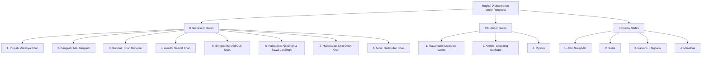
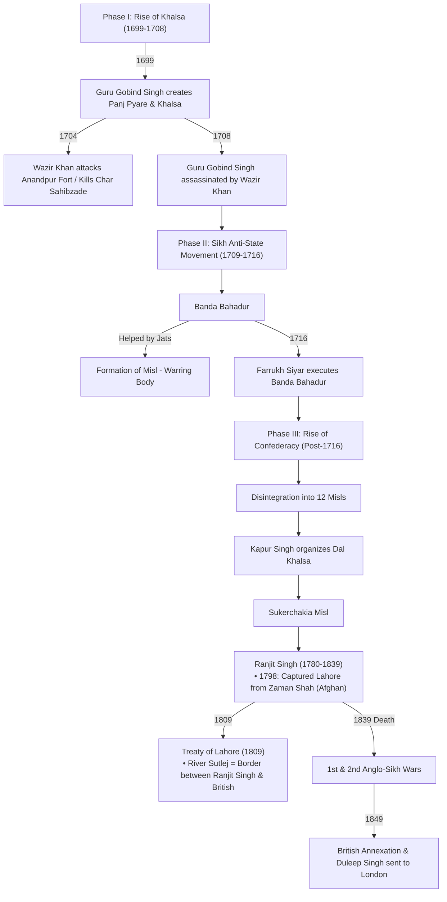
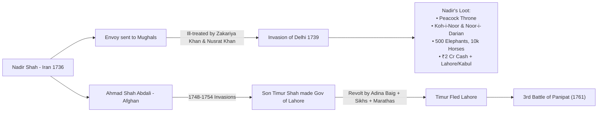
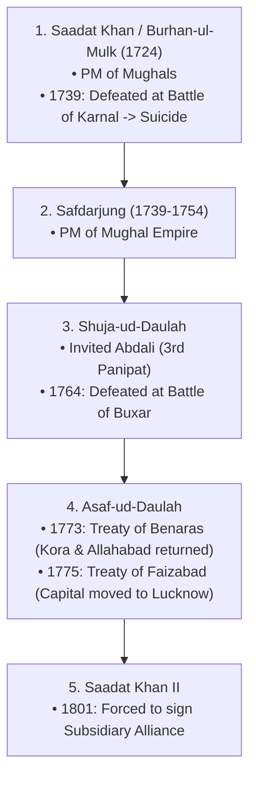

# Early Modern India (1707 Onwards)

> **Source:** Vajiram & Ravi class notes
> **Date added:** 2026-07-31

---

## 1. Later Mughals & Succession Timeline (1707–1748)

### Chronological & Contextual Breakdown

#### A. War of Succession (1707)
*   **1707**: Aurangzeb (AZB) died.
*   **Aurangzeb's 3 Sons** (Ages at AZB's death in 1707):
    *   **Azam** (age 71)
    *   **Muazzam** (age 69) ➔ **Victorious in succession war** ➔ Crowned as **Bahadur Shah I**.
    *   **Kam Baksh** (age 67)

#### B. Bahadur Shah I (1707 - 1712)
*   *Original Name*: Muazzam (Aurangzeb's 2nd son).
*   **Rise of Kingmakers**: **Zulfiqar Khan** (Governor of Gujarat) emerged as the dominant noble.
*   **Key Events**:
    1.  **Shahuji** (grandson of Chhatrapati Shivaji) was released from Mughal captivity to induce internal conflict among Marathas.
    2.  **1708**: Wazir Khan (Mughal noble/Governor of Sirhind) assassinated the 10th Sikh Guru, **Guru Gobind Singh**.

#### C. Jahandar Shah (1712 - 1713) & Zulfiqar Khan's Rise
*   *Succession Struggle (1712)*: After Bahadur Shah's death, a brutal war broke out among his 4 sons (Azim-ush-Shan, Rafi-ush-Shan, Jahan Shah, Jahandar Shah).
*   **Zulfiqar Khan's Brutal Strategy**: 
    *   Zulfiqar Khan engineered Jahandar Shah's victory by ruthlessly **killing his 3 rival brothers by crushing them under elephants' feet**.
    *   Jahandar Shah became Emperor, and Zulfiqar Khan became the Prime Minister (*Wazir*).
*   **Zulfiqar's Power Play**: 
    *   Zulfiqar Khan advised Jahandar Shah to **abolish Jaziya in Gujarat** (Zulfiqar's home base) to win over the local population and build a strong personal army.
*   **Backlash & Plot**:
    *   This aggressive accumulation of power by Zulfiqar Khan was strongly **disliked by the Sayyid Brothers** (Abdullah Khan & Husain Ali Khan).
    *   The Sayyid Brothers began plotting to overthrow Jahandar Shah and Zulfiqar Khan.
    *   To legitimize their revolt, they needed **royal Mughal blood** as their face. They convinced **Farrukh Siyar** (son of Azim-ush-Shan, one of the brothers crushed under elephants' feet by Zulfiqar).

#### D. Farrukh Siyar (1713 - 1719) & Maratha Alliance
*   **Accession**: Farrukh Siyar, with the help of the **Sayyid Brothers** (Abdullah Khan in Allahabad & Husain Ali Khan in Bihar), defeated and **killed Jahandar Shah & Zulfiqar Khan**.
*   **Key Reforms & Actions**:
    *   **Abolished Jaziya** nationwide.
    *   **1716**: Crushed the Sikh anti-state movement by executing **Banda Bahadur**.
    *   **1717**: Issued the **Golden Farman** to the East India Company (EIC), granting *Dastak* (toll tax exemption) and *Dastur* (customs duty exemption).

*   **Maratha Diplomacy & The Overthrow Plot**:
    1.  *First Proposal*: Peshwa **Balaji Vishwanath** proposed **Dual Governance** directly to Farrukh Siyar in 1716 (North to Mughals, South Swaraj to Marathas with 25% *Chauth* tax). **Farrukh Siyar rejected it.**
    2.  *Shift to Kingmakers*: Realizing Farrukh Siyar was a weak figurehead and that the **Sayyid Brothers were the real kingmakers**, Balaji Vishwanath approached **Husain Ali Khan**.
    3.  *The Coalition*: Husain Ali Khan convinced his brother **Abdullah Khan**. Together with Balaji Vishwanath and Maratha forces, they re-proposed the Dual Governance terms to Farrukh Siyar.
    4.  *Rejection & Execution*: Farrukh Siyar rejected it again and tried to plot against the Sayyid Brothers. In response, the **Sayyid Brothers (with Maratha support) killed Farrukh Siyar** in 1719 — making him the first Mughal Emperor to be executed by his own nobles.

#### E. Puppet Emperors (1719)
*   Need for a new royal Mughal face led the Sayyid Brothers to appoint sons of the late Rafi-ush-Shan:
    1.  **Rafi-ud-Darajat (1719)**: Placed as the royal face; died shortly after of Tuberculosis (T.B.).
    2.  **Rafi-ud-Daulah / Shah Jahan II (1719)**: Placed next; also died shortly after of Tuberculosis (T.B.).

#### F. Muhammad Shah 'Rangeela' (1719 - 1748)
*   **Accession**: After both brothers died of T.B., the Sayyid Brothers placed **Muhammad Shah** on the throne.
*   **Why called 'Rangeela'**: Known as *'Rangeela'* (the pleasure-seeker) due to his hedonistic lifestyle, obsession with music, dance, and neglect of state affairs.
*   **Elimination of Sayyid Brothers**: Recognizing the danger posed by the Sayyid Brothers, Rangeela allied with **Nizam-ul-Mulk** (Chin Qilich Khan) to assassinate the Sayyid Brothers.
*   **Impact**: Rangeela replaced experienced nobles with incompetent favorites, marking the catalyst for **total Mughal disintegration**.

---

## 2. Disintegration of the Mughal Empire

### Regional Classification

#### A. 8 Successor States
1.  **Punjab**: Zakariya Khan
2.  **Bangash**: Muhammad Bangash
3.  **Rohillas**: Khan Bahadur of Kumaon
4.  **Awadh**: Saadat Khan (Burhan-ul-Mulk)
5.  **Bengal**: Murshid Quli Khan
6.  **Rajputana**:
    *   *Jodhpur*: Ajit Singh
    *   *Jaipur*: 'Sawai' Jai Singh
7.  **Hyderabad**: Chin Qilich Khan (Nizam-ul-Mulk)
8.  **Arcot**: Sadatullah Khan

#### B. 3 Outsider States
1.  **Travancore**: Martanda Varma
2.  **Ahoms**: Chaolung Sukhapa (*Note: Annexed by British in 1826 under the Treaty of Yandabo*).
3.  **Mysore**

#### C. 4 Enemy States
1.  **Jats of Bharatpur**: Suraj Mal (*known as the 'Plato of the Jat tribe' / Ulysses*).
2.  **Sikhs**
3.  **Iranians & Afghans**
4.  **Marathas**

---

## 3. The Sikh Empire & Regional Evolution

### Detailed Evolution

#### Phase I: Rise of Khalsa (1699–1708)
*   **1699**: Guru Gobind Singh founded the **Akali Movement**.
    *   **Panj Pyare**: The five baptized leaders.
    *   **Khalsa**: Self-governing Sikh body.
*   **1704**: Wazir Khan (Mughal noble) attacked Anandpur Fort and killed the Guru's 4 sons (**Char Sahibzade**).
*   Sikhs captured the Red Fort; Aurangzeb summoned the Guru to the Deccan.
*   Before departing, Guru Gobind Singh selected **Banda Bahadur** to lead the Khalsa.
*   **1707**: Aurangzeb died; Guru Gobind Singh met Bahadur Shah I.
*   **1708**: Wazir Khan assassinated Guru Gobind Singh.

#### Phase II: Sikh Anti-State Movement (1709–1716)
*   **1709**: Banda Bahadur initiated an anti-state uprising, raiding trade routes.
*   Joined by **Jats**, who were granted entry into the Khalsa (*Men ➔ Singh, Women ➔ Kaur*).
*   Formed the **Misl** (armed warring units).
*   **1716**: Emperor Farrukh Siyar captured and executed Banda Bahadur.

#### Phase III: Rise of Confederacy & Sikh Empire (Post-1716)
*   Post-Banda Bahadur, the movement split into **12 Misls**.
*   **Kapur Singh** reorganized them into the **Dal Khalsa** (incorporating Rajputs & Sindhis).
*   **Sukerchakia Misl**: Led by a 9-year-old boy, **Ranjit Singh**.
*   **Ranjit Singh (1780–1839)**:
    *   **1798**: Captured Lahore from Afghan ruler Zaman Shah and made it his capital.
    *   **1809 — Treaty of Lahore**:
        *   Framed during the **Great Game / Eastern Question** (fear of Franco-Russian invasion via Persia & Afghanistan).
        *   British policy: *Masterly Inactivity*.
        *   Agreement: River Sutlej established as the border between Ranjit Singh's kingdom (Lahore) and British India (Cis-Sutlej).
        *   British provided arms, training, and funds to Sikhs to counter Afghans.
*   **Post-Ranjit Singh (d. 1839)**:
    *   Internal power struggle (Widow Jind Kaur, minor son Duleep Singh, Dogra Rajputs).
    *   **1st Anglo-Sikh War (1845–46)**:
        *   *Treaty of Amritsar (1846)*: Kashmir sold for ₹75 Lakhs to Dogra Rajput **Gulab Singh**.
        *   *Treaty of Bhaironwal*: British Resident **Henry Lawrence** appointed for minor Duleep Singh.
    *   **2nd Anglo-Sikh War (1848–49)**:
        *   Mulraj vs. British.
        *   *1849*: Sikhs forced into Subsidiary Alliance; Duleep Singh exiled to London.

---

## 4. Foreign Invasions (Iranian & Afghan)

### A. Nadir Shah (Iran - Safavids)
*   **1736**: Nadir Shah seized power in Iran.
*   **Incident**: Sent an envoy to Mughal Emperor Muhammad Shah Rangeela requesting:
    1. Revival of friendship.
    2. Denying asylum to Iranian rebels in Kabul/Lahore.
*   Mughal governors Zakariya Khan (Lahore) and Nusrat Khan (Kabul) ill-treated the envoy.
*   **1739 — Battle of Karnal**: Nadir Shah defeated Mughals.
*   **Nadir Shah's Loot**:
    1. Peacock Throne (*Takht-i-Taur*).
    2. Koh-i-Noor and Noor-i-Darian diamonds.
    3. 500 elephants, 10,000 horses, ₹2 Crore cash.
    4. Territorial cession of Lahore and Kabul.

### B. Ahmad Shah Abdali (Afghan)
*   Succeeded Nadir Shah as Afghan ruler.
*   **Invasions**:
    *   **1748**: Failed to capture Lahore from Mir Mannu.
    *   **1749**: Defeated Mir Mannu and captured Lahore (during Emperor Ahmad Shah's reign).
    *   **1751**: Invaded Kashmir.
    *   **1754**: Invaded Delhi (during Emperor Alamgir II's reign).
*   Appointed his son **Timur Shah** as Governor of Lahore.
*   **Revolt against Timur Shah**:
    *   **Adina Baig** (Governor of Jullundhur) allied with Sikhs and Marathas (**Raghunath Rao** & **Dataji Scindia**).
    *   *Result*: Timur Shah fled. Adina Baig got Lahore. Marathas captured **Attock Fort** and extracted *Chauth*.

### C. 3rd Battle of Panipat (1761)
*   **Cause**: Abdali invaded to avenge his son Timur Shah's expulsion (during Emperor Shah Alam II's reign).

| Faction | Composition / Leaders |
| :--- | :--- |
| **Afghan Coalition** | Ahmad Shah Abdali + Bangash + Rohillas + Awadh (Shuja-ud-Daulah) |
| **Maratha-Mughal Coalition** | Viswas Rao (Peshwa's Son), Sadashiv Rao Bhau (Peshwa's Brother), Ibrahim Gardi (French-trained Artillery), Bussy's French Contingent |

*   **Impact & Consequences**:
    1. Accelerated total Mughal disintegration.
    2. Halted Maratha imperial expansion in North India.
    3. Blocked British expansion into North-West Frontier Province temporarily.
    4. Created a power vacuum that facilitated the rise of Sikh power in Punjab.

---

## 5. Regional Powers: Awadh

### Timeline of Nawabs of Awadh
1.  **1724 — Saadat Khan (Burhan-ul-Mulk)**:
    *   Founded Awadh state; served as Mughal Prime Minister.
    *   **1739 (Battle of Karnal)**: Defeated by Nadir Shah; committed suicide under pressure.
2.  **Safdarjung (1739–1754)**:
    *   Succeeded Saadat Khan; appointed Prime Minister of the Mughal Empire.
3.  **Shuja-ud-Daulah**:
    *   Denied PM position; allied with Abdali in 1761.
    *   **1764 (Battle of Buxar)**: Defeated by British East India Company.
4.  **Asaf-ud-Daulah**:
    *   **1773 — Treaty of Benaras**: Kora and Allahabad restored to Awadh.
    *   **1775 — Treaty of Faizabad**: British penetration into Awadh; shifted capital from **Faizabad to Lucknow**.
5.  **Saadat Khan II**:
    *   **1801**: Signed Lord Wellesley's **Subsidiary Alliance**, surrendering half of Awadh's territory to the British.
