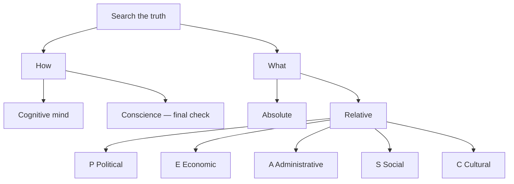
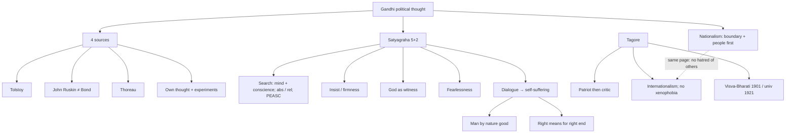
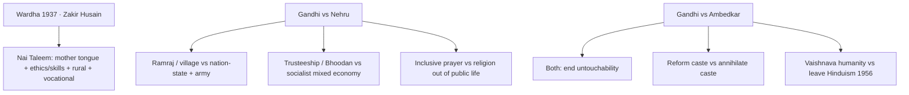

# Modern India (1860s–1940s) — Lectures 1–7: Nationalism to Gandhi–Nehru–Ambedkar Dialogues

> **Date of Lecture:** 8 September 2026 (**Lecture 7**)  
> **Earlier lectures:** 11 August 2026 (L1), 21 August 2026 (L2), 27 August 2026 (L3), 30 August 2026 (L4), 1 September 2026 (L5), 6 September 2026 (L6)  
> **Date Added:** 2026-08-30; L5 **2026-09-01**; L6 **2026-09-06**; L7 **2026-09-08**  
> **Subject:** GS-I (Modern Indian History) | **Also relevant for:** GS-IV (Ethics — Thinkers: Gandhi, Nehru, Tagore, Ambedkar), Essay, Prelims, Interview  
> **Source:** Class Notes (Dictated + Abstract) | Study Material (Handouts + Yellow Books) | *India's Struggle for Independence* — ed. Bipan Chandra (Penguin)  
> **Standard Textbook:** *India's Struggle for Independence* by Bipan Chandra et al. (Penguin, India Ltd.) — Covers 1857–1947, Undergraduate level  

---

## Syllabus Mapping & Exam Relevance

| Paper | Relevance |
|:---|:---|
| **GS-I (Mains)** | Indian History — Modern India, Freedom Struggle, Social Issues |
| **GS-IV (Ethics)** | Thinkers: Buddha → Vivekananda → Gandhi → Nehru → Tagore → Ambedkar |
| **Essay** | At least 1 out of 8 essays regularly from Modern Indian History themes |
| **Prelims** | Ancient + Medieval + Modern History (no World History) — Statement-based conceptual MCQs |
| **Interview** | 3–5 minutes on Freedom Struggle & Modern India themes; favourite leader questions |

---

## Topics Covered in These Lectures

1. **Nationalism:** A brief definition → Origin in Europe & America
2. **Nationalism in India:** When, where, among whom → Factors responsible for emergence of Indian Nationalism (+ debate on whether India is "real" or "imagined" nation)
3. **Formation of INC** — Safety Valve Theory vs Nationalist Theory
4. **The Moderate Phase of INC: 1885–1905** — Demands, methods, contribution & criticism
5. **Swadeshi Movement (1905)** — Partition of Bengal, course, features, Surat Split, Moderates vs Extremists
6. **Indian Councils Act 1909** — Background, clauses (CLC 69, separate electorate), critique
7. **Three Delhi Durbars (1877 / 1903 / 1911)** — Lytton famine, Curzon, Hardinge II
8. **1911 announcements** — Bengal reunited; capital Calcutta → Delhi
9. **Home Rule Leagues, 1916** — Tilak (Pune) & Besant (Madras); urban limit; Gandhi’s critique
10. **Lucknow Pact, 1916** — INC–Muslim League; 1/3 seats; 3/4 Muslim veto
11. **Lucknow Pact (C) — significance** — communal harmony; Rowlatt 1919; Khilafat–NCM 1920–22; Montagu–Chelmsford → Government of India Act 1919
12. **The Making of Mahatma** — Gandhi in South Africa (1893–1914/15); Satyagraha named; religious thought
13. **Lecture 6 — Mass Mobilizations and the Dialogues (part taught 6 Sep)** — Gandhian political thought; Satyagraha as method; Gandhi & Tagore on nationalism and education.
14. **Lecture 7 — 8 Sep** — **Wardha Scheme / Nai Taleem (1937)**; Gandhi vs Nehru (state, trusteeship, religion); Gandhi vs Ambedkar (untouchability, caste, Hinduism). **1917–48 movements** still later.

---

### Lecture 1 — 11 August 2026

## 1. Nationalism — Definition (MOD-B1-01)

### What is Nationalism?

**Nationalism is a modern political thought based on a feeling of oneness — real or imagined.**

It is an idea in which people of a **defined territory** believe that they share:

- **Common origin** — ancestral roots, racial stock
- **Common ethnicity** — physical appearance, racial characteristics (e.g., Proto-Australoid, Mediterranean, Mongoloid)
- **Common culture** — food, dress, way of life, marriage customs, music, architecture, painting, festivals
- **Common history & heritage** — monuments like Harappa, Ajanta, Taj Mahal, Konark Temple evoke a shared pride
- **Common value system** — e.g., *Atithi Devo Bhava*, respect for elders, parental obedience
- **Shared aspirations** — collective vision for the future

### The "Us vs Them" Boundary

Nationalism creates a distinction between **"us" and "them"** based on:
- Origin & ethnicity
- Culture & language
- History & heritage
- Value systems & aspirations

This consciousness leads to the creation of a **Nation-State**: first, a belief that "we are one nation" (nation = people), then, a defined boundary → common government, parliament, constitution, currency, tax system.

### "Real or Imagined" — The Scholarly Debate

Some historians (e.g., **Yuval Noah Harari** in *Sapiens*) argue nationalism is **imagined, not real**:
- Globally, a community truly knows each other by name and face to about **250 families** (international average; India ~500)
- In a huge country like India — from Kashmir to Kanyakumari — you cannot personally know most fellow "nationals"
- The feeling of oneness is therefore a **constructed belief**, not a lived reality

**Ancient & Medieval Period — No Nationalism:**
- People lived under **empires** (Roman, Mauryan, Gupta, Mughal) — ruled from top by emperor/king
- Communities at the bottom had **tribal/community pride**, not national consciousness
- When empires collapsed, communities became independent again → cycle repeats
- Mauryans conquering Kalinga → Kalinga people saw Magadha as "outsiders"
- Rajendra Chola attacking North → Northerners saw Cholas as "outsiders"
- 36 Rajput clans fighting each other — no concept of "Indian unity"

**Key Insight:** Nationalism is a **modern concept** (18th century Europe, 19th century India). The idea that "we are all Indian" was absent in ancient and medieval times.

---

## 2. Origin of Nationalism — Europe & America (MOD-B1-02)

### Chronology

| Event | Year | Significance |
|:---|:---:|:---|
| **American Revolution** | 1776 | First assertion of modern national self-determination |
| **French Revolution** | 1789 | Liberty, Equality, Fraternity — basis of modern nation-state |
| **European Revolutions** | 1830, 1848 | Gave birth to modern nation-states across Europe |

### Why Nationalism was Easier in Europe

European countries (England, France, Germany, Italy, Spain, Portugal, Denmark, etc.) found it **easier** to create nation-states because they were:
- **Relatively homogeneous** — in race, language, religion, culture
- **Smaller in size** — Most European countries (minus Russia) smaller than Indian states; some smaller than Indian districts
- **~50 countries in Europe** — an area smaller than undivided India (including Pakistan & Bangladesh)

**Example:** If you travel from Poland to Portugal, you enter a new country every ~30 minutes. In India, UP alone takes an entire night by Rajdhani Express. Israel's size = half of Ghaziabad; its population (25 lakh) is a fraction of Delhi's (2.5 crore).

### Birth of Nation-States
Through revolutions, wars, and movements, European communities created nation-states by asserting:
- "We share common race, language, religion, culture"
- "We need our own government, parliament, constitution"
- Even small groups fought for statehood → Czechoslovakia split into Czech Republic & Slovakia

---

## 3. Nationalism in India (MOD-B1-03)

### When, Where, Among Whom?

> **"India is a nation in the making."**  
> — S.N. Banerjee or Gopal Krishna Gokhale (c. 1903)

**In India, nationalism was first born or emerged in Bengal, Bombay, and Madras regions, among the middle educated class, during the period of 1860s, 1870s, and 1880s (late 19th century), which continued to grow later on.**

### Key Characteristics

- **Not a single event** — nationalism is a **feeling** that emerges gradually, not born on a specific date
- **First emerged among small elite** — educated, upper-middle-class professionals in three presidency towns
- **Grew in two dimensions:**
  1. **Deepening** — becoming stronger over time
  2. **Widening** — spreading to new sections of society and new regions

### India's Unique Challenges for Nationalism

Unlike European countries, India faced **two massive obstacles**:

| Challenge | Details |
|:---|:---|
| **Giant Size** | Undivided India (with Pakistan & Bangladesh) was bigger than entire Europe minus Russia |
| **Enormous Diversity** | Multiple races, 750+ languages (Census 2011: 101 scheduled; Linguistic Survey: 750), each with multiple dialects (UP alone has 16); multiple religions with sects within (Vaishnavism, Shaivism, Shaktism, Shia, Sunni); 4 Varnas but 8,000+ Jatis (including 400+ Muslim Jatis) |

### Pre-Existing Consciousness vs. National Consciousness

Indians had **strong consciousness** of:
- ✅ **Caste** — hierarchy, position, rules (since ancient times)
- ✅ **Sect within religion** — Vaishnavism vs Shaivism, Sunni vs Shia
- ✅ **Language & region** — strong regional identities

But they **lacked consciousness** of:
- ❌ **Indian-ness** — the idea that "we are all Indian" regardless of caste, religion, language

**This national political consciousness started emerging only in the late 19th century** — which is where the UPSC syllabus on Modern India begins.

### Contemporary Perspective — Ramachandra Guha (c. 2015)

- **Two-thirds** of Indians have accepted the idea of India (i.e., feel proud to be Indian beyond caste/religion/language identity)
- **One-third** have not fully accepted — separatist feelings persist in:
  - Parts of **North-East** (especially Nagaland)
  - **Punjab** (Khalistan movement — subdued but revived in Canada, UK)
  - **Kashmir** (not fully resolved)
  - **Tamil Nadu** (1960s–70s anti-Union protests)
  - **Naxal belt** (central India) — against the very idea of the Indian state
- Integration of India — physically and emotionally — is **still an ongoing project**
- ~35% Indians today live outside their birth-state → strengthens national integration

### Two Types of Struggle in Freedom Movement

1. **Indian vs. British** — the anti-colonial struggle
2. **Indian vs. Indian** — the struggle to unite diverse Indians under one national identity

The freedom struggle became **very long** precisely because the first challenge (uniting Indians) itself took decades.

---

## 4. Factors for the Emergence of Indian Nationalism (MOD-B1-04)

> **Question (Mains-type, 250 words, 15 marks):** *"Discuss the various factors that contributed to the emergence of Indian nationalism in the late 19th century."*

### Factor A: Administrative Unification of India (1772–1858)

- British completed administrative unification of India between **1772 and 1858**
- Created **uniform administrative structure** across the country:
  - **Office of District Magistrate** — first established in **1772** (under Warren Hastings)
  - **Office of Superintendent of Police** — first established in **1793** (under Cornwallis)
  - **Office of Commissioner** — established across regions
- These offices exist in every district of India even today
- **Impact:** Gave a **sense of oneness** to different parts of India — same administrative framework from Bengal to Punjab to Madras
- **Note:** British did it for **their own sake** (governing India, collecting revenue, exploiting resources) — but it helped create a unified administrative identity (*blessing in disguise*)

### Factor B: Uniform Legal System — IPC, CrPC & Judicial Institutions

- **Uniform IPC (Indian Penal Code)** — since **1862**
- **Uniform CrPC (Code of Criminal Procedure)** — since **1890** (originally 1861/1872)
- **Uniform Judicial Institutions — High Courts** — since **1865** (first three: Calcutta, Bombay, Madras)
- **English language** as medium of higher education helped in uniting Indians across diverse customs and practices

**Impact:**
- Before IPC, India had **no common criminal law** — customs of marriage, inheritance, property varied from community to community
- IPC sections like **302 (Murder), 307 (Attempt to Murder), 420 (Cheating/Forgery), 144 (Assembly restriction/Curfew)** became pan-India
- Uniform law bound Indians together under one legal identity
- **Note:** Again, British purpose was colonial governance — positive impact on Indian unity was a **spin-off benefit**

### Factor C: Social-Religious Reform Movements of 19th Century

- Movements like **Brahmo Samaj, Arya Samaj, Ramakrishna Mission** and others:
  - Gave birth to **cultural consciousness** — the awareness that Indians share a **common Hindustani culture**
  - *Hindustani culture* = neither pure Hindu, nor pure Islam, nor pure Buddhist — but a **unique mix**; not pure Aryan or Dravidian; not pure Hindi or Tamil
  - Often described as **"Unity in Diversity"**
- Reform leaders **travelled, met each other** — Bengalis and Punjabis, Marathis and Tamils — agitating for same social causes (education, superstition removal)
- This cultural consciousness **further helped** in the emergence of **national political consciousness**

**Progression:** Community consciousness → Cultural consciousness → **National Political consciousness**

### Factor D: Economic Exploitation of India by the British

British economic policies brought:
- **Poverty** — widespread impoverishment
- **Famines** — recurring and devastating
- **De-industrialization** — destruction of traditional Indian industries (textiles, handicrafts)
- **Unemployment** — loss of livelihood for millions
- **Drain of Wealth** — transfer of Indian resources to Britain (theory given by **Dadabhai Naoroji**)

**Impact:**
- The **educated class** became conscious of the impact of colonial rule
- They started **writing and talking** about the misadventure of British rule
- Economic historians wrote series of articles from **1860s to 1890s** in Calcutta, Bombay, Madras, and London
- **Common grievance unites victims** — a Bengali victim and a Madrasi victim, a Punjabi farmer and a UP farmer, were all suffering the same colonial exploitation
- This common economic suffering helped develop a **national consciousness**

**Key Figures:** Dadabhai Naoroji (Drain Theory), R.C. Dutt, and other economic nationalists of the late 19th century

### Factor E: Modern Liberal Political & Scientific Thought

**Modern Liberal Political Thought** such as:
- **Liberty, Equality, Fraternity, Justice**

**Modern Scientific Thought** such as:
- **Observation, Questioning authority, Reasoning, Scientific temper**

**How it spread:** Through modern **schools, colleges, books, journals, and newspapers** established during British period

**Impact:**
- Educated Indians adopted ideas of **reasoning** and **questioning the state** — the mother of all modern knowledge
- Led to questioning of feudal/monarchical claims (e.g., divine right of kings: Mughal *Zillellahi* = Shadow of God; Rajput rulers claiming to be *Avatars* of Vishnu)
- These ideas are enshrined in the **Indian Constitution** (Article 14 — Equality; Preamble — Liberty, Equality, Fraternity, Justice)
- **Key Pioneers:** Raja Ram Mohan Roy (established girls' school in Calcutta in 1820s; died 1833), Dadabhai Naoroji, Gopal Krishna Gokhale, Surendranath Banerjee

**Important Distinction:**
- **Westernization** = adopting Western dress, gadgets, lifestyle (superficial)
- **Modernization** = adopting modern values — equality, liberty, scientific temper, questioning authority (substantive)
- India became **westernized quickly** but has been **slow to modernize**
- This paradox continues — people living in "two centuries" simultaneously (11th century values + 21st century technology)

### Factor F: Modern Means of Transportation & Communication

- **Roadways, Railways, Ports, and Telegraph services** helped in **integrating Indians not only physically but also emotionally**

**How it worked:**
- Before railways/roadways: people of Bengal never met Marathis; North Indians never met South Indians; India's peasant majority didn't travel beyond a few kilometers
- Railways and roads enabled **criss-crossing** of the subcontinent → physical meetings, exchange of ideas, handshakes
- **Broke stereotype images** — Bengalis realized Tamilians are not so different; North Indians realized South Indians share many similarities
- **Post & Telegraph** further enabled communication across vast distances

**Impact:**
- Similarities between Indians were found to be **greater than differences**
- This realization gave birth to **national consciousness**
- **Note:** British built railways for **economic exploitation & military transportation** — the positive spin-off on national unity was unintended

**Factor G: Reactionary Colonial Policies & Racial Arrogance (Lytton & Ilbert Bill)**

- **Reactionary Viceroyalty of Lord Lytton (1876–1880):**
  - **ICS Examination Age Reduction (1876):** Lowered the maximum age limit for Indian Civil Service examinations from **21 to 19 years** to deliberately handicap and exclude Indian candidates (who had to travel to London and write in English against native British graduates).
  - **First Pan-Indian Agitation (Civil Service Agitation):** **Surendranath Banerjee** and **Ananda Mohan Bose** organized the **Indian Association (1876)** in Calcutta and launched an all-India campaign, with Banerjee touring northern, western, and southern India to mobilize public opinion and present a mass memorial to the British Parliament against the ICS age reduction — considered the **first pan-Indian political agitation**.
  - **Vernacular Press Act (1878):** Known as the *"Gagging Act"*, specifically targeted vernacular newspapers (like *Amrita Bazar Patrika* which switched to English overnight) to suppress nationalist criticism while exempting English-language press.
  - **Arms Act (1878):** Imposed racial discrimination by mandating licenses for Indians to carry firearms while exempting Europeans and Anglo-Indians.
  - **Imperial Delhi Durbar (1877):** Lavish imperial grand durbar organized to proclaim Queen Victoria as *Kaiser-i-Hind* while millions were dying in the catastrophic Great Famine of 1876–78 (*"Nero was fiddling while Rome was burning"*).
- **Ilbert Bill Controversy (1883) under Lord Ripon:**
  - Law Member **C.P. Ilbert** proposed granting Indian District Magistrates and Sessions Judges jurisdiction to try European British subjects.
  - White European community launched a virulent, racially charged agitation (*European and Anglo-Indian Defence Association*), forcing Ripon to compromise (allowing Europeans to claim trial by a jury comprising 50% Europeans).
  - **Impact:** Shattered any illusion of British "racial equality" or fair play, proving to the educated middle class that organized pan-Indian political agitation was the only path forward, directly paving the way for the **Indian National Congress (1885)**.

---

## Key Concept: *Zama & Makan* (Time & Space in History)

> **Persian:** *Zama* = Time | *Makan* = Space

- When studying history, **erase present-day consciousness** and transport yourself to the time period being studied
- You cannot judge Akbar by 21st-century standards — compare him with **16th-century rulers** of India and the world
- **Common mistake:** Non-history background people judge historical figures from current point of view — this is a fundamental error
- **Analogy:** You cannot compare Don Bradman (1920s–40s cricket, no helmet, 8-ball overs) with Virat Kohli (2010s cricket, modern equipment) — different eras, different contexts

---

## Summary Table — Factors for Emergence of Indian Nationalism

| Factor | Key Elements | Timeline | British Intent vs. Indian Impact |
|:---:|:---|:---:|:---|
| **A** | Administrative Unification (DM, SP, Commissioner) | 1772–1858 | Colonial governance → Sense of oneness |
| **B** | Uniform IPC, CrPC, High Courts, English Education | 1862–1890 | Law & order → Common legal identity |
| **C** | Social-Religious Reform Movements (Brahmo Samaj, Arya Samaj, etc.) | 19th century | Cultural consciousness → National political consciousness |
| **D** | Economic Exploitation (poverty, famine, de-industrialization, drain of wealth) | 1860s–1890s | Revenue extraction → Common grievance → National consciousness |
| **E** | Modern Liberal & Scientific Thought (liberty, equality, reasoning, scientific temper) | 1820s onwards | Western education → Questioning authority → Constitutional values |
| **F** | Modern Transportation & Communication (railways, roads, post, telegraph) | Mid-19th century | Military/economic transport → Physical + emotional integration |
| **G** | Reactionary Colonial Policies (Lytton's Acts 1878, Ilbert Bill 1883) | 1876–1883 | Racial arrogance & repression → Pan-Indian political organization (INC 1885) |

---

## UPSC PYQ Connections (Lecture 1)

- Factors responsible for the rise of Indian nationalism *(recurring Mains question)*
- Role of press, education, and social reform in national awakening
- Economic critique of colonialism — Drain Theory (Dadabhai Naoroji, R.C. Dutt)
- Administrative and judicial reforms under British rule
- "India is a nation in the making" — debate on nation-building

---

## 5. Formation of Indian National Congress — INC (MOD-B2-01)

### Lecture 2 — 21 August 2026

### A. Safety Valve Theory

**In December 1885, Indian National Congress was founded at Bombay** and the first session was held at **Sir Tej Pal Sanskrit Mahavidyalaya**.

- **Attended by:** 100 people, **72** of them were delegates/members
- **Presided by:** **Womesh Chander Banerjee (W.C. Banerjee)**

**UPSC Fact & Delegate Breakdown:** While approximately 100 people were present in the hall (including non-voting official observers, journalists, and sympathizers), exactly **72 official delegates** (representatives) registered from different provinces (38 from Bombay, 21 from Madras, 3 from Bengal, 7 from North-Western Provinces and Oudh, and 3 from Punjab). In standard UPSC Prelims questions and textbook sources (Bipan Chandra, NCERT), it is officially characterized as *"attended by 72 delegates"*.

#### First Four Sessions (Deliberately Planned Diversity)

| Year | City | President | Significance |
|:---:|:---|:---|:---|
| **1885** | **Bombay** | W.C. Banerjee (Bengali, Hindu) | First session (72 delegates) |
| **1886** | **Calcutta** | Dadabhai Naoroji (Parsi) | 2nd session (434 delegates) |
| **1887** | **Madras** | Badruddin Tyabji (Muslim) | 3rd session (607 delegates) |
| **1888** | **Allahabad** | George Yule (Anglo-Indian/Christian) | First non-Indian president (1,248 delegates) |

**Three Deliberate Patterns (NOT accidental — all planned):**

1. **Geographic Diversity (Caste → Region):** Bombay (West), Calcutta (East), Madras (South), Allahabad (North) — represented all India geographically → because it was *Indian National Congress*, not a regional body
2. **Religious Diversity:** Hindu → Parsi → Muslim → Anglo-Indian/Christian — represented all major religions
3. **Cross-Regional Presidency:** President was NEVER from the host city's region (Bengali presided in Bombay, Parsi in Calcutta, etc.) — deliberately breaking caste, religion, and regional identity

**Purpose:** India had 3 strong pre-existing identities — **Caste, Religion, Region**. The founders wanted to strengthen a NEW identity: **Indian**. Since only ~0.5% of the population had this political consciousness, the founders knew transmitting this idea to the remaining 99.5% would take decades.

#### The Safety Valve Theory — Evidence & Logic

Some historians believe INC was founded by some Indians and British **together**, but the **idea came from British**. This group of writers (both English and Indian) rely heavily on **correspondence/exchange** between:

- **Lord Dufferin** — Viceroy & Governor-General of India
- **Allan Octavian Hume (A.O. Hume)** — a retired civil servant

Their letters have been **preserved in Shimla** (Shimla was the summer capital of British India — British rulers governed from Shimla for 5–6 months because the heat of Delhi, Agra, and Calcutta was unbearable for them).

**The Safety Valve Logic:**
- They desired to form an organization that would work as a **link between the people of India and the Government**
- They believed the **absence of such an organization** had led to the rise of **uprisings like the Revolt of 1857**
- 1857 was the biggest upheaval in Indian history till then — it shook the British Empire like a Richter-8 earthquake
- The British fear: 50,000 angry Indians outside → dangerous. Better to have 20 gentlemen from Congress who would talk **in English, peacefully, with tea and coffee**

**Who named it "Safety Valve"?** — **Lala Lajpat Rai** coined and popularized the term *"Safety Valve"* in 1916 in his book *Young India* to criticize Moderate methods as "political mendicancy". Later, Marxist historian **R. Palme Dutt** (*India Today*, 1940) articulated the "conspiracy theory" that the Congress was brought into existence through a conspiracy hatched by Dufferin and Hume to abort a popular revolution.

**The Pressure Cooker Analogy:** Just as a pressure cooker releases accumulated steam through a safety valve to prevent explosion, INC was designed to release the political heat/anger of the people before it reached the government directly.

> **Key Insight:** Any theory in social science is **subject to scrutiny** — both sides have facts and logic. The competition in UPSC is between **"two truths, not between truth and false."**

### B. Nationalist Theory

**Indian nationalists and recent/present-day Western historians** did NOT agree with the Safety Valve Theory. They argued that INC was the **"brain child"** of **Indian nationalists**.

Their argument was based on the following points:

**(a) Pre-INC Political Organizations Already Existed:**

Before INC (going back 3 decades), many political organizations had been established in Bengal, Bombay, and Madras regions:

| Organization | Year | Region | Key Founders |
|:---|:---:|:---:|:---|
| **Landholders' Society (Zamindari Association)** | 1838 | Bengal | Dwarkanath Tagore, Radhakanta Deb |
| **British Indian Association** | 1851 | Bengal | Debendranath Tagore, Radhakanta Deb |
| **East India Association** | 1866 | London / India | Dadabhai Naoroji |
| **Poona Sarvajanik Sabha** | 1870 | Bombay / Pune | M.G. Ranade, G.V. Joshi, S.H. Chiplunkar |
| **Indian Association of Calcutta** | 1876 | Bengal | Surendranath Banerjee, Ananda Mohan Bose |
| **Madras Mahajan Sabha** | 1884 | Madras | M. Veeraraghavachariar, G. Subramania Iyer, P. Anandacharlu |
| **Bombay Presidency Association** | 1885 | Bombay | Pherozeshah Mehta, K.T. Telang, Badruddin Tyabji ('The Triumvirate') |

The **members of these political organizations regularly met Dadabhai Naoroji** (in London) and **A.O. Hume** (in India). They felt the **need of an all-India political organization**. These people shared common political thoughts and ideas.

**Rallying Points:** The houses of Dadabhai Naoroji and A.O. Hume became *adda* (rallying points) for like-minded Indians — since Dadabhai was nationalist, highly educated, senior, and rich.

**Modern connectivity made this possible:** Railways (1853), Post & Telegraph (1853), Transatlantic cables (1870), newspapers — ideas from Bengal could now travel to Madras, Bombay, and London. Like-minded people converge naturally.

**(b) Why English Were Included in INC & The "Lightning Conductor" Theory:**

These nationalists **deliberately** included some English (like A.O. Hume) in INC because:
- Those English were **retired civil servants** with good networks
- Their **presence in Congress would NOT have invited suspicion** in the minds of British authorities
- If only Indians were in Congress, British would be suspicious ("What are these Indians planning?") — 1857 was recent memory
- **Gopal Krishna Gokhale's "Lightning Conductor" Theory (1913):** As Gokhale famously put it: *"No Indian could have started the Indian National Congress... If an Indian had come forward to start such a movement, the officials would not have allowed it to come into existence. If the founder of the Congress had not been an Englishman and a distinguished ex-official, such was the distrust of political agitation in those days that the authorities would have at once found some way or the other of suppressing the movement."* Early nationalists thus used Hume as a 'lightning conductor' to catalyze the national movement without immediately inviting colonial repression.

**(c) Congress Leaders Did NOT Demand Freedom:**

They demanded **reforms** — legislative, administrative, social, and judicial in nature:
- The British were bringing some positive changes (education, infrastructure, social laws)
- These Congress leaders were themselves a **product of the British system**
- Many hoped British would bring positive change — but after 15–20 years, **nothing changed**
- This **disillusionment** is why the extremist group emerged within INC by late 1890s

> **Dadabhai Naoroji** wrote *"Poverty and Un-British Rule in India"* (1901) — called it "Un-British" because British brought development in England but destroyed Indian economy.

### C. Formula for Remembering INC Sessions (25–26 out of 60+)

| # | Formula Category | Details |
|:---:|:---|:---|
| 1 | **First 4 sessions** | 1885 (Bombay), 1886 (Calcutta), 1887 (Madras), 1888 (Allahabad) |
| 2 | **Last 3 sessions** | 1945, 1946, 1947 |
| 3 | **Top 10 leaders' presidencies** | Gandhi (1924 — only once), Nehru, Patel, Maulana Azad, Subhash Chandra Bose (1938 Haripura + 1939 Tripuri) |
| 4 | **Women Presidents** (only 3 pre-independence) | **1917**, **1925**, **1933** |
| 5 | **Important Resolutions** | 1906 — Swaraj; 1929 — Purna Swaraj; 1931 — Fundamental Rights (Karachi) |

> **ICS Exam History:** Competition introduced by Charter Act 1853 → First exam in 1856 → Held ONLY in England (Haileybury) from 1856–1922 → First held in India at **Delhi and Allahabad** in **1923** → Lord Cornwallis (1793) excluded Indians from services with salary ≥ ₹500/annum (corrected by Charter Act 1833)

---

## 6. Moderate Phase of INC (approx. 1885–1905) (MOD-B2-02)

### A. Objectives / Demands

Initially, Congress raised **few demands** through its **resolutions, articles, representations, and interviews**. Their demands were mostly **centered around reforms:**

| # | Demand | Key Details |
|:---:|:---|:---|
| **(a)** | **More Indians in Legislative Bodies** | Greater Indian representation in councils |
| **(b)** | **Separation of Powers** | Executive should be separated from Judiciary — Earlier, the DM (District Magistrate) was also the District Collector: he would commit atrocities while collecting revenue, and the farmer's complaint would go to the same DM sitting as magistrate → no justice |
| **(c)** | **Civil Services Reforms** | Exam should be held in India also + Exam papers should change (papers were English literature, history of England/Europe — unfair to Indians) |
| **(d)** | **Reduction in Land Revenue** | Reduce the burden on peasants |
| **(e)** | **Reduction in Military Expenditure** | Reduce expenditure on arms & ammunition, army & administration + Utilize public money in **public welfare** programs |
| **(f)** | **Protection of Indigenous Industries** | Protection and promotion to indigenous Indian industries |
| **(g)** | **Press Freedom** | Demanded freedom of press |
| **(h)** | **Implementation of Famine Code (1883)** | The government had made a code but was NOT implementing it on the ground |

#### Famine Code — 6 Key Provisions (Key Words to Remember)

| # | Key Word | Provision |
|:---:|:---:|:---|
| 1 | **Food** | Government should provide food to affected people |
| 2 | **No Tax** | Government should NOT collect tax from famine-affected areas |
| 3 | **Data Collection** | Collect data on land, water, animals, humans for better future administration |
| 4 | **Rehabilitation** | Government should rehabilitate affected people |
| 5 | **Loan** | Government should provide loans to affected people |
| 6 | **Fodder** | Government should provide fodder to affected animals |

#### The Critical Analysis Sentence (Worth 4+ extra marks in Mains)

> **"These Congress demands were nationalist, secular, meant for all the classes, and they hoped for reforms."**
>
> — This single sentence contains 5 analytical keywords: (1) Nationalist — not regionalist, (2) Secular — for all religions, (3) For all classes — not just elites, (4) Reformist — not revolutionary, (5) Hopeful — they still had faith in British

### B. Nature of Struggle / Method of Struggle (1885–1905)

| # | Method | Details |
|:---:|:---|:---|
| **(a)** | **Annual Sessions** | Congress leaders would meet in **annual session**, held in the **last week of December** in different cities. Before Gandhi, politicians were **part-timers/ad hoc leaders** — busy in professions. Gandhi made politics **24×7×365** from 1920s |
| **(b)** | **President by Consensus** | They would choose a president through **consensus** (possible because size was small — initially 72, then 200, then 2000). They would discuss various public issues: **poverty, famine, high taxation, unemployment, atrocities of authority, restrictions on press, drain of wealth** |
| **(c)** | **Resolutions by Consensus/Voting** | They would adopt a resolution through consensus; if needed, through voting. Officials (president, secretary) would draft, others would debate and amend |
| **(d)** | **Petitions & Representations** | Resolutions presented before authorities in the form of **prayers, appeals, petitions, and through representation**. The **language and tone** in their letters were **soft, humble, and submissive**: "His Excellency," "I beg to say you, sir," "Yours most obedient servant" |
| **(e)** | **Publishing in Media** | Proceedings of Congress sessions and adopted resolutions would be **published in newspapers, magazines, and journals**. Many nationalist leaders were **themselves editors or journalists** |

> **Why "Moderate"?** — Not because of their demands (which were the same as extremists), but because of the **way they demanded** — soft, submissive, through petitions. Compare: Bhagat Singh threw a bomb in the Central Legislative Assembly with a letter saying *"to make the deaf hear"* vs. Moderates writing *"I beg to say you, sir."*

### C. Role / Achievement / Contribution / Significance & Criticism

#### Achievements (4 Key Points)

**(a) First All-India Political Platform:**
The moderates created an **all-India political platform for the first time in Indian history**. They developed a **new political culture** in India which was both **democratic and secular** — in a society which was **undemocratic and religious**.

> **The Indian Paradox:** Indian society was (and still is) deeply hierarchical, caste-based, patriarchal, and religious. But Indian politics became democratic and secular — the reverse of Europe, where social democracy was achieved first. Congress in its first 20 years introduced: (1) Democracy, (2) Secularism — which survive to this day.

**(b) Raised National Issues & Sensitized Indians:**
They raised important national issues and **sensitized Indians** with those issues, **made them aware**. Common people thought their poverty and suffering was "destiny." The moderates told them: *"You are poor because of bad government policies, not destiny. These are social constructs made by men — you can change them."*

**(c) Pressurized Government for Reforms:**
- In **1892**, **Indian Councils Act** was passed — more Indians were included in legislative bodies
- In **1909**, another **Indian Councils Act (Morley-Minto Reforms)** was passed — expanded the size of legislative bodies

**(d) Aroused Patriotic Feeling:**
The activities of early moderates helped in **arousing patriotic feeling among a section of urban Indians**. Leaders **travelled, met diverse people, and inspired by their thoughts and persona**.

> **Integrity + Intelligence:** These early leaders (Tilak, Gokhale, Dadabhai, Pherozeshah Mehta) had both high integrity AND high intelligence — a combination rarely found together. Today, intelligence is mostly outside politics and integrity is mostly outside politics.

#### Criticism

**(e) Product of Urban India:**
- The moderate Congress was a **product of urban India**, led by **upper-caste males**
- They **failed to penetrate villages** where **over 90% of Indians lived**
- Under Moderates: **Led by few, for few**
- Under Gandhi (post-1920): **Led by all, for all** — women, Dalits, tribals, peasants, workers included
- Gandhi's concept of **Swaraj** (self-rule) = *"You should be master of yourself — your body, soul, and mind"*

---

## UPSC PYQ Connections (Lectures 1 & 2)

- Factors responsible for the rise of Indian nationalism *(recurring Mains question)*
- Role of press, education, and social reform in national awakening
- Economic critique of colonialism — Drain Theory (Dadabhai Naoroji, R.C. Dutt)
- Administrative and judicial reforms under British rule
- "India is a nation in the making" — debate on nation-building
- Safety Valve Theory vs Nationalist Theory *(Mains + Prelims statement questions)*
- Demands and methods of the Moderate Phase of INC
- "Assess the role of Moderates in India's freedom struggle" *(recurring Mains question)*
- Indian Councils Act 1892 and 1909 — constitutional reforms
- Pre-INC political organizations (Indian Association, Poona Sarvajanik Sabha, etc.)

---

<!-- 2026-08-21: Post-Session 14 Enrichment — Added 72 official delegates provincial breakdown, Lala Lajpat Rai Young India (1916) Safety Valve origin, R. Palme Dutt conspiracy thesis, Gokhale Lightning Conductor theory (1913), and detailed Pre-INC Political Associations table with founding years and key founders in light red styling. -->
<!-- 2026-08-21: Added Lecture 2 — Formation of INC (Safety Valve Theory, Nationalist Theory, deliberate diversity in sessions, Sessions Formula), Moderate Phase of INC (8 demands, Famine Code 1883, nature of struggle, significance & criticism). Source: handwritten notes + audio transcript dated 21 Aug 2026. -->
<!-- 2026-08-16: Further enriched Factor G with detailed ICS examination age reduction (1876: 21 to 19 years), SN Banerjee's Indian Association pan-Indian Civil Service Agitation, and Delhi Durbar details in light red styling. -->
<!-- 2026-08-15: Enriched with Factor G — Lord Lytton's reactionary policies (Vernacular Press Act 1878, Arms Act 1878, ICS age reduction) and the Ilbert Bill Controversy (1883) as key catalytic triggers for modern Indian nationalism. -->
<!-- 2026-08-11: Created from Lecture B1 transcript + handwritten notes. Covers Nationalism definition, origin in Europe/America, emergence in India, and 6 factors (Administrative Unification, Uniform Legal System, Social-Religious Reform, Economic Exploitation, Modern Liberal Thought, Modern Transportation & Communication). -->

---

## 7. Swadeshi Movement — 1905 (MOD-B3-01 to MOD-B3-04)

### Lecture 3 — 27 August 2026

> **Study Framework for any Movement:**
> - **(A)** Causes/Circumstances in which the movement started
> - **(B)** Major Events/Course of the Movement
> - **(C)** Salient Features/Chief Characteristics
> - **(D)** Outcome/Result/Consequences

---

### A. Causes & Background of the Swadeshi Movement (MOD-B3-01)

#### A.1 Lord Curzon & the Partition of Bengal (1903–1905)

- In **1903**, **Lord Curzon** (Viceroy & Governor-General, 1899–1905) announced that **Bengal would be partitioned into two halves**:

| Part | Capital |
|:---|:---:|
| **East Bengal & Assam** | **Dhaka** |
| **Bengal** (remainder) | **Calcutta** |

- **Government's stated reason:** Partition was necessary for **administrative convenience** as Bengal was a huge province comprising modern-day **West Bengal, Bangladesh, Bihar, Jharkhand, Odisha** and a few districts of Assam
- **How big was Bengal?** Undivided Bengal was bigger than UK, France, Germany, Austria-Hungary; it was almost **one-fourth of India** in area and population at that time
- **Administrative logic:** Creating two capitals would mean two secretariats, two assemblies, two high courts, and potentially a university each → development and access would improve for people in remote areas

#### A.2 The Hidden Agenda — Communal Division

- If the partition was purely administrative, the British could have divided Bengal **horizontally** (North–South) or **vertically** — any logical way
- Instead, they deliberately drew the boundary in a **zigzag fashion** to create **East Bengal with a Muslim majority** and **Bengal (remainder) with a Hindu majority**
- **The real cause** was **divide and rule** — to split the politically most active province along communal lines, weaken Bengali unity, and curb the growing nationalist movement centered in Bengal
- **Intellectuals and historians decoded** the hidden agenda: the claimed purpose (administrative convenience) was different from the actual purpose (communal division)

#### A.3 The Announcement of Partition

- On **8 August 1905**, the government officially announced that **Bengal would be partitioned in October**
- **Immediate reaction:** The people of Calcutta came on streets, started protesting against the government's order
- They **formed local bodies and mobilized people**

#### A.4 Rabindranath Tagore & Raksha Bandhan

- **Rabindranath Tagore** used the occasion of **Raksha Bandhan** as a **mark of solidarity among Bengalis**
- He **tied Rakhi to his Muslim friends** to demonstrate that **Bengalis were united** — both Hindu and Muslim
- This was meant to counter the British strategy of communal division

> **Key Insight:** Bengali is spoken by more Muslims than Hindus globally (Bangladesh 17 crore Muslims + West Bengal Muslims). Language is connected to **region**, NOT religion — Punjabi, Bengali, Arabic are all spoken across religious lines.

#### A.5 Standard Chronology of the Swadeshi Phase (enrichment — cross-checked with Bipan Chandra)

Prelims questions on this topic are almost always **date-anchored**. Keep this ladder ready:

| Date | Event |
|:---|:---|
| **1903** | Curzon's government first floats the partition proposal |
| **19–20 July 1905** | Partition **officially announced** by the Government of India |
| **7 August 1905** | **Boycott Resolution** passed at a mass meeting in the **Calcutta Town Hall** — observed thereafter as *Boycott Day*; the formal start of the Swadeshi Movement |
| **16 October 1905** | Partition **comes into effect** — day of mourning, *rakhi bandhan* for Hindu–Muslim solidarity, *Amar Sonar Bangla* sung |
| **December 1905** | INC **Benares session** (Gokhale) endorses Swadeshi & Boycott — but **only for Bengal** |
| **December 1906** | INC **Calcutta session** (Dadabhai Naoroji) — **Swaraj resolution**; Swadeshi & Boycott extended |
| **1907** | **Surat Split** — Moderates and Extremists part ways |
| **December 1911** | Partition **annulled** at the **Delhi Durbar**, and the **capital shifted from Calcutta to Delhi** — Bengal reunited on a **linguistic** basis, with Bihar–Odisha and Assam separated out |

> **Why the annulment matters:** it was the **first major British retreat before Indian public opinion**, but the simultaneous move of the capital to Delhi also removed the nationalist nerve-centre from Calcutta — and the annulment deeply antagonised the Muslim elite who had gained East Bengal, pushing the Muslim League further along its separate path.

---

### B. Course of the Movement — Major Events (MOD-B3-02)

#### B.1 Day of Partition — Mourning

- On the day of partition (October 1905), people **mourned the day** — many houses **did not lift their hearth** (chulha), meaning they decided not to cook and not to eat as a form of protest
- This showed the **deep emotional attachment** of Bengalis to their undivided identity

#### B.2 Boycott of British Goods

- People **boycotted English goods**, **burned English clothes**, and **took pledge to use only Swadeshi (indigenous) goods**
- **This is why it was called the Swadeshi Movement** — the pledge to use only *swadeshi* (of one's own country) products

#### B.3 Boycott of English Educational Institutions

- People boycotted English/government-run educational institutions
- **Established nationalist educational institutions** like **Bengal National College in Calcutta**
- **Clarification:** Boycott of British schools ≠ boycott of Western knowledge. They continued teaching Shakespeare, Newton, and Western science. The hostility was against the **British-controlled management**, not English education itself. Congress leaders were themselves products of Western education

#### B.4 Boycott of English Courts

- People boycotted English courts
- **Lawyers resigned from Bar Councils**
- They **formed arbitration centres** to resolve disputes independently
- The most successful arbitration centre was at **Barisal** (today in Bangladesh)

#### B.5 Boycott of English Residential Colonies

- People also **boycotted English residential colonies** and **stopped supplying goods and services** to them — an effective form of economic pressure

---

### C. Salient Features / Chief Characteristics (MOD-B3-03)

#### C.1 Mass Participation — All Classes

The Swadeshi Movement was a **mass movement** in which **peasants, industrial workers, traders, intellectuals, professionals, women, and students** actively participated. This distinguished it from the Moderate phase which was limited to urban upper-middle-class elites.

> **UPSC Trap:** Questions may list categories and ask which groups participated or did NOT participate. Remember all six categories: peasants/workers, traders, intellectuals, professionals, women, students.

#### C.2 Use of Cultural & Religious Symbols for Mobilization

To **mobilize common people**, leaders used **cultural and religious occasions, symbols, and slogans**:

- **"Amar Sonar Bangla"** (My Golden Bengal) — written by **Rabindranath Tagore** to inspire and mobilize Bengalis
  - Bangladesh later made this their **national anthem** (written by a Hindu, adopted by a Muslim-majority nation — proving language ≠ religion)
- **Raksha Bandhan** was celebrated as a **mark of unity between Hindus and Muslims**
- **Festivals like Ganesh Chaturthi, Durga Puja** were used to gather and mobilize people
  - *But this method was problematic*: it **united Hindus** but could **alienate Muslims, Sikhs, Christians** and others who saw the movement as a Hindu movement rather than a political movement

> **Critical Analysis — Why religious mobilization failed:**
> - In an era without Instagram, WhatsApp, radio, or TV, festivals were the only way to gather thousands at one place quickly
> - **Intention was good** (mobilize masses) but **method was problematic** (mixed religion into politics)
> - This is unlike today's politicians who mix religion into politics with **wrong intentions AND wrong methods**
> - Historians describe it as an **"error in judgment"** — good intentions, flawed execution
> - **Gandhi's correction:** When Gandhi came, he started **Sarva Dharma Prarthana Sabha** (All-Religion Prayer Meetings) with priests from all religions, ensuring all communities felt included

#### C.3 Alliance between Nationalists & Indian Capitalists

- The movement **united Indian nationalists and Indian capitalists/industrialists** as they needed each other's help
- **Textile industry** benefited the most, along with **leather, paper, and glass industries**
- **P.C. Roy**, the famous chemical scientist, established a **modern chemical factory at Calcutta** (Bengal Chemical)
- **Tata's** established an **iron and steel plant at Sakchi** (now known as **Jamshedpur**)

---

### D. Outcome / Result / Consequences (MOD-B3-04)

#### D.1 Beginning of Mass Movement

- The Swadeshi Movement had **mobilized a large number of people** and **different sections of society had become active in politics**
- The movement is seen in history as the **beginning of mass movement in modern India** with new trends like:
  - **Boycott** (of British goods, institutions, courts)
  - **Strikes** (labour and student strikes)
  - **Formation of local assemblies/bodies** like **Swadeshi Bandhav Samiti**

#### D.2 Limitations — Short-Lived Institutions

- Although the Swadeshi Movement **did not last very long** — industries, schools, and colleges established by nationalists **did not have enough funds** and **mostly closed down**
- Yet the movement had **awakened people** — patriotic feelings were on the rise, creating problems for the government

#### D.3 Formation of Muslim League (1906)

- A group of Muslims formed the **Muslim League at Dhaka in 1906**
- They were **mostly Muslim elites** like:
  - **Nawab Salimullah** (Nawab of Dhaka)
  - **Aga Khan** (spiritual leader of Shia Ismaili Muslims — *Aga Khan is a post, like Dalai Lama or Shankaracharya, not a personal name*)
  - **Vaqar-ul-Mulk**, **Mohsin-ul-Mulk**, etc.
- **Connection to Swadeshi Movement:** The use of Hindu religious symbols in the Swadeshi Movement made a section of Muslims feel that Congress was a "Hindu party" → they decided to create their own political organization
- **Important nuance:** Muslim League was NOT a party of ordinary Muslims — it was a party of **elite, powerful, landed Muslims** (Nawabs, Zamindars)

> **UPSC Critical Point:** Muslims (and Hindus) are NOT homogeneous communities. They are highly **heterogeneous** — divided by class (elite vs poor), sect (Shia vs Sunni), region, ideology, and interests. The claim that "all Muslims" wanted Pakistan is historically inaccurate — only ~8% Muslims had the right to vote under limited suffrage; of those, ~60% voted for Muslim League in 1945–46 → only ~4.8% of all Muslims were actually connected with the League.

#### D.4 Exposure of Moderate-Extremist Differences → Surat Split (1907)

- The Swadeshi Movement **exposed the differences between Moderates and Extremists** within the INC
- Their differences **culminated in the Surat Split of 1907**

---

## 8. Moderates vs Extremists — The Surat Split (1907) (MOD-B3-05)

### Leaders

| Moderates | Extremists |
|:---|:---|
| Pherozeshah Mehta | Aurobindo Ghosh |
| Dadabhai Naoroji | **Lal** — Lala Lajpat Rai |
| Gopal Krishna Gokhale | **Bal** — Bal Gangadhar Tilak |
| S.N. Banerjee | **Pal** — Bipin Chandra Pal |

### Key Differences

| Dimension | Moderates | Extremists |
|:---|:---|:---|
| **Political Method** | Constitutional politics: prayers, petitions, appeals | Strikes, boycotts, public meetings, public protest through **mass mobilization** |
| **Violence** | Non-violent | Also **non-violent** (not revolutionaries — Tilak, Lajpat Rai, Aurobindo never took up guns) |
| **Platforms & Symbols** | **Secular** means and platforms | Used **religious** means, slogans (Ganesh Chaturthi, Durga Puja, etc.) |
| **Language of Communication** | Wrote mostly in **English** newspapers; also in local newspapers | Wrote mostly in **local languages**; also in English; also used **posters and pamphlets** |
| **Class Origin** | Came from **upper middle class** | Came from **middle class**; popular among **lower middle class** also |
| **Reach** | Narrower — limited to English-educated urban elite | **Wider** — reached masses through vernacular press, posters, pamphlets, religious festivals |
| **Key Demand** | Reforms within British framework | **Swaraj** (self-rule) — which Moderates eventually accepted at INC 1906 Calcutta session |

> **Key Distinction:** Extremists were NOT revolutionaries. "Extremist" in this context means extreme in **words and methods** (boycotts, hartals, mass mobilization) — NOT violent. Those who used violence were called **Revolutionaries** (a separate category — discussed later).

### Swaraj Resolution — INC Calcutta Session (1906)

- **Extremists demanded Swaraj** (self-rule), which the **Moderates also finally accepted**
- The **Swaraj resolution was adopted by INC in 1906** at the **Calcutta session** presided by **Dadabhai Naoroji**

---

## 9. Indian Councils Act 1909 (Morley-Minto Reforms) — Background (MOD-B3-06)

> **Study Framework for any Act/Law:**
> - **(A)** Background — Why was it passed?
> - **(B)** Major Clauses/Provisions — What does it contain?
> - **(C)** Critique — What are its positives and negatives?

> **Three most important Acts for UPSC:** 1909 (Indian Councils Act / Morley-Minto), 1919 (Government of India Act), 1935 (Government of India Act)

### A. Background

- In the early years of the 20th century, **political activity in many parts of India had increased** — protest, boycott, and strikes had become the norm
- The **Swadeshi Movement had further mobilized people**, creating tension in power corridors
- Three groups were active: **Moderates** (whom the government preferred to negotiate with), **Extremists** (whom the government didn't want to engage), and **Revolutionaries** (who didn't believe in talks — "their AK-47 would talk")
- The **think tank of the government was convinced** that some **constitutional reform was needed** and some **representation should be given to Indians**
- This was also influenced by **Utilitarian thinking in England** — involve locals in administration and legislative bodies for more efficient governance

**Three Reasons Why British Included Indians in Governance:**
1. Indians would establish a **link between government and people**
2. Indians **knew India better** in administration than the British
3. Indian labour was **cheaper** than bringing Englishmen for the same jobs

> *"They plundered India very beautifully, very smartly, for 200 years. We didn't even know we were being plundered."*

### Muslim League's Demand for Separate Representation

- **Muslim League was founded in 1906 at Dhaka**
- A group of Muslim leaders **met Lord Minto II** (the Viceroy) at **Shimla** (the summer capital)
- They **demanded representation for Muslims** in legislative and executive bodies
- They **complained** that Muslims were **not represented or under-represented**, whereas **caste-Hindus (upper castes) were over-represented**

**The Representation Imbalance — the root of the demand:**

<svg xmlns="http://www.w3.org/2000/svg" viewBox="0 0 340 268" role="img" aria-label="Bar chart comparing each community's share of population with its share of land, jobs and political power" style="display:block;margin:0 auto;width:100%;min-width:320px;max-width:520px;font-family:system-ui,Segoe UI,Arial,sans-serif;">
<rect x="1" y="1" width="338" height="266" rx="12" fill="#f8fafc" stroke="#e2e8f0" />
<text x="170" y="22" text-anchor="middle" font-size="12.5" font-weight="700" fill="#0f172a">How many they are vs how much they get</text>
<rect x="14" y="32" width="12" height="12" rx="3" fill="#cbd5e1" stroke="#94a3b8" />
<text x="32" y="42" font-size="11" fill="#334155">population</text>
<rect x="110" y="32" width="12" height="12" rx="3" fill="#fde68a" stroke="#f59e0b" />
<text x="128" y="42" font-size="11" fill="#334155">share of land, jobs, power</text>
<text x="14" y="72" font-size="11.5" font-weight="700" fill="#334155">Community A</text>
<rect x="110" y="58" width="160" height="13" rx="3" fill="#cbd5e1" stroke="#94a3b8" />
<rect x="110" y="76" width="40" height="13" rx="3" fill="#fde68a" stroke="#f59e0b" />
<text x="276" y="68" font-size="11" fill="#64748b">large</text>
<text x="156" y="86" font-size="11" fill="#b45309">tiny share</text>
<text x="14" y="116" font-size="11.5" font-weight="700" fill="#334155">Community B</text>
<rect x="110" y="102" width="40" height="13" rx="3" fill="#cbd5e1" stroke="#94a3b8" />
<rect x="110" y="120" width="140" height="13" rx="3" fill="#fde68a" stroke="#f59e0b" />
<text x="156" y="112" font-size="11" fill="#64748b">small</text>
<text x="256" y="130" font-size="11" fill="#b45309">big share</text>
<text x="14" y="160" font-size="11.5" font-weight="700" fill="#334155">Community C</text>
<rect x="110" y="146" width="140" height="13" rx="3" fill="#cbd5e1" stroke="#94a3b8" />
<rect x="110" y="164" width="56" height="13" rx="3" fill="#fde68a" stroke="#f59e0b" />
<text x="256" y="156" font-size="11" fill="#64748b">large</text>
<text x="172" y="174" font-size="11" fill="#b45309">small share</text>
<text x="14" y="204" font-size="11.5" font-weight="700" fill="#334155">Community D</text>
<rect x="110" y="190" width="52" height="13" rx="3" fill="#cbd5e1" stroke="#94a3b8" />
<rect x="110" y="208" width="160" height="13" rx="3" fill="#fde68a" stroke="#f59e0b" />
<text x="168" y="200" font-size="11" fill="#64748b">small</text>
<text x="276" y="218" font-size="11" fill="#b45309">big</text>
<text x="170" y="248" text-anchor="middle" font-size="11.5" fill="#991b1b">Numbers ≠ shares: the engine of Indian politics</text>
</svg>

<em><strong>Figure:</strong> Large communities held small shares of land, jobs and political power while small communities held disproportionately large shares. This mismatch — rooted in caste, religion and class — is the fundamental source of political conflict in India from the 20th century to the present, and it is exactly the grievance the Shimla deputation carried to Lord Minto.</em>

---

## 10. Indian Councils Act 1909 — Clauses (MOD-B4-01)

### Lecture 4 — 30 August 2026

> Continues **section 9** (1909 Act background from Lecture 3). This part is **(B) provisions**, then **(C) critique**.

The **Imperial Council / Central Legislative Council (CLC)** was enlarged to **69**. Four kinds of member (two elected, two nominated):

<svg xmlns="http://www.w3.org/2000/svg" viewBox="0 0 400 248" role="img" aria-label="Imperial Council split into elected and nominated members, then into general or separate electorates and officials or non-officials" style="display:block;margin:0 auto;width:100%;min-width:340px;max-width:560px;font-family:system-ui,Segoe UI,Arial,sans-serif;">
<rect x="1" y="1" width="398" height="246" rx="12" fill="#f8fafc" stroke="#e2e8f0"/>
<rect x="110" y="10" width="180" height="36" rx="8" fill="#dbeafe" stroke="#60a5fa"/>
<text x="200" y="33" text-anchor="middle" font-size="12" font-weight="700" fill="#1e3a8a">Imperial Council / CLC (69)</text>
<rect x="16" y="72" width="168" height="36" rx="8" fill="#fef3c7" stroke="#f59e0b"/>
<text x="100" y="95" text-anchor="middle" font-size="12" font-weight="700" fill="#92400e">Elected</text>
<rect x="216" y="72" width="168" height="36" rx="8" fill="#e0e7ff" stroke="#818cf8"/>
<text x="300" y="95" text-anchor="middle" font-size="12" font-weight="700" fill="#3730a3">Nominated</text>
<line x1="200" y1="46" x2="200" y2="60" stroke="#94a3b8" stroke-width="1.5"/>
<line x1="100" y1="60" x2="300" y2="60" stroke="#94a3b8" stroke-width="1.5"/>
<line x1="100" y1="60" x2="100" y2="72" stroke="#94a3b8" stroke-width="1.5"/>
<line x1="300" y1="60" x2="300" y2="72" stroke="#94a3b8" stroke-width="1.5"/>
<rect x="16" y="132" width="80" height="48" rx="8" fill="#fffbeb" stroke="#fbbf24"/>
<text x="56" y="152" text-anchor="middle" font-size="11" fill="#78350f">General</text>
<text x="56" y="168" text-anchor="middle" font-size="11" fill="#78350f">electorate</text>
<rect x="104" y="132" width="80" height="48" rx="8" fill="#fef2f2" stroke="#f87171"/>
<text x="144" y="152" text-anchor="middle" font-size="11" fill="#7f1d1d">Separate</text>
<text x="144" y="168" text-anchor="middle" font-size="11" fill="#7f1d1d">electorate</text>
<rect x="216" y="132" width="80" height="48" rx="8" fill="#ecfdf5" stroke="#34d399"/>
<text x="256" y="160" text-anchor="middle" font-size="11" fill="#065f46">Officials</text>
<rect x="304" y="132" width="80" height="48" rx="8" fill="#f1f5f9" stroke="#94a3b8"/>
<text x="344" y="152" text-anchor="middle" font-size="11" fill="#334155">Non-</text>
<text x="344" y="168" text-anchor="middle" font-size="11" fill="#334155">officials</text>
<line x1="100" y1="108" x2="100" y2="120" stroke="#94a3b8" stroke-width="1.5"/>
<line x1="56" y1="120" x2="144" y2="120" stroke="#94a3b8" stroke-width="1.5"/>
<line x1="56" y1="120" x2="56" y2="132" stroke="#94a3b8" stroke-width="1.5"/>
<line x1="144" y1="120" x2="144" y2="132" stroke="#94a3b8" stroke-width="1.5"/>
<line x1="300" y1="108" x2="300" y2="120" stroke="#94a3b8" stroke-width="1.5"/>
<line x1="256" y1="120" x2="344" y2="120" stroke="#94a3b8" stroke-width="1.5"/>
<line x1="256" y1="120" x2="256" y2="132" stroke="#94a3b8" stroke-width="1.5"/>
<line x1="344" y1="120" x2="344" y2="132" stroke="#94a3b8" stroke-width="1.5"/>
<text x="200" y="208" text-anchor="middle" font-size="11" fill="#334155">Separate seats: Muslims, Hindu zamindars,</text>
<text x="200" y="226" text-anchor="middle" font-size="11" fill="#334155">Chamber of Commerce Calcutta &amp; Bombay</text>
</svg>

| Provision | Class lock |
|:---|:---|
| **Separate electorate** | Four groups: **Indian Muslims**, **Hindu zamindars**, **Chamber of Commerce, Calcutta**, **Chamber of Commerce, Bombay**. (Chambers = business associations — ancestors of later **FICCI (Federation of Indian Chambers of Commerce and Industry)** / **CII (Confederation of Indian Industry)** type bodies) |
| **Governor-General’s Executive Council** | **One Indian**. First: **Satyendra Prasanno Sinha (S.P. Sinha)** |
| **India Council, London** | **Two Indians**: **Syed Hussain Bilgrami** and **K.C. Gupta** (class spelling; standard form often **K.G. / Krishna Govinda Gupta**) |
| **Budget** | Legislature got **some more powers** over the budget — still not a responsible ministry |

---

## 11. Critique of the 1909 Act (MOD-B4-02)

**Positive.** The Act **enlarged** legislative councils at the **Centre and in the provinces**. Nationalists could now put questions on **poverty, famine, drain of wealth, destruction of indigenous industry, high taxation, restrictions on the press**. Those questions *are* the issue-list of 1909–11.

**Negatives (memorise as three):**

1. **Separate electorate communalised elections and polarised society** — the long fuse to later communal politics.
2. Legislature still **weak**: **no control over the executive**. The **Governor-General** kept **discretionary power**.
3. **Electorate tiny**: class **>90%** (audio also **~92%**) had **no vote**. Franchise was **limited** (property / education). **Universal adult franchise** arrives only with the **first general election, 1951–52** (Lok Sabha + Vidhan Sabhas together).

---

## 12. Three Delhi Durbars (MOD-B4-03)

All three at **Red Fort, Delhi**. Red Fort is the point: after **September 1857** the British took it from the Mughals; it became a **symbol of sovereignty**. **Jawaharlal Nehru** hoisted the tricolour from there from **15 August 1948** onward (class: “first servant of the nation”). That is why *not* any other building.

| # | Year | Honouring | Governor-General | Exam hook |
|:---|:---|:---|:---|:---|
| **1st** | **1877** | **Queen Victoria** declared **Empress of India** | **Lord Lytton (1876–1880)** | **Controversial:** huge spend while **Central India famine 1876–78** killed **>25 lakh**. Nationalist charge: British **insensitivity** |
| **2nd** | **1903** | **King Edward VII** | **Lord Curzon (1899–1905)** | Match-the-following bait with Curzon |
| **3rd** | **1911** | **King George V** | **Lord Hardinge II (1910–1916)** | Two announcements below. (**Hardinge I** is a *different* earlier GG — historians number only when two men in the *same office-line* share a name.) |

**Prelims pairing:** **Gateway of India (Bombay)** — honour of George V / western-sea entry. **India Gate (Delhi)** — **First World War** Indian dead; later a wider war memorial.

---

## 13. 1911 Announcements: Bengal Reunited, Capital to Delhi (MOD-B4-04)

**Hardinge II** announced at the 1911 Durbar:

**(a) Partition of Bengal annulled.** The two Bengali-speaking halves reunited. **Bihar and Odisha** were cut out of Bengal, with **Patna as common capital**. **Odisha** became a separate province in **1936** (under the **1935 Act**). Class homework: track **state reorganisation 1911–2019** — language, tribe, *or* regional identity (**Telangana** same language as Andhra; **Uttarakhand** = hills vs plains of **Uttar Pradesh (UP)**, not a tribe cut).

**(b) Capital: Calcutta → Delhi (1911).**

Why leave Calcutta, and why *Delhi*?

| Why leave Calcutta | Why Delhi |
|:---|:---|
| **Activist hotspot** — Moderates, Extremists, Revolutionaries; British feared Bengali students and politics | **Politically quieter** after 1857 (no second big rising there) |
| Bombay / Madras also nationalist, but Calcutta was the *capital* of that heat | **Capital of the past** (Sultanate + later Mughals) |
| | **Geo-strategy** — not a coastal / border city like Bombay, Madras, or the North-West |

---

## 14. Home Rule League, 1916 — Founders and Nature (MOD-B4-05)

Study frame: **(A) founders & aim (B) nature (C) significance / limits.**

### A. Founders and aim

Inspired by the **Irish Home Rule** movement (Irish nationalism vs English rule *inside* the **United Kingdom (UK)** — here the UK *is* the United Kingdom).

| Who | When | Where |
|:---|:---|:---|
| **Bal Gangadhar Tilak** | **April 1916** | **Pune** |
| **Annie Besant** (Irish) | **September 1916** | **Madras** |

Aim: **Home Rule / Swaraj** (self-rule) on the Irish model.

### B. Nature

| | Tilak | Besant |
|:---|:---|:---|
| Volunteers (class) | **>30,000** — Pune, **Berar**, **Central Provinces (CP)**, Karnataka | **~20,000** (audio also said ~28,000) — Bombay, Madras, other parts |
| Press | ***Mahratta*** (**English**), ***Kesari*** (**Marathi**) | ***New India***, ***Commonweal*** |

Meetings in cities; demand **Swaraj**. People hit by **World War I (WW-I)** hardships backed it. Other nationalists used the platform: **Muhammad Ali Jinnah**, **Jawaharlal Nehru**, **Vallabhbhai Patel**, **Maulana Abul Kalam Azad**, **Mohandas Karamchand Gandhi**.

---

## 15. Home Rule — Significance, Slogan, Why Gandhi Was Cold (MOD-B4-06)

- Launched in **WW-I**, when Indians faced hardship → **urban** surge: **traders, journalists, lawyers, students, youth**.
- The **Swaraj** slogan became household language; patriotic feeling rose.

**“Swaraj is my birthright and I shall have it.”** Sheet links it to **Tilak’s 1908–14 Mandalay** exile and the 1916 moment. **Class story (rare Maharashtra account, not every textbook):** after release (**1914**), a **1915** sedition case; **Jinnah** was Tilak’s lawyer in **Bombay High Court**; a judge asked why Indians wanted Swaraj when the Raj had given schools and roads; Jinnah told Tilak to answer with that line; Tilak popularised it. **Prelims rule from class:** if the option-set **includes Jinnah**, remember this version; if not, treat it as **Tilak’s** slogan.

**Why Gandhi was not impressed:** the movement stayed in **cities**. **>90%** of Indians lived in **villages**. Gandhi’s India “lived in villages.”

**C.F. Andrews** (English priest / history teacher; class: closest English friend of Gandhi, **1940–48**) is the type of Briton who backed Indian freedom. **Degree varies:** **A.O. Hume** was not anti-British in Besant’s later sense; Besant herself **softened toward the Raj after ~1918**. Separate the **ruling class** (Company, then Crown) from **British society**.

---

## 16. Lucknow Pact, 1916 — INC and the Muslim League (MOD-B4-07)

### A. Background

**WW-I hardships** → unrest: (i) death and injury of a large number of Indian **soldiers** (ii) **hyperinflation** (class: prices up to **~300%**) (iii) **high taxation** (iv) **curtailment of civil liberty** (bans on movement, newspapers, books).

**Indian National Congress (INC)** and **Muslim League (ML)** leaders decided to join hands. Many League men were **also Congressmen** — **dual membership** was allowed in Congress **until 1938** (after that, Congress-only). Class names: **Jinnah**, the **Ali brothers**, **Hakim Ajmal Khan** (Unani *hakim*; Karol Bagh / Ajmal Khan Road), **Dr M.A. Ansari**.

They held a **joint annual session at Lucknow, December 1916** (sheet also has “summer 1916” — use **December**).

### B. The pact (six locks)

1. **Joint annual sessions every year** thereafter (not only Lucknow).
2. Work together for **Swaraj** and **against imperialism**.
3. **Communal harmony:** Muslim leaders would appeal **not to slaughter cows**; Hindu leaders would appeal **not to play music near mosques at prayer time**.
4. **One-third** of **elected** seats in the **Central Legislative Assembly** reserved for **Muslims**.
5. Congress would **not oppose separate electorate**.
6. If a bill was opposed by **three-fourths (3/4)** of the **Muslim members**, it **should not be passed**.

**Prelims trap:** **1/3 of elected seats**, not of *all* seats (nominated included). **3/4 veto on certain bills**, not every law (`MST-032` / `MST-050`).

**Class political-theory line:** democracy = government **elected by the majority, for all** — not **majoritarianism** (majority only for the majority). The 3/4 Muslim veto is the Pact’s attempt to lower **minority fear**.

---

### Lecture 5 — 1 September 2026

> Continues **Lucknow Pact C** (significance / impact / consequences) from Lecture 4, then the board topic **The Making of Mahatma**. Same calendar day as IR Lecture 1 (two classes a day from 24 August). Class closed with a Moderates / Swadeshi test — not new Gandhi content.

---

## 17. Lucknow Pact — C. Significance / impact / consequences (MOD-B5-01)

**Why the Pact even exists (class theory, before the three points):** once **elections** start in a modern sense (from the **1880s**), **demography** becomes a **state** question, not only a social one. Caste, religion, gender were already social. A **pan-India Parliament** and large provincial assemblies, plus **first-past-the-post (FPTP)** (largest vote-share wins even if well under 50%), create a **majority–minority** fear that locality-level medieval relations did not produce.

Franchise was **limited** → mainly **upper-caste Hindu males**. **Dalits, Other Backward Classes (OBC), women** enter the electoral story much later (class pointed to the **73rd / 74th** Constitutional Amendments and still **~15%** women in Parliament). So Lucknow is an **upper-layer** Hindu–Muslim deal. The **3/4 Muslim veto** applied only to **certain bills**, not every law.

### Three consequences (sheet)

**(i) One platform + communal harmony in cities.** Indian National Congress (INC) and Muslim League on one platform. Unity helped **communal harmony**: in several cities **Muslims stopped slaughtering cows**; **Hindus stopped playing music near mosques at prayer time**. (Same two practices as lock 3 of the Pact — here they are a **lived impact**, not only a clause.)

**(ii) Unity in later mass movements.** Seen in the **Rowlatt Satyagraha (1919)** and the **Khilafat and Non-Cooperation Movement (NCM) (1920–22)**.

**(iii) Pressure for constitutional reform.** Unity pressured the government to promise reforms. In **1918** the Government of India recommended the **Montagu–Chelmsford Reforms**: **Edwin Montagu** = **Secretary of State for India**; **Lord Chelmsford** = **Viceroy (1916–21)**. Enacted as the **Government of India Act, 1919**.

**Prelims:** recommendations **1918** / Act **1919**. Montagu is London (Secretary of State); Chelmsford is the Viceroy. Do not write “Montegu / Chiefsford”.

### Two theories of why the Raj “gave” reforms

| Theory | Claim |
|:---|:---|
| **Benevolence** | Nice gentlemen periodically gift Indians Councils Acts (**1861, 1892, 1909**…) |
| **Pressure** | Reform to **avoid revolt** (memory of **1857**). Hidden fear behind “generosity” — class compared this to rich-country aid that looks like charity but is also self-protection |

**Exam line:** British reforms were given **not mainly because they wanted to**, but because they were **compelled** — small periodic concessions so Indians would not revolt. **Unless you protest and demand, government does not concede.**

Sheet margin **Noakhali / Calcutta** belongs to **Gandhi in 1946–47**, not to Lucknow geography. See the map below.

---

## 18. The Making of Mahatma — how class split the topic (MOD-B5-02)

Board title: **The making of Mahatma**. Gandhi stays in the story **till independence**. Two headings for convenience:

<svg xmlns="http://www.w3.org/2000/svg" viewBox="0 0 520 268" role="img" aria-label="Gandhi topic split: South Africa events and thoughts versus India comparisons and movements 1917 to 1948" style="display:block;margin:0 auto;width:100%;min-width:340px;max-width:620px;font-family:system-ui,Segoe UI,Arial,sans-serif;">
<rect x="1" y="1" width="518" height="266" rx="12" fill="#f8fafc" stroke="#e2e8f0"/>
<rect x="175" y="10" width="170" height="32" rx="8" fill="#dbeafe" stroke="#60a5fa"/>
<text x="260" y="31" text-anchor="middle" font-size="13" font-weight="700" fill="#1e3a8a">Gandhi</text>
<line x1="260" y1="42" x2="260" y2="58" stroke="#94a3b8" stroke-width="1.5"/>
<line x1="130" y1="58" x2="390" y2="58" stroke="#94a3b8" stroke-width="1.5"/>
<line x1="130" y1="58" x2="130" y2="72" stroke="#94a3b8" stroke-width="1.5"/>
<line x1="390" y1="58" x2="390" y2="72" stroke="#94a3b8" stroke-width="1.5"/>
<rect x="28" y="72" width="204" height="28" rx="8" fill="#fef3c7" stroke="#f59e0b"/>
<text x="130" y="91" text-anchor="middle" font-size="12" font-weight="700" fill="#92400e">In South Africa</text>
<rect x="288" y="72" width="204" height="28" rx="8" fill="#e0e7ff" stroke="#818cf8"/>
<text x="390" y="91" text-anchor="middle" font-size="12" font-weight="700" fill="#3730a3">In India</text>
<rect x="28" y="112" width="204" height="56" rx="8" fill="#fffbeb" stroke="#fbbf24"/>
<text x="130" y="134" text-anchor="middle" font-size="11" font-weight="700" fill="#78350f">(A) Major events of his life</text>
<text x="130" y="154" text-anchor="middle" font-size="10.5" fill="#334155">this class — points 1–10</text>
<rect x="28" y="178" width="204" height="74" rx="8" fill="#fffbeb" stroke="#fbbf24"/>
<text x="130" y="200" text-anchor="middle" font-size="11" font-weight="700" fill="#78350f">(B) His thoughts</text>
<text x="130" y="220" text-anchor="middle" font-size="10.5" fill="#334155">(i) Religious — this class</text>
<text x="130" y="238" text-anchor="middle" font-size="10.5" fill="#64748b">(ii) Political — later</text>
<rect x="288" y="112" width="204" height="70" rx="8" fill="#eef2ff" stroke="#a5b4fc"/>
<text x="390" y="136" text-anchor="middle" font-size="11" font-weight="700" fill="#312e81">(A) Thoughts with Tagore,</text>
<text x="390" y="154" text-anchor="middle" font-size="11" font-weight="700" fill="#312e81">Nehru &amp; Ambedkar</text>
<text x="390" y="172" text-anchor="middle" font-size="10.5" fill="#334155">L6 Tagore · L7 Nehru/Ambedkar</text>
<rect x="288" y="192" width="204" height="60" rx="8" fill="#eef2ff" stroke="#a5b4fc"/>
<text x="390" y="216" text-anchor="middle" font-size="11" font-weight="700" fill="#312e81">(B) Gandhian movement</text>
<text x="390" y="236" text-anchor="middle" font-size="11" font-weight="700" fill="#312e81">1917–48</text>
</svg>

<em><strong>Figure:</strong> Board map. Lecture 5 finishes South Africa <strong>events</strong> and <strong>religious</strong> thought. Political thought + Tagore = <strong>Lecture 6 (6 Sep)</strong>. Nehru / Ambedkar = <strong>Lecture 7 (8 Sep)</strong>. Movements <strong>1917–48</strong> still later.</em>

**India branch:** **Rabindranath Tagore** = **Lecture 6 — 6 September 2026**. **Jawaharlal Nehru** and **B.R. Ambedkar** = **Lecture 7 — 8 September 2026**. Still pending: movements **1917–48**. Last crisis: **Noakhali**; **15 August 1947 Gandhi was not in Delhi** — communal riots / peace work (**Calcutta / Noakhali**).

**Reading / film (class):** Ramachandra Guha, *Gandhi Before India* (he wrote *India After Gandhi* first); Richard Attenborough’s film *Gandhi* (South Africa to India); Shyam Benegal, *The Making of Mahatma* (**South Africa only**). Autobiography: *The Story of My Experiments with Truth*.

---

## 19. Gandhi before South Africa — short timeline (MOD-B5-03)

| Years | What |
|:---|:---|
| **1888–91** | Law in England (barrister). Class: **Theosophical Society**; first read the **Bhagavad Gita in English**, gifted by **Christians** — “I was ignorant of my own religion.” |
| **1891–93** | Back in India: **Rajkot**; tried **Bombay High Court** — struggling lawyer, little work |
| **1893–1914/15** | **South Africa**. Landed **1893**; left **1914** by ship; reached India **9 January 1915** |

**Prelims:** return date is **9 January 1915**, not 14 January (class self-corrected). That date is **Pravasi Bharatiya Divas**. Period in South Africa: **1893–1914** (arrival 1915).

---

## 20. South Africa — major events (MOD-B5-04)

1. **Arrival, 1893.** Came at the invitation of **Dada Abdullah** (sheet: Dada Bhai Abdulla) — **Gujarati** businessman, old friend — to defend a **business legal case**. (Audio “Dada Bhai” is a slip; this is **not** Dadabhai Naoroji.)

2. **Train incident, Durban → Pretoria.** Travelling **first class**; thrown off because of **racial segregation** (class used **apartheid** for the wider system: separate coaches, churches, parks, hotels). **Cold night on the station** (class: look up the station name — **Pietermaritzburg** in the standard account; he did not dictate the name). Next morning a **hotel refused** him; that hotel is now a **museum**. Before this, Gandhi thought the British humiliated Indians because Indians were **illiterate / “uncivilised”**; once educated, they would be respected. The incident forced a rethink: he was a **suited, English-educated barrister** and was still humiliated. Racism does not run on logic or even on the ticket in his pocket.

3. **Stayed ~20 years.** After winning the case he meant to return. Local Indians asked him to stay and fight **racial discrimination**. He agreed for a few months; stayed **over 20 years**.

4. **Who the Indians were.** Indians **~2%** of South Africa’s population. Mostly **indentured labour** (mines / plantations) and **traders**. From **Gujarat (GJ), Maharashtra (MH), Tamil Nadu (TN)** and **Hindi / Urdu / Bengali**-speaking regions. **Hindus, Muslims, Sikhs, Christians, Parsis**. Class: a **Mini-India**. Indenture also sent Indians to **Fiji, Mauritius, West Indies, Suriname** — the start of today’s **Indian diaspora**. Gandhi’s early house in South Africa was a **Muslim** household; close friends included Muslims and Christians; Jain gurus; Jewish colleagues from England to South Africa. That mix, class said, is why he could later lead a **diverse** India without it feeling foreign.

5. **Why they needed him.** He was a **lawyer** (they were largely illiterate of statute) and he spoke **English** (the language of officials).

6. **Organisation and ashram.** Mobilised Indians through the **Natal Indian Congress** (sheet / audio: “Natal National Org / Natal National Congress”). **Natal** is a **province**, not a city (class slip). Founded **Tolstoy Farm** ashram, named after **Leo Tolstoy** (Russian author; Gandhi **admired** him and had read him; they **never met**). Class named Tolstoy’s novel ***War and Peace***. Members of **all identities** lived under a **strict code of conduct** (details later). Same ashram idea later: **Sabarmati** (Gujarat) and **Sevagram, Wardha** (Maharashtra).

7. **Discriminatory laws he fought** (see next section): **Pass**, **Marriage**, **poll tax**, **immigration**.

8. **Weekly *Indian Opinion*.** Newspaper of the South African struggle.

9. **Satyagraha named, September 1906.** Class: **9 September 1906** he gave the name **Satyagraha** to his political thought and movement. Literal meaning: **insistence on truth**. Full method = later, with political thought.

10. **Return.** On the advice of **Gopal Krishna Gokhale** (political **guru**) and **C.F. Andrews** (lifelong friend — the only person who called him **Mohan**; those who liked him said **Bapu** — Nehru, Maulana Azad; those who did not said **Mr Gandhi** — **Jinnah, Ambedkar**). Returned **9 January 1915** = **Pravasi Bharatiya Divas**.

**Image of India abroad:** class paired **Swami Vivekananda** and **Gandhi** as two devout Hindus whose intellect and conduct corrected a 18th–19th century Western caricature of Hinduism (idol-worship, sati, child marriage, and so on).

---

## 21. Four laws in South Africa — what they actually were (MOD-B5-05)

| Law | What class said |
|:---|:---|
| **Pass law** | Whites inside the city; Black and brown outside. Pass compulsory to **enter the city** for work; pay for it; miss it → fine / humiliation. Gandhi petitioned. |
| **Marriage law** | Marriages had to be **registered with the local authority** or they were **null and void**. Christians had church registers. Poor Hindus and Muslims often had **no paper** (Hindu marriage before *agni* / *phere*; Muslim *nikahnama* existed in principle but not among the poor). By then **Kasturba** was in South Africa — Gandhi had to prove she was his legally wedded wife. Some **relief / amendment** followed. |
| **Poll tax** | Tax on the person **because you exist** (class compared it to a head tax). |
| **Immigration law** | Extra money and documents to **enter** South Africa. |

Illiterate traders could not fill the forms. That is why a **lawyer who wrote English** was useful.

---

## 22. Gandhi’s religious thoughts (MOD-B5-06)

**Influences:** parents (**Jain liberals**); Jain muni **Hira Chand / Hira Bai** (class was unsure of the exact name — do not invent a third spelling); **Bhagavad Gita** and other religious literature.

**Which Gita?** Scholars split it: **(1) bhakti** — *atma* / *paramatma*, liberation from desire (class: ISKCON-type reading); **(2) karma / worldly duty** — ruler’s duty, individual’s duty to society. **Gandhi was drawn to (2)** — he stays **among people**, not in Himalayan withdrawal. He first met the Gita in **England**, in **English**. Also: Jesus — **if slapped on one cheek, present the other** (Sermon on the Mount). Gandhi wrote that he **fell in love with that Christianity**; cheap prejudice against other faiths dropped once he read prophets in their own words.

### Five points (sheet + class)

**(i) Truth is God and God is Truth.** Absolute truth originates from God.

**(ii) Service to man is service to God.** (Class: “man” here includes women — the idiom of the time.)

**(iii) Soul of a religion > body of a religion.** **Body** = temple, mosque, church (holy *places*). **Soul / means** = love, faith, compassion, empathy, sympathy, kindness, justice, brotherhood (and sisterhood). Saints (Buddha, Mahavira, Kabir, Nanak, Chishti, Meera, Chaitanya) stressed the **soul**. Priestly classes and “common religiosity” cling to the **body**. When people say “religion divides,” they mean the **body / identity** form (beard, cap, saffron) — **dogmatism**, not the soul. Class: *ishq* as unconditional devotion is Gandhi’s idea of **soul-force**.

**(iv) Different religions are different routes to the same destination.** Analogy: several trains / coaches, **same terminus** (God / heaven) — Hinduism, Jainism, Buddhism, Christianity, Islam, Sikhism. Therefore Gandhi **neither preached conversion** (as some Christian/Muslim missions did) **nor reconversion / *shuddhi*** (Arya Samaj). Public line: if you are Hindu, be a **good** Hindu; if Muslim, be a **good** Muslim.

**(v) Core of all religions is the same.** Like the **Preamble** of the Constitution vs the rest of the text. **Shikhara / vimana**, mosque dome, gurdwara — these are **periphery / architecture**. Fighting over who owns a structure while ignoring the core (point iii) is, for Gandhi, missing the religion.

**GS-IV / Essay hook from class:** “Can Gandhi be relevant in the 21st century?” — these five points are the answer they want, not a biography dump. Most people inherit religion **accidentally** (born into it) and from **semi-literate** family / local priests; Gandhi **inquired for himself**.

**This class (1 Sep) stopped at religious thought.** Political method (Satyagraha in full) and Gandhi vs Tagore = **Lecture 6 — 6 September 2026**. Nehru / Ambedkar = **Lecture 7 — 8 September 2026**. Still later: 1917–48 movements.

**Class test extras (Prelims, same sitting — Moderates / Swadeshi paper):** **Tilak** and **A.O. Hume** **never** became Congress President. **Gandhi did** — **1924, Belgaum** (Karnataka). If an option-set has Tilak or Hume as session president, eliminate.

---

### Lecture 6 — 6 September 2026 (Mohammad Tarique Sir)

> **Handout:** Vajiram & Ravi — *Lecture-6 The Mass Mobilizations and The Dialogues*.  
> **Taught today:** Gandhian **political** thought + Gandhi & Tagore on **nationalism** and **education**.  
> **Not this class:** 1917–48 mass movements (the rest of the handout). Nehru / Ambedkar = **Lecture 7**.  
> **Source:** 4 notebook pages (dated 6/9/26) + HistoryL060926 transcript.  
> **Cluster:** **MOD-B6**. First Ghost Recall **7 September 2026**.

Class opened by applying Gandhi’s **religious** line (no conversion, no *shuddhi*) to a current **Uttarakhand (UK)** *shuddhi-karan* episode — he would be **morally shocked**. The wider GS-IV hook: courts still write **collective conscience** (class: Nirbhaya death sentence). On Manipur, mob lynching, *shuddhi*, the public is often silent. Many scholars, class said, we have **selective conscience**, not collective. **Gandhian thought is not selective conscience.**

---

## 22. Sources of Gandhian political thought (MOD-B6-01)

**Political thought** = state, governance, constitution, legislature / executive / judiciary — *should it be, or should it not*. Religious names (Jesus, Gita) belong to Lecture 5, not here.

Gandhi named who shaped this side. Class list (sheet + audio):

| # | Source | Class trap |
|:---:|:---|:---|
| 1 | **Leo Tolstoy** — Russian author. Already in South Africa: **Tolstoy Farm**. They **never met**. | Do not drop this as only a farm name |
| 2 | **John Ruskin** — European philosopher | **Not Ruskin Bond** (class: “Don’t do Ruskin Bond”) |
| 3 | **Henry David Thoreau** (class: “Thoreo”) | Class did not dictate a book title |
| 4 | **Gandhi’s own thought and experiments** | *The Story of My Experiments with Truth*. If you only list Tolstoy / Ruskin / Thoreau, why call it **Gandhian** thought? |

He took **only the parts** that matched his own thought and action. He did not swallow Tolstoy, Thoreau or Ruskin whole.

**Why he is “great” (class two tests):** (i) ideas that are original or in a new form; (ii) **action** that follows the idea. **Karl Marx** = thought, no movement. **Lenin / Mao** = thought + seizure of the state. Gandhi = thought **and** a movement, without that seizure model. **Swami Vivekananda’s** Chicago paradox sits next to this: Indian literature glorifies the human being more than any country; Indian practice has treated humans as inhuman (untouchability, women, tribes). Gandhi’s life is the attempt to close that gap.

---

## 23. Satyagraha — insistence on truth (MOD-B6-02)

Named **September 1906** (Lecture 5). Literal: **Satya** = truth; **Agraha** = insistence. Class: **five** major points; point 5 has **(a)** and **(b)** — “5 + 2”. That is enough for 150–1500 words or a 4–5 minute interview.

### 1. Search the truth (how + what)

**How:** two instruments.

| Instrument | Role |
|:---|:---|
| **Cognitive mind** (class also said consciousness) | Can teach you — and can give **wrong** information / ideas |
| **Conscience** | Tells whether the act / thought is **right or wrong**. **Final check.** |

**What:** truth is **absolute** or **relative**.

- **Absolute:** no two versions. American and Chinese must say the same. Class examples: death (a thief may deny God; cannot deny death — even mountains, suns, moons, stars “die”); earth’s rotation / revolution once you drop the parlance “sun rises in the east.”
- **Relative:** same act, two labels. Freedom fighter / martyr vs terrorist. Osama bin Laden vs George W. Bush / Tony Blair. **Naxal** vs state in central India: **three versions** (state; those involved; a third “planted insider” who flips). Class line a student wrote: **one man’s terrorist is another man’s freedom fighter.**

**Relative truth lives in five boxes — sheet letters P, E, A, S, C:**

| Letter | Class word |
|:---:|:---|
| **P** | Political |
| **E** | Economic |
| **A** | Administrative |
| **S** | Social |
| **C** | Cultural |

Likes, dislikes, party loyalty, caste, leader-cult — all **relative**. Gandhi: **nothing wrong** in holding a relative truth — **search** whether it is really true.

<em><strong>Figure:</strong> Sheet flowchart under Satyagraha point 1.</em>

**Orientalism, 1800–1950** (sheet margin; class). Oxford / Cambridge / German / French / American scholars in this window “proved” Indians and Arabs inferior in **race, IQ and character** — the same relative-truth trick used against women, Dalits and tribals. Sheet also wrote **Chakravarty** next to that margin. Class did **not** expand the first name; do not invent one.

### 2. Insist on truth / firmness

Once conscience has confirmed the stand, **agraha** = remain **firm**. Searching without insisting is unfinished Satyagraha.

### 3. Make God as witness

Gandhi was a religious man. Once God is witness you will not do something you know is wrong. (Religious thought from Lecture 5: **Truth = God**.)

### 4. Have no fear of any consequence / fearlessness

Decide, believe you are right, **stick**. Do not fear jail, job, mob, or “what will people say.”

### 5. Change the heart and mind of the opponent

**First:** dialogue / talk / persuasion.  
**If required:** **self-suffering** (class: fasting). You suffer; the opponent also suffers — **because man by nature is good**.

**(a) Man by nature is good.** The **act** may be wrong; the person is not born bad. Class even put this on General Dyer: the act is condemned; the nature-claim still holds. Remaining good is not a special credit — you stayed with the flow. Becoming bad is a fall (company / situation). Guilt after a wrong act is evidence of the original good. **This is why non-violence is logical:** you are fighting on **relative** truth — you cannot kill someone for a truth that might later flip. Even on **absolute** truth you cannot kill, because man by nature is good.

**(b) Means must be right for a right end / goal.**

| | Revolutionaries | Gandhians |
|:---|:---|:---|
| Independence as **goal** | **When** matters more than how | **How** matters more than when |

Sheet margin: **Goal** = what to get; **Means** = how to get. Class: “It is not important **when** to get independence. What is important is **how**.” Robin Hood / cinema heroes who plunder the rich to help the poor = **right end, wrong means**. Famous line class used: **an eye for an eye would make the world blind.** If the means are wrong, the whole act is wrong — even when the slogan is “national interest.”

---

## 24. Gandhi & Tagore — nationalism (MOD-B6-04 / MOD-B6-05)

Handout heading: **Gandhi & Tagore. On Nationalism & Education.**

### (A) Tagore on nationalism

**Rabindranath Tagore** — thinker-poet of the **first four decades of the 20th century**; **died 1941**. Like other young nationalists he was **patriotic**:

- Sang **Vande Mataram** at the **1896 Indian National Congress (INC)** session.
- Active in the **Swadeshi** movement (**1905–07**).
- Wrote **Amar Sonar Bangla** (already in Lecture 3 — today’s Bangladesh anthem).
- Wrote **Jana Gana Mana**. Class: the version sung at government functions is **not the full song**.

**Very soon he became a critic of nationalism.**

| Acceptable to him | Not acceptable |
|:---|:---|
| **Patriotism** | **Nationalism** based on **boundaries** and **identity** |

Thinkers and poets, class said, do not accept boundaries. Two kinds: **geographical** (Wagah, Radcliffe) and **mental** (Lakshman Rekha for women, Dalits, poor). Tagore rejected **human-made** boundaries God had not created.

He travelled **Japan to Argentina, Europe to America** and held that the **essence of all human beings is the same**; differences of colour, nose, hair are **superficial**.

He was a **witness to two world wars**. Class: those wars sat on nationalism as a **claim of superiority**, in which love of country becomes hatred of others — **xenophobia**.

He was **horrified** by the rise of **Benito Mussolini** and **Adolf Hitler**, who provoked people against other nations. **Therefore he advocated internationalism** — **mutual love and respect without claiming superiority.**

### Gandhi’s nationalism (contrast)

Gandhi was a **seasoned politician**. He travelled India **more widely than any Indian political leader before him** and saw the **diversity**. Only **Indian nationalism** and the **idea of India** could put that diversity on **one platform**.

So **his nationalism had a defined boundary** — unlike Tagore’s refusal of boundaries. But it was still **love of the nation**, and that love **stands first for the people, then for territory**. Nation = people; land / Himalaya / history books matter, but they are second.

**Same page as Tagore:** nationalism **must not** be based on **hatred of other nations**.

| | Tagore | Gandhi |
|:---|:---|:---|
| Patriotism | Yes | Yes |
| Nationalism as identity + border | **Rejects** | **Needs a defined boundary** (else no one platform) |
| What comes first | Human essence (no superiority) | **People**, then territory |
| Hatred of other nations | No — that is xenophobia | No — **same page** |
| Alternative word he used | **Internationalism** | Indian nationalism / idea of India |

---

## 25. Gandhi & Tagore — education (MOD-B6-06)

### (B) Tagore on education

Apart from poet: **painter, musician, short-story writer, educationist**. Class named *Gora*; Bengal’s **Rabindra Sangeet**.

**1901:** founded **Visva-Bharati** (class: Vishva-Bharati / “Vishubharti”) at **Shantiniketan**, West Bengal, near Calcutta. **Became a university in 1921.**

| Tagore | Not this |
|:---|:---|
| **Objective** | Not only degrees, diplomas, certificates, jobs |
| **Aim** | **Enlighten** — remove **darkness, fear, prejudice**; make her a **wiser** person (class: write *her* in modern answers) |
| **Method** | Experimented with new **curriculum** and **pedagogy** (lesson plan, teaching method, exam, assignment) |
| **What students learned** | Music, poetry, sculpture, painting, dance, drama, story-writing — so they become **creative, imaginative, constructive and productive** |
| **Where** | Some classes in an **open garden** — clouds, trees, birds, fresh rain — not only a **closed-door classroom** |

Class chain: raw **information** → processed = **educated** → further filtration = **wise**. UPSC, he said, is selecting for **wise**, especially GS-IV, Essay, Interview.

### Gandhi on education

Concerned with **objective** *and* **access**. Access in India was limited to men, upper castes, urban, rich. Rural, lower caste, female, poor were denied by **geography** (hills, forests, remote villages), **policy**, and **social / scriptural** bars.

| Gandhi wanted | Class line |
|:---|:---|
| **Ethical education first** | Emerge as a **good person before** a good student (GS-IV) |
| **Skills** | Farming, weaving, carpentry (sheet). Class also listed pottery, horticulture; “mobile repairing” was his contemporary joke, not a 1920s syllabus |
| **(a) Self-reliance** | Handout point, end of class |
| **(b) Dignity in physical labour** | Must be **established**. Farming stays backward, class said, partly because clerical work is praised and the field is not |

Do **not** paste a textbook name (**Nai Talim / Wardha**) onto *this* class — he did not dictate it on 6 Sep. The **1937 Wardha / Nai Taleem** draft is **Lecture 7 (8 September)**.

---

### Lecture 7 — 8 September 2026 (Mohammad Tarique Sir)

> **Date of Lecture:** 8 September 2026 (Lecture 7). Notebook pages dated **8/9/26**.  
> **Cluster:** **MOD-B7**. First Ghost Recall **9 September 2026**.  
> **Source:** 6 notebook pages + `History L080926` transcript.  
> **Already elsewhere:** Gandhi on **access / ethics / dignity of labour** → Lecture 6 (`MOD-B6-06`). Tagore / Visva-Bharati stays there. Today adds the **1937 policy draft** and the **Nehru / Ambedkar** comparisons the 6 Sep class parked.

Class opened in **1937**: Gandhi was **not** an educationist; he outsourced a blueprint to a specialist — **Dr Zakir Husain** (class: PhD; then Vice-Chancellor, **Jamia Millia Islamia**, Delhi). Named after **Wardha** (Maharashtra) — Gandhi’s **Sevagram** ashram.

Homework names he tossed (not today’s finished topic): **Radhakrishnan Commission (1948)**; **Kothari Commission** and the **three-language formula** (home + English + another Indian language; Hindi vs Dravidian politics).

---

## 26. Wardha Scheme / Nai Taleem (1937) (MOD-B7-01)

Six recommendations (sheet):

1. **Basic (primary) education** gets **priority**, in the **mother tongue**. Genius / best thought emerges in the language you dream and feel in — not an alien medium.
2. Education linked with **training** — **Taleem-o-Tarbiyat**: **ethics** (how to talk, eat, behave) **and skills**, from roughly standards **1–5**.
3. Education **available to all**.
4. Institutions, **including universities**, in **rural** areas.
5. **Vocational** studies promoted.
6. The draft is also **Nai Taleem** (New Education) — a shift from **colonial** schooling that served only a **small section**.

---

## 27. Why access was the issue — Macaulay to “new Dalit” (MOD-B7-02)

| Year | Class line |
|:---|:---|
| Ancient–medieval | Education mostly **male**, **upper caste**, **urban** (“alpha”) |
| **1835 Macaulay Minutes** | **Downward filtration:** English higher education for a **few** Indians to help govern; the rest is **not** the state’s job |
| **1854 Wood’s Despatch** (Charles Wood) | Education **is** the state’s responsibility — first official accept. **1854–1937** stayed largely **on paper** |
| Independence | Class range: about **2–14%** of Indians even **exposed** to schooling |

**Access** (same word as L6): not only urban / male / upper caste — **rural, female, all castes**.

**Divides that remain (class):** urban–rural; upper vs lower caste; male–female. Upper-caste children disproportionately in **private** (“public”) schools; lower-caste children in **government** schools with weak labs / toilets / libraries.

Sarcastic / academic coinage: the **“new Dalit”** = **government-school product** (can include a Brahmin child in a bad government school). Certificates without concepts; coaching-dependence later.

**Prelims trap:** In India people say **Delhi Public School** for a **private** school. **Public** technically = government.

### Update — 8 September 2026 (UPSC CSE Prelims 2018)

`CSE-2018-Q19` **held**. Wood’s Despatch also: **Grants-in-Aid** system introduced; **universities** recommended. Trap: **English as medium at all levels** is **false** — vernacular at primary (class later: Wardha mother tongue).

---

## 28. Gandhi & Nehru — A. State and model of development (MOD-B7-03)

They **worked together** from **1916** despite “north pole / south pole” ideas. Gandhi named **Nehru** his political successor (late 1930s / early 1940s). Binding layer (class close): **nationalism (idea of India) + democracy + secularism**. Model-of-development fights could wait; **unity** could not.

| | **Gandhi** | **Nehru** |
|:---|:---|:---|
| State | **Stateless** society; **Ramraj** without legislature / executive **superstructure**; **village** self-rule as in the **ancient** past | **Nation-state**. Gandhian statelessness = **anarchy**. State needed for **internal and external security**. Gandhi even opposed keeping an **army** |
| Fear | State **usurps** power and makes people **powerless** | State might become a **superpower** → **welfare state** + **democratic institutions** as a check |
| Development | **Village-centric**; ideal village **self-reliant** in **food, health, education, basic civic amenities**. Machines only if **extremely necessary**; max **human hands**. Opposed **industrialisation, urbanisation, mindless migration** | Remove **poverty, disease, unemployment, illiteracy** by **rapid** development → **science and technology** (class: “obsessed”). **Planning** / Five-Year Plans; scientific labs, universities, **Public Sector Undertakings (PSUs)**, **big dams / multi-purpose projects** → urbanisation and migration were **inevitable** |

Class hook (Raghuram Rajan, *The Third Pillar*): last ~**400** years **state** and **market** grew giant; **community** shrank. Triangle on the sheet: **State — Market — Community**. Gandhi’s village is the community corner.

**Numbers on the margin (Nehru’s urgency):** when he became PM, **population ~3% / year**, **agriculture ~0–0.5% / year** → food imports. First Plan emphasised **agriculture**; Second **industry**. Class: from about **1971–72**, population growth **&lt; 3%** and agri growth **&gt; 3%** → food sovereignty, later **food security** / National Food Security Act talk (**35 kg**). Critique: **education never got the same first rank** (no “Indian Education Service”).

---

## 29. Gandhi & Nehru — B. Trusteeship vs socialism (MOD-B7-04)

**Gandhi — trusteeship**

- Simple life: resources for **need**, not **accumulation**.
- **Jain** line: keeping **more than required** is **stealing**.
- Famous sentence: the world has enough for everyone’s **need**, not for anyone’s **greed**.
- Wealth (land, factory, bank balance, any property) used for need and **passed to the community before death**.
- **Not** Marxist revolution — **peace / non-violence** and a **change of heart**.

**Vinoba Bhave**, after independence: **Bhoodan Movement, 1953**, from **Pochampalli, Andhra Pradesh** (sheet **A.P.**). Ask landlords to give **1/6** of the land to a poor farmer as the **sixth member** of a five-person family.

Class on the result (do not invent beyond this): announced with hope of **50 million hectares** out of ~**300 million** agricultural hectares; collected **&lt; 1 million** (~**7 lakh**), and about **half** of that **barren**. Nehru called trusteeship **utopia**; class: **Bhoodan failed**.

**Prelims trap (`MST-059` held 10 Sep):** trusteeship is **change of heart**, not Marxist seizure / “managed by a trust.” That pair is **wrong**. **Bhoodan 1953 / Vinoba / Pochampalli / 1/6** and **Nehru = utopia / Bhoodan failed** both hold = **only two**.

**Nehru — socialist pattern**

- State **owns** resources and **distributes with equity**.
- Called a **mixed** economy but **heavily tilted socialist**.
- Word **Socialist** in the **Preamble**: **1976** (**42nd** Amendment). Tilt lasted **till about 1980**; class dates a shift toward capitalist production from the **1990s / ~1981**.

---

## 30. Gandhi & Nehru — C. Religion in public life (MOD-B7-05)

**Gandhi:** deeply religious; used songs / prayers on public platforms — **unlike Tilak or Lala Lajpat Rai**. From **Rowlatt Satyagraha (1919)**: **Sarva Dharma Prarthana Sabha** (all-religion prayer). Favourite: **Ishwar Allah tero naam**. **Khilafat (1920–22)** — a **Muslim religious** issue. Joined **Sikh reform** with the **Akalis** (1920s: free gurdwaras from corrupt, pro-British *mahants*). Line: **politics without religion = body without soul**. He meant the **soul-force** of religion (truth, non-violence, compassion) — **not** the **dogmatic / institutional** form (temple, *tikka*, beard, *tawiz*).

**Nehru:** religion = an individual’s **article of faith**. Politics and the state are **public service** → **keep them separate**. Mixing identity / symbols in politics fed **communalism** and the **two-nation theory** (Hindu nation / Muslim nation, cannot live together) → **Partition**.

**Who said two-nation (class order):**

1. **James Mill**, *The History of British India* (**1817**) — ancient = Hindu, medieval = Muslim “dark age,” modern = British “civilising.” Later writers copied **Hindu vs Muslim as two nations**.
2. **V.D. Savarkar**, **1923** (book class named *Hindutva* / “Hindu’s work”) — **before** Jinnah.
3. **M.A. Jinnah**, from **1940**.
4. **Chaudhary Rehmat Ali** proposed the **name Pakistan**, **not** the two-nation *idea*.

Class bust: Hindus / Muslims are **not** one homogeneous nation (Pakistan **1971**; caste and language splits inside “Hindu”). **“Hinduism”** as one box is a **modern / census** construct; **Vaishnava / Shaiva / Shakta** were historically separate streams.

**Both secular, different practice:** Gandhi = **inclusive** (all communities **in** public affairs). Nehru = **exclusionary** (religion and public affairs **apart**).

---

## 31. Gandhi & Dr B.R. Ambedkar (MOD-B7-06)

Compare **what they said** (actions = next sitting). Three heads: **(A) untouchability (B) caste hierarchy (C) Hinduism**.

| | **Gandhi** | **Ambedkar** |
|:---|:---|:---|
| Untouchability | **Sinful**; practitioners compared to **General Dyer** (line after **Jallianwala Bagh, April 1919**). **Article 17** later. | Also wanted it **ended forever** |
| Caste | **Not** against the system; **reform**: caste by **karma (action)**, not **janm (birth)** | **No hope of reform**. **Annihilation of Caste** (book) — **annihilation** = no trace left (class: not mere “destruction”) |
| Hinduism | Proud **Vaishnavite**; Hinduism = **religion of humanity** (line he used with **Dr Radhakrishnan**) | **No love affair** with Hinduism; blamed it for **hierarchy**, hierarchy for **untouchability**. Gandhian reform = **vague** |

**Bhimrao Ramji Ambedkar:** **Dalit**, **Mahar**; army-cantonment childhood at **Mhow** (less daily humiliation); shock after return (water-pot in a Pune staff room; no rented house in **Baroda**).

Famous line: **born a Hindu but would not die a Hindu**. **1956**, **four months before death** (died **December 1956**) — converted to **Neo-Buddhism** (class: “New Buddhism”), more as **protest** than as love of another faith.

They **did not** work together the way Gandhi–Nehru did. Same-page on **ending untouchability**; not on **caste** or **Hinduism**.

### Update — 12 September 2026 (Social Issues L3 extras — no extra Day-1)

Society class (`SOC-03`) added the **electorates** chain: **1906** League idea → **1909** Muslim SE → **1916** Lucknow accepts → **1919** Ambedkar wants Dalit SE → **1932 Macdonald Award** → Gandhi **fast** → **Poona Pact 1932** (Ambedkar **withdraws** SE). Reserved SC seats still elected by **upper-caste** (property/education) voters → Dalit MLA **loyal to UC**. **Navayana** = new Buddhist **sect** (science as God; no monk; liberty–equality–fraternity); **~5 lakh** convert at **Nagpur 1956**. **Islam / Christianity** conversion **loses SC** reservation (**OBC** possible); **Sikhism / Buddhism** **keeps SC**. Full note: `GS_Society_VR_Notes/03_Dalits_SC_Reservation_and_Identities.md`. Do **not** treat this as a new History lecture.

### Update — 8 September 2026 (UPSC CSE Prelims 2020 / 2017)

`CSE-2020-Q04` and `CSE-2017-Q97` **held**. **Art 17** sits under **Right to Equality**. Right against Exploitation = **Art 23** (traffic in human beings / forced labour) + **Art 24** (children in factories and mines). Untouchability and minority-protection are **not** that head.

---

## 32. Lecture 7 — UPSC Quick Recall

1. **1937 Wardha** = **Zakir Husain** draft for Gandhi; **Sevagram**; **Nai Taleem**; primary in **mother tongue**.
2. **Macaulay 1835** = filtration, not mass schooling. **Wood 1854** = state duty (mostly paper till 1937).
3. Gandhi: **Ramraj**, village self-reliance, **no army**. Nehru: **nation-state**, **S&T**, Plans, PSUs, dams.
4. Trusteeship ≠ Marxism; **Bhoodan 1953 Pochampalli**; Nehru = **utopia** / socialist tilt; **Socialist** in Preamble **1976**.
5. Gandhi **inclusive** secularism from **1919** all-religion prayer; Nehru **exclusionary**. Two-nation: **Mill 1817 → Savarkar 1923 → Jinnah 1940**.
6. Gandhi: Dyer comparison; **karma not janm**. Ambedkar: **Annihilation of Caste**; **Neo-Buddhism 1956**.

---

## UPSC PYQ Connections (Lectures 1–7)

- Factors responsible for the rise of Indian nationalism *(recurring Mains question)*
- Role of press, education, and social reform in national awakening
- Economic critique of colonialism — Drain Theory (Dadabhai Naoroji, R.C. Dutt)
- Administrative and judicial reforms under British rule
- "India is a nation in the making" — debate on nation-building
- Safety Valve Theory vs Nationalist Theory *(Mains + Prelims statement questions)*
- Demands and methods of the Moderate Phase of INC
- "Assess the role of Moderates in India's freedom struggle" *(recurring Mains question)*
- Indian Councils Act 1892 and 1909 — constitutional reforms
- Pre-INC political organizations (Indian Association, Poona Sarvajanik Sabha, etc.)
- **Partition of Bengal (1905) — causes, consequences, and annulment (1911)** *(recurring)*
- **Compare the methods and ideology of Moderates and Extremists** *(recurring Mains question)*
- **Swadeshi Movement — nature, significance, and limitations** *(recurring)*
- **Formation of Muslim League (1906) — causes and impact** *(Prelims + Mains)*
- **Surat Split (1907) — significance for Congress evolution** *(Mains)*
- **Role of Tagore in the Swadeshi Movement** *(Prelims statement-based)*
- **Indian Councils Act 1909 / Morley-Minto Reforms** *(recurring Prelims + Mains)*
- **1909 clauses:** separate electorate (not only Muslims), S.P. Sinha, India Council London, budget powers vs no executive control *(Prelims)*
- **Three Delhi Durbars (1877 / 1903 / 1911)** — match GG, monarch, famine *(Prelims)*
- **1911:** annulment of Partition + capital Calcutta → Delhi; why Delhi *(Prelims + Mains)*
- **Home Rule Leagues 1916** — Tilak (Pune, April) vs Besant (Madras, September); newspapers; urban limit *(Prelims + Mains)*
- **Lucknow Pact 1916** — 1/3 Muslim seats, separate electorate accepted, 3/4 Muslim veto *(Prelims + Mains)*
- **Lucknow Pact significance** — communal harmony practices; Rowlatt 1919; Khilafat–NCM 1920–22; Montagu–Chelmsford / GoI Act 1919 *(Prelims + Mains)*
- **Gandhi in South Africa** — Dada Abdullah 1893; Durban–Pretoria train; Natal Indian Congress; Tolstoy Farm; *Indian Opinion*; Satyagraha Sept 1906; return **9 January 1915** = Pravasi Bharatiya Divas *(Prelims)*
- **Gandhi’s religious thought** — Truth/God, service, soul vs body of religion, many paths *(GS-IV / Essay)*
- **Gandhi Congress President 1924 Belgaum**; Tilak and A.O. Hume never presidents *(Prelims)*
- **Satyagraha as method** — search (conscience), insist, God as witness, fearlessness, change of heart; man by nature good; means = ends *(GS-IV / Essay / Interview)*
- **Gandhi vs Tagore on nationalism** — patriotism vs nationalism; internationalism; people first vs no boundaries *(Mains / Essay)*
- **Tagore education** — Visva-Bharati / Shantiniketan 1901, university 1921; nature + arts vs degrees *(Prelims + GS-I / GS-IV)*
- **Gandhi education** — access + ethics first; self-reliance; dignity of physical labour *(GS-IV / Essay)*
- **Orientalism 1800–1950** as relative-truth scholarship *(Essay / GS-I historians)*
- **Wardha Scheme 1937 / Nai Taleem** — Zakir Husain draft; mother tongue; Taleem-o-Tarbiyat *(Prelims)*
- **Macaulay Minutes 1835** vs **Wood’s Despatch 1854** *(Prelims)*
- **Gandhi vs Nehru** — Ramraj / village vs nation-state + S&T + planning; trusteeship vs socialist mixed economy *(Mains / Essay / GS-IV)*
- **Bhoodan 1953** — Vinoba Bhave, Pochampalli (Andhra Pradesh); 1/6 land *(Prelims)*
- **“Socialist” in the Preamble (1976, 42nd Amendment)** *(Prelims)*
- **Inclusive vs exclusionary secularism**; two-nation: **Mill 1817 → Savarkar 1923 → Jinnah 1940** *(Mains / Prelims)*
- **Gandhi vs Ambedkar** — untouchability vs caste; *Annihilation of Caste*; Neo-Buddhism **1956** *(Mains / GS-IV)*

---

## Abbreviations used in Lectures 4–7

| Shortcut | Full form |
|:---|:---|
| **ICA / CLC** | Indian Councils Act / Central Legislative Council (Imperial Council) |
| **GG** | Governor-General |
| **INC** | Indian National Congress |
| **ML** | Muslim League |
| **HRL** | Home Rule League |
| **WW-I** | World War I |
| **FICCI** | Federation of Indian Chambers of Commerce and Industry |
| **CII** | Confederation of Indian Industry |
| **CP** | Central Provinces |
| **UK** | **Lecture 4:** United Kingdom (Irish Home Rule). **Lecture 6 opening:** **Uttarakhand** (*shuddhi-karan*). Read the sentence. |
| **UP** | Uttar Pradesh |
| **FPTP** | First-past-the-post |
| **NCM** | Non-Cooperation Movement |
| **GoI Act** | Government of India Act |
| **GJ / MH / TN** | Gujarat / Maharashtra / Tamil Nadu |
| **OBC** | Other Backward Classes |
| **PBD** | Pravasi Bharatiya Divas (9 January — Gandhi’s 1915 return) |
| **PEASC** | Political, Economic, Administrative, Social, Cultural (relative-truth boxes) |
| **GS-IV** | Ethics, Integrity and Aptitude (Paper IV) |
| **PSU** | Public Sector Undertaking |
| **NFSA** | National Food Security Act, 2013 |
| **CAA** | Constitutional Amendment Act (here: **42nd**, 1976) |
| **A.P.** | Andhra Pradesh (Pochampalli / Bhoodan) |
| **S&T** | Science and Technology |
| **VC** | Vice-Chancellor (Zakir Husain, Jamia Millia Islamia) |

---

<!-- 2026-09-08: Lecture 7 — Wardha / Nai Taleem 1937 (Zakir Husain); Macaulay 1835 / Wood 1854; Gandhi vs Nehru (Ramraj vs nation-state; trusteeship / Bhoodan 1953 Pochampalli vs socialist mixed economy; inclusive vs exclusionary secularism; Mill 1817 / Savarkar 1923 / Jinnah 1940); Gandhi vs Ambedkar (untouchability / caste / Hinduism; Annihilation of Caste; Neo-Buddhism 1956). Source: 6 notebook pages (dated 8/9/26) + History L080926 transcript. Cluster MOD-B7. 1917–48 still later. -->
<!-- 2026-09-06: Lecture 6 — Mass Mobilizations and the Dialogues (Tarique): sources of Gandhian political thought (Tolstoy / John Ruskin ≠ Bond / Thoreau / own experiments); Satyagraha 5+2; absolute vs relative + PEASC + Orientalism 1800–1950; Tagore patriotism then critic (Vande Mataram 1896, Amar Sonar Bangla, Jana Gana Mana, d. 1941, internationalism); Gandhi nationalism = defined boundary, people first; education Visva-Bharati 1901/1921 vs Gandhi access + ethics + dignity of labour. Nehru/Ambedkar = L7; 1917–48 still later. Source: 4 notebook pages (dated 6/9/26) + HistoryL060926 transcript. Cluster MOD-B6. -->
<!-- 2026-09-01: Lecture 5 — Lucknow Pact C (significance: harmony, Rowlatt 1919, Khilafat–NCM, Montagu–Chelmsford / GoI Act 1919); The Making of Mahatma — Gandhi in South Africa (events 1–10, four laws, religious thoughts). Political thoughts and India branch (Tagore/Nehru/Ambedkar; 1917–48; Noakhali) not this class. Source: 3 notebook pages (dated 1/9/26) + History L010926 transcript. -->
<!-- 2026-08-30: Lecture 4 — ICA 1909 clauses and critique; three Delhi Durbars; 1911 annulment + capital shift; Home Rule Leagues (Tilak/Besant); Lucknow Pact. Source: 6 notebook pages + HistoryL300826 transcript. -->
<!-- 2026-08-27 (later): Lecture 3 review pass — added standard Swadeshi chronology table (19-20 July 1905 announcement, 7 Aug 1905 Boycott Day at Calcutta Town Hall, 16 Oct 1905 effect, Benares 1905, Calcutta 1906, Surat 1907, 1911 annulment + capital shift) with a note on why the annulment matters; replaced the prose placeholder for the "Representation Imbalance Diagram" in section 9 with a mobile-friendly inline SVG bar chart. -->
<!-- 2026-08-27: Added Lecture 3 — Swadeshi Movement (1905): Causes (Partition of Bengal, Curzon, hidden communal agenda), Course of Events (boycott of goods/schools/courts, Tagore & Raksha Bandhan, mourning), Salient Features (mass participation, religious mobilization critique, nationalist-capitalist alliance, PC Roy & Tata), Outcomes (beginning of mass movement, Muslim League 1906, Surat Split 1907). Moderates vs Extremists ideological comparison table. Swaraj Resolution at INC Calcutta 1906. Indian Councils Act 1909 background (utilitarianism, Muslim League Shimla deputation). Source: handwritten notes (5 pages) + audio transcript. Class date: 27 Aug 2026. -->
