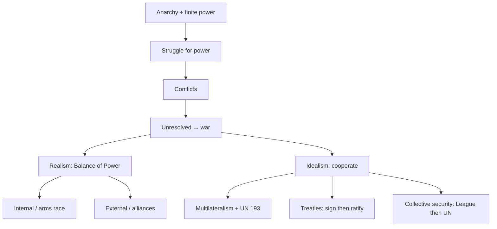

# 01 — Basics of International Relations

### Lecture 1 — 1 September 2026

> **Date of Lecture:** 1 September 2026 (Lecture 1)  
> **Date Added:** 2026-09-01  
> **Teacher:** **Iqbal Singh Sandhu** (GS International Relations). UN lecture (4 September): **Dr Sushant Varma** — `02_United_Nations_Organisation.md`.  
> **Source:** Vajiram & Ravi class + audio transcript + 3 handwritten notebook pages (dated **1/9/26**, circled **1**)  
> **Also relevant for:** Prelims IR current affairs; **GS-II** (bilateral, groupings, international organisations); **GS-IV** (ethics in IR); Essay; Interview (retired IFS on the board)  
> **How to read class shortcuts:** full form on first use, then the short form. Glossary at the end.

---

## 0. How to study IR (before the board)

IR is the **dynamic** half of GS. After a class on India–Pakistan or West Asia, **tomorrow’s paper can still change the story**. Class cannot teach the future.

| Resource | Role |
|:---|:---|
| **Newspaper** | Primary. Pick **one**: *The Hindu* **or** *Indian Express*. Not both. |
| **Recitals** (monthly current-affairs magazine) | **Revise and memorise** what you already read. It does **not** replace the paper. Year-end compilation also comes. |
| **Class handouts** | These **are** the class notes. No dictation in IR; explanation in class, details on the sheet. |
| **Yellow Book (IR)** | Extra literature if you want more. |

Read the paper as **curiosity** (what is Trump doing; why a Makkah defence pact; why Russia–Ukraine), not as “I must mug every line for the exam.” That expectation is impossible and makes you hate the paper.

**Where IR is tested:** Prelims MCQs (this year’s paper: **Strait of Hormuz** in the US–Iran war; neighbourhood); **GS-II** — **4–5** questions every year; **GS-IV** (morality — Gaza casualties, Hiroshima/Nagasaki); Essay; Personality test.

Two IR faculties: Sandhu Sir (this lecture) and **Dr Sushant Varma**.

---

## 1. What IR is

**International Relations (IR) = International Politics = Geopolitics.** Same thing. You cannot read relations between **sovereign** nations without **geography**.

**Examples from class**

| Pair | Geography that decides the politics |
|:---|:---|
| **US–Iran** | **Persian Gulf**; **Strait of Hormuz** (oil/gas trade of the region). |
| **India–Bangladesh** | Bangladesh is not landlocked; it is **India-locked** on three sides, Bay of Bengal on the fourth. Territory is a **bridge** between mainland India and the **Northeast**. Alternative to the **Siliguri Corridor** (**Chicken’s Neck**). |
| **India–Bhutan** | Bhutan is **landlocked**, sandwiched between India and China. Sheet: population about **7 lakh**. If China grabs Bhutanese territory, China gets a run at **Siliguri**. India will not allow that. |

**Definition:** IR is the study of **relations between the states of the world**. Here **state = nation / country**, not Punjab or Karnataka.

**Why study it:** humans have not solved **conflict → war**. Wars destroy life and property (class: Gaza; Russia–Ukraine; US–Iran). Purpose of the subject: **how to resolve conflicts peacefully, prevent war, get interstate peace.**

---

## 2. What is a state

A **state** is a political entity with **four necessary features**:

<svg xmlns="http://www.w3.org/2000/svg" viewBox="0 0 400 248" role="img" aria-label="Four necessary features of a state" style="display:block;margin:0 auto;width:100%;min-width:340px;max-width:560px;font-family:system-ui,Segoe UI,Arial,sans-serif;">
<rect x="1" y="1" width="398" height="246" rx="12" fill="#f8fafc" stroke="#e2e8f0"/>
<rect x="90" y="12" width="220" height="32" rx="8" fill="#e2e8f0" stroke="#94a3b8"/>
<text x="200" y="33" text-anchor="middle" font-size="14" font-weight="700" fill="#0f172a">State = four features</text>
<rect x="16" y="60" width="176" height="72" rx="8" fill="#eff6ff" stroke="#60a5fa"/>
<text x="104" y="88" text-anchor="middle" font-size="13" font-weight="700" fill="#1e40af">1. Sovereignty</text>
<text x="104" y="110" text-anchor="middle" font-size="11.5" fill="#334155">own policies, no outsider veto</text>
<rect x="208" y="60" width="176" height="72" rx="8" fill="#f0fdf4" stroke="#4ade80"/>
<text x="296" y="88" text-anchor="middle" font-size="13" font-weight="700" fill="#166534">2. Territory</text>
<text x="296" y="110" text-anchor="middle" font-size="11.5" fill="#334155">land (and claims at sea)</text>
<rect x="16" y="148" width="176" height="80" rx="8" fill="#fff7ed" stroke="#fb923c"/>
<text x="104" y="178" text-anchor="middle" font-size="13" font-weight="700" fill="#9a3412">3. Population</text>
<text x="104" y="200" text-anchor="middle" font-size="11.5" fill="#334155">people the govt governs</text>
<rect x="208" y="148" width="176" height="80" rx="8" fill="#faf5ff" stroke="#c084fc"/>
<text x="296" y="178" text-anchor="middle" font-size="13" font-weight="700" fill="#6b21a8">4. Government</text>
<text x="296" y="200" text-anchor="middle" font-size="11.5" fill="#334155">must be sovereign — type optional</text>
</svg>

<em><strong>Figure:</strong> Sovereignty + territory + population + government. Type of government does not matter for the definition.</em>

**Sovereignty** (Preamble of the Constitution for India): autonomy to make **your own** policies and decisions **without external interference**.

**Government in this definition:** any **sovereign** government — democracy (India), dictatorship (North Korea / Kim Jong-un), monarchy (Saudi Arabia / Mohammed bin Salman), military junta (Myanmar), **theocracy** (Iran: a spiritual leader as head of state). Class does **not** care about the type. Only: sovereign government + territory + population.

---

## 3. Domestic politics vs international politics

Do **not** use Polity-class rules to read IR. Universities keep **Political Science** and **IR** in different buildings.

| | **Domestic politics** | **International politics** |
|:---|:---|:---|
| Also called | **Intra-state** | **Inter-state** |
| Subject | Political Science / your **Polity** lectures | **IR** |
| Structure | **Hierarchical authority** (a pyramid) | **Anarchy** = **absence of authority** |
| Who is sovereign | The **state**. You as a citizen are **not**. | Every **state** is sovereign. No world government. |
| Law | Legislature makes, executive implements, judiciary adjudicates | No world police / PM / court that states must obey |
| Basic need | **Rule of law** → security and survival of **persons** | **National security** (*rashtra suraksha*) of the **state** |

**Hierarchy in India (class pyramid):** Union Parliament above State Assemblies; President → Vice-President → Council of Ministers / PM → CMs → district → the traffic cop on Pusa Road; CJI / Supreme Court → High Courts → districts. Authority is always a pyramid. The **type** of authority can change (monarchy ↔ democracy ↔ junta); authority **does not disappear** inside a state.

**Why obey?** After thousands of years, the lesson: the best way for **human survival and safety** is to live under **rule of law**. That is how you get **rights**. Most basic right: **life**.

**Article 21** of the Constitution: protection of life. Supreme Court line used in class: Article 21 is the **heart of Fundamental Rights** — if life is gone, equality, freedom, religion, culture are empty.

**Thought experiment:** if every authority vanished overnight — jungle *raj*, survival of the fittest, might is right, **fear**. That nightmare **cannot** happen in domestic politics (a state always has a government). It **is** the **permanent** condition of **international** politics.

<svg xmlns="http://www.w3.org/2000/svg" viewBox="0 0 400 220" role="img" aria-label="Domestic hierarchy versus international anarchy" style="display:block;margin:0 auto;width:100%;min-width:340px;max-width:560px;font-family:system-ui,Segoe UI,Arial,sans-serif;">
<rect x="1" y="1" width="398" height="218" rx="12" fill="#f8fafc" stroke="#e2e8f0"/>
<rect x="20" y="14" width="168" height="28" rx="7" fill="#dcfce7" stroke="#4ade80"/>
<text x="104" y="33" text-anchor="middle" font-size="12.5" font-weight="700" fill="#166534">Domestic = hierarchy</text>
<polygon points="104,56 148,92 60,92" fill="#bbf7d0" stroke="#16a34a"/>
<rect x="48" y="100" width="112" height="22" rx="4" fill="#86efac"/>
<rect x="36" y="128" width="136" height="22" rx="4" fill="#4ade80"/>
<rect x="24" y="156" width="160" height="22" rx="4" fill="#22c55e"/>
<text x="104" y="200" text-anchor="middle" font-size="11" fill="#14532d">Sovereign govt on top</text>
<rect x="212" y="14" width="168" height="28" rx="7" fill="#fee2e2" stroke="#f87171"/>
<text x="296" y="33" text-anchor="middle" font-size="12.5" font-weight="700" fill="#991b1b">IR = anarchy</text>
<circle cx="248" cy="108" r="28" fill="#fecaca" stroke="#ef4444"/>
<circle cx="296" cy="88" r="28" fill="#fecaca" stroke="#ef4444"/>
<circle cx="344" cy="118" r="28" fill="#fecaca" stroke="#ef4444"/>
<circle cx="280" cy="148" r="26" fill="#fecaca" stroke="#ef4444"/>
<text x="296" y="200" text-anchor="middle" font-size="11" fill="#7f1d1d">No world government</text>
</svg>

<em><strong>Figure:</strong> Inside a state, someone can pick up the phone to the police. Between states, nobody comes. Self-help.</em>

---

## 4. National security, diplomacy’s limit, hard power

In anarchy, states live in a **self-help** world. They are **afraid / insecure**. The first national interest is **national security** — survival of the **state**.

If China launched a full attack tomorrow, the PM cannot dial a world police. That luxury is **domestic** (Article 21). IR is jungle.

**Two methods class tested**

**1. Diplomacy** — maintain peaceful, friendly relations so the threat shrinks. India **tried** this with China: **Panchsheel** (**Panch** = five, **Sheel** = principles) friendship treaty, **1954**. Slogans of *Hindi-Chini bhai-bhai*. **It did not work.** China attacked in **1962** — betrayal of the treaty. You cannot **force** friendship. Diplomacy **may or may not** work. It is **not fail-safe**.

**2. Power** — fail-safe in a self-help world: **become the fittest**. More power → more security.

**Hard power** = **military power + economic power**.

- Military: army, navy, air force, guns, nuclear weapons, missiles, fighters, tanks, carriers, submarines.  
- Empty pockets cannot buy that → **economic** power is required.

Class: if India had **nuclear weapons in 1962**, would China have dared. If Iran had them, would the US have struck.

So **every sovereign state is power-hungry** — **power maximisation**.

---

## 5. Finite resources → struggle for power → war

All power resources are **finite** (this is **not** an Environment lecture on carbon; even **solar** needs **panels** made of **critical minerals**). Territory is finite. **More territory → more resources.** China dominates **critical minerals / rare earths** — that **is** power.

**IR, alternative definition:** IR **is** the **struggle for power**. Unresolved conflicts → **wars**.

| Conflict | Power resource in the fight |
|:---|:---|
| **India–Pakistan / Kashmir** | Territory; **Indus** and tributaries. India **upstream**, Pakistan **downstream**. Water = drink, irrigation, industry. **Pakistan-occupied Kashmir (PoK)** = Indian territory illegally held. |
| **India–China 1962** | Territory — **Aksai Chin** (class: China captured this; more land = more power). |
| **US–Iran (2026)** | Oil and gas of the **Persian Gulf**; whoever holds the **Strait of Hormuz** holds the trade. |
| **Russia–Ukraine** | Many reasons (including **NATO** eastward expansion). Geography class stressed: Russia’s hunt for **warm-water ports** (north coast frozen) → east Ukraine / **Black Sea**. |
| **Pax Silica** (US initiative in the papers) | Counter **China’s** hold on **critical minerals / rare earth** supply chains. |

**Viksit Bharat by 2047** in this lecture is also a **power** story: health, education, jobs, highways, ports, manufacturing, exports — all need **finite** energy and minerals.

**Prelims trap:** Geopolitics is not a synonym for “maps for fun.” **Siliguri / Chicken’s Neck**, **Hormuz**, **Aksai Chin**, **Indus upstream** are the IR facts. **Pax Silica** is a **minerals** counter to China, not a peace slogan.

---

## 6. Two theories: realism and idealism

Full IR theory is **optional (PSIR)**. For GS, lock **two** lenses.

| | **Realism** | **Idealism** |
|:---|:---|:---|
| Starting point | Study **reality**: IR **is** power struggle | In an **ideal** world, states **would cooperate** |
| Cooperation | **Rejects** it — power-hungry states cannot share the cake | Peaceful dialogue, diplomacy, **multilateralism** |
| Prescription | **Balance of Power (BOP)** | **Collective security** + international organisations + law |
| Mood | Pessimistic but diagnostic | Hope for peace (class: do not dump this) |

**Zero-sum** (sheet, circled): **my gain = the other’s loss.** Realist reading of finite power.

Nobody **wants** war — war makes you **poorer**. Last option. Conflicts are inevitable under power struggle; **wars** happen when conflicts stay **unresolved**. Avoid war by **resolving conflicts peacefully** = **cooperation** (talk, negotiate, diplomacy). Diplomacy = **art and science of maintaining peaceful / friendly relations**.

---

## 7. Multilateralism, organisations, treaties

| Count of partners | Name |
|:---|:---|
| 2 | **Bilateral** |
| 3 | **Trilateral** |
| 4 | **Quadrilateral** |
| Many | **Multilateral** |

**Unilateral** = I am sovereign, I will not factor others (class: Russia into Ukraine; US killing an Iranian leader; Trump leaving the **Paris** climate deal).

**No unilateral fix** for **global** problems (climate, terrorism, Covid). Atmosphere does not take a visa. Himalayan melt → Nepal **and** downstream **India** (floods, rivers, food).

**International organisations** exist to **run multilateralism** and to **mediate**.

| Body | Class use |
|:---|:---|
| **United Nations (UN)** | **193** members. Best example of multilateralism. |
| **World Trade Organization (WTO)** | Trade dispute → don’t start a tariff war; use the org. |
| **International Monetary Fund (IMF)**, **World Bank** | Finance / mediation |

**Treaty** = agreement of **two** states. **Convention** = **many** states.

| Instrument | Point |
|:---|:---|
| **UNFCCC** | United Nations Framework Convention on Climate Change — cut carbon. |
| **UNCLOS** | United Nations Convention on the Law of the Sea — **maritime** disputes (sea territory). |
| **Indus Waters Treaty (IWT), 1960** | India–Pakistan share of Indus and tributaries. **World Bank mediated** (*madhyasthata*). Class: **65 years** of peace on **water war**. Class wording: India **suspended** it in **2025** after **Pahalgam**. **MEA (Ministry of External Affairs)** wording after the **22 April 2025** Pahalgam attack: treaty placed **“in abeyance.”** Detail in the Pakistan lecture. |

**International law** = treaties and conventions between sovereign states. If they are respected → **rule-based order** in international politics (common rules).

**Two stages**

1. **Signing** — expression of **intent** (PM signing Paris). **Not** yet legally binding.  
2. **Ratification** — take it to **your legislature** (Lok Sabha / Rajya Sabha). Then it is a **legal obligation**. Violating a ratified treaty is violating **your own** Constitution / authority.

States stay sovereign: they can **de-ratify**. Class: **US signed UNCLOS but has not ratified** — no legal obligation. India has signed some treaties it has **not** ratified.

**Prelims trap:** UN is **not** a world government. Creating a world government would mean India is **not** sovereign. Orgs are **tools of sovereign states**. Signing ≠ ratification.

#### Newspaper update — 1 September 2026 (*The Hindu*; Kallol Bhattacherjee)

Same IWT file as class — **do not duplicate** as a new CA topic.

* **Permanent Court of Arbitration (PCA), The Hague** (Court of Arbitration chaired by **Prof. Sean D. Murphy**, US): treaty remains **“fully in force”**; India must observe obligations on **Western Rivers** hydro-electric design and operation. Terror attacks, in the court’s view, do **not** justify suspension or termination.
* **India’s rejection:** MEA calls it a **“so-called award”** of an **illegally constituted** court; World Bank’s constitution of the body is a **“grave violation” / “patent breach”** of the treaty. India **will not appear** and will **not take cognisance** of its pronouncements. Abeyance after **Pahalgam (22 April 2025)** **remains in force** (India’s position).
* **Ratle Hydro-Electric Plant (RHEP):** “Award on the Status of the IWT and Order on Interim Measures.” India is prohibited from **concreting the dam wall and power intake** above set levels until **90 days after** a **Neutral Expert’s** final decision (expected **July 2027**).

**Prelims trap:** PCA says IWT is **in force**; India says it is **in abeyance**. Class said **suspended**. Neutral Expert on Ratle is **July 2027**, then **+90 days** on the concreting bar — not a 2026 finish.

---

## 8. Balance of Power (realism)

Realism: you cannot **abolish** power struggle. You can **manage** it so the world is less bloody.

**Balance of Power (BOP):** **rough equilibrium** of power. No one state **dominates**. Less imbalance → less insecurity → fewer conflicts → fewer wars.

**Counterbalance** in the newspaper = **trying to achieve BOP** (India vs China).

**China ~5× India** (class illustration) → India **must** feel insecure. Hypothetical **equal** power → both less jumpy.

**Two methods** (can be **both**):

<svg xmlns="http://www.w3.org/2000/svg" viewBox="0 0 400 200" role="img" aria-label="Internal balancing versus external balancing" style="display:block;margin:0 auto;width:100%;min-width:340px;max-width:560px;font-family:system-ui,Segoe UI,Arial,sans-serif;">
<rect x="1" y="1" width="398" height="198" rx="12" fill="#f8fafc" stroke="#e2e8f0"/>
<rect x="110" y="12" width="180" height="28" rx="7" fill="#e2e8f0" stroke="#94a3b8"/>
<text x="200" y="31" text-anchor="middle" font-size="13" font-weight="700" fill="#0f172a">Balance of Power</text>
<rect x="16" y="56" width="176" height="124" rx="8" fill="#eff6ff" stroke="#60a5fa"/>
<text x="104" y="82" text-anchor="middle" font-size="13" font-weight="700" fill="#1e40af">Internal balancing</text>
<text x="104" y="108" text-anchor="middle" font-size="12" fill="#334155">Build your own capability</text>
<text x="104" y="130" text-anchor="middle" font-size="12" fill="#334155">→ often an arms race</text>
<text x="104" y="154" text-anchor="middle" font-size="11.5" fill="#64748b">Tejas, Rafale, S-400 logic</text>
<rect x="208" y="56" width="176" height="124" rx="8" fill="#fff7ed" stroke="#fb923c"/>
<text x="296" y="82" text-anchor="middle" font-size="13" font-weight="700" fill="#9a3412">External balancing</text>
<text x="296" y="108" text-anchor="middle" font-size="12" fill="#334155">Alliances</text>
<text x="296" y="130" text-anchor="middle" font-size="12" fill="#334155">Bhutan calls India</text>
<text x="296" y="154" text-anchor="middle" font-size="11.5" fill="#64748b">Sheet also: BRICS, SCO</text>
</svg>

<em><strong>Figure:</strong> Internal = grow stronger at home. External = borrow strength through friends. States often do both.</em>

**Internal balancing → arms race:** competition for more weapons. Class story: weak IAF / “flying coffins” (MiGs) vs Pakistan **F-16s** and Chinese jets → **Tejas** (Hindustan Aeronautics Limited), **Prachand** attack helicopter, **Sukhoi**, **Rafale**, **Apache**. China putting **S-400** on the **Ladakh** side is the same logic. **Make in India** / a bigger economy is also internal balancing (class numbers were illustrative: China as a much larger GDP).

**External balancing → alliances.** Bhutan cannot match China internally. Bhutan can call **India**; India has a **self-interest** (Siliguri). Sheet boxes **BRICS** and **Shanghai Cooperation Organisation (SCO)** as grouping examples. Recent **Makkah defence pact** (Saudi) = BOP, because a sane state will **not** bet **only** on the UN.

---

## 9. Collective security (idealism)

Idealism’s **rival** to BOP: **collective security**.

**Woodrow Wilson**, US President, **Fourteen Points** speech in the **US Congress** after **World War I**. US legislature: **Upper House = Senate**, **Lower House = House of Representatives** (sheet: “common”).

**Pledge:** all nations defend each other. **All for one, one for all.** An attack on one is an attack on all → **collective** punishment.

**Instrument:** **League of Nations** — a common platform to take that oath.

**It failed.** **World War II** still happened. Why (class):

1. **The US did not join.** Wilson wanted to sign; **Congress refused** — depending on an international org would **compromise US sovereignty**; America should secure itself. The country that **invented** the League stayed out → dead on arrival.  
2. **Interwar period (1919–1939):** Britain and France had **more faith in BOP** (arms races, alliances) than in collective security. League was **toothless**.

**Second attempt:** **United Nations, 1945**, after WWII. Same **collective-security** assumption. **Simultaneous** with BOP in the real world (sheet: “simultaneous implementation”; “more confidence in BOP”).

UN has **successes and failures**. Wars still happen. Class: UN often **does nothing** when principles are broken (Russia–Ukraine, US, Israel/Gaza). Experts: **talking shop** — speeches in **New York**, then war at home. States remain **sovereign**.

**UN Security Council (UNSC):** organ meant to **run** collective security. **P5** (permanent five) with **veto**: **US, Russia, China, Britain, France**. They **misuse** veto. India wants **permanent membership** and **UNSC reform** — **Dr Sushant Varma** will do the UN lecture. If UN is not reformed it risks the League’s fate: **lose relevance**.

**Do not drop idealism.** Realism diagnoses; idealism is the **hope** of cooperation. GS needs **both**. The world runs **BOP and collective security at the same time**.

**Prelims trap:** League failed **before** WWII, not because of WWII’s start date alone — **US absence + European BOP habits**. UN (1945) is the **second** try, not the first world government. **P5 veto** is why “UN will save us” is not a security policy.

---

## 10. One-page map of the lecture

---

## Abbreviations

| Short | Full |
|:---|:---|
| **IR** | International Relations |
| **BOP** | Balance of Power |
| **UN** | United Nations |
| **UNSC / P5** | United Nations Security Council / five permanent members |
| **UNFCCC** | United Nations Framework Convention on Climate Change |
| **UNCLOS** | United Nations Convention on the Law of the Sea |
| **WTO / IMF** | World Trade Organization / International Monetary Fund |
| **SCO** | Shanghai Cooperation Organisation |
| **BRICS** | Brazil, Russia, India, China, South Africa (and later members as in current CA) |
| **PoK** | Pakistan-occupied Kashmir |
| **NATO** | North Atlantic Treaty Organization |
| **HAL** | Hindustan Aeronautics Limited |
| **PSIR** | Political Science and International Relations (optional) |
| **IFS / MEA** | Indian Foreign Service / Ministry of External Affairs |
| **IWT** | Indus Waters Treaty, 1960 |
| **PCA** | Permanent Court of Arbitration (The Hague) |
| **RHEP** | Ratle Hydro-Electric Plant |

<!-- 2026-09-01: IR Lecture 1, Iqbal Singh Sandhu — basics: state, domestic vs anarchy, hard power, realism/idealism, BOP vs collective security, from transcript + 3 sheets. -->
<!-- 2026-09-01: Patched IWT from *The Hindu* — MEA “abeyance” after Pahalgam 22 Apr 2025; PCA Hague (Sean D. Murphy) says treaty in force; India rejects jurisdiction; Ratle HEP interim until Neutral Expert July 2027 + 90 days. -->
