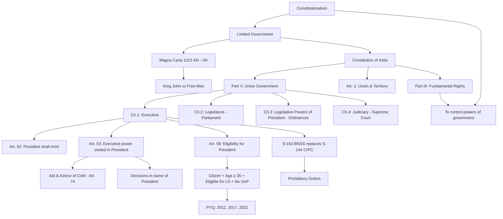

# Polity — Lecture 1 (Abhey Kumar)

## Lecture 1 — Strategy, Constitution & President

> **Source:** Vajiram & Ravi — Polity Class Lecture 01 (Abhey Kumar) + Handwritten Notes  
> **Date:** 13 August 2026  
> **Last Updated:** 2026-08-13

---

## Part A — Strategy & Preparation Framework

### 1. Strategy — The "How" of UPSC

> The "What" is never the difficult question. The difficult question is the **How**.

- You must develop your **own strategy** — a road map from A (today) to B (La Paz = selection).
- Create a **Strategy Page** → paste it on the wall → review it on the **last day of every month** (15 min self-evaluation).
- Every time you receive an advice (teacher, topper talk, cousin), **write it on the Strategy Page**.

### 2. Four Non-Negotiable Daily Priorities (Discipline Building)

These 4 activities are **first priority** — do them **every single day**, no matter what:

| # | Activity | Details |
|---|----------|---------|
| 1 | **Read the News** | Paper / digital — first priority; cannot sleep without doing this; if you skip 5–6 days, you pile up a monster; initially 2–3 hours is okay |
| 2 | **Attend All Classes** | Build discipline; don't bunk even if subject seems boring |
| 3 | **Revise the Same Day** | Revise = complete the topic (class notes + handouts + book + PYQs); not just re-reading |
| 4 | **Read in Advance** | Read the next day's topic beforehand; go **ahead** of the class, not behind it |

> **Key Insight:** If you can do only these 4 and nothing else, you are still making progress. First gear must be right.

### 3. Build Command — Knowledge → Understanding → Application → Analysis → Synthesis → Success

```
Knowledge → Understanding → Apply → Analysis → Synthesis → Success
     ↓              ↓                                    ↓
  Prelims        Prelims                              Essay
              (mostly)                              (Mains)
```

- **Prelims** ≈ Understanding + little Knowledge (15–20 questions are pure knowledge; rest are understanding-based)
- **Mains** ≈ Application + Analysis + Synthesis
- **Essay** = Synthesis of all subjects (no History, Geography, Polity silos — everything is connected)
- **Example of Synthesis:** Dandi March (History) + Right to Walk on Footpath = Fundamental Right (Polity, 2026 SC judgment)

---

## Part B — Sources for Polity

| # | Source | Nature | Notes |
|---|--------|--------|-------|
| 1 | **Constitution of India (COI)** — Actual text | **Reference** (most authentic source) | Download from india.gov.in; any version/language; always have it accessible; author (jokingly): Dr. Ambedkar |
| 2 | **Textbook** — Yellow Book (Vajiram) | **Textbook** (read page 1 to last page, 5 times) | Written with flow → useful for Mains answer writing |
|   | **Laxmikant** (Blue Book) | **Textbook** | Great for Prelims; pinpointed info; practically useless for Mains |
| 3 | **Class Notes** | Notes from class | Write everything |
| 4 | **NCERT** — Class 11 & 12 | **Base building** | Class 11: Political Theory; Class 12: Indian Constitution at Work; go back to Class 8 → Class 6 if needed |
| 5 | **Current Affairs** | Ongoing | Link with static topics |

### Gap-Filling Approach (Two-Book Strategy)
1. **Start with Book A** (recommended: Yellow Book for non-FOMO candidates; Laxmikant for FOMO candidates).
2. After finishing one chapter in Book A → Open same topic in **Book B**.
3. Flip through headings → cross out what's already covered → **assimilate additional info** (recent judgments, analysis, events) into Book A.
4. **Bare minimum:** At least read ONE book. Better to read one than none.

---

## Part C — Understanding Framework

### Two Fundamental Questions for Building Understanding:

| Question | Purpose | Natural/Active? |
|----------|---------|-----------------|
| **"What is ___?"** | Define the concept | Natural for new words; requires **active effort** for familiar words |
| **"Why ___?"** | Understand the reason/purpose | Kids ask this naturally; adults must force this curiosity |

> **Key Skill:** Focus on **words** — terms, terminologies, ideas. Don't assume you know just because the word is familiar.

### Demonstrated Examples from Class:

| Word | Common Answer | Problem | Deeper Understanding |
|------|--------------|---------|---------------------|
| What is Constitution? | "Supreme law of the land" / "Set of laws" | — Not universal (UK has no "supreme law"); IPC is also law but not Constitution | Purpose = **to limit the powers of government** (constitutionalism) |
| Why Constitution? | Often re-answers "what" | Students conflate "what" and "why" | **Limited Government** — UK 1215 AD: Magna Carta (Great Charter); King John → free men revolted → document limiting King's powers → modern equivalent: controlling government |
| What is Polity? | "Art of governing state" | Mugged-up definition | System of rules & regulations used to **implement policy** — the HOW of governance |
| What is Politics? | "Struggle for power" (NCERT) | Surface-level | Power to do what? → **Distribution of resources**; "Who gets what, when, and where"; Example: Bullet train Mumbai–Ahmedabad (not Varanasi–Patna) — someone decided that |
| Polity vs Politics | Often confused | — | Politics = WHAT to do (decision-making, policy); Polity = HOW to do it (system, machinery, implementation) |
| What is Government? | "Make policies" / "Ruling" | Incomplete | **Any organization** (India, Delhi Police, Vajiram, your family, even you individually) that performs 3 functions: (1) Goal-setting, (2) Execution, (3) Corrective Action |

> **Polity = It is a system of rules & regulations used to implement policy.**

---

## Part D — Constitution of India — Structure

### Top-Level Architecture

| Component | Numbering System | Count | Details |
|-----------|-----------------|-------|---------|
| **Parts** | Roman numerals (I, II, III…) | **25 total** (numbered till XXII; 3 extra: 9A, 9B, 14A etc.) | Major divisions |
| **Schedules** | Words (First, Second… Twelfth) | **12** (original 8 + 4 added) | Supplementary provisions |
| **Chapters** | Within Parts (may or may not exist) | Varies | Sub-divisions of Parts |
| **Articles** | Arabic numerals (1, 2, 3…) | Numbered till **395** (total count is more due to sub-articles like 21A) | Smallest self-contained provision |
| **Clauses** | Circular brackets → (1), (2), (a), (b) | Within Articles | Further breakdown |
| **Sub-clauses** | Nested brackets | Within Clauses | Further sub-division |

> **Article** = The smallest self-contained provision of the Constitution.

### Logical Flow of Parts

| Part | Content | Logic |
|------|---------|-------|
| Part I | **Union & its Territory** | Define WHAT is India (geography) |
| Part II | **Citizenship** | Define WHO are the people of India |
| Part III | **Fundamental Rights** | Constitution GIVES rights to people |
| Part IV | **Directive Principles of State Policy (DPSP)** | Government WILL give more with time |
| Part IVA | **Fundamental Duties** | People must give something in RETURN |
| **Part V** | **The Union (Government)** | Define the government at the TOP |
| Part VI | **The States** | Government at next level down |
| … | … | Continues logically |
| Part XIV | **Services under the Union & States** | Civil servants (servant quarters — at the back!) |

> **Learning Strategy:** Always go **Top → Down** (forest first, then trees). Never start bottom-up from individual articles.

---

## Part E — Part V: The Union Government

### Structure of Part V — Chapters

| Chapter | Subject | Equivalent in Part VI (States) |
|---------|---------|-------------------------------|
| **Ch. 1** | **Executive** | State Executive (Governor) |
| **Ch. 2** | **Legislature** (Parliament) | State Legislature |
| **Ch. 3** | **Legislative Powers of President** (Ordinances) | Legislative Powers of Governor |
| **Ch. 4** | **Judiciary** (Supreme Court) | High Courts |
| Ch. 5 | Comptroller & Auditor General (CAG) | — |
| Ch. 6 | — | — |

### Three Functions of Government (Governance = Goal + Execution + Correction)

| Function | Wing | Role |
|----------|------|------|
| **Goal-setting** (What to do) | **Legislature** | Make laws, set policy direction |
| **Execution** (Doing it) | **Executive** | Implement laws, day-to-day governance |
| **Corrective Action** (Fixing mistakes) | **Judiciary** | Interpret laws, check violations |

> Government = Whoever performs these 3 functions for an organization. Not limited to territorial context.

### Two Meanings of "Government"
1. **Broad/Technical:** All three — Legislature + Executive + Judiciary
2. **Common/Practical:** Only the Executive (what comes to mind when we say "Government of India" — PM, Modi, etc.)
3. **Contextual:** In newspaper: "SC directed the government" → means judiciary directed the **executive**

---

## Part F — Chapter 1: The Executive (Union)

### Hierarchy of Union Executive

| Position | Constitutional Reference | Notes |
|----------|------------------------|-------|
| **President** | Art. 52, 53 | Head/Big Boss — top of the hierarchy |
| **Vice President** | — | "Useless boss" — no independent salary; gets paid as ex-officio Chairman of Rajya Sabha |
| **PM + Council of Ministers** | — | Real Boss — PM is part of CoM |
| **Attorney General of India (AGI)** | — | Law officer / Lawyer of the government; part of executive team |

> **Civil Servants** (You!) → Part XIV (servant quarters, behind the house) — Policy implementation, NOT policy making. Master decides rice/jeera rice → servant decides how much jeera, flame, water, salt.

### Prohibitory Orders — Section 163 BNSS / Section 144 CrPC (Example)

- **Who issues?**
  - In **Commissionerate system** (e.g., Delhi): ACP (police officer, DANIPS — Delhi, Andaman & Nicobar Islands Police Service — Group B)
  - In **IG system** (rest of India): District Magistrate / SDM (IAS officer)
- **S-163 BNSS** replaced **S-144 CrPC** (old law)
- Police cannot use weapons without orders → order flows down the hierarchy
- Crowd management example (Bangladesh protests) → Administration's job = control (not dialogue/politics)

---

## Part G — President of India

### Article 52 — Existence
> "There **shall** be a President of India."
- Mandatory office; not optional
- Current President: **Droupadi Murmu**

### Article 53(1) — Executive Power

> "The executive power of the Union shall be vested in the President and shall be exercised by him either **directly** or through officers **subordinate** to him in accordance with this Constitution."

#### Key Derivations from Art. 53:

| Point | Explanation |
|-------|-------------|
| President = **Head of Union Executive** | Like CEO of a company; no one has more power above |
| Power is **vested** in President | All executive power belongs to President constitutionally |
| Can act **directly** or through **subordinates** | Constitution gives both options; "directly" is listed first |
| **In practice:** Acts only through subordinates | President acts on **aid and advice of Council of Ministers** (Art. 74); WHY → will be covered in next 2 classes |
| All executive decisions taken **in the name of President** | Officers exercise delegated power → it remains President's power → decisions bear President's name |
| PM is NOT the head | PM is powerful practically, but constitutionally not even second in line; HEAD = President |

### Powers of the President
> **Task:** Read the full list of powers by self (Swadhyay) from your textbook before next class. Write them as a numbered list (1, 2, 3… ~20 powers).

### Election of the President

> **PYQ Alert!** Presidential election years: 2012, 2017, 2022 → question appeared on election of President in all three years. **Next election: 2027** (July) — exam also in May 2027. High-priority topic!

#### Article 58 — Eligibility Conditions

| # | Condition | Detail |
|---|-----------|--------|
| 1 | **Citizen of India** | Requirement for all constitutional offices |
| 2 | **Age ≥ 35 years** | "Completed the age of 35 years" → means **35 or above** (not "more than 35") |
| 3 | **Eligible to be a member of Lok Sabha** | NOT Rajya Sabha — WHY? (Question to think about; books won't tell you directly) |
| 4 | **Must NOT hold any office of profit** under Union / State / Local government | Cannot be serving in a government job |

> **Focus on words BEFORE and AFTER the factual number.** Everyone remembers "35" but the key is "completed the age of" — meaning ≥ 35. In exam, you can't change your answer — come back next year.

---

## Tasks Assigned by Teacher

| # | Task | Details |
|---|------|---------|
| 1 | **PYQ Practice** | Find all questions from last 10 years on Constitutionalism, What is Constitution, Why Constitution |
| 2 | **Download COI** | From india.gov.in → have it on phone/book at all times |
| 3 | **Presidential Election PYQs** | Look at UPSC papers from 2012, 2017, 2022 — find questions on election of President |
| 4 | **Powers of President** | Read from textbook and write numbered list before next class |
| 5 | **Strategy Page** | Create one; paste on wall; review monthly |

---

## Key Conceptual Connections (Knowledge Graph)



---

## Important Terms & Definitions

| Term | Definition / Meaning |
|------|---------------------|
| **Polity** | A system of rules & regulations used to implement policy |
| **Politics** | Struggle for power → power to distribute resources → "Who gets what, when, and where" |
| **Constitution** | Set of rules to **limit the powers of the government** (constitutionalism) |
| **Constitutionalism** | The belief/practice of being governed by a constitution; limiting government power |
| **Government** | Whoever performs 3 functions for an organization: Goal-setting, Execution, Corrective Action |
| **Article** | Smallest self-contained provision of the Constitution |
| **Clause** | Sub-division of an Article (marked by circular brackets) |
| **Magna Carta** | "The Great Charter" — 1215 AD, UK — first document limiting King's powers; oldest constitution |
| **BNSS** | Bharatiya Nagarik Suraksha Sanhita (replaced CrPC) |
| **DANIPS** | Delhi, Andaman & Nicobar Islands Police Service (Group B) |
| **Ex-officio** | By virtue of holding another office (e.g., VP is ex-officio Chairman of Rajya Sabha) |
| **Synthesis** | Ability to connect knowledge from different subjects into a unified understanding |

---

<!-- 2026-08-13: Created from Polity Lecture 1 by Abhey Kumar transcript + handwritten class notes. Covers strategy framework, sources, understanding approach, constitution structure, Part V Union Government, President (Art 52, 53, 58). -->
