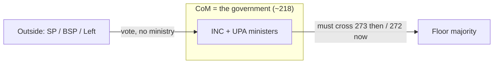

# Polity — Lecture 5 (Abhey Kumar) — Interim / Minority Government, Attorney General & Majorities

### Lecture 5 — 5 September 2026

> **Date of Lecture:** 5 September 2026 (continues Lecture 4 — `Polity_Lec4_AbheyKumar_VP_COM_PM_CabinetSystem.md`)  
> **Date Added:** 2026-09-05  
> **Faculty:** **Abhey Kumar** (sheet: *Abbey*). Vajiram & Ravi GS Polity.  
> **Source:** Class + audio transcript (`PolityL050926`) + 6 handwritten sheets (dated **5/9/26**, circled **1–6**)  
> **Also relevant for:** Prelims (Attorney General of India, articles, majority arithmetic); **GS-II** (Parliament, Union executive, Centre–State via Articles 249 / 312)

**How to read class shortcuts:** full form on first use. Glossary at the end. Do not invent a number the sheet / class did not give.

Class paused after **special majority / Article 61**. Next sitting: houses in detail + **confidence / no-confidence / censure / adjournment** motions.

**Homework (next class):** short note (~**100 words** / ~9–10 sentences) on the **spectrum of political ideology** — two sentences each for **left / right / centre**, plus **one non-India, non-United States, non-United Kingdom example** each. Read first; do not paste from AI.

---

## 1. Interim (provisional) government vs caretaker (POL-06-01)

Neither word is a **constitutional** term. Books mix them; the idea is different.

| | **Caretaker government** | **Interim / provisional / transitional government** |
|:---|:---|:---|
| When | Gap after a Prime Minister (PM) resigns / dies, or Lok Sabha (LS) is dissolved — until a new PM is sworn | A **historical transition** of the polity: institutions / elections / sometimes a constitution are being created or have been **sidelined** |
| System | Works **under a system** — Constitution of India is still there (outgoing / incoming / caretaker PM, all three) | Works under **no (or a sidelined) system** |
| India | Routine after every LS term | **Once** in our story: **15 August 1947 → first LS 1952**. No Constitution yet, no Election Commission, no LS / Rajya Sabha (RS). Government ran on the **Government of India Act, 1935** (British-era law) |

**Recent neighbours (class):**

- **Bangladesh** — after Sheikh Hasina was removed, an interim set-up until elections announced **March 2026**. Head: **Muhammad Yunus**, designation **Chief Advisor** (not a named constitutional PM/President post — they **created** it). They **sidelined** their existing constitution; class: they restarted it after the election. Do **not** formula-write “interim = always writing a new constitution.”
- **Nepal** — also had an interim government recently (class: mention only).

Caretaker detail stays in Lecture 4. Trap: **interim ≠ caretaker**.

---

## 2. Minority government ≠ coalition (POL-06-02)

**Misnomer:** a government must still **prove majority** on the floor. It is called **minority** because the **Council of Ministers (CoM)** itself does not have the numbers. Extra votes come from parties **outside** the CoM.

**Coalition ≠ minority.** Two different axes. All **four** combinations are possible:

| | **Minority** (CoM needs outside / issue-based votes) | **Majority** (partners inside the CoM are enough) |
|:---|:---|:---|
| **Coalition** | **United Progressive Alliance (UPA) I, 2004** | **National Democratic Alliance (NDA)** today |
| **Single party** | **Aam Aadmi Party (AAP), Delhi 2013** (Arvind Kejriwal, first term — class example) | **Bharatiya Janata Party (BJP) 2019** *could have* governed alone (**303** seats) — they still took allies (class: do not drop friends in good times) |

### 2004 UPA I (class worked example)

No party won a majority. **Indian National Congress (INC)** led UPA. Alliance parties **form** the government = they put some members into the CoM (there is a size cap). They are **not** themselves “the government.”

- UPA parties together in LS: about **218**.
- Need **more than half** of total membership. **Today** total LS = **543** → **272**. **Then** LS had **545** (Anglo-Indian nominated seats still existed) → **273**.
- **218 < 273** → cannot form on alliance seats alone.

**Outside / issue-based support:** Samajwadi Party, Bahujan Samaj Party, **Left Front** (Communist Party of India; Communist Party of India (Marxist); Communist Party of India (Marxist–Leninist) — class: names starting with CP). They **did not take ministries** → **no collective responsibility** (“not swimming / not sinking”). Class: often good politics — influence without accountability.

They survived **five years**, returned in **2009**. Support can vanish any day.

**2008 India–United States of America (USA) civil nuclear deal:** needed parliamentary approval. Left would not back a deal with a capitalist USA. Government proposal failed in LS → question on majority → Dr **Manmohan Singh** brought a **confidence motion**. Left then supported **majority of the government** but not **that issue**. Class label: **issue-based support** / *muddon par samarthan*.

Sheet 2×2: **S** / **C** (single / coalition) × **min** / **maj**.

### NDA today (class contrast) — coalition **majority**

BJP alone **240** — not enough. Partners (class named Shiv Sena, Shiromani Akali Dal — “names not important”). Sheet / class: NDA **293** at the start of this term → about **318** after party changes. Already a majority; **no outside support needed**.

---

## 3. Attorney General of India — last entity in Part V, Chapter 1 (POL-06-03)

**Attorney General of India (AGI)** = **first law officer** of India = **lawyer / advocate of the Government of India (GoI)**. **One article: Article 76.**

### Appointment, term, pleasure

- Appointed by the **President**. President is the name on the file. Real recommendation: **CoM**, in practice **Prime Minister + Ministry of Law and Justice (MoLJ)** via **Allocation of Business Rules** (Article **77(3)** — President makes rules for convenient transaction of business). Even the Cabinet as a body does not sit on this file.
- **Constitution:** **no term**. Holds office during the **pleasure of the President**.
- Context trap (Lecture 4): for a **minister**, Article **75(2)** pleasure ≈ pleasure of the **PM**. For AGI, pleasure ≈ pleasure of the **government of the day** (they hired the lawyer).
- **Convention (not a must):** when the CoM is **dissolved / leaves office**, AGI **resigns**. Client is going; the incoming party will remove a previous government’s lawyer anyway. Class: they **need not** resign — it is practice.

### Law Officers (Conditions of Service) Rules, 1987

**Rules** = **executive** (President / government), not an Act of Parliament. **Acts** = legislature.

Any law officer: appointed for **not more than 3 years at a time**, extendable again by **not more than 3 years at a time**. Government may appoint for 6 months / 1 year / 2 years — ceiling is 3 + 3.

**Current holders (class / sheet):**

| Post | Name | Class fact |
|:---|:---|:---|
| AGI | **R. Venkataramani** (sheet: Venkat Ramani) | Completed **3 years**; government gave a **2-year** extension (**2025**) |
| Solicitor General of India (SGI) | **Tushar Mehta** | SGI since **2018** — extension after extension |

---

## 4. Eligibility = Supreme Court judge (POL-06-04)

Article 76: person shall be **eligible to be appointed a Judge of the Supreme Court (SC)**.

SC judge (class, not a judiciary lecture):

1. **Citizen of India**
2. **Any one** of:
   - Judge of a **High Court (HC)** for **5+** years, **or**
   - **Advocate** of an HC for **10+** years, **or**
   - **Distinguished jurist** (expert in the **theory of law** — jurisprudence). Who counts is the **government’s opinion**.

**Trap:** distinguished-jurist route is **only for the SC**, **not** for HCs. Class: **no jurist has ever been appointed** as an SC judge so far.

---

## 5. Duties — Constitution 3 + 1950 notification 3 (POL-06-05)

Class meta-pattern: **3 + 3 + 3** (duties in text / extra duties / rights).

### In the Constitution (three)

1. **Advise GoI on legal matters** when the matter is **referred by the President** → in practice **MoLJ, Department of Legal Affairs (DoLA)**. A ministry secretary writes to Secretary, DoLA; DoLA writes to AGI; reply returns the same path. Class: **~53 ministries** cannot queue at one office.
2. **Any other duty assigned by the President** (legal nature).
3. **Any other function conferred by the Constitution or by Parliament by law.** Window for the future. **No such Act** has been made.

### 1950 Presidential notification (three extra)

1. Represent GoI in the **SC** (when required).
2. Represent GoI in **HCs** (when required — AGI cannot physically cover every HC; other law officers go).
3. Represent GoI in the SC on a **Presidential reference under Article 143** (**advisory jurisdiction** of the SC). Class: last year’s Tamil Nadu Governor / withheld-bills reference. **Minimum 5 judges.** Advocates argue; AGI puts the government’s doubt.

---

## 6. Rights / powers (POL-06-06)

Three in the Constitution:

| Source | Right |
|:---|:---|
| **Art 76(3)** | **Right of audience** in **any court in the territory of India** (SC, HC, district, taluk, **tribunal / quasi-judicial**). Ordinary advocates cannot walk into every court. |
| **Art 88** | Ministers **and** AGI may **take part** in proceedings of **Parliament**: any House, **joint sitting**, or a **committee if made a member**. **Attend + speak. No vote** (vote is for members). PM (LS member) can speak in RS but votes only in LS; External Affairs Minister (if RS) can speak in LS, votes in RS. |
| **Art 105(4)** | Does **not** name AGI. Says **any person** who can take part in Parliament enjoys **privileges and immunities of Members of Parliament (MPs)**. Combined with Art 88 → AGI gets MP privileges. **Example only:** during a session, **40 days before and 40 days after**, no MP (hence AGI) can be **arrested in a civil matter**. |

**United Kingdom (UK) comparison (class):** in the UK the Attorney General is a **minister**. In India, AGI is **not** a minister — an **extension of the executive**, not a CoM member.

---

## 7. Limitations, private practice, retainer (POL-06-07)

**Idea:** **principal–agent**. AGI **is** the government in court. Must not hurt the client’s interest.

| Not allowed | Gloss |
|:---|:---|
| Advise / hold a **brief against GoI** | Cannot be on Alpha’s side in *Alpha v. Union of India* |
| Advise / hold a brief in a case **where GoI has already called for advice** | Even *A v. B* (GoI not a party): once DoLA asked AGI, **secrecy** — do not advise A or B |
| **Defend an accused in a criminal case without GoI permission** | Civil = A v. B. Criminal = **three parties** (A, B, **State**). Defending the accused is against the State unless government **permits** (false case / trap possible) |
| Accept **directorship** in any **company** without permission | Leadership / other clients — government wants to know. **Not a total ban** |

**Boxed sheet line:** **AGI can have private practice.**

AGI is **not a government employee / civil servant** → **no salary**. Paid a **retainer** (keeps the lawyer on call even if no brief for 10 days) **+ hearing fees** when they appear. Service-provider relationship: unhappy → change the lawyer.

---

## 8. Other law officers & pre-audience (POL-06-08)

**Law Officers (CoS) Rules, 1987** hierarchy (only AGI is **in the Constitution**; the rest are **rules**):

1. **AGI** — **1**
2. **SGI** — **1**
3. **Additional Solicitor General (Addl. SG)** — **many** (class: floated **~38**, many vacant; government can add tomorrow; typically 1–2 per HC as regional advocates; bigger team in Delhi)
4. **Advocate General** — **State** (same *idea* as AGI, for the State)
5. Other advocates by **seniority**

GoI may send AGI, SGI, or any Addl. SG — **nothing fixed**. Class: “generally AGI in the SC, but whoever we wish.”

**Advocates Act, 1961, Section 23 — right of pre-audience** (first hearing), distinct from Art 76 **audience**:

1. AGI  
2. SGI  
3. then Addl. SGs (class listed SGI again, then State Advocate General)  
4. **Advocate General of the State**  
5. other advocates by seniority  

---

## 9. Part V Chapter 2 — Parliament begins (POL-06-09)

Pivots class wants you to keep:

| Chapter | What | First / last article (class) |
|:---|:---|:---|
| 1 | Union Executive | … **Art 76** AGI; **Art 78** = **duties of the PM** (furnish information the President may call for) |
| 2 | Parliament | **Art 79** → last **Art 122** |
| 3 | Ordinance | **Art 123** only |
| 4 | Supreme Court | **Art 124** |

### Article 79 — three components

Parliament of the Union = **President + Council of States + House of the People**.

- President is **not a member** (Article **59** — cannot sit in a legislature) but is an **integral part** of Parliament: **inseparable**. Without a **summon**, the Houses cannot sit. President also **prorogues** (ends a **session**). Houses cannot pass a **law** without **assent**; the President **can** make a law without them = **ordinance (Art 123)**.
- **Separation of Powers (SoP)** is **partial**: entire political executive sits in the legislature; President sits in **both** executive and legislature — but as **part**, not as an MP.

| Term | Meaning | Who |
|:---|:---|:---|
| **Summon** | Call a session | President |
| **Prorogue** | End a **session** | President |
| **Adjournment** | End a day’s **sitting** | House (every day; class: can happen several times a day) |

**Session clock (class):** **11:00–18:00**. **11:00 Question Hour**, **12:00 Zero Hour** (discussion; “zero” = unlisted). Do not invert.

### Functions of Parliament (overview; not exclusive boxes)

1. **Legislative** — **Art 245** territorial (India) + **extra-territorial** (only Union; States cannot). **Art 246** + **Seventh Schedule**: List I **Union**, List II **State**, List III **Concurrent**. Concurrent conflict → **Union law prevails**, **except** if the **State law has Presidential assent** — then that State’s law prevails *in that State*. Class example: **Bharatiya Nyaya Sanhita (BNS) Act, 2023**, **Section 1** — extra-territorial reach for Indian citizens’ offences abroad.
2. **Keep a check on the Executive** (class: this is the real job; law-making is one tool). **Administrative:** make / break government — **Confidence Motion (CM) / No-Confidence Motion (NCM)**; also **Censure Motion**, **Adjournment Motion**. Oversight of institutions (annual reports of **Union Public Service Commission (UPSC)**, National Commissions for Scheduled Castes / Scheduled Tribes / Backward Classes, Finance Commission, etc.) **to Parliament**.
3. **Financial** — custodian of public money. **No tax / no expenditure without Parliament.** **Annual Financial Statement** = Budget.
4. **Deliberative** — debate for its own sake, not only to pass a law. Class: **Raghav Chadha** on **gig workers (Zomato)** — no bill that day; discussion still moved companies off “10-minute delivery” branding.
5. **Informative** — questions → ministerial statistics become **public**; MPs write; Parliament sets the country’s **discourse**.

---

## 10. House strength & quorum (POL-06-10)

| Term | Lok Sabha | Rajya Sabha | Use |
|:---|:---:|:---:|:---|
| **Maximum strength** (Constitution allows) | **550** | **250** | Theoretical. Class: a Budget-session proposal to take the *maximum* toward **850** — **543 is not becoming 850**. **Not** used in majority maths |
| **Total strength / membership** (what we have) | **543** | **245** | Used in calculations |

**Quorum — Article 100:** minimum members **present** to **transact business** = **1/10 of total membership** of that House. Below quorum → House is **adjourned** until quorum is met. Majority is a **voting** idea; quorum is a **sitting** idea.

---

## 11. Absolute, simple, effective majority (POL-06-11)

These **names are not in the Constitution**. Text says “agreed by the House” / “ratified” / “majority of the then membership.” Always **explain the fraction**.

### (1) Absolute majority = **> ½ of total membership**

| House | Class number |
|:---|:---|
| LS | **272+** (543). Sheet also **273** = old **545**-seat / Anglo-Indian maths |
| RS | Teacher **123+**. Sheet **125+** |

**Not required alone for any purpose inside the House.** **Immense political significance:** this is the number that **forms a government**. Miss it → **hung Parliament** (coalition, relatively unstable) or a **minority government**. Number is largely **fixed**.

### (2) Simple majority = **> ½ of members present and voting**

Also called **functional / working majority**. Day-to-day work.

**Class / sheet drill (LS):** total **543** − absent **23** (teacher first said 20) = present **520** − abstain **10** = present-and-voting **510** → need **256**.

Used for:

- **Ordinary, Money, Financial bills** (not Constitution Amendment Bills)
- **Election** of Speaker & Deputy Speaker (LS / Legislative Assembly); Deputy Chairman (RS); Chairman & Deputy Chairman (Legislative Council). RS **Chairman** is the Vice-President — elected elsewhere
- **CM / NCM / Censure** (and like motions)
- **Approval** of **President’s Rule** and **Financial Emergency**
- **Discontinuance** of **National Emergency** — **LS, special sitting**. **Approval** of National Emergency is the **tougher** majority (below). Logic: imposing must be harder than lifting (rights are hit)
- Wherever the Constitution is **silent** (“agreed by the House”) → treat as simple

### (3) Effective majority = **> ½ of effective strength**

**Effective strength = total − vacancies** (death, resignation, removal). Constitution language: **majority of the then membership** — members **at the time of voting**, not “present.” Sleeping at home still counts; a dead / resigned member does not.

**Only one use:** **removal** of **presiding / deputy presiding officers** — **eight posts** (LS + Legislative Assembly Speaker & Deputy; RS + Legislative Council Chairman & Deputy).

**Vice-President / RS Chairman:** removal **introduced in RS** by **effective** majority; **LS only agrees** → **simple** majority. Same proposal, **two different majorities**. Rare.

---

## 12. “Special majority” = anything that is not half (POL-06-12)

Class: the phrase **has no meaning** until you write the **exact fraction**. Four kinds today:

### (i) Article 249 — **not less than 2/3 of members present and voting**

RS resolution **in national interest** authorising **Parliament to legislate on the State List**. “Not less than” → **equality is enough**. Same fraction: **Article 312** — RS resolution to create a new **All India Service**. Both are **RS-only** and both are cases where the **Centre will affect the States** — so the **House of States** must pass a **tougher** bar.

### (ii) Article 368 — Constitution Amendment Bills

**Not less than 2/3 present and voting AND > ½ of total membership.** Meet the **higher** of the two numbers. Floor can never drop below **absolute majority**; if attendance is high, the 2/3 number rises.

**Class / sheet LS drill:** 543; abs 23; present 520; abstain 10; voting **510** → 2/3 = **340**. Absolute floor **272**. Practically need **340**.

**RS drill:** 245; abs 50; present 195; abstain 12 (class: “all 12 nominated may abstain someday”); voting **183**. Absolute floor **123**. Need the **higher** of 2/3 of 183 and 123.

Same majority also for: **approval of National Emergency**; **removal** of **SC / HC judges**, **Chief Election Commissioner (CEC)**, **Comptroller and Auditor General (CAG)**.

**Legislative Council create / abolish:** State **Legislative Assembly** resolution by this **tough** majority → **Parliament by law** → **simple** majority (Constitution silent = simple).

### (iii) Article 61 — impeachment of the President

**Not less than 2/3 of total membership** (not present-and-voting). **Only this purpose.** **Never used.**

| House | Sheet | Class arithmetic |
|:---|:---|:---|
| LS | **363** | 543 × 2/3 = 362 → **round up** (less would fail “not less than”) → **363** |
| RS | **167** | Students split **163 / 164**; **round up**. Sheet **167** looks like **250 × 2/3**. Do not mix the two |

---

## Abbreviations

| Short | Full |
|:---|:---|
| AGI | Attorney General of India |
| SGI | Solicitor General of India |
| Addl. SG | Additional Solicitor General |
| GoI | Government of India |
| CoM | Council of Ministers |
| MoLJ | Ministry of Law and Justice |
| DoLA | Department of Legal Affairs |
| CoS Rules | Law Officers (Conditions of Service) Rules, 1987 |
| SC / HC | Supreme Court / High Court |
| LS / RS | Lok Sabha / Rajya Sabha |
| INC | Indian National Congress |
| UPA / NDA | United Progressive Alliance / National Democratic Alliance |
| BJP | Bharatiya Janata Party |
| AAP | Aam Aadmi Party |
| CM / NCM | Confidence Motion / No-Confidence Motion |
| SoP | Separation of Powers |
| BNS | Bharatiya Nyaya Sanhita, 2023 |
| CEC / CAG | Chief Election Commissioner / Comptroller and Auditor General |
| UPSC | Union Public Service Commission |
| UK | United Kingdom (here — not Uttarakhand) |

---

<!-- 2026-09-05: Lecture 5 from transcript + 6 sheets — interim vs caretaker, minority government, AGI, Parliament Art 79, functions, four majority types -->
