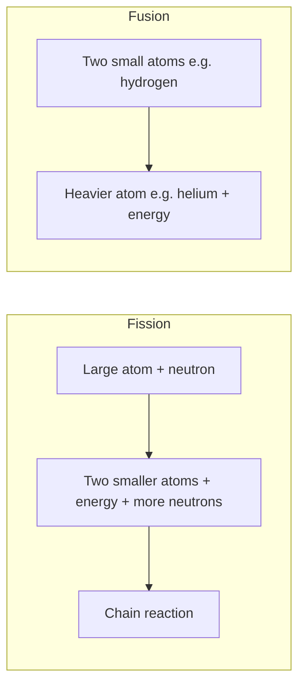

# 05 — Nuclear Fission, Fusion and Reactors

### Lecture — 10 September 2026

> **Date of Lecture:** 10 September 2026 (second class of the day; Social Issues L2 was the first)  
> **Date Added:** 2026-09-10  
> **Faculty:** **Shobhit Sir** (continues Lecture 09, 3 September — `03_Atoms_Radioactivity_and_Elementary_Particles.md`; nuclear map from Lecture 08, 26 August — `02_Nuclear_Technology_Civilian_Military_Triad.md`)  
> **Source:** Vajiram & Ravi class + audio transcript + 6 handwritten notebook pages (dated **10/9/26**, circled **1**)  
> **Paper:** Prelims S&T; GS-III energy / nuclear.  
> **Parked:** **moderator** (next class); **International Thermonuclear Experimental Reactor (ITER)** and fusion in greater detail.  
> **How to read class shortcuts:** full form on first use. Glossary at the end.

Nuclear technology still sits on **three** processes: **radioactivity** (last class), **nuclear fission**, **nuclear fusion**. Today finishes **particle / anti-particle**, then fission–fusion, fuels, enrichment, and the reactor (minus moderator).

---

## 1. Particle and anti-particle (ST-06-01)

Every type of particle has a corresponding **anti-particle**.

| Particle | Anti-particle |
|:---|:---|
| Proton | Antiproton |
| Neutron | Antineutron |
| Electron | **Positron** |

**Similar masses, opposite charges** (if the particle has a charge). Proton +, antiproton −. Electron −, positron +. **Neutron is electrically neutral → antineutron is also electrically neutral.**

**Annihilation:** particle + its anti-particle meet → they **destroy each other**. Mass converts to **energy as photons**. Class: this is **mass → energy**.

**Pair production:** **high-energy photons** can produce a particle **and** its anti-particle. Class: this is **energy → mass**. Needs a system / infrastructure — commercially costly.

**Anti-hydrogen (class picture):** ordinary hydrogen = **one proton** in the nucleus + **one electron**. Anti-hydrogen = **antiproton** (negative nucleus) surrounded by a **positron**. Hydrogen + anti-hydrogen → energy.

**Matter–antimatter puzzle:** if all matter came from energy, energy should make a **pair** (matter + antimatter) → roughly **equal** antimatter. Scientists have **not** found that equal amount. Class: a paradox / puzzle in the theory.

**Utility — far future, not near.** Antimatter would be an **unparalleled** energy source because **all** the mass converts (fission / fusion convert only a **tiny** mass). Class scale: **less than a gram** could send a spaceship **Earth → Moon**; a **few grams** toward distant planets. **Not commercially viable now:** infrastructure huge; **more than 60 trillion dollars** to generate **1 gram**. **CERN Large Hadron Collider (LHC)** has made a **tiny** amount — class: **1 nanogram** (**10⁻⁹ g**). Scaling that infrastructure to **1 gram** would take **billions of years**.

---

## 2. Four fundamental forces — match table (ST-06-02)

Last class named the bosons. Today: **what each force does**, **range**, **relative strength** (descending). Prelims have asked **which is the weakest**.

| Force | What it does (class) | Force-carrying particle | Range | Relative strength |
|:---|:---|:---|:---|:---|
| **Strong nuclear** | Binds the **nucleus** (quarks) together | **Gluon** | **Short** | **Strongest** |
| **Electromagnetic** | Acts between **charged** particles | **Photon** | **Infinite** | 2nd |
| **Weak nuclear** | Governs **particle decay** (radioactive decay) | **W and Z bosons** | **Short** | 3rd |
| **Gravitational** | Acts between objects with **mass** | **Graviton** (**not yet discovered**) | **Infinite** | **Weakest** |

**Order of strength:** strong > electromagnetic > weak > gravity.

---

## 3. Nuclear fission vs nuclear fusion (ST-06-03)

### Fission

**Nuclear fission** is the **energetic splitting** of **large** atoms such as **uranium** or **plutonium** into **two smaller atoms**, called **fission products**.

- **Uranium** atomic number **92** (92 protons). **Plutonium** **94**.  
- Hit the large atom with a **neutron** → splits + **energy** + **more neutrons**. Those neutrons split nearby atoms → **self-sustaining chain reaction**. Initiate once; then it runs.  
- Neutrons rise **exponentially**. If **uncontrolled**, all fuel is consumed in a **short** time → **accumulated** energy = **explosion** = **atom bomb**.  
- **Nuclear reactor** uses the **same reaction** but **controlled**: **extended** release, fuel consumed slowly. Control the **neutron population**. Extra neutrons absorbed by **control rods** (**boron** / **cadmium** — §7).  
- Smaller atoms = **radioactive nuclear waste** (must be discarded). Class named barium / krypton then said **do not write them** — not a physics paper.  
- **All commercial nuclear power plants presently in operation** (India and the world) are based on **fission**. Fusion is **not** commercialised **anywhere**.

**Bomb vs reactor** = **uncontrolled vs controlled** fission. Same reaction.

### Fusion

**Nuclear fusion** is the **combining** of **two small** atoms (e.g. **hydrogen**) to produce a **heavier** atom (e.g. **helium**) **along with** energy.

- Only under **extremely high temperature and pressure**. Class: **millions** of °C — **not** 100,000 °C. **Not** naturally on Earth (surface or interior).  
- Natural home: **core of the Sun and other stars**. Sun **surface ~6,000 °C**; **core ~15 million °C** + huge pressure from mass. Core: **hydrogen → helium**. **Source of energy of the Sun and stars = fusion.**  
- **Fusion releases more energy than fission for the same amount of mass**, **without producing radioactive by-products**. Major by-product **helium** = inert, non-toxic, **not** a greenhouse gas. Fuel story: **hydrogen** from **water** → nearly **limitless**, **low-pollution**.  
- **Not commercially developed**, but **serious research worldwide** for that reason.

**Status on Earth:** fusion **can** be conducted in experimental reactors (must **supply electricity** from outside to make the conditions). **Not commercial** because **efficiency = output power / input power is less than 1** — the machine **eats more power than it gives**. Viable only when efficiency **> 1**. Class: reactors have reached temperatures **5–7×** the Sun’s core (**~75 million °C** and more).

**Named experiments (class):** China’s **EAST** reactor, nicknamed **artificial sun**; South Korea **K-STAR**. **ITER** = **International Thermonuclear Experimental Reactor** — **33 nations including India**, experimental fusion reactor being built in **France**. Class: among the most expensive science experiments; **technological goal = efficiency 10** (**50 MW** in → **500 MW** out). Greater detail **parked**.

### Update — 10 September 2026 (UPSC CSE Prelims 2016 / 2022 + flash)

`CSE-2016-Q79` **held**. If ITER succeeds, the immediate advantage is that India can **build fusion reactors** for power. Not thorium-for-uranium, not satellite navigation, not fission-reactor efficiency.

`CSE-2022-Q28` **held**. Monazite is a source of **rare earths** and contains **thorium**. It does **not** occur in the **entire** Indian coastal sand (class: **east + south** coasts). In India, **government bodies only** can process or export monazite.

Flash F7 **missed** (`MST-072`): today’s fusion **efficiency < 1** (why it is not commercial — paper Q4 held). ITER’s **goal** is **10**. Do not lock “<1 forever” as the ITER target.

---

## 4. Source of the energy — Einstein (ST-06-04)

In fission **and** fusion a **certain amount of mass (m)** converts to **energy (E)** by **Einstein’s formula E = mc²**.

- **c** = speed of light = a **very large** number = **3 × 10⁸ m/s**.  
- **c² = 9 × 10¹⁶** → even a **tiny** mass gives **huge** energy.  
- Class contrast: particle / anti-particle convert **all** mass → even larger potential than fission / fusion.

---

## 5. Fuels for nuclear fission (ST-06-05)

**Naturally occurring uranium** (mined) is **always a mix of two isotopes:** **Uranium-235 (U-235)** and **Uranium-238 (U-238)**.

| | **Thorium-232** | **U-233** | **U-235** | **U-238** | **Plutonium-239** |
|:---|:---|:---|:---|:---|:---|
| Notation (sheet) | **²³²₉₀Th** | **²³³₉₂U** | **²³⁵₉₂U** | **²³⁸₉₂U** | **²³⁹₉₄Pu** |
| Found | Naturally | **Artificial** | Naturally (**0.7%** of natural U) | Naturally (**99.3%** — abundant) | **Artificial** — **not found naturally** |
| Fissile? | **No** — **fertile** | **Yes — fissile** | **Yes — fissile** | **No** — **fertile** | **Yes — fissile** |

**Fissile** = can undergo nuclear fission = **fuel**. Class fuels: **U-235, U-233, Pu-239**.  
**Fertile** = **cannot** start fission, but inside a reactor it **absorbs neutrons** and **transmutes** into a fissile isotope. Analogy: **wet wood** — you cannot start a fire with it; put it on a fire already going and it dries and burns.

**U-238:** non-fissile, **not** a fuel by itself. Beside **U-235** fission it absorbs neutrons → eventually **Pu-239** (fissile). Curiosity (class: **not required for the exam**): U-238 + n → **U-239** (unstable) → **β** → **Neptunium-239** (Z **93**) → **β** → **Pu-239** (Z **94**). Intermediates have their own half-lives.

**Plutonium:** **not found naturally anywhere**. No country has “plutonium mines.” Whatever Pu a country has, it **derived** from **U-238**. **Uranium is the last naturally occurring element (Z = 92).** Beyond 92, discovered elements (**118** in the L09 count) are **artificial**. Pu **Z = 94** → must be artificial.

**India and uranium:** **not enough** reserves; **largely import-dependent**. Class: **Kazakhstan** = **top exporter**; **Canada** = **largest reserves**; **Australia** also rich.

**Thorium-232 — special for India.** India has **one of the largest** (class: some estimates **the largest**) **thorium** reserves. Found on the **eastern and southern coasts** in **monazite sand**, which also holds **other rare-earth minerals**. **Non-fissile, fertile** → absorbs neutrons → **U-233** (fissile, artificial). **Cannot start** the programme on thorium alone: need a running fission (imported **uranium**) beside the thorium; later, enough **U-233** can fuel reactors. That is why India **still imports uranium** despite rich thorium.

---

## 6. Enrichment of uranium and downblending (ST-06-06)

**Enrichment** = increasing the **concentration of U-235** (the fissile isotope) in natural uranium fuel, by **removing U-238**. Makes the fuel **more efficient**. Done in a **centrifuge**.

| Use | Class lock |
|:---|:---|
| **Peaceful** (electricity) | **3–5%** U-235 is **usually enough** |
| **Nuclear weapons** | Enrichment **more than 90%** |
| **Highly Enriched Uranium (HEU)** | Beyond **20%**. Around **80–90%+** class called **bomb-grade** |
| **Iran (class current-affairs hook)** | Found enriching **beyond 60%** — signal that the path is **weapons**, not power. **Centrifuge** is the threat; a power **reactor** using low enrichment is not. |

**Centrifuge:** uranium first **gasified**. Machine rotates very fast; **heavier U-238** (~**1% heavier** than U-235) goes to the **edge** and is removed. Class: **50,000–80,000 rotations per minute (RPM)**; needs alloys / technical expertise.

**Downblending** = **reverse of enrichment**. Mix **HEU** with **natural uranium** to **bring U-235 down** (class: to **less than 5%**) so it is **not** bomb-usable, only reactor fuel. Class: US proposed Iran **downblend under International Atomic Energy Agency (IAEA)** oversight; talks did not land. **Low Enriched Uranium (LEU)** = the product of that bring-down.

---

## 7. Nuclear reactor — what it is; how it makes electricity (ST-06-07)

A **nuclear reactor** is a system that **contains and controls sustained nuclear chain reactions**.

**Uses (class):** generating **electricity**; moving **aircraft carriers** and **submarines**; producing **radioactive isotopes**; **research**.

**Electricity path (same idea as a thermal plant):** nuclear fission → **heat** → converts **water** to **steam** → steam **rotates a turbine** coupled to a **generator** → electricity.

### Main components (moderator next class)

**1. Core**  
Main area. Contains **all the fuel**, placed inside **fuel rods** (generally **zirconium** — high melting point, low reactivity). Pellets in cylindrical rods; **hundreds / thousands** of rods; **not** refuelled daily — months. **Fission happens here; all the heat is generated here.** **Control systems** also sit in the core.

**2. Coolant**  
A **fluid** that **captures heat** in the core and **transfers** it so water can become steam. Also **cools** the core — without it the core **overheats / melts**. Common coolants: **plain water (H₂O)**, **heavy water (D₂O)**, **liquid sodium**. Liquid sodium flows **in pipes** and does **not** contact the steam.

**3. Control rods**  
Rate of fission **depends on neutron population**. Rods **absorb neutrons** to control that rate. Materials with a **very good ability to absorb neutrons**: **boron** and **cadmium**.

| Want | Do |
|:---|:---|
| **Shut down** | Drop **all** rods in → absorb neutrons → reaction **halts** |
| **Steady power** | Hold a **steady** neutron population |
| **More power** | **Pull rods out** → neutron population rises |

**4. Moderator** — **next class**.

---

## Abbreviations

| Short | Full |
|:---|:---|
| D₂O | Heavy water (deuterium oxide) |
| EAST | China’s experimental fusion reactor (class name; nicknamed **artificial sun**) |
| HEU | Highly Enriched Uranium (class: beyond **20%**) |
| IAEA | International Atomic Energy Agency |
| ITER | International Thermonuclear Experimental Reactor |
| K-STAR | South Korea’s experimental fusion reactor (class name) |
| LEU | Low Enriched Uranium |
| LHC / CERN | Large Hadron Collider / European Organization for Nuclear Research |
| Pu | Plutonium |
| RPM | Rotations per minute |
| Th | Thorium |
| U | Uranium |

<!-- 2026-09-10: Shobhit Sir nuclear L after 3 Sep atoms — antiparticle close, four-force range/strength, fission vs fusion, E=mc², fuels/fertile, enrichment/downblend, reactor core/coolant/control rods. Moderator parked. One cluster ST-06. -->
