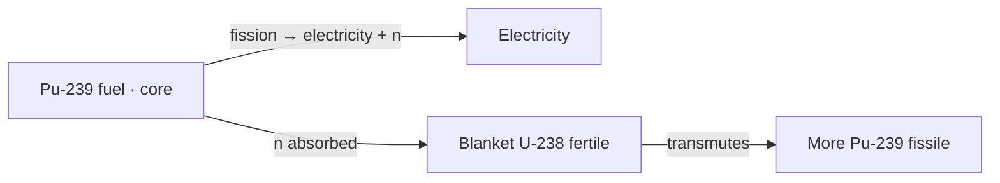
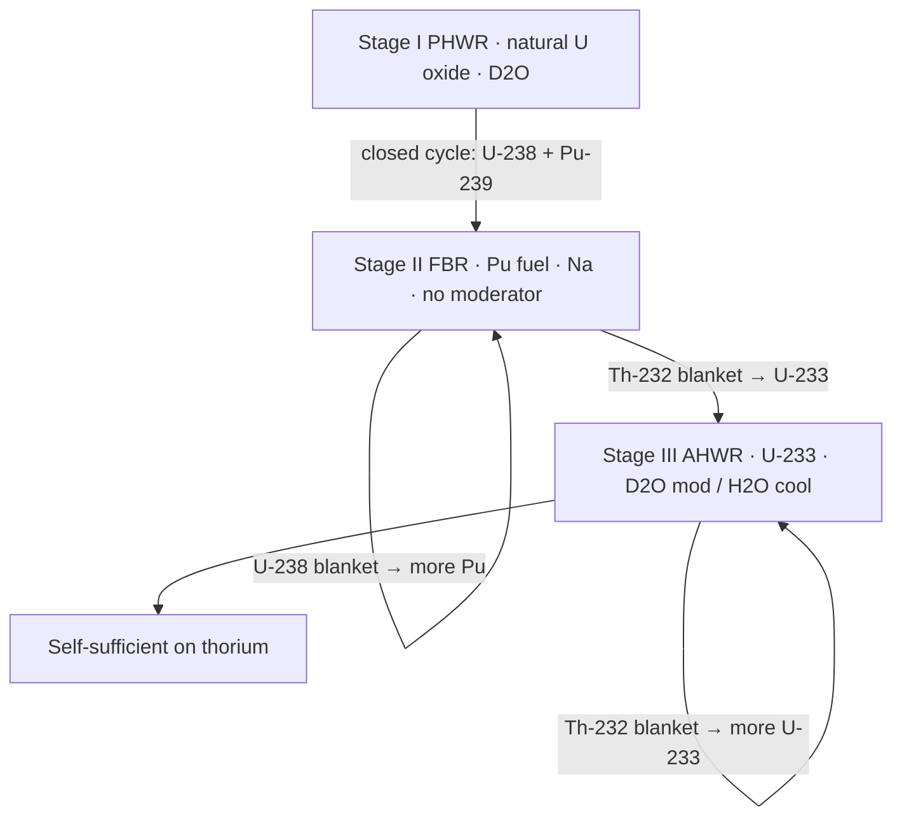
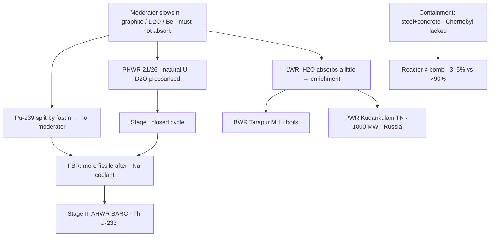

# 06 — Moderator, Reactor Types, and India’s Three-Stage Nuclear Programme

### Lecture — 12 September 2026

> **Date of Lecture:** 12 September 2026 (second class of the day; Social Issues L3 was the first)  
> **Date Added:** 2026-09-12  
> **Faculty:** **Shobhit Sir** (continues 10 September — `05_Nuclear_Fission_Fusion_and_Reactors.md`, cluster **ST-06**)  
> **Source:** Vajiram & Ravi class + audio transcript + 6 handwritten notebook pages (dated **12/9/26**, circled **1–6**; starts at **(4) Moderator**)  
> **Paper:** Prelims S&T; GS-III energy / nuclear.  
> **Already in notes (not restated as a new lecture):** fissile vs fertile; U-235 **0.7%** / U-238 **99.3%**; Pu-239 artificial; peaceful enrichment **3–5%** vs weapons **>90%**; core / coolant / control rods **boron + cadmium** (`ST-06`). **New facts only** sit here.  
> **Parked:** **disadvantages / concerns / challenges** of nuclear power (next class); **Prototype Fast Breeder Reactor (PFBR)** at **Kalpakkam** in detail (class: commissioned **April this year** — mention only). **ITER** still parked from ST-06.  
> **How to read class shortcuts:** full form on first use. Glossary at the end.

Today finishes the reactor: **moderator**, **containment**, the types **India uses or intends to use**, **Homi J. Bhabha’s three-stage programme**, and **advantages** of nuclear power.

---

## 1. Moderator (ST-07-01)

If the neutron hitting a **uranium** atom is **too fast**, it may **simply pass through the nucleus without causing a split**. Neutrons are wasted → **efficiency of fission falls**. Too **slow** and they **cannot enter**. They need an **appropriate** speed so they go in, get stuck, destabilise, and split.

A **moderator** **slows down** neutrons in the reactor to that level. That **raises neutron efficiency** and the **overall efficiency** of fission.

**Commonly used:** **graphite** (carbon), **heavy water (D₂O)**, **beryllium**. Prelims / Mains can ask the list.

**Lock:** a **good** moderator **must not absorb** neutrons — it should **only slow them down**. Absorption is the job of **control rods**. If the moderator itself absorbs, it becomes **counterproductive**.

**Plutonium-239** can be **readily split by fast-moving neutrons**. **Plutonium-fuelled reactors therefore do not require a moderator.**

**Light water (H₂O)** *can* slow neutrons, but it is **not** on the class list of good moderators: hydrogen in H₂O has a **slight tendency to absorb** a neutron (class: H → D). That **compromises** neutron efficiency → **Light Water Reactors (LWRs)** generally need **enrichment**.

---

## 2. Containment unit (ST-07-02)

The **containment unit** is the **structure that separates the nuclear reactor from the environment**. **High-density steel-reinforced concrete.** In an accident it **restricts the spread of radioactive material**.

**Chernobyl (class context only — not a history paper):** the reactor **exploded**; **no containment structure** at the time → radioactive material spread; the city was evacuated. Containment was **built later**. People outside died from **radiation exposure**, not because the plant behaved like a **bomb**. Other reactors on the **same site** kept running. A reactor uses **~3–5%** enrichment; a bomb needs **>90%** — a reactor **cannot behave like a nuclear bomb**.

**Fukushima (class):** **explosion did not happen**. Tsunami **water entered**; water was **contaminated**. **Not** as big as Chernobyl; **radiation exposure to people outside** was **not** the Chernobyl story.

**Bhopal** is a **chemical** disaster (**methyl isocyanate**), **not** nuclear. Do not mix the two.

**Decision lock (why UPSC asks this):** ask **whether the core is damaged**. Turbine / cooling-tower damage ≠ panic if the **core is fine**. Radiation **does not kill immediately**; waiting for casualties **misses the golden hour**. If levels are high **outside** the plant → evacuation. Until clarity: **stay indoors**.

---

## 3. Types of nuclear reactors India uses (ST-07-03)

Study **only** types India **uses or intends to use**. Class count: **26** operational reactors; **21** are **Pressurised Heavy Water Reactors (PHWRs)** — the **dominant** type. India is **self-sufficient** in PHWR technology (can manufacture / construct them). Handout had **22**; class **upgraded to 26**. Do not invent the missing unit.

### Pressurised Heavy Water Reactor (PHWR)

| | Class lock |
|:---|:---|
| **Fuel** | **Natural uranium oxide** (U-235 + U-238). **Enrichment is not necessary.** |
| **Moderator and coolant** | **Heavy water (D₂O)** |
| **Pressurised** | Heavy-water coolant is **kept under pressure** so it can be heated to **higher temperature without boiling**. **Raising pressure raises boiling point** (all liquids; class: sea-level water **100 °C**). That **increases the heat-carrying capacity** of the coolant. |

### Light Water Reactors (LWRs)

**Fuel:** natural uranium oxide — **enrichment of uranium may be required** (because light water is a **compromised** moderator). **Moderator and coolant = light water (H₂O).**

Two types in India:

| | **Boiling Water Reactor (BWR)** | **Pressurised Water Reactor (PWR)** |
|:---|:---|:---|
| Coolant | Light water **not** kept under pressure → **boils on contact** with the heated core | Light water **kept under pressure** |
| India | **Two** BWRs at **Tarapur, Maharashtra (MH)** — class: India’s **first two** reactors | **Two** PWRs at **Kudankulam, Tamil Nadu (TN)** |
| Extra | — | **Russian collaboration**. **Largest capacity** reactors in India: **1000 megawatt (MW)** each. Next-largest class named: **700 MW**. |

Cyber-attack news on Kudankulam = **critical-infrastructure / cyber-security** example; not a separate nuclear lecture.

---

## 4. Fast Breeder Reactor (ST-07-04)

A **breeder reactor** is characterised by **more fissile material after the reaction than was kept in the reactor before it**. Start with a **small** fissile charge; end with **more** fissile than you started with — electricity **and** extra fuel.

**How:** **Plutonium-239** in the **core** (fission → electricity + neutrons). Surrounded by a **blanket** of **fertile Uranium-238**. Neutrons absorbed → **more Pu-239**. Limiting stock = **fertile** material: keep adding U-238, keep breeding.

**Fast:** Pu-239 is **readily split by fast neutrons** → neutrons are **allowed to move fast** → **no moderator**. Coolant is generally **liquid sodium**.

U-238 does **not** become Pu **immediately** (last class chain: U-238 → U-239 → Neptunium-239 → Pu-239). Blanket material is **separated and left to convert**; that is why new Pu does **not** fission in the blanket at once.

**Mains 2019 hook (class):** “advantages of the Fast Breeder Reactor programme in India” — **first** say what Stage 2 **is** (one tight paragraph), **then** advantages. Do not dump random facts. Content in §5.

---

## 5. India’s three-stage nuclear power programme (ST-07-05)

Aimed at **peaceful use** of nuclear technology for **electricity**. Designed as **three connected stages** by **Dr Homi J. Bhabha** (class: **architect / father** of India’s nuclear programme). **By-products of one stage become fuel for the next.**

**Ultimate goal:** use India’s **vast thorium** reserves and become **self-sufficient** in nuclear **fuel** (no uranium imports). Right now India has the **technology** but **imports uranium**.

### Stage I — Pressurised Heavy Water Reactor

Same PHWR specs as §3. India **self-sufficient in this technology**.

**Spent fuel** (what is left after the fuel is consumed) consists of:

- remaining **U-238**  
- **Pu-239** (from transmutation of some U-238)  
- **other radioactive by-products** of U-235 fission (to be discarded — class: **do not name** them)

**Reprocessing**

| | **Open cycle** | **Closed cycle (India)** |
|:---|:---|:---|
| What | Dispose of the **entire** waste after **proper waste treatment** | **Chemically separate U-238 and Pu-239**; rest disposed after proper treatment |
| Why not / why | **Huge under-utilisation** of uranium’s energy potential (only the tiny fissile cut was used). Afforded by countries with **abundance** of uranium | India has **three stages to go**; U-238 + Pu-239 feed **Stage II** |
| Environment | Class: **both** follow waste protocol — open cycle is **wasteful of fuel**, not “more polluting” by dumping |

### Stage II — Fast Breeder Reactor

**Fuel:** **Pu-239**, **initially from Stage I** (closed cycle); later **bred** in this stage. **Coolant: liquid sodium. No moderator.**

Two blankets around the core:

| Blanket | Fertile → | Used as |
|:---|:---|:---|
| **U-238** (from Stage I) | **Pu-239** | Fuel **in this stage itself** |
| **Thorium-232** | **U-233** | Fuel for **Stage III** |

**Advantages of the FBR programme (class answer after the one-paragraph “what it is”):**

1. **Full potential of uranium** — Stage I used only **0.7%** (India does **not** enrich); **99.3%** U-238 is converted here to Pu and then fissioned.  
2. **Paves the way for self-sufficiency** — Th-232 → U-233 for Stage III.

**Status (this class, detail next sitting):** India has **recently entered Stage II** — **Prototype Fast Breeder Reactor** at **Kalpakkam**, class: **commissioned April this year**. **Stage I and Stage II now run in parallel.** PFBR internals **parked**.

### Stage III — Advanced nuclear power systems for utilisation of thorium

Also a **breeder**, but **not fast** (fuel is **uranium**, which **needs** a moderator).

| | Class lock |
|:---|:---|
| **Fuel** | **U-233**, initially from Stage II; later **bred** here |
| Reactor under construction | **Advanced Heavy Water Reactor (AHWR)** — **Bhabha Atomic Research Centre (BARC)**, **indigenous**, **under construction** |
| Moderator | **Heavy water (D₂O)** |
| Coolant | **Light water (H₂O)** — **cheaper**; PHWR kept both as D₂O to avoid mixing types |

**U-233** in the core + **blanket of Th-232** → more **U-233** for this stage. After that, **just add thorium**.

---

## 6. Advantages of nuclear power (ST-07-06)

**Disadvantages / concerns / challenges — next class** (heading only today).

1. **Environment-friendly.** Considered a **very clean** source: the reactor **emits no pollutants** (no particulate matter, greenhouse gases, acid-rain gases, toxic gases, smoke). Nuclear waste is **radioactive**, but **if handled properly** (class: **concretised, buried deep**) it **does not come in direct contact** with the environment.

2. **Space.** Space needed to operate a plant is **very less** compared with other sources **for the same power**. Contrast: **solar and wind** are **highly land-intensive**. Land is already scarce if India shifts off fossil fuels.

3. **Small quantity of fuel.** A few **kilograms of uranium** can match **tons of coal**. **Fuel transport cost is less**; **large storage is not required**. Location **need not** sit on the uranium mine (unlike coal thermal plants, which sit near the bulky fuel).

4. **Reliable.** Reactors are **not affected by unfavourable weather**. **Continuous electricity at all times.** Solar / wind are **intermittent** and **weather-dependent** (no sun at night / cloud; wind below a threshold). Nuclear stands out as a **reliable replacement for fossil fuels**; solar and wind are promoted but **cannot be banked on alone**.

5. **Suited to large / peak demand.** They give **better performance even at higher load factors of 80% to 90%**.

**Load factor of a power plant** = **output power / total installed capacity**. Example: 1000 MW plant producing 500 MW = **50%**. Class: Indian **thermal** plants normally ~**62–63%**, and even in a spike **cannot go beyond ~70–75%**. **Nuclear** already runs ~**80–83%** in normal times and **can** go **80–90%** when demand spikes (peak summer).

---

## Knowledge graph — Lecture 12 Sep

---

## Abbreviations

| Short | Full |
|:---|:---|
| AHWR | Advanced Heavy Water Reactor |
| BARC | Bhabha Atomic Research Centre |
| BWR | Boiling Water Reactor |
| D₂O | Heavy water (deuterium oxide) |
| FBR | Fast Breeder Reactor |
| LWR | Light Water Reactor |
| MH | Maharashtra |
| MW | Megawatt |
| PFBR | Prototype Fast Breeder Reactor (Kalpakkam — detail next class) |
| PHWR | Pressurised Heavy Water Reactor |
| PWR | Pressurised Water Reactor |
| TN | Tamil Nadu |

<!-- 2026-09-12: Shobhit Sir nuclear L after 10 Sep fission — moderator / containment / PHWR-LWR-FBR / Bhabha three-stage closed cycle / advantages. Disadvantages + PFBR detail parked. One cluster ST-07. -->
