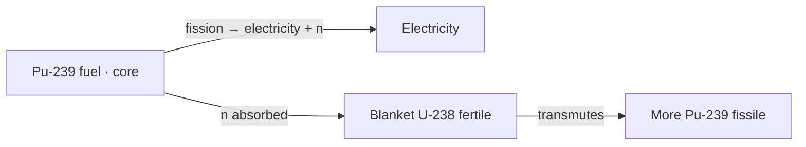
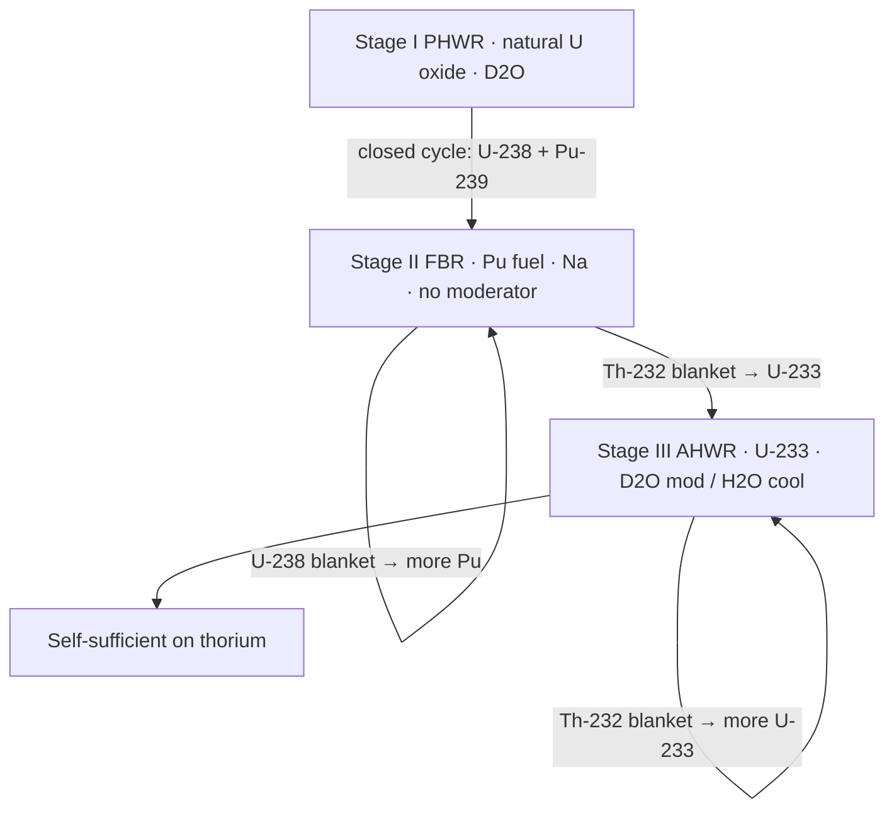
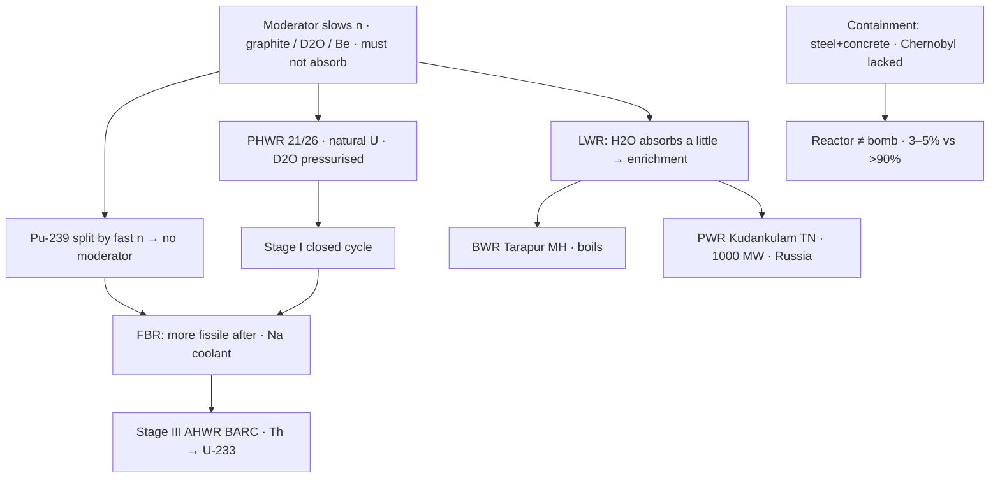

# 06 — Moderator, Reactor Types, and India’s Three-Stage Nuclear Programme

### Lecture 1 — 12 September 2026

> **Date of Lecture:** 12 September 2026 (second class of the day; Social Issues L3 was the first)  
> **Date Added:** 2026-09-12  
> **Faculty:** **Shobhit Sir** (continues 10 September — `05_Nuclear_Fission_Fusion_and_Reactors.md`, cluster **ST-06**)  
> **Source:** Vajiram & Ravi class + audio transcript + 6 handwritten notebook pages (dated **12/9/26**, circled **1–6**; starts at **(4) Moderator**)  
> **Paper:** Prelims S&T; GS-III energy / nuclear.  
> **Already in notes (not restated as a new lecture):** fissile vs fertile; U-235 **0.7%** / U-238 **99.3%**; Pu-239 artificial; peaceful enrichment **3–5%** vs weapons **>90%**; core / coolant / control rods **boron + cadmium** (`ST-06`). **New facts only** sit here.  
> **Parked (cleared 14 Sep):** disadvantages / PFBR detail / ITER — Lecture 2 below. **Still parked:** nanotechnology (class: last); Shobhit Sir next sitting = **economy / foreign exchange**, not nano.  
> **How to read class shortcuts:** full form on first use. Glossary at the end.

Today finishes the reactor: **moderator**, **containment**, the types **India uses or intends to use**, **Homi J. Bhabha’s three-stage programme**, and **advantages** of nuclear power.

---

## 1. Moderator (ST-07-01)

If the neutron hitting a **uranium** atom is **too fast**, it may **simply pass through the nucleus without causing a split**. Neutrons are wasted → **efficiency of fission falls**. Too **slow** and they **cannot enter**. They need an **appropriate** speed so they go in, get stuck, destabilise, and split.

A **moderator** **slows down** neutrons in the reactor to that level. That **raises neutron efficiency** and the **overall efficiency** of fission.

**Commonly used:** **graphite** (carbon), **heavy water (D₂O)**, **beryllium**. Prelims / Mains can ask the list.

**Lock:** a **good** moderator **must not absorb** neutrons — it should **only slow them down**. Absorption is the job of **control rods**. If the moderator itself absorbs, it becomes **counterproductive**.

**Plutonium-239** can be **readily split by fast-moving neutrons**. **Plutonium-fuelled reactors therefore do not require a moderator.**

**Light water (H₂O)** *can* slow neutrons, but it is **not** on the class list of good moderators: hydrogen in H₂O has a **slight tendency to absorb** a neutron (class: H → D). That **compromises** neutron efficiency → **Light Water Reactors (LWRs)** generally need **enrichment**.

---

## 2. Containment unit (ST-07-02)

The **containment unit** is the **structure that separates the nuclear reactor from the environment**. **High-density steel-reinforced concrete.** In an accident it **restricts the spread of radioactive material**.

**Chernobyl (class context only — not a history paper):** the reactor **exploded**; **no containment structure** at the time → radioactive material spread; the city was evacuated. Containment was **built later**. People outside died from **radiation exposure**, not because the plant behaved like a **bomb**. Other reactors on the **same site** kept running. A reactor uses **~3–5%** enrichment; a bomb needs **>90%** — a reactor **cannot behave like a nuclear bomb**.

**Fukushima (class):** **explosion did not happen**. Tsunami **water entered**; water was **contaminated**. **Not** as big as Chernobyl; **radiation exposure to people outside** was **not** the Chernobyl story.

**Bhopal** is a **chemical** disaster (**methyl isocyanate**), **not** nuclear. Do not mix the two.

**Decision lock (why UPSC asks this):** ask **whether the core is damaged**. Turbine / cooling-tower damage ≠ panic if the **core is fine**. Radiation **does not kill immediately**; waiting for casualties **misses the golden hour**. If levels are high **outside** the plant → evacuation. Until clarity: **stay indoors**.

---

## 3. Types of nuclear reactors India uses (ST-07-03)

Study **only** types India **uses or intends to use**. Class count: **26** operational reactors; **21** are **Pressurised Heavy Water Reactors (PHWRs)** — the **dominant** type. India is **self-sufficient** in PHWR technology (can manufacture / construct them). Handout had **22**; class **upgraded to 26**. Do not invent the missing unit.

### Pressurised Heavy Water Reactor (PHWR)

| | Class lock |
|:---|:---|
| **Fuel** | **Natural uranium oxide** (U-235 + U-238). **Enrichment is not necessary.** |
| **Moderator and coolant** | **Heavy water (D₂O)** |
| **Pressurised** | Heavy-water coolant is **kept under pressure** so it can be heated to **higher temperature without boiling**. **Raising pressure raises boiling point** (all liquids; class: sea-level water **100 °C**). That **increases the heat-carrying capacity** of the coolant. |

### Light Water Reactors (LWRs)

**Fuel:** natural uranium oxide — **enrichment of uranium may be required** (because light water is a **compromised** moderator). **Moderator and coolant = light water (H₂O).**

Two types in India:

| | **Boiling Water Reactor (BWR)** | **Pressurised Water Reactor (PWR)** |
|:---|:---|:---|
| Coolant | Light water **not** kept under pressure → **boils on contact** with the heated core | Light water **kept under pressure** |
| India | **Two** BWRs at **Tarapur, Maharashtra (MH)** — class: India’s **first two** reactors | **Two** PWRs at **Kudankulam, Tamil Nadu (TN)** |
| Extra | — | **Russian collaboration**. **Largest capacity** reactors in India: **1000 megawatt (MW)** each. Next-largest class named: **700 MW**. |

Cyber-attack news on Kudankulam = **critical-infrastructure / cyber-security** example; not a separate nuclear lecture.

---

## 4. Fast Breeder Reactor (ST-07-04)

A **breeder reactor** is characterised by **more fissile material after the reaction than was kept in the reactor before it**. Start with a **small** fissile charge; end with **more** fissile than you started with — electricity **and** extra fuel.

**How:** **Plutonium-239** in the **core** (fission → electricity + neutrons). Surrounded by a **blanket** of **fertile Uranium-238**. Neutrons absorbed → **more Pu-239**. Limiting stock = **fertile** material: keep adding U-238, keep breeding.

**Fast:** Pu-239 is **readily split by fast neutrons** → neutrons are **allowed to move fast** → **no moderator**. Coolant is generally **liquid sodium**.

U-238 does **not** become Pu **immediately** (last class chain: U-238 → U-239 → Neptunium-239 → Pu-239). Blanket material is **separated and left to convert**; that is why new Pu does **not** fission in the blanket at once.

**Mains 2019 hook (class):** “advantages of the Fast Breeder Reactor programme in India” — **first** say what Stage 2 **is** (one tight paragraph), **then** advantages. Do not dump random facts. Content in §5.

---

## 5. India’s three-stage nuclear power programme (ST-07-05)

Aimed at **peaceful use** of nuclear technology for **electricity**. Designed as **three connected stages** by **Dr Homi J. Bhabha** (class: **architect / father** of India’s nuclear programme). **By-products of one stage become fuel for the next.**

**Ultimate goal:** use India’s **vast thorium** reserves and become **self-sufficient** in nuclear **fuel** (no uranium imports). Right now India has the **technology** but **imports uranium**.

### Stage I — Pressurised Heavy Water Reactor

Same PHWR specs as §3. India **self-sufficient in this technology**.

**Spent fuel** (what is left after the fuel is consumed) consists of:

- remaining **U-238**  
- **Pu-239** (from transmutation of some U-238)  
- **other radioactive by-products** of U-235 fission (to be discarded — class: **do not name** them)

**Reprocessing**

| | **Open cycle** | **Closed cycle (India)** |
|:---|:---|:---|
| What | Dispose of the **entire** waste after **proper waste treatment** | **Chemically separate U-238 and Pu-239**; rest disposed after proper treatment |
| Why not / why | **Huge under-utilisation** of uranium’s energy potential (only the tiny fissile cut was used). Afforded by countries with **abundance** of uranium | India has **three stages to go**; U-238 + Pu-239 feed **Stage II** |
| Environment | Class: **both** follow waste protocol — open cycle is **wasteful of fuel**, not “more polluting” by dumping |

### Stage II — Fast Breeder Reactor

**Fuel:** **Pu-239**, **initially from Stage I** (closed cycle); later **bred** in this stage. **Coolant: liquid sodium. No moderator.**

Two blankets around the core:

| Blanket | Fertile → | Used as |
|:---|:---|:---|
| **U-238** (from Stage I) | **Pu-239** | Fuel **in this stage itself** |
| **Thorium-232** | **U-233** | Fuel for **Stage III** |

**Advantages of the FBR programme (class answer after the one-paragraph “what it is”):**

1. **Full potential of uranium** — Stage I used only **0.7%** (India does **not** enrich); **99.3%** U-238 is converted here to Pu and then fissioned.  
2. **Paves the way for self-sufficiency** — Th-232 → U-233 for Stage III.

**Status (detail 14 Sep):** India has **recently entered Stage II** — **Prototype Fast Breeder Reactor** at **Kalpakkam**, class: **commissioned April this year**. **Stage I and Stage II now run in parallel.** PFBR internals → Lecture 2.

### Stage III — Advanced nuclear power systems for utilisation of thorium

Also a **breeder**, but **not fast** (fuel is **uranium**, which **needs** a moderator).

### Update — 12 September 2026 (evening paper)

`MST-081`. Stage I **closed cycle** + Stage II **Pu + Th blankets** held. Trap: Stage III AHWR is **not** a fast breeder because **U-233**, like Pu-239, “needs unmoderated neutrons.” **False.** U-233 needs **D₂O**; coolant is cheaper **H₂O**. He picked **all three**. Flash AHWR specs (BARC / U-233 / D₂O / H₂O) held — **one** atom. **Held 13 Sep evening** (I+II; flash F12). 15-day **28 Sep**.

| | Class lock |
|:---|:---|
| **Fuel** | **U-233**, initially from Stage II; later **bred** here |
| Reactor under construction | **Advanced Heavy Water Reactor (AHWR)** — **Bhabha Atomic Research Centre (BARC)**, **indigenous**, **under construction** |
| Moderator | **Heavy water (D₂O)** |
| Coolant | **Light water (H₂O)** — **cheaper**; PHWR kept both as D₂O to avoid mixing types |

**U-233** in the core + **blanket of Th-232** → more **U-233** for this stage. After that, **just add thorium**.

---

## 6. Advantages of nuclear power (ST-07-06)

**Disadvantages / concerns / challenges — 14 Sep (Lecture 2).** Heading only on 12 Sep.

1. **Environment-friendly.** Considered a **very clean** source: the reactor **emits no pollutants** (no particulate matter, greenhouse gases, acid-rain gases, toxic gases, smoke). Nuclear waste is **radioactive**, but **if handled properly** (class: **concretised, buried deep**) it **does not come in direct contact** with the environment.

2. **Space.** Space needed to operate a plant is **very less** compared with other sources **for the same power**. Contrast: **solar and wind** are **highly land-intensive**. Land is already scarce if India shifts off fossil fuels.

3. **Small quantity of fuel.** A few **kilograms of uranium** can match **tons of coal**. **Fuel transport cost is less**; **large storage is not required**. Location **need not** sit on the uranium mine (unlike coal thermal plants, which sit near the bulky fuel).

4. **Reliable.** Reactors are **not affected by unfavourable weather**. **Continuous electricity at all times.** Solar / wind are **intermittent** and **weather-dependent** (no sun at night / cloud; wind below a threshold). Nuclear stands out as a **reliable replacement for fossil fuels**; solar and wind are promoted but **cannot be banked on alone**.

5. **Suited to large / peak demand.** They give **better performance even at higher load factors of 80% to 90%**.

**Load factor of a power plant** = **output power / total installed capacity**. Example: 1000 MW plant producing 500 MW = **50%**. Class: Indian **thermal** plants normally ~**62–63%**, and even in a spike **cannot go beyond ~70–75%**. **Nuclear** already runs ~**80–83%** in normal times and **can** go **80–90%** when demand spikes (peak summer).

---

## Knowledge graph — Lecture 12 Sep

---

---

### Lecture 2 — 14 September 2026

> **Date of Lecture:** 14 September 2026 (second class of the day; History IVC L2 was the first)  
> **Date Added:** 2026-09-14  
> **Faculty:** **Shobhit Sir** (continues 12 September — same file, cluster **ST-07**). Cluster for this sitting: **ST-08**.  
> **Source:** Vajiram & Ravi class + audio transcript + 5 handwritten sheets (dated **14/9/26**, circled **1–5**)  
> **Paper:** Prelims S&T; GS-III energy / nuclear. Class flagged **CSE 2026 Mains** on **PFBR**.  
> **Already in notes (do not restudy as a new lecture):** fission vs fusion; efficiency **< 1** vs ITER goal **10** (**50 MW → 500 MW**); EAST / K-STAR; **33 nations / France** (`ST-06`). Moderator / PHWR–BWR–PWR / three-stage / advantages (`ST-07`). **New facts only** sit here.  
> **Parked:** **nanotechnology** (class: last chapter). Next Shobhit sitting = **economy — foreign exchange**, not nano.  
> **How to read class shortcuts:** full form on first use. Glossary at the end.

**Precision lock (Mains):** **challenge** ≠ **concern**. Same facts dumped into both answers is not rewarded. **Challenge** = barrier to *adopting* nuclear (why India / Sudan still small). **Concern / risk** = why **Japan** and **Germany** *shut* programmes they already ran. Swap the two and the answer is not *wrong*, but it is **not appropriate**.

Nuclear is **< 3%** of India’s power. Globally it is **not** dominant except in a handful of countries; most states have **no** reactor.

---

## 7. Challenges in adoption (ST-08-01)

1. **Huge initial setup cost** compared with other sources. One reactor costs **billions of dollars**; class: in that money you can open **tens of thermal plants**. Kept many countries on coal / gas when climate was not yet the constraint.

2. **Technology is dual-use** (electricity **or** weapons). If you have **not** developed it yourself, others are **reluctant** to share. **Iran** = class example (Western / US–Israel pressure). Solar / wind tech **is** shared; nuclear usually is not.

3. **Fuel / uranium assurance.** Uranium trade is geopolitical. India started **early** — first reactor **operational 1969** (**Tarapur**, Maharashtra) — but stayed **< 3%** because of **no assurance of imported uranium** (domestic uranium is **not** enough). After the **1970s** and **1998** tests, **sanctions** cut regular uranium; some reactors ran **sub-optimally**. **Civil nuclear deal with the United States, 2008** + **Nuclear Suppliers Group (NSG) waiver** (exception though India is **not** an NSG member and has **not** signed the **Non-Proliferation Treaty (NPT)**) → later civil (non-military) deals with **Russia, France, Kazakhstan, Australia, Canada, Japan**. **Today India has fuel assurance** and is expanding **aggressively**. Other countries may still not.

4. **Trained manpower must be your own** — scientists, engineers, operators, supervisors. You **cannot hire foreigners** to run reactors (spies / sabotage / secrets). Sensitive + high-tech → many states simply do not have the people.

Sheet also: plants may generate **external dependence** if you must **buy both uranium and technology**.

---

## 8. Concerns / risks (ST-08-02)

**Why Japan and Germany moved away** — they had **already** overcome the challenges. Trigger: **2011 tsunami → Fukushima**. Seawater entered; generators submerged; water **contaminated**; contained **more than a decade**. **Not** Chernobyl-scale: **no** radiation deaths outside; **two** deaths = **drowning**, not radiation. **Perception** of a possible Chernobyl still forced the shut-down. **Germany** followed similar pressure groups.

1. **Accident / threat perception.** Even with safety systems, **nothing is 100% foolproof**. A large accident can be **catastrophic** — class: **Chernobyl nuclear disaster, 1986, Union of Soviet Socialist Republics (USSR)**. City evacuated.

2. **Radioactive waste** if **not** disposed of properly → operators and nearby population.

**Threat perception is very high; actual data speaks otherwise.** Since the **1950s**, class names **three** major accidents: **Three Mile Island (USA)**; **Chernobyl 1986** (official **~4,000** dead — class: may be conservative **5–7 thousand**; deaths = **radiation**, not the blast; **no containment** then); **Fukushima**. Nuclear is among the **safest** sources by lives lost. **Thermal** plants + **coal mines** + pollution kill far more **every year**. Large **hydro**: worst case = dam burst (**lakhs**; class colour: a **1970s China** dam, **1.5 lakh**). Keep **safety as top priority** → large accidents **can** be avoided.

**Reactor ≠ bomb** (same lock as Lecture 1): fuel is **low-enriched (~3–5%)**, not **>90%**. Quantity in a reactor is larger than a bomb, but it **cannot** behave like Hiroshima. Worst case = radioactive spread if the building is damaged.

Air-travel analogy: perception high, roads kill more daily.

---

## 9. Way forward (ST-08-03)

Need a **replacement for fossil fuels** (exhausting + polluting). Options class listed: **solar, wind, hydro, nuclear**.

**Solar and wind:** many limitations — **land-intensive**, **non-reliable / weather-dependent**. **Not suitable as the primary source.** They can be **supplementary**.

**Nuclear** is **not weather-dependent** and is **very reliable** (continuous power, day/night, any season). Class: it **stands out as the most suitable replacement for fossil fuels**. Perception is high, but **choices are limited** once fossils go.

---

## 10. Nuclear power in India — operator, count, target (ST-08-04)

All reactors **today** are operated by **Nuclear Power Corporation of India Limited (NPCIL)**, a Public Sector Undertaking (**PSU**). **Sustainable Harnessing and Advancement of Nuclear Energy for Transforming India (SHANTI) Act, 2025** may later bring other operators — **not** the case yet. Full SHANTI liability fight stays on **18 August CA**. NPCIL and other atomic-energy bodies sit under the **Department of Atomic Energy (DAE)**, which **reports to the Prime Minister’s Office (PMO)** — **not** a line ministry.

**Count (class upgrade of the handout’s 22):** **22 + 3 new Pressurised Heavy Water Reactors (PHWRs) + 1 Prototype Fast Breeder Reactor (PFBR) = 26 operational.** **21 PHWR + 2 Boiling Water Reactor (BWR) + 2 Pressurised Water Reactor (PWR) + 1 PFBR.** Installed capacity class: was **~6,000 MW (~6.7 GW)**; now **8,000-something MW ≈ 9 GW**.

**Viksit Bharat / Nuclear Energy Mission:** **100 GW by 2047** (more than **10×** today’s **~9 GW**). Nearer hop: **> 22 GW by 2031** (more than double). Present share still **< 3%**.

Remember **city + type**, not every MW figure.

| Site | State | Type (class) |
|:---|:---|:---|
| **Tarapur** | Maharashtra (MH) | **1–2 BWR** (India’s **first**, **1969**) then switch to PHWR; **3–4 PHWR** |
| **Rawatbhata** | Rajasthan (RJ) | **7 PHWR** (was 6; one new **700 MW**; **one more under construction**) |
| **Madras / Kalpakkam** | Tamil Nadu (TN) | **PHWR 1–2** + **PFBR** |
| **Kudankulam** | Tamil Nadu (TN) | **PWR 1–2**, **1000 MW** each, **Russian** collaboration — **largest** in India (PHWR max **700 MW**). **Four more PWR under construction** |
| **Narora** (Bulandshahr, near Delhi NCR) | Uttar Pradesh (UP) | **PHWR 1–2** |
| **Kaiga** | Karnataka (KA) | **PHWR 1–4**; **two more approved** |
| **Kakrapar** | Gujarat (GJ) | old 1–2 + **3 and 4 PHWR, 700 MW each** (last ~**1½ years**) |

**Upcoming (class):** **Gorakhpur city, Haryana (HR)** — **not** Gorakhpur district, UP — **2 under construction + 2 more approved** (new state on the nuclear map). **Chutka, Madhya Pradesh (MP)** — **2 approved**. **Mahi Banswara, Rajasthan** — **4** approved / construction starting.

### Where to put a reactor (class answer order)

Fission is **weather- and geography-independent**; fuel quantity is **small** → **freedom of location**. Then: (1) **near the consumption centre** (industry / town) — long **transmission and distribution (T&D)** can lose **25–30%**; (2) **avoid disaster-prone / seismic** belts (Himalaya, regular floods); (3) **avoid strategically vulnerable / border** sites (critical infrastructure; class: missiles after **Operation Sindoor**; Russia–Ukraine hits on Ukrainian plants; **Arunachal** would be a poor choice); (4) **water body nearby** for cooling; (5) **less dense** population if you still have a choice — **not** the top priority.

---

## 11. PFBR, Kalpakkam (ST-08-05)

**Prototype Fast Breeder Reactor**, **Kalpakkam, Tamil Nadu** (near Chennai). **Operational April this year (2026).** **500 MW.** **Fully indigenous.** Took **more than 20 years**. India is the **second country** in the world to have developed a fast breeder — after **Russia**. **Prototype** = **first of its kind / technology demonstrator / model** for the series that follows. Marks **entry into Stage II** of Bhabha’s programme (Stage I PHWR still runs **in parallel**).

| | Class lock |
|:---|:---|
| **Constructed by** | **Bharatiya Nabhikiya Vidyut Nigam Limited (BHAVINI)** (PSU) |
| **Designed by** | **Indira Gandhi Centre for Atomic Research (IGCAR)** (class audio said *Indra*; the centre is **IGCAR**) |
| **Fuel** | **Plutonium-239** (blankets of **U-238** and **thorium** are **fertile**, **not** the fuel) |
| **Coolant** | **Liquid sodium** |
| **Moderator** | **None** (fast) |

**CSE 2026 Mains** asked around this reactor — reproduce **what Stage II is**, then these specs.

---

## 12. ITER and tokamak (ST-08-06)

**International Thermonuclear Experimental Reactor (ITER)**, **France**. Large-scale experiment to **demonstrate the technological and scientific feasibility of fusion energy**. **33 nations including India**, but **seven members** with roles: **European Union (EU), India, China, Japan, South Korea, Russia, United States of America (USA)**. Those seven **share cost, experimental results, and intellectual property**. **EU 45.6%** of construction cost; the other **six share equally = 9.1% each** (India **~10%**). **World’s largest tokamak** fusion reactor; among the **most expensive science experiments of all time**.

**Already locked (ST-06, `MST-072`):** today’s fusion **efficiency < 1** (not commercial); ITER **goal = 10** from **50 MW in → 500 MW** fusion power. EAST (China, “artificial sun”) and K-STAR (Korea) are also **tokamaks**.

**Tokamak** — originally a **Russian** abbreviation; now the **standard word** for a fusion reactor. **Doughnut-shaped** vacuum vessel. **Magnetic confinement:** superconducting **coils** around the vessel carry current → magnetic field holds **plasma** (fuel as **ionised gas**) **off the walls** (nothing solid survives **millions of °C**). Fuel = **deuterium (²H) + tritium (³H)**, **not** protium.

**Fusion (class equation; spellings are enough in GS):**

**Deuterium + tritium** (extremely high T) → **helium + one neutron + energy**.

<svg xmlns="http://www.w3.org/2000/svg" viewBox="0 0 420 220" role="img" aria-label="Tokamak: doughnut vacuum vessel, plasma ring inside, superconducting coils, magnetic confinement keeps plasma off the wall" style="display:block;margin:0 auto;width:100%;min-width:300px;max-width:480px;font-family:system-ui,Segoe UI,Arial,sans-serif;">
  <rect x="1" y="1" width="418" height="218" rx="12" fill="#f8fafc" stroke="#e2e8f0"/>
  <text x="16" y="22" font-size="13" font-weight="700" fill="#0f172a">Tokamak (class board)</text>
  <ellipse cx="160" cy="120" rx="108" ry="68" fill="none" stroke="#334155" stroke-width="10"/>
  <ellipse cx="160" cy="120" rx="52" ry="28" fill="#f8fafc" stroke="#334155" stroke-width="2"/>
  <ellipse cx="160" cy="120" rx="78" ry="44" fill="none" stroke="#7c3aed" stroke-width="6" stroke-dasharray="8 6"/>
  <text x="160" y="124" text-anchor="middle" font-size="11" font-weight="700" fill="#5b21b6">Plasma</text>
  <text x="160" y="72" text-anchor="middle" font-size="10" fill="#334155">Vacuum vessel</text>
  <line x1="268" y1="88" x2="300" y2="70" stroke="#7c3aed" stroke-width="1.5"/>
  <text x="304" y="68" font-size="11" fill="#5b21b6">D + T ionised gas</text>
  <line x1="250" y1="150" x2="300" y2="168" stroke="#334155" stroke-width="1.5"/>
  <text x="304" y="172" font-size="11" fill="#0f172a">Coils → B field</text>
  <text x="16" y="204" font-size="11" fill="#0f172a">Magnetic confinement: plasma must not touch the wall.</text>
</svg>

<em><strong>Figure:</strong> Doughnut tokamak. Strong B-field from superconducting coils keeps million-degree plasma off the wall.</em>

---

## 13. Advantages of nuclear fusion (ST-08-07)

1. **Environment-friendly — even cleaner than fission.** Major by-product **helium** = **non-toxic inert** (non-reactive) gas. **No radioactive by-products** (unlike fission).

2. **Abundant / energy-rich.** Fusion releases nearly **4 million times** more energy than a **chemical** reaction (burning coal) and **4 times** more than **fission**, **for the same mass**.

3. **Sustainable.** Fuel is **not** ordinary hydrogen. **Deuterium** can be extracted from **all forms of water**. **Tritium is scarce** — **bred** inside the reactor: fusion **neutron + lithium → tritium + helium**. **Terrestrial lithium** → fusion plants for **more than 1,000 years**; **sea-based lithium** → **millions of years**. Prelims hook: lithium is not only **batteries**.

**Tritium breeding (spellings OK):** lithium-6 + fusion neutron → tritium + helium.

4. **No risk of meltdown.** A **fission-type large-scale accident is not possible** in a tokamak. Fusion is **not** a self-sustaining chain. Precise conditions are **hard** to reach and keep; **any disturbance** → **plasma cools in seconds** → reaction **stops**.

5. **No risk of proliferation.** Fusion does **not** employ **fissile** **uranium / plutonium**. Nothing in the reactor can be **exploited for weapons**. That is why **rivals** (US–Russia, India–China) still fund **ITER** together.

**Why so many countries fund ITER:** if it works, it **solves energy for everyone, forever**.

---

## Abbreviations

| Short | Full |
|:---|:---|
| AHWR | Advanced Heavy Water Reactor |
| BARC | Bhabha Atomic Research Centre |
| BHAVINI | Bharatiya Nabhikiya Vidyut Nigam Limited |
| BWR | Boiling Water Reactor |
| DAE | Department of Atomic Energy |
| D₂O | Heavy water (deuterium oxide) |
| EU | European Union |
| FBR | Fast Breeder Reactor |
| GJ | Gujarat |
| GW | Gigawatt |
| HR | Haryana |
| IGCAR | Indira Gandhi Centre for Atomic Research |
| ITER | International Thermonuclear Experimental Reactor |
| KA | Karnataka |
| LWR | Light Water Reactor |
| MH | Maharashtra |
| MP | Madhya Pradesh |
| MW | Megawatt |
| NPCIL | Nuclear Power Corporation of India Limited |
| NPT | Non-Proliferation Treaty |
| NSG | Nuclear Suppliers Group |
| PFBR | Prototype Fast Breeder Reactor (Kalpakkam) |
| PHWR | Pressurised Heavy Water Reactor |
| PMO | Prime Minister’s Office |
| PSU | Public Sector Undertaking |
| PWR | Pressurised Water Reactor |
| RJ | Rajasthan |
| SHANTI | Sustainable Harnessing and Advancement of Nuclear Energy for Transforming India (Act, 2025) |
| T&D | Transmission and distribution |
| TN | Tamil Nadu |
| UP | Uttar Pradesh |
| USA | United States of America |
| USSR | Union of Soviet Socialist Republics |

<!-- 2026-09-12: Shobhit Sir nuclear L after 10 Sep fission — moderator / containment / PHWR-LWR-FBR / Bhabha three-stage closed cycle / advantages. Disadvantages + PFBR detail parked. One cluster ST-07. -->
<!-- 2026-09-14: Shobhit Sir L2 — challenge≠concern; NPCIL/DAE/PMO; 26 reactors / 9 GW / 100 GW by 2047; PFBR BHAVINI+IGCAR 500 MW; ITER tokamak 7 members 45.6/9.1; tritium breeding Li; no melt/proliferation. Cluster ST-08 due 15 Sep Q2. -->

