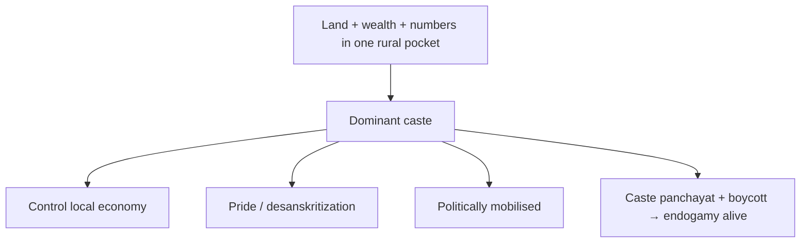

# 02 — Caste, Power and Reservation

### Lecture 2 — 10 September 2026

> **Date of Lecture:** 10 September 2026 (Lecture 2)  
> **Date Added:** 2026-09-10  
> **Source:** Vajiram & Ravi class + audio transcript + 6 handwritten notebook pages (dated **10/9/26**, circled **L**)  
> **Paper:** **GS-I (Mains)** — Indian Society / Social Issues. Reservation also feeds **GS-II** (social justice) later.  
> **Continues:** `01_Salient_Features_Indian_Society.md` (occupation map, Sanskritization, endogamy). **Caste and power** was parked there.  
> **Parked:** **untouchable identities** (next class); **50% ceiling** and March 2026 creamy-layer / Public Sector Undertaking (PSU) posts → **polity**.  
> **How to read class shortcuts:** full form on first use. Glossary at the end.

**Mains theme still:** will caste **live or die**? Today adds **power** (dominant caste), **Other Backward Classes (OBC)** / Mandal, and reservation as the State’s main **social-empowerment** tool.

---

## 1. Dominant caste — rural power (SOC-02-01)

Caste **can** be a source of power in **rural** areas. The class concept is **dominant caste**.

**Few castes in a particular rural region** become dominant over others **if** they are:

1. **Landowners**  
2. **Rich** (main wealth = **high-priced land**)  
3. **Numerical strength** (large population **in that region**)

After independence, many **peasant** castes became dominant (land reform in Lecture 1: tenants become owners).

**Region, not the whole State.** Class examples:

| Caste | Where (class) |
|:---|:---|
| **Yadavs** | Uttar Pradesh (UP), Bihar, Haryana (HR) — **not** all of those States. Haryana lock: **Gurugram / Ahirwal** (majority population + most land + high land prices). |
| **Jats** | Parts of Haryana (**Panipat–Sonipat–Rohtak** belt); Rajasthan (RJ) **Jat belt** — **Bharatpur, Dholpur, Sikar**; **western UP** — **Hapur, Meerut, Bulandshahr**. |
| **Reddys** | Andhra Pradesh (AP). |
| **Patels** | Gujarat (GJ). |
| **Marathas** | Maharashtra (MH). |
| **Kurmi** | Bihar (BR). |
| **Gujjars** | Rajasthan; class: **Noida** is Gujjar-dominated. |

### Four features once a caste is dominant

1. They **control the economy of the region** — because they own the land. Rural lock: **land ownership** is the most important asset.  
2. They take **pride in their caste identity**. Lecture 1 Sanskritization = **desire + imitate** Upper Caste (UC). Dominant peasants **no longer** want UC / Varna validation. Class word: **desanskritization** (pride, not imitation). Caste **is** the source of power; they display it (number plates / names). **UC still name a Varna; dominant peasants will not.**  
3. They are **politically mobilised** — parties do not anger them because of **numbers**.  
4. They are **particular about caste rules**, especially **endogamy**. Enforcement: **caste panchayats**. Punishment for breaking the rule: **social boycott** (**hukka-pani band** — no talk, no water, no sale of goods, no help). That pressure keeps the rule alive and sets an example. Class: these **traditional institutions** keep caste **alive**. Same reason Indian villages are **closed systems** / **bunkers** (Lecture 1).

Dominant-caste idea is **still relevant**, **mostly in rural** areas. It has **lost relevance in urban** areas.

---

## 2. Caste in urban areas; caste associations (SOC-02-02)

Class wording: caste is **losing** relevance in urban areas — **not lost**.

**Losing (urban):**

- Caste and **occupation have dissociated**. You **cannot** read caste off the job. A Brahmin may be a doctor, engineer, Indian Administrative Service (IAS) officer, truck driver.  
- **Pure / impure** and the **stigma of untouchability** are hard to practise: **congestion** (high **density**) — metro, no one asks caste.  
- People prefer **privacy** / **anonymity**. Rural = everyone knows everyone; **image** matters; social boycott **hurts**. Urban anonymity weakens that.

**Still alive (urban):** **endogamy**. Same-caste marriage has **not** gone. Upper-caste × upper-caste (priestly / warrior / Baniya) happens; **UC × Lower Caste (LC)** marriage is **rarest of the rare**.

**Revive attempt — caste associations** (urban): Agarwal / Maheshwari / Khandelwal / Khatri / Jat *samaj*, etc. Only that caste joins. They:

- find **matrimonial alliances within caste** (WhatsApp / Facebook)  
- run **hostels**, **coaching**, **marriage gardens** (subsidised), **dharamshalas**, **schools**

Help is for **same-caste** members → **caste consciousness stays alive**.

---

## 3. Who are OBCs? Article 340 and Mandal (SOC-02-03)

Lecture 1 buckets **4–5** (peasant + artisan) = **OBC** in modern times: **manual / sweating** work, **not** ritually **impure**. Bucket **6** = untouchables / Scheduled Castes (SC) = work with **human / animal waste**.

**OBC is a post-independence idea.** At independence the Union already had **SC** and **Scheduled Tribe (ST)** lists from the British. **No OBC list.**

**Article 340:** **President** (= Government of India) **shall appoint a commission** to list **Socially and Educationally Backward Classes (SEBC)** — **not economically**.

| Year | Class lock |
|:---|:---|
| **1953** | First Backward Classes Commission under Art 340. Report **not accepted**. |
| **1978** | **Second** Backward Classes Commission = **Mandal Commission**. |
| **1931** | Mandal used the **last caste census** (Lecture 1). Listed groups that are **neither UC nor untouchable** (those two already had a path: UC do not need quota; SC already have SC reservation). Then **surveyed** each caste for **social + educational** status (manual labour → socially backward; majority not even **8th pass** → educationally backward). **Data**, not a guess. |
| **~60%** | Mandal’s observation: OBC share of population. |
| **27%** | Recommended reservation in **government jobs**. |
| **1980** | Mandal **submits** the report. |
| **1990** | Union **implements** it: **27%** for OBCs in **Central** government jobs. |

**SC 15% + ST 7.5% from 1950.** Adding OBC **27%** → total **49.5%**. General category protests → Supreme Court.

---

## 4. *Indra Sawhney* (1992) — creamy layer and sub-classification (SOC-02-04)

***Indra Sawhney v. Union of India* (1992).** Detail for **polity**; society locks:

1. Court **upheld** OBC reservation.  
2. **Guidelines for future reservation (Union and States):** give it **only** to groups that are **socially and educationally backward**, and **prove** backwardness with **survey data**. A new caste on the OBC list needs that data first — **not random**.  
3. State **must identify creamy layer within OBCs** and **exclude** it **before** giving OBC reservation. Creamy layer is a **Supreme Court** idea from this case. **Not applicable to SC/ST** — **OBC only**. Court does **not** fix the exact test; **government** does. But the State **cannot** skip defining and excluding creamy layer.

**Creamy layer = families inside an OBC caste**, not “a caste inside OBC.” Families that are **socially and educationally forward** (star **social**). Examples class used: parents who are **IAS / Group A–B** officers, **constitutional posts** (e.g. Speaker), **judicial services**.

**Social status ≠ income.** Class pair:

- Father = government **driver** (not Group A/B) but family owns a lot of village land → **not** creamy layer on the social-status logic.  
- Father = **IAS** who gave away wealth → still **creamy layer** (status stays).

Income is a **proxy** mainly where there is **no** high-status government post. **PSU** creamy-layer fight (class: March **2026** SC) = make a **Group A / B equivalent post list**; today PSU children often fall under **income**. Full case in **polity**.

**Sub-classification** (= **sub-categorisation** = **reservation within reservation**): identify **more backward / extremely backward** castes **inside** OBC so the **less-backward** do not take almost all seats. Keywords: benefits **reach the last mile**; reservation becomes **effective and inclusive**; **no one left out**.

- **Creamy layer = must.** Sub-classification = **will of the government**.  
- **Centre has not** sub-classified the **central** OBC list. Many **States** have.  
- **2017:** Union appoints **Rohini Commission**. Report **2022:** about **15** OBC castes take **~90%** of the benefit → recommended **immediate** sub-classification. Union has **not** taken a stand. Argument: **no caste-census population** for the inner groups, so it cannot split the **27%**. Class hook: **2026** caste census may make numbers possible.

---

## 5. Two OBC lists vs one SC/ST list; casteisation of politics (SOC-02-05)

**OBC — two lists, independent:**

| List | From | Used for |
|:---|:---|:---|
| **Central list of OBCs** | Mandal; in play from **1990** | **Central** exams / Central jobs |
| **State list of OBCs** | Each State (Rajasthan, Karnataka, Tamil Nadu…) | **That State’s** civil services |

A caste can sit on **one, both, or neither**. Central does **not** auto-copy State (and the reverse).

**SC / ST — only one list:** **Central** list of SC and of ST. **States cannot** keep a separate SC/ST list or amend the Central list. The Central list is **categorised State-wise** (Rajasthan SCs, Haryana SCs…) because **caste identity varies by State** (Lecture 1: ST in one State need not be ST in another). **States still give SC/ST reservation**, but **on the Central list**. OBC State jobs use the **State** OBC list.

**After 1990:** OBC reservation → **fall of the Union government**, **rise of regional parties in North India** formed **on caste**. They **appeal for caste votes**.

| Party (class) | Appeal |
|:---|:---|
| **Samajwadi Party (SP)**, UP | **Yadavs** |
| **Rashtriya Janata Dal (RJD)**, Bihar | **Yadavs** |
| **Indian National Lok Dal (INLD)**, Haryana | **Jats** |

People started **voting their caste**, not only **casting their vote**. Tickets also on caste. Class name for the phase: **casteisation of politics** (after **1990**). **OBCs** remain the most relevant caste bloc in that story. Majority of MPs / MLAs in North India in this telling come from OBC.

---

## 6. Social empowerment = reservation; Article 15 / 16; equity (SOC-02-06)

**Chapter 4** of the Social Issues map (parked in Lecture 1): **social empowerment** = **social justice** = **social equality**. Highlight **social** — **not** economic or political empowerment as the heading.

Why India: **social inequality because of caste**. Biggest **tool in the State’s hands** = **reservation**.

| Article | Class lock |
|:---|:---|
| **[15](file:///c:/Users/nitee/OneDrive/Desktop/UPSE_Syllabus/Articles/Article_15.md)** | Right to **equality**: State shall **not** discriminate on **caste, religion, gender**. |
| **15(4)** | State **can** make **any special provision** (reservation, welfare) for **SC, ST, OBC** (treated as socially and educationally backward). |
| **[16](file:///c:/Users/nitee/OneDrive/Desktop/UPSE_Syllabus/Articles/Article_16.md)** | Equality in **public employment** — same non-discrimination. |
| **16(4)** | State **can** provide **reservation in public employment** for SC / ST / OBC. |

**15 / 16** say do not discriminate; **15(4) / 16(4)** say the State **can** discriminate. Why: these communities suffered **historic discrimination** because of caste (social exclusion, no education, no temple, no community resources). Their children start at a **historic disadvantage** and **cannot compete** on a flat field. Reservation = **level playing field**.

**Justice:**

- **Equals treated equally** = **principle of equality** (Arts 15 and 16).  
- **Unequals treated unequally** = **principle of equity** (Arts **15(4), 16(4)**). Also called **affirmative action** / **positive discrimination**.

Class picture: boys with full prep time vs married girls with half — the **same** paper is not justice; an easier paper for the disadvantaged = treating unequals unequally.

**Unequals in India = vulnerable sections (SPECS on the sheet):**

| | Who |
|:---|:---|
| **S**ocial | SC, ST, OBC |
| **P**hysical | **Old**, **children**, **Persons with Disabilities (PwD)** |
| **E**conomic | **Economically Weaker Sections (EWS)** |
| **G**ender | **Women**, **transgender** |

State response (same equity idea): **laws**, **caste lists**, **welfare**, **reservation**; bodies such as National Commission for Scheduled Castes (NCSC), National Commission for Scheduled Tribes (NCST), National Commission for Backward Classes (NCBC), National Commission for Women, child commission.

---

## 7. ALIVE answers — caste lives (SOC-02-07)

Class: write **average, to the point**. Intro / body / conclusion. Almost every caste PYQ is the **same story**.

**IBC frame** used in class:

| | |
|:---|:---|
| **I** | Caste has stayed **alive** from past to present; it did that by staying **flexible**. |
| **B** | **New identities:** occupation **dissociated** (esp. urban); reservation gave LC the labels **OBC** and **SC**. **Associational forms:** **caste associations** (urban), **caste panchayats** (rural), **caste parties**. |
| **C** | Consciousness is **not fading** → caste can **survive in the future**. |

**“Has caste lost relevance in multicultural India?” (class: 2020)**  
India is multicultural / diverse in **religion, language, ethnicity, tribe (R / L / E / T)** — and **caste**.  
**Still relevant:** **marriages** (endogamy), **politics**, **Indian villages (rural)**, **reservation**, **untouchability**.  
**Diluted:** **urban** (anonymity; occupation dissociated); **less relevant for UC**.  
**Future:** still relevant — especially while **reservation** exists.

**Fluid and static (class: 2023):** fluid = occupation can change; static = **birth**. Pressures that made caste flexible: urbanisation, migration, industrial / **service** economy, **reservation**. Reservation **also** keeps it **static**: quota is **by birth / caste**, and **no group wants to give the quota away**.

Three class “do you agree” lines (same logic):

1. **Reservation has made caste both fluid and static.** Fluid = LC change occupation / become doctors and engineers. Static = benefit **tied to caste by birth**.  
2. **Caste has lost relevance for UC but stays relevant for LC.** UC: occupation mixed, **not** politically mobilised the same way, **no** OBC/SC quota — caste mainly at **marriage**. LC: still often **caste occupation** in villages, **dominance / numbers**, **reservation**, **mobilisation**. UC “pride” in villages can show up as **atrocities** against LC.  
3. **Caste led to reservation; reservation now leads to caste.** Same as (1).

---

## 8. Goal of reservation; untouchability; Article 17 (SOC-02-08)

**Goal of reservation = social equality / social justice** — **not** economic or political justice as the **goal**.

**However:** reservation **immediately** gives **economic and political** mobility (Dalit becomes IAS → income and office). **Social** mobility **takes time** and **cannot** be reached **without** economic / political mobility. **Do not withdraw** the quota just because income / office arrived. A Dalit IAS may still face **bad postings / blocked promotions**. Social mobility is **hard to measure**; economic / political mobility **can** be measured. Class: reservation is a **necessary evil** — no quota, no path to social mobility.

**Untouchability (bucket 6 only).** Occupations tied to **human / animal waste**. Other castes emit waste but do not clean it; that work is assigned to “untouchables.” Daily contact → body treated as **impure**. **Impurity transfers by touch** → **social distancing** = **stigma of untouchability**. **OBCs are not** the typical victims of these **atrocities** — **untouchables** are.

**Public-life atrocities (handout):** no **community resources** (wells — a Dalit touch would “impure” the well for UC); no **temples** (even some OBC exclusion historically; Dalit entry = temple “impure”); no education → **socially and educationally backward** → reservation. **Residential segregation (rural):** buckets 1–5 in the **main settlement**; Dalits in a separate **Dalit village**. They must still enter the main settlement to clean waste. Class list of village rules (do not add extras): **beat drums** so others can go indoors; **upper body uncovered** so they are identified; **spit-pot**; **broom tied at the back** to erase footprints (spit / footprints treated as impure).

**Economic-life atrocities:** no market access; **unpaid / underpaid** labour; **extreme poverty** (class: stale / rotten food); cannot own property; **bonded labour** — nothing to mortgage except **the body**. **[Article 23](file:///c:/Users/nitee/OneDrive/Desktop/UPSE_Syllabus/Articles/Article_23.md)** abolishes bonded labour; class: it **continues**, victims still largely untouchables.

**Article 17:** bans untouchability **in all forms**. Constitution is law. **Lock:** **law is not an effective agent of social change in India** (modern law + **traditional** people and **traditional** enforcers; poor enforcement). In the **West**, people follow law even when unwatched. Art 17 did **not** end the practice; atrocities continue (class examples: naked parade, urine / excreta).

Two statutes **keeping Art 17 in view:**

| Law (class name) | What it is for |
|:---|:---|
| **Civil Rights Protection Act, 1955** | Entry to **public places** / **community resources** (temples). Easier in **urban anonymity**; **rural** still knows caste. |
| **Scheduled Castes and Scheduled Tribes (Prevention of Atrocities) Act, 1989** | Defines a **list of atrocities**. Class: **stringent** — **non-bailable** and **cognizable** (**arrest without warrant**) to **create fear**. Still **weak enforcement** (traditional mindset). Class also: the same stringency is **misused** by some Dalits to **blackmail / revenge** — dilute it and the shield dies; keep it and misuse stays. |

**Next class:** shedding **untouchable identities**.

### Update — 10 September 2026 (UPSC CSE Prelims 2023 + evening articles)

`CSE-2023-Q40` **missed** (`MST-069`). Statement-I holds: SC has read **Article 16(4)** reservation with **Article 335** (efficiency of administration). Statement-II fails: Art 335 does **not** define “efficiency.” He inverted both.

Articles misses (same SOC-02-06 cluster; **no extra Day-1**):

- `MST-073`: **15(4)** was **added** by the **1st Constitutional Amendment Act, 1951** after *Champakam Dorairajan* — not original 1950 text. **15(5)** = 93rd / education (except minority Art 30). **15(6)** = 103rd / EWS.
- `MST-074`: **16(3)** residence bar = **Parliament only**. A State Legislature cannot fix it.

Class locks that stay: **15 / 16** = equality; **15(4) / 16(4)** = equity.

---

## Abbreviations

| Short | Full |
|:---|:---|
| AP | Andhra Pradesh |
| BR | Bihar |
| EWS | Economically Weaker Sections |
| GJ | Gujarat |
| HR | Haryana |
| IAS | Indian Administrative Service |
| INLD | Indian National Lok Dal |
| LC | Lower caste |
| MH | Maharashtra |
| NCBC | National Commission for Backward Classes |
| NCSC | National Commission for Scheduled Castes |
| NCST | National Commission for Scheduled Tribes |
| OBC | Other Backward Classes |
| PCR | Civil Rights Protection Act, 1955 (class name) |
| PoA | SC/ST (Prevention of Atrocities) Act, 1989 |
| PSU | Public Sector Undertaking |
| PwD | Persons with Disabilities |
| RJ | Rajasthan |
| RJD | Rashtriya Janata Dal |
| SC | Scheduled Castes |
| SEBC | Socially and Educationally Backward Classes |
| SP | Samajwadi Party |
| ST | Scheduled Tribes |
| UC | Upper caste |
| UP | Uttar Pradesh |
| UT | Untouchability (class shorthand) |

<!-- 2026-09-10: Social Issues L2 — dominant caste / desanskritization, urban anonymity + associations, Art 340–Mandal–Indra Sawhney, two OBC lists, casteisation of politics, Art 15/16 equity, ALIVE answers, Art 17 / PCR 1955 / PoA 1989. Untouchable identities parked. One cluster SOC-02. -->
