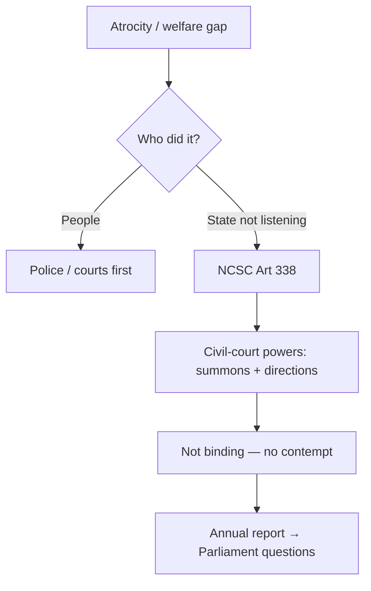
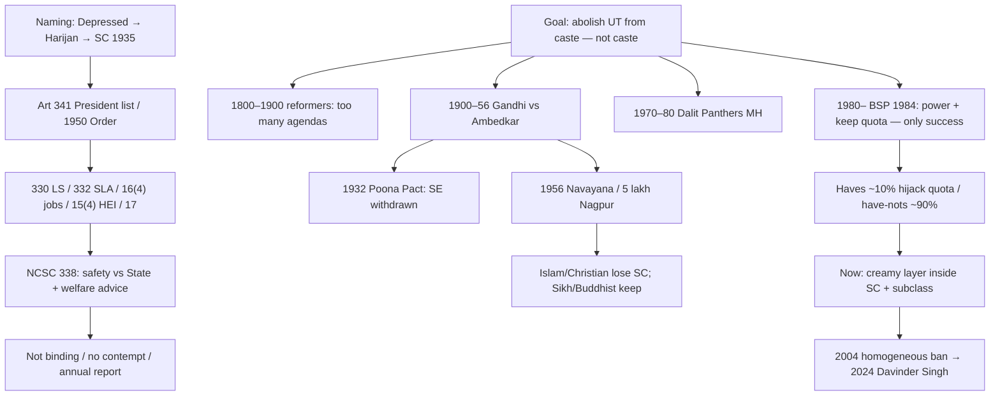

# 03 — Dalits, Scheduled Castes, and Untouchable Identities

### Lecture 3 — 12 September 2026

> **Date of Lecture:** 12 September 2026 (Lecture 3)  
> **Date Added:** 2026-09-12  
> **Source:** Vajiram & Ravi class + audio transcript + 4 handwritten notebook pages (dated **12/9/26**, circled **1–4**)  
> **Paper:** **GS-I (Mains)** — Indian Society / Social Issues. Reservation, commissions, and *Davinder Singh* also feed **GS-II**.  
> **Continues:** `02_Caste_Power_and_Reservation.md` (Lecture 2 parked **untouchable identities**).  
> **Already in notes (not restated as a new lecture):** *Indra Sawhney* creamy layer = **Other Backward Classes (OBC) only** (`SOC-02-04`); Art 17 / Civil Rights Protection Act, 1955 / Scheduled Castes and Scheduled Tribes (Prevention of Atrocities) Act, 1989 (`SOC-02-08`); Gandhi vs Ambedkar three heads on Modern India L7 (`MOD-B7-06`); Union affidavit vs income-based creamy layer in Scheduled Castes (SC) / Scheduled Tribes (ST) (`CA-260807-01`). **New facts only** sit here; extras are patched back.  
> **Parked:** **Tribes** (next class).  
> **How to read class shortcuts:** full form on first use. Glossary at the end.

**Mains lock still:** will caste live or die? Today is **who is an SC**, the **National Commission for Scheduled Castes (NCSC)**, why the **Dalit movement** changed its goal, **Gandhi vs Ambedkar** on untouchability from the Society desk, and why SC reservation now needs **creamy layer + sub-classification**.

---

## 1. What “Scheduled Caste” means (SOC-03-01)

**Scheduled Caste = a list of castes who will get the benefit of reservation.** It is **not** a schedule of the Constitution. India has **12** schedules; **none** of them is a list of untouchable castes. “Scheduled” here just means **list**.

The Constitution **does not define** the term Scheduled Caste. India **follows the British practice** of calling **untouchables** Scheduled Castes.

| Name (class) | When / who |
|:---|:---|
| **Untouchable** | Social stigma — bucket **6** (Lecture 1). |
| **Depressed Classes** | British label **before** the Government of India Act, 1935. |
| **Harijan** | **Gandhi’s** word (sheet). |
| **Dalit** | Political / movement identity. |
| **Scheduled Caste (SC)** | Official from **Government of India Act, 1935**. Class: **Simon Commission** first used the word; the **Act** puts it in official records. |

**Government of India Act, 1935** (class: **mini-constitution**; India governed under it **1935–1950**). Reservation was for **provincial elections**. British India was split into provinces (Bombay, Madras, Calcutta…). The Act gave **provincial autonomy** on the provincial list → elected provincial assemblies. Class picture: Bombay provincial assembly **100** seats → about **10** reserved for castes **on the list** = Scheduled Castes.

**Post-independence:** the Constitution of India **continues to refer** to untouchables as **Scheduled Castes**.

**Article 341:** **there shall be a central list of Scheduled Castes made by the President** (= Government of India).

Under Art 341 the Union passed the **Constitutional Order (central list of SC), 1950** — class also said **Act 1950**. **This order contains the list of castes to be treated as SCs for the benefit of reservation.**

SC reservation / protection (class tree):

| Head | Article / body |
|:---|:---|
| **Lok Sabha** elections | **Art 330** |
| **State Legislative Assemblies** | **Art 332** |
| **Public employment** | **[Art 16(4)](file:///c:/Users/nitee/OneDrive/Desktop/UPSE_Syllabus/Articles/Article_16.md)** — government jobs carry **huge social status** |
| **Higher education** (class: IIT / IIM / AIIMS) | **[Art 15(4)](file:///c:/Users/nitee/OneDrive/Desktop/UPSE_Syllabus/Articles/Article_15.md)** |
| **Abolition of untouchability** | **Art 17** (already Lecture 2) |
| **Safety and welfare** of SCs | **NCSC** — **Art 338** |

Class aside (already L2 **desanskritization**): Dalits were treated badly by **Shudras** too (peasant + artisan OBCs). Those groups now **delink from Varna** and try to claim **upper-Varna** status.

---

## 2. NCSC — safety and welfare (SOC-03-02)

**National Commission for Scheduled Castes (NCSC)** is a **constitutional body** under **Article 338**. Constitutional body = **mentioned in the Constitution**. Keywords class highlighted: **safety** and **welfare**.

**Same design** for:

| Body | Article | For |
|:---|:---|:---|
| **NCSC** | **338** | SC |
| **National Commission for Scheduled Tribes (NCST)** | **338A** | ST |
| **National Commission for Backward Classes (NCBC)** | **338B** | OBC |

Whatever is written here for NCSC is **exactly the same** for NCST and NCBC.

**Safety** = protection **against the State**. Dalits face **atrocities**. Upper castes occupy the **higher hierarchy inside government**. Police may commit **custodial torture**. Uniform is modern; the person wearing it is **traditional** (Lecture 1 lock: modern institutions, traditional people). If the **State** wrongs an untouchable, go to **NCSC**.

**Welfare** = **advice / recommendations** to Government of India **and** State governments on how to improve the **socio-economic condition** of SCs. Class: they **highlight problems** of SCs (do **not** write “research”). Fill a legal void; suggest a scheme.

**Grievance redressal.** Mostly used when the **State is not listening** (police will not register a complaint). A Dalit can also go straight to NCSC; class: NCSC will often say **file with the police first**. If people (not the State) commit an atrocity, **courts** are the usual path — NCSC is still available.

When NCSC hears a complaint it can act as a **civil court**:

- issue **summons** (class: even to the President)  
- issue **orders / directions to the State**

**Lock:** those **orders and recommendations are not binding** on the State. NCSC **does not have contempt-of-court powers**. Legislature + Executive = **State**. Judiciary (district / High Court / Supreme Court) is **not** “the State” in this telling; it checks L+E **because** its orders **are** binding — ignore them and you face **contempt** (criminal / jail). NCSC works *as* a civil court but **without** that contempt stick.

**Then why create it?** Because it is a **constitutional body**, the government **cannot easily ignore** it. NCSC places an **annual report before Parliament**: what it recommended / ordered, what the State followed, what it did not. **Opposition questions the government** on the floor. Same logic class listed for Comptroller and Auditor General of India (CAG), Union Public Service Commission (UPSC), NCST, NCBC.

---

## 3. Dalit movement in India — four phases (SOC-03-03)

A **social movement** = people in society start a movement to bring **social change**.

**Goal of the Dalit movement (class words):** **abolition of untouchability from the caste system** — **not** abolition of **caste**. (Ambedkar’s own programme is harsher; that is the next section.)

We still study untouchability **because the first three phases failed**. Sati’s abolition “succeeded,” so we do not study sati the same way.

| Phase | Years | Who / where | Goal | Class result |
|:---|:---|:---|:---|:---|
| **I** | **1800–1900** | **Social reformers** — Raja Ram Mohan Roy, Ishwar Chandra Vidyasagar, **Jyotirao Phule**. Prominent in **Bengal** | Abolition of UT was **one of many agendas** (sati, women’s rights, gender equality) | **Failed** — **too many agendas**, **no single focus** on UT |
| **II** | **1900–1956** | **Gandhi and Ambedkar** — entirely different ideologies. Prominent in **Maharashtra** | Abolition of UT | **Failed** |
| *Gap* | **1956–1970** | Ambedkar dies **1956** | — | **No leader → no Dalit movement** |
| **III** | **1970–1980** | **Dalit Panthers** (organisation, **Maharashtra**). Maharashtra = **hotbed** | Restart: Dalit rights / abolition of UT. Method of that time = **articles in newspapers** highlighting **atrocities** (today would be videos) | **Failed** |
| **IV** | **1980 onwards** | **Politicisation of Dalits.** **1984:** **Bahujan Samaj Party (BSP)** formed to **mobilise Dalit votes**. **Mayawati** — Dalit **Chief Minister of Uttar Pradesh (UP) four times** (first time such a post, class) | Goal **changes**. **No longer** abolition of UT. Only: **(1)** Dalits should **remain in power**; **(2)** Dalits should **continue to get the benefit of reservation** | **Only successful phase** — because the **goal changed** |

---

## 4. Gandhi vs Ambedkar on untouchability (SOC-03-04)

Modern India L7 already locked: both want UT **ended**; Gandhi **reforms** caste; Ambedkar **annihilates** it; 1956 Neo-Buddhism. **Society extras today:**

Ambedkar **did not like Gandhi intervening** in the Dalit movement. Ambedkar was himself a **Dalit**. An **upper-caste** person, he said, **cannot understand** the pain / atrocities.

| | **Gandhi** | **Ambedkar** |
|:---|:---|:---|
| Structure | Believes in **Varna / structure of caste** **without** **pure / impure** | **No caste, no Varna.** Entire structure should **collapse** — **casteless society** |
| What to abolish | **Untouchability from the caste system.** Caste **stays** | **Caste itself.** Book: ***Annihilation of Caste*** (complete destruction). Idea so **radical** no publisher would take it — **he published it himself and distributed it free** |
| Why caste exists | Caste = **division of labour**. No society survives long without dividing work | Caste is **division of people / labourers**, **not** division of **work** |
| India | **Land of villages**, **self-sufficient**. Needs **strict** division of labour: people **should not** be allowed to change occupation / caste. Village survival **depends on** survival of caste. India has **not** modernised; even if it urbanises it **cannot sustain** itself | **Urbanise.** Caste consciousness is **significantly less** in urban areas because of **anonymity + congestion** (Lecture 2). Urban areas offer **new occupations** for untouchables. **Villages are the breeding grounds of caste** |
| Electorates | **Against separate electorates** for Dalits | **In favour of separate electorates and reservation** for Dalits |
| Absorbing Dalits | Untouchability is **not in Varna**. Skill-develop Dalits so they can do any of the **four** Varna jobs and get **absorbed**. **Everyone cleans their own toilet** — no separate impure caste. Class true/false: Gandhi does **not** want Dalits into **modern education** as a Western / urban package — he wants a **land of villages** | Dalits must **fight for their rights**; separate electorates because Hindus **do not consider Dalits as Hindus** and **will not** look after their welfare |

**Varna debate (class, do not pick a side as fact):** some texts treat Varna as **merit / mobility**; **Gita / Mahabharata** (Drona will not train a non-Kshatriya; karma / *kartavya* assigned by birth) look **fixed by birth**. **Varna = theory in the Rig Veda, never practised.** **Caste** is practised from the **second half of the Later Vedic**. Hierarchy in the theory: Brahmin from the **head**, Kshatriya **arms**, Vaishya **thighs**, Shudra **feet** → Shudras as **servants**. **Nobody claims Shudra** today; peasants / artisans try other labels. Ambedkar’s *Who Were the Shudras?* was named, not taught.

### Separate electorates → Poona Pact, 1932

Just **listen** in class, then lock:

- **1906** Muslim League: Hindu voters elect Hindu leaders, Muslim voters elect Muslim leaders — **no cross-voting**.  
- **1909** British grant **separate electorates to Muslims**.  
- **1916 Lucknow Pact:** Congress **accepts** it. Class: accepting SE = accepting Hindus and Muslims as **fundamentally different** → a **blunder** on the road to **Partition**.  
- **1919** Ambedkar: split **Hindu** voters the same way — **Hindu / Dalit / Muslim**. Dalits elect Dalit leaders.  
- **1932 Macdonald Award:** British grant **separate electorates to Dalits**.  
- **Gandhi fast-unto-death.** Congress already blundered on Muslim SE; he will not accept a **second partition** (Dalits from Hindus). If Gandhi dies, **all Dalits** will be blamed → **communal riots**. Ambedkar comes under **immense pressure** (**Jinnah never did** — that is why Partition could be carried).  
- **Poona Pact, 1932:** Ambedkar **withdraws** SE. Class: a **big defeat** for Ambedkar **and** for Dalits; the **political movement** of Dalits is crushed.

**Why the reserved seat after Poona Pact is a trap.** British franchise = **property + education** → voters are mostly **upper caste**. **1935** provincial elections: Bombay **100** seats, **10** reserved for SCs — but **upper-caste voters elect** the Dalit candidate on that reserved seat → the MLA is **loyal to upper castes**, not to Dalits. **Dalit welfare is compromised.**

**After independence:** **universal adult franchise** — everyone votes, **equal value**. Dalits **get** voting rights they lacked under the British.

Sheet margin / class: **Mahad Satyagraha** (wells). Hindus warned Dalits not to repeat it or there would be **Hindu–Dalit riots**. Class: **no second Mahad**. Sheet also wrote **Kalaram** (do not invent the temple story).

---

## 5. Navayana, conversion, who keeps SC reservation (SOC-03-05)

**1956, Nagpur:** Ambedkar + about **5 lakh** Dalits convert to **Buddhism** in a mass ceremony; he dies the **same year**. He had **lost hope of reform inside Hinduism**.

He did **not** put them into **Hinayana / Mahayana / Vajrayana**. He founded a **new school / sect**: **Navayana** (**nava** = new, **yana** = vehicle). **Neo-Buddhist** = a Dalit who converted and follows Navayana.

| Navayana lock (class) | Not this |
|:---|:---|
| **Science is the God.** Worship **scientific temper**. Buddha himself **never believed in God** | Other schools **worship Buddha as God** (saints / temples) |
| **Against becoming a monk.** Work; use **science and education** to **change occupation** | Monk / stupa “tough life” of old schools |
| **Liberty, equality, fraternity.** **No caste** | Caste society |
| **Rational** school | Ritual |

**Rebirth** is common to Jainism, Buddhism, Hinduism. **Soul:** Jainism and Hinduism yes; Buddhism **no**. **Consciousness** (*man* / mind) sits in Buddhism and some Hindu schools; controlling the mind = controlling **material desire** → **moksha** = liberation from rebirth. Class: the three Indic religions are **close**; Jainism and Buddhism can be treated as **sects of Hinduism** for the **reservation** argument below.

**Old Buddhists** (class map): **Ladakh, Sikkim, Himachal Pradesh (HP)**. **Neo-Buddhists** = converted Dalits.

### Conversion over time — occupation often stays

Dalits converted to **Islam**, **Christianity**, **Sikhism**, then **Buddhism**, looking for **equality**. **Religion changed; occupation often did not** → **Dalit Muslim / Dalit Christian / Dalit Sikh** (class: **Valmiki Sikh**, **Mazhabi Sikh**) still readable from **work**. **Guru Nanak / Sikhism** talked **casteless society before Ambedkar**; caste **entered Sikhism anyway**.

**Reservation lock (Prelims):**

| Convert to | SC reservation | Else |
|:---|:---|:---|
| **Islam** or **Christianity** (**Abrahamic** — no caste / UT / rebirth in the theology; heaven–hell after death) | **Loses SC.** Government does **not** give SC status to Dalit Muslims / Dalit Christians | Can take **OBC** (there are OBC Muslims and OBC Christians) |
| **Sikhism** or **Buddhism** | **Keeps SC** | Class reason: treated as **sects of Hinduism**, not Abrahamic |

They **still face discrimination after conversion** (class: even seating in church). They **ask** for SC status; government **says no** — Abrahamic theology has **no caste**.

**Punjab:** **highest percentage** of Dalits — class **~32%** — because many converted to **Sikhism** for equality. Sikhism is **not delivering** that equality → **Christianity** is entering (Chandigarh outskirts, “Christian Baba” / fathers). **Unofficial** church-going while **official records stay Sikh or Hindu** = keep **SC reservation**. Official name-change / conversion → **lose** SC.

---

## 6. Present status of Dalits (SOC-03-06)

**Dalit movement is weak.** No one talks about **rights**; **absence of leaders**; Dalits are **split**.

| | **Dalit haves (~10%)** | **Dalit have-nots (~90%)** |
|:---|:---|:---|
| Where | **Urban** middle class | **Rural** |
| How | Reservation in **education + jobs**; **political power** (class: **Mayawati**, **Paswan**); constitutional posts (Speaker, MP, MLA); **Group A / B**, State services, civil services | Extreme **poverty**; **traditional occupation** still (manual scavenging, sweeping, cobbler, dhobi); **bonded labour** |
| Quota | **Hijack** almost all SC seats (coaching → competitive exams) | Cannot **mobilise** (improve economic status) because the quota never reaches them |

**SC reservation needs reforms** to make it **inclusive and effective** — benefits must reach **have-nots / more backward Dalits within Dalits**.

1. **Introduce creamy layer within SCs** (and STs). Still **missing** today; it **exists for OBCs**.  
   - Last class: reservation gives **immediate economic and political** mobility; **social** mobility **takes time**. A Dalit IAS **still faces social discrimination**. For **OBCs**, economic mobility **quickly brings** social mobility → those families are **socially forward** = creamy layer = **out**. For **SCs**, economic mobility **does not guarantee** social mobility → that is **why** creamy layer was **not** applied.  
   - **Today’s lock:** introduce it **anyway**, **not** because social equality has arrived, but so **have-nots** get the seats. Children of Dalit IAS officers taking the quota again **finish the have-nots’ opportunity**. Class: **Supreme Court has requested States to consider** creamy layer inside SC/ST. (Union affidavit still **opposes income-based** creamy layer — `CA-260807-01`. Do not merge the two.)

2. **Government should sub-classify the SC and ST lists** (Centre **and** States) — identify **more backward** castes inside SC/ST.

| Year | Court | Lock |
|:---|:---|:---|
| **2004** | Supreme Court | Sub-classification among SC/ST **not** allowed. Keyword: SC/ST are **homogeneous** (all suffer the **stigma of untouchability**). |
| **2024** | ***Davinder Singh v. State of Punjab*** | Sub-classification **is** allowed. SC/ST are **no longer homogeneous**. There are **more backward SCs within SCs**. |

**Hierarchy inside Dalits** (all Dalits suffer UT; **Dalits also practise UT** against scavenger sub-castes):

| Place | Class pair |
|:---|:---|
| **Punjab** | **Valmikis** = cobblers; **Mazhabis** = **manual scavengers**. Scavenger sub-caste = lowest. |
| **Tamil Nadu (TN)** | **Pallars** treat **Arunthathiyars** as untouchable because Arunthathiyars do **manual scavenging**. |
| **Bihar** | **Musahars** — landless **bonded** labourers; **Mahadalits**; class: **one graduate in 1 lakh**; **not allowed** to use **upper-caste cremation grounds**. |

STs: some tribes more backward than others — same sub-classification logic.

### Atrocities now

| | **Direct** | **Indirect** |
|:---|:---|:---|
| What | **Physical** harm | **Mental harassment** |
| Where | **Rural** | **Urban** — educational institutions |
| Class | Sexual exploitation of Dalit women (taken for granted; “they cannot raise their voice”). **Rajasthan:** Dalit boy **beaten to death** for drinking from an upper-caste teacher’s pot; **Thakur** village + separate **Dalit village**; children walk to the Thakur school (Right to Education). After death, Thakurs **warn the Dalit village not to file an FIR** or they will **burn** it — even other Dalits pressure the family. **No fear of law.** | **Stigma of reservation** in **IITs / Delhi University**: “not meritorious,” entered only by quota; teachers from UC also exclude; **suicides**. Rural stigma = **untouchability**; campus stigma = **reservation**. |

**PoA 1989** already on Lecture 2. Extra today: **false complaints** (law is **non-bailable + cognizable**) raise **hatred**; **dilute** it and **fear of law dies**. Stand: it **may** be misused by a hundred; if it **protects one**, **keep it**.

### Right wing / left wing (why it sits on this lecture)

Two families of ideology. **Right wing** in India **did not like Dalits** (class: **beef**). After **2014**, right-wing organisations started **Hinduisation of Dalits** (teach Hindu **rituals**, worship **cow**, stop **non-veg / alcohol**) because **Dalit votes** matter.

| | **Right wing** | **Left wing** |
|:---|:---|:---|
| Nation | **Nation is supreme** / **national supremacy**. Question the decision → **anti-national**. | State’s job is to protect **minorities / vulnerable**, not the majority. |
| Identity | **One nation, one identity.** In traditional India that identity = **Hindu** religion + **culture / customs** (**Hindutva**). Parallel class used: **Israel** as a land of **Jews**. | **Pro-change**; divide power; protect the vulnerable. |
| Economy | **Capitalist**; **ease** labour laws; labour exists to make the nation “great again.” | **Pro-labour**, **pro-vulnerable**, **pro-immigrant**. **Strong** labour law. |
| Status | Can be **status-quoist** (keep capitalists / majority on top) — **but right wing ≠ only status quo**. | Britain: **Labour** = left; **Conservatives** = right. |

Rise of the right: **India after 2014**; **Trump / MAGA** (“America for Americans,” jobs vs **immigrants**, less money for others / North Atlantic Treaty Organization (NATO)); **Germany** (class: **AfD** in local elections; first right-wing rise since Nazis). **Next class: tribes.**

---

## Knowledge graph — Lecture 3

---

## Abbreviations

| Short | Full |
|:---|:---|
| AfD | Class name for the German right-wing party in local elections (full German form not dictated) |
| BSP | Bahujan Samaj Party |
| CAG | Comptroller and Auditor General of India |
| GOI Act | Government of India Act, 1935 |
| HEI | Higher education institutions |
| HP | Himachal Pradesh |
| LS | Lok Sabha |
| MAGA | Make America Great Again (class Trump lock) |
| MH | Maharashtra |
| ML | Muslim League |
| NATO | North Atlantic Treaty Organization |
| NCBC | National Commission for Backward Classes |
| NCSC | National Commission for Scheduled Castes |
| NCST | National Commission for Scheduled Tribes |
| OBC | Other Backward Classes |
| PoA | SC/ST (Prevention of Atrocities) Act, 1989 |
| SC | Scheduled Castes |
| SE | Separate electorates |
| SLA | State Legislative Assembly |
| ST | Scheduled Tribes |
| TN | Tamil Nadu |
| UC | Upper caste |
| UP | Uttar Pradesh |
| UPSC | Union Public Service Commission |
| UT | Untouchability (class shorthand) |

<!-- 2026-09-12: Social Issues L3 — SC naming / Art 341 / 1950 Order; NCSC 338 civil court not binding; Dalit movement four phases; Gandhi vs Ambedkar + Poona Pact; Navayana + conversion reservation; haves/have-nots, creamy layer SC, Davinder Singh 2024, atrocities, right/left. Tribes parked. One cluster SOC-03. -->
